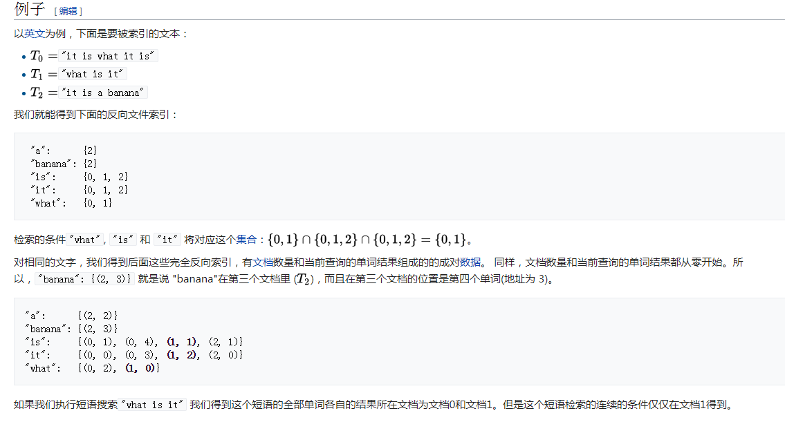

# Elasticsearch倒排索引

[Elasticsearch分别为每个field都建立了一个倒排索引，类似传统数据库的表字段全部建立了索引]

倒排索引（英语：Inverted index），也常被称为反向索引、置入档案或反向档案，是一种索引方法，
被用来存储在全文搜索下[某个单词]在一个文档或者一组文档中的存储位置的映射。它是文档检索系统中最常用的数据结构。

应用
- 反向索引数据结构是典型的搜索引擎检索算法重要的部分。
- 一个搜索引擎执行的目标就是优化查询的速度：找到某个单词在文档中出现的地方。
以前，正向索引开发出来用来存储每个文档的单词的列表，接着掉头来开发了一种反向索引。
正向索引的查询往往满足每个文档有序频繁的全文查询和每个单词在校验文档中的验证这样的查询。
- 实际上，时间、内存、处理器等等资源的限制，技术上正向索引是不能实现的。
- 为了替代正向索引的每个文档的单词列表，能列出每个查询的单词所有所在文档的列表的反向索引数据结构开发了出来。
- 随着反向索引的创建，如今的查询能通过立即的单词标示迅速获取结果（经过随机存储）。随机存储也通常被认为快于顺序存储。

实例：

# 1、什么是倒排索引?

假设有这么几条数据:

| ID | Name | Age | Sex |
| --- | --- | --- | --- | 
| 1 | Kate         | 24 | Female |
| 2 | John         | 24 | Male |
| 3 | Bill         | 29 | Male |

ID是Elasticsearch自建的文档id，那么Elasticsearch建立的索引如下:
Name:

| Term | Posting List |
| --- |:----:|
| Kate | 1 |
| John | 2 |
| Bill | 3 |

Age:

| Term | Posting List |
| --- |:----:|
| 24 | [1,2] |
| 29 | 3 |

Sex:

| Term | Posting List |
| --- |:----:|
| Female | 1 |
| Male | [2,3] |

[Posting List]
Elasticsearch分别为每个field都建立了一个倒排索引，Kate, John, 24, Female这些叫term，而[1,2]就是Posting List。
Posting list就是一个int的数组，存储了所有符合某个term的文档id。
通过posting list这种索引方式似乎可以很快进行查找，比如要找age=24的同学，爱回答问题的小明马上就举手回答：
我知道，id是1，2的同学。但是，如果这里有上千万的记录呢？如果是想通过name来查找呢？

[Term Dictionary]
Elasticsearch为了能快速找到某个term，将所有的term排个序，二分法查找term，logN的查找效率，就像通过字典查找一样，这就是Term Dictionary。
现在再看起来，似乎和传统数据库通过B-Tree的方式类似啊，为什么说比B-Tree的查询快呢？

[Term Index]
B-Tree通过减少磁盘寻道次数来提高查询性能，Elasticsearch也是采用同样的思路，直接通过内存查找term，不读磁盘，
但是如果term太多，term dictionary也会很大，放内存不现实，于是有了Term Index，就像字典里的索引页一样，A开头的有哪些term，分别在哪页，
可以理解term index是一颗树：

这棵树不会包含所有的term，它包含的是term的一些前缀。通过term index可以快速地定位到term dictionary的某个offset，然后从这个位置再往后顺序查找。

所以term index不需要存下所有的term，而仅仅是他们的一些前缀与Term Dictionary的block之间的映射关系，再结合FST(Finite State Transducers)的压缩技术，
可以使term index缓存到内存中。从term index查到对应的term dictionary的block位置之后，再去磁盘上找term，大大减少了磁盘随机读的次数。