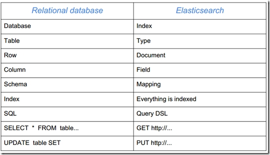
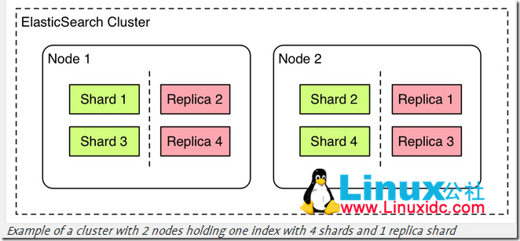

# elasticsearch概述

- [Elasticsearch学习笔记](https://juejin.im/post/5b9292b75188255c6b64eee5)
- [Elasticsearch 6.x 倒排索引与分词](https://juejin.im/post/5b799cf551882542f676daba)
- [[转]23个最有用的Elasticsearch检索技巧](https://juejin.im/post/5b7fe4a46fb9a019d92469a9)


<!-- TOC -->

- [elasticsearch概述](#elasticsearch概述)
- [使用案例](#使用案例)
- [Elasticsearch 与 Solr 的比较总结](#elasticsearch-与-solr-的比较总结)
- [ElasticSearch的工作机制](#elasticsearch的工作机制)
- [Elasticsearch的索引思路](#elasticsearch的索引思路)
- [elasticsearch基本接口使用](#elasticsearch基本接口使用)
    - [查看当前es上的所有索引](#查看当前es上的所有索引)
    - [查看elasticsearch集群状态](#查看elasticsearch集群状态)
    - [查看集群节点信息](#查看集群节点信息)
    - [查看节点进程信息](#查看节点进程信息)
    - [查看索引统计信息](#查看索引统计信息)
    - [查看指定索引统计信息](#查看指定索引统计信息)
    - [查看热点线程](#查看热点线程)
    - [查看指定索引信息](#查看指定索引信息)
    - [查看所有节点jvm信息](#查看所有节点jvm信息)
    - [查看指定节点jvm信息](#查看指定节点jvm信息)
    - [删除全部索引](#删除全部索引)
    - [删除指定索引](#删除指定索引)
    - [查看线程池配置](#查看线程池配置)

<!-- /TOC -->

Elasticsearch是一个基于 Lucene的实时的分布式搜索和分析引擎
DSL(domain special language)

[Elasticsearch最核心功能是搜索（倒排索引）]
Elasticsearch 是一个分布式可扩展的实时搜索和分析引擎,一个建立在全文搜索引擎 Apache Lucene(TM) 基础上的搜索引擎.
当然 Elasticsearch 并不仅仅是 Lucene 那么简单，它不仅包括了全文搜索功能，还可以进行以下工作:
- 分布式实时文件存储，并将每一个字段都编入索引，使其可以被搜索。
- 实时分析的分布式搜索引擎。
- 可以扩展到上百台服务器，处理PB级别的结构化或非结构化数据。

简易的将Elasticsearch和关系型数据术语对照表:

|关系数据库| 数据库 |  表  |   行  |   列(Columns) |
| ------ | ------ | ------ |------ | ------ | 
| Elasticsearch |  索引(Index) |  类型(type) |  文档(Docments) |  字段(Fields)|


# 使用案例
- 维基百科使用Elasticsearch来进行全文搜做并高亮显示关键词，以及提供search-as-you-type、did-you-mean等搜索建议功能。
- 英国卫报使用Elasticsearch来处理访客日志，以便能将公众对不同文章的反应实时地反馈给各位编辑。
- StackOverflow将全文搜索与地理位置和相关信息进行结合，以提供more-like-this相关问题的展现。
- GitHub使用Elasticsearch来检索超过1300亿行代码。
- 每天，Goldman Sachs使用它来处理5TB数据的索引，还有很多投行使用它来分析股票市场的变动。
但是Elasticsearch并不只是面向大型企业的，它还帮助了很多类似DataDog以及Klout的创业公司进行了功能的扩展。

# Elasticsearch 与 Solr 的比较总结
- 二者安装都很简单；
- Solr 利用 Zookeeper 进行分布式管理，而 Elasticsearch 自身带有分布式协调管理功能;
- Solr 支持更多格式的数据，而 Elasticsearch 仅支持json文件格式；
- Solr 官方提供的功能更多，而 Elasticsearch 本身更注重于核心功能，高级功能多有第三方插件提供；
- Solr 在传统的搜索应用中表现好于 Elasticsearch，但在处理实时搜索应用时效率明显低于 Elasticsearch。
- Solr 是传统搜索应用的有力解决方案，但 Elasticsearch 更适用于新兴的实时搜索应用。

# ElasticSearch的工作机制

| Relational DB |	Databases |	Tables |	Rows	 |   Columns |
|---|---|---|---|---|
|关系型数据库	| 数据库	  |   表     |    行	  |      列 |


|Elasticsearch	|Indices	|    Types	| Documents	| Fields |
|---|---|---|---|---|
|搜索引擎	    |索引	    | 类型	| 文档	| 域（字段）|


ElasticSearch，和Solr一样，是底层基于Apache Lucene，且具备高可靠性的企业级搜索引擎。
ElasticSearch中的一些概念其实和关系型数据库都有对应关系，比如[数据库]在ES中被称为[索引]，[表]在ES中被称作[Type]。
具体对应关系见下表。



ElasticSearch中的Replica是副本的意思，创建副本的好处有两个:
- 1、可以分流部分查询请求,
- 2、如果集群中的某个分片丢失了，就可以使用这个副本将数据全部找回来，因为这个原因，副本分片和源分片不会放在同一节点上。 

ES中每一个索引都可以被分成多个分片，但不一定每个分片都有副本，但是一旦创建了副本，就会有主分片的说法（作为复制源的分片），
分片和副本的数量可以在索引创建的时候指定。下图是副本和分片的示意图，分片和它的副本不会在同一个节点上。



在索引创建之后，你可以在任何时候动态地改变副本的数量，但是你事后不能改变分片的数量。  
默认情况下，Elasticsearch中的[每个索引被分片5个主分片和1套副本]，这意味着，如果你的集群中至少有两个节点，
你的索引将会有5个主分片和另外5个副本，这样的话每个索引总共就有10个分片。

当ES的一个节点启动后，它会通过广播方式找到集群中的其他节点，并且建立连接。
在集群中，其中的某个节点会被选取作为主节点，这个主节点负责管理集群状态。这个主节点对于用户来说是透明的，用户不需要知道哪个节点是主节点。
任何操作都可以发送到任何节点。必要的时候，任何节点可以并行的发送子查询到其他节点，并且将得到的响应合并后发送给用户，这些操作都不需要访问主节点。

主节点读取集群信息，在读取过程中，它会检测分片的情况，哪些分片是主分片，并且是可用的，在这一步之后，所有的分片已经准备好了，而副本还没有。
下一步的操作就是找到那些已经被复制过的分片，将他们作为副本。如果一切顺利，那么ES启动成功了，所有的分片和副本都已经准备好了。

在ES工作的时候，主节点会监控所有的节点是否正常，默认配置为：节点每隔1s主节点会发送1次心跳，超时时间为30s，测试次数为3次，超过3次，
则认为该节点同主节点已经脱离了。如果某一个节点出现问题，ES认为这个节点损坏，该节点会从集群中删除，并且ES会重新平衡整个集群。

ES通过Query DSL (基于json的查询语言)来查询数据，在ES内部，每次查询分成2个步骤:[分散和聚合]
- 分散是指查询所有相关的分片，
- 聚合是指把所有分片上的查询结果合并，排序，处理然后在返回给客户端。

ElasticSearch 有4中方式来构建数据库
- 最简单的方法是使用index API，将一个Document发送到特定的index，一般通过curl tools实现。
- 第二第三种方法是通过bulk API和UDP bulk API。两者的区别仅在于连接方式。
- 第四种方式是通过一个插件-river。river运行在ElasticSearch上，并且可以从外部数据库导入数据到ES中。
需要注意的是，数据构建仅在分片上进行，而不能在副本上进行。


# Elasticsearch的索引思路
[将磁盘里的东西尽量搬进内存]，减少磁盘随机读取次数(同时也利用磁盘顺序读特性)，结合各种奇技淫巧的压缩算法，用及其苛刻的态度使用内存。
所以，对于使用Elasticsearch进行索引时需要注意:
- 1、 不需要索引的字段，一定要明确定义出来，因为默认是自动建索引的
- 2、 同样的道理，对于String类型的字段，不需要analysis的也需要明确定义出来，因为默认也是会analysis的(分词)
- 3、 选择有规律的ID很重要，随机性太大的ID(比如java的UUID)不利于查询

关于最后一点，个人认为有多个因素:
其中一个(也许不是最重要的)因素: 上面看到的压缩算法，都是对Posting list里的大量ID进行压缩的，那如果ID是顺序的，
或者是有公共前缀等具有一定规律性的ID，压缩比会比较高；

另外一个因素: 可能是最影响查询性能的，应该是最后通过Posting list里的ID到磁盘中查找Document信息的那步，
因为Elasticsearch是分Segment存储的，根据ID这个大范围的Term定位到Segment的效率直接影响了最后查询的性能，
如果ID是有规律的，可以快速跳过不包含该ID的Segment，从而减少不必要的磁盘读次数


先说Elasticsearch的文件存储，Elasticsearch是面向文档型数据库，一条数据在这里就是一个文档，用JSON作为文档序列化的格式，比如下面这条用户数据：

{
    "name" :    "John",
    "sex" :      "Male",
    "age" :      25,
    "birthDate": "1990/05/01",
    "about" :    "I love to go rock climbing",
    "interests": [ "sports", "music" ]
}

一个 Elasticsearch 集群可以包含多个索引(数据库)，也就是说其中包含了很多类型(表)。这些类型中包含了很多的文档(行)，然后每个文档中又包含了很多的字段(列)。Elasticsearch的交互，可以使用Java API，也可以直接使用HTTP的Restful API方式，比如我们打算插入一条记录，可以简单发送一个HTTP的请求：

PUT /megacorp/employee/1 
{
    "name" :    "John",
    "sex" :      "Male",
    "age" :      25,
    "about" :    "I love to go rock climbing",
    "interests": [ "sports", "music" ]
}


更新，查询也是类似这 样的操作


# elasticsearch基本接口使用
elasticsearch 2.3.4-常用命令

| 功能 | 命令 |
| ------------- |:-------------------:|
| 查看集群状态 |	curl -XGET ‘http://localhost:9200/_cluster/health?pretty’|
| 列出节点信息 |	curl -XGET ‘http://localhost:9200/_cat/nodes?v’|
| 列出索引信息 |	curl -XGET ‘http://localhost:9200/_cat/indices?v’|
| 列出分片信息 |	curl -XGET ‘http://localhost:9200/_cat/shards?v’|
| 查看进程信息 |	curl -XGET ‘http://localhost:9200/_nodes/process?pretty’|
| 获取统计信息 |	curl -XGET ‘http://localhost:9200/_stats?pretty’|
| 获取统计信息-执行索引 |	curl -XGET ‘http://localhost:9200/productindex/_stats?pretty’|
| 热点线程 |	curl -XGET ‘http://localhost:9200/_nodes/hot_threads?pretty’|
| 每10sdump热点线程 |	curl -XGET ‘http://localhost:9200/_nodes/hot_threads?type=cpu&interval=10s’|
| 获取索引信息 |	curl -XGET ‘http://localhost:9200/productindex/_mapping?pretty’|
| 获取JVM信息 |	curl -XGET “http://localhost:9200/_nodes/stats/jvm?pretty”|
| 获取JVM信息-指定节点 |	curl -XGET “http://localhost:9200/_nodes/yoho.node.114/stats/jvm?pretty”|
| 删除全部索引 |	curl -XDELETE ‘http://localhost:9200/*?pretty’|
| 删除指定索引 |	curl -XDELETE ‘http://localhost:9200/storagesku?pretty’|
| 查看段信息 |	curl -XGET ‘http://localhost:9200/productindex/_segments’|
| 执行段合并 |	curl -XPOST ‘http://localhost:9200/productindex/_forcemerge?max_num_segments=1’|
| 查看线程池配置 |	curl -XGET “http://localhost:9200/_nodes/thread_pool/”|


## 查看当前es上的所有索引  
- curl -XGET "http://127.0.0.1:9200/_cat/indices"   　　 # 查看索引缩略信息
- curl -XGET "http://127.0.0.1:9200/_cat/indices?v"      　　# 查看索引详细信息

## 查看elasticsearch集群状态  
- curl -sXGET "http://127.0.0.1:9200/_cluster/health?pretty"

## 查看集群节点信息  
- curl -XGET "http://127.0.0.1:9200/_cat/nodes?v"

## 查看节点进程信息
- curl -XGET "http://127.0.0.1:9200/_nodes/process?pretty"

## 查看索引统计信息
- curl -XGET "http://127.0.0.1:9200/_stats?pretty"

## 查看指定索引统计信息
- curl -XGET "http://127.0.0.1:9200/索引名/_stats?pretty"
- curl -XGET "http://127.0.0.1:9200/logstash-2018.10.21/_stats?pretty"

## 查看热点线程
- curl -XGET "http://127.0.0.1:9200/_nodes/hot_threads?pretty"

## 查看指定索引信息
- curl -XGET "http://127.0.0.1:9200/索引名/_mapping?pretty"
- curl -XGET "http://127.0.0.1:9200/logstash-2018.10.21/_mapping?pretty"

## 查看所有节点jvm信息
- curl -XGET "http://127.0.0.1:9200/_nodes/stats/jvm?pretty" 

```java
C:\Users\lishuai29>curl -XGET "http://127.0.0.1:9200/_nodes/stats/jvm?pretty"
{
  "_nodes" : {
    "total" : 1,
    "successful" : 1,
    "failed" : 0
  },
  "cluster_name" : "my-application",
  "nodes" : {
    "5ySlLg46SWS-yMst7ap-gA" : {
      "timestamp" : 1545573783696,
      "name" : "node-1",
      "transport_address" : "100.124.17.33:9300",
      "host" : "100.124.17.33",
      "ip" : "100.124.17.33:9300",
      "roles" : [
        "master",
        "data",
        "ingest"
      ],
      "attributes" : {
        "ml.machine_memory" : "8096264192",
        "xpack.installed" : "true",
        "ml.max_open_jobs" : "20",
        "ml.enabled" : "true"
      },
      "jvm" : {
        "timestamp" : 1545573783698,
        "uptime_in_millis" : 588079,
        "mem" : {
          "heap_used_in_bytes" : 327901808,
          "heap_used_percent" : 31,
          "heap_committed_in_bytes" : 1038876672,
          "heap_max_in_bytes" : 1038876672,
          "non_heap_used_in_bytes" : 105728136,
          "non_heap_committed_in_bytes" : 114343936,
          "pools" : {
            "young" : {
              "used_in_bytes" : 130427712,
              "max_in_bytes" : 279183360,
              "peak_used_in_bytes" : 279183360,
              "peak_max_in_bytes" : 279183360
            },
            "survivor" : {
              "used_in_bytes" : 34865152,
              "max_in_bytes" : 34865152,
              "peak_used_in_bytes" : 34865152,
              "peak_max_in_bytes" : 34865152
            },
            "old" : {
              "used_in_bytes" : 162608944,
              "max_in_bytes" : 724828160,
              "peak_used_in_bytes" : 162608944,
              "peak_max_in_bytes" : 724828160
            }
          }
        },
        "threads" : {
          "count" : 46,
          "peak_count" : 57
        },
        "gc" : {
          "collectors" : {
            "young" : {
              "collection_count" : 8,
              "collection_time_in_millis" : 1282
            },
            "old" : {
              "collection_count" : 2,
              "collection_time_in_millis" : 168
            }
          }
        },
        "buffer_pools" : {
          "direct" : {
            "count" : 38,
            "used_in_bytes" : 135036121,
            "total_capacity_in_bytes" : 135036120
          },
          "mapped" : {
            "count" : 39,
            "used_in_bytes" : 89694091,
            "total_capacity_in_bytes" : 89694091
          }
        },
        "classes" : {
          "current_loaded_count" : 15250,
          "total_loaded_count" : 15250,
          "total_unloaded_count" : 0
        }
      }
    }
  }
}
```
 

## 查看指定节点jvm信息
- curl -XGET "http://127.0.0.1:9200/_nodes/节点名/stats/jvm?pretty"
- curl -XGET "http://127.0.0.1:9200/_nodes/searchnode-01/stats/jvm?pretty"


## 删除全部索引
- curl -XDELETE "http://127.0.0.1:9200/*?pretty" 

## 删除指定索引
- curl -XDELETE "http://127.0.0.1:9200/索引名?pretty"
- curl -XDELETE "http://127.0.0.1:9200/logstash-2018.10.19?pretty"
-  curl -XDELETE "http://127.0.0.1:9200/logstash-2018.10.19?pretty"
{
  "acknowledged" : true
}

删除历史索引思路 
1、取出要删除的索引名 
- curl -sXGET "http://127.0.0.1:9200/_cat/indices"|awk '{print $3}'|grep 2018.10    # 2018.10月的所有索引

2、 使用for循环调用接口删除之 
- for i in `curl -sXGET "http://127.0.0.1:9200/_cat/indices"|awk '{print $3}'|grep 2018.10`;do curl -XDELETE "http://127.0.0.1:9200/$i?pretty";done 

## 查看线程池配置
c- url -XGET "http://127.0.0.1:9200/_nodes/thread_pool/"  


