# Elasticsearch顶尖高手系列课程-核心知识篇


<!-- MarkdownTOC -->

- [第01节：课程介绍](#第01节课程介绍)
- [第02节：用大白话告诉你什么是Elasticsearch](#第02节用大白话告诉你什么是Elasticsearch)
- [第03节：Elasticsearch的功能、适用场景以及特点介绍](#第03节Elasticsearch的功能适用场景以及特点介绍)
- [第04节：手工画图剖析Elasticsearch核心概念：NRT、索引、分片、副本等](#第04节手工画图剖析Elasticsearch核心概念NRT索引分片副本等)
- [第05节：在windows上安装和启动Elasticseach](#第05节在windows上安装和启动Elasticseach)
- [第06节：快速入门案例实战之电商网站商品管理：集群健康检查，文档CRUD](#第06节快速入门案例实战之电商网站商品管理集群健康检查文档CRUD)
- [第07节：快速入门案例实战之电商网站商品管理：多种搜索方式](#第07节快速入门案例实战之电商网站商品管理多种搜索方式)
- [第08节：快速入门案例实战之电商网站商品管理：嵌套聚合，下钻分析，聚合分析](#第08节快速入门案例实战之电商网站商品管理嵌套聚合下钻分析聚合分析)
- [第09节：手工画图剖析Elasticsearch的基础分布式架构](#第09节手工画图剖析Elasticsearch的基础分布式架构)
- [第10节：shard&replica机制再次梳理以及单node环境中创建index图解](#第10节shardreplica机制再次梳理以及单node环境中创建index图解)
- [第11节：图解2个node环境下replica shard是如何分配的](#第11节图解2个node环境下replica-shard是如何分配的)
- [第12节：图解横向扩容过程，如何超出扩容极限，以及如何提升容错性](#第12节图解横向扩容过程如何超出扩容极限以及如何提升容错性)
- [第13节：图解Elasticsearch容错机制：master选举，replica容错，数据恢复](#第13节图解Elasticsearch容错机制master选举replica容错数据恢复)
- [第14节：初步解析document的核心元数据以及图解剖析index创建反例](#第14节初步解析document的核心元数据以及图解剖析index创建反例)
- [第15节：document id的手动指定与自动生成两种方式解析](#第15节document-id的手动指定与自动生成两种方式解析)
- [第16节：document的_source元数据以及定制返回结果解析](#第16节document的_source元数据以及定制返回结果解析)
- [第17节：document的全量替换、强制创建以及图解lazy delete机制](#第17节document的全量替换强制创建以及图解lazy-delete机制)
- [第18节：深度图解剖析Elasticsearch并发冲突问题](#第18节深度图解剖析Elasticsearch并发冲突问题)
- [第19节：深度图解剖析悲观锁与乐观锁两种并发控制方案](#第19节深度图解剖析悲观锁与乐观锁两种并发控制方案)
- [第20节：图解Elasticsearch内部如何基于_version进行乐观锁并发控制](#第20节图解Elasticsearch内部如何基于_version进行乐观锁并发控制)
- [第21节：上机动手实战演练基于_version进行乐观锁并发控制](#第21节上机动手实战演练基于_version进行乐观锁并发控制)
- [第22节：上机动手实战演练基于external version进行乐观锁并发控制](#第22节上机动手实战演练基于external-version进行乐观锁并发控制)
- [第23节：图解partial update实现原理以及动手实战演练](#第23节图解partial-update实现原理以及动手实战演练)
- [第24节：上机动手实战演练基于groovy脚本进行partial update](#第24节上机动手实战演练基于groovy脚本进行partial-update)
- [第25节：图解partial update乐观锁并发控制原理以及相关操作讲解](#第25节-图解partial-update乐观锁并发控制原理以及相关操作讲解)
- [第26节：上机动手实战演练mget批量查询api](#第26节上机动手实战演练mget批量查询api)
- [第27节：分布式文档系统_上机动手实战演练bulk批量增删改](#第27节分布式文档系统_上机动手实战演练bulk批量增删改)
- [第28节：分布式文档系统_阶段性总结以及什么是distributed document store](#第28节分布式文档系统_阶段性总结以及什么是distributed-document-store)
- [第29节：分布式文档系统_深度图解剖析document数据路由原理](#第29节分布式文档系统_深度图解剖析document数据路由原理)
- [第30节：分布式文档系统_document增删改内部原理图解揭秘](#第30节分布式文档系统_document增删改内部原理图解揭秘)
- [第31节：分布式文档系统_图解写一致性原理以及quorum机制深入剖析](#第31节分布式文档系统_图解写一致性原理以及quorum机制深入剖析)
- [第32节：分布式文档系统_document查询内部原理图解揭秘](#第32节分布式文档系统_document查询内部原理图解揭秘)
- [第33节：分布式文档系统_bulk api的奇特json格式与底层性能优化关系大揭秘](#第33节分布式文档系统_bulk-api的奇特json格式与底层性能优化关系大揭秘)
- [第34节：初识搜索引擎_search结果深入解析（search timeout机制揭秘）](#第34节初识搜索引擎_search结果深入解析search-timeout机制揭秘)
- [第35节：初识搜索引擎_multi-index&multi-type搜索模式解析以及搜索原理初步图解](#第35节初识搜索引擎_multi-indexmulti-type搜索模式解析以及搜索原理初步图解)
- [第36节：初识搜索引擎_分页搜索以及deep paging性能问题深度图解揭秘](#第36节初识搜索引擎_分页搜索以及deep-paging性能问题深度图解揭秘)
- [第37节：初识搜索引擎_快速掌握query string search语法以及_all metadata原理揭秘](#第37节初识搜索引擎_快速掌握query-string-search语法以及_all-metadata原理揭秘)
- [第38节：初识搜索引擎_用一个例子告诉你mapping到底是什么](#第38节初识搜索引擎_用一个例子告诉你mapping到底是什么)
- [第39节：初识搜索引擎_精确匹配与全文搜索的对比分析](#第39节初识搜索引擎_精确匹配与全文搜索的对比分析)
- [第40节：初识搜索引擎_倒排索引核心原理快速揭秘](#第40节初识搜索引擎_倒排索引核心原理快速揭秘)
- [第41节：初识搜索引擎_分词器的内部组成到底是什么，以及内置分词器的介绍](#第41节初识搜索引擎_分词器的内部组成到底是什么以及内置分词器的介绍)
- [第42节：初识搜索引擎_query string的分词以及mapping引入案例遗留问题的大揭秘](#第42节初识搜索引擎_query-string的分词以及mapping引入案例遗留问题的大揭秘)
- [第43节：初识搜索引擎_什么是mapping再次回炉透彻理解](#第43节初识搜索引擎_什么是mapping再次回炉透彻理解)
- [第44节：初识搜索引擎_mapping的核心数据类型以及dynamic mapping](#第44节初识搜索引擎_mapping的核心数据类型以及dynamic-mapping)
- [第45节：初识搜索引擎_手动建立和修改mapping以及定制string类型数据是否分词](#第45节初识搜索引擎_手动建立和修改mapping以及定制string类型数据是否分词)
- [第46节：初识搜索引擎_mapping复杂数据类型以及object类型数据底层结构大揭秘](#第46节初识搜索引擎_mapping复杂数据类型以及object类型数据底层结构大揭秘)
- [第47节：初识搜索引擎_search api的基础语法介绍](#第47节初识搜索引擎_search-api的基础语法介绍)
- [第48节：初识搜索引擎_快速上机动手实战Query DSL搜索语法](#第48节初识搜索引擎_快速上机动手实战Query-DSL搜索语法)
- [第49节：初识搜索引擎_filter与query深入对比解密：相关度，性能](#第49节初识搜索引擎_filter与query深入对比解密相关度性能)
- [第50节：初识搜索引擎_上机动手实战常用的各种query搜索语法](#第50节初识搜索引擎_上机动手实战常用的各种query搜索语法)
- [第51节：初识搜索引擎_上机动手实战多搜索条件组合查询](#第51节初识搜索引擎_上机动手实战多搜索条件组合查询)
- [第52节：初识搜索引擎_上机动手实战如何定位不合法的搜索以及其原因](#第52节初识搜索引擎_上机动手实战如何定位不合法的搜索以及其原因)
- [第54节：初识搜素引擎_上机动手实战如何定制搜索结果的排序规则](#第54节初识搜素引擎_上机动手实战如何定制搜索结果的排序规则)
- [第54节：初识搜索引擎_解密如何将一个field索引两次来解决字符串排序问题](#第54节初识搜索引擎_解密如何将一个field索引两次来解决字符串排序问题)
- [第55节：初识搜索引擎_相关度评分TF&IDF算法独家解密](#第55节初识搜索引擎_相关度评分TF&IDF算法独家解密)
- [第56节：初识搜索引擎_内核级知识点之doc value初步探秘](#第56节初识搜索引擎_内核级知识点之doc-value初步探秘)
- [第57节：初识搜索引擎_分布式搜索引擎内核解密之query phase](#第57节初识搜索引擎_分布式搜索引擎内核解密之query-phase)
- [第58节：初识搜索引擎_分布式搜索引擎内核解密之fetch phase](#第58节初识搜索引擎_分布式搜索引擎内核解密之fetch-phase)
- [第59节：初识搜索引擎_搜索相关参数梳理以及bouncing results问题解决方案](#第59节初识搜索引擎_搜索相关参数梳理以及bouncing-results问题解决方案)
- [第60：初识搜索引擎_上机动手实战基于scoll技术滚动搜索大量数据](#第60初识搜索引擎_上机动手实战基于scoll技术滚动搜索大量数据)
- [第61节：索引管理_快速上机动手实战创建、修改以及删除索引](#第61节索引管理_快速上机动手实战创建修改以及删除索引)
- [第62节：索引管理_快速上机动手实战修改分词器以及定制自己的分词器](#第62节索引管理_快速上机动手实战修改分词器以及定制自己的分词器)
- [第63节：索引管理_内核级知识点：深入探秘type底层数据结构](#第63节索引管理_内核级知识点深入探秘type底层数据结构)
- [第64节：索引管理_mapping root object深入剖析](#第64节索引管理_mapping-root-object深入剖析)
- [第65节：索引管理_定制化自己的dynamic mapping策略](#第65节索引管理_定制化自己的dynamic-mapping策略)
- [第66节：索引管理_复杂上机实验：基于scoll+bulk+索引别名实现零停机重建索引](#第66节索引管理_复杂上机实验基于scollbulk索引别名实现零停机重建索引)
- [第67节：内核原理探秘_倒排索引组成结构以及其索引可变原因揭秘](#第67节内核原理探秘_倒排索引组成结构以及其索引可变原因揭秘)
- [第68节：内核原理探秘_深度图解剖析document写入原理（buffer，segment，commit）](#第68节内核原理探秘_深度图解剖析document写入原理buffersegmentcommit）)
- [第69节：内核原理探秘_优化写入流程实现NRT近实时（filesystem cache，refresh）](#第69节内核原理探秘_优化写入流程实现NRT近实时filesystem-cacherefresh）)
- [第70节：内核原理探秘_继续优化写入流程实现durability可靠存储（translog，flush）](#第70节内核原理探秘_继续优化写入流程实现durability可靠存储translogflush)
- [第71节：内核原理探秘_最后优化写入流程实现海量磁盘文件合并（segment merge，optimize）](#第71节内核原理探秘_最后优化写入流程实现海量磁盘文件合并segment-mergeoptimize)
- [第72节：Java API初步使用_员工管理案例：基于Java实现员工信息的增删改查](#第72节Java-API初步使用_员工管理案例基于Java实现员工信息的增删改查)
- [第73节：Java API初步使用_员工管理案例：基于Java对员工信息进行复杂的搜索操作](#第73节Java-API初步使用_员工管理案例基于Java对员工信息进行复杂的搜索操作)
- [第74节：Java API初步使用_员工管理案例：基于Java对员工信息进行聚合分析](#第74节Java-API初步使用_员工管理案例基于Java对员工信息进行聚合分析)


<!-- /MarkdownTOC -->


## 第01节：课程介绍
课程大纲

1、讲师自我介绍

2、讲课风格介绍

3、课程内容介绍

---------------------------------------------------------------------------------------------------------------------------------------------

1、讲师自我介绍

- （1）中华石杉
- （2）BAT以及一线互联网公司出身，多年的大数据系统研发和架构经验，精通大数据技术栈，包括Hadoop，Spark，Storm，Hive，HBase，ZooKeeper，Elasticsearch，数据仓库，数据挖掘，大型Java系统架构，等等
- （3）之前有过丰富的大型视频课程录制经验（spark），以及丰富企业内部培训和技术讲座、技术分享的经验
- （4）Elastissearch技术，第一次合作

---------------------------------------------------------------------------------------------------------------------------------------------

2、讲课风格介绍

- （1）不喜欢ppt讲课，照本宣科，一本正经，对着文字和图片干讲 ----> txt文本边讲边写，画图软件手工画图
- （2）不喜欢学术型的讲课，一板一眼，像老师在上课 ----> 像朋友之间聊天一样，口语化，轻松话，用大白话式的方法来讲解复杂的技术
- （3）要录，就录最好的课程，知识体系全面；原理剖析透彻；全程实战演练驱动；搭配真实项目实战；讲解就业知识

---------------------------------------------------------------------------------------------------------------------------------------------

3、课程内容介绍

（1）核心知识篇

课程特点

- （1）使用最新Elasticsearch 5.2版本讲解，市面上的书籍和视频几乎都停留在2.x版本
- （2）深入浅出ES核心工作原理，全部手工画图讲解，完全不同于市面上已有视频的PPT讲解
- （3）涵盖Elasticsearch所有核心知识点，系统化，体系完整详细，有一定深度，包括完整Java开发示范
    - （3-1）全面的知识体系，包括了工作原理，文档管理，索引管理，搜索，聚合分析，分词，数据建模，Java API等知识
    - （3-2）知识足够深入和细节，完全秒杀市面上已有的书籍和视频，比如index segment merge原理，乐观锁并发控制，索引别名与零停机，相关度评分算法与定制，近似聚合算法，doc values与fielddata机制原理，父子关系数据建模，Java API执行scroll search等各种复杂操作，等等
- （4）全程每讲必练，大量的案例实战和上机实验，实战出真知，实战中学知识，没有任何一讲是干讲ppt的
- （5）包含一个实战项目，运用学到的知识，开发一个小型门户网站的搜索引擎和数据分析系统，运用ES几乎所有的核心知识，不像市面上的demo项目
- （6）课程学完之后，学员可以掌握es所有核心知识点，理解es核心原理，而且能够熟练动手操作所有学到的知识和功能，并且能够掌握ES集群的基本部署，并且基于Java开发一个适用于中小型企业的搜索引擎以及数据分析系统，达到学完即可上手到中小型项目中使用的程度

（2）高手进阶篇

课程特点

- （1）使用最新Elasticsearch 5.2版本讲解
- （2）包含市面上几乎没有的所有Elasticsearch高级知识点：包含地理位置搜索与聚合分析，term vector，suggester search，搜索模板定制，query执行剖析，数十种最全面的聚合分析，span query，shard分配定制，es插件开发，等等，高级的知识点，这些知识点，市面上已有的书籍或视频几乎都没有
- （3）全程每讲必练，大量的案例实战和上机实验
- （4）包含一个复杂实战项目，运用学到的知识，开发一个复杂的基于地理位置的智能餐厅app的搜索引擎和数据分析系统，运用ES从核心篇到高级篇的所有高阶知识点
- （5）课程学完之后，学员可以掌握es从核心到高阶的所有知识点，掌握完整的有深度的es知识体系，同时能够动手操作所有的知识点和功能，最后通过项目实战，能够在中小型公司中，基于Java开发一个可以基于地理位置进行搜索的高级搜索引擎，以及使用复杂聚合操作进行分析的高级实时数据分析系统

（3）大型集群运维优化篇

课程特点
- （1）最全面的Elasticsearch运维、管理、调优、故障处理的知识体系：企业级监控体系的搭建，企业级集群部署，集群日常管理策略，集群版本升级方案，集群基准压测方案，集群数据的备份和恢复，系统核心配置参数，性能调优方案，故障处理方案
- （2）全程每讲必练，大量上机实验，所有的运维、管理、部署、优化，全部上机实验
- （3）从零开始，逐步搭建出一个大型可扩展、高性能、监控体系完善、管理体系健全的分布式集群
- （4）学完课程之后，学员除了可以开发复杂的es搜索/分析系统之外，还可以掌握在任何一个公司里，从零开始搭建一个分布式的大型es集群，并制定完善的监控，运维，管理，优化等方案

（4）大型项目架构篇

课程特点
- （1）涵盖Elasticsearch目前最核心的两个应用领域，垂直搜索引擎，实时数据分析
- （2）开发出2个企业级的大型复杂项目，是完全真实的大型企业项目，电商搜索引擎，电商实时数据分析平台
    - （2-1）大型电商搜索引擎，包括了真正复杂的大型企业，大型项目的商业级搜索引擎架构，包括了检索、数据更新、排序、分词、query分析等各个核心模块，同时架构上实现了复杂的缓存机制，热启动机制，防雪崩机制，自动降级高可用机制，等等
    - （2-2）大型电商实时数据分析平台，完整、复杂而且大型的电商数据分析，包括了完善的数据分析指标体系（运营指标，流量指标，销售转化指标，客户价值指标，商品指标，营销指标，风险控制指标，市场竞争指标），一站式构建出复杂的，企业级的，电商领域数据分析平台
    - （2-3）之所以要单独拉出一篇做大型项目实战，是因为，之前几篇讲的项目，多是架构较为简单，业务也不复杂的项目，主要适用于中小型公司，而且那两个项目主要是集中在运用ES的技术本身来开发出需要的功能来（搜索/分析）。这一篇讲解的项目，重点是采用大公司的大型复杂项目作为背景，让同学可以掌握基于ES技术的大型项目架构能力，达到架构师的水平。比如说大型电商搜索引擎，主要运用ES来实现，但是ES之外还有大型系统的复杂架构需要讲解。还有大型的电商实时数据分析平台，主要特点是业务繁琐而且复杂，需要基于ES构建出大型的数据分析平台架构。
- （3）学完课程之后，学员在之前课程中掌握了es的企业级集群运维管理，复杂搜索引擎和数据分析引用开发的技术基础之上，现在可以运用所学知识，结合电商的领域知识，开发出业务真实而且复杂的，大型的搜索、分析等电商系统以及相关架构，彻底掌握运用ES和ELK相关技术栈在中大型企业中，开发大型项目架构的经验和能力

（5）ELK深入浅出篇

课程特点

- （1）电商系统日志检索平台，采用ELK技术栈，会详细讲解logstash和kibana两个技术，包括logstash的插件机制，监控方案，大规模扩展方案，升级方案，性能调优方案，kibana的可视化展现方案，同时讲解如何使用ELK技术栈开发出大规模日志存储与检索平台
- （2）最后，需要真正深入重点讲解logstash和kibana两门技术，并结合ES技术，采用ELK技术栈，实现大型企业级的日志采集和检索平台。
- （3）学完课程后，学员应该可以彻底精通ELK技术栈，并能够使用ELK技术栈快速搭建日志检索平台，以及数据可视化平台

---------------------------------------------------------------------------------------------------------------------------------------------

一句话，整套课程的设计思路是，将一个复杂而且很大的技术体系（Elasticsearch技术体系）拆解开来，循序渐进，从浅入深，逐步讲解。学员每学完一个篇章，就可以理解掌握到对应的技术能力，可以应用到现有工作中，或者是跳槽时的简历和面试中。如果学员最终学完整套系列课程，那么绝对可以达到Elasticsearch这门技术的顶尖高手程度。足以在任何大公司中进行Elasticsearch运维管理、复杂应用开发、大型系统架构，同时掌握最流行的ELK技术栈解决对应的海量日志检索以及数据可视化问题。

- [回到目录](#Elasticsearch顶尖高手系列课程-核心知识篇)

## 第02节：用大白话告诉你什么是Elasticsearch

课程大纲

大白话、什么是Elasticsearch

Elasticsearch，分布式，高性能，高可用，可伸缩的搜索和分析系统

- 1、什么是搜索？
- 2、如果用数据库做搜索会怎么样？
- 3、什么是全文检索、倒排索引和Lucene？
- 4、什么是Elasticsearch？

------------------------------------------------------------------------------------------------------------------------

> 1、什么是搜索？

百度：我们比如说想找寻任何的信息的时候，就会上百度去搜索一下，比如说找一部自己喜欢的电影，或者说找一本喜欢的书，或者找一条感兴趣的新闻（提到搜索的第一印象）
百度 != 搜索，这是不对的

垂直搜索（站内搜索）

互联网的搜索：电商网站，招聘网站，新闻网站，各种app

IT系统的搜索：OA软件，办公自动化软件，会议管理，日程管理，项目管理，员工管理，搜索“张三”，“张三儿”，“张小三”；有个电商网站，卖家，后台管理系统，搜索“牙膏”，订单，“牙膏相关的订单”

搜索，就是在任何场景下，找寻你想要的信息，这个时候，会输入一段你要搜索的关键字，然后就期望找到这个关键字相关的有些信息

------------------------------------------------------------------------------------------------------------------------

> 2、如果用数据库做搜索会怎么样？

做软件开发的话，或者对IT、计算机有一定的了解的话，都知道，数据都是存储在数据库里面的，比如说电商网站的商品信息，
招聘网站的职位信息，新闻网站的新闻信息，等等吧。所以说，很自然的一点，如果说从技术的角度去考虑，如何实现如说，
电商网站内部的搜索功能的话，就可以考虑，去使用数据库去进行搜索。

1、比方说，每条记录的指定字段的文本，可能会很长，比如说“商品描述”字段的长度，有长达数千个，甚至数万个字符，
这个时候，每次都要对每条记录的所有文本进行扫描，懒判断说，你包不包含我指定的这个关键词（比如说“牙膏”）

2、还不能将搜索词拆分开来，尽可能去搜索更多的符合你的期望的结果，比如输入“生化机”，就搜索不出来“生化危机”

用数据库来实现搜索，是不太靠谱的。通常来说，性能会很差的。


------------------------------------------------------------------------------------------------------------------------

> 3、什么是全文检索和Lucene？

（1）全文检索，倒排索引

（2）lucene，就是一个jar包，里面包含了封装好的各种建立倒排索引，以及进行搜索的代码，包括各种算法。
我们就用java开发的时候，引入lucene jar，然后基于lucene的api进行去进行开发就可以了。
用lucene，我们就可以去将已有的数据建立索引，lucene会在本地磁盘上面，给我们组织索引的数据结构。
另外的话，我们也可以用lucene提供的一些功能和api来针对磁盘上额


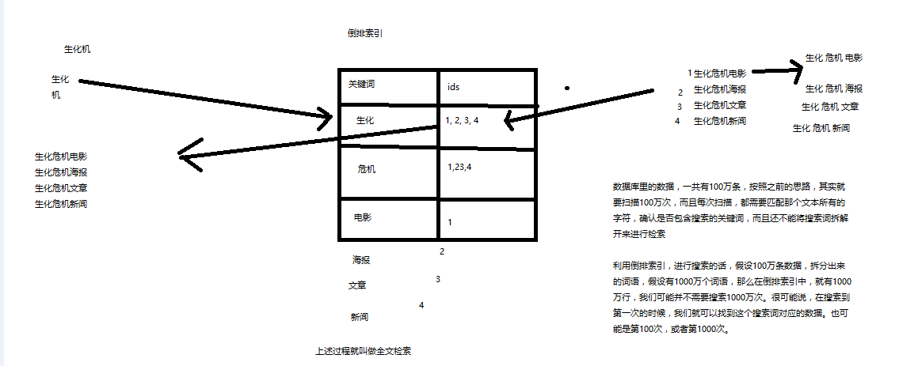

------------------------------------------------------------------------------------------------------------------------

> 4、什么是Elasticsearch？

（1）图解分析


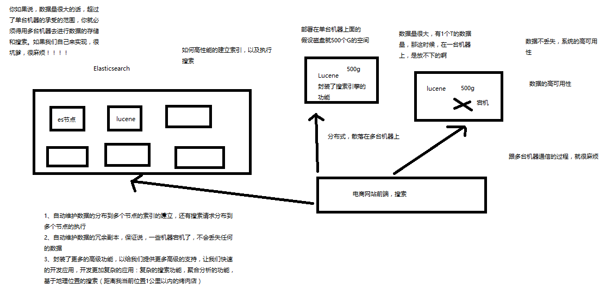


- [回到目录](#Elasticsearch顶尖高手系列课程-核心知识篇)

## 第03节：Elasticsearch的功能、适用场景以及特点介绍

> 课程大纲

- 1、Elasticsearch的功能，干什么的
- 2、Elasticsearch的适用场景，能在什么地方发挥作用
- 3、Elasticsearch的特点，跟其他类似的东西不同的地方在哪里

----------------------------------------------------------------------------------------------------------------------

> 1、Elasticsearch的功能

>> （1）分布式的搜索引擎和数据分析引擎

- 搜索：百度，网站的站内搜索，IT系统的检索
- 数据分析：电商网站，最近7天牙膏这种商品销量排名前10的商家有哪些；新闻网站，最近1个月访问量排名前3的新闻版块是哪些

分布式，搜索，数据分析

>>（2）全文检索，结构化检索，数据分析

- 全文检索：我想搜索商品名称包含牙膏的商品，select * from products where product_name like "%牙膏%"
- 结构化检索：我想搜索商品分类为日化用品的商品都有哪些，select * from products where category_id='日化用品'
部分匹配、自动完成、搜索纠错、搜索推荐
- 数据分析：我们分析每一个商品分类下有多少个商品，select category_id,count(*) from products group by category_id

>>（3）对海量数据进行近实时的处理

- 分布式：ES自动可以将海量数据分散到多台服务器上去存储和检索
- 海联数据的处理：分布式以后，就可以采用大量的服务器去存储和检索数据，自然而然就可以实现海量数据的处理了
- 近实时：检索个数据要花费1小时（这就不要近实时，离线批处理，batch-processing）；在秒级别对数据进行搜索和分析

跟分布式/海量数据相反的：lucene，单机应用，只能在单台服务器上使用，最多只能处理单台服务器可以处理的数据量

----------------------------------------------------------------------------------------------------------------------

> 2、Elasticsearch的适用场景

国外

- （1）维基百科，类似百度百科，牙膏，牙膏的维基百科，全文检索，高亮，搜索推荐
- （2）The Guardian（国外新闻网站），类似搜狐新闻，用户行为日志（点击，浏览，收藏，评论）+社交网络数据（对某某新闻的相关看法），数据分析，给到每篇新闻文章的作者，让他知道他的文章的公众反馈（好，坏，热门，垃圾，鄙视，崇拜）
- （3）Stack Overflow（国外的程序异常讨论论坛），IT问题，程序的报错，提交上去，有人会跟你讨论和回答，全文检索，搜索相关问题和答案，程序报错了，就会将报错信息粘贴到里面去，搜索有没有对应的答案
- （4）GitHub（开源代码管理），搜索上千亿行代码
- （5）电商网站，检索商品
- （6）日志数据分析，logstash采集日志，ES进行复杂的数据分析（ELK技术，elasticsearch+logstash+kibana）
- （7）商品价格监控网站，用户设定某商品的价格阈值，当低于该阈值的时候，发送通知消息给用户，比如说订阅牙膏的监控，如果高露洁牙膏的家庭套装低于50块钱，就通知我，我就去买
- （8）BI系统，商业智能，Business Intelligence。比如说有个大型商场集团，BI，分析一下某某区域最近3年的用户消费金额的趋势以及用户群体的组成构成，产出相关的数张报表，**区，最近3年，每年消费金额呈现100%的增长，而且用户群体85%是高级白领，开一个新商场。ES执行数据分析和挖掘，Kibana进行数据可视化

国内

- （9）国内：站内搜索（电商，招聘，门户，等等），IT系统搜索（OA，CRM，ERP，等等），数据分析（ES热门的一个使用场景）

----------------------------------------------------------------------------------------------------------------------

> 3、Elasticsearch的特点

- （1）可以作为一个大型分布式集群（数百台服务器）技术，处理PB级数据，服务大公司；也可以运行在单机上，服务小公司
- （2）Elasticsearch不是什么新技术，主要是将全文检索、数据分析以及分布式技术，合并在了一起，才形成了独一无二的ES；lucene（全文检索），商用的数据分析软件（也是有的），分布式数据库（mycat）
- （3）对用户而言，是开箱即用的，非常简单，作为中小型的应用，直接3分钟部署一下ES，就可以作为生产环境的系统来使用了，数据量不大，操作不是太复杂
- （4）数据库的功能面对很多领域是不够用的（事务，还有各种联机事务型的操作）；特殊的功能，比如全文检索，同义词处理，相关度排名，复杂数据分析，海量数据的近实时处理；Elasticsearch作为传统数据库的一个补充，提供了数据库所不不能提供的很多功能

- [回到目录](#Elasticsearch顶尖高手系列课程-核心知识篇)

## 第04节：手工画图剖析Elasticsearch核心概念：NRT、索引、分片、副本等

> 课程大纲
- 1、lucene和elasticsearch的前世今生
- 2、elasticsearch的核心概念
- 3、elasticsearch核心概念 vs. 数据库核心概念

----------------------------------------------------------------------------------------------------------------------------------------

> 1、lucene和elasticsearch的前世今生

lucene，最先进、功能最强大的搜索库，直接基于lucene开发，非常复杂，api复杂（实现一些简单的功能，写大量的java代码），需要深入理解原理（各种索引结构）

elasticsearch，基于lucene，隐藏复杂性，提供简单易用的restful api接口、java api接口（还有其他语言的api接口）

- （1）分布式的文档存储引擎
- （2）分布式的搜索引擎和分析引擎
- （3）分布式，支持PB级数据

开箱即用，优秀的默认参数，不需要任何额外设置，完全开源

关于elasticsearch的一个传说，有一个程序员失业了，陪着自己老婆去英国伦敦学习厨师课程。
程序员在失业期间想给老婆写一个菜谱搜索引擎，觉得lucene实在太复杂了，就开发了一个封装了lucene的开源项目，compass。
后来程序员找到了工作，是做分布式的高性能项目的，觉得compass不够，就写了elasticsearch，让lucene变成分布式的系统。

----------------------------------------------------------------------------------------------------------------------------------------

> 2、elasticsearch的核心概念


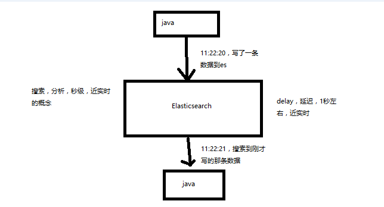

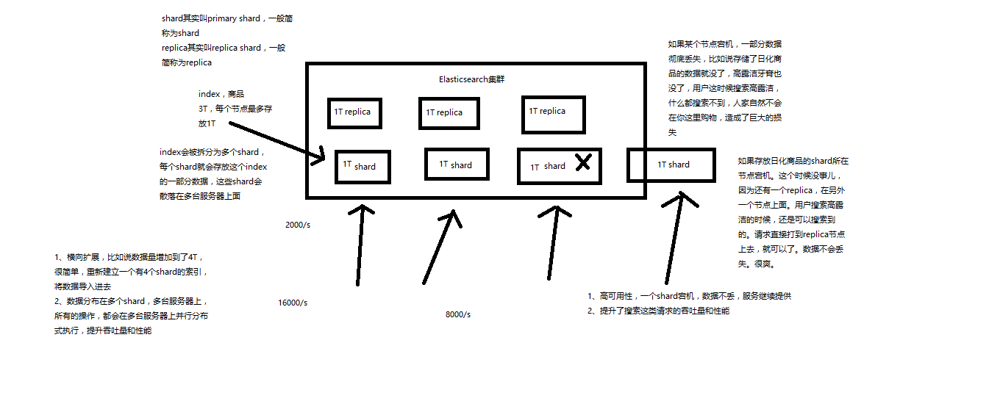

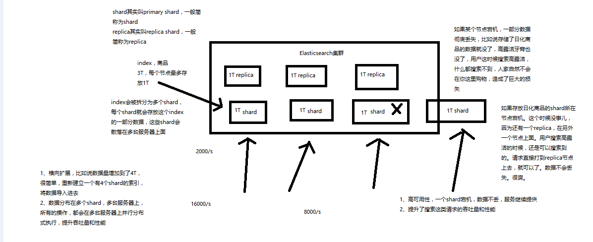


- （1）Near Realtime（NRT）：近实时，两个意思，从写入数据到数据可以被搜索到有一个小延迟（大概1秒）；基于es执行搜索和分析可以达到秒级

- （2）Cluster：集群，包含多个节点，每个节点属于哪个集群是通过一个配置（集群名称，默认是elasticsearch）来决定的，对于中小型应用来说，刚开始一个集群就一个节点很正常

- （3）Node：节点，集群中的一个节点，节点也有一个名称（默认是随机分配的），节点名称很重要（在执行运维管理操作的时候），默认节点会去加入一个名称为“elasticsearch”的集群，如果直接启动一堆节点，那么它们会自动组成一个elasticsearch集群，当然一个节点也可以组成一个elasticsearch集群

- （4）Document&field：文档，es中的最小数据单元，一个document可以是一条客户数据，一条商品分类数据，一条订单数据，通常用JSON数据结构表示，每个index下的type中，都可以去存储多个document。一个document里面有多个field，每个field就是一个数据字段。

product document

{
  "product_id": "1",
  "product_name": "高露洁牙膏",
  "product_desc": "高效美白",
  "category_id": "2",
  "category_name": "日化用品"
}

- （5）Index：索引，包含一堆有相似结构的文档数据，比如可以有一个客户索引，商品分类索引，订单索引，索引有一个名称。一个index包含很多document，一个index就代表了一类类似的或者相同的document。比如说建立一个product index，商品索引，里面可能就存放了所有的商品数据，所有的商品document。

- （6）Type：类型，每个索引里都可以有一个或多个type，type是index中的一个逻辑数据分类，一个type下的document，都有相同的field，比如博客系统，有一个索引，可以定义用户数据type，博客数据type，评论数据type。

商品index，里面存放了所有的商品数据，商品document

但是商品分很多种类，每个种类的document的field可能不太一样，比如说电器商品，可能还包含一些诸如售后时间范围这样的特殊field；生鲜商品，还包含一些诸如生鲜保质期之类的特殊field

type，日化商品type，电器商品type，生鲜商品type

日化商品type：product_id，product_name，product_desc，category_id，category_name

电器商品type：product_id，product_name，product_desc，category_id，category_name，service_period

生鲜商品type：product_id，product_name，product_desc，category_id，category_name，eat_period

每一个type里面，都会包含一堆document


```
{
  "product_id": "2",
  "product_name": "长虹电视机",
  "product_desc": "4k高清",
  "category_id": "3",
  "category_name": "电器",
  "service_period": "1年"
}


{
  "product_id": "3",
  "product_name": "基围虾",
  "product_desc": "纯天然，冰岛产",
  "category_id": "4",
  "category_name": "生鲜",
  "eat_period": "7天"
}
```

- （7）shard：单台机器无法存储大量数据，es可以将一个索引中的数据切分为多个shard，分布在多台服务器上存储。有了shard就可以横向扩展，存储更多数据，让搜索和分析等操作分布到多台服务器上去执行，提升吞吐量和性能。每个shard都是一个lucene index。

- （8）replica：任何一个服务器随时可能故障或宕机，此时shard可能就会丢失，因此可以为每个shard创建多个replica副本。replica可以在shard故障时提供备用服务，保证数据不丢失，多个replica还可以提升搜索操作的吞吐量和性能。primary shard（建立索引时一次设置，不能修改，默认5个），replica shard（随时修改数量，默认1个），默认每个索引10个shard，5个primary shard，5个replica shard，最小的高可用配置，是2台服务器。

----------------------------------------------------------------------------------------------------------------------------------------

> 3、elasticsearch核心概念 vs. 数据库核心概念

Elasticsearch			数据库

-----------------------------------------

Document			行
Type				表
Index				库


- [回到目录](#Elasticsearch顶尖高手系列课程-核心知识篇)


## 第05节：在windows上安装和启动Elasticseach

1、安装JDK，至少1.8.0_73以上版本，java -version

2、下载和解压缩Elasticsearch安装包，目录结构

3、启动Elasticsearch：bin\elasticsearch.bat，es本身特点之一就是开箱即用，如果是中小型应用，数据量少，操作不是很复杂，直接启动就可以用了

4、检查ES是否启动成功：http://localhost:9200/?pretty

name: node名称
cluster_name: 集群名称（默认的集群名称就是elasticsearch）
version.number: 5.2.0，es版本号

```
{
  "name" : "4onsTYV",
  "cluster_name" : "elasticsearch",
  "cluster_uuid" : "nKZ9VK_vQdSQ1J0Dx9gx1Q",
  "version" : {
    "number" : "5.2.0",
    "build_hash" : "24e05b9",
    "build_date" : "2017-01-24T19:52:35.800Z",
    "build_snapshot" : false,
    "lucene_version" : "6.4.0"
  },
  "tagline" : "You Know, for Search"
}


```

5、修改集群名称：elasticsearch.yml

6、下载和解压缩Kibana安装包，使用里面的开发界面，去操作elasticsearch，作为我们学习es知识点的一个主要的界面入口

7、启动Kibana：bin\kibana.bat

8、进入Dev Tools界面

9、GET _cluster/health


- [回到目录](#Elasticsearch顶尖高手系列课程-核心知识篇)

## 第06节：快速入门案例实战之电商网站商品管理：集群健康检查，文档CRUD

> 课程大纲
- 1、document数据格式
- 2、电商网站商品管理案例：背景介绍
- 3、简单的集群管理
- 4、商品的CRUD操作（document CRUD操作）

----------------------------------------------------------------------------------------------------------------------------

> 1、document数据格式

面向文档的搜索分析引擎

- （1）应用系统的数据结构都是面向对象的，复杂的
- （2）对象数据存储到数据库中，只能拆解开来，变为扁平的多张表，每次查询的时候还得还原回对象格式，相当麻烦
- （3）ES是面向文档的，文档中存储的数据结构，与面向对象的数据结构是一样的，基于这种文档数据结构，es可以提供复杂的索引，全文检索，分析聚合等功能
- （4）es的document用json数据格式来表达

```java
public class Employee {

  private String email;
  private String firstName;
  private String lastName;
  private EmployeeInfo info;
  private Date joinDate;

}

private class EmployeeInfo {
  
  private String bio; // 性格
  private Integer age;
  private String[] interests; // 兴趣爱好

}

EmployeeInfo info = new EmployeeInfo();
info.setBio("curious and modest");
info.setAge(30);
info.setInterests(new String[]{"bike", "climb"});

Employee employee = new Employee();
employee.setEmail("zhangsan@sina.com");
employee.setFirstName("san");
employee.setLastName("zhang");
employee.setInfo(info);
employee.setJoinDate(new Date());
```

employee对象：里面包含了Employee类自己的属性，还有一个EmployeeInfo对象

两张表：employee表，employee_info表，将employee对象的数据重新拆开来，变成Employee数据和EmployeeInfo数据

employee表：email，first_name，last_name，join_date，4个字段

employee_info表：bio，age，interests，3个字段；此外还有一个外键字段，比如employee_id，关联着employee表

```java
{
    "email":      "zhangsan@sina.com",
    "first_name": "san",
    "last_name": "zhang",
    "info": {
        "bio":         "curious and modest",
        "age":         30,
        "interests": [ "bike", "climb" ]
    },
    "join_date": "2017/01/01"
}
```

我们就明白了es的document数据格式和数据库的关系型数据格式的区别

----------------------------------------------------------------------------------------------------------------------------

> 2、电商网站商品管理案例背景介绍

有一个电商网站，需要为其基于ES构建一个后台系统，提供以下功能：

- （1）对商品信息进行CRUD（增删改查）操作
- （2）执行简单的结构化查询
- （3）可以执行简单的全文检索，以及复杂的phrase（短语）检索
- （4）对于全文检索的结果，可以进行高亮显示
- （5）对数据进行简单的聚合分析

----------------------------------------------------------------------------------------------------------------------------

> 3、简单的集群管理

>> （1）快速检查集群的健康状况

es提供了一套api，叫做cat api，可以查看es中各种各样的数据

GET /_cat/health?v

```java
epoch      timestamp cluster       status node.total node.data shards pri relo init unassign pending_tasks max_task_wait_time active_shards_percent
1488006741 15:12:21  elasticsearch yellow          1         1      1   1    0    0        1             0                  -                 50.0%

epoch      timestamp cluster       status node.total node.data shards pri relo init unassign pending_tasks max_task_wait_time active_shards_percent
1488007113 15:18:33  elasticsearch green           2         2      2   1    0    0        0             0                  -                100.0%

epoch      timestamp cluster       status node.total node.data shards pri relo init unassign pending_tasks max_task_wait_time active_shards_percent
1488007216 15:20:16  elasticsearch yellow          1         1      1   1    0    0        1             0                  -                 50.0%

```

如何快速了解集群的健康状况？green、yellow、red？

green：每个索引的primary shard和replica shard都是active状态的

yellow：每个索引的primary shard都是active状态的，但是部分replica shard不是active状态，处于不可用的状态

red：不是所有索引的primary shard都是active状态的，部分索引有数据丢失了

为什么现在会处于一个yellow状态？

我们现在就一个笔记本电脑，就启动了一个es进程，相当于就只有一个node。现在es中有一个index，就是kibana自己内置建立的index。
由于默认的配置是给每个index分配5个primary shard和5个replica shard，而且primary shard和replica shard不能在同一台机器上（为了容错）。
现在kibana自己建立的index是1个primary shard和1个replica shard。当前就一个node，所以只有1个primary shard被分配了和启动了，
但是一个replica shard没有第二台机器去启动。

做一个小实验：此时只要启动第二个es进程，就会在es集群中有2个node，然后那1个replica shard就会自动分配过去，然后cluster status就会变成green状态。

>>（2）快速查看集群中有哪些索引

```
GET /_cat/indices?v

health status index   uuid                   pri rep docs.count docs.deleted store.size pri.store.size
yellow open   .kibana rUm9n9wMRQCCrRDEhqneBg   1   1          1            0      3.1kb          3.1kb
```

>>（3）简单的索引操作

创建索引：PUT /test_index?pretty

```java
health status index      uuid                   pri rep docs.count docs.deleted store.size pri.store.size
yellow open   test_index XmS9DTAtSkSZSwWhhGEKkQ   5   1          0            0       650b           650b
yellow open   .kibana    rUm9n9wMRQCCrRDEhqneBg   1   1          1            0      3.1kb          3.1kb
```

删除索引：DELETE /test_index?pretty

```java
health status index   uuid                   pri rep docs.count docs.deleted store.size pri.store.size
yellow open   .kibana rUm9n9wMRQCCrRDEhqneBg   1   1          1            0      3.1kb          3.1kb
```

----------------------------------------------------------------------------------------------------------------------------

> 4、商品的CRUD操作

>> （1）新增商品：新增文档，建立索引

```java
PUT /index/type/id
{
  "json数据"
}

PUT /ecommerce/product/1
{
    "name" : "gaolujie yagao",
    "desc" :  "gaoxiao meibai",
    "price" :  30,
    "producer" :      "gaolujie producer",
    "tags": [ "meibai", "fangzhu" ]
}

{
  "_index": "ecommerce",
  "_type": "product",
  "_id": "1",
  "_version": 1,
  "result": "created",
  "_shards": {
    "total": 2,
    "successful": 1,
    "failed": 0
  },
  "created": true
}

PUT /ecommerce/product/2
{
    "name" : "jiajieshi yagao",
    "desc" :  "youxiao fangzhu",
    "price" :  25,
    "producer" :      "jiajieshi producer",
    "tags": [ "fangzhu" ]
}

PUT /ecommerce/product/3
{
    "name" : "zhonghua yagao",
    "desc" :  "caoben zhiwu",
    "price" :  40,
    "producer" :      "zhonghua producer",
    "tags": [ "qingxin" ]
}
```

es会自动建立index和type，不需要提前创建，而且es默认会对document每个field都建立倒排索引，让其可以被搜索

>> （2）查询商品：检索文档

GET /index/type/id

```java
GET /ecommerce/product/1

{
  "_index": "ecommerce",
  "_type": "product",
  "_id": "1",
  "_version": 1,
  "found": true,
  "_source": {
    "name": "gaolujie yagao",
    "desc": "gaoxiao meibai",
    "price": 30,
    "producer": "gaolujie producer",
    "tags": [
      "meibai",
      "fangzhu"
    ]
  }
}
```

>> （3）修改商品：替换文档

```java
PUT /ecommerce/product/1
{
    "name" : "jiaqiangban gaolujie yagao",
    "desc" :  "gaoxiao meibai",
    "price" :  30,
    "producer" :      "gaolujie producer",
    "tags": [ "meibai", "fangzhu" ]
}

{
  "_index": "ecommerce",
  "_type": "product",
  "_id": "1",
  "_version": 1,
  "result": "created",
  "_shards": {
    "total": 2,
    "successful": 1,
    "failed": 0
  },
  "created": true
}

{
  "_index": "ecommerce",
  "_type": "product",
  "_id": "1",
  "_version": 2,
  "result": "updated",
  "_shards": {
    "total": 2,
    "successful": 1,
    "failed": 0
  },
  "created": false
}


PUT /ecommerce/product/1
{
    "name" : "jiaqiangban gaolujie yagao"
}

```
替换方式有一个不好，即使必须带上所有的field，才能去进行信息的修改

>> （4）修改商品：更新文档

```java
POST /ecommerce/product/1/_update
{
  "doc": {
    "name": "jiaqiangban gaolujie yagao"
  }
}

{
  "_index": "ecommerce",
  "_type": "product",
  "_id": "1",
  "_version": 8,
  "result": "updated",
  "_shards": {
    "total": 2,
    "successful": 1,
    "failed": 0
  }
}
```

我的风格，其实有选择的情况下，不太喜欢念ppt，或者照着文档做，或者直接粘贴写好的代码，尽量是纯手敲代码

>> （5）删除商品：删除文档

```java
DELETE /ecommerce/product/1

{
  "found": true,
  "_index": "ecommerce",
  "_type": "product",
  "_id": "1",
  "_version": 9,
  "result": "deleted",
  "_shards": {
    "total": 2,
    "successful": 1,
    "failed": 0
  }
}

{
  "_index": "ecommerce",
  "_type": "product",
  "_id": "1",
  "found": false
}
```

- [回到目录](#Elasticsearch顶尖高手系列课程-核心知识篇)


## 第07节：快速入门案例实战之电商网站商品管理：多种搜索方式

> 课程大纲
- 1、query string search
- 2、query DSL
- 3、query filter
- 4、full-text search
- 5、phrase search
- 6、highlight search

---------------------------------------------------------------------------------------------------------------------------------

把英文翻译成中文，让我觉得很别扭，term，词项

> 1、query string search

搜索全部商品：GET /ecommerce/product/_search

took：耗费了几毫秒

timed_out：是否超时，这里是没有

_shards：数据拆成了5个分片，所以对于搜索请求，会打到所有的primary shard（或者是它的某个replica shard也可以）

hits.total：查询结果的数量，3个document

hits.max_score：score的含义，就是document对于一个search的相关度的匹配分数，越相关，就越匹配，分数也高

hits.hits：包含了匹配搜索的document的详细数据


```java
{
  "took": 2,
  "timed_out": false,
  "_shards": {
    "total": 5,
    "successful": 5,
    "failed": 0
  },
  "hits": {
    "total": 3,
    "max_score": 1,
    "hits": [
      {
        "_index": "ecommerce",
        "_type": "product",
        "_id": "2",
        "_score": 1,
        "_source": {
          "name": "jiajieshi yagao",
          "desc": "youxiao fangzhu",
          "price": 25,
          "producer": "jiajieshi producer",
          "tags": [
            "fangzhu"
          ]
        }
      },
      {
        "_index": "ecommerce",
        "_type": "product",
        "_id": "1",
        "_score": 1,
        "_source": {
          "name": "gaolujie yagao",
          "desc": "gaoxiao meibai",
          "price": 30,
          "producer": "gaolujie producer",
          "tags": [
            "meibai",
            "fangzhu"
          ]
        }
      },
      {
        "_index": "ecommerce",
        "_type": "product",
        "_id": "3",
        "_score": 1,
        "_source": {
          "name": "zhonghua yagao",
          "desc": "caoben zhiwu",
          "price": 40,
          "producer": "zhonghua producer",
          "tags": [
            "qingxin"
          ]
        }
      }
    ]
  }
}
```

query string search的由来，因为search参数都是以http请求的query string来附带的

搜索商品名称中包含yagao的商品，而且按照售价降序排序：GET /ecommerce/product/_search?q=name:yagao&sort=price:desc

适用于临时的在命令行使用一些工具，比如curl，快速的发出请求，来检索想要的信息；但是如果查询请求很复杂，是很难去构建的
在生产环境中，几乎很少使用query string search

---------------------------------------------------------------------------------------------------------------------------------

> 2、query DSL

DSL：Domain Specified Language，特定领域的语言

http request body：请求体，可以用json的格式来构建查询语法，比较方便，可以构建各种复杂的语法，比query string search肯定强大多了

查询所有的商品

```java
GET /ecommerce/product/_search
{
  "query": { "match_all": {} }
}
```

查询名称包含yagao的商品，同时按照价格降序排序

```java
GET /ecommerce/product/_search
{
    "query" : {
        "match" : {
            "name" : "yagao"
        }
    },
    "sort": [
        { "price": "desc" }
    ]
}
```

分页查询商品，总共3条商品，假设每页就显示1条商品，现在显示第2页，所以就查出来第2个商品

```java
GET /ecommerce/product/_search
{
  "query": { "match_all": {} },
  "from": 1,
  "size": 1
}
```

指定要查询出来商品的名称和价格就可以

```java
GET /ecommerce/product/_search
{
  "query": { "match_all": {} },
  "_source": ["name", "price"]
}
```

更加适合生产环境的使用，可以构建复杂的查询

---------------------------------------------------------------------------------------------------------------------------------

> 3、query filter

搜索商品名称包含yagao，而且售价大于25元的商品

```java
GET /ecommerce/product/_search
{
    "query" : {
        "bool" : {
            "must" : {
                "match" : {
                    "name" : "yagao" 
                }
            },
            "filter" : {
                "range" : {
                    "price" : { "gt" : 25 } 
                }
            }
        }
    }
}
```

---------------------------------------------------------------------------------------------------------------------------------

> 4、full-text search（全文检索）

```java
GET /ecommerce/product/_search
{
    "query" : {
        "match" : {
            "producer" : "yagao producer"
        }
    }
}
```

尽量，无论是学什么技术，比如说你当初学java，学linux，学shell，学javascript，学hadoop。。。。一定自己动手，特别是手工敲各种命令和代码，切记切记，减少复制粘贴的操作。只有自己动手手工敲，学习效果才最好。

producer这个字段，会先被拆解，建立倒排索引

```java
special		4
yagao		4
producer	1,2,3,4
gaolujie	1
zhognhua	3
jiajieshi	2
```

yagao producer ---> yagao和producer

```java
{
  "took": 4,
  "timed_out": false,
  "_shards": {
    "total": 5,
    "successful": 5,
    "failed": 0
  },
  "hits": {
    "total": 4,
    "max_score": 0.70293105,
    "hits": [
      {
        "_index": "ecommerce",
        "_type": "product",
        "_id": "4",
        "_score": 0.70293105,
        "_source": {
          "name": "special yagao",
          "desc": "special meibai",
          "price": 50,
          "producer": "special yagao producer",
          "tags": [
            "meibai"
          ]
        }
      },
      {
        "_index": "ecommerce",
        "_type": "product",
        "_id": "1",
        "_score": 0.25811607,
        "_source": {
          "name": "gaolujie yagao",
          "desc": "gaoxiao meibai",
          "price": 30,
          "producer": "gaolujie producer",
          "tags": [
            "meibai",
            "fangzhu"
          ]
        }
      },
      {
        "_index": "ecommerce",
        "_type": "product",
        "_id": "3",
        "_score": 0.25811607,
        "_source": {
          "name": "zhonghua yagao",
          "desc": "caoben zhiwu",
          "price": 40,
          "producer": "zhonghua producer",
          "tags": [
            "qingxin"
          ]
        }
      },
      {
        "_index": "ecommerce",
        "_type": "product",
        "_id": "2",
        "_score": 0.1805489,
        "_source": {
          "name": "jiajieshi yagao",
          "desc": "youxiao fangzhu",
          "price": 25,
          "producer": "jiajieshi producer",
          "tags": [
            "fangzhu"
          ]
        }
      }
    ]
  }
}
```

---------------------------------------------------------------------------------------------------------------------------------

> 5、phrase search（短语搜索）

跟全文检索相对应，相反，全文检索会将输入的搜索串拆解开来，去倒排索引里面去一一匹配，只要能匹配上任意一个拆解后的单词，就可以作为结果返回
phrase search，要求输入的搜索串，必须在指定的字段文本中，完全包含一模一样的，才可以算匹配，才能作为结果返回

```java
GET /ecommerce/product/_search
{
    "query" : {
        "match_phrase" : {
            "producer" : "yagao producer"
        }
    }
}

{
  "took": 11,
  "timed_out": false,
  "_shards": {
    "total": 5,
    "successful": 5,
    "failed": 0
  },
  "hits": {
    "total": 1,
    "max_score": 0.70293105,
    "hits": [
      {
        "_index": "ecommerce",
        "_type": "product",
        "_id": "4",
        "_score": 0.70293105,
        "_source": {
          "name": "special yagao",
          "desc": "special meibai",
          "price": 50,
          "producer": "special yagao producer",
          "tags": [
            "meibai"
          ]
        }
      }
    ]
  }
}
```

---------------------------------------------------------------------------------------------------------------------------------

> 6、highlight search（高亮搜索结果）

```java
GET /ecommerce/product/_search
{
    "query" : {
        "match" : {
            "producer" : "producer"
        }
    },
    "highlight": {
        "fields" : {
            "producer" : {}
        }
    }
}
```

- [回到目录](#Elasticsearch顶尖高手系列课程-核心知识篇)

## 第08节：快速入门案例实战之电商网站商品管理：嵌套聚合，下钻分析，聚合分析

> 第一个分析需求：计算每个tag下的商品数量

```java
GET /ecommerce/product/_search
{
  "aggs": {
    "group_by_tags": {
      "terms": { "field": "tags" }
    }
  }
}
```

将文本field的fielddata属性设置为true

```java
PUT /ecommerce/_mapping/product
{
  "properties": {
    "tags": {
      "type": "text",
      "fielddata": true
    }
  }
}

GET /ecommerce/product/_search
{
  "size": 0,
  "aggs": {
    "all_tags": {
      "terms": { "field": "tags" }
    }
  }
}

{
  "took": 20,
  "timed_out": false,
  "_shards": {
    "total": 5,
    "successful": 5,
    "failed": 0
  },
  "hits": {
    "total": 4,
    "max_score": 0,
    "hits": []
  },
  "aggregations": {
    "group_by_tags": {
      "doc_count_error_upper_bound": 0,
      "sum_other_doc_count": 0,
      "buckets": [
        {
          "key": "fangzhu",
          "doc_count": 2
        },
        {
          "key": "meibai",
          "doc_count": 2
        },
        {
          "key": "qingxin",
          "doc_count": 1
        }
      ]
    }
  }
}
```

----------------------------------------------------------------------------------------------------------------

> 第二个聚合分析的需求：对名称中包含yagao的商品，计算每个tag下的商品数量

```java
GET /ecommerce/product/_search
{
  "size": 0,
  "query": {
    "match": {
      "name": "yagao"
    }
  },
  "aggs": {
    "all_tags": {
      "terms": {
        "field": "tags"
      }
    }
  }
}
```

----------------------------------------------------------------------------------------------------------------

> 第三个聚合分析的需求：先分组，再算每组的平均值，计算每个tag下的商品的平均价格

```java
GET /ecommerce/product/_search
{
    "size": 0,
    "aggs" : {
        "group_by_tags" : {
            "terms" : { "field" : "tags" },
            "aggs" : {
                "avg_price" : {
                    "avg" : { "field" : "price" }
                }
            }
        }
    }
}

{
  "took": 8,
  "timed_out": false,
  "_shards": {
    "total": 5,
    "successful": 5,
    "failed": 0
  },
  "hits": {
    "total": 4,
    "max_score": 0,
    "hits": []
  },
  "aggregations": {
    "group_by_tags": {
      "doc_count_error_upper_bound": 0,
      "sum_other_doc_count": 0,
      "buckets": [
        {
          "key": "fangzhu",
          "doc_count": 2,
          "avg_price": {
            "value": 27.5
          }
        },
        {
          "key": "meibai",
          "doc_count": 2,
          "avg_price": {
            "value": 40
          }
        },
        {
          "key": "qingxin",
          "doc_count": 1,
          "avg_price": {
            "value": 40
          }
        }
      ]
    }
  }
}
```

----------------------------------------------------------------------------------------------------------------

> 第四个数据分析需求：计算每个tag下的商品的平均价格，并且按照平均价格降序排序

```java
GET /ecommerce/product/_search
{
    "size": 0,
    "aggs" : {
        "all_tags" : {
            "terms" : { "field" : "tags", "order": { "avg_price": "desc" } },
            "aggs" : {
                "avg_price" : {
                    "avg" : { "field" : "price" }
                }
            }
        }
    }
}
```

我们现在全部都是用es的restful api在学习和讲解es的所欲知识点和功能点，但是没有使用一些编程语言去讲解（比如java），原因有以下：

- 1、es最重要的api，让我们进行各种尝试、学习甚至在某些环境下进行使用的api，就是restful api。如果你学习不用es restful api，比如我上来就用java api来讲es，也是可以的，但是你根本就漏掉了es知识的一大块，你都不知道它最重要的restful api是怎么用的
- 2、讲知识点，用es restful api，更加方便，快捷，不用每次都写大量的java代码，能加快讲课的效率和速度，更加易于同学们关注es本身的知识和功能的学习
- 3、我们通常会讲完es知识点后，开始详细讲解java api，如何用java api执行各种操作
- 4、我们每个篇章都会搭配一个项目实战，项目实战是完全基于java去开发的真实项目和系统

----------------------------------------------------------------------------------------------------------------

> 第五个数据分析需求：按照指定的价格范围区间进行分组，然后在每组内再按照tag进行分组，最后再计算每组的平均价格

```java
GET /ecommerce/product/_search
{
  "size": 0,
  "aggs": {
    "group_by_price": {
      "range": {
        "field": "price",
        "ranges": [
          {
            "from": 0,
            "to": 20
          },
          {
            "from": 20,
            "to": 40
          },
          {
            "from": 40,
            "to": 50
          }
        ]
      },
      "aggs": {
        "group_by_tags": {
          "terms": {
            "field": "tags"
          },
          "aggs": {
            "average_price": {
              "avg": {
                "field": "price"
              }
            }
          }
        }
      }
    }
  }
}
```

- [回到目录](#Elasticsearch顶尖高手系列课程-核心知识篇)

## 第09节：手工画图剖析Elasticsearch的基础分布式架构

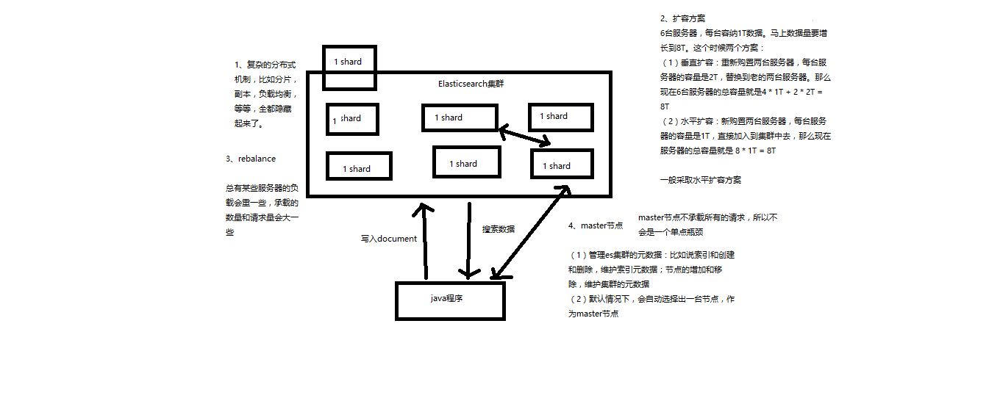

> 课程大纲
- 1、Elasticsearch对复杂分布式机制的透明隐藏特性
- 2、Elasticsearch的垂直扩容与水平扩容
- 3、增减或减少节点时的数据rebalance
- 4、master节点
- 5、节点对等的分布式架构

--------------------------------------------------------------------------------------------------------------------

> 1、Elasticsearch对复杂分布式机制的透明隐藏特性

Elasticsearch是一套分布式的系统，分布式是为了应对大数据量
隐藏了复杂的分布式机制

分片机制（我们之前随随便便就将一些document插入到es集群中去了，我们有没有care过数据怎么进行分片的，数据到哪个shard中去）

cluster discovery（集群发现机制，我们之前在做那个集群status从yellow转green的实验里，直接启动了第二个es进程，那个进程作为一个node自动就发现了集群，并且加入了进去，还接受了部分数据，replica shard）

shard负载均衡（举例，假设现在有3个节点，总共有25个shard要分配到3个节点上去，es会自动进行均匀分配，以保持每个节点的均衡的读写负载请求）

shard副本，请求路由，集群扩容，shard重分配

--------------------------------------------------------------------------------------------------------------------

> 2、Elasticsearch的垂直扩容与水平扩容

垂直扩容：采购更强大的服务器，成本非常高昂，而且会有瓶颈，假设世界上最强大的服务器容量就是10T，但是当你的总数据量达到5000T的时候，你要采购多少台最强大的服务器啊

水平扩容：业界经常采用的方案，采购越来越多的普通服务器，性能比较一般，但是很多普通服务器组织在一起，就能构成强大的计算和存储能力

普通服务器：1T，1万，100万
强大服务器：10T，50万，500万

扩容对应用程序的透明性

--------------------------------------------------------------------------------------------------------------------

> 3、增减或减少节点时的数据rebalance

保持负载均衡

--------------------------------------------------------------------------------------------------------------------

> 4、master节点

（1）创建或删除索引

（2）增加或删除节点

--------------------------------------------------------------------------------------------------------------------

> 5、节点平等的分布式架构

（1）节点对等，每个节点都能接收所有的请求

（2）自动请求路由

（3）响应收集

- [回到目录](#Elasticsearch顶尖高手系列课程-核心知识篇)


## 第10节：shard&replica机制再次梳理以及单node环境中创建index图解

> 课程大纲
- 1、shard&replica机制再次梳理
- 2、图解单node环境下创建index是什么样子的

------------------------------------------------------------------------------------------------

> 1、shard&replica机制再次梳理

- （1）index包含多个shard
- （2）每个shard都是一个最小工作单元，承载部分数据，lucene实例，完整的建立索引和处理请求的能力
- （3）增减节点时，shard会自动在nodes中负载均衡
- （4）primary shard和replica shard，每个document肯定只存在于某一个primary shard以及其对应的replica shard中，不可能存在于多个primary shard
- （5）replica shard是primary shard的副本，负责容错，以及承担读请求负载
- （6）primary shard的数量在创建索引的时候就固定了，replica shard的数量可以随时修改
- （7）primary shard的默认数量是5，replica默认是1，默认有10个shard，5个primary shard，5个replica shard
- （8）primary shard不能和自己的replica shard放在同一个节点上（否则节点宕机，primary shard和副本都丢失，起不到容错的作用），但是可以和其他primary shard的replica shard放在同一个节点上


------------------------------------------------------------------------------------------------

> 2、图解单node环境下创建index是什么样子的


- （1）单node环境下，创建一个index，有3个primary shard，3个replica shard
- （2）集群status是yellow
- （3）这个时候，只会将3个primary shard分配到仅有的一个node上去，另外3个replica shard是无法分配的
- （4）集群可以正常工作，但是一旦出现节点宕机，数据全部丢失，而且集群不可用，无法承接任何请求

```java
PUT /test_index
{
   "settings" : {
      "number_of_shards" : 3,
      "number_of_replicas" : 1
   }
}
```

- [回到目录](#Elasticsearch顶尖高手系列课程-核心知识篇)

##  第11节：图解2个node环境下replica shard是如何分配的

课程大纲

> 1、图解2个node环境下replica shard是如何分配的

- （1）replica shard分配：3个primary shard，3个replica shard，1 node
- （2）primary ---> replica同步
- （3）读请求：primary/replica


- [回到目录](#Elasticsearch顶尖高手系列课程-核心知识篇)

## 第12节：图解横向扩容过程，如何超出扩容极限，以及如何提升容错性

课程大纲

> 1、图解横向扩容过程，如何超出扩容极限，以及如何提升容错性

- （1）primary&replica自动负载均衡，6个shard，3 primary，3 replica
- （2）每个node有更少的shard，IO/CPU/Memory资源给每个shard分配更多，每个shard性能更好
- （3）扩容的极限，6个shard（3 primary，3 replica），最多扩容到6台机器，每个shard可以占用单台服务器的所有资源，性能最好
- （4）超出扩容极限，动态修改replica数量，9个shard（3primary，6 replica），扩容到9台机器，比3台机器时，拥有3倍的读吞吐量
- （5）3台机器下，9个shard（3 primary，6 replica），资源更少，但是容错性更好，最多容纳2台机器宕机，6个shard只能容纳0台机器宕机
- （6）这里的这些知识点，你综合起来看，就是说，一方面告诉你扩容的原理，怎么扩容，怎么提升系统整体吞吐量；另一方面要考虑到系统的容错性，怎么保证提高容错性，让尽可能多的服务器宕机，保证数据不丢失


- [回到目录](#Elasticsearch顶尖高手系列课程-核心知识篇)

## 第13节：图解Elasticsearch容错机制：master选举，replica容错，数据恢复

课程大纲

> 1、图解Elasticsearch容错机制：master选举，replica容错，数据恢复

- （1）9 shard，3 node
- （2）master node宕机，自动master选举，red
- （3）replica容错：新master将replica提升为primary shard，yellow
- （4）重启宕机node，master copy replica到该node，使用原有的shard并同步宕机后的修改，green

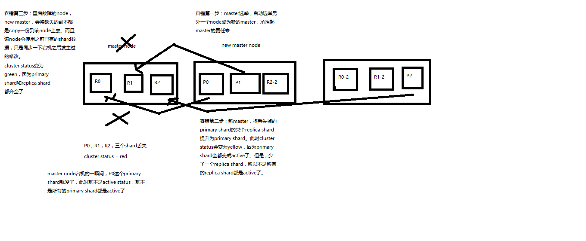


- [回到目录](#Elasticsearch顶尖高手系列课程-核心知识篇)

## 第14节：初步解析document的核心元数据以及图解剖析index创建反例

课程大纲

1、_index元数据

2、_type元数据

3、_id元数据

```
{
  "_index": "test_index",
  "_type": "test_type",
  "_id": "1",
  "_version": 1,
  "found": true,
  "_source": {
    "test_content": "test test"
  }
}
```

------------------------------------------------------------------------------------------------------------------------------------------

> 1、_index元数据

- （1）代表一个document存放在哪个index中
- （2）类似的数据放在一个索引，非类似的数据放不同索引：product index（包含了所有的商品），sales index（包含了所有的商品销售数据），inventory index（包含了所有库存相关的数据）。如果你把比如product，sales，human resource（employee），全都放在一个大的index里面，比如说company index，不合适的。
- （3）index中包含了很多类似的document：类似是什么意思，其实指的就是说，这些document的fields很大一部分是相同的，你说你放了3个document，每个document的fields都完全不一样，这就不是类似了，就不太适合放到一个index里面去了。
- （4）索引名称必须是小写的，不能用下划线开头，不能包含逗号：product，website，blog

> 2、_type元数据

- （1）代表document属于index中的哪个类别（type）
- （2）一个索引通常会划分为多个type，逻辑上对index中有些许不同的几类数据进行分类：因为一批相同的数据，可能有很多相同的fields，但是还是可能会有一些轻微的不同，可能会有少数fields是不一样的，举个例子，就比如说，商品，可能划分为电子商品，生鲜商品，日化商品，等等。
- （3）type名称可以是大写或者小写，但是同时不能用下划线开头，不能包含逗号

> 3、_id元数据

- （1）代表document的唯一标识，与index和type一起，可以唯一标识和定位一个document
- （2）我们可以手动指定document的id（put /index/type/id），也可以不指定，由es自动为我们创建一个id


- [回到目录](#Elasticsearch顶尖高手系列课程-核心知识篇)

## 第15节：document id的手动指定与自动生成两种方式解析

> 课程大纲

- 1、手动指定document id
- 2、自动生成document id

------------------------------------------------------------------------------------------------------------

> 1、手动指定document id

>> （1）根据应用情况来说，是否满足手动指定document id的前提：

一般来说，是从某些其他的系统中，导入一些数据到es时，会采取这种方式，就是使用系统中已有数据的唯一标识，作为es中document的id。举个例子，比如说，我们现在在开发一个电商网站，做搜索功能，或者是OA系统，做员工检索功能。这个时候，数据首先会在网站系统或者IT系统内部的数据库中，会先有一份，此时就肯定会有一个数据库的primary key（自增长，UUID，或者是业务编号）。如果将数据导入到es中，此时就比较适合采用数据在数据库中已有的primary key。

如果说，我们是在做一个系统，这个系统主要的数据存储就是es一种，也就是说，数据产生出来以后，可能就没有id，直接就放es一个存储，那么这个时候，可能就不太适合说手动指定document id的形式了，因为你也不知道id应该是什么，此时可以采取下面要讲解的让es自动生成id的方式。

>> （2）put /index/type/id

```java
PUT /test_index/test_type/2
{
  "test_content": "my test"
}

```

> 2、自动生成document id

>> （1）post /index/type

```java
POST /test_index/test_type
{
  "test_content": "my test"
}

{
  "_index": "test_index",
  "_type": "test_type",
  "_id": "AVp4RN0bhjxldOOnBxaE",
  "_version": 1,
  "result": "created",
  "_shards": {
    "total": 2,
    "successful": 1,
    "failed": 0
  },
  "created": true
}
```

>> （2）自动生成的id，长度为20个字符，URL安全，base64编码，GUID，分布式系统并行生成时不可能会发生冲突


- [回到目录](#Elasticsearch顶尖高手系列课程-核心知识篇)

## 第16节：document的_source元数据以及定制返回结果解析

课程大纲

> 1、_source元数据

```java
put /test_index/test_type/1
{
  "test_field1": "test field1",
  "test_field2": "test field2"
}

get /test_index/test_type/1

{
  "_index": "test_index",
  "_type": "test_type",
  "_id": "1",
  "_version": 2,
  "found": true,
  "_source": {
    "test_field1": "test field1",
    "test_field2": "test field2"
  }
}

```

_source元数据：就是说，我们在创建一个document的时候，使用的那个放在request body中的json串，默认情况下，在get的时候，会原封不动的给我们返回回来。

------------------------------------------------------------------------------------------------------------------

> 2、定制返回结果

定制返回的结果，指定_source中，返回哪些field

```java
GET /test_index/test_type/1?_source=test_field1,test_field2

{
  "_index": "test_index",
  "_type": "test_type",
  "_id": "1",
  "_version": 2,
  "found": true,
  "_source": {
    "test_field2": "test field2"
  }
}
```

[为什么返回的结果不包含test_field1？？？]


- [回到目录](#Elasticsearch顶尖高手系列课程-核心知识篇)

##  第17节：document的全量替换、强制创建以及图解lazy delete机制

课程大纲

- 1、document的全量替换
- 2、document的强制创建
- 3、document的删除

------------------------------------------------------------------------------------------------------------------------

> 1、document的全量替换

- （1）语法与创建文档是一样的，如果document id不存在，那么就是创建；如果document id已经存在，那么就是全量替换操作，替换document的json串内容
- （2）document是不可变的，如果要修改document的内容，第一种方式就是全量替换，直接对document重新建立索引，替换里面所有的内容
- （3）es会将老的document标记为deleted，然后新增我们给定的一个document，当我们创建越来越多的document的时候，es会在适当的时机在后台自动删除标记为deleted的document

------------------------------------------------------------------------------------------------------------------------

> 2、document的强制创建

- （1）创建文档与全量替换的语法是一样的，有时我们只是想新建文档，不想替换文档，如果强制进行创建呢？
- （2）PUT /index/type/id?op_type=create，PUT /index/type/id/_create

------------------------------------------------------------------------------------------------------------------------

> 3、document的删除

- （1）DELETE /index/type/id
- （2）不会理解物理删除，只会将其标记为deleted，当数据越来越多的时候，在后台自动删除


- [回到目录](#Elasticsearch顶尖高手系列课程-核心知识篇)

## 第18节：深度图解剖析Elasticsearch并发冲突问题

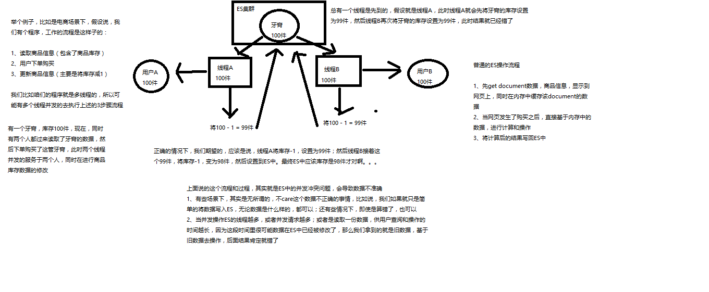


- [回到目录](#Elasticsearch顶尖高手系列课程-核心知识篇)

## 第19节：深度图解剖析悲观锁与乐观锁两种并发控制方案

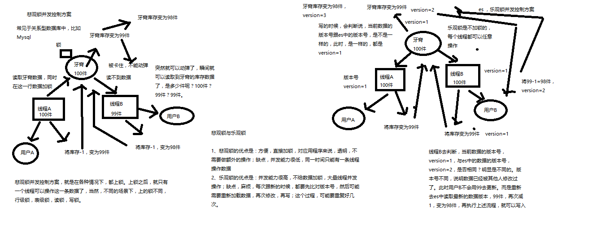


- [回到目录](#Elasticsearch顶尖高手系列课程-核心知识篇)


##  第20节：图解Elasticsearch内部如何基于_version进行乐观锁并发控制

课程大纲

> 1、图解Elasticsearch内部如何基于_version进行乐观锁并发控制

（1）_version元数据

```java
PUT /test_index/test_type/6
{
  "test_field": "test test"
}

{
  "_index": "test_index",
  "_type": "test_type",
  "_id": "6",
  "_version": 1,
  "result": "created",
  "_shards": {
    "total": 2,
    "successful": 1,
    "failed": 0
  },
  "created": true
}
```

第一次创建一个document的时候，它的_version内部版本号就是1；以后，每次对这个document执行修改或者删除操作，都会对这个_version版本号自动加1；哪怕是删除，也会对这条数据的版本号加1

```java
{
  "found": true,
  "_index": "test_index",
  "_type": "test_type",
  "_id": "6",
  "_version": 4,
  "result": "deleted",
  "_shards": {
    "total": 2,
    "successful": 1,
    "failed": 0
  }
}
```

我们会发现，在删除一个document之后，可以从一个侧面证明，它不是立即物理删除掉的，因为它的一些版本号等信息还是保留着的。先删除一条document，再重新创建这条document，其实会在delete version基础之上，再把version号加1

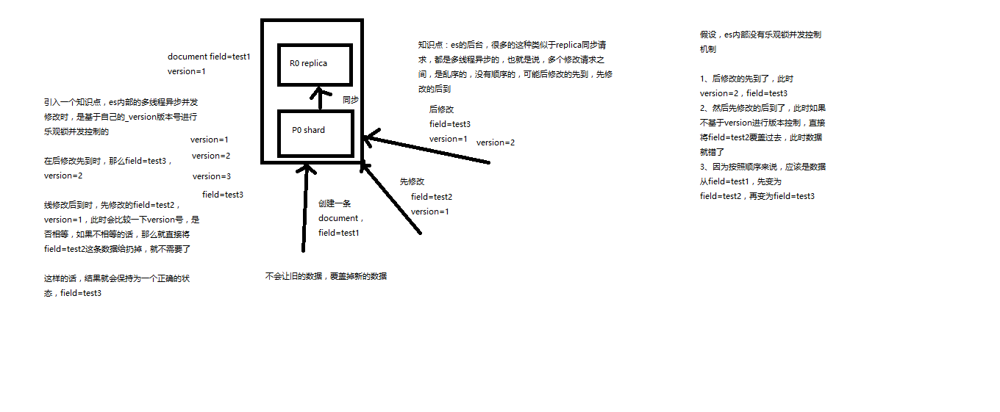


[并发修改时，如何保证各个线程的版本号的顺序呢？？？]

- [回到目录](#Elasticsearch顶尖高手系列课程-核心知识篇)


## 第21节：上机动手实战演练基于_version进行乐观锁并发控制

课程大纲

> 1、上机动手实战演练基于_version进行乐观锁并发控制

>> （1）先构造一条数据出来

```java
PUT /test_index/test_type/7
{
  "test_field": "test test"
}
```

>> （2）模拟两个客户端，都获取到了同一条数据

```java
GET test_index/test_type/7

{
  "_index": "test_index",
  "_type": "test_type",
  "_id": "7",
  "_version": 1,
  "found": true,
  "_source": {
    "test_field": "test test"
  }
}
```

>> （3）其中一个客户端，先更新了一下这个数据

同时带上数据的版本号，确保说，es中的数据的版本号，跟客户端中的数据的版本号是相同的，才能修改

```java
PUT /test_index/test_type/7?version=1 
{
  "test_field": "test client 1"
}

{
  "_index": "test_index",
  "_type": "test_type",
  "_id": "7",
  "_version": 2,
  "result": "updated",
  "_shards": {
    "total": 2,
    "successful": 1,
    "failed": 0
  },
  "created": false
}
```

>> （4）另外一个客户端，尝试基于version=1的数据去进行修改，同样带上version版本号，进行乐观锁的并发控制

```java
PUT /test_index/test_type/7?version=1 
{
  "test_field": "test client 2"
}

{
  "error": {
    "root_cause": [
      {
        "type": "version_conflict_engine_exception",
        "reason": "[test_type][7]: version conflict, current version [2] is different than the one provided [1]",
        "index_uuid": "6m0G7yx7R1KECWWGnfH1sw",
        "shard": "3",
        "index": "test_index"
      }
    ],
    "type": "version_conflict_engine_exception",
    "reason": "[test_type][7]: version conflict, current version [2] is different than the one provided [1]",
    "index_uuid": "6m0G7yx7R1KECWWGnfH1sw",
    "shard": "3",
    "index": "test_index"
  },
  "status": 409
}
```

>> （5）在乐观锁成功阻止并发问题之后，尝试正确的完成更新

```java
GET /test_index/test_type/7

{
  "_index": "test_index",
  "_type": "test_type",
  "_id": "7",
  "_version": 2,
  "found": true,
  "_source": {
    "test_field": "test client 1"
  }
}

```

基于最新的数据和版本号，去进行修改，修改后，带上最新的版本号，可能这个步骤会需要反复执行好几次，才能成功，特别是在多线程并发更新同一条数据很频繁的情况下

```java
PUT /test_index/test_type/7?version=2 
{
  "test_field": "test client 2"
}

{
  "_index": "test_index",
  "_type": "test_type",
  "_id": "7",
  "_version": 3,
  "result": "updated",
  "_shards": {
    "total": 2,
    "successful": 1,
    "failed": 0
  },
  "created": false
}

```

[是否是通过自旋的方式，获取最新的版本号，再去更新？？？]


- [回到目录](#Elasticsearch顶尖高手系列课程-核心知识篇)

## 第22节：上机动手实战演练基于external version进行乐观锁并发控制

课程大纲

> 1、上机动手实战演练基于external version进行乐观锁并发控制

external version

es提供了一个feature，就是说，你可以不用它提供的内部_version版本号来进行并发控制，可以基于你自己维护的一个版本号来进行并发控制。
举个列子，加入你的数据在mysql里也有一份，然后你的应用系统本身就维护了一个版本号，无论是什么自己生成的，程序控制的。
这个时候，你进行乐观锁并发控制的时候，可能并不是想要用es内部的_version来进行控制，而是用你自己维护的那个version来进行控制。

?version=1
?version=1&version_type=external

version_type=external，唯一的区别在于，_version，只有当你提供的version与es中的_version一模一样的时候，才可以进行修改，
只要不一样，就报错；当version_type=external的时候，只有当你提供的version比es中的_version大的时候，才能完成修改

es，_version=1，?version=1，才能更新成功

es，_version=1，?version>1&version_type=external，才能成功，比如说?version=2&version_type=external

>> （1）先构造一条数据

```java
PUT /test_index/test_type/8
{
  "test_field": "test"
}

{
  "_index": "test_index",
  "_type": "test_type",
  "_id": "8",
  "_version": 1,
  "result": "created",
  "_shards": {
    "total": 2,
    "successful": 1,
    "failed": 0
  },
  "created": true
}
```

>> （2）模拟两个客户端同时查询到这条数据

```java
GET /test_index/test_type/8

{
  "_index": "test_index",
  "_type": "test_type",
  "_id": "8",
  "_version": 1,
  "found": true,
  "_source": {
    "test_field": "test"
  }
}
```

>> （3）第一个客户端先进行修改，此时客户端程序是在自己的数据库中获取到了这条数据的最新版本号，比如说是2

```java
PUT /test_index/test_type/8?version=2&version_type=external
{
  "test_field": "test client 1"
}

{
  "_index": "test_index",
  "_type": "test_type",
  "_id": "8",
  "_version": 2,
  "result": "updated",
  "_shards": {
    "total": 2,
    "successful": 1,
    "failed": 0
  },
  "created": false
}
```

>> （4）模拟第二个客户端，同时拿到了自己数据库中维护的那个版本号，也是2，同时基于version=2发起了修改

```java
PUT /test_index/test_type/8?version=2&version_type=external
{
  "test_field": "test client 2"
}

{
  "error": {
    "root_cause": [
      {
        "type": "version_conflict_engine_exception",
        "reason": "[test_type][8]: version conflict, current version [2] is higher or equal to the one provided [2]",
        "index_uuid": "6m0G7yx7R1KECWWGnfH1sw",
        "shard": "1",
        "index": "test_index"
      }
    ],
    "type": "version_conflict_engine_exception",
    "reason": "[test_type][8]: version conflict, current version [2] is higher or equal to the one provided [2]",
    "index_uuid": "6m0G7yx7R1KECWWGnfH1sw",
    "shard": "1",
    "index": "test_index"
  },
  "status": 409
}
```

>> （5）在并发控制成功后，重新基于最新的版本号发起更新

```java
GET /test_index/test_type/8

{
  "_index": "test_index",
  "_type": "test_type",
  "_id": "8",
  "_version": 2,
  "found": true,
  "_source": {
    "test_field": "test client 1"
  }
}

PUT /test_index/test_type/8?version=3&version_type=external
{
  "test_field": "test client 2"
}

{
  "_index": "test_index",
  "_type": "test_type",
  "_id": "8",
  "_version": 3,
  "result": "updated",
  "_shards": {
    "total": 2,
    "successful": 1,
    "failed": 0
  },
  "created": false
}
```
- [回到目录](#Elasticsearch顶尖高手系列课程-核心知识篇)

##  第23节：图解partial update实现原理以及动手实战演练

课程大纲

> 1、什么是partial update？

PUT /index/type/id，创建文档&替换文档，就是一样的语法

一般对应到应用程序中，每次的执行流程基本是这样的：

- （1）应用程序先发起一个get请求，获取到document，展示到前台界面，供用户查看和修改
- （2）用户在前台界面修改数据，发送到后台
- （3）后台代码，会将用户修改的数据在内存中进行执行，然后封装好修改后的全量数据
- （4）然后发送PUT请求，到es中，进行全量替换
- （5）es将老的document标记为deleted，然后重新创建一个新的document

partial update

```java
post /index/type/id/_update 
{
   "doc": {
      "要修改的少数几个field即可，不需要全量的数据"
   }
}
```

看起来，好像就比较方便了，每次就传递少数几个发生修改的field即可，不需要将全量的document数据发送过去

> 2、图解partial update实现原理以及其优点

partial update，看起来很方便的操作，实际内部的原理是什么样子的，然后它的优点是什么


[优点没有讲明白？？？]

> 3、上机动手实战演练partial update

```java
PUT /test_index/test_type/10
{
  "test_field1": "test1",
  "test_field2": "test2"
}

POST /test_index/test_type/10/_update
{
  "doc": {
    "test_field2": "updated test2"
  }
}
```

- [回到目录](#Elasticsearch顶尖高手系列课程-核心知识篇)


## 第24节：上机动手实战演练基于groovy脚本进行partial update

> 课程大纲

- es，其实是有个内置的脚本支持的，可以基于groovy脚本实现各种各样的复杂操作

- 基于groovy脚本，如何执行partial update

- es scripting module，我们会在高手进阶篇去讲解，这里就只是初步讲解一下

```java
PUT /test_index/test_type/11
{
  "num": 0,
  "tags": []
}
```

>>（1）内置脚本

```java
POST /test_index/test_type/11/_update
{
   "script" : "ctx._source.num+=1"
}

{
  "_index": "test_index",
  "_type": "test_type",
  "_id": "11",
  "_version": 2,
  "found": true,
  "_source": {
    "num": 1,
    "tags": []
  }
}
```

>> （2）外部脚本

```java
ctx._source.tags+=new_tag

POST /test_index/test_type/11/_update
{
  "script": {
    "lang": "groovy", 
    "file": "test-add-tags",
    "params": {
      "new_tag": "tag1"
    }
  }
}
```

>> （3）用脚本删除文档

```java
ctx.op = ctx._source.num == count ? 'delete' : 'none'

POST /test_index/test_type/11/_update
{
  "script": {
    "lang": "groovy",
    "file": "test-delete-document",
    "params": {
      "count": 1
    }
  }
}
```

>> （4）upsert操作

```java
POST /test_index/test_type/11/_update
{
  "doc": {
    "num": 1
  }
}

{
  "error": {
    "root_cause": [
      {
        "type": "document_missing_exception",
        "reason": "[test_type][11]: document missing",
        "index_uuid": "6m0G7yx7R1KECWWGnfH1sw",
        "shard": "4",
        "index": "test_index"
      }
    ],
    "type": "document_missing_exception",
    "reason": "[test_type][11]: document missing",
    "index_uuid": "6m0G7yx7R1KECWWGnfH1sw",
    "shard": "4",
    "index": "test_index"
  },
  "status": 404
}

```
如果指定的document不存在，就执行upsert中的初始化操作；如果指定的document存在，就执行doc或者script指定的partial update操作

```java
POST /test_index/test_type/11/_update
{
   "script" : "ctx._source.num+=1",
   "upsert": {
       "num": 0,
       "tags": []
   }
}
```

- [回到目录](#Elasticsearch顶尖高手系列课程-核心知识篇)


## 第25节：图解partial update乐观锁并发控制原理以及相关操作讲解

课程大纲

- （1）partial update内置乐观锁并发控制
- （2）retry_on_conflict
- （3）_version

post /index/type/id/_update?retry_on_conflict=5&version=6


- [回到目录](#Elasticsearch顶尖高手系列课程-核心知识篇)


##  第26节：上机动手实战演练mget批量查询api

课程大纲

> 1、批量查询的好处

就是一条一条的查询，比如说要查询100条数据，那么就要发送100次网络请求，这个开销还是很大的
如果进行批量查询的话，查询100条数据，就只要发送1次网络请求，网络请求的性能开销缩减100倍

> 2、mget的语法

>> （1）一条一条的查询

GET /test_index/test_type/1

GET /test_index/test_type/2

>> （2）mget批量查询

```java
GET /_mget
{
   "docs" : [
      {
         "_index" : "test_index",
         "_type" :  "test_type",
         "_id" :    1
      },
      {
         "_index" : "test_index",
         "_type" :  "test_type",
         "_id" :    2
      }
   ]
}

{
  "docs": [
    {
      "_index": "test_index",
      "_type": "test_type",
      "_id": "1",
      "_version": 2,
      "found": true,
      "_source": {
        "test_field1": "test field1",
        "test_field2": "test field2"
      }
    },
    {
      "_index": "test_index",
      "_type": "test_type",
      "_id": "2",
      "_version": 1,
      "found": true,
      "_source": {
        "test_content": "my test"
      }
    }
  ]
}

```

>> （3）如果查询的document是一个index下的不同type种的话

```java
GET /test_index/_mget
{
   "docs" : [
      {
         "_type" :  "test_type",
         "_id" :    1
      },
      {
         "_type" :  "test_type",
         "_id" :    2
      }
   ]
}
```

>> （4）如果查询的数据都在同一个index下的同一个type下，最简单了

```java
GET /test_index/test_type/_mget
{
   "ids": [1, 2]
}
```

> 3、mget的重要性

可以说mget是很重要的，一般来说，在进行查询的时候，如果一次性要查询多条数据的话，那么一定要用batch批量操作的api
尽可能减少网络开销次数，可能可以将性能提升数倍，甚至数十倍，非常非常之重要

- [回到目录](#Elasticsearch顶尖高手系列课程-核心知识篇)

## 第27节：分布式文档系统_上机动手实战演练bulk批量增删改

课程大纲

> 1、bulk语法

```java
POST /_bulk
{ "delete": { "_index": "test_index", "_type": "test_type", "_id": "3" }} 
{ "create": { "_index": "test_index", "_type": "test_type", "_id": "12" }}
{ "test_field":    "test12" }
{ "index":  { "_index": "test_index", "_type": "test_type", "_id": "2" }}
{ "test_field":    "replaced test2" }
{ "update": { "_index": "test_index", "_type": "test_type", "_id": "1", "_retry_on_conflict" : 3} }
{ "doc" : {"test_field2" : "bulk test1"} }
```

每一个操作要两个json串，语法如下：

```java
{"action": {"metadata"}}
{"data"}
```

举例，比如你现在要创建一个文档，放bulk里面，看起来会是这样子的：

```java
{"index": {"_index": "test_index", "_type", "test_type", "_id": "1"}}
{"test_field1": "test1", "test_field2": "test2"}
```

有哪些类型的操作可以执行呢？
- （1）delete：删除一个文档，只要1个json串就可以了
- （2）create：PUT /index/type/id/_create，强制创建
- （3）index：普通的put操作，可以是创建文档，也可以是全量替换文档
- （4）update：执行的partial update操作

bulk api对json的语法，有严格的要求，每个json串不能换行，只能放一行，同时一个json串和一个json串之间，必须有一个换行

```java
{
  "error": {
    "root_cause": [
      {
        "type": "json_e_o_f_exception",
        "reason": "Unexpected end-of-input: expected close marker for Object (start marker at [Source: org.elasticsearch.transport.netty4.ByteBufStreamInput@5a5932cd; line: 1, column: 1])\n at [Source: org.elasticsearch.transport.netty4.ByteBufStreamInput@5a5932cd; line: 1, column: 3]"
      }
    ],
    "type": "json_e_o_f_exception",
    "reason": "Unexpected end-of-input: expected close marker for Object (start marker at [Source: org.elasticsearch.transport.netty4.ByteBufStreamInput@5a5932cd; line: 1, column: 1])\n at [Source: org.elasticsearch.transport.netty4.ByteBufStreamInput@5a5932cd; line: 1, column: 3]"
  },
  "status": 500
}

{
  "took": 41,
  "errors": true,
  "items": [
    {
      "delete": {
        "found": true,
        "_index": "test_index",
        "_type": "test_type",
        "_id": "10",
        "_version": 3,
        "result": "deleted",
        "_shards": {
          "total": 2,
          "successful": 1,
          "failed": 0
        },
        "status": 200
      }
    },
    {
      "create": {
        "_index": "test_index",
        "_type": "test_type",
        "_id": "3",
        "_version": 1,
        "result": "created",
        "_shards": {
          "total": 2,
          "successful": 1,
          "failed": 0
        },
        "created": true,
        "status": 201
      }
    },
    {
      "create": {
        "_index": "test_index",
        "_type": "test_type",
        "_id": "2",
        "status": 409,
        "error": {
          "type": "version_conflict_engine_exception",
          "reason": "[test_type][2]: version conflict, document already exists (current version [1])",
          "index_uuid": "6m0G7yx7R1KECWWGnfH1sw",
          "shard": "2",
          "index": "test_index"
        }
      }
    },
    {
      "index": {
        "_index": "test_index",
        "_type": "test_type",
        "_id": "4",
        "_version": 1,
        "result": "created",
        "_shards": {
          "total": 2,
          "successful": 1,
          "failed": 0
        },
        "created": true,
        "status": 201
      }
    },
    {
      "index": {
        "_index": "test_index",
        "_type": "test_type",
        "_id": "2",
        "_version": 2,
        "result": "updated",
        "_shards": {
          "total": 2,
          "successful": 1,
          "failed": 0
        },
        "created": false,
        "status": 200
      }
    },
    {
      "update": {
        "_index": "test_index",
        "_type": "test_type",
        "_id": "1",
        "_version": 3,
        "result": "updated",
        "_shards": {
          "total": 2,
          "successful": 1,
          "failed": 0
        },
        "status": 200
      }
    }
  ]
}

```

bulk操作中，任意一个操作失败，是不会影响其他的操作的，但是在返回结果里，会告诉你异常日志

```java
POST /test_index/_bulk
{ "delete": { "_type": "test_type", "_id": "3" }} 
{ "create": { "_type": "test_type", "_id": "12" }}
{ "test_field":    "test12" }
{ "index":  { "_type": "test_type" }}
{ "test_field":    "auto-generate id test" }
{ "index":  { "_type": "test_type", "_id": "2" }}
{ "test_field":    "replaced test2" }
{ "update": { "_type": "test_type", "_id": "1", "_retry_on_conflict" : 3} }
{ "doc" : {"test_field2" : "bulk test1"} }

POST /test_index/test_type/_bulk
{ "delete": { "_id": "3" }} 
{ "create": { "_id": "12" }}
{ "test_field":    "test12" }
{ "index":  { }}
{ "test_field":    "auto-generate id test" }
{ "index":  { "_id": "2" }}
{ "test_field":    "replaced test2" }
{ "update": { "_id": "1", "_retry_on_conflict" : 3} }
{ "doc" : {"test_field2" : "bulk test1"} }
```

> 2、bulk size最佳大小

bulk request会加载到内存里，如果太大的话，性能反而会下降，因此需要反复尝试一个最佳的bulk size。
一般从1000~5000条数据开始，尝试逐渐增加。另外，如果看大小的话，最好是在5~15MB之间。


- [回到目录](#Elasticsearch顶尖高手系列课程-核心知识篇)

## 第28节：分布式文档系统_阶段性总结以及什么是distributed document store

课程大纲

> 1、阶段性总结

1~8讲：快速入门了一下，最基本的原理，最基本的操作

9~13讲：在入门之后，对ES的分布式的基本原理，进行了相对深入一些的剖析

14~27讲：围绕着document这个东西，进行操作，进行讲解和分析

> 2、什么是distributed document store

到目前为止，你觉得你在学什么东西，给大家一个直观的感觉，好像已经知道了es是分布式的，包括一些基本的原理，然后花了不少时间在学习document本身相关的操作，增删改查。一句话点出来，给大家归纳总结一下，其实我们应该思考一下，es的一个最最核心的功能，已经被我们相对完整的讲完了。

Elasticsearch在跑起来以后，其实起到的第一个最核心的功能，就是一个分布式的文档数据存储系统。ES是分布式的。文档数据存储系统。文档数据，存储系统。

- 文档数据：es可以存储和操作json文档类型的数据，而且这也是es的核心数据结构。

- 存储系统：es可以对json文档类型的数据进行存储，查询，创建，更新，删除，等等操作。其实已经起到了一个什么样的效果呢？其实ES满足了这些功能，就可以说已经是一个NoSQL的存储系统了。

围绕着document在操作，其实就是把es当成了一个NoSQL存储引擎，一个可以存储文档类型数据的存储系统，在操作里面的document。

es可以作为一个分布式的文档存储系统，所以说，我们的应用系统，是不是就可以基于这个概念，去进行相关的应用程序的开发了。

什么类型的应用程序呢？

- （1）数据量较大，es的分布式本质，可以帮助你快速进行扩容，承载大量数据
- （2）数据结构灵活多变，随时可能会变化，而且数据结构之间的关系，非常复杂，如果我们用传统数据库，那是不是很坑，因为要面临大量的表
- （3）对数据的相关操作，较为简单，比如就是一些简单的增删改查，用我们之前讲解的那些document操作就可以搞定
- （4）NoSQL数据库，适用的也是类似于上面的这种场景

举个例子，比如说像一些网站系统，或者是普通的电商系统，博客系统，面向对象概念比较复杂，但是作为终端网站来说，没什么太复杂的功能，
就是一些简单的CRUD操作，而且数据量可能还比较大。这个时候选用ES这种NoSQL型的数据存储，
比传统的复杂的功能务必强大的支持SQL的关系型数据库，更加合适一些。无论是性能，还是吞吐量，可能都会更好。

- [回到目录](#Elasticsearch顶尖高手系列课程-核心知识篇)

## 第29节：分布式文档系统_深度图解剖析document数据路由原理


课程大纲

> （1）document路由到shard上是什么意思？


[存储的时候根据id hash%分片的数量 来决定该document存到哪个分片上，查找的时候一样的过程，因此间接造成index创建后，主分片数量不可修改，否则会造成数据查找不到的情况]


> （2）路由算法：shard = hash(routing) % number_of_primary_shards

举个例子，一个index有3个primary shard，P0，P1，P2

每次增删改查一个document的时候，都会带过来一个routing number，默认就是这个document的_id（可能是手动指定，也可能是自动生成）
routing = _id，假设_id=1

会将这个routing值，传入一个hash函数中，产出一个routing值的hash值，hash(routing) = 21

然后将hash函数产出的值对这个index的primary shard的数量求余数，21 % 3 = 0

就决定了，这个document就放在P0上。

决定一个document在哪个shard上，最重要的一个值就是routing值，默认是_id，也可以手动指定，相同的routing值，每次过来，从hash函数中，产出的hash值一定是相同的

无论hash值是几，无论是什么数字，对number_of_primary_shards求余数，结果一定是在0~number_of_primary_shards-1之间这个范围内的。0,1,2。

> （3）_id or custom routing value

默认的routing就是_id

也可以在发送请求的时候，手动指定一个routing value，比如说put /index/type/id?routing=user_id

手动指定routing value是很有用的，可以保证说，某一类document一定被路由到一个shard上去，那么在后续进行应用级别的负载均衡，以及提升批量读取的性能的时候，是很有帮助的

> （4）primary shard数量不可变的谜底


- [回到目录](#Elasticsearch顶尖高手系列课程-核心知识篇)

## 第30节：分布式文档系统_document增删改内部原理图解揭秘

> 课程大纲

- （1）客户端选择一个node发送请求过去，这个node就是coordinating node（协调节点）
- （2）coordinating node，对document进行路由，将请求转发给对应的node（有primary shard）
- （3）实际的node上的primary shard处理请求，然后将数据同步到replica node
- （4）coordinating node，如果发现primary node和所有replica node都搞定之后，就返回响应结果给客户端

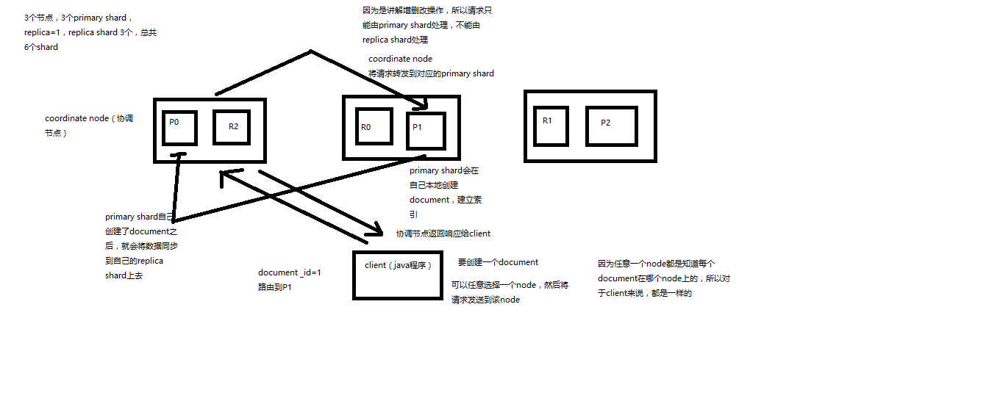

- [回到目录](#Elasticsearch顶尖高手系列课程-核心知识篇)

## 第31节：分布式文档系统_图解写一致性原理以及quorum机制深入剖析

课程大纲

> （1）consistency，one（primary shard），all（all shard），quorum（default）

我们在发送任何一个增删改操作的时候，比如说put /index/type/id，都可以带上一个consistency参数，指明我们想要的写一致性是什么？
put /index/type/id?consistency=quorum

- one：要求我们这个写操作，只要有一个primary shard是active活跃可用的，就可以执行
- all：要求我们这个写操作，必须所有的primary shard和replica shard都是活跃的，才可以执行这个写操作
- quorum：默认的值，要求所有的shard中，必须是大部分的shard都是活跃的，可用的，才可以执行这个写操作

> （2）quorum机制，写之前必须确保大多数shard都可用，int( (primary + number_of_replicas) / 2 ) + 1，当number_of_replicas>1时才生效

quroum = int( (primary + number_of_replicas) / 2 ) + 1

举个例子，3个primary shard，number_of_replicas=1，总共有3 + 3 * 1 = 6个shard

quorum = int( (3 + 1) / 2 ) + 1 = 3

所以，要求6个shard中至少有3个shard是active状态的，才可以执行这个写操作

[如果路由到该document对应的主分片不可用，是不是不可写入？？？]

> （3）如果节点数少于quorum数量，可能导致quorum不齐全，进而导致无法执行任何写操作

3个primary shard，replica=1，要求至少3个shard是active，3个shard按照之前学习的shard&replica机制，必须在不同的节点上，如果说只有2台机器的话，是不是有可能出现说，3个shard都没法分配齐全，此时就可能会出现写操作无法执行的情况

es提供了一种特殊的处理场景，就是说当number_of_replicas>1时才生效，因为假如说，你就一个primary shard，replica=1，此时就2个shard

((1 + 1) / 2) + 1 = 2，要求必须有2个shard是活跃的，但是可能就1个node，此时就1个shard是活跃的，如果你不特殊处理的话，导致我们的单节点集群就无法工作

> （4）quorum不齐全时，wait，默认1分钟，timeout，100，30s

等待期间，期望活跃的shard数量可以增加，最后实在不行，就会timeout
我们其实可以在写操作的时候，加一个timeout参数，比如说put /index/type/id?timeout=30，这个就是说自己去设定quorum不齐全的时候，es的timeout时长，可以缩短，也可以增长


- [回到目录](#Elasticsearch顶尖高手系列课程-核心知识篇)


## 第32节：分布式文档系统_document查询内部原理图解揭秘

课程大纲

- 1、客户端发送请求到任意一个node，成为coordinate node
- 2、coordinate node对document进行路由，将请求转发到对应的node，此时会使用round-robin随机轮询算法，在primary shard以及其所有replica中随机选择一个，让读请求负载均衡
- 3、接收请求的node返回document给coordinate node
- 4、coordinate node返回document给客户端
- 5、特殊情况：document如果还在建立索引过程中，可能只有primary shard有，任何一个replica shard都没有，此时可能会导致无法读取到document，但是document完成索引建立之后，primary shard和replica shard就都有了

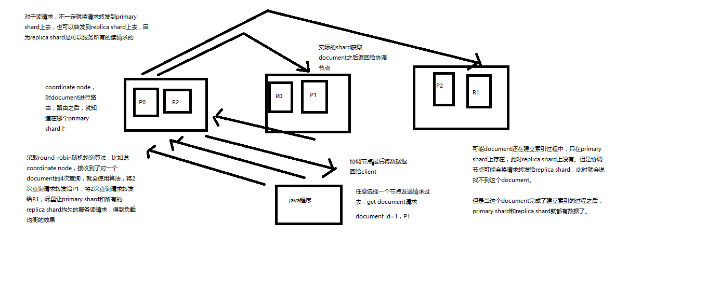


- [回到目录](#Elasticsearch顶尖高手系列课程-核心知识篇)

## 第33节：分布式文档系统_bulk api的奇特json格式与底层性能优化关系大揭秘

课程大纲

bulk api奇特的json格式

```java
{"action": {"meta"}}\n
{"data"}\n
{"action": {"meta"}}\n
{"data"}\n

[{
  "action": {
 
  },
  "data": {

  }
}]
```

> 1、bulk中的每个操作都可能要转发到不同的node的shard去执行

> 2、如果采用比较良好的json数组格式

允许任意的换行，整个可读性非常棒，读起来很爽，es拿到那种标准格式的json串以后，要按照下述流程去进行处理

- （1）将json数组解析为JSONArray对象，这个时候，整个数据，就会在内存中出现一份一模一样的拷贝，一份数据是json文本，一份数据是JSONArray对象
- （2）解析json数组里的每个json，对每个请求中的document进行路由
- （3）为路由到同一个shard上的多个请求，创建一个请求数组
- （4）将这个请求数组序列化
- （5）将序列化后的请求数组发送到对应的节点上去

> 3、耗费更多内存，更多的jvm gc开销

我们之前提到过bulk size最佳大小的那个问题，一般建议说在几千条那样，然后大小在10MB左右，所以说，可怕的事情来了。
假设说现在100个bulk请求发送到了一个节点上去，然后每个请求是10MB，100个请求，就是1000MB = 1GB，
然后每个请求的json都copy一份为jsonarray对象，此时内存中的占用就会翻倍，就会占用2GB的内存，甚至还不止。
因为弄成jsonarray之后，还可能会多搞一些其他的数据结构，2GB+的内存占用。

占用更多的内存可能就会积压其他请求的内存使用量，比如说最重要的搜索请求，分析请求，等等，此时就可能会导致其他请求的性能急速下降
另外的话，占用内存更多，就会导致java虚拟机的垃圾回收次数更多，跟频繁，每次要回收的垃圾对象更多，耗费的时间更多，导致es的java虚拟机停止工作线程的时间更多

> 4、现在的奇特格式

```java
{"action": {"meta"}}\n
{"data"}\n
{"action": {"meta"}}\n
{"data"}\n
```

- （1）不用将其转换为json对象，不会出现内存中的相同数据的拷贝，直接按照换行符切割json
- （2）对每两个一组的json，读取meta，进行document路由
- （3）直接将对应的json发送到node上去

> 5、最大的优势在于，不需要将json数组解析为一个JSONArray对象，形成一份大数据的拷贝，浪费内存空间，尽可能地保证性能

- [回到目录](#Elasticsearch顶尖高手系列课程-核心知识篇)


## 第34节：初识搜索引擎_search结果深入解析（search timeout机制揭秘）

> 课程大纲

- 1、我们如果发出一个搜索请求的话，会拿到一堆搜索结果，本节课，我们来讲解一下，这个搜索结果里的各种数据，都代表了什么含义

- 2、我们来讲解一下，搜索的timeout机制，底层的原理，画图讲解

```java
GET /_search

{
  "took": 6,
  "timed_out": false,
  "_shards": {
    "total": 6,
    "successful": 6,
    "failed": 0
  },
  "hits": {
    "total": 10,
    "max_score": 1,
    "hits": [
      {
        "_index": ".kibana",
        "_type": "config",
        "_id": "5.2.0",
        "_score": 1,
        "_source": {
          "buildNum": 14695
        }
      }
    ]
  }
}
```

took：整个搜索请求花费了多少毫秒

hits.total：本次搜索，返回了几条结果

hits.max_score：本次搜索的所有结果中，最大的相关度分数是多少，每一条document对于search的相关度，越相关，_score分数越大，排位越靠前

hits.hits：默认查询前10条数据，完整数据，_score降序排序

shards：shards fail的条件（primary和replica全部挂掉），不影响其他shard。默认情况下来说，一个搜索请求，会打到一个index的所有primary shard上去，当然了，每个primary shard都可能会有一个或多个replic shard，所以请求也可以到primary shard的其中一个replica shard上去。

timeout：默认无timeout，latency平衡completeness，手动指定timeout，timeout查询执行机制

```java
timeout=10ms，timeout=1s，timeout=1m
GET /_search?timeout=10m
```

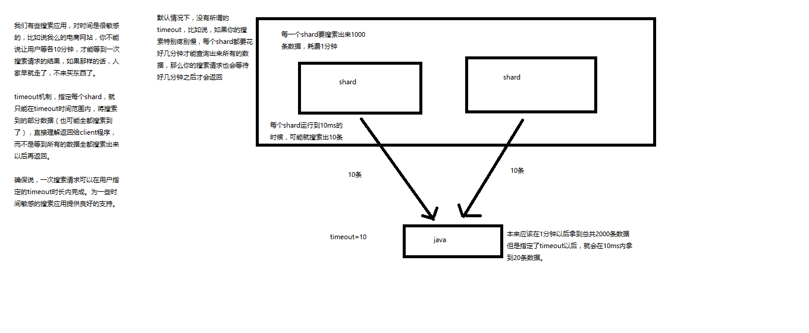

- [回到目录](#Elasticsearch顶尖高手系列课程-核心知识篇)


## 第35节：初识搜索引擎_multi-index&multi-type搜索模式解析以及搜索原理初步图解

课程大纲

> 1、multi-index和multi-type搜索模式

告诉你如何一次性搜索多个index和多个type下的数据

/_search：所有索引，所有type下的所有数据都搜索出来

/index1/_search：指定一个index，搜索其下所有type的数据

/index1,index2/_search：同时搜索两个index下的数据

/*1,*2/_search：按照通配符去匹配多个索引

/index1/type1/_search：搜索一个index下指定的type的数据

/index1/type1,type2/_search：可以搜索一个index下多个type的数据

/index1,index2/type1,type2/_search：搜索多个index下的多个type的数据

/_all/type1,type2/_search：_all，可以代表搜索所有index下的指定type的数据

> 2、初步图解一下简单的搜索原理

搜索原理初步图解

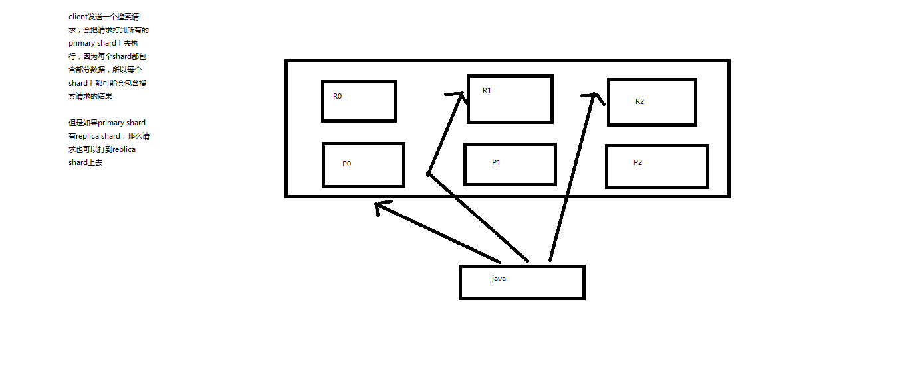

- [回到目录](#Elasticsearch顶尖高手系列课程-核心知识篇)

## 第36节：初识搜索引擎_分页搜索以及deep paging性能问题深度图解揭秘


课程大纲

> 1、讲解如何使用es进行分页搜索的语法

size，from

GET /_search?size=10

GET /_search?size=10&from=0

GET /_search?size=10&from=20

分页的上机实验

GET /test_index/test_type/_search

"hits": {
    "total": 9,
    "max_score": 1,

我们假设将这9条数据分成3页，每一页是3条数据，来实验一下这个分页搜索的效果

GET /test_index/test_type/_search?from=0&size=3

```java
{
  "took": 2,
  "timed_out": false,
  "_shards": {
    "total": 5,
    "successful": 5,
    "failed": 0
  },
  "hits": {
    "total": 9,
    "max_score": 1,
    "hits": [
      {
        "_index": "test_index",
        "_type": "test_type",
        "_id": "8",
        "_score": 1,
        "_source": {
          "test_field": "test client 2"
        }
      },
      {
        "_index": "test_index",
        "_type": "test_type",
        "_id": "6",
        "_score": 1,
        "_source": {
          "test_field": "tes test"
        }
      },
      {
        "_index": "test_index",
        "_type": "test_type",
        "_id": "4",
        "_score": 1,
        "_source": {
          "test_field": "test4"
        }
      }
    ]
  }
}

```
第一页：id=8,6,4

GET /test_index/test_type/_search?from=3&size=3

第二页：id=2,自动生成,7

GET /test_index/test_type/_search?from=6&size=3

第三页：id=1,11,3

> 2、什么是deep paging问题？为什么会产生这个问题，它的底层原理是什么？

deep paging性能问题，以及原理深度图解揭秘，很高级的知识点

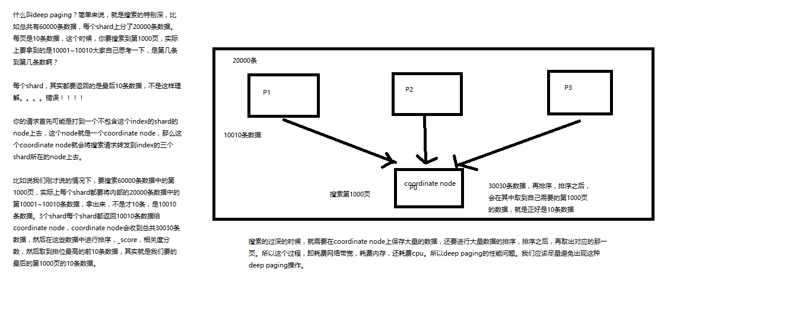


- [回到目录](#Elasticsearch顶尖高手系列课程-核心知识篇)


## 第37节：初识搜索引擎_快速掌握query string search语法以及_all metadata原理揭秘

课程大纲

> 1、query string基础语法

GET /test_index/test_type/_search?q=test_field:test

GET /test_index/test_type/_search?q=+test_field:test

GET /test_index/test_type/_search?q=-test_field:test

一个是掌握q=field:search content的语法，还有一个是掌握+和-的含义

> 2、_all metadata的原理和作用

GET /test_index/test_type/_search?q=test

直接可以搜索所有的field，任意一个field包含指定的关键字就可以搜索出来。我们在进行中搜索的时候，难道是对document中的每一个field都进行一次搜索吗？不是的

es中的_all元数据，在建立索引的时候，我们插入一条document，它里面包含了多个field，此时，es会自动将多个field的值，全部用字符串的方式串联起来，变成一个长的字符串，作为_all field的值，同时建立索引

后面如果在搜索的时候，没有对某个field指定搜索，就默认搜索_all field，其中是包含了所有field的值的

举个例子

```java
{
  "name": "jack",
  "age": 26,
  "email": "jack@sina.com",
  "address": "guamgzhou"
}
```

"jack 26 jack@sina.com guangzhou"，作为这一条document的_all field的值，同时进行分词后建立对应的倒排索引

生产环境不使用


- [回到目录](#Elasticsearch顶尖高手系列课程-核心知识篇)

## 第38节：初识搜索引擎_用一个例子告诉你mapping到底是什么

课程大纲

插入几条数据，让es自动为我们建立一个索引

```java
PUT /website/article/1
{
  "post_date": "2017-01-01",
  "title": "my first article",
  "content": "this is my first article in this website",
  "author_id": 11400
}

PUT /website/article/2
{
  "post_date": "2017-01-02",
  "title": "my second article",
  "content": "this is my second article in this website",
  "author_id": 11400
}

PUT /website/article/3
{
  "post_date": "2017-01-03",
  "title": "my third article",
  "content": "this is my third article in this website",
  "author_id": 11400
}
```

尝试各种搜索

GET /website/article/_search?q=2017			3条结果          
   
GET /website/article/_search?q=2017-01-01        	3条结果

GET /website/article/_search?q=post_date:2017-01-01   	1条结果

GET /website/article/_search?q=post_date:2017         	1条结果


查看es自动建立的mapping，带出什么是mapping的知识点

自动或手动为index中的type建立的一种数据结构和相关配置，简称为mapping

dynamic mapping，自动为我们建立index，创建type，以及type对应的mapping，mapping中包含了每个field对应的数据类型，
以及如何分词等设置

我们当然，后面会讲解，也可以手动在创建数据之前，先创建index和type，以及type对应的mapping

```java
GET /website/_mapping/article

{
  "website": {
    "mappings": {
      "article": {
        "properties": {
          "author_id": {
            "type": "long"
          },
          "content": {
            "type": "text",
            "fields": {
              "keyword": {
                "type": "keyword",
                "ignore_above": 256
              }
            }
          },
          "post_date": {
            "type": "date"
          },
          "title": {
            "type": "text",
            "fields": {
              "keyword": {
                "type": "keyword",
                "ignore_above": 256
              }
            }
          }
        }
      }
    }
  }
}
```

搜索结果为什么不一致，因为es自动建立mapping的时候，设置了不同的field不同的data type。不同的data type的分词、搜索等行为是不一样的。
所以出现了_all field和post_date field的搜索表现完全不一样。

- [回到目录](#Elasticsearch顶尖高手系列课程-核心知识篇)


## 第39节：初识搜索引擎_精确匹配与全文搜索的对比分析

课程大纲

> 1、exact value

2017-01-01，exact value，搜索的时候，必须输入2017-01-01，才能搜索出来
如果你输入一个01，是搜索不出来的

> 2、full text

- （1）缩写 vs. 全程：cn vs. china
- （2）格式转化：like liked likes
- （3）大小写：Tom vs tom
- （4）同义词：like vs love

2017-01-01，2017 01 01，搜索2017，或者01，都可以搜索出来

china，搜索cn，也可以将china搜索出来

likes，搜索like，也可以将likes搜索出来

Tom，搜索tom，也可以将Tom搜索出来

like，搜索love，同义词，也可以将like搜索出来

就不是说单纯的只是匹配完整的一个值，而是可以对值进行拆分词语后（分词）进行匹配，也可以通过缩写、时态、大小写、同义词等进行匹配

- [回到目录](#Elasticsearch顶尖高手系列课程-核心知识篇)


## 第40节：初识搜索引擎_倒排索引核心原理快速揭秘

课程大纲

- doc1：I really liked my small dogs, and I think my mom also liked them.
- doc2：He never liked any dogs, so I hope that my mom will not expect me to liked him.

分词，初步的倒排索引的建立

```java
word		doc1			doc2

I		*			*
really		*
liked		*			*
my		*			*
small		*	
dogs		*
and		*
think		*
mom		*			*
also		*
them		*	
He					*
never					*
any					*
so					*
hope					*
that					*
will					*
not					*
expect					*
me					*
to					*
him					*
```

演示了一下倒排索引最简单的建立的一个过程

搜索

mother like little dog，不可能有任何结果

mother
like
little
dog

这个是不是我们想要的搜索结果？？？绝对不是，因为在我们看来，mother和mom有区别吗？同义词，都是妈妈的意思。
like和liked有区别吗？没有，都是喜欢的意思，只不过一个是现在时，一个是过去时。little和small有区别吗？
同义词，都是小小的。dog和dogs有区别吗？狗，只不过一个是单数，一个是复数。

[normalization]，建立倒排索引的时候，会执行一个操作，也就是说对拆分出的各个单词进行相应的处理，
以提升后面搜索的时候能够搜索到相关联的文档的概率

时态的转换，单复数的转换，同义词的转换，大小写的转换

mom —> mother
liked —> like
small —> little
dogs —> dog

重新建立倒排索引，加入normalization，再次用mother liked little dog搜索，就可以搜索到了

```java
word		doc1			doc2

I		*			*
really		*
like		*			*			liked --> like
my		*			*
little		*						small --> little
dog		*			*			dogs --> dog						
and		*
think		*
mom		*			*
also		*
them		*	
He					*
never					*
any					*
so					*
hope					*
that					*
will					*
not					*
expect					*
me					*
to					*
him					*
```

mother like little dog，分词，normalization

```java
mother	--> mom
like	--> like
little	--> little
dog	--> dog
```

doc1和doc2都会搜索出来

- doc1：I really liked my small dogs, and I think my mom also liked them.
- doc2：He never liked any dogs, so I hope that my mom will not expect me to liked him.

- [回到目录](#Elasticsearch顶尖高手系列课程-核心知识篇)


## 第41节：初识搜索引擎_分词器的内部组成到底是什么，以及内置分词器的介绍

课程大纲

> 1、什么是分词器

切分词语，normalization（提升recall召回率）

给你一段句子，然后将这段句子拆分成一个一个的单个的单词，同时对每个单词进行normalization（时态转换，单复数转换），分词器

recall，召回率：搜索的时候，增加能够搜索到的结果的数量

character filter：在一段文本进行分词之前，先进行预处理，比如说最常见的就是，过滤html标签（<span>hello<span> --> hello），& --> and（I&you --> I and you）

tokenizer：分词，hello you and me --> hello, you, and, me

token filter：lowercase，stop word，synonymom，dogs --> dog，liked --> like，Tom --> tom，a/the/an --> 干掉，mother --> mom，small --> little

一个分词器，很重要，将一段文本进行各种处理，最后处理好的结果才会拿去建立倒排索引

> 2、内置分词器的介绍

Set the shape to semi-transparent by calling set_trans(5)

standard analyzer：set, the, shape, to, semi, transparent, by, calling, set_trans, 5（默认的是standard）

simple analyzer：set, the, shape, to, semi, transparent, by, calling, set, trans

whitespace analyzer：Set, the, shape, to, semi-transparent, by, calling, set_trans(5)

language analyzer（特定的语言的分词器，比如说，english，英语分词器）：set, shape, semi, transpar, call, set_tran, 5

- [回到目录](#Elasticsearch顶尖高手系列课程-核心知识篇)

## 第42节：初识搜索引擎_query string的分词以及mapping引入案例遗留问题的大揭秘

课程大纲

> 1、query string分词

query string必须以和index建立时相同的analyzer进行分词
query string对exact value和full text的区别对待

date：exact value
_all：full text

比如我们有一个document，其中有一个field，包含的value是：hello you and me，建立倒排索引

我们要搜索这个document对应的index，搜索文本是hell me，这个搜索文本就是query string

query string，默认情况下，es会使用它对应的field建立倒排索引时相同的分词器去进行分词，分词和normalization，只有这样，才能实现正确的搜索

我们建立倒排索引的时候，将dogs --> dog，结果你搜索的时候，还是一个dogs，那不就搜索不到了吗？所以搜索的时候，那个dogs也必须变成dog才行。才能搜索到。

知识点：不同类型的field，可能有的就是full text，有的就是exact value

post_date，date：exact value

_all：full text，分词，normalization

> 2、mapping引入案例遗留问题大揭秘

GET /_search?q=2017

搜索的是_all field，document所有的field都会拼接成一个大串，进行分词

```java
2017-01-02 my second article this is my second article in this website 11400

		doc1		doc2		doc3
2017		*		*		*
01		* 		
02				*
03						*
```

_all，2017，自然会搜索到3个docuemnt

GET /_search?q=2017-01-01

_all，2017-01-01，query string会用跟建立倒排索引一样的分词器去进行分词

```java
2017
01
01
```

GET /_search?q=post_date:2017-01-01

date，会作为exact value去建立索引

```java
		doc1		doc2		doc3
2017-01-01	*		
2017-01-02			* 		
2017-01-03					*
```

post_date:2017-01-01，2017-01-01，doc1一条document

GET /_search?q=post_date:2017，这个在这里不讲解，因为是es 5.2以后做的一个优化


> 3、测试分词器

```java
GET /_analyze
{
  "analyzer": "standard",
  "text": "Text to analyze"
}
```
- [回到目录](#Elasticsearch顶尖高手系列课程-核心知识篇)

## 第43节：初识搜索引擎_什么是mapping再次回炉透彻理解

课程大纲

- （1）往es里面直接插入数据，es会自动建立索引，同时建立type以及对应的mapping
- （2）mapping中就自动定义了每个field的数据类型
- （3）不同的数据类型（比如说text和date），可能有的是exact value，有的是full text
- （4）exact value，在建立倒排索引的时候，分词的时候，是将整个值一起作为一个关键词建立到倒排索引中的；full text，会经历各种各样的处理，分词，normaliztion（时态转换，同义词转换，大小写转换），才会建立到倒排索引中
- （5）同时呢，exact value和full text类型的field就决定了，在一个搜索过来的时候，对exact value field或者是full text field进行搜索的行为也是不一样的，会跟建立倒排索引的行为保持一致；比如说exact value搜索的时候，就是直接按照整个值进行匹配，full text query string，也会进行分词和normalization再去倒排索引中去搜索
- （6）可以用es的dynamic mapping，让其自动建立mapping，包括自动设置数据类型；也可以提前手动创建index和type的mapping，自己对各个field进行设置，包括数据类型，包括索引行为，包括分词器，等等

mapping，就是index的type的元数据，每个type都有一个自己的mapping，决定了数据类型，建立倒排索引的行为，还有进行搜索的行为

- [回到目录](#Elasticsearch顶尖高手系列课程-核心知识篇)

## 第44节：初识搜索引擎_mapping的核心数据类型以及dynamic mapping

课程大纲

> 1、核心的数据类型

```java
string
byte，short，integer，long
float，double
boolean
date
```

> 2、dynamic mapping

```java
true or false	-->	boolean
123		-->	long
123.45		-->	double
2017-01-01	-->	date
"hello world"	-->	string/text
```

> 3、查看mapping

GET /index/_mapping/type

- [回到目录](#Elasticsearch顶尖高手系列课程-核心知识篇)

## 第45节：初识搜索引擎_手动建立和修改mapping以及定制string类型数据是否分词

课程大纲

> 1、如何建立索引

- analyzed
- not_analyzed
- no

> 2、修改mapping

只能创建index时手动建立mapping，或者新增field mapping，但是不能update field mapping

```java
PUT /website
{
  "mappings": {
    "article": {
      "properties": {
        "author_id": {
          "type": "long"
        },
        "title": {
          "type": "text",
          "analyzer": "english"
        },
        "content": {
          "type": "text"
        },
        "post_date": {
          "type": "date"
        },
        "publisher_id": {
          "type": "text",
          "index": "not_analyzed"
        }
      }
    }
  }
}

PUT /website
{
  "mappings": {
    "article": {
      "properties": {
        "author_id": {
          "type": "text"
        }
      }
    }
  }
}

{
  "error": {
    "root_cause": [
      {
        "type": "index_already_exists_exception",
        "reason": "index [website/co1dgJ-uTYGBEEOOL8GsQQ] already exists",
        "index_uuid": "co1dgJ-uTYGBEEOOL8GsQQ",
        "index": "website"
      }
    ],
    "type": "index_already_exists_exception",
    "reason": "index [website/co1dgJ-uTYGBEEOOL8GsQQ] already exists",
    "index_uuid": "co1dgJ-uTYGBEEOOL8GsQQ",
    "index": "website"
  },
  "status": 400
}

PUT /website/_mapping/article
{
  "properties" : {
    "new_field" : {
      "type" :    "string",
      "index":    "not_analyzed"
    }
  }
}

```

> 3、测试mapping

```java
GET /website/_analyze
{
  "field": "content",
  "text": "my-dogs" 
}

GET website/_analyze
{
  "field": "new_field",
  "text": "my dogs"
}

{
  "error": {
    "root_cause": [
      {
        "type": "remote_transport_exception",
        "reason": "[4onsTYV][127.0.0.1:9300][indices:admin/analyze[s]]"
      }
    ],
    "type": "illegal_argument_exception",
    "reason": "Can't process field [new_field], Analysis requests are only supported on tokenized fields"
  },
  "status": 400
}
```

- [回到目录](#Elasticsearch顶尖高手系列课程-核心知识篇)

## 第46节：初识搜索引擎_mapping复杂数据类型以及object类型数据底层结构大揭秘

课程大纲

> 1、multivalue field

{ "tags": [ "tag1", "tag2" ]}

建立索引时与string是一样的，数据类型不能混

> 2、empty field

null，[]，[null]

> 3、object field

```java
PUT /company/employee/1
{
  "address": {
    "country": "china",
    "province": "guangdong",
    "city": "guangzhou"
  },
  "name": "jack",
  "age": 27,
  "join_date": "2017-01-01"
}

address：object类型

{
  "company": {
    "mappings": {
      "employee": {
        "properties": {
          "address": {
            "properties": {
              "city": {
                "type": "text",
                "fields": {
                  "keyword": {
                    "type": "keyword",
                    "ignore_above": 256
                  }
                }
              },
              "country": {
                "type": "text",
                "fields": {
                  "keyword": {
                    "type": "keyword",
                    "ignore_above": 256
                  }
                }
              },
              "province": {
                "type": "text",
                "fields": {
                  "keyword": {
                    "type": "keyword",
                    "ignore_above": 256
                  }
                }
              }
            }
          },
          "age": {
            "type": "long"
          },
          "join_date": {
            "type": "date"
          },
          "name": {
            "type": "text",
            "fields": {
              "keyword": {
                "type": "keyword",
                "ignore_above": 256
              }
            }
          }
        }
      }
    }
  }
}

{
  "address": {
    "country": "china",
    "province": "guangdong",
    "city": "guangzhou"
  },
  "name": "jack",
  "age": 27,
  "join_date": "2017-01-01"
}

{
    "name":            [jack],
    "age":          [27],
    "join_date":      [2017-01-01],
    "address.country":         [china],
    "address.province":   [guangdong],
    "address.city":  [guangzhou]
}

{
    "authors": [
        { "age": 26, "name": "Jack White"},
        { "age": 55, "name": "Tom Jones"},
        { "age": 39, "name": "Kitty Smith"}
    ]
}

{
    "authors.age":    [26, 55, 39],
    "authors.name":   [jack, white, tom, jones, kitty, smith]
}
```
- [回到目录](#Elasticsearch顶尖高手系列课程-核心知识篇)

##  第47节：初识搜索引擎_search api的基础语法介绍

课程大纲

> 1、search api的基本语法

GET /search
{}

GET /index1,index2/type1,type2/search
{}

GET /_search
{
  "from": 0,
  "size": 10
}

> 2、http协议中get是否可以带上request body

HTTP协议，一般不允许get请求带上request body，但是因为get更加适合描述查询数据的操作，因此还是这么用了

```java
GET /_search?from=0&size=10

POST /_search
{
  "from":0,
  "size":10
}
```

碰巧，很多浏览器，或者是服务器，也都支持GET+request body模式

如果遇到不支持的场景，也可以用POST /_search

- [回到目录](#Elasticsearch顶尖高手系列课程-核心知识篇)

## 第48节：初识搜索引擎_快速上机动手实战Query DSL搜索语法

课程大纲

> 1、一个例子让你明白什么是Query DSL

```java
GET /_search
{
    "query": {
        "match_all": {}
    }
}
```

> 2、Query DSL的基本语法

```java
{
    QUERY_NAME: {
        ARGUMENT: VALUE,
        ARGUMENT: VALUE,...
    }
}

{
    QUERY_NAME: {
        FIELD_NAME: {
            ARGUMENT: VALUE,
            ARGUMENT: VALUE,...
        }
    }
}
```

示例：

```java
GET /test_index/test_type/_search 
{
  "query": {
    "match": {
      "test_field": "test"
    }
  }
}
```

> 3、如何组合多个搜索条件

搜索需求：title必须包含elasticsearch，content可以包含elasticsearch也可以不包含，author_id必须不为111

```java
{
  "took": 1,
  "timed_out": false,
  "_shards": {
    "total": 5,
    "successful": 5,
    "failed": 0
  },
  "hits": {
    "total": 3,
    "max_score": 1,
    "hits": [
      {
        "_index": "website",
        "_type": "article",
        "_id": "2",
        "_score": 1,
        "_source": {
          "title": "my hadoop article",
          "content": "hadoop is very bad",
          "author_id": 111
        }
      },
      {
        "_index": "website",
        "_type": "article",
        "_id": "1",
        "_score": 1,
        "_source": {
          "title": "my elasticsearch article",
          "content": "es is very bad",
          "author_id": 110
        }
      },
      {
        "_index": "website",
        "_type": "article",
        "_id": "3",
        "_score": 1,
        "_source": {
          "title": "my elasticsearch article",
          "content": "es is very goods",
          "author_id": 111
        }
      }
    ]
  }
}
```

```java
GET /website/article/_search
{
  "query": {
    "bool": {
      "must": [
        {
          "match": {
            "title": "elasticsearch"
          }
        }
      ],
      "should": [
        {
          "match": {
            "content": "elasticsearch"
          }
        }
      ],
      "must_not": [
        {
          "match": {
            "author_id": 111
          }
        }
      ]
    }
  }
}
```

```java
GET /test_index/_search
{
    "query": {
            "bool": {
                "must": { "match":   { "name": "tom" }},
                "should": [
                    { "match":       { "hired": true }},
                    { "bool": {
                        "must":      { "match": { "personality": "good" }},
                        "must_not":  { "match": { "rude": true }}
                    }}
                ],
                "minimum_should_match": 1
            }
    }
}
```


- [回到目录](#Elasticsearch顶尖高手系列课程-核心知识篇)


## 第49节：初识搜索引擎_filter与query深入对比解密：相关度，性能

课程大纲

> 1、filter与query示例

```java
PUT /company/employee/2
{
  "address": {
    "country": "china",
    "province": "jiangsu",
    "city": "nanjing"
  },
  "name": "tom",
  "age": 30,
  "join_date": "2016-01-01"
}

PUT /company/employee/3
{
  "address": {
    "country": "china",
    "province": "shanxi",
    "city": "xian"
  },
  "name": "marry",
  "age": 35,
  "join_date": "2015-01-01"
}
```

搜索请求：年龄必须大于等于30，同时join_date必须是2016-01-01

```java
GET /company/employee/_search
{
  "query": {
    "bool": {
      "must": [
        {
          "match": {
            "join_date": "2016-01-01"
          }
        }
      ],
      "filter": {
        "range": {
          "age": {
            "gte": 30
          }
        }
      }
    }
  }
}
```

> 2、filter与query对比大解密

filter，仅仅只是按照搜索条件过滤出需要的数据而已，不计算任何相关度分数，对相关度没有任何影响

query，会去计算每个document相对于搜索条件的相关度，并按照相关度进行排序

一般来说，如果你是在进行搜索，需要将最匹配搜索条件的数据先返回，那么用query；如果你只是要根据一些条件筛选出一部分数据，不关注其排序，那么用filter

除非是你的这些搜索条件，你希望越符合这些搜索条件的document越排在前面返回，那么这些搜索条件要放在query中；如果你不希望一些搜索条件来影响你的document排序，那么就放在filter中即可

> 3、filter与query性能

filter，不需要计算相关度分数，不需要按照相关度分数进行排序，同时还有内置的自动cache最常使用filter的数据

query，相反，要计算相关度分数，按照分数进行排序，而且无法cache结果


- [回到目录](#Elasticsearch顶尖高手系列课程-核心知识篇)


##  第50节：初识搜索引擎_上机动手实战常用的各种query搜索语法

课程大纲

> 1、match all

```java
GET /_search
{
    "query": {
        "match_all": {}
    }
}
```

> 2、match

```java
GET /_search
{
    "query": { "match": { "title": "my elasticsearch article" }}
}

```
> 3、multi match

```java
GET /test_index/test_type/_search
{
  "query": {
    "multi_match": {
      "query": "test",
      "fields": ["test_field", "test_field1"]
    }
  }
}
```

> 4、range query

```java
GET /company/employee/_search 
{
  "query": {
    "range": {
      "age": {
        "gte": 30
      }
    }
  }
}
```

> 5、term query

```java
GET /test_index/test_type/_search 
{
  "query": {
    "term": {
      "test_field": "test hello"
    }
  }
}
```

> 6、terms query

```java
GET /_search
{
    "query": { "terms": { "tag": [ "search", "full_text", "nosql" ] }}
}
```

> 7、exist query（2.x中的查询，现在已经不提供了）


- [回到目录](#Elasticsearch顶尖高手系列课程-核心知识篇)


## 第51节：初识搜索引擎_上机动手实战多搜索条件组合查询


课程大纲

```java
GET /website/article/_search
{
  "query": {
    "bool": {
      "must": [
        {
          "match": {
            "title": "elasticsearch"
          }
        }
      ],
      "should": [
        {
          "match": {
            "content": "elasticsearch"
          }
        }
      ],
      "must_not": [
        {
          "match": {
            "author_id": 111
          }
        }
      ]
    }
  }
}

{
    "bool": {
        "must":     { "match": { "title": "how to make millions" }},
        "must_not": { "match": { "tag":   "spam" }},
        "should": [
            { "match": { "tag": "starred" }}
        ],
        "filter": {
          "range": { "date": { "gte": "2014-01-01" }} 
        }
    }
}
```

bool
must，must_not，should，filter

每个子查询都会计算一个document针对它的相关度分数，然后bool综合所有分数，合并为一个分数，当然filter是不会计算分数的

```java
{
    "bool": {
        "must":     { "match": { "title": "how to make millions" }},
        "must_not": { "match": { "tag":   "spam" }},
        "should": [
            { "match": { "tag": "starred" }}
        ],
        "filter": {
          "bool": { 
              "must": [
                  { "range": { "date": { "gte": "2014-01-01" }}},
                  { "range": { "price": { "lte": 29.99 }}}
              ],
              "must_not": [
                  { "term": { "category": "ebooks" }}
              ]
          }
        }
    }
}
```

```java
GET /company/employee/_search 
{
  "query": {
    "constant_score": {
      "filter": {
        "range": {
          "age": {
            "gte": 30
          }
        }
      }
    }
  }
}
```
- [回到目录](#Elasticsearch顶尖高手系列课程-核心知识篇)

## 第52节：初识搜索引擎_上机动手实战如何定位不合法的搜索以及其原因

课程大纲

```java
GET /test_index/test_type/_validate/query?explain
{
  "query": {
    "math": {
      "test_field": "test"
    }
  }
}

{
  "valid": false,
  "error": "org.elasticsearch.common.ParsingException: no [query] registered for [math]"
}
```

```java
GET /test_index/test_type/_validate/query?explain
{
  "query": {
    "match": {
      "test_field": "test"
    }
  }
}

{
  "valid": true,
  "_shards": {
    "total": 1,
    "successful": 1,
    "failed": 0
  },
  "explanations": [
    {
      "index": "test_index",
      "valid": true,
      "explanation": "+test_field:test #(#_type:test_type)"
    }
  ]
}
```

一般用在那种特别复杂庞大的搜索下，比如你一下子写了上百行的搜索，这个时候可以先用validate api去验证一下，搜索是否合法


- [回到目录](#Elasticsearch顶尖高手系列课程-核心知识篇)


## 第54节：初识搜素引擎_上机动手实战如何定制搜索结果的排序规则

课程大纲

> 1、默认排序规则

默认情况下，是按照_score降序排序的

然而，某些情况下，可能没有有用的_score，比如说filter

```java
GET /_search
{
    "query" : {
        "bool" : {
            "filter" : {
                "term" : {
                    "author_id" : 1
                }
            }
        }
    }
}
```

当然，也可以是constant_score

```java
GET /_search
{
    "query" : {
        "constant_score" : {
            "filter" : {
                "term" : {
                    "author_id" : 1
                }
            }
        }
    }
}
```

> 2、定制排序规则

```java
GET /company/employee/_search 
{
  "query": {
    "constant_score": {
      "filter": {
        "range": {
          "age": {
            "gte": 30
          }
        }
      }
    }
  },
  "sort": [
    {
      "join_date": {
        "order": "asc"
      }
    }
  ]
}
```
- [回到目录](#Elasticsearch顶尖高手系列课程-核心知识篇)

## 第54节：初识搜索引擎_解密如何将一个field索引两次来解决字符串排序问题

课程大纲

如果对一个string field进行排序，结果往往不准确，因为分词后是多个单词，再排序就不是我们想要的结果了

通常解决方案是，将一个string field建立两次索引，一个分词，用来进行搜索；一个不分词，用来进行排序

```java
PUT /website 
{
  "mappings": {
    "article": {
      "properties": {
        "title": {
          "type": "text",
          "fields": {
            "raw": {
              "type": "string",
              "index": "not_analyzed"
            }
          },
          "fielddata": true
        },
        "content": {
          "type": "text"
        },
        "post_date": {
          "type": "date"
        },
        "author_id": {
          "type": "long"
        }
      }
    }
  }
}
```

````java
PUT /website/article/1
{
  "title": "first article",
  "content": "this is my second article",
  "post_date": "2017-01-01",
  "author_id": 110
}
````

```java
{
  "took": 2,
  "timed_out": false,
  "_shards": {
    "total": 5,
    "successful": 5,
    "failed": 0
  },
  "hits": {
    "total": 3,
    "max_score": 1,
    "hits": [
      {
        "_index": "website",
        "_type": "article",
        "_id": "2",
        "_score": 1,
        "_source": {
          "title": "first article",
          "content": "this is my first article",
          "post_date": "2017-02-01",
          "author_id": 110
        }
      },
      {
        "_index": "website",
        "_type": "article",
        "_id": "1",
        "_score": 1,
        "_source": {
          "title": "second article",
          "content": "this is my second article",
          "post_date": "2017-01-01",
          "author_id": 110
        }
      },
      {
        "_index": "website",
        "_type": "article",
        "_id": "3",
        "_score": 1,
        "_source": {
          "title": "third article",
          "content": "this is my third article",
          "post_date": "2017-03-01",
          "author_id": 110
        }
      }
    ]
  }
}
```

```java
GET /website/article/_search
{
  "query": {
    "match_all": {}
  },
  "sort": [
    {
      "title.raw": {
        "order": "desc"
      }
    }
  ]
}
```
- [回到目录](#Elasticsearch顶尖高手系列课程-核心知识篇)

## 第55节：初识搜索引擎_相关度评分TF&IDF算法独家解密

课程大纲

> 1、算法介绍

relevance score算法，简单来说，就是计算出，一个索引中的文本，与搜索文本，他们之间的关联匹配程度

Elasticsearch使用的是 term frequency/inverse document frequency算法，简称为TF/IDF算法

Term frequency：搜索文本中的各个词条在field文本中出现了多少次，出现次数越多，就越相关

搜索请求：hello world

doc1：hello you, and world is very good

doc2：hello, how are you

Inverse document frequency：搜索文本中的各个词条在整个索引的所有文档中出现了多少次，出现的次数越多，就越不相关

搜索请求：hello world

doc1：hello, today is very good

doc2：hi world, how are you

比如说，在index中有1万条document，hello这个单词在所有的document中，一共出现了1000次；world这个单词在所有的document中，一共出现了100次

doc2更相关

Field-length norm：field长度，field越长，相关度越弱

搜索请求：hello world

doc1：{ "title": "hello article", "content": "babaaba 1万个单词" }

doc2：{ "title": "my article", "content": "blablabala 1万个单词，hi world" }

hello world在整个index中出现的次数是一样多的

doc1更相关，title field更短

> 2、_score是如何被计算出来的

```java
GET /test_index/test_type/_search?explain
{
  "query": {
    "match": {
      "test_field": "test hello"
    }
  }
}

{
  "took": 6,
  "timed_out": false,
  "_shards": {
    "total": 5,
    "successful": 5,
    "failed": 0
  },
  "hits": {
    "total": 4,
    "max_score": 1.595089,
    "hits": [
      {
        "_shard": "[test_index][2]",
        "_node": "4onsTYVZTjGvIj9_spWz2w",
        "_index": "test_index",
        "_type": "test_type",
        "_id": "20",
        "_score": 1.595089,
        "_source": {
          "test_field": "test hello"
        },
        "_explanation": {
          "value": 1.595089,
          "description": "sum of:",
          "details": [
            {
              "value": 1.595089,
              "description": "sum of:",
              "details": [
                {
                  "value": 0.58279467,
                  "description": "weight(test_field:test in 0) [PerFieldSimilarity], result of:",
                  "details": [
                    {
                      "value": 0.58279467,
                      "description": "score(doc=0,freq=1.0 = termFreq=1.0\n), product of:",
                      "details": [
                        {
                          "value": 0.6931472,
                          "description": "idf, computed as log(1 + (docCount - docFreq + 0.5) / (docFreq + 0.5)) from:",
                          "details": [
                            {
                              "value": 2,
                              "description": "docFreq",
                              "details": []
                            },
                            {
                              "value": 4,
                              "description": "docCount",
                              "details": []
                            }
                          ]
                        },
                        {
                          "value": 0.840795,
                          "description": "tfNorm, computed as (freq * (k1 + 1)) / (freq + k1 * (1 - b + b * fieldLength / avgFieldLength)) from:",
                          "details": [
                            {
                              "value": 1,
                              "description": "termFreq=1.0",
                              "details": []
                            },
                            {
                              "value": 1.2,
                              "description": "parameter k1",
                              "details": []
                            },
                            {
                              "value": 0.75,
                              "description": "parameter b",
                              "details": []
                            },
                            {
                              "value": 1.75,
                              "description": "avgFieldLength",
                              "details": []
                            },
                            {
                              "value": 2.56,
                              "description": "fieldLength",
                              "details": []
                            }
                          ]
                        }
                      ]
                    }
                  ]
                },
                {
                  "value": 1.0122943,
                  "description": "weight(test_field:hello in 0) [PerFieldSimilarity], result of:",
                  "details": [
                    {
                      "value": 1.0122943,
                      "description": "score(doc=0,freq=1.0 = termFreq=1.0\n), product of:",
                      "details": [
                        {
                          "value": 1.2039728,
                          "description": "idf, computed as log(1 + (docCount - docFreq + 0.5) / (docFreq + 0.5)) from:",
                          "details": [
                            {
                              "value": 1,
                              "description": "docFreq",
                              "details": []
                            },
                            {
                              "value": 4,
                              "description": "docCount",
                              "details": []
                            }
                          ]
                        },
                        {
                          "value": 0.840795,
                          "description": "tfNorm, computed as (freq * (k1 + 1)) / (freq + k1 * (1 - b + b * fieldLength / avgFieldLength)) from:",
                          "details": [
                            {
                              "value": 1,
                              "description": "termFreq=1.0",
                              "details": []
                            },
                            {
                              "value": 1.2,
                              "description": "parameter k1",
                              "details": []
                            },
                            {
                              "value": 0.75,
                              "description": "parameter b",
                              "details": []
                            },
                            {
                              "value": 1.75,
                              "description": "avgFieldLength",
                              "details": []
                            },
                            {
                              "value": 2.56,
                              "description": "fieldLength",
                              "details": []
                            }
                          ]
                        }
                      ]
                    }
                  ]
                }
              ]
            },
            {
              "value": 0,
              "description": "match on required clause, product of:",
              "details": [
                {
                  "value": 0,
                  "description": "# clause",
                  "details": []
                },
                {
                  "value": 1,
                  "description": "*:*, product of:",
                  "details": [
                    {
                      "value": 1,
                      "description": "boost",
                      "details": []
                    },
                    {
                      "value": 1,
                      "description": "queryNorm",
                      "details": []
                    }
                  ]
                }
              ]
            }
          ]
        }
      },
      {
        "_shard": "[test_index][2]",
        "_node": "4onsTYVZTjGvIj9_spWz2w",
        "_index": "test_index",
        "_type": "test_type",
        "_id": "6",
        "_score": 0.58279467,
        "_source": {
          "test_field": "tes test"
        },
        "_explanation": {
          "value": 0.58279467,
          "description": "sum of:",
          "details": [
            {
              "value": 0.58279467,
              "description": "sum of:",
              "details": [
                {
                  "value": 0.58279467,
                  "description": "weight(test_field:test in 0) [PerFieldSimilarity], result of:",
                  "details": [
                    {
                      "value": 0.58279467,
                      "description": "score(doc=0,freq=1.0 = termFreq=1.0\n), product of:",
                      "details": [
                        {
                          "value": 0.6931472,
                          "description": "idf, computed as log(1 + (docCount - docFreq + 0.5) / (docFreq + 0.5)) from:",
                          "details": [
                            {
                              "value": 2,
                              "description": "docFreq",
                              "details": []
                            },
                            {
                              "value": 4,
                              "description": "docCount",
                              "details": []
                            }
                          ]
                        },
                        {
                          "value": 0.840795,
                          "description": "tfNorm, computed as (freq * (k1 + 1)) / (freq + k1 * (1 - b + b * fieldLength / avgFieldLength)) from:",
                          "details": [
                            {
                              "value": 1,
                              "description": "termFreq=1.0",
                              "details": []
                            },
                            {
                              "value": 1.2,
                              "description": "parameter k1",
                              "details": []
                            },
                            {
                              "value": 0.75,
                              "description": "parameter b",
                              "details": []
                            },
                            {
                              "value": 1.75,
                              "description": "avgFieldLength",
                              "details": []
                            },
                            {
                              "value": 2.56,
                              "description": "fieldLength",
                              "details": []
                            }
                          ]
                        }
                      ]
                    }
                  ]
                }
              ]
            },
            {
              "value": 0,
              "description": "match on required clause, product of:",
              "details": [
                {
                  "value": 0,
                  "description": "# clause",
                  "details": []
                },
                {
                  "value": 1,
                  "description": "*:*, product of:",
                  "details": [
                    {
                      "value": 1,
                      "description": "boost",
                      "details": []
                    },
                    {
                      "value": 1,
                      "description": "queryNorm",
                      "details": []
                    }
                  ]
                }
              ]
            }
          ]
        }
      },
      {
        "_shard": "[test_index][3]",
        "_node": "4onsTYVZTjGvIj9_spWz2w",
        "_index": "test_index",
        "_type": "test_type",
        "_id": "7",
        "_score": 0.5565415,
        "_source": {
          "test_field": "test client 2"
        },
        "_explanation": {
          "value": 0.5565415,
          "description": "sum of:",
          "details": [
            {
              "value": 0.5565415,
              "description": "sum of:",
              "details": [
                {
                  "value": 0.5565415,
                  "description": "weight(test_field:test in 0) [PerFieldSimilarity], result of:",
                  "details": [
                    {
                      "value": 0.5565415,
                      "description": "score(doc=0,freq=1.0 = termFreq=1.0\n), product of:",
                      "details": [
                        {
                          "value": 0.6931472,
                          "description": "idf, computed as log(1 + (docCount - docFreq + 0.5) / (docFreq + 0.5)) from:",
                          "details": [
                            {
                              "value": 1,
                              "description": "docFreq",
                              "details": []
                            },
                            {
                              "value": 2,
                              "description": "docCount",
                              "details": []
                            }
                          ]
                        },
                        {
                          "value": 0.8029196,
                          "description": "tfNorm, computed as (freq * (k1 + 1)) / (freq + k1 * (1 - b + b * fieldLength / avgFieldLength)) from:",
                          "details": [
                            {
                              "value": 1,
                              "description": "termFreq=1.0",
                              "details": []
                            },
                            {
                              "value": 1.2,
                              "description": "parameter k1",
                              "details": []
                            },
                            {
                              "value": 0.75,
                              "description": "parameter b",
                              "details": []
                            },
                            {
                              "value": 2.5,
                              "description": "avgFieldLength",
                              "details": []
                            },
                            {
                              "value": 4,
                              "description": "fieldLength",
                              "details": []
                            }
                          ]
                        }
                      ]
                    }
                  ]
                }
              ]
            },
            {
              "value": 0,
              "description": "match on required clause, product of:",
              "details": [
                {
                  "value": 0,
                  "description": "# clause",
                  "details": []
                },
                {
                  "value": 1,
                  "description": "_type:test_type, product of:",
                  "details": [
                    {
                      "value": 1,
                      "description": "boost",
                      "details": []
                    },
                    {
                      "value": 1,
                      "description": "queryNorm",
                      "details": []
                    }
                  ]
                }
              ]
            }
          ]
        }
      },
      {
        "_shard": "[test_index][1]",
        "_node": "4onsTYVZTjGvIj9_spWz2w",
        "_index": "test_index",
        "_type": "test_type",
        "_id": "8",
        "_score": 0.25316024,
        "_source": {
          "test_field": "test client 2"
        },
        "_explanation": {
          "value": 0.25316024,
          "description": "sum of:",
          "details": [
            {
              "value": 0.25316024,
              "description": "sum of:",
              "details": [
                {
                  "value": 0.25316024,
                  "description": "weight(test_field:test in 0) [PerFieldSimilarity], result of:",
                  "details": [
                    {
                      "value": 0.25316024,
                      "description": "score(doc=0,freq=1.0 = termFreq=1.0\n), product of:",
                      "details": [
                        {
                          "value": 0.2876821,
                          "description": "idf, computed as log(1 + (docCount - docFreq + 0.5) / (docFreq + 0.5)) from:",
                          "details": [
                            {
                              "value": 1,
                              "description": "docFreq",
                              "details": []
                            },
                            {
                              "value": 1,
                              "description": "docCount",
                              "details": []
                            }
                          ]
                        },
                        {
                          "value": 0.88,
                          "description": "tfNorm, computed as (freq * (k1 + 1)) / (freq + k1 * (1 - b + b * fieldLength / avgFieldLength)) from:",
                          "details": [
                            {
                              "value": 1,
                              "description": "termFreq=1.0",
                              "details": []
                            },
                            {
                              "value": 1.2,
                              "description": "parameter k1",
                              "details": []
                            },
                            {
                              "value": 0.75,
                              "description": "parameter b",
                              "details": []
                            },
                            {
                              "value": 3,
                              "description": "avgFieldLength",
                              "details": []
                            },
                            {
                              "value": 4,
                              "description": "fieldLength",
                              "details": []
                            }
                          ]
                        }
                      ]
                    }
                  ]
                }
              ]
            },
            {
              "value": 0,
              "description": "match on required clause, product of:",
              "details": [
                {
                  "value": 0,
                  "description": "# clause",
                  "details": []
                },
                {
                  "value": 1,
                  "description": "*:*, product of:",
                  "details": [
                    {
                      "value": 1,
                      "description": "boost",
                      "details": []
                    },
                    {
                      "value": 1,
                      "description": "queryNorm",
                      "details": []
                    }
                  ]
                }
              ]
            }
          ]
        }
      }
    ]
  }
}
```

> 3、分析一个document是如何被匹配上的

```java
GET /test_index/test_type/6/_explain
{
  "query": {
    "match": {
      "test_field": "test hello"
    }
  }
}
```
- [回到目录](#Elasticsearch顶尖高手系列课程-核心知识篇)

## 第56节：初识搜索引擎_内核级知识点之doc value初步探秘

课程大纲

搜索的时候，要依靠倒排索引；排序的时候，需要依靠正排索引，看到每个document的每个field，然后进行排序，所谓的正排索引，其实就是doc values

在建立索引的时候，一方面会建立倒排索引，以供搜索用；一方面会建立正排索引，也就是doc values，以供排序，聚合，过滤等操作使用

doc values是被保存在磁盘上的，此时如果内存足够，os会自动将其缓存在内存中，性能还是会很高；如果内存不足够，os会将其写入磁盘上


doc1: hello world you and me

doc2: hi, world, how are you

```java
word		doc1		doc2

hello		*
world		*		*
you		*		*
and 		*
me		*
hi				*
how				*
are				*
```

hello you --> hello, you

hello --> doc1

you --> doc1,doc2

doc1: hello world you and me

doc2: hi, world, how are you

sort by age


doc1: { "name": "jack", "age": 27 }

doc2: { "name": "tom", "age": 30 }

document	name		age

doc1		jack		27

doc2		tom		30	


- [回到目录](#Elasticsearch顶尖高手系列课程-核心知识篇)


## 第57节：初识搜索引擎_分布式搜索引擎内核解密之query phase


课程大纲

> 1、query phase

- （1）搜索请求发送到某一个coordinate node，构构建一个priority queue，长度以paging操作from和size为准，默认为10
- （2）coordinate node将请求转发到所有shard，每个shard本地搜索，并构建一个本地的priority queue
- （3）各个shard将自己的priority queue返回给coordinate node，并构建一个全局的priority queue

> 2、replica shard如何提升搜索吞吐量

一次请求要打到所有shard的一个replica/primary上去，如果每个shard都有多个replica，那么同时并发过来的搜索请求可以同时打到其他的replica上去


- [回到目录](#Elasticsearch顶尖高手系列课程-核心知识篇)

## 第58节：初识搜索引擎_分布式搜索引擎内核解密之fetch phase

课程大纲

> 1、fetch phbase工作流程

- （1）coordinate node构建完priority queue之后，就发送mget请求去所有shard上获取对应的document
- （2）各个shard将document返回给coordinate node
- （3）coordinate node将合并后的document结果返回给client客户端

> 2、一般搜索，如果不加from和size，就默认搜索前10条，按照_score排序


- [回到目录](#Elasticsearch顶尖高手系列课程-核心知识篇)


##  第59节：初识搜索引擎_搜索相关参数梳理以及bouncing results问题解决方案

课程大纲

> 1、preference

决定了哪些shard会被用来执行搜索操作

_primary, _primary_first, _local, _only_node:xyz, _prefer_node:xyz, _shards:2,3

bouncing results问题，两个document排序，field值相同；
不同的shard上，可能排序不同；
每次请求轮询打到不同的replica shard上；
每次页面上看到的搜索结果的排序都不一样。这就是bouncing result，也就是跳跃的结果。

搜索的时候，是轮询将搜索请求发送到每一个replica shard（primary shard），但是在不同的shard上，可能document的排序不同

解决方案就是将preference设置为一个字符串，比如说user_id，让每个user每次搜索的时候，都使用同一个replica shard去执行，
就不会看到bouncing results了

> 2、timeout，已经讲解过原理了，主要就是限定在一定时间内，将部分获取到的数据直接返回，避免查询耗时过长

> 3、routing，document文档路由，_id路由，routing=user_id，这样的话可以让同一个user对应的数据到一个shard上去

> 4、search_type

default：query_then_fetch

dfs_query_then_fetch，可以提升revelance sort精准度

- [回到目录](#Elasticsearch顶尖高手系列课程-核心知识篇)

## 第60：初识搜索引擎_上机动手实战基于scoll技术滚动搜索大量数据

课程大纲

如果一次性要查出来比如10万条数据，那么性能会很差，此时一般会采取用scoll滚动查询，一批一批的查，直到所有数据都查询完处理完

使用scoll滚动搜索，可以先搜索一批数据，然后下次再搜索一批数据，以此类推，直到搜索出全部的数据来
scoll搜索会在第一次搜索的时候，保存一个当时的视图快照，之后只会基于该旧的视图快照提供数据搜索，如果这个期间数据变更，是不会让用户看到的
采用基于_doc进行排序的方式，性能较高
每次发送scroll请求，我们还需要指定一个scoll参数，指定一个时间窗口，每次搜索请求只要在这个时间窗口内能完成就可以了

```java
GET /test_index/test_type/_search?scroll=1m
{
  "query": {
    "match_all": {}
  },
  "sort": [ "_doc" ],
  "size": 3
}
```

```java
{
  "_scroll_id": "DnF1ZXJ5VGhlbkZldGNoBQAAAAAAACxeFjRvbnNUWVZaVGpHdklqOV9zcFd6MncAAAAAAAAsYBY0b25zVFlWWlRqR3ZJajlfc3BXejJ3AAAAAAAALF8WNG9uc1RZVlpUakd2SWo5X3NwV3oydwAAAAAAACxhFjRvbnNUWVZaVGpHdklqOV9zcFd6MncAAAAAAAAsYhY0b25zVFlWWlRqR3ZJajlfc3BXejJ3",
  "took": 5,
  "timed_out": false,
  "_shards": {
    "total": 5,
    "successful": 5,
    "failed": 0
  },
  "hits": {
    "total": 10,
    "max_score": null,
    "hits": [
      {
        "_index": "test_index",
        "_type": "test_type",
        "_id": "8",
        "_score": null,
        "_source": {
          "test_field": "test client 2"
        },
        "sort": [
          0
        ]
      },
      {
        "_index": "test_index",
        "_type": "test_type",
        "_id": "6",
        "_score": null,
        "_source": {
          "test_field": "tes test"
        },
        "sort": [
          0
        ]
      },
      {
        "_index": "test_index",
        "_type": "test_type",
        "_id": "AVp4RN0bhjxldOOnBxaE",
        "_score": null,
        "_source": {
          "test_content": "my test"
        },
        "sort": [
          0
        ]
      }
    ]
  }
}
```

获得的结果会有一个scoll_id，下一次再发送scoll请求的时候，必须带上这个scoll_id

```java
GET /_search/scroll
{
    "scroll": "1m", 
    "scroll_id" : "DnF1ZXJ5VGhlbkZldGNoBQAAAAAAACxeFjRvbnNUWVZaVGpHdklqOV9zcFd6MncAAAAAAAAsYBY0b25zVFlWWlRqR3ZJajlfc3BXejJ3AAAAAAAALF8WNG9uc1RZVlpUakd2SWo5X3NwV3oydwAAAAAAACxhFjRvbnNUWVZaVGpHdklqOV9zcFd6MncAAAAAAAAsYhY0b25zVFlWWlRqR3ZJajlfc3BXejJ3"
}

11,4,7
3,2,1
20
```

scoll，看起来挺像分页的，但是其实使用场景不一样。分页主要是用来一页一页搜索，给用户看的；scoll主要是用来一批一批检索数据，让系统进行处理的

- [回到目录](#Elasticsearch顶尖高手系列课程-核心知识篇)

## 第61节：索引管理_快速上机动手实战创建、修改以及删除索引

课程大纲

> 1、为什么我们要手动创建索引？

> 2、创建索引

创建索引的语法

```java
PUT /my_index
{
    "settings": { ... any settings ... },
    "mappings": {
        "type_one": { ... any mappings ... },
        "type_two": { ... any mappings ... },
        ...
    }
}
```

创建索引的示例

```java
PUT /my_index
{
  "settings": {
    "number_of_shards": 1,
    "number_of_replicas": 0
  },
  "mappings": {
    "my_type": {
      "properties": {
        "my_field": {
          "type": "text"
        }
      }
    }
  }
}
```

> 3、修改索引

```java
PUT /my_index/_settings
{
    "number_of_replicas": 1
}
```

> 4、删除索引

```java
DELETE /my_index
DELETE /index_one,index_two
DELETE /index_*
DELETE /_all


```

```java
elasticsearch.yml
action.destructive_requires_name: true
```


- [回到目录](#Elasticsearch顶尖高手系列课程-核心知识篇)


##  第62节：索引管理_快速上机动手实战修改分词器以及定制自己的分词器


课程大纲

> 1、默认的分词器

standard

- standard tokenizer：以单词边界进行切分
- standard token filter：什么都不做
- lowercase token filter：将所有字母转换为小写
- stop token filer（默认被禁用）：移除停用词，比如a the it等等

> 2、修改分词器的设置

启用english停用词token filter

```java
PUT /my_index
{
  "settings": {
    "analysis": {
      "analyzer": {
        "es_std": {
          "type": "standard",
          "stopwords": "_english_"
        }
      }
    }
  }
}
```

```java
GET /my_index/_analyze
{
  "analyzer": "standard", 
  "text": "a dog is in the house"
}

GET /my_index/_analyze
{
  "analyzer": "es_std",
  "text":"a dog is in the house"
}
```

> 3、定制化自己的分词器

```java
PUT /my_index
{
  "settings": {
    "analysis": {
      "char_filter": {
        "&_to_and": {
          "type": "mapping",
          "mappings": ["&=> and"]
        }
      },
      "filter": {
        "my_stopwords": {
          "type": "stop",
          "stopwords": ["the", "a"]
        }
      },
      "analyzer": {
        "my_analyzer": {
          "type": "custom",
          "char_filter": ["html_strip", "&_to_and"],
          "tokenizer": "standard",
          "filter": ["lowercase", "my_stopwords"]
        }
      }
    }
  }
}

GET /my_index/_analyze
{
  "text": "tom&jerry are a friend in the house, <a>, HAHA!!",
  "analyzer": "my_analyzer"
}

PUT /my_index/_mapping/my_type
{
  "properties": {
    "content": {
      "type": "text",
      "analyzer": "my_analyzer"
    }
  }
}
```

- [回到目录](#Elasticsearch顶尖高手系列课程-核心知识篇)

## 第63节：索引管理_内核级知识点：深入探秘type底层数据结构


课程大纲

type，是一个index中用来区分类似的数据的，类似的数据，但是可能有不同的fields，而且有不同的属性来控制索引建立、分词器
field的value，在底层的lucene中建立索引的时候，全部是opaque bytes类型，不区分类型的
lucene是没有type的概念的，在document中，实际上将type作为一个document的field来存储，即_type，es通过_type来进行type的过滤和筛选
一个index中的多个type，实际上是放在一起存储的，因此一个index下，不能有多个type重名，而类型或者其他设置不同的，因为那样是无法处理的

```java
{
   "ecommerce": {
      "mappings": {
         "elactronic_goods": {
            "properties": {
               "name": {
                  "type": "string",
               },
               "price": {
                  "type": "double"
               },
	       "service_period": {
		  "type": "string"
	       }			
            }
         },
         "fresh_goods": {
            "properties": {
               "name": {
                  "type": "string",
               },
               "price": {
                  "type": "double"
               },
	       "eat_period": {
		  "type": "string"
	       }
            }
         }
      }
   }
}

{
  "name": "geli kongtiao",
  "price": 1999.0,
  "service_period": "one year"
}

{
  "name": "aozhou dalongxia",
  "price": 199.0,
  "eat_period": "one week"
}
```

在底层的存储是这样子的。。。。

```java
{
   "ecommerce": {
      "mappings": {
        "_type": {
          "type": "string",
          "index": "not_analyzed"
        },
        "name": {
          "type": "string"
        }
        "price": {
          "type": "double"
        }
        "service_period": {
          "type": "string"
        }
        "eat_period": {
          "type": "string"
        }
      }
   }
}

{
  "_type": "elactronic_goods",
  "name": "geli kongtiao",
  "price": 1999.0,
  "service_period": "one year",
  "eat_period": ""
}

{
  "_type": "fresh_goods",
  "name": "aozhou dalongxia",
  "price": 199.0,
  "service_period": "",
  "eat_period": "one week"
}
```


最佳实践，将类似结构的type放在一个index下，这些type应该有多个field是相同的
假如说，你将两个type的field完全不同，放在一个index下，那么就每条数据都至少有一半的field在底层的lucene中是空值，会有严重的性能问题

- [回到目录](#Elasticsearch顶尖高手系列课程-核心知识篇)

## 第64节：索引管理_mapping root object深入剖析

课程大纲

> 1、root object

就是某个type对应的mapping json，包括了properties，metadata（_id，_source，_type），settings（analyzer），其他settings（比如include_in_all）

```java
PUT /my_index
{
  "mappings": {
    "my_type": {
      "properties": {}
    }
  }
}

```

> 2、properties

type，index，analyzer

```java
PUT /my_index/_mapping/my_type
{
  "properties": {
    "title": {
      "type": "text"
    }
  }
}

```
> 3、_source

好处

- （1）查询的时候，直接可以拿到完整的document，不需要先拿document id，再发送一次请求拿document
- （2）partial update基于_source实现
- （3）reindex时，直接基于_source实现，不需要从数据库（或者其他外部存储）查询数据再修改
- （4）可以基于_source定制返回field
- （5）debug query更容易，因为可以直接看到_source

如果不需要上述好处，可以禁用_source

```java
PUT /my_index/_mapping/my_type2
{
  "_source": {"enabled": false}
}
```

> 4、_all

将所有field打包在一起，作为一个_all field，建立索引。没指定任何field进行搜索时，就是使用_all field在搜索。

```java
PUT /my_index/_mapping/my_type3
{
  "_all": {"enabled": false}
}
```

也可以在field级别设置include_in_all field，设置是否要将field的值包含在_all field中

```java
PUT /my_index/_mapping/my_type4
{
  "properties": {
    "my_field": {
      "type": "text",
      "include_in_all": false
    }
  }
}
```

> 5、标识性metadata

_index，_type，_id

- [回到目录](#Elasticsearch顶尖高手系列课程-核心知识篇)


## 第65节：索引管理_定制化自己的dynamic mapping策略


课程大纲

> 1、定制dynamic策略

- true：遇到陌生字段，就进行dynamic mapping
- false：遇到陌生字段，就忽略
- strict：遇到陌生字段，就报错

```java
PUT /my_index
{
  "mappings": {
    "my_type": {
      "dynamic": "strict",
      "properties": {
        "title": {
          "type": "text"
        },
        "address": {
          "type": "object",
          "dynamic": "true"
        }
      }
    }
  }
}
```

```java
PUT /my_index/my_type/1
{
  "title": "my article",
  "content": "this is my article",
  "address": {
    "province": "guangdong",
    "city": "guangzhou"
  }
}

{
  "error": {
    "root_cause": [
      {
        "type": "strict_dynamic_mapping_exception",
        "reason": "mapping set to strict, dynamic introduction of [content] within [my_type] is not allowed"
      }
    ],
    "type": "strict_dynamic_mapping_exception",
    "reason": "mapping set to strict, dynamic introduction of [content] within [my_type] is not allowed"
  },
  "status": 400
}
```

```java
PUT /my_index/my_type/1
{
  "title": "my article",
  "address": {
    "province": "guangdong",
    "city": "guangzhou"
  }
}

```

```java
GET /my_index/_mapping/my_type

{
  "my_index": {
    "mappings": {
      "my_type": {
        "dynamic": "strict",
        "properties": {
          "address": {
            "dynamic": "true",
            "properties": {
              "city": {
                "type": "text",
                "fields": {
                  "keyword": {
                    "type": "keyword",
                    "ignore_above": 256
                  }
                }
              },
              "province": {
                "type": "text",
                "fields": {
                  "keyword": {
                    "type": "keyword",
                    "ignore_above": 256
                  }
                }
              }
            }
          },
          "title": {
            "type": "text"
          }
        }
      }
    }
  }
}
```

> 2、定制dynamic mapping策略

>> （1）date_detection

默认会按照一定格式识别date，比如yyyy-MM-dd。但是如果某个field先过来一个2017-01-01的值，就会被自动dynamic mapping成date，后面如果再来一个"hello world"之类的值，就会报错。可以手动关闭某个type的date_detection，如果有需要，自己手动指定某个field为date类型。

```java
PUT /my_index/_mapping/my_type
{
    "date_detection": false
}
```

>> （2）定制自己的dynamic mapping template（type level）

```java
PUT /my_index
{
    "mappings": {
        "my_type": {
            "dynamic_templates": [
                { "en": {
                      "match":              "*_en", 
                      "match_mapping_type": "string",
                      "mapping": {
                          "type":           "string",
                          "analyzer":       "english"
                      }
                }}
            ]
}}}
```

```java
PUT /my_index/my_type/1
{
  "title": "this is my first article"
}

PUT /my_index/my_type/2
{
  "title_en": "this is my first article"
}
```

title没有匹配到任何的dynamic模板，默认就是standard分词器，不会过滤停用词，is会进入倒排索引，用is来搜索是可以搜索到的

title_en匹配到了dynamic模板，就是english分词器，会过滤停用词，is这种停用词就会被过滤掉，用is来搜索就搜索不到了

>> （3）定制自己的default mapping template（index level）

```java
PUT /my_index
{
    "mappings": {
        "_default_": {
            "_all": { "enabled":  false }
        },
        "blog": {
            "_all": { "enabled":  true  }
        }
    }
}
```

- [回到目录](#Elasticsearch顶尖高手系列课程-核心知识篇)

## 第66节：索引管理_复杂上机实验：基于scoll+bulk+索引别名实现零停机重建索引

课程大纲

> 1、重建索引

一个field的设置是不能被修改的，如果要修改一个Field，那么应该重新按照新的mapping，建立一个index，然后将数据批量查询出来，重新用bulk api写入index中

批量查询的时候，建议采用scroll api，并且采用多线程并发的方式来reindex数据，每次scoll就查询指定日期的一段数据，交给一个线程即可

（1）一开始，依靠dynamic mapping，插入数据，但是不小心有些数据是2017-01-01这种日期格式的，所以title这种field被自动映射为了date类型，实际上它应该是string类型的

```java
PUT /my_index/my_type/3
{
  "title": "2017-01-03"
}

{
  "my_index": {
    "mappings": {
      "my_type": {
        "properties": {
          "title": {
            "type": "date"
          }
        }
      }
    }
  }
}
```

（2）当后期向索引中加入string类型的title值的时候，就会报错

```java
PUT /my_index/my_type/4
{
  "title": "my first article"
}

{
  "error": {
    "root_cause": [
      {
        "type": "mapper_parsing_exception",
        "reason": "failed to parse [title]"
      }
    ],
    "type": "mapper_parsing_exception",
    "reason": "failed to parse [title]",
    "caused_by": {
      "type": "illegal_argument_exception",
      "reason": "Invalid format: \"my first article\""
    }
  },
  "status": 400
}
```

（3）如果此时想修改title的类型，是不可能的

```java
PUT /my_index/_mapping/my_type
{
  "properties": {
    "title": {
      "type": "text"
    }
  }
}

{
  "error": {
    "root_cause": [
      {
        "type": "illegal_argument_exception",
        "reason": "mapper [title] of different type, current_type [date], merged_type [text]"
      }
    ],
    "type": "illegal_argument_exception",
    "reason": "mapper [title] of different type, current_type [date], merged_type [text]"
  },
  "status": 400
}
```

（4）此时，唯一的办法，就是进行reindex，也就是说，重新建立一个索引，将旧索引的数据查询出来，再导入新索引

（5）如果说旧索引的名字，是old_index，新索引的名字是new_index，终端java应用，已经在使用old_index在操作了，难道还要去停止java应用，修改使用的index为new_index，才重新启动java应用吗？这个过程中，就会导致java应用停机，可用性降低

（6）所以说，给java应用一个别名，这个别名是指向旧索引的，java应用先用着，java应用先用goods_index alias来操作，此时实际指向的是旧的my_index

PUT /my_index/_alias/goods_index

（7）新建一个index，调整其title的类型为string

```java
PUT /my_index_new
{
  "mappings": {
    "my_type": {
      "properties": {
        "title": {
          "type": "text"
        }
      }
    }
  }
}
```

（8）使用scroll api将数据批量查询出来

```java
GET /my_index/_search?scroll=1m
{
    "query": {
        "match_all": {}
    },
    "sort": ["_doc"],
    "size":  1
}

{
  "_scroll_id": "DnF1ZXJ5VGhlbkZldGNoBQAAAAAAADpAFjRvbnNUWVZaVGpHdklqOV9zcFd6MncAAAAAAAA6QRY0b25zVFlWWlRqR3ZJajlfc3BXejJ3AAAAAAAAOkIWNG9uc1RZVlpUakd2SWo5X3NwV3oydwAAAAAAADpDFjRvbnNUWVZaVGpHdklqOV9zcFd6MncAAAAAAAA6RBY0b25zVFlWWlRqR3ZJajlfc3BXejJ3",
  "took": 1,
  "timed_out": false,
  "_shards": {
    "total": 5,
    "successful": 5,
    "failed": 0
  },
  "hits": {
    "total": 3,
    "max_score": null,
    "hits": [
      {
        "_index": "my_index",
        "_type": "my_type",
        "_id": "2",
        "_score": null,
        "_source": {
          "title": "2017-01-02"
        },
        "sort": [
          0
        ]
      }
    ]
  }
}
```

（9）采用bulk api将scoll查出来的一批数据，批量写入新索引

```java
POST /_bulk
{ "index":  { "_index": "my_index_new", "_type": "my_type", "_id": "2" }}
{ "title":    "2017-01-02" }
```

（10）反复循环8~9，查询一批又一批的数据出来，采取bulk api将每一批数据批量写入新索引

（11）将goods_index alias切换到my_index_new上去，java应用会直接通过index别名使用新的索引中的数据，java应用程序不需要停机，零提交，高可用

```java
POST /_aliases
{
    "actions": [
        { "remove": { "index": "my_index", "alias": "goods_index" }},
        { "add":    { "index": "my_index_new", "alias": "goods_index" }}
    ]
}
```

（12）直接通过goods_index别名来查询，是否ok

GET /goods_index/my_type/_search

> 2、基于alias对client透明切换index

PUT /my_index_v1/_alias/my_index

client对my_index进行操作

reindex操作，完成之后，切换v1到v2

```java
POST /_aliases
{
    "actions": [
        { "remove": { "index": "my_index_v1", "alias": "my_index" }},
        { "add":    { "index": "my_index_v2", "alias": "my_index" }}
    ]
}
```

- [回到目录](#Elasticsearch顶尖高手系列课程-核心知识篇)


## 第67节：内核原理探秘_倒排索引组成结构以及其索引可变原因揭秘

课程大纲

倒排索引，是适合用于进行搜索的

倒排索引的结构

- （1）包含这个关键词的document list
- （2）包含这个关键词的所有document的数量：IDF（inverse document frequency）
- （3）这个关键词在每个document中出现的次数：TF（term frequency）
- （4）这个关键词在这个document中的次序
- （5）每个document的长度：length norm
- （6）包含这个关键词的所有document的平均长度

```java
word		doc1		doc2

dog		*		*
hello		*
you				*
```

倒排索引不可变的好处

- （1）不需要锁，提升并发能力，避免锁的问题
- （2）数据不变，一直保存在os cache中，只要cache内存足够
- （3）filter cache一直驻留在内存，因为数据不变
- （4）可以压缩，节省cpu和io开销

倒排索引不可变的坏处：每次都要重新构建整个索引

- [回到目录](#Elasticsearch顶尖高手系列课程-核心知识篇)

## 第68节：内核原理探秘_深度图解剖析document写入原理（buffer，segment，commit）

课程大纲

- （1）数据写入buffer
- （2）commit point
- （3）buffer中的数据写入新的index segment
- （4）等待在os cache中的index segment被fsync强制刷到磁盘上
- （5）新的index sgement被打开，供search使用
- （6）buffer被清空

每次commit point时，会有一个.del文件，标记了哪些segment中的哪些document被标记为deleted了
搜索的时候，会依次查询所有的segment，从旧的到新的，比如被修改过的document，在旧的segment中，会标记为deleted，在新的segment中会有其新的数据


- [回到目录](#Elasticsearch顶尖高手系列课程-核心知识篇)

## 第69节：内核原理探秘_优化写入流程实现NRT近实时（filesystem cache，refresh）

课程大纲

现有流程的问题，每次都必须等待fsync将segment刷入磁盘，才能将segment打开供search使用，这样的话，
从一个document写入，到它可以被搜索，可能会超过1分钟！！！这就不是近实时的搜索了！！！
主要瓶颈在于fsync实际发生磁盘IO写数据进磁盘，是很耗时的。

写入流程别改进如下：

- （1）数据写入buffer
- （2）每隔一定时间，buffer中的数据被写入segment文件，但是先写入os cache
- （3）只要segment写入os cache，那就直接打开供search使用，不立即执行commit

数据写入os cache，并被打开供搜索的过程，叫做refresh，默认是每隔1秒refresh一次。
也就是说，每隔一秒就会将buffer中的数据写入一个新的index segment file，先写入os cache中。
所以，es是近实时的，数据写入到可以被搜索，默认是1秒。

POST /my_index/_refresh，可以手动refresh，一般不需要手动执行，没必要，让es自己搞就可以了

比如说，我们现在的时效性要求，比较低，只要求一条数据写入es，一分钟以后才让我们搜索到就可以了，那么就可以调整refresh interval

```java
PUT /my_index
{
  "settings": {
    "refresh_interval": "30s" 
  }
}
```

commit。。。稍后就会讲。。。


- [回到目录](#Elasticsearch顶尖高手系列课程-核心知识篇)

## 第70节：内核原理探秘_继续优化写入流程实现durability可靠存储（translog，flush）

课程大纲

再次优化的写入流程

- （1）数据写入buffer缓冲和translog日志文件
- （2）每隔一秒钟，buffer中的数据被写入新的segment file，并进入os cache，此时segment被打开并供search使用
- （3）buffer被清空
- （4）重复1~3，新的segment不断添加，buffer不断被清空，而translog中的数据不断累加
- （5）当translog长度达到一定程度的时候，commit操作发生
- （5-1）buffer中的所有数据写入一个新的segment，并写入os cache，打开供使用
- （5-2）buffer被清空
- （5-3）一个commit ponit被写入磁盘，标明了所有的index segment
- （5-4）filesystem cache中的所有index segment file缓存数据，被fsync强行刷到磁盘上
- （5-5）现有的translog被清空，创建一个新的translog

基于translog和commit point，如何进行数据恢复

fsync+清空translog，就是flush，默认每隔30分钟flush一次，或者当translog过大的时候，也会flush

POST /my_index/_flush，一般来说别手动flush，让它自动执行就可以了

translog，每隔5秒被fsync一次到磁盘上。在一次增删改操作之后，当fsync在primary shard和replica shard都成功之后，那次增删改操作才会成功

但是这种在一次增删改时强行fsync translog可能会导致部分操作比较耗时，也可以允许部分数据丢失，设置异步fsync translog

```java
PUT /my_index/_settings
{
    "index.translog.durability": "async",
    "index.translog.sync_interval": "5s"
}
```


- [回到目录](#Elasticsearch顶尖高手系列课程-核心知识篇)

##  第71节：内核原理探秘_最后优化写入流程实现海量磁盘文件合并（segment merge，optimize）

课程大纲

每秒一个segment file，文件过多，而且每次search都要搜索所有的segment，很耗时

默认会在后台执行segment merge操作，在merge的时候，被标记为deleted的document也会被彻底物理删除

每次merge操作的执行流程

- （1）选择一些有相似大小的segment，merge成一个大的segment
- （2）将新的segment flush到磁盘上去
- （3）写一个新的commit point，包括了新的segment，并且排除旧的那些segment
- （4）将新的segment打开供搜索
- （5）将旧的segment删除

POST /my_index/_optimize?max_num_segments=1，尽量不要手动执行，让它自动默认执行就可以了

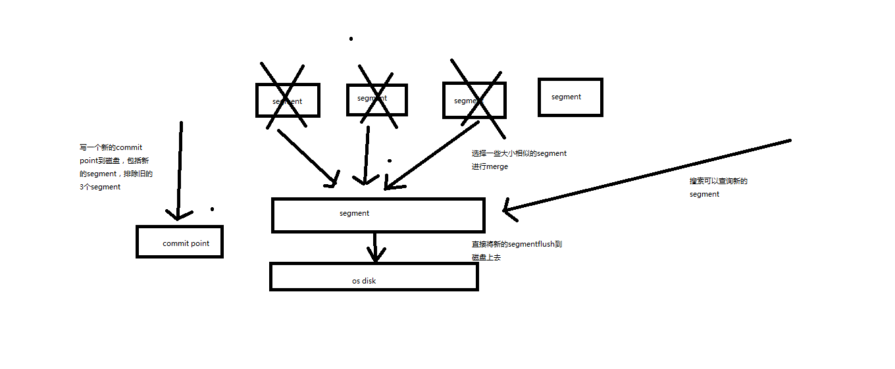


- [回到目录](#Elasticsearch顶尖高手系列课程-核心知识篇)

## 第72节：Java API初步使用_员工管理案例：基于Java实现员工信息的增删改查

课程大纲

强调一下，我们的es讲课的风格

1、es这门技术有点特殊，跟比如其他的像纯java的课程，比如分布式课程，或者大数据类的课程，比如hadoop，spark，storm等。不太一样

2、es非常重要的一个api，是它的restful api，你自己思考一下，掌握这个es的restful api，可以让你执行一些核心的运维管理的操作，比如说创建索引，维护索引，执行各种refresh、flush、optimize操作，查看集群的健康状况，比如还有其他的一些操作，就不在这里枚举了。或者说探查一些数据，可能用java api并不方便。

3、es的学习，首先，你必须学好restful api，然后才是你自己的熟悉语言的api，java api。

这个《核心知识篇（上半季）》，其实主要还是打基础，包括核心的原理，还有核心的操作，还有部分高级的技术和操作，大量的实验，大量的画图，最后初步讲解怎么使用java api

《核心知识篇（下半季）》，包括深度讲解搜索这块技术，还有聚合分析这块技术，包括数据建模，包括java api的复杂使用，有一个项目实战s

```java
员工信息

姓名
年龄
职位
国家
入职日期
薪水
```

我是默认大家至少有java基础的，如果你java一点都不会，请先自己补一下

> 1、maven依赖

```java
<dependency>
    <groupId>org.elasticsearch.client</groupId>
    <artifactId>transport</artifactId>
    <version>5.2.2</version>
</dependency>
<dependency>
    <groupId>org.apache.logging.log4j</groupId>
    <artifactId>log4j-api</artifactId>
    <version>2.7</version>
</dependency>
<dependency>
    <groupId>org.apache.logging.log4j</groupId>
    <artifactId>log4j-core</artifactId>
    <version>2.7</version>
</dependency>

log4j2.properties

appender.console.type = Console
appender.console.name = console
appender.console.layout.type = PatternLayout

rootLogger.level = info
rootLogger.appenderRef.console.ref = console
```

> 2、构建client

```java
Settings settings = Settings.builder()
        .put("cluster.name", "myClusterName").build();
TransportClient client = new PreBuiltTransportClient(settings);

TransportClient client = new PreBuiltTransportClient(Settings.EMPTY)
        .addTransportAddress(new InetSocketTransportAddress(InetAddress.getByName("host1"), 9300))
        .addTransportAddress(new InetSocketTransportAddress(InetAddress.getByName("host2"), 9300));

client.close();

```
> 3、创建document

```java
IndexResponse response = client.prepareIndex("index", "type", "1")
        .setSource(jsonBuilder()
                    .startObject()
                        .field("user", "kimchy")
                        .field("postDate", new Date())
                        .field("message", "trying out Elasticsearch")
                    .endObject()
                  )
        .get();
```

> 4、查询document

GetResponse response = client.prepareGet("index", "type", "1").get();

> 5、修改document

```java
client.prepareUpdate("index", "type", "1")
        .setDoc(jsonBuilder()               
            .startObject()
                .field("gender", "male")
            .endObject())
        .get();
```

> 6、删除document

DeleteResponse response = client.prepareDelete("index", "type", "1").get();


- [回到目录](#Elasticsearch顶尖高手系列课程-核心知识篇)

## 第73节：Java API初步使用_员工管理案例：基于Java对员工信息进行复杂的搜索操作

课程大纲

```java
SearchResponse response = client.prepareSearch("index1", "index2")
        .setTypes("type1", "type2")
        .setQuery(QueryBuilders.termQuery("multi", "test"))                 // Query
        .setPostFilter(QueryBuilders.rangeQuery("age").from(12).to(18))     // Filter
        .setFrom(0).setSize(60)
        .get();

```
需求：

- （1）搜索职位中包含technique的员工
- （2）同时要求age在30到40岁之间
- （3）分页查询，查找第一页

```java
GET /company/employee/_search
{
  "query": {
    "bool": {
      "must": [
        {
          "match": {
            "position": "technique"
          }
        }
      ],
      "filter": {
        "range": {
          "age": {
            "gte": 30,
            "lte": 40
          }
        }
      }
    }
  },
  "from": 0,
  "size": 1
}
```

告诉大家，为什么刚才一边运行创建document，一边搜索什么都没搜索到？？？？

近实时！！！

默认是1秒以后，写入es的数据，才能被搜索到。很明显刚才，写入数据不到一秒，我门就在搜索。


- [回到目录](#Elasticsearch顶尖高手系列课程-核心知识篇)


## 第74节：Java API初步使用_员工管理案例：基于Java对员工信息进行聚合分析


课程大纲

```java
SearchResponse sr = node.client().prepareSearch()
    .addAggregation(
        AggregationBuilders.terms("by_country").field("country")
        .subAggregation(AggregationBuilders.dateHistogram("by_year")
            .field("dateOfBirth")
            .dateHistogramInterval(DateHistogramInterval.YEAR)
            .subAggregation(AggregationBuilders.avg("avg_children").field("children"))
        )
    )
    .execute().actionGet();
```

我们先给个需求：

- （1）首先按照country国家来进行分组
- （2）然后在每个country分组内，再按照入职年限进行分组
- （3）最后计算每个分组内的平均薪资

```java
PUT /company
{
  "mappings": {
      "employee": {
        "properties": {
          "age": {
            "type": "long"
          },
          "country": {
            "type": "text",
            "fields": {
              "keyword": {
                "type": "keyword",
                "ignore_above": 256
              }
            },
            "fielddata": true
          },
          "join_date": {
            "type": "date"
          },
          "name": {
            "type": "text",
            "fields": {
              "keyword": {
                "type": "keyword",
                "ignore_above": 256
              }
            }
          },
          "position": {
            "type": "text",
            "fields": {
              "keyword": {
                "type": "keyword",
                "ignore_above": 256
              }
            }
          },
          "salary": {
            "type": "long"
          }
        }
      }
    }
}
```

```java
GET /company/employee/_search
{
  "size": 0,
  "aggs": {
    "group_by_country": {
      "terms": {
        "field": "country"
      },
      "aggs": {
        "group_by_join_date": {
          "date_histogram": {
            "field": "join_date",
            "interval": "year"
          },
          "aggs": {
            "avg_salary": {
              "avg": {
                "field": "salary"
              }
            }
          }
        }
      }
    }
  }
}
```

```java
Map<String, Aggregation> aggrMap = searchResponse.getAggregations().asMap();
		StringTerms groupByCountry = (StringTerms) aggrMap.get("group_by_country");
		Iterator<Bucket> groupByCountryBucketIterator = groupByCountry.getBuckets().iterator();
		
		while(groupByCountryBucketIterator.hasNext()) {
			Bucket groupByCountryBucket = groupByCountryBucketIterator.next();
			
			System.out.println(groupByCountryBucket.getKey() + "\t" + groupByCountryBucket.getDocCount()); 
			
			Histogram groupByJoinDate = (Histogram) groupByCountryBucket.getAggregations().asMap().get("group_by_join_date"); 
			Iterator<org.elasticsearch.search.aggregations.bucket.histogram.Histogram.Bucket> groupByJoinDateBucketIterator = groupByJoinDate.getBuckets().iterator();
			 
			while(groupByJoinDateBucketIterator.hasNext()) {
				org.elasticsearch.search.aggregations.bucket.histogram.Histogram.Bucket groupByJoinDateBucket = groupByJoinDateBucketIterator.next();
				
				System.out.println(groupByJoinDateBucket.getKey() + "\t" + groupByJoinDateBucket.getDocCount()); 
				
				Avg avgSalary = (Avg) groupByJoinDateBucket.getAggregations().asMap().get("avg_salary");
				System.out.println(avgSalary.getValue()); 
			}
		}
		
		client.close();
	}
```


- [回到目录](#Elasticsearch顶尖高手系列课程-核心知识篇)


