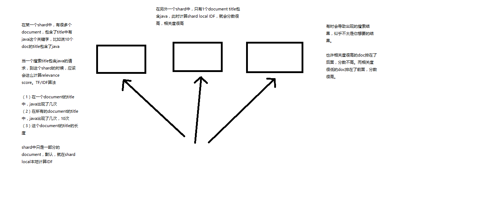
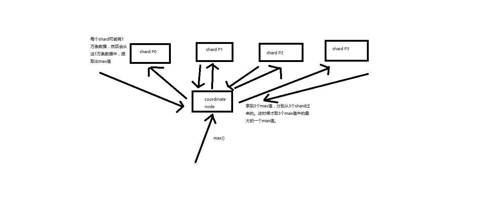

# Elasticsearch顶尖高手系列-高手进阶篇

<!-- MarkdownTOC -->

- [01_结构化搜索_IT技术论坛案例背景介绍](#01_结构化搜索_IT技术论坛案例背景介绍)
- [02_结构化搜索_在案例中实战使用term filter来搜索数据](#02_结构化搜索_在案例中实战使用term-filter来搜索数据)
- [03_结构化搜索_filter执行原理深度剖析（bitset机制与caching机制）](#03_结构化搜索_filter执行原理深度剖析bitset机制与caching机制)
- [04_结构化搜索_在案例中实战基于bool组合多个filter条件来搜索数据](#04_结构化搜索_在案例中实战基于bool组合多个filter条件来搜索数据)
- [05_结构化搜索_在案例中实战使用terms搜索多个值以及多值搜索结果优化](#05_结构化搜索_在案例中实战使用terms搜索多个值以及多值搜索结果优化)
- [06_结构化搜索_在案例中实战基于range filter来进行范围过滤](#06_结构化搜索_在案例中实战基于range-filter来进行范围过滤)
- [07_深度探秘搜索技术_在案例中体验如何手动控制全文检索结果的精准度](#07_深度探秘搜索技术_在案例中体验如何手动控制全文检索结果的精准度)
- [08_深度探秘搜索技术_基于term+bool实现的multiword搜索底层原理剖析](#08_深度探秘搜索技术_基于termbool实现的multiword搜索底层原理剖析)
- [09_深度探秘搜索技术_基于boost的细粒度搜索条件权重控制](#09_深度探秘搜索技术_基于boost的细粒度搜索条件权重控制)
- [10_深度探秘搜索技术_多shard场景下relevance-score不准确问题大揭秘](#10_深度探秘搜索技术_多shard场景下relevance-score不准确问题大揭秘)
- [11_案例实战基于dis_max实现best fields策略进行多字段搜索](#11_深度探秘搜索技术_案例实战基于dis_max实现best-fields策略进行多字段搜索)
- [12_深度探秘搜索技术_案例实战基于tie_breaker参数优化dis_max搜索效果](#12_深度探秘搜索技术_案例实战基于tie_breaker参数优化dis_max搜索效果)
- [13_深度探秘搜索技术_案例实战基于multi_match语法实现dis_max+tie_breaker](#13_深度探秘搜索技术_案例实战基于multi_match语法实现dis_maxtie_breaker)
- [14_深度探秘搜索技术_基于multi_match+most-fiels策略进行multi-field搜索](#14_深度探秘搜索技术_基于multi_matchmost-fiels策略进行multi-field搜索)
- [15_深度探秘搜索技术_使用most_fields策略进行cross-fields-search弊端大揭秘](#15_深度探秘搜索技术_使用most_fields策略进行cross-fields-search弊端大揭秘)
- [16_深度探秘搜索技术_使用copy_to定制组合field解决cross-fields搜索弊端](#16_深度探秘搜索技术_使用copy_to定制组合field解决cross-fields搜索弊端)
- [17_深度探秘搜索技术_使用原生cross-fiels技术解决搜索弊端](#17_深度探秘搜索技术_使用原生cross-fiels技术解决搜索弊端)
- [18_深度探秘搜索技术_在案例实战中掌握phrase-matching搜索技术](#18_深度探秘搜索技术_在案例实战中掌握phrase-matching搜索技术)
- [19_深度探秘搜索技术_基于slop参数实现近似匹配以及原理剖析和相关实验](#19_深度探秘搜索技术_基于slop参数实现近似匹配以及原理剖析和相关实验)
- [20_深度探秘搜索技术_混合使用match和近似匹配实现召回率与精准度的平衡](#20_深度探秘搜索技术_混合使用match和近似匹配实现召回率与精准度的平衡)
- [21_深度探秘搜索技术_使用rescoring机制优化近似匹配搜索的性能](#21_深度探秘搜索技术_使用rescoring机制优化近似匹配搜索的性能)
- [22_深度探秘搜索技术_实战前缀搜索、通配符搜索、正则搜索等技术](#22_深度探秘搜索技术_实战前缀搜索通配符搜索正则搜索等技术)
- [23_深度探秘搜索技术_实战match_phrase_prefix实现search-time搜索推荐](#23_深度探秘搜索技术_实战match_phrase_prefix实现search-time搜索推荐)
- [24_深度探秘搜索技术_实战通过ngram分词机制实现index-time搜索推荐](#24_深度探秘搜索技术_实战通过ngram分词机制实现index-time搜索推荐)
- [25_深度探秘搜索技术_深入揭秘TF&IDF算法以及向量空间模型算法](#25_深度探秘搜索技术_深入揭秘TFIDF算法以及向量空间模型算法)
- [26_深度探秘搜索技术_深入揭秘lucene的相关度分数算法](#26_深度探秘搜索技术_深入揭秘lucene的相关度分数算法)
- [27_深度探秘搜索技术_实战掌握四种常见的相关度分数优化方法](#27_深度探秘搜索技术_实战掌握四种常见的相关度分数优化方法)
- [28_深度探秘搜索技术_实战用function_score自定义相关度分数算法](#28_深度探秘搜索技术_实战用function_score自定义相关度分数算法)
- [29_深度探秘搜索技术_实战掌握误拼写时的fuzzy模糊搜索技术](#29_深度探秘搜索技术_实战掌握误拼写时的fuzzy模糊搜索技术)
- [30_彻底掌握IK中文分词_上机动手实战IK中文分词器的安装和使用](#30_彻底掌握IK中文分词_上机动手实战IK中文分词器的安装和使用)
- [31_彻底掌握IK中文分词_IK分词器配置文件讲解以及自定义词库实战](#31_彻底掌握IK中文分词_IK分词器配置文件讲解以及自定义词库实战)
- [32_彻底掌握IK中文分词_修改IK分词器源码来基于mysql热更新词库](#32_彻底掌握IK中文分词_修改IK分词器源码来基于mysql热更新词库)
- [33_深入聚合数据分析_bucket与metric两个核心概念的讲解](#33_深入聚合数据分析_bucket与metric两个核心概念的讲解)
- [34_深入聚合数据分析_家电卖场案例以及统计哪种颜色电视销量最高](#34_深入聚合数据分析_家电卖场案例以及统计哪种颜色电视销量最高)
- [35_深入聚合数据分析_实战bucket+metric：统计每种颜色电视平均价格](#35_深入聚合数据分析_实战bucketmetric统计每种颜色电视平均价格)
- [36_深入聚合数据分析_bucket嵌套实现颜色+品牌的多层下钻分析](#36_深入聚合数据分析_bucket嵌套实现颜色品牌的多层下钻分析)
- [37_深入聚合数据分析_掌握更多metrics：统计每种颜色电视最大最小价格](#37_深入聚合数据分析_掌握更多metrics统计每种颜色电视最大最小价格)
- [38_深入聚合数据分析_实战hitogram按价格区间统计电视销量和销售额](#38_深入聚合数据分析_实战hitogram按价格区间统计电视销量和销售额)
- [39_深入聚合数据分析_实战date-hitogram之统计每月电视销量](#39_深入聚合数据分析_实战date-hitogram之统计每月电视销量)
- [40_深入聚合数据分析_下钻分析之统计每季度每个品牌的销售额](#40_深入聚合数据分析_下钻分析之统计每季度每个品牌的销售额)
- [41_深入聚合数据分析_搜索+聚合：统计指定品牌下每个颜色的销量](#41_深入聚合数据分析_搜索+聚合统计指定品牌下每个颜色的销量)
- [42_深入聚合数据分析_global-bucket：单个品牌与所有品牌销量对比](#42_深入聚合数据分析_global-bucket单个品牌与所有品牌销量对比)
- [43_深入聚合数据分析_过滤+聚合：统计价格大于1200的电视平均价格](#43_深入聚合数据分析_过滤+聚合统计价格大于1200的电视平均价格)
- [44_深入聚合数据分析_bucket-filter：统计牌品最近一个月的平均价格](#44_深入聚合数据分析_bucket-filter统计牌品最近一个月的平均价格)
- [45_深入聚合数据分析_排序：按每种颜色的平均销售额降序排序](#45_深入聚合数据分析_排序按每种颜色的平均销售额降序排序)
- [46_深入聚合数据分析_颜色+品牌下钻分析时按最深层metric进行排序](#46_深入聚合数据分析_颜色品牌下钻分析时按最深层metric进行排序)
- [47_深入聚合数据分析_易并行聚合算法，三角选择原则，近似聚合算法](#47_深入聚合数据分析_易并行聚合算法三角选择原则近似聚合算法)
- [48_深入聚合数据分析_cardinality去重算法以及每月销售品牌数量统计](#48_深入聚合数据分析_cardinality去重算法以及每月销售品牌数量统计)
- [49_深入聚合数据分析_cardinality算法之优化内存开销以及HLL算法](#49_深入聚合数据分析_cardinality算法之优化内存开销以及HLL算法)
- [50_深入聚合数据分析_percentiles百分比算法以及网站访问时延统计](#50_深入聚合数据分析_percentiles百分比算法以及网站访问时延统计)
- [51_深入聚合数据分析_percentiles-rank以及网站访问时延SLA统计](#51_深入聚合数据分析_percentiles-rank以及网站访问时延SLA统计)
- [52_深入聚合数据分析_基于doc-value正排索引的聚合内部原理](#52_深入聚合数据分析_基于doc-value正排索引的聚合内部原理)
- [53_深入聚合数据分析_doc-value机制内核级原理深入探秘](#53_深入聚合数据分析_doc-value机制内核级原理深入探秘)
- [54_深入聚合数据分析_string-field聚合实验以及fielddata原理初探](#54_深入聚合数据分析_string-field聚合实验以及fielddata原理初探)
- [55_深入聚合数据分析_fielddata内存控制以及circuit-breaker断路器](#55_深入聚合数据分析_fielddata内存控制以及circuit-breaker断路器)
- [56_深入聚合数据分析_fielddata-filter的细粒度内存加载控制](#56_深入聚合数据分析_fielddata-filter的细粒度内存加载控制)
- [57_深入聚合数据分析_fielddata预加载机制以及序号标记预加载](#57_深入聚合数据分析_fielddata预加载机制以及序号标记预加载)
- [58_深入聚合数据分析_海量bucket优化机制：从深度优先到广度优先](#58_深入聚合数据分析_海量bucket优化机制从深度优先到广度优先)
- [59_数据建模实战_关系型与document类型数据模型对比](#59_数据建模实战_关系型与document类型数据模型对比)
- [60_数据建模实战_通过应用层join实现用户与博客的关联](#60_数据建模实战_通过应用层join实现用户与博客的关联)
- [61_数据建模实战_通过数据冗余实现用户与博客的关联](#61_数据建模实战_通过数据冗余实现用户与博客的关联)
- [62_数据建模实战_对每个用户发表的博客进行分组](#62_数据建模实战_对每个用户发表的博客进行分组)
- [63_数据建模实战_对文件系统进行数据建模以及文件搜索实战](#63_数据建模实战_对文件系统进行数据建模以及文件搜索实战)
- [64_数据建模实战_基于全局锁实现悲观锁并发控制](#64_数据建模实战_基于全局锁实现悲观锁并发控制)
- [65_数据建模实战_基于document锁实现悲观锁并发控制](#65_数据建模实战_基于document锁实现悲观锁并发控制)
- [66_数据建模实战_基于共享锁和排他锁实现悲观锁并发控制](#66_数据建模实战_基于共享锁和排他锁实现悲观锁并发控制)
- [67_数据建模实战_基于nested-object实现博客与评论嵌套关系](#67_数据建模实战_基于nested-object实现博客与评论嵌套关系)
- [68_数据建模实战_对嵌套的博客评论数据进行聚合分析](#68_数据建模实战_对嵌套的博客评论数据进行聚合分析)
- [69_数据建模实战_研发中心管理案例以及父子关系数据建模](#69_数据建模实战_研发中心管理案例以及父子关系数据建模)
- [70_数据建模实战_根据员工信息和研发中心互相搜索父子数据](#70_数据建模实战_根据员工信息和研发中心互相搜索父子数据)
- [71_数据建模实战_对每个国家的员工兴趣爱好进行聚合统计](#71_数据建模实战_对每个国家的员工兴趣爱好进行聚合统计)
- [72_数据建模实战_祖孙三层数据关系建模以及搜索实战](#72_数据建模实战_祖孙三层数据关系建模以及搜索实战)
- [73_elasticsearch高手进阶_基于term-vector深入探查数据的情况](#73_elasticsearch高手进阶_基于term-vector深入探查数据的情况)
- [74_elasticsearch高手进阶_深入剖析搜索结果的highlight高亮显示](#74_elasticsearch高手进阶_深入剖析搜索结果的highlight高亮显示)
- [75_elasticsearch高手进阶_使用search-template将搜索模板化](#75_elasticsearch高手进阶_使用search-template将搜索模板化)
- [76_elasticsearch高手进阶_基于completion-suggest实现搜索提示](#76_elasticsearch高手进阶_基于completion-suggest实现搜索提示)
- [77_elasticsearch高手进阶_使用动态映射模板定制自己的映射策略](#77_elasticsearch高手进阶_使用动态映射模板定制自己的映射策略)
- [78_elasticsearch高手进阶_学习使用geo-point地理位置数据类型](#78_elasticsearch高手进阶_学习使用geo-point地理位置数据类型)
- [79_elasticsearch高手进阶_酒店o2o搜索案例以及搜索指定区域内的酒店](#79_elasticsearch高手进阶_酒店o2o搜索案例以及搜索指定区域内的酒店)
- [80_elasticsearch高手进阶_实战搜索距离当前位置一定范围内的酒店](#80_elasticsearch高手进阶_实战搜索距离当前位置一定范围内的酒店)
- [81_elasticsearch高手进阶_统计当前位置每个距离范围内有多少家酒店](#81_elasticsearch高手进阶_统计当前位置每个距离范围内有多少家酒店)
- [82_熟练掌握ES-Java-API_client集群自动探查以及汽车零售店案例背景](#82_熟练掌握ES-Java-API_client集群自动探查以及汽车零售店案例背景)
- [83_熟练掌握ES-Java-API_基于upsert实现汽车最新价格的调整](#83_熟练掌握ES-Java-API_基于upsert实现汽车最新价格的调整)
- [84_熟练掌握ES-Java-API_基于mget实现多辆汽车的配置与价格对比](#84_熟练掌握ES-Java-API_基于mget实现多辆汽车的配置与价格对比)
- [85_熟练掌握ES-Java-API_基于bulk实现多4S店销售数据批量上传](#85_熟练掌握ES-Java-API_基于bulk实现多4S店销售数据批量上传)
- [86_熟练掌握ES-Java-API_基于scroll实现月度销售数据批量下载](#86_熟练掌握ES-Java-API_基于scroll实现月度销售数据批量下载)
- [87_熟练掌握ES-Java-API_基于search-template实现按品牌分页查询模板](#87_熟练掌握ES-Java-API_基于search-template实现按品牌分页查询模板)
- [88_熟练掌握ES-Java-API_对汽车品牌进行全文检索、精准查询和前缀搜索](#88_熟练掌握ES-Java-API_对汽车品牌进行全文检索精准查询和前缀搜索)
- [89_熟练掌握ES-Java-API_对汽车品牌进行多种条件的组合搜索](#89_熟练掌握ES-Java-API_对汽车品牌进行多种条件的组合搜索)
- [90_熟练掌握ES-Java-API_基于地理位置对周围汽车4S店进行搜索](#90_熟练掌握ES-Java-API_基于地理位置对周围汽车4S店进行搜索)
- [91_熟练掌握ES-Java-API_如何自己尝试API以掌握所有搜索和聚合的语法](#91_熟练掌握ES-Java-API_如何自己尝试API以掌握所有搜索和聚合的语法)
- [92_快速入门篇以及高手进阶篇课程总结，以及后续阶段课程介绍](#92_快速入门篇以及高手进阶篇课程总结以及后续阶段课程介绍)

<!-- /MarkdownTOC -->


------------------------------------------------------------------------------------


## 01_结构化搜索_IT技术论坛案例背景介绍

课程大纲

IT技术论坛，案例背景

IT技术论坛中相关的数据，会在es中建立数据的索引

深度讲解搜索，数据分析，数据建模

特色：纯手工画图剖析各种原理，纯实战驱动讲解各种知识点，知识体系的细致和完整

怎么实战驱动？

核心知识篇，上半季，我们也是纯实战驱动，但是之前没有一个统一的案例背景

IT技术论坛，发各种IT技术的帖子：一种是自己研究了一个技术，就发出来一些研究心得；自己遇到了问题，发个帖子问一问。帖子会有人回复，还会有人浏览。当然了，还有一些论坛会提供简单社交的一个功能，互相加好友，互相关注，互相点赞，之类的。

在IT技术论坛的背景下，去开发一些跟案例背景相关的搜索或者数据分析，或者数据建模的需求，用每一讲学到的知识点，去接解决一些问题

既可以学到知识和技术，也可以在真实的案例背景中练习一下学到的东西

- [回到目录](#Elasticsearch顶尖高手系列-高手进阶篇)

## 02_结构化搜索_在案例中实战使用term filter来搜索数据

课程大纲

> 1、根据用户ID、是否隐藏、帖子ID、发帖日期来搜索帖子

>> （1）插入一些测试帖子数据

```java
POST /forum/article/_bulk
{ "index": { "_id": 1 }}
{ "articleID" : "XHDK-A-1293-#fJ3", "userID" : 1, "hidden": false, "postDate": "2017-01-01" }
{ "index": { "_id": 2 }}
{ "articleID" : "KDKE-B-9947-#kL5", "userID" : 1, "hidden": false, "postDate": "2017-01-02" }
{ "index": { "_id": 3 }}
{ "articleID" : "JODL-X-1937-#pV7", "userID" : 2, "hidden": false, "postDate": "2017-01-01" }
{ "index": { "_id": 4 }}
{ "articleID" : "QQPX-R-3956-#aD8", "userID" : 2, "hidden": true, "postDate": "2017-01-02" }
```

初步来说，就先搞4个字段，因为整个es是支持json document格式的，所以说扩展性和灵活性非常之好。
如果后续随着业务需求的增加，要在document中增加更多的field，那么我们可以很方便的随时添加field。
但是如果是在关系型数据库中，比如mysql，我们建立了一个表，现在要给表中新增一些column，那就很坑爹了，
必须用复杂的修改表结构的语法去执行。而且可能对系统代码还有一定的影响。

GET /forum/_mapping/article

```java
{
  "forum": {
    "mappings": {
      "article": {
        "properties": {
          "articleID": {
            "type": "text",
            "fields": {
              "keyword": {
                "type": "keyword",
                "ignore_above": 256
              }
            }
          },
          "hidden": {
            "type": "boolean"
          },
          "postDate": {
            "type": "date"
          },
          "userID": {
            "type": "long"
          }
        }
      }
    }
  }
}
```

现在es 5.2版本，type=text，默认会设置两个field，一个是field本身，比如articleID，就是分词的；
还有一个的话，就是field.keyword，articleID.keyword，默认不分词，会最多保留256个字符

>> （2）根据用户ID搜索帖子

```java
GET /forum/article/_search
{
    "query" : {
        "constant_score" : { 
            "filter" : {
                "term" : { 
                    "userID" : 1
                }
            }
        }
    }
}
```

term filter/query：对搜索文本不分词，直接拿去倒排索引中匹配，你输入的是什么，就去匹配什么
比如说，如果对搜索文本进行分词的话，“helle world” --> “hello”和“world”，两个词分别去倒排索引中匹配
term，“hello world” --> “hello world”，直接去倒排索引中匹配“hello world”

>> （3）搜索没有隐藏的帖子

```java
GET /forum/article/_search
{
    "query" : {
        "constant_score" : { 
            "filter" : {
                "term" : { 
                    "hidden" : false
                }
            }
        }
    }
}

```

>> （4）根据发帖日期搜索帖子

```java
GET /forum/article/_search
{
    "query" : {
        "constant_score" : { 
            "filter" : {
                "term" : { 
                    "postDate" : "2017-01-01"
                }
            }
        }
    }
}
```

>> （5）根据帖子ID搜索帖子

```java
GET /forum/article/_search
{
    "query" : {
        "constant_score" : { 
            "filter" : {
                "term" : { 
                    "articleID" : "XHDK-A-1293-#fJ3"
                }
            }
        }
    }
}

{
  "took": 1,
  "timed_out": false,
  "_shards": {
    "total": 5,
    "successful": 5,
    "failed": 0
  },
  "hits": {
    "total": 0,
    "max_score": null,
    "hits": []
  }
}

```


```java
GET /forum/article/_search
{
    "query" : {
        "constant_score" : { 
            "filter" : {
                "term" : { 
                    "articleID.keyword" : "XHDK-A-1293-#fJ3"
                }
            }
        }
    }
}

{
  "took": 2,
  "timed_out": false,
  "_shards": {
    "total": 5,
    "successful": 5,
    "failed": 0
  },
  "hits": {
    "total": 1,
    "max_score": 1,
    "hits": [
      {
        "_index": "forum",
        "_type": "article",
        "_id": "1",
        "_score": 1,
        "_source": {
          "articleID": "XHDK-A-1293-#fJ3",
          "userID": 1,
          "hidden": false,
          "postDate": "2017-01-01"
        }
      }
    ]
  }
}
```

articleID.keyword，是es最新版本内置建立的field，就是不分词的。所以一个articleID过来的时候，
会建立两次索引，一次是自己本身，是要分词的，分词后放入倒排索引；
另外一次是基于articleID.keyword，不分词，保留256个字符最多，直接一个字符串放入倒排索引中。

所以term filter，对text过滤，可以考虑使用内置的field.keyword来进行匹配。但是有个问题，默认就保留256个字符。
所以尽可能还是自己去手动建立索引，指定not_analyzed吧。在最新版本的es中，不需要指定not_analyzed也可以，将type=keyword即可。

>> （6）查看分词

GET /forum/_analyze
{
  "field": "articleID",
  "text": "XHDK-A-1293-#fJ3"
}

默认是analyzed的text类型的field，建立倒排索引的时候，就会对所有的articleID分词，分词以后，原本的articleID就没有了，只有分词后的各个word存在于倒排索引中。
term，是不对搜索文本分词的，XHDK-A-1293-#fJ3 --> XHDK-A-1293-#fJ3；但是articleID建立索引的时候，XHDK-A-1293-#fJ3 --> xhdk，a，1293，fj3

>> （7）重建索引

```java
DELETE /forum

PUT /forum
{
  "mappings": {
    "article": {
      "properties": {
        "articleID": {
          "type": "keyword"
        }
      }
    }
  }
}

POST /forum/article/_bulk
{ "index": { "_id": 1 }}
{ "articleID" : "XHDK-A-1293-#fJ3", "userID" : 1, "hidden": false, "postDate": "2017-01-01" }
{ "index": { "_id": 2 }}
{ "articleID" : "KDKE-B-9947-#kL5", "userID" : 1, "hidden": false, "postDate": "2017-01-02" }
{ "index": { "_id": 3 }}
{ "articleID" : "JODL-X-1937-#pV7", "userID" : 2, "hidden": false, "postDate": "2017-01-01" }
{ "index": { "_id": 4 }}
{ "articleID" : "QQPX-R-3956-#aD8", "userID" : 2, "hidden": true, "postDate": "2017-01-02" }
```

>> （8）重新根据帖子ID和发帖日期进行搜索

```java
GET /forum/article/_search
{
    "query" : {
        "constant_score" : { 
            "filter" : {
                "term" : { 
                    "articleID" : "XHDK-A-1293-#fJ3"
                }
            }
        }
    }
}

```
> 2、梳理学到的知识点

- （1）term filter：根据exact value进行搜索，数字、boolean、date天然支持
- （2）text需要建索引时指定为not_analyzed，才能用term query
- （3）相当于SQL中的单个where条件

```java
select *
from forum.article
where articleID='XHDK-A-1293-#fJ3'
```


- [回到目录](#Elasticsearch顶尖高手系列-高手进阶篇)


## 03_结构化搜索_filter执行原理深度剖析（bitset机制与caching机制）

课程大纲

> （1）在倒排索引中查找搜索串，获取document list

date来举例

```java
word		doc1		doc2		doc3

2017-01-01	*		*
2017-02-02			*		*
2017-03-03	*		*		*
```

filter：2017-02-02

到倒排索引中一找，发现2017-02-02对应的document list是doc2,doc3

>> （2）为每个在倒排索引中搜索到的结果，构建一个bitset，[0, 0, 0, 1, 0, 1]

非常重要

使用找到的doc list，构建一个bitset，就是一个二进制的数组，数组每个元素都是0或1，用来标识一个doc对一个filter条件是否匹配，如果匹配就是1，不匹配就是0

[0, 1, 1]

doc1：不匹配这个filter的

doc2和do3：是匹配这个filter的

尽可能用简单的数据结构去实现复杂的功能，可以节省内存空间，提升性能

>> （3）遍历每个过滤条件对应的bitset，优先从最稀疏的开始搜索，查找满足所有条件的document

后面会讲解，一次性其实可以在一个search请求中，发出多个filter条件，每个filter条件都会对应一个bitset
遍历每个filter条件对应的bitset，先从最稀疏的开始遍历

[0, 0, 0, 1, 0, 0]：比较稀疏
[0, 1, 0, 1, 0, 1]

先遍历比较稀疏的bitset，就可以先过滤掉尽可能多的数据

遍历所有的bitset，找到匹配所有filter条件的doc

请求：filter，postDate=2017-01-01，userID=1

postDate: [0, 0, 1, 1, 0, 0]
userID:   [0, 1, 0, 1, 0, 1]

遍历完两个bitset之后，找到的匹配所有条件的doc，就是doc4

就可以将document作为结果返回给client了

> （4）caching bitset，跟踪query，在最近256个query中超过一定次数的过滤条件，缓存其bitset。对于小segment（<1000，或<3%），不缓存bitset。

比如postDate=2017-01-01，[0, 0, 1, 1, 0, 0]，可以缓存在内存中，这样下次如果再有这个条件过来的时候，就不用重新扫描倒排索引，反复生成bitset，可以大幅度提升性能。

在最近的256个filter中，有某个filter超过了一定的次数，次数不固定，就会自动缓存这个filter对应的bitset

segment（上半季），filter针对小segment获取到的结果，可以不缓存，segment记录数<1000，或者segment大小<index总大小的3%

segment数据量很小，此时哪怕是扫描也很快；segment会在后台自动合并，小segment很快就会跟其他小segment合并成大segment，此时就缓存也没有什么意义，segment很快就消失了

针对一个小segment的bitset，[0, 0, 1, 0]

filter比query的好处就在于会caching，但是之前不知道caching的是什么东西，实际上并不是一个filter返回的完整的doc list数据结果。而是filter bitset缓存起来。下次不用扫描倒排索引了。

> （5）filter大部分情况下来说，在query之前执行，先尽量过滤掉尽可能多的数据

- query：是会计算doc对搜索条件的relevance score，还会根据这个score去排序
- filter：只是简单过滤出想要的数据，不计算relevance score，也不排序

> （6）如果document有新增或修改，那么cached bitset会被自动更新

postDate=2017-01-01，[0, 0, 1, 0]

document，id=5，postDate=2017-01-01，会自动更新到postDate=2017-01-01这个filter的bitset中，全自动，缓存会自动更新。postDate=2017-01-01的bitset，[0, 0, 1, 0, 1]

document，id=1，postDate=2016-12-30，修改为postDate-2017-01-01，此时也会自动更新bitset，[1, 0, 1, 0, 1]

> （7）以后只要是有相同的filter条件的，会直接来使用这个过滤条件对应的cached bitset


- [回到目录](#Elasticsearch顶尖高手系列-高手进阶篇)

## 04_结构化搜索_在案例中实战基于bool组合多个filter条件来搜索数据

课程大纲

> 1、搜索发帖日期为2017-01-01，或者帖子ID为XHDK-A-1293-#fJ3的帖子，同时要求帖子的发帖日期绝对不为2017-01-02

```java
select *
from forum.article
where (post_date='2017-01-01' or article_id='XHDK-A-1293-#fJ3')
and post_date!='2017-01-02'
```

```java
GET /forum/article/_search
{
  "query": {
    "constant_score": {
      "filter": {
        "bool": {
          "should": [
            {"term": { "postDate": "2017-01-01" }},
            {"term": {"articleID": "XHDK-A-1293-#fJ3"}}
          ],
          "must_not": {
            "term": {
              "postDate": "2017-01-02"
            }
          }
        }
      }
    }
  }
}
```

must，should，must_not，filter：必须匹配，可以匹配其中任意一个即可，必须不匹配

> 2、搜索帖子ID为XHDK-A-1293-#fJ3，或者是帖子ID为JODL-X-1937-#pV7而且发帖日期为2017-01-01的帖子

```java
select *
from forum.article
where article_id='XHDK-A-1293-#fJ3'
or (article_id='JODL-X-1937-#pV7' and post_date='2017-01-01')
```

```java
GET /forum/article/_search 
{
  "query": {
    "constant_score": {
      "filter": {
        "bool": {
          "should": [
            {
              "term": {
                "articleID": "XHDK-A-1293-#fJ3"
              }
            },
            {
              "bool": {
                "must": [
                  {
                    "term":{
                      "articleID": "JODL-X-1937-#pV7"
                    }
                  },
                  {
                    "term": {
                      "postDate": "2017-01-01"
                    }
                  }
                ]
              }
            }
          ]
        }
      }
    }
  }
}

```
> 3、梳理学到的知识点

- （1）bool：must，must_not，should，组合多个过滤条件
- （2）bool可以嵌套
- （3）相当于SQL中的多个and条件：当你把搜索语法学好了以后，基本可以实现部分常用的sql语法对应的功能


- [回到目录](#Elasticsearch顶尖高手系列-高手进阶篇)

## 05_结构化搜索_在案例中实战使用terms搜索多个值以及多值搜索结果优化

课程大纲

- term: {"field": "value"}
- terms: {"field": ["value1", "value2"]}

sql中的in

select * from tbl where col in ("value1", "value2")

> 1、为帖子数据增加tag字段

```java
POST /forum/article/_bulk
{ "update": { "_id": "1"} }
{ "doc" : {"tag" : ["java", "hadoop"]} }
{ "update": { "_id": "2"} }
{ "doc" : {"tag" : ["java"]} }
{ "update": { "_id": "3"} }
{ "doc" : {"tag" : ["hadoop"]} }
{ "update": { "_id": "4"} }
{ "doc" : {"tag" : ["java", "elasticsearch"]} }
```

> 2、搜索articleID为KDKE-B-9947-#kL5或QQPX-R-3956-#aD8的帖子，搜索tag中包含java的帖子

```java
GET /forum/article/_search 
{
  "query": {
    "constant_score": {
      "filter": {
        "terms": {
          "articleID": [
            "KDKE-B-9947-#kL5",
            "QQPX-R-3956-#aD8"
          ]
        }
      }
    }
  }
}
```

```java
GET /forum/article/_search
{
    "query" : {
        "constant_score" : {
            "filter" : {
                "terms" : { 
                    "tag" : ["java"]
                }
            }
        }
    }
}


  "took": 2,
  "timed_out": false,
  "_shards": {
    "total": 5,
    "successful": 5,
    "failed": 0
  },
  "hits": {
    "total": 3,
    "max_score": 1,
    "hits": [
      {
        "_index": "forum",
        "_type": "article",
        "_id": "2",
        "_score": 1,
        "_source": {
          "articleID": "KDKE-B-9947-#kL5",
          "userID": 1,
          "hidden": false,
          "postDate": "2017-01-02",
          "tag": [
            "java"
          ]
        }
      },
      {
        "_index": "forum",
        "_type": "article",
        "_id": "4",
        "_score": 1,
        "_source": {
          "articleID": "QQPX-R-3956-#aD8",
          "userID": 2,
          "hidden": true,
          "postDate": "2017-01-02",
          "tag": [
            "java",
            "elasticsearch"
          ]
        }
      },
      {
        "_index": "forum",
        "_type": "article",
        "_id": "1",
        "_score": 1,
        "_source": {
          "articleID": "XHDK-A-1293-#fJ3",
          "userID": 1,
          "hidden": false,
          "postDate": "2017-01-01",
          "tag": [
            "java",
            "hadoop"
          ]
        }
      }
    ]
  }
}

```
> 3、优化搜索结果，仅仅搜索tag只包含java的帖子

```java
POST /forum/article/_bulk
{ "update": { "_id": "1"} }
{ "doc" : {"tag_cnt" : 2} }
{ "update": { "_id": "2"} }
{ "doc" : {"tag_cnt" : 1} }
{ "update": { "_id": "3"} }
{ "doc" : {"tag_cnt" : 1} }
{ "update": { "_id": "4"} }
{ "doc" : {"tag_cnt" : 2} }
```

```java
GET /forum/article/_search
{
  "query": {
    "constant_score": {
      "filter": {
        "bool": {
          "must": [
            {
              "term": {
                "tag_cnt": 1
              }
            },
            {
              "terms": {
                "tag": ["java"]
              }
            }
          ]
        }
      }
    }
  }
}
```

["java", "hadoop", "elasticsearch"]

> 4、学到的知识点梳理

- （1）terms多值搜索
- （2）优化terms多值搜索的结果
- （3）相当于SQL中的in语句


- [回到目录](#Elasticsearch顶尖高手系列-高手进阶篇)

## 06_结构化搜索_在案例中实战基于range filter来进行范围过滤

课程大纲

> 1、为帖子数据增加浏览量的字段

```java
POST /forum/article/_bulk
{ "update": { "_id": "1"} }
{ "doc" : {"view_cnt" : 30} }
{ "update": { "_id": "2"} }
{ "doc" : {"view_cnt" : 50} }
{ "update": { "_id": "3"} }
{ "doc" : {"view_cnt" : 100} }
{ "update": { "_id": "4"} }
{ "doc" : {"view_cnt" : 80} }
```

> 2、搜索浏览量在30~60之间的帖子

```java
GET /forum/article/_search
{
  "query": {
    "constant_score": {
      "filter": {
        "range": {
          "view_cnt": {
            "gt": 30,
            "lt": 60
          }
        }
      }
    }
  }
}

```
gte
lte

> 3、搜索发帖日期在最近1个月的帖子

```java
POST /forum/article/_bulk
{ "index": { "_id": 5 }}
{ "articleID" : "DHJK-B-1395-#Ky5", "userID" : 3, "hidden": false, "postDate": "2017-03-01", "tag": ["elasticsearch"], "tag_cnt": 1, "view_cnt": 10 }
```

```java
GET /forum/article/_search 
{
  "query": {
    "constant_score": {
      "filter": {
        "range": {
          "postDate": {
            "gt": "2017-03-10||-30d"
          }
        }
      }
    }
  }
}
```

```java
GET /forum/article/_search 
{
  "query": {
    "constant_score": {
      "filter": {
        "range": {
          "postDate": {
            "gt": "now-30d"
          }
        }
      }
    }
  }
}
```

> 4、梳理一下学到的知识点

- （1）range，sql中的between，或者是>=1，<=1
- （2）range做范围过滤


- [回到目录](#Elasticsearch顶尖高手系列-高手进阶篇)

## 07_深度探秘搜索技术_在案例中体验如何手动控制全文检索结果的精准度

课程大纲

> 1、为帖子数据增加标题字段

```java
POST /forum/article/_bulk
{ "update": { "_id": "1"} }
{ "doc" : {"title" : "this is java and elasticsearch blog"} }
{ "update": { "_id": "2"} }
{ "doc" : {"title" : "this is java blog"} }
{ "update": { "_id": "3"} }
{ "doc" : {"title" : "this is elasticsearch blog"} }
{ "update": { "_id": "4"} }
{ "doc" : {"title" : "this is java, elasticsearch, hadoop blog"} }
{ "update": { "_id": "5"} }
{ "doc" : {"title" : "this is spark blog"} }
```

> 2、搜索标题中包含java或elasticsearch的blog

这个，就跟之前的那个term query，不一样了。不是搜索exact value，是进行full text全文检索。
match query，是负责进行全文检索的。当然，如果要检索的field，是not_analyzed类型的，那么match query也相当于term query。

```java
GET /forum/article/_search
{
    "query": {
        "match": {
            "title": "java elasticsearch"
        }
    }
}
```

> 3、搜索标题中包含java和elasticsearch的blog

搜索结果精准控制的第一步：灵活使用and关键字，如果你是希望所有的搜索关键字都要匹配的，那么就用and，
可以实现单纯match query无法实现的效果

```java
GET /forum/article/_search
{
    "query": {
        "match": {
            "title": {
                "query": "java elasticsearch",
                "operator": "and"
   	        }
        }
    }
}
```

> 4、搜索包含java，elasticsearch，spark，hadoop，4个关键字中，至少3个的blog

控制搜索结果的精准度的第二步：指定一些关键字中，必须至少匹配其中的多少个关键字，才能作为结果返回

```java
GET /forum/article/_search
{
  "query": {
    "match": {
      "title": {
        "query": "java elasticsearch spark hadoop",
        "minimum_should_match": "75%"
      }
    }
  }
}
```

> 5、用bool组合多个搜索条件，来搜索title

```java
GET /forum/article/_search
{
  "query": {
    "bool": {
      "must":     { "match": { "title": "java" }},
      "must_not": { "match": { "title": "spark"  }},
      "should": [
                  { "match": { "title": "hadoop" }},
                  { "match": { "title": "elasticsearch"   }}
      ]
    }
  }
}

```

> 6、bool组合多个搜索条件，如何计算relevance score

must和should搜索对应的分数，加起来，除以must和should的总数

排名第一：java，同时包含should中所有的关键字，hadoop，elasticsearch

排名第二：java，同时包含should中的elasticsearch

排名第三：java，不包含should中的任何关键字

should是可以影响相关度分数的

must是确保说，谁必须有这个关键字，同时会根据这个must的条件去计算出document对这个搜索条件的relevance score
在满足must的基础之上，should中的条件，不匹配也可以，但是如果匹配的更多，那么document的relevance score就会更高

```java
{
  "took": 6,
  "timed_out": false,
  "_shards": {
    "total": 5,
    "successful": 5,
    "failed": 0
  },
  "hits": {
    "total": 3,
    "max_score": 1.3375794,
    "hits": [
      {
        "_index": "forum",
        "_type": "article",
        "_id": "4",
        "_score": 1.3375794,
        "_source": {
          "articleID": "QQPX-R-3956-#aD8",
          "userID": 2,
          "hidden": true,
          "postDate": "2017-01-02",
          "tag": [
            "java",
            "elasticsearch"
          ],
          "tag_cnt": 2,
          "view_cnt": 80,
          "title": "this is java, elasticsearch, hadoop blog"
        }
      },
      {
        "_index": "forum",
        "_type": "article",
        "_id": "1",
        "_score": 0.53484553,
        "_source": {
          "articleID": "XHDK-A-1293-#fJ3",
          "userID": 1,
          "hidden": false,
          "postDate": "2017-01-01",
          "tag": [
            "java",
            "hadoop"
          ],
          "tag_cnt": 2,
          "view_cnt": 30,
          "title": "this is java and elasticsearch blog"
        }
      },
      {
        "_index": "forum",
        "_type": "article",
        "_id": "2",
        "_score": 0.19856805,
        "_source": {
          "articleID": "KDKE-B-9947-#kL5",
          "userID": 1,
          "hidden": false,
          "postDate": "2017-01-02",
          "tag": [
            "java"
          ],
          "tag_cnt": 1,
          "view_cnt": 50,
          "title": "this is java blog"
        }
      }
    ]
  }
}
```

> 7、搜索java，hadoop，spark，elasticsearch，至少包含其中3个关键字

默认情况下，should是可以不匹配任何一个的，比如上面的搜索中，this is java blog，就不匹配任何一个should条件
但是有个例外的情况，如果没有must的话，那么should中必须至少匹配一个才可以
比如下面的搜索，should中有4个条件，默认情况下，只要满足其中一个条件，就可以匹配作为结果返回

但是可以精准控制，should的4个条件中，至少匹配几个才能作为结果返回

```java
GET /forum/article/_search
{
  "query": {
    "bool": {
      "should": [
        { "match": { "title": "java" }},
        { "match": { "title": "elasticsearch"   }},
        { "match": { "title": "hadoop"   }},
	    { "match": { "title": "spark"   }}
      ],
      "minimum_should_match": 3 
    }
  }
}
```

梳理一下学到的知识点

- 1、全文检索的时候，进行多个值的检索，有两种做法，match query；should
- 2、控制搜索结果精准度：and operator，minimum_should_match


- [回到目录](#Elasticsearch顶尖高手系列-高手进阶篇)

## 08_深度探秘搜索技术_基于term+bool实现的multiword搜索底层原理剖析

课程大纲

> 1、普通match如何转换为term+should

{
    "match": { "title": "java elasticsearch"}
}

使用诸如上面的match query进行多值搜索的时候，es会在底层自动将这个match query转换为bool的语法
bool should，指定多个搜索词，同时使用term query

```java
{
  "bool": {
    "should": [
      { "term": { "title": "java" }},
      { "term": { "title": "elasticsearch"   }}
    ]
  }
}
```

> 2、and match如何转换为term+must

```java
{
    "match": {
        "title": {
            "query":    "java elasticsearch",
            "operator": "and"
        }
    }
}

{
  "bool": {
    "must": [
      { "term": { "title": "java" }},
      { "term": { "title": "elasticsearch"   }}
    ]
  }
}
```

> 3、minimum_should_match如何转换

```java
{
    "match": {
        "title": {
            "query":                "java elasticsearch hadoop spark",
            "minimum_should_match": "75%"
        }
    }
}

{
  "bool": {
    "should": [
      { "term": { "title": "java" }},
      { "term": { "title": "elasticsearch"   }},
      { "term": { "title": "hadoop" }},
      { "term": { "title": "spark" }}
    ],
    "minimum_should_match": 3 
  }
}
```

上一讲，为啥要讲解两种实现multi-value搜索的方式呢？实际上，就是给这一讲进行铺垫的。match query --> bool + term。


- [回到目录](#Elasticsearch顶尖高手系列-高手进阶篇)

## 09_深度探秘搜索技术_基于boost的细粒度搜索条件权重控制

课程大纲

需求：搜索标题中包含java的帖子，同时呢，如果标题中包含hadoop或elasticsearch就优先搜索出来，同时呢，
如果一个帖子包含java hadoop，一个帖子包含java elasticsearch，包含hadoop的帖子要比elasticsearch优先搜索出来

知识点，搜索条件的权重，boost，可以将某个搜索条件的权重加大，此时当匹配这个搜索条件和匹配另一个搜索条件的document，
计算relevance score时，匹配权重更大的搜索条件的document，relevance score会更高，当然也就会优先被返回回来

默认情况下，搜索条件的权重都是一样的，都是1

```java
GET /forum/article/_search 
{
  "query": {
    "bool": {
      "must": [
        {
          "match": {
            "title": "blog"
          }
        }
      ],
      "should": [
        {
          "match": {
            "title": {
              "query": "java"
            }
          }
        },
        {
          "match": {
            "title": {
              "query": "hadoop"
            }
          }
        },
        {
          "match": {
            "title": {
              "query": "elasticsearch"
            }
          }
        },
        {
          "match": {
            "title": {
              "query": "spark",
              "boost": 5
            }
          }
        }
      ]
    }
  }
}
```


- [回到目录](#Elasticsearch顶尖高手系列-高手进阶篇)

## 10_深度探秘搜索技术_多shard场景下relevance score不准确问题大揭秘

课程大纲

> 1、多shard场景下relevance score不准确问题大揭秘

如果你的一个index有多个shard的话，可能搜索结果会不准确

图解


[数据分布不均衡造成的？？？]

> 2、如何解决该问题？

>> （1）生产环境下，数据量大，尽可能实现均匀分配

数据量很大的话，其实一般情况下，在概率学的背景下，es都是在多个shard中均匀路由数据的，路由的时候根据_id，负载均衡
比如说有10个document，title都包含java，一共有5个shard，那么在概率学的背景下，如果负载均衡的话，其实每个shard都应该有2个doc，title包含java
如果说数据分布均匀的话，其实就没有刚才说的那个问题了

>> （2）测试环境下，将索引的primary shard设置为1个，number_of_shards=1，index settings

如果说只有一个shard，那么当然，所有的document都在这个shard里面，就没有这个问题了

>>（3）测试环境下，搜索附带search_type=dfs_query_then_fetch参数，会将local IDF取出来计算global IDF

计算一个doc的相关度分数的时候，就会将所有shard对的local IDF计算一下，获取出来，在本地进行global IDF分数的计算，
会将所有shard的doc作为上下文来进行计算，也能确保准确性。但是production生产环境下，不推荐这个参数，因为性能很差。


- [回到目录](#Elasticsearch顶尖高手系列-高手进阶篇)

## 11_深度探秘搜索技术_案例实战基于dis_max实现best fields策略进行多字段搜索

课程大纲

> 1、为帖子数据增加content字段

```java
POST /forum/article/_bulk
{ "update": { "_id": "1"} }
{ "doc" : {"content" : "i like to write best elasticsearch article"} }
{ "update": { "_id": "2"} }
{ "doc" : {"content" : "i think java is the best programming language"} }
{ "update": { "_id": "3"} }
{ "doc" : {"content" : "i am only an elasticsearch beginner"} }
{ "update": { "_id": "4"} }
{ "doc" : {"content" : "elasticsearch and hadoop are all very good solution, i am a beginner"} }
{ "update": { "_id": "5"} }
{ "doc" : {"content" : "spark is best big data solution based on scala ,an programming language similar to java"} }
```

> 2、搜索title或content中包含java或solution的帖子

下面这个就是multi-field搜索，多字段搜索

```java
GET /forum/article/_search
{
    "query": {
        "bool": {
            "should": [
                { "match": { "title": "java solution" }},
                { "match": { "content":  "java solution" }}
            ]
        }
    }
}
```

> 3、结果分析

期望的是doc5，结果是doc2,doc4排在了前面

计算每个document的relevance score：每个query的分数，乘以matched query数量，除以总query数量

算一下doc4的分数

{ "match": { "title": "java solution" }}，针对doc4，是有一个分数的

{ "match": { "content":  "java solution" }}，针对doc4，也是有一个分数的

所以是两个分数加起来，比如说，1.1 + 1.2 = 2.3
matched query数量 = 2
总query数量 = 2

2.3 * 2 / 2 = 2.3

算一下doc5的分数

{ "match": { "title": "java solution" }}，针对doc5，是没有分数的
{ "match": { "content":  "java solution" }}，针对doc5，是有一个分数的

所以说，只有一个query是有分数的，比如2.3
matched query数量 = 1
总query数量 = 2

2.3 * 1 / 2 = 1.15

doc5的分数 = 1.15 < doc4的分数 = 2.3

> 4、best fields策略，dis_max

best fields策略，就是说，搜索到的结果，应该是某一个field中匹配到了尽可能多的关键词，被排在前面；
而不是尽可能多的field匹配到了少数的关键词，排在了前面

dis_max语法，直接取多个query中，分数最高的那一个query的分数即可

{ "match": { "title": "java solution" }}，针对doc4，是有一个分数的，1.1

{ "match": { "content":  "java solution" }}，针对doc4，也是有一个分数的，1.2

取最大分数，1.2

{ "match": { "title": "java solution" }}，针对doc5，是没有分数的

{ "match": { "content":  "java solution" }}，针对doc5，是有一个分数的，2.3

取最大分数，2.3

然后doc4的分数 = 1.2 < doc5的分数 = 2.3，所以doc5就可以排在更前面的地方，符合我们的需要

```java
GET /forum/article/_search
{
    "query": {
        "dis_max": {
            "queries": [
                { "match": { "title": "java solution" }},
                { "match": { "content":  "java solution" }}
            ]
        }
    }
}
```


- [回到目录](#Elasticsearch顶尖高手系列-高手进阶篇)

## 12_深度探秘搜索技术_案例实战基于tie_breaker参数优化dis_max搜索效果

课程大纲

> 1、搜索title或content中包含java beginner的帖子

GET /forum/article/_search
{
    "query": {
        "dis_max": {
            "queries": [
                { "match": { "title": "java beginner" }},
                { "match": { "body":  "java beginner" }}
            ]
        }
    }
}

有些场景不是太好复现的，因为是这样，你需要尝试去构造不同的文本，然后去构造一些搜索出来，去达到你要的一个效果

可能在实际场景中出现的一个情况是这样的：

- （1）某个帖子，doc1，title中包含java，content不包含java beginner任何一个关键词
- （2）某个帖子，doc2，content中包含beginner，title中不包含任何一个关键词
- （3）某个帖子，doc3，title中包含java，content中包含beginner
- （4）最终搜索，可能出来的结果是，doc1和doc2排在doc3的前面，而不是我们期望的doc3排在最前面

dis_max，只是取分数最高的那个query的分数而已。

> 2、dis_max只取某一个query最大的分数，完全不考虑其他query的分数

> 3、使用tie_breaker将其他query的分数也考虑进去

tie_breaker参数的意义，在于说，将其他query的分数，乘以tie_breaker，然后综合与最高分数的那个query的分数，综合在一起进行计算
除了取最高分以外，还会考虑其他的query的分数
tie_breaker的值，在0~1之间，是个小数，就ok

```java
GET /forum/article/_search
{
    "query": {
        "dis_max": {
            "queries": [
                { "match": { "title": "java beginner" }},
                { "match": { "body":  "java beginner" }}
            ],
            "tie_breaker": 0.3
        }
    }
}
```

- [回到目录](#Elasticsearch顶尖高手系列-高手进阶篇)

## 13_深度探秘搜索技术_案例实战基于multi_match语法实现dis_max+tie_breaker

课程大纲

```java
GET /forum/article/_search
{
  "query": {
    "multi_match": {
        "query":                "java solution",
        "type":                 "best_fields", 
        "fields":               [ "title^2", "content" ],
        "tie_breaker":          0.3,
        "minimum_should_match": "50%" 
    }
  } 
}
```

```java
GET /forum/article/_search
{
  "query": {
    "dis_max": {
      "queries":  [
        {
          "match": {
            "title": {
              "query": "java beginner",
              "minimum_should_match": "50%",
	          "boost": 2
            }
          }
        },
        {
          "match": {
            "body": {
              "query": "java beginner",
              "minimum_should_match": "30%"
            }
          }
        }
      ],
      "tie_breaker": 0.3
    }
  } 
}
```

minimum_should_match，主要是用来干嘛的？
去长尾，long tail
长尾，比如你搜索5个关键词，但是很多结果是只匹配1个关键词的，其实跟你想要的结果相差甚远，这些结果就是长尾
minimum_should_match，控制搜索结果的精准度，只有匹配一定数量的关键词的数据，才能返回


- [回到目录](#Elasticsearch顶尖高手系列-高手进阶篇)

## 14_深度探秘搜索技术_基于multi_match+most fiels策略进行multi-field搜索

课程大纲

- 从best-fields换成most-fields策略
- best-fields策略，主要是说将某一个field匹配尽可能多的关键词的doc优先返回回来
- most-fields策略，主要是说尽可能返回更多field匹配到某个关键词的doc，优先返回回来

```java
POST /forum/_mapping/article
{
  "properties": {
      "sub_title": { 
          "type":     "string",
          "analyzer": "english",
          "fields": {
              "std":   { 
                  "type":     "string",
                  "analyzer": "standard"
              }
          }
      }
  }
}
```

```java
POST /forum/article/_bulk
{ "update": { "_id": "1"} }
{ "doc" : {"sub_title" : "learning more courses"} }
{ "update": { "_id": "2"} }
{ "doc" : {"sub_title" : "learned a lot of course"} }
{ "update": { "_id": "3"} }
{ "doc" : {"sub_title" : "we have a lot of fun"} }
{ "update": { "_id": "4"} }
{ "doc" : {"sub_title" : "both of them are good"} }
{ "update": { "_id": "5"} }
{ "doc" : {"sub_title" : "haha, hello world"} }
```

```java
GET /forum/article/_search
{
  "query": {
    "match": {
      "sub_title": "learning courses"
    }
  }
}

{
  "took": 3,
  "timed_out": false,
  "_shards": {
    "total": 5,
    "successful": 5,
    "failed": 0
  },
  "hits": {
    "total": 2,
    "max_score": 1.219939,
    "hits": [
      {
        "_index": "forum",
        "_type": "article",
        "_id": "2",
        "_score": 1.219939,
        "_source": {
          "articleID": "KDKE-B-9947-#kL5",
          "userID": 1,
          "hidden": false,
          "postDate": "2017-01-02",
          "tag": [
            "java"
          ],
          "tag_cnt": 1,
          "view_cnt": 50,
          "title": "this is java blog",
          "content": "i think java is the best programming language",
          "sub_title": "learned a lot of course"
        }
      },
      {
        "_index": "forum",
        "_type": "article",
        "_id": "1",
        "_score": 0.5063205,
        "_source": {
          "articleID": "XHDK-A-1293-#fJ3",
          "userID": 1,
          "hidden": false,
          "postDate": "2017-01-01",
          "tag": [
            "java",
            "hadoop"
          ],
          "tag_cnt": 2,
          "view_cnt": 30,
          "title": "this is java and elasticsearch blog",
          "content": "i like to write best elasticsearch article",
          "sub_title": "learning more courses"
        }
      }
    ]
  }
}
```

sub_title用的是enligsh analyzer，所以还原了单词

为什么，因为如果我们用的是类似于english analyzer这种分词器的话，就会将单词还原为其最基本的形态，stemmer
```java
learning --> learn
learned --> learn
courses --> course

sub_titile: learning coureses --> learn course

{ "doc" : {"sub_title" : "learned a lot of course"} }，就排在了{ "doc" : {"sub_title" : "learning more courses"} }的前面

GET /forum/article/_search
{
   "query": {
        "match": {
            "sub_title": "learning courses"
        }
    }
}

```

很绕。。。。我自己都觉得很绕

很多东西，你看文字就觉得很绕，然后用语言去表述，也很绕，但是我觉得，用语言去说，相对来说会好一点点

```java
GET /forum/article/_search
{
   "query": {
        "multi_match": {
            "query":  "learning courses",
            "type":   "most_fields", 
            "fields": [ "sub_title", "sub_title.std" ]
        }
    }
}

{
  "took": 2,
  "timed_out": false,
  "_shards": {
    "total": 5,
    "successful": 5,
    "failed": 0
  },
  "hits": {
    "total": 2,
    "max_score": 1.219939,
    "hits": [
      {
        "_index": "forum",
        "_type": "article",
        "_id": "2",
        "_score": 1.219939,
        "_source": {
          "articleID": "KDKE-B-9947-#kL5",
          "userID": 1,
          "hidden": false,
          "postDate": "2017-01-02",
          "tag": [
            "java"
          ],
          "tag_cnt": 1,
          "view_cnt": 50,
          "title": "this is java blog",
          "content": "i think java is the best programming language",
          "sub_title": "learned a lot of course"
        }
      },
      {
        "_index": "forum",
        "_type": "article",
        "_id": "1",
        "_score": 1.012641,
        "_source": {
          "articleID": "XHDK-A-1293-#fJ3",
          "userID": 1,
          "hidden": false,
          "postDate": "2017-01-01",
          "tag": [
            "java",
            "hadoop"
          ],
          "tag_cnt": 2,
          "view_cnt": 30,
          "title": "this is java and elasticsearch blog",
          "content": "i like to write best elasticsearch article",
          "sub_title": "learning more courses"
        }
      }
    ]
  }
}

```
你问我，具体的分数怎么算出来的，很难说，因为这个东西很复杂， 还不只是TF/IDF算法。因为不同的query，不同的语法，都有不同的计算score的细节。

与best_fields的区别

（1）best_fields，是对多个field进行搜索，挑选某个field匹配度最高的那个分数，同时在多个query最高分相同的情况下，
在一定程度上考虑其他query的分数。简单来说，你对多个field进行搜索，就想搜索到某一个field尽可能包含更多关键字的数据

优点：通过best_fields策略，以及综合考虑其他field，还有minimum_should_match支持，可以尽可能精准地将匹配的结果推送到最前面
缺点：除了那些精准匹配的结果，其他差不多大的结果，排序结果不是太均匀，没有什么区分度了

实际的例子：百度之类的搜索引擎，最匹配的到最前面，但是其他的就没什么区分度了

（2）most_fields，综合多个field一起进行搜索，尽可能多地让所有field的query参与到总分数的计算中来，此时就会是个大杂烩，
出现类似best_fields案例最开始的那个结果，结果不一定精准，某一个document的一个field包含更多的关键字，但是因为其他document有更多field匹配到了，
所以排在了前面；所以需要建立类似sub_title.std这样的field，尽可能让某一个field精准匹配query string，贡献更高的分数，将更精准匹配的数据排到前面

优点：将尽可能匹配更多field的结果推送到最前面，整个排序结果是比较均匀的
缺点：可能那些精准匹配的结果，无法推送到最前面

实际的例子：wiki，明显的most_fields策略，搜索结果比较均匀，但是的确要翻好几页才能找到最匹配的结果


- [回到目录](#Elasticsearch顶尖高手系列-高手进阶篇)


## 15_深度探秘搜索技术_使用most_fields策略进行cross-fields search弊端大揭秘

课程大纲

cross-fields搜索，一个唯一标识，跨了多个field。比如一个人，标识，是姓名；一个建筑，它的标识是地址。
姓名可以散落在多个field中，比如first_name和last_name中，地址可以散落在country，province，city中。

跨多个field搜索一个标识，比如搜索一个人名，或者一个地址，就是cross-fields搜索

初步来说，如果要实现，可能用most_fields比较合适。因为best_fields是优先搜索单个field最匹配的结果，cross-fields本身就不是一个field的问题了。

```java
POST /forum/article/_bulk
{ "update": { "_id": "1"} }
{ "doc" : {"author_first_name" : "Peter", "author_last_name" : "Smith"} }
{ "update": { "_id": "2"} }
{ "doc" : {"author_first_name" : "Smith", "author_last_name" : "Williams"} }
{ "update": { "_id": "3"} }
{ "doc" : {"author_first_name" : "Jack", "author_last_name" : "Ma"} }
{ "update": { "_id": "4"} }
{ "doc" : {"author_first_name" : "Robbin", "author_last_name" : "Li"} }
{ "update": { "_id": "5"} }
{ "doc" : {"author_first_name" : "Tonny", "author_last_name" : "Peter Smith"} }
```

```java
GET /forum/article/_search
{
  "query": {
    "multi_match": {
      "query":       "Peter Smith",
      "type":        "most_fields",
      "fields":      [ "author_first_name", "author_last_name" ]
    }
  }
}
```

Peter Smith，匹配author_first_name，匹配到了Smith，这时候它的分数很高，为什么啊？？？
因为IDF分数高，IDF分数要高，那么这个匹配到的term（Smith），在所有doc中的出现频率要低，author_first_name field中，Smith就出现过1次
Peter Smith这个人，doc 1，Smith在author_last_name中，但是author_last_name出现了两次Smith，所以导致doc 1的IDF分数较低

不要有过多的疑问，一定是这样吗？


```java
{
  "took": 2,
  "timed_out": false,
  "_shards": {
    "total": 5,
    "successful": 5,
    "failed": 0
  },
  "hits": {
    "total": 3,
    "max_score": 0.6931472,
    "hits": [
      {
        "_index": "forum",
        "_type": "article",
        "_id": "2",
        "_score": 0.6931472,
        "_source": {
          "articleID": "KDKE-B-9947-#kL5",
          "userID": 1,
          "hidden": false,
          "postDate": "2017-01-02",
          "tag": [
            "java"
          ],
          "tag_cnt": 1,
          "view_cnt": 50,
          "title": "this is java blog",
          "content": "i think java is the best programming language",
          "sub_title": "learned a lot of course",
          "author_first_name": "Smith",
          "author_last_name": "Williams"
        }
      },
      {
        "_index": "forum",
        "_type": "article",
        "_id": "1",
        "_score": 0.5753642,
        "_source": {
          "articleID": "XHDK-A-1293-#fJ3",
          "userID": 1,
          "hidden": false,
          "postDate": "2017-01-01",
          "tag": [
            "java",
            "hadoop"
          ],
          "tag_cnt": 2,
          "view_cnt": 30,
          "title": "this is java and elasticsearch blog",
          "content": "i like to write best elasticsearch article",
          "sub_title": "learning more courses",
          "author_first_name": "Peter",
          "author_last_name": "Smith"
        }
      },
      {
        "_index": "forum",
        "_type": "article",
        "_id": "5",
        "_score": 0.51623213,
        "_source": {
          "articleID": "DHJK-B-1395-#Ky5",
          "userID": 3,
          "hidden": false,
          "postDate": "2017-03-01",
          "tag": [
            "elasticsearch"
          ],
          "tag_cnt": 1,
          "view_cnt": 10,
          "title": "this is spark blog",
          "content": "spark is best big data solution based on scala ,an programming language similar to java",
          "sub_title": "haha, hello world",
          "author_first_name": "Tonny",
          "author_last_name": "Peter Smith"
        }
      }
    ]
  }
}
```

问题1：只是找到尽可能多的field匹配的doc，而不是某个field完全匹配的doc

问题2：most_fields，没办法用minimum_should_match去掉长尾数据，就是匹配的特别少的结果

问题3：TF/IDF算法，比如Peter Smith和Smith Williams，搜索Peter Smith的时候，由于first_name中很少有Smith的，
所以query在所有document中的频率很低，得到的分数很高，可能Smith Williams反而会排在Peter Smith前面


- [回到目录](#Elasticsearch顶尖高手系列-高手进阶篇)


## 16_深度探秘搜索技术_使用copy_to定制组合field解决cross-fields搜索弊端

课程大纲

上一讲，我们其实说了，用most_fields策略，去实现cross-fields搜索，有3大弊端，而且搜索结果也显示出了这3大弊端

第一个办法：用copy_to，将多个field组合成一个field

问题其实就出在有多个field，有多个field以后，就很尴尬，我们只要想办法将一个标识跨在多个field的情况，合并成一个field即可。
比如说，一个人名，本来是first_name，last_name，现在合并成一个full_name，不就ok了吗。。。。。

```java
PUT /forum/_mapping/article
{
  "properties": {
      "new_author_first_name": {
          "type":     "string",
          "copy_to":  "new_author_full_name" 
      },
      "new_author_last_name": {
          "type":     "string",
          "copy_to":  "new_author_full_name" 
      },
      "new_author_full_name": {
          "type":     "string"
      }
  }
}
```

用了这个copy_to语法之后，就可以将多个字段的值拷贝到一个字段中，并建立倒排索引

```java
POST /forum/article/_bulk
{ "update": { "_id": "1"} }
{ "doc" : {"new_author_first_name" : "Peter", "new_author_last_name" : "Smith"} }		--> Peter Smith
{ "update": { "_id": "2"} }	
{ "doc" : {"new_author_first_name" : "Smith", "new_author_last_name" : "Williams"} }		--> Smith Williams
{ "update": { "_id": "3"} }
{ "doc" : {"new_author_first_name" : "Jack", "new_author_last_name" : "Ma"} }			--> Jack Ma
{ "update": { "_id": "4"} }
{ "doc" : {"new_author_first_name" : "Robbin", "new_author_last_name" : "Li"} }			--> Robbin Li
{ "update": { "_id": "5"} }
{ "doc" : {"new_author_first_name" : "Tonny", "new_author_last_name" : "Peter Smith"} }		--> Tonny Peter Smith
```

```java
GET /forum/article/_search
{
  "query": {
    "match": {
      "new_author_full_name":       "Peter Smith"
    }
  }
}
```

很无奈，很多时候，我们很难复现。比如官网也会给一些例子，说用什么什么文本，怎么怎么搜索，是怎么怎么样的效果。es版本在不断迭代，
这个打分的算法也在不断的迭代。所以我们其实很难说，对类似这几讲讲解的best_fields，most_fields，cross_fields，完全复现出来应有的场景和效果。

更多的把原理和知识点给大家讲解清楚，带着大家演练一遍怎么操作的，做一下实验

期望的是说，比如大家自己在开发搜索应用的时候，碰到需要best_fields的场景，知道怎么做，知道best_fields的原理，可以达到什么效果；
碰到most_fields的场景，知道怎么做，以及原理；
碰到搜搜cross_fields标识的场景，知道怎么做，知道原理是什么，效果是什么。。。。


问题1：只是找到尽可能多的field匹配的doc，而不是某个field完全匹配的doc --> 解决，最匹配的document被最先返回

问题2：most_fields，没办法用minimum_should_match去掉长尾数据，就是匹配的特别少的结果 --> 解决，可以使用minimum_should_match去掉长尾数据

问题3：TF/IDF算法，比如Peter Smith和Smith Williams，搜索Peter Smith的时候，由于first_name中很少有Smith的，所以query在所有document中的频率很低，得到的分数很高，可能Smith Williams反而会排在Peter Smith前面 --> 解决，Smith和Peter在一个field了，所以在所有document中出现的次数是均匀的，不会有极端的偏差


- [回到目录](#Elasticsearch顶尖高手系列-高手进阶篇)

## 17_深度探秘搜索技术_使用原生cross-fiels技术解决搜索弊端

课程大纲

```java
GET /forum/article/_search
{
  "query": {
    "multi_match": {
      "query": "Peter Smith",
      "type": "cross_fields", 
      "operator": "and",
      "fields": ["author_first_name", "author_last_name"]
    }
  }
}
```

问题1：只是找到尽可能多的field匹配的doc，而不是某个field完全匹配的doc --> 解决，要求每个term都必须在任何一个field中出现

Peter，Smith

要求Peter必须在author_first_name或author_last_name中出现
要求Smith必须在author_first_name或author_last_name中出现

Peter Smith可能是横跨在多个field中的，所以必须要求每个term都在某个field中出现，组合起来才能组成我们想要的标识，完整的人名

原来most_fiels，可能像Smith Williams也可能会出现，因为most_fields要求只是任何一个field匹配了就可以，匹配的field越多，分数越高

问题2：most_fields，没办法用minimum_should_match去掉长尾数据，就是匹配的特别少的结果 --> 解决，既然每个term都要求出现，长尾肯定被去除掉了

java hadoop spark --> 这3个term都必须在任何一个field出现了

比如有的document，只有一个field中包含一个java，那就被干掉了，作为长尾就没了

问题3：TF/IDF算法，比如Peter Smith和Smith Williams，搜索Peter Smith的时候，由于first_name中很少有Smith的，所以query在所有document中的频率很低，得到的分数很高，可能Smith Williams反而会排在Peter Smith前面 --> 计算IDF的时候，将每个query在每个field中的IDF都取出来，取最小值，就不会出现极端情况下的极大值了

Peter Smith

Peter
Smith

Smith，在author_first_name这个field中，在所有doc的这个Field中，出现的频率很低，导致IDF分数很高；Smith在所有doc的author_last_name field中的频率算出一个IDF分数，因为一般来说last_name中的Smith频率都较高，所以IDF分数是正常的，不会太高；然后对于Smith来说，会取两个IDF分数中，较小的那个分数。就不会出现IDF分过高的情况。


- [回到目录](#Elasticsearch顶尖高手系列-高手进阶篇)

## 18_深度探秘搜索技术_在案例实战中掌握phrase matching搜索技术

近似匹配

> 1、什么是近似匹配

两个句子

java is my favourite programming language, and I also think spark is a very good big data system.

java spark are very related, because scala is spark's programming language and scala is also based on jvm like java.

match query，搜索java spark

```java
{
	"match": {
		"content": "java spark"
	}
}

```
match query，只能搜索到包含java和spark的document，但是不知道java和spark是不是离的很近

包含java或包含spark，或包含java和spark的doc，都会被返回回来。我们其实并不知道哪个doc，java和spark距离的比较近。如果我们就是希望搜索java spark，中间不能插入任何其他的字符，那这个时候match去做全文检索，能搞定我们的需求吗？答案是，搞不定。

如果我们要尽量让java和spark离的很近的document优先返回，要给它一个更高的relevance score，这就涉及到了proximity match，近似匹配

如果说，要实现两个需求：

- 1、java spark，就靠在一起，中间不能插入任何其他字符，就要搜索出来这种doc
- 2、java spark，但是要求，java和spark两个单词靠的越近，doc的分数越高，排名越靠前

要实现上述两个需求，用match做全文检索，是搞不定的，必须得用proximity match，近似匹配

phrase match，proximity match：短语匹配，近似匹配

这一讲，要学习的是phrase match，就是仅仅搜索出java和spark靠在一起的那些doc，比如有个doc，是java use'd spark，不行。必须是比如java spark are very good friends，是可以搜索出来的。

phrase match，就是要去将多个term作为一个短语，一起去搜索，只有包含这个短语的doc才会作为结果返回。不像是match，java spark，java的doc也会返回，spark的doc也会返回。

> 2、match_phrase

```java
GET /forum/article/_search
{
  "query": {
    "match": {
      "content": "java spark"
    }
  }
}

```
单单包含java的doc也返回了，不是我们想要的结果

```java
POST /forum/article/5/_update
{
  "doc": {
    "content": "spark is best big data solution based on scala ,an programming language similar to java spark"
  }
}
```

将一个doc的content设置为恰巧包含java spark这个短语

match_phrase语法

```java
GET /forum/article/_search
{
    "query": {
        "match_phrase": {
            "content": "java spark"
        }
    }
}
```

成功了，只有包含java spark这个短语的doc才返回了，只包含java的doc不会返回

> 3、term position

```java
hello world, java spark		doc1
hi, spark java				doc2

hello 		doc1(0)		
wolrd		doc1(1)
java		doc1(2) doc2(2)
spark		doc1(3) doc2(1)

```
了解什么是分词后的position

```java
GET _analyze
{
  "text": "hello world, java spark",
  "analyzer": "standard"
}
```
> 4、match_phrase的基本原理

索引中的position，match_phrase

```java
hello world, java spark		doc1
hi, spark java				doc2

hello 		doc1(0)		
wolrd		doc1(1)
java		doc1(2) doc2(2)
spark		doc1(3) doc2(1)

java spark --> match phrase

java spark --> java和spark

java --> doc1(2) doc2(2)
spark --> doc1(3) doc2(1)
```

要找到每个term都在的一个共有的那些doc，就是要求一个doc，必须包含每个term，才能拿出来继续计算

doc1 --> java和spark --> spark position恰巧比java大1 --> java的position是2，spark的position是3，恰好满足条件

doc1符合条件

doc2 --> java和spark --> java position是2，spark position是1，spark position比java position小1，而不是大1 --> 光是position就不满足，那么doc2不匹配

必须理解这块原理！！！！

因为后面的proximity match就是原理跟这个一模一样！！！


- [回到目录](#Elasticsearch顶尖高手系列-高手进阶篇)

## 19_深度探秘搜索技术_基于slop参数实现近似匹配以及原理剖析和相关实验

```java
GET /forum/article/_search
{
    "query": {
        "match_phrase": {
            "title": {
                "query": "java spark",
                "slop":  1
            }
        }
    }
}
```

slop的含义是什么？

query string，搜索文本，中的几个term，要经过几次移动才能与一个document匹配，这个移动的次数，就是slop

实际举例，一个query string经过几次移动之后可以匹配到一个document，然后设置slop

hello world, java is very good, spark is also very good.

java spark，match phrase，搜不到

如果我们指定了slop，那么就允许java spark进行移动，来尝试与doc进行匹配

```java
java		is		very		good		spark		is

java		spark
java		-->		spark
java				-->			spark
java							-->			spark
```

这里的slop，就是3，因为java spark这个短语，spark移动了3次，就可以跟一个doc匹配上了

slop的含义，不仅仅是说一个query string terms移动几次，跟一个doc匹配上。一个query string terms，最多可以移动几次去尝试跟一个doc匹配上

slop，设置的是3，那么就ok

```java
GET /forum/article/_search
{
    "query": {
        "match_phrase": {
            "title": {
                "query": "java spark",
                "slop":  3
            }
        }
    }
}
```

就可以把刚才那个doc匹配上，那个doc会作为结果返回

但是如果slop设置的是2，那么java spark，spark最多只能移动2次，此时跟doc是匹配不上的，那个doc是不会作为结果返回的

做实验，验证slop的含义

```java
GET /forum/article/_search
{
  "query": {
    "match_phrase": {
      "content": {
        "query": "spark data",
        "slop": 3
      }
    }
  }
}
```

```java
spark is best big data solution based on scala ,an programming language similar to java spark

spark data
	  --> data
	      --> data
spark		  --> data

GET /forum/article/_search
{
  "query": {
    "match_phrase": {
      "content": {
        "query": "data spark",
        "slop": 5
      }
    }
  }
}

spark		is				best		big			data

data		spark
-->			data/spark
spark		<--data
spark		-->				data
spark						-->			data
spark									-->			data
```

slop搜索下，关键词离的越近，relevance score就会越高，做实验说明。。。

```java
{
  "took": 4,
  "timed_out": false,
  "_shards": {
    "total": 5,
    "successful": 5,
    "failed": 0
  },
  "hits": {
    "total": 3,
    "max_score": 1.3728157,
    "hits": [
      {
        "_index": "forum",
        "_type": "article",
        "_id": "2",
        "_score": 1.3728157,
        "_source": {
          "articleID": "KDKE-B-9947-#kL5",
          "userID": 1,
          "hidden": false,
          "postDate": "2017-01-02",
          "tag": [
            "java"
          ],
          "tag_cnt": 1,
          "view_cnt": 50,
          "title": "this is java blog",
          "content": "i think java is the best programming language",
          "sub_title": "learned a lot of course",
          "author_first_name": "Smith",
          "author_last_name": "Williams",
          "new_author_last_name": "Williams",
          "new_author_first_name": "Smith"
        }
      },
      {
        "_index": "forum",
        "_type": "article",
        "_id": "5",
        "_score": 0.5753642,
        "_source": {
          "articleID": "DHJK-B-1395-#Ky5",
          "userID": 3,
          "hidden": false,
          "postDate": "2017-03-01",
          "tag": [
            "elasticsearch"
          ],
          "tag_cnt": 1,
          "view_cnt": 10,
          "title": "this is spark blog",
          "content": "spark is best big data solution based on scala ,an programming language similar to java spark",
          "sub_title": "haha, hello world",
          "author_first_name": "Tonny",
          "author_last_name": "Peter Smith",
          "new_author_last_name": "Peter Smith",
          "new_author_first_name": "Tonny"
        }
      },
      {
        "_index": "forum",
        "_type": "article",
        "_id": "1",
        "_score": 0.28582606,
        "_source": {
          "articleID": "XHDK-A-1293-#fJ3",
          "userID": 1,
          "hidden": false,
          "postDate": "2017-01-01",
          "tag": [
            "java",
            "hadoop"
          ],
          "tag_cnt": 2,
          "view_cnt": 30,
          "title": "this is java and elasticsearch blog",
          "content": "i like to write best elasticsearch article",
          "sub_title": "learning more courses",
          "author_first_name": "Peter",
          "author_last_name": "Smith",
          "new_author_last_name": "Smith",
          "new_author_first_name": "Peter"
        }
      }
    ]
  }
}
```

```java
GET /forum/article/_search
{
  "query": {
    "match_phrase": {
      "content": {
        "query": "java best",
        "slop": 15
      }
    }
  }
}

{
  "took": 3,
  "timed_out": false,
  "_shards": {
    "total": 5,
    "successful": 5,
    "failed": 0
  },
  "hits": {
    "total": 2,
    "max_score": 0.65380025,
    "hits": [
      {
        "_index": "forum",
        "_type": "article",
        "_id": "2",
        "_score": 0.65380025,
        "_source": {
          "articleID": "KDKE-B-9947-#kL5",
          "userID": 1,
          "hidden": false,
          "postDate": "2017-01-02",
          "tag": [
            "java"
          ],
          "tag_cnt": 1,
          "view_cnt": 50,
          "title": "this is java blog",
          "content": "i think java is the best programming language",
          "sub_title": "learned a lot of course",
          "author_first_name": "Smith",
          "author_last_name": "Williams",
          "new_author_last_name": "Williams",
          "new_author_first_name": "Smith"
        }
      },
      {
        "_index": "forum",
        "_type": "article",
        "_id": "5",
        "_score": 0.07111243,
        "_source": {
          "articleID": "DHJK-B-1395-#Ky5",
          "userID": 3,
          "hidden": false,
          "postDate": "2017-03-01",
          "tag": [
            "elasticsearch"
          ],
          "tag_cnt": 1,
          "view_cnt": 10,
          "title": "this is spark blog",
          "content": "spark is best big data solution based on scala ,an programming language similar to java spark",
          "sub_title": "haha, hello world",
          "author_first_name": "Tonny",
          "author_last_name": "Peter Smith",
          "new_author_last_name": "Peter Smith",
          "new_author_first_name": "Tonny"
        }
      }
    ]
  }
}
```

其实，加了slop的phrase match，就是proximity match，近似匹配

1、java spark，短语，doc，phrase match

2、java spark，可以有一定的距离，但是靠的越近，越先搜索出来，proximity match


- [回到目录](#Elasticsearch顶尖高手系列-高手进阶篇)

## 20_深度探秘搜索技术_混合使用match和近似匹配实现召回率与精准度的平衡

召回率

比如你搜索一个java spark，总共有100个doc，能返回多少个doc作为结果，就是召回率，recall

精准度

比如你搜索一个java spark，能不能尽可能让包含java spark，或者是java和spark离的很近的doc，排在最前面，precision

直接用match_phrase短语搜索，会导致必须所有term都在doc field中出现，而且距离在slop限定范围内，才能匹配上

match phrase，proximity match，要求doc必须包含所有的term，才能作为结果返回；如果某一个doc可能就是有某个term没有包含，那么就无法作为结果返回

java spark --> hello world java --> 就不能返回了

java spark --> hello world, java spark --> 才可以返回

近似匹配的时候，召回率比较低，精准度太高了

但是有时可能我们希望的是匹配到几个term中的部分，就可以作为结果出来，这样可以提高召回率。同时我们也希望用上match_phrase根据距离提升分数的功能，让几个term距离越近分数就越高，优先返回

就是优先满足召回率，意思，java spark，包含java的也返回，包含spark的也返回，包含java和spark的也返回；同时兼顾精准度，就是包含java和spark，同时java和spark离的越近的doc排在最前面

此时可以用bool组合match query和match_phrase query一起，来实现上述效果

```java
GET /forum/article/_search
{
  "query": {
    "bool": {
      "must": {
        "match": { 
          "title": {
            "query":                "java spark" --> java或spark或java spark，java和spark靠前，但是没法区分java和spark的距离，也许java和spark靠的很近，但是没法排在最前面
          }
        }
      },
      "should": {
        "match_phrase": { --> 在slop以内，如果java spark能匹配上一个doc，那么就会对doc贡献自己的relevance score，如果java和spark靠的越近，那么就分数越高
          "title": {
            "query": "java spark",
            "slop":  50
          }
        }
      }
    }
  }
}
```

```java
GET /forum/article/_search 
{
  "query": {
    "bool": {
      "must": [
        {
          "match": {
            "content": "java spark"
          }
        }
      ]
    }
  }
}

{
  "took": 5,
  "timed_out": false,
  "_shards": {
    "total": 5,
    "successful": 5,
    "failed": 0
  },
  "hits": {
    "total": 2,
    "max_score": 0.68640786,
    "hits": [
      {
        "_index": "forum",
        "_type": "article",
        "_id": "2",
        "_score": 0.68640786,
        "_source": {
          "articleID": "KDKE-B-9947-#kL5",
          "userID": 1,
          "hidden": false,
          "postDate": "2017-01-02",
          "tag": [
            "java"
          ],
          "tag_cnt": 1,
          "view_cnt": 50,
          "title": "this is java blog",
          "content": "i think java is the best programming language",
          "sub_title": "learned a lot of course",
          "author_first_name": "Smith",
          "author_last_name": "Williams",
          "new_author_last_name": "Williams",
          "new_author_first_name": "Smith",
          "followers": [
            "Tom",
            "Jack"
          ]
        }
      },
      {
        "_index": "forum",
        "_type": "article",
        "_id": "5",
        "_score": 0.68324494,
        "_source": {
          "articleID": "DHJK-B-1395-#Ky5",
          "userID": 3,
          "hidden": false,
          "postDate": "2017-03-01",
          "tag": [
            "elasticsearch"
          ],
          "tag_cnt": 1,
          "view_cnt": 10,
          "title": "this is spark blog",
          "content": "spark is best big data solution based on scala ,an programming language similar to java spark",
          "sub_title": "haha, hello world",
          "author_first_name": "Tonny",
          "author_last_name": "Peter Smith",
          "new_author_last_name": "Peter Smith",
          "new_author_first_name": "Tonny",
          "followers": [
            "Jack",
            "Robbin Li"
          ]
        }
      }
    ]
  }
}
```

```java
GET /forum/article/_search 
{
  "query": {
    "bool": {
      "must": [
        {
          "match": {
            "content": "java spark"
          }
        }
      ],
      "should": [
        {
          "match_phrase": {
            "content": {
              "query": "java spark",
              "slop": 50
            }
          }
        }
      ]
    }
  }
}

{
  "took": 5,
  "timed_out": false,
  "_shards": {
    "total": 5,
    "successful": 5,
    "failed": 0
  },
  "hits": {
    "total": 2,
    "max_score": 1.258609,
    "hits": [
      {
        "_index": "forum",
        "_type": "article",
        "_id": "5",
        "_score": 1.258609,
        "_source": {
          "articleID": "DHJK-B-1395-#Ky5",
          "userID": 3,
          "hidden": false,
          "postDate": "2017-03-01",
          "tag": [
            "elasticsearch"
          ],
          "tag_cnt": 1,
          "view_cnt": 10,
          "title": "this is spark blog",
          "content": "spark is best big data solution based on scala ,an programming language similar to java spark",
          "sub_title": "haha, hello world",
          "author_first_name": "Tonny",
          "author_last_name": "Peter Smith",
          "new_author_last_name": "Peter Smith",
          "new_author_first_name": "Tonny",
          "followers": [
            "Jack",
            "Robbin Li"
          ]
        }
      },
      {
        "_index": "forum",
        "_type": "article",
        "_id": "2",
        "_score": 0.68640786,
        "_source": {
          "articleID": "KDKE-B-9947-#kL5",
          "userID": 1,
          "hidden": false,
          "postDate": "2017-01-02",
          "tag": [
            "java"
          ],
          "tag_cnt": 1,
          "view_cnt": 50,
          "title": "this is java blog",
          "content": "i think java is the best programming language",
          "sub_title": "learned a lot of course",
          "author_first_name": "Smith",
          "author_last_name": "Williams",
          "new_author_last_name": "Williams",
          "new_author_first_name": "Smith",
          "followers": [
            "Tom",
            "Jack"
          ]
        }
      }
    ]
  }
}
```


- [回到目录](#Elasticsearch顶尖高手系列-高手进阶篇)

## 21_深度探秘搜索技术_使用rescoring机制优化近似匹配搜索的性能

match和phrase match(proximity match)区别

match --> 只要简单的匹配到了一个term，就可以理解将term对应的doc作为结果返回，扫描倒排索引，扫描到了就ok

phrase match --> 首先扫描到所有term的doc list; 找到包含所有term的doc list; 然后对每个doc都计算每个term的position，是否符合指定的范围; slop，需要进行复杂的运算，来判断能否通过slop移动，匹配一个doc

match query的性能比phrase match和proximity match（有slop）要高很多。因为后两者都要计算position的距离。
match query比phrase match的性能要高10倍，比proximity match的性能要高20倍。

但是别太担心，因为es的性能一般都在毫秒级别，match query一般就在几毫秒，或者几十毫秒，而phrase match和proximity match的性能在几十毫秒到几百毫秒之间，所以也是可以接受的。

优化proximity match的性能，一般就是减少要进行proximity match搜索的document数量。主要思路就是，用match query先过滤出需要的数据，然后再用proximity match来根据term距离提高doc的分数，同时proximity match只针对每个shard的分数排名前n个doc起作用，来重新调整它们的分数，这个过程称之为rescoring，重计分。因为一般用户会分页查询，只会看到前几页的数据，所以不需要对所有结果进行proximity match操作。

用我们刚才的说法，match + proximity match同时实现召回率和精准度

默认情况下，match也许匹配了1000个doc，proximity match全都需要对每个doc进行一遍运算，判断能否slop移动匹配上，然后去贡献自己的分数
但是很多情况下，match出来也许1000个doc，其实用户大部分情况下是分页查询的，所以可能最多只会看前几页，比如一页是10条，最多也许就看5页，就是50条
proximity match只要对前50个doc进行slop移动去匹配，去贡献自己的分数即可，不需要对全部1000个doc都去进行计算和贡献分数

rescore：重打分

match：1000个doc，其实这时候每个doc都有一个分数了; proximity match，前50个doc，进行rescore，重打分，即可; 让前50个doc，term举例越近的，排在越前面

```java
GET /forum/article/_search 
{
  "query": {
    "match": {
      "content": "java spark"
    }
  },
  "rescore": {
    "window_size": 50,
    "query": {
      "rescore_query": {
        "match_phrase": {
          "content": {
            "query": "java spark",
            "slop": 50
          }
        }
      }
    }
  }
}
```


- [回到目录](#Elasticsearch顶尖高手系列-高手进阶篇)

## 22_深度探秘搜索技术_实战前缀搜索、通配符搜索、正则搜索等技术

课程大纲

> 1、前缀搜索

```java
C3D0-KD345
C3K5-DFG65
C4I8-UI365
```

C3 --> 上面这两个都搜索出来 --> 根据字符串的前缀去搜索

不用帖子的案例背景，因为比较简单，直接用自己手动建的新索引，给大家演示一下就可以了

```java
PUT my_index
{
  "mappings": {
    "my_type": {
      "properties": {
        "title": {
          "type": "keyword"
        }
      }
    }
  }
}

GET my_index/my_type/_search
{
  "query": {
    "prefix": {
      "title": {
        "value": "C3"
      }
    }
  }
}
```

> 2、前缀搜索的原理

prefix query不计算relevance score，与prefix filter唯一的区别就是，filter会cache bitset

扫描整个倒排索引，举例说明

前缀越短，要处理的doc越多，性能越差，尽可能用长前缀搜索

前缀搜索，它是怎么执行的？性能为什么差呢？

match

```java
C3-D0-KD345
C3-K5-DFG65
C4-I8-UI365
```

全文检索

每个字符串都需要被分词

```java
c3			doc1,doc2
d0
kd345
k5
dfg65
c4
i8
ui365
```

c3 --> 扫描倒排索引 --> 一旦扫描到c3，就可以停了，因为带c3的就2个doc，已经找到了 --> 没有必要继续去搜索其他的term了

match性能往往是很高的

不分词

```java
C3-D0-KD345
C3-K5-DFG65
C4-I8-UI365
```

c3 --> 先扫描到了C3-D0-KD345，很棒，找到了一个前缀带c3的字符串 --> 还是要继续搜索的，因为后面还有一个C3-K5-DFG65，也许还有其他很多的前缀带c3的字符串 --> 你扫描到了一个前缀匹配的term，不能停，必须继续搜索 --> 直到扫描完整个的倒排索引，才能结束

因为实际场景中，可能有些场景是全文检索解决不了的

```java
C3D0-KD345
C3K5-DFG65
C4I8-UI365

c3d0
kd345
```

c3 --> match --> 扫描整个倒排索引，能找到吗

c3 --> 只能用prefix

prefix性能很差

> 3、通配符搜索

跟前缀搜索类似，功能更加强大

```java
C3D0-KD345
C3K5-DFG65
C4I8-UI365
```

5字符-D任意个字符5

5?-*5：通配符去表达更加复杂的模糊搜索的语义

```java
GET my_index/my_type/_search
{
  "query": {
    "wildcard": {
      "title": {
        "value": "C?K*5"
      }
    }
  }
}
```

?：任意字符
*：0个或任意多个字符

性能一样差，必须扫描整个倒排索引，才ok

> 4、正则搜索

```java
GET /my_index/my_type/_search 
{
  "query": {
    "regexp": {
      "title": "C[0-9].+"
    }
  }
}
```

C[0-9].+

[0-9]：指定范围内的数字
[a-z]：指定范围内的字母
.：一个字符
+：前面的正则表达式可以出现一次或多次

wildcard和regexp，与prefix原理一致，都会扫描整个索引，性能很差

主要是给大家介绍一些高级的搜索语法。在实际应用中，能不用尽量别用。性能太差了。


- [回到目录](#Elasticsearch顶尖高手系列-高手进阶篇)

## 23_深度探秘搜索技术_实战match_phrase_prefix实现search-time搜索推荐

搜索推荐，search as you type，搜索提示，解释一下什么意思

hello w --> 搜索

```java
hello world
hello we
hello win
hello wind
hello dog
hello cat

```
hello w -->

```java
hello world
hello we
hello win
hello wind
```

搜索推荐的功能

百度 --> elas --> elasticsearch --> elasticsearch权威指南

```java
GET /my_index/my_type/_search 
{
  "query": {
    "match_phrase_prefix": {
      "title": "hello d"
    }
  }
}
```

原理跟match_phrase类似，唯一的区别，就是把最后一个term作为前缀去搜索

hello就是去进行match，搜索对应的doc
w，会作为前缀，去扫描整个倒排索引，找到所有w开头的doc
然后找到所有doc中，即包含hello，又包含w开头的字符的doc
根据你的slop去计算，看在slop范围内，能不能让hello w，正好跟doc中的hello和w开头的单词的position相匹配

也可以指定slop，但是只有最后一个term会作为前缀

max_expansions：指定prefix最多匹配多少个term，超过这个数量就不继续匹配了，限定性能

默认情况下，前缀要扫描所有的倒排索引中的term，去查找w打头的单词，但是这样性能太差。可以用max_expansions限定，w前缀最多匹配多少个term，就不再继续搜索倒排索引了。

尽量不要用，因为，最后一个前缀始终要去扫描大量的索引，性能可能会很差


- [回到目录](#Elasticsearch顶尖高手系列-高手进阶篇)

## 24_深度探秘搜索技术_实战通过ngram分词机制实现index-time搜索推荐

1、ngram和index-time搜索推荐原理

什么是ngram

quick，5种长度下的ngram

```java
ngram length=1，q u i c k
ngram length=2，qu ui ic ck
ngram length=3，qui uic ick
ngram length=4，quic uick
ngram length=5，quick
```

什么是edge ngram

quick，anchor首字母后进行ngram

```java
q
qu
qui
quic
quick
```

使用edge ngram将每个单词都进行进一步的分词切分，用切分后的ngram来实现前缀搜索推荐功能

```java
hello world
hello we

h
he
hel
hell
hello		doc1,doc2

w			doc1,doc2
wo
wor
worl
world
e			doc2

helloworld

min ngram = 1
max ngram = 3

h
he
hel

hello w

hello --> hello，doc1
w --> w，doc1

```
doc1，hello和w，而且position也匹配，所以，ok，doc1返回，hello world

搜索的时候，不用再根据一个前缀，然后扫描整个倒排索引了; 简单的拿前缀去倒排索引中匹配即可，如果匹配上了，那么就好了; match，全文检索

> 2、实验一下ngram

```java
PUT /my_index
{
    "settings": {
        "analysis": {
            "filter": {
                "autocomplete_filter": { 
                    "type":     "edge_ngram",
                    "min_gram": 1,
                    "max_gram": 20
                }
            },
            "analyzer": {
                "autocomplete": {
                    "type":      "custom",
                    "tokenizer": "standard",
                    "filter": [
                        "lowercase",
                        "autocomplete_filter" 
                    ]
                }
            }
        }
    }
}

GET /my_index/_analyze
{
  "analyzer": "autocomplete",
  "text": "quick brown"
}

PUT /my_index/_mapping/my_type
{
  "properties": {
      "title": {
          "type":     "string",
          "analyzer": "autocomplete",
          "search_analyzer": "standard"
      }
  }
}

hello world

h
he
hel
hell
hello		

w			
wo
wor
worl
world

hello w

h
he
hel
hell
hello	

w

hello w --> hello --> w

GET /my_index/my_type/_search 
{
  "query": {
    "match_phrase": {
      "title": "hello w"
    }
  }
}
```

如果用match，只有hello的也会出来，全文检索，只是分数比较低
推荐使用match_phrase，要求每个term都有，而且position刚好靠着1位，符合我们的期望的


- [回到目录](#Elasticsearch顶尖高手系列-高手进阶篇)

## 25_深度探秘搜索技术_深入揭秘TF&IDF算法以及向量空间模型算法

课程大纲

> 1、boolean model

类似and这种逻辑操作符，先过滤出包含指定term的doc

query "hello world" --> 过滤 --> hello / world / hello & world

bool --> must/must not/should --> 过滤 --> 包含 / 不包含 / 可能包含

doc --> 不打分数 --> 正或反 true or false --> 为了减少后续要计算的doc的数量，提升性能

> 2、TF/IDF

单个term在doc中的分数

query: hello world --> doc.content

doc1: java is my favourite programming language, hello world !!!

doc2: hello java, you are very good, oh hello world!!!

hello对doc1的评分

TF: term frequency 

找到hello在doc1中出现了几次，1次，会根据出现的次数给个分数
一个term在一个doc中，出现的次数越多，那么最后给的相关度评分就会越高

IDF：inversed document frequency

找到hello在所有的doc中出现的次数，3次
一个term在所有的doc中，出现的次数越多，那么最后给的相关度评分就会越低

length norm

hello搜索的那个field的长度，field长度越长，给的相关度评分越低; field长度越短，给的相关度评分越高

最后，会将hello这个term，对doc1的分数，综合TF，IDF，length norm，计算出来一个综合性的分数

hello world --> doc1 --> hello对doc1的分数，world对doc1的分数 --> 但是最后hello world query要对doc1有一个总的分数 --> vector space model

> 3、vector space model

多个term对一个doc的总分数

hello world --> es会根据hello world在所有doc中的评分情况，计算出一个query vector，query向量

hello这个term，给的基于所有doc的一个评分就是2

world这个term，给的基于所有doc的一个评分就是5

[2, 5]

query vector

doc vector，3个doc，一个包含1个term，一个包含另一个term，一个包含2个term

3个doc

- doc1：包含hello --> [2, 0]
- doc2：包含world --> [0, 5]
- doc3：包含hello, world --> [2, 5]

会给每一个doc，拿每个term计算出一个分数来，hello有一个分数，world有一个分数，再拿所有term的分数组成一个doc vector

画在一个图中，取每个doc vector对query vector的弧度，给出每个doc对多个term的总分数

每个doc vector计算出对query vector的弧度，最后基于这个弧度给出一个doc相对于query中多个term的总分数
弧度越大，分数月底; 弧度越小，分数越高

如果是多个term，那么就是线性代数来计算，无法用图表示


- [回到目录](#Elasticsearch顶尖高手系列-高手进阶篇)

## 26_深度探秘搜索技术_深入揭秘lucene的相关度分数算法

课程大纲

我们boolean model、TF/IDF、vector space model

深入讲解TF/IDF算法，在lucene中，底层，到底进行TF/IDF算法计算的一个完整的公式是什么？

> 0、boolean model

```java
query: hello world

"match": {
	"title": "hello world"
}

"bool": {
	"should": [
		{
			"match": {
				"title": "hello"
			}
		},
		{
			"natch": {
				"title": "world"
			}
		}
	]
}

```
普通multivalue搜索，转换为bool搜索，boolean model

> 1、lucene practical scoring function

practical scoring function，来计算一个query对一个doc的分数的公式，该函数会使用一个公式来计算

```java
score(q,d)  =  
            queryNorm(q)  
          · coord(q,d)    
          · ∑ (           
                tf(t in d)   
              · idf(t)2      
              · t.getBoost() 
              · norm(t,d)    
            ) (t in q) 

score(q,d) score(q,d) is the relevance score of document d for query q.
```

这个公式的最终结果，就是说是一个query（叫做q），对一个doc（叫做d）的最终的总评分

queryNorm(q) is the query normalization factor (new).

queryNorm，是用来让一个doc的分数处于一个合理的区间内，不要太离谱，举个例子，一个doc分数是10000，一个doc分数是0.1，你们说好不好，肯定不好

coord(q,d) is the coordination factor (new).

简单来说，就是对更加匹配的doc，进行一些分数上的成倍的奖励

The sum of the weights for each term t in the query q for document d.

∑：求和的符号

∑ (t in q)：query中每个term，query = hello world，query中的term就包含了hello和world

query中每个term对doc的分数，进行求和，多个term对一个doc的分数，组成一个vector space，然后计算吗，就在这一步

tf(t in d) is the term frequency for term t in document d.

计算每一个term对doc的分数的时候，就是TF/IDF算法

idf(t) is the inverse document frequency for term t.

t.getBoost() is the boost that has been applied to the query (new).

norm(t,d) is the field-length norm, combined with the index-time field-level boost, if any. (new).

> 2、query normalization factor

queryNorm = 1 / √sumOfSquaredWeights

sumOfSquaredWeights = 所有term的IDF分数之和，开一个平方根，然后做一个平方根分之1
主要是为了将分数进行规范化 --> 开平方根，首先数据就变小了 --> 然后还用1去除以这个平方根，分数就会很小 --> 1.几 / 零点几
分数就不会出现几万，几十万，那样的离谱的分数

> 3、query coodination

奖励那些匹配更多字符的doc更多的分数

```java
Document 1 with hello → score: 1.5
Document 2 with hello world → score: 3.0
Document 3 with hello world java → score: 4.5

Document 1 with hello → score: 1.5 * 1 / 3 = 0.5
Document 2 with hello world → score: 3.0 * 2 / 3 = 2.0
Document 3 with hello world java → score: 4.5 * 3 / 3 = 4.5
```

把计算出来的总分数 * 匹配上的term数量 / 总的term数量，让匹配不同term/query数量的doc，分数之间拉开差距

> 4、field level boost


- [回到目录](#Elasticsearch顶尖高手系列-高手进阶篇)

## 27_深度探秘搜索技术_实战掌握四种常见的相关度分数优化方法

之前两节课，我觉得已经很了解整个es的相关度评分的算法了，算法思想，TF/IDF，vector model，boolean model; 实际的公式，query norm，query coordination，boost

对相关度评分进行调节和优化的常见的4种方法

> 1、query-time boost

```java
GET /forum/article/_search
{
  "query": {
    "bool": {
      "should": [
        {
          "match": {
            "title": {
              "query": "java spark",
              "boost": 2
            }
          }
        },
        {
          "match": {
            "content": "java spark"
          }
        }
      ]
    }
  }
}

```
> 2、重构查询结构

重构查询结果，在es新版本中，影响越来越小了。一般情况下，没什么必要的话，大家不用也行。

```java
GET /forum/article/_search 
{
  "query": {
    "bool": {
      "should": [
        {
          "match": {
            "content": "java"
          }
        },
        {
          "match": {
            "content": "spark"
          }
        },
        {
          "bool": {
            "should": [
              {
                "match": {
                  "content": "solution"
                }
              },
              {
                "match": {
                  "content": "beginner"
                }
              }
            ]
          }
        }
      ]
    }
  }
}

```
> 3、negative boost

搜索包含java，不包含spark的doc，但是这样子很死板
搜索包含java，尽量不包含spark的doc，如果包含了spark，不会说排除掉这个doc，而是说将这个doc的分数降低
包含了negative term的doc，分数乘以negative boost，分数降低

```java
GET /forum/article/_search 
{
  "query": {
    "bool": {
      "must": [
        {
          "match": {
            "content": "java"
          }
        }
      ],
      "must_not": [
        {
          "match": {
            "content": "spark"
          }
        }
      ]
    }
  }
}

GET /forum/article/_search 
{
  "query": {
    "boosting": {
      "positive": {
        "match": {
          "content": "java"
        }
      },
      "negative": {
        "match": {
          "content": "spark"
        }
      },
      "negative_boost": 0.2
    }
  }
}
```

negative的doc，会乘以negative_boost，降低分数

> 4、constant_score

如果你压根儿不需要相关度评分，直接走constant_score加filter，所有的doc分数都是1，没有评分的概念了

```java
GET /forum/article/_search 
{
  "query": {
    "bool": {
      "should": [
        {
          "constant_score": {
            "query": {
              "match": {
                "title": "java"
              }
            }
          }
        },
        {
          "constant_score": {
            "query": {
              "match": {
                "title": "spark"
              }
            }
          }
        }
      ]
    }
  }
}

```

- [回到目录](#Elasticsearch顶尖高手系列-高手进阶篇)

## 28_深度探秘搜索技术_实战用function_score自定义相关度分数算法

我们可以做到自定义一个function_score函数，自己将某个field的值，跟es内置算出来的分数进行运算，然后由自己指定的field来进行分数的增强

给所有的帖子数据增加follower数量

```java
POST /forum/article/_bulk
{ "update": { "_id": "1"} }
{ "doc" : {"follower_num" : 5} }
{ "update": { "_id": "2"} }
{ "doc" : {"follower_num" : 10} }
{ "update": { "_id": "3"} }
{ "doc" : {"follower_num" : 25} }
{ "update": { "_id": "4"} }
{ "doc" : {"follower_num" : 3} }
{ "update": { "_id": "5"} }
{ "doc" : {"follower_num" : 60} }

```
将对帖子搜索得到的分数，跟follower_num进行运算，由follower_num在一定程度上增强帖子的分数
看帖子的人越多，那么帖子的分数就越高

```java
GET /forum/article/_search
{
  "query": {
    "function_score": {
      "query": {
        "multi_match": {
          "query": "java spark",
          "fields": ["tile", "content"]
        }
      },
      "field_value_factor": {
        "field": "follower_num",
        "modifier": "log1p",
        "factor": 0.5
      },
      "boost_mode": "sum",
      "max_boost": 2
    }
  }
}
```

如果只有field，那么会将每个doc的分数都乘以follower_num，如果有的doc follower是0，那么分数就会变为0，效果很不好。因此一般会加个log1p函数，公式会变为，new_score = old_score * log(1 + number_of_votes)，这样出来的分数会比较合理
再加个factor，可以进一步影响分数，new_score = old_score * log(1 + factor * number_of_votes)
boost_mode，可以决定分数与指定字段的值如何计算，multiply，sum，min，max，replace
max_boost，限制计算出来的分数不要超过max_boost指定的值


- [回到目录](#Elasticsearch顶尖高手系列-高手进阶篇)

## 29_深度探秘搜索技术_实战掌握误拼写时的fuzzy模糊搜索技术

搜索的时候，可能输入的搜索文本会出现误拼写的情况

doc1: hello world

doc2: hello java

搜索：hallo world

fuzzy搜索技术 --> 自动将拼写错误的搜索文本，进行纠正，纠正以后去尝试匹配索引中的数据

```java
POST /my_index/my_type/_bulk
{ "index": { "_id": 1 }}
{ "text": "Surprise me!"}
{ "index": { "_id": 2 }}
{ "text": "That was surprising."}
{ "index": { "_id": 3 }}
{ "text": "I wasn't surprised."}

GET /my_index/my_type/_search 
{
  "query": {
    "fuzzy": {
      "text": {
        "value": "surprize",
        "fuzziness": 2
      }
    }
  }
}
```

surprize --> 拼写错误 --> surprise --> s -> z

surprize --> surprise -> z -> s，纠正一个字母，就可以匹配上，所以在fuziness指定的2范围内

surprize --> surprised -> z -> s，末尾加个d，纠正了2次，也可以匹配上，在fuziness指定的2范围内

surprize --> surprising -> z -> s，去掉e，ing，3次，总共要5次，才可以匹配上，始终纠正不了

fuzzy搜索以后，会自动尝试将你的搜索文本进行纠错，然后去跟文本进行匹配

fuzziness，你的搜索文本最多可以纠正几个字母去跟你的数据进行匹配，默认如果不设置，就是2

```java
GET /my_index/my_type/_search 
{
  "query": {
    "match": {
      "text": {
        "query": "SURPIZE ME",
        "fuzziness": "AUTO",
        "operator": "and"
      }
    }
  }
}
```
  
- [回到目录](#Elasticsearch顶尖高手系列-高手进阶篇)

## 30_彻底掌握IK中文分词_上机动手实战IK中文分词器的安装和使用

之前大家会发现，我们全部是用英文在玩儿。。。好玩儿不好玩儿。。。不好玩儿

中国人，其实我们用来进行搜索的，绝大多数，都是中文应用，很少做英文的
standard：没有办法对中文进行合理分词的，只是将每个中文字符一个一个的切割开来，比如说中国人 --> 中 国 人

英语的也要学：所以说，我们利用核心知识篇的相关的知识，来把es这种英文原生的搜索引擎，先学一下; 因为有些知识点，可能用英文讲更靠谱，因为比如说analyzed，palyed，students --> stemmer，analyze，play，student。有些知识点，仅仅适用于英文，不太适用于中文

从这一讲开始，大家就会觉得很爽，因为全部都是我们熟悉的中文了，没有英文了，高阶知识点，搜索，聚合，全部是中文了

在搜索引擎领域，比较成熟和流行的，就是ik分词器

中国人很喜欢吃油条

standard：中 国 人 很 喜 欢 吃 油 条
ik：中国人 很 喜欢 吃 油条

> 1、在elasticsearch中安装ik中文分词器

（1）git clone https://github.com/medcl/elasticsearch-analysis-ik
（2）git checkout tags/v5.2.0
（3）mvn package
（4）将target/releases/elasticsearch-analysis-ik-5.2.0.zip拷贝到es/plugins/ik目录下
（5）在es/plugins/ik下对elasticsearch-analysis-ik-5.2.0.zip进行解压缩
（6）重启es

> 2、ik分词器基础知识

两种analyzer，你根据自己的需要自己选吧，但是一般是选用ik_max_word

ik_max_word: 会将文本做最细粒度的拆分，比如会将“中华人民共和国国歌”拆分为“中华人民共和国,中华人民,中华,华人,人民共和国,人民,人,民,共和国,共和,和,国国,国歌”，会穷尽各种可能的组合；

ik_smart: 会做最粗粒度的拆分，比如会将“中华人民共和国国歌”拆分为“中华人民共和国,国歌”。

共和国 --> 中华人民共和国和国歌，搜到吗？？？？

> 3、ik分词器的使用

```java
PUT /my_index 
{
  "mappings": {
    "my_type": {
      "properties": {
        "text": {
          "type": "text",
          "analyzer": "ik_max_word"
        }
      }
    }
  }
}

POST /my_index/my_type/_bulk
{ "index": { "_id": "1"} }
{ "text": "男子偷上万元发红包求交女友 被抓获时仍然单身" }
{ "index": { "_id": "2"} }
{ "text": "16岁少女为结婚“变”22岁 7年后想离婚被法院拒绝" }
{ "index": { "_id": "3"} }
{ "text": "深圳女孩骑车逆行撞奔驰 遭索赔被吓哭(图)" }
{ "index": { "_id": "4"} }
{ "text": "女人对护肤品比对男票好？网友神怼" }
{ "index": { "_id": "5"} }
{ "text": "为什么国内的街道招牌用的都是红黄配？" }

GET /my_index/_analyze
{
  "text": "男子偷上万元发红包求交女友 被抓获时仍然单身",
  "analyzer": "ik_max_word"
}

GET /my_index/my_type/_search 
{
  "query": {
    "match": {
      "text": "16岁少女结婚好还是单身好？"
    }
  }
}

```

- [回到目录](#Elasticsearch顶尖高手系列-高手进阶篇)

## 31_彻底掌握IK中文分词_IK分词器配置文件讲解以及自定义词库实战

> 1、ik配置文件

- ik配置文件地址：es/plugins/ik/config目录

- IKAnalyzer.cfg.xml：用来配置自定义词库
- main.dic：ik原生内置的中文词库，总共有27万多条，只要是这些单词，都会被分在一起
- quantifier.dic：放了一些单位相关的词
- suffix.dic：放了一些后缀
- surname.dic：中国的姓氏
- stopword.dic：英文停用词

ik原生最重要的两个配置文件

- main.dic：包含了原生的中文词语，会按照这个里面的词语去分词
- stopword.dic：包含了英文的停用词

停用词，stopword

a the and at but

一般，像停用词，会在分词的时候，直接被干掉，不会建立在倒排索引中

> 2、自定义词库

（1）自己建立词库：每年都会涌现一些特殊的流行词，网红，蓝瘦香菇，喊麦，鬼畜，一般不会在ik的原生词典里

自己补充自己的最新的词语，到ik的词库里面去

IKAnalyzer.cfg.xml：ext_dict，custom/mydict.dic

补充自己的词语，然后需要重启es，才能生效

（2）自己建立停用词库：比如了，的，啥，么，我们可能并不想去建立索引，让人家搜索

custom/ext_stopword.dic，已经有了常用的中文停用词，可以补充自己的停用词，然后重启es


- [回到目录](#Elasticsearch顶尖高手系列-高手进阶篇)

## 32_彻底掌握IK中文分词_修改IK分词器源码来基于mysql热更新词库

热更新

每次都是在es的扩展词典中，手动添加新词语，很坑

（1）每次添加完，都要重启es才能生效，非常麻烦

（2）es是分布式的，可能有数百个节点，你不能每次都一个一个节点上面去修改

es不停机，直接我们在外部某个地方添加新的词语，es中立即热加载到这些新词语

热更新的方案

（1）修改ik分词器源码，然后手动支持从mysql中每隔一定时间，自动加载新的词库

（2）基于ik分词器原生支持的热更新方案，部署一个web服务器，提供一个http接口，通过modified和tag两个http响应头，来提供词语的热更新

用第一种方案，第二种，ik git社区官方都不建议采用，觉得不太稳定

> 1、下载源码

https://github.com/medcl/elasticsearch-analysis-ik/tree/v5.2.0

ik分词器，是个标准的java maven工程，直接导入eclipse就可以看到源码

> 2、修改源码

Dictionary类，169行：Dictionary单例类的初始化方法，在这里需要创建一个我们自定义的线程，并且启动它
HotDictReloadThread类：就是死循环，不断调用Dictionary.getSingleton().reLoadMainDict()，去重新加载词典
Dictionary类，389行：this.loadMySQLExtDict();
Dictionary类，683行：this.loadMySQLStopwordDict();

> 3、mvn package打包代码

target\releases\elasticsearch-analysis-ik-5.2.0.zip

> 4、解压缩ik压缩包

将mysql驱动jar，放入ik的目录下

> 5、修改jdbc相关配置

> 6、重启es

观察日志，日志中就会显示我们打印的那些东西，比如加载了什么配置，加载了什么词语，什么停用词

> 7、在mysql中添加词库与停用词

> 8、分词实验，验证热更新生效


- [回到目录](#Elasticsearch顶尖高手系列-高手进阶篇)

## 33_深入聚合数据分析_bucket与metric两个核心概念的讲解

课程大纲

> 1、文本编辑器介绍

（1）windows操作系统，原生的txt文本编辑器，一些json格式，不太方便去调整

（2）notepad++，功能不是太丰富

（3）sublime，整个功能也比较丰富，比较好，自己可以上网去下载，官网，免费的

> 2、两个核心概念：bucket和metric

bucket：一个数据分组

city name

北京 小李

北京 小王

上海 小张

上海 小丽

上海 小陈

基于city划分buckets

划分出来两个bucket，一个是北京bucket，一个是上海bucket

北京bucket：包含了2个人，小李，小王

上海bucket：包含了3个人，小张，小丽，小陈

按照某个字段进行bucket划分，那个字段的值相同的那些数据，就会被划分到一个bucket中

有一些mysql的sql知识的话，聚合，首先第一步就是分组，对每个组内的数据进行聚合分析，分组，就是我们的bucket

metric：对一个数据分组执行的统计

当我们有了一堆bucket之后，就可以对每个bucket中的数据进行聚合分词了，比如说计算一个bucket内所有数据的数量，或者计算一个bucket内所有数据的平均值，最大值，最小值

metric，就是对一个bucket执行的某种聚合分析的操作，比如说求平均值，求最大值，求最小值

select count(*)
from access_log
group by user_id

bucket：group by user_id --> 那些user_id相同的数据，就会被划分到一个bucket中

metric：count(*)，对每个user_id bucket中所有的数据，计算一个数量


- [回到目录](#Elasticsearch顶尖高手系列-高手进阶篇)

## 34_深入聚合数据分析_家电卖场案例以及统计哪种颜色电视销量最高

课程大纲

> 1、家电卖场案例背景

以一个家电卖场中的电视销售数据为背景，来对各种品牌，各种颜色的电视的销量和销售额，进行各种各样角度的分析

```java
PUT /tvs
{
	"mappings": {
		"sales": {
			"properties": {
				"price": {
					"type": "long"
				},
				"color": {
					"type": "keyword"
				},
				"brand": {
					"type": "keyword"
				},
				"sold_date": {
					"type": "date"
				}
			}
		}
	}
}

POST /tvs/sales/_bulk
{ "index": {}}
{ "price" : 1000, "color" : "红色", "brand" : "长虹", "sold_date" : "2016-10-28" }
{ "index": {}}
{ "price" : 2000, "color" : "红色", "brand" : "长虹", "sold_date" : "2016-11-05" }
{ "index": {}}
{ "price" : 3000, "color" : "绿色", "brand" : "小米", "sold_date" : "2016-05-18" }
{ "index": {}}
{ "price" : 1500, "color" : "蓝色", "brand" : "TCL", "sold_date" : "2016-07-02" }
{ "index": {}}
{ "price" : 1200, "color" : "绿色", "brand" : "TCL", "sold_date" : "2016-08-19" }
{ "index": {}}
{ "price" : 2000, "color" : "红色", "brand" : "长虹", "sold_date" : "2016-11-05" }
{ "index": {}}
{ "price" : 8000, "color" : "红色", "brand" : "三星", "sold_date" : "2017-01-01" }
{ "index": {}}
{ "price" : 2500, "color" : "蓝色", "brand" : "小米", "sold_date" : "2017-02-12" }

```
> 2、统计哪种颜色的电视销量最高

```java
GET /tvs/sales/_search
{
    "size" : 0,
    "aggs" : { 
        "popular_colors" : { 
            "terms" : { 
              "field" : "color"
            }
        }
    }
}

```
size：只获取聚合结果，而不要执行聚合的原始数据

aggs：固定语法，要对一份数据执行分组聚合操作

popular_colors：就是对每个aggs，都要起一个名字，这个名字是随机的，你随便取什么都ok

terms：根据字段的值进行分组

field：根据指定的字段的值进行分组

```java
{
  "took": 61,
  "timed_out": false,
  "_shards": {
    "total": 5,
    "successful": 5,
    "failed": 0
  },
  "hits": {
    "total": 8,
    "max_score": 0,
    "hits": []
  },
  "aggregations": {
    "popular_color": {
      "doc_count_error_upper_bound": 0,
      "sum_other_doc_count": 0,
      "buckets": [
        {
          "key": "红色",
          "doc_count": 4
        },
        {
          "key": "绿色",
          "doc_count": 2
        },
        {
          "key": "蓝色",
          "doc_count": 2
        }
      ]
    }
  }
}
```

hits.hits：我们指定了size是0，所以hits.hits就是空的，否则会把执行聚合的那些原始数据给你返回回来

aggregations：聚合结果

popular_color：我们指定的某个聚合的名称

buckets：根据我们指定的field划分出的buckets

key：每个bucket对应的那个值

doc_count：这个bucket分组内，有多少个数据

数量，其实就是这种颜色的销量

每种颜色对应的bucket中的数据的

默认的排序规则：按照doc_count降序排序


- [回到目录](#Elasticsearch顶尖高手系列-高手进阶篇)

## 35_深入聚合数据分析_实战bucket+metric：统计每种颜色电视平均价格

课程大纲

```java
GET /tvs/sales/_search
{
   "size" : 0,
   "aggs": {
      "colors": {
         "terms": {
            "field": "color"
         },
         "aggs": { 
            "avg_price": { 
               "avg": {
                  "field": "price" 
               }
            }
         }
      }
   }
}
```

按照color去分bucket，可以拿到每个color bucket中的数量，这个仅仅只是一个bucket操作，doc_count其实只是es的bucket操作默认执行的一个内置metric

这一讲，就是除了bucket操作，分组，还要对每个bucket执行一个metric聚合统计操作

在一个aggs执行的bucket操作（terms），平级的json结构下，再加一个aggs，这个第二个aggs内部，同样取个名字，执行一个metric操作，avg，对之前的每个bucket中的数据的指定的field，price field，求一个平均值

```java
"aggs": { 
   "avg_price": { 
      "avg": {
         "field": "price" 
      }
   }
}
```

就是一个metric，就是一个对一个bucket分组操作之后，对每个bucket都要执行的一个metric

第一个metric，avg，求指定字段的平均值

```java
{
  "took": 28,
  "timed_out": false,
  "_shards": {
    "total": 5,
    "successful": 5,
    "failed": 0
  },
  "hits": {
    "total": 8,
    "max_score": 0,
    "hits": []
  },
  "aggregations": {
    "group_by_color": {
      "doc_count_error_upper_bound": 0,
      "sum_other_doc_count": 0,
      "buckets": [
        {
          "key": "红色",
          "doc_count": 4,
          "avg_price": {
            "value": 3250
          }
        },
        {
          "key": "绿色",
          "doc_count": 2,
          "avg_price": {
            "value": 2100
          }
        },
        {
          "key": "蓝色",
          "doc_count": 2,
          "avg_price": {
            "value": 2000
          }
        }
      ]
    }
  }
}
```

buckets，除了key和doc_count

avg_price：我们自己取的metric aggs的名字

value：我们的metric计算的结果，每个bucket中的数据的price字段求平均值后的结果

select avg(price)
from tvs.sales
group by color


- [回到目录](#Elasticsearch顶尖高手系列-高手进阶篇)

## 36_深入聚合数据分析_bucket嵌套实现颜色+品牌的多层下钻分析

课程大纲

从颜色到品牌进行下钻分析，每种颜色的平均价格，以及找到每种颜色每个品牌的平均价格

我们可以进行多层次的下钻

比如说，现在红色的电视有4台，同时这4台电视中，有3台是属于长虹的，1台是属于小米的

红色电视中的3台长虹的平均价格是多少？

红色电视中的1台小米的平均价格是多少？

下钻的意思是，已经分了一个组了，比如说颜色的分组，然后还要继续对这个分组内的数据，再分组，比如一个颜色内，还可以分成多个不同的品牌的组，最后对每个最小粒度的分组执行聚合分析操作，这就叫做下钻分析

es，下钻分析，就要对bucket进行多层嵌套，多次分组

按照多个维度（颜色+品牌）多层下钻分析，而且学会了每个下钻维度（颜色，颜色+品牌），都可以对每个维度分别执行一次metric聚合操作

```java
GET /tvs/sales/_search 
{
  "size": 0,
  "aggs": {
    "group_by_color": {
      "terms": {
        "field": "color"
      },
      "aggs": {
        "color_avg_price": {
          "avg": {
            "field": "price"
          }
        },
        "group_by_brand": {
          "terms": {
            "field": "brand"
          },
          "aggs": {
            "brand_avg_price": {
              "avg": {
                "field": "price"
              }
            }
          }
        }
      }
    }
  }
}

{
  "took": 8,
  "timed_out": false,
  "_shards": {
    "total": 5,
    "successful": 5,
    "failed": 0
  },
  "hits": {
    "total": 8,
    "max_score": 0,
    "hits": []
  },
  "aggregations": {
    "group_by_color": {
      "doc_count_error_upper_bound": 0,
      "sum_other_doc_count": 0,
      "buckets": [
        {
          "key": "红色",
          "doc_count": 4,
          "color_avg_price": {
            "value": 3250
          },
          "group_by_brand": {
            "doc_count_error_upper_bound": 0,
            "sum_other_doc_count": 0,
            "buckets": [
              {
                "key": "长虹",
                "doc_count": 3,
                "brand_avg_price": {
                  "value": 1666.6666666666667
                }
              },
              {
                "key": "三星",
                "doc_count": 1,
                "brand_avg_price": {
                  "value": 8000
                }
              }
            ]
          }
        },
        {
          "key": "绿色",
          "doc_count": 2,
          "color_avg_price": {
            "value": 2100
          },
          "group_by_brand": {
            "doc_count_error_upper_bound": 0,
            "sum_other_doc_count": 0,
            "buckets": [
              {
                "key": "TCL",
                "doc_count": 1,
                "brand_avg_price": {
                  "value": 1200
                }
              },
              {
                "key": "小米",
                "doc_count": 1,
                "brand_avg_price": {
                  "value": 3000
                }
              }
            ]
          }
        },
        {
          "key": "蓝色",
          "doc_count": 2,
          "color_avg_price": {
            "value": 2000
          },
          "group_by_brand": {
            "doc_count_error_upper_bound": 0,
            "sum_other_doc_count": 0,
            "buckets": [
              {
                "key": "TCL",
                "doc_count": 1,
                "brand_avg_price": {
                  "value": 1500
                }
              },
              {
                "key": "小米",
                "doc_count": 1,
                "brand_avg_price": {
                  "value": 2500
                }
              }
            ]
          }
        }
      ]
    }
  }
}
```


- [回到目录](#Elasticsearch顶尖高手系列-高手进阶篇)

## 37_深入聚合数据分析_掌握更多metrics：统计每种颜色电视最大最小价格

课程大纲

要学更多的metric

count，avg

count：bucket，terms，自动就会有一个doc_count，就相当于是count

avg：avg aggs，求平均值

max：求一个bucket内，指定field值最大的那个数据

min：求一个bucket内，指定field值最小的那个数据

sum：求一个bucket内，指定field值的总和

一般来说，90%的常见的数据分析的操作，metric，无非就是count，avg，max，min，sum
m
```java
GET /tvs/sales/_search
{
   "size" : 0,
   "aggs": {
      "colors": {
         "terms": {
            "field": "color"
         },
         "aggs": {
            "avg_price": { "avg": { "field": "price" } },
            "min_price" : { "min": { "field": "price"} }, 
            "max_price" : { "max": { "field": "price"} },
            "sum_price" : { "sum": { "field": "price" } } 
         }
      }
   }
}
```

求总和，就可以拿到一个颜色下的所有电视的销售总额

```java
{
  "took": 16,
  "timed_out": false,
  "_shards": {
    "total": 5,
    "successful": 5,
    "failed": 0
  },
  "hits": {
    "total": 8,
    "max_score": 0,
    "hits": []
  },
  "aggregations": {
    "group_by_color": {
      "doc_count_error_upper_bound": 0,
      "sum_other_doc_count": 0,
      "buckets": [
        {
          "key": "红色",
          "doc_count": 4,
          "max_price": {
            "value": 8000
          },
          "min_price": {
            "value": 1000
          },
          "avg_price": {
            "value": 3250
          },
          "sum_price": {
            "value": 13000
          }
        },
        {
          "key": "绿色",
          "doc_count": 2,
          "max_price": {
            "value": 3000
          },
          "min_price": {
            "value":
          }, 1200
          "avg_price": {
            "value": 2100
          },
          "sum_price": {
            "value": 4200
          }
        },
        {
          "key": "蓝色",
          "doc_count": 2,
          "max_price": {
            "value": 2500
          },
          "min_price": {
            "value": 1500
          },
          "avg_price": {
            "value": 2000
          },
          "sum_price": {
            "value": 4000
          }
        }
      ]
    }
  }
}
```


- [回到目录](#Elasticsearch顶尖高手系列-高手进阶篇)

## 38_深入聚合数据分析_实战hitogram按价格区间统计电视销量和销售额

课程大纲

histogram：类似于terms，也是进行bucket分组操作，接收一个field，按照这个field的值的各个范围区间，进行bucket分组操作

```java
"histogram":{ 
  "field": "price",
  "interval": 2000
},
```

interval：2000，划分范围，0~2000，2000~4000，4000~6000，6000~8000，8000~10000，buckets

去根据price的值，比如2500，看落在哪个区间内，比如2000~4000，此时就会将这条数据放入2000~4000对应的那个bucket中

bucket划分的方法，terms，将field值相同的数据划分到一个bucket中

bucket有了之后，一样的，去对每个bucket执行avg，count，sum，max，min，等各种metric操作，聚合分析

```java
GET /tvs/sales/_search
{
   "size" : 0,
   "aggs":{
      "price":{
         "histogram":{ 
            "field": "price",
            "interval": 2000
         },
         "aggs":{
            "revenue": {
               "sum": { 
                 "field" : "price"
               }
             }
         }
      }
   }
}

{
  "took": 13,
  "timed_out": false,
  "_shards": {
    "total": 5,
    "successful": 5,
    "failed": 0
  },
  "hits": {
    "total": 8,
    "max_score": 0,
    "hits": []
  },
  "aggregations": {
    "group_by_price": {
      "buckets": [
        {
          "key": 0,
          "doc_count": 3,
          "sum_price": {
            "value": 3700
          }
        },
        {
          "key": 2000,
          "doc_count": 4,
          "sum_price": {
            "value": 9500
          }
        },
        {
          "key": 4000,
          "doc_count": 0,
          "sum_price": {
            "value": 0
          }
        },
        {
          "key": 6000,
          "doc_count: {
            "value":": 0,
          "sum_price" 0
          }
        },
        {
          "key": 8000,
          "doc_count": 1,
          "sum_price": {
            "value": 8000
          }
        }
      ]
    }
  }
}
```


- [回到目录](#Elasticsearch顶尖高手系列-高手进阶篇)

## 39_深入聚合数据分析_实战date hitogram之统计每月电视销量

课程大纲

bucket，分组操作，histogram，按照某个值指定的interval，划分一个一个的bucket

date histogram，按照我们指定的某个date类型的日期field，以及日期interval，按照一定的日期间隔，去划分bucket

date interval = 1m，

2017-01-01~2017-01-31，就是一个bucket

2017-02-01~2017-02-28，就是一个bucket

然后会去扫描每个数据的date field，判断date落在哪个bucket中，就将其放入那个bucket

2017-01-05，就将其放入2017-01-01~2017-01-31，就是一个bucket

min_doc_count：即使某个日期interval，2017-01-01~2017-01-31中，一条数据都没有，那么这个区间也是要返回的，不然默认是会过滤掉这个区间的
extended_bounds，min，max：划分bucket的时候，会限定在这个起始日期，和截止日期内

```java
GET /tvs/sales/_search
{
   "size" : 0,
   "aggs": {
      "sales": {
         "date_histogram": {
            "field": "sold_date",
            "interval": "month", 
            "format": "yyyy-MM-dd",
            "min_doc_count" : 0, 
            "extended_bounds" : { 
                "min" : "2016-01-01",
                "max" : "2017-12-31"
            }
         }
      }
   }
}

{
  "took": 16,
  "timed_out": false,
  "_shards": {
    "total": 5,
    "successful": 5,
    "failed": 0
  },
  "hits": {
    "total": 8,
    "max_score": 0,
    "hits": []
  },
  "aggregations": {
    "group_by_sold_date": {
      "buckets": [
        {
          "key_as_string": "2016-01-01",
          "key": 1451606400000,
          "doc_count": 0
        },
        {
          "key_as_string": "2016-02-01",
          "key": 1454284800000,
          "doc_count": 0
        },
        {
          "key_as_string": "2016-03-01",
          "key": 1456790400000,
          "doc_count": 0
        },
        {
          "key_as_string": "2016-04-01",
          "key": 1459468800000,
          "doc_count": 0
        },
        {
          "key_as_string": "2016-05-01",
          "key": 1462060800000,
          "doc_count": 1
        },
        {
          "key_as_string": "2016-06-01",
          "key": 1464739200000,
          "doc_count": 0
        },
        {
          "key_as_string": "2016-07-01",
          "key": 1467331200000,
          "doc_count": 1
        },
        {
          "key_as_strin
          "key_as_string": "2016-09-01",
          "key": 1472688000000,
          "doc_count": 0
        },g": "2016-08-01",
          "key": 1470009600000,
          "doc_count": 1
        },
        {
        {
          "key_as_string": "2016-10-01",
          "key": 1475280000000,
          "doc_count": 1
        },
        {
          "key_as_string": "2016-11-01",
          "key": 1477958400000,
          "doc_count": 2
        },
        {
          "key_as_string": "2016-12-01",
          "key": 1480550400000,
          "doc_count": 0
        },
        {
          "key_as_string": "2017-01-01",
          "key": 1483228800000,
          "doc_count": 1
        },
        {
          "key_as_string": "2017-02-01",
          "key": 1485907200000,
          "doc_count": 1
        }
      ]
    }
  }
}

```


- [回到目录](#Elasticsearch顶尖高手系列-高手进阶篇)

## 40_深入聚合数据分析_下钻分析之统计每季度每个品牌的销售额

课程大纲

```java
GET /tvs/sales/_search 
{
  "size": 0,
  "aggs": {
    "group_by_sold_date": {
      "date_histogram": {
        "field": "sold_date",
        "interval": "quarter",
        "format": "yyyy-MM-dd",
        "min_doc_count": 0,
        "extended_bounds": {
          "min": "2016-01-01",
          "max": "2017-12-31"
        }
      },
      "aggs": {
        "group_by_brand": {
          "terms": {
            "field": "brand"
          },
          "aggs": {
            "sum_price": {
              "sum": {
                "field": "price"
              }
            }
          }
        },
        "total_sum_price": {
          "sum": {
            "field": "price"
          }
        }
      }
    }
  }
}

{
  "took": 10,
  "timed_out": false,
  "_shards": {
    "total": 5,
    "successful": 5,
    "failed": 0
  },
  "hits": {
    "total": 8,
    "max_score": 0,
    "hits": []
  },
  "aggregations": {
    "group_by_sold_date": {
      "buckets": [
        {
          "key_as_string": "2016-01-01",
          "key": 1451606400000,
          "doc_count": 0,
          "total_sum_price": {
            "value": 0
          },
          "group_by_brand": {
            "doc_count_error_upper_bound": 0,
            "sum_other_doc_count": 0,
            "buckets": []
          }
        },
        {
          "key_as_string": "2016-04-01",
          "key": 1459468800000,
          "doc_count": 1,
          "total_sum_price": {
            "value": 3000
          },
          "group_by_brand": {
            "doc_count_error_upper_bound": 0,
            "sum_other_doc_count": 0,
            "buckets": [
              {
                "key": "小米",
                "doc_count": 1,
                "sum_price": {
                  "value": 3000
                }
              }
            ]
          }
        },
        {
          "key_as_string": "2016-07-01",
          "key": 1467331200000,
          "doc_count": 2,
          "total_sum_price": {
            "value": 2700
          },
          "group_by_brand": {
            "doc_count_error_upper_bound": 0,
            "sum_other_doc_count": 0,
            "buckets": [
              {
                "key": "TCL",
                "doc_count": 2,
                "sum_price": {
                  "value": 2700
                }
              }
            ]
          }
        },
        {
          "key_as_string": "2016-10-01",
          "key": 1475280000000,
          "doc_count": 3,
          "total_sum_price": {
            "value": 5000
          },
          "group_by_brand": {
            "doc_count_error_upper_bound": 0,
            "sum_other_doc_count": 0,
            "buckets": [
              {
                "key": "长虹",
                "doc_count": 3,
                "sum_price": {
                  "value": 5000
                }
              }
            ]
          }
        },
        {
          "key_as_string": "2017-01-01",
          "key": 1483228800000,
          "doc_count": 2,
          "total_sum_price": {
            "value": 10500
          },
          "group_by_brand": {
            "doc_count_error_upper_bound": 0,
            "sum_other_doc_count": 0,
            "buckets": [
              {
                "key": "三星",
                "doc_count": 1,
                "sum_price": {
                  "value": 8000
                }
              },
              {
                "key": "小米",
                "doc_count": 1,
                "sum_price": {
                  "value": 2500
                }
              }
            ]
          }
        },
        {
          "key_as_string": "2017-04-01",
          "key": 1491004800000,
          "doc_count": 0,
          "total_sum_price": {
            "value": 0
          },
          "group_by_brand": {
            "doc_count_error_upper_bound": 0,
            "sum_other_doc_count": 0,
            "buckets": []
          }
        },
        {
          "key_as_string": "2017-07-01",
          "key": 1498867200000,
          "doc_count": 0,
          "total_sum_price": {
            "value": 0
          },
          "group_by_brand": {
            "doc_count_error_upper_bound": 0,
            "sum_other_doc_count": 0,
            "buckets": []
          }
        },
        {
          "key_as_string": "2017-10-01",
          "key": 1506816000000,
          "doc_count": 0,
          "total_sum_price": {
            "value": 0
          },
          "group_by_brand": {
            "doc_count_error_upper_bound": 0,
            "sum_other_doc_count": 0,
            "buckets": []
          }
        }
      ]
    }
  }
}
```


- [回到目录](#Elasticsearch顶尖高手系列-高手进阶篇)

## 41_深入聚合数据分析_搜索+聚合：统计指定品牌下每个颜色的销量

课程大纲

实际上来说，我们之前学习的搜索相关的知识，完全可以和聚合组合起来使用

select count(*)
from tvs.sales
where brand like "%长%"
group by price

es aggregation，scope，任何的聚合，都必须在搜索出来的结果数据中之行，搜索结果，就是聚合分析操作的scope

```java
GET /tvs/sales/_search 
{
  "size": 0,
  "query": {
    "term": {
      "brand": {
        "value": "小米"
      }
    }
  },
  "aggs": {
    "group_by_color": {
      "terms": {
        "field": "color"
      }
    }
  }
}

{
  "took": 5,
  "timed_out": false,
  "_shards": {
    "total": 5,
    "successful": 5,
    "failed": 0
  },
  "hits": {
    "total": 2,
    "max_score": 0,
    "hits": []
  },
  "aggregations": {
    "group_by_color": {
      "doc_count_error_upper_bound": 0,
      "sum_other_doc_count": 0,
      "buckets": [
        {
          "key": "绿色",
          "doc_count": 1
        },
        {
          "key": "蓝色",
          "doc_count": 1
        }
      ]
    }
  }
}
```


- [回到目录](#Elasticsearch顶尖高手系列-高手进阶篇)

## 42_深入聚合数据分析_global bucket：单个品牌与所有品牌销量对比

课程大纲

aggregation，scope，一个聚合操作，必须在query的搜索结果范围内执行

出来两个结果，一个结果，是基于query搜索结果来聚合的; 一个结果，是对所有数据执行聚合的

```java
GET /tvs/sales/_search 
{
  "size": 0, 
  "query": {
    "term": {
      "brand": {
        "value": "长虹"
      }
    }
  },
  "aggs": {
    "single_brand_avg_price": {
      "avg": {
        "field": "price"
      }
    },
    "all": {
      "global": {},
      "aggs": {
        "all_brand_avg_price": {
          "avg": {
            "field": "price"
          }
        }
      }
    }
  }
}

```
global：就是global bucket，就是将所有数据纳入聚合的scope，而不管之前的query

```java
{
  "took": 4,
  "timed_out": false,
  "_shards": {
    "total": 5,
    "successful": 5,
    "failed": 0
  },
  "hits": {
    "total": 3,
    "max_score": 0,
    "hits": []
  },
  "aggregations": {
    "all": {
      "doc_count": 8,
      "all_brand_avg_price": {
        "value": 2650
      }
    },
    "single_brand_avg_price": {
      "value": 1666.6666666666667
    }
  }
}
```

single_brand_avg_price：就是针对query搜索结果，执行的，拿到的，就是长虹品牌的平均价格

all.all_brand_avg_price：拿到所有品牌的平均价格


- [回到目录](#Elasticsearch顶尖高手系列-高手进阶篇)

## 43_深入聚合数据分析_过滤+聚合：统计价格大于1200的电视平均价格

课程大纲

搜索+聚合

过滤+聚合

```java
GET /tvs/sales/_search 
{
  "size": 0,
  "query": {
    "constant_score": {
      "filter": {
        "range": {
          "price": {
            "gte": 1200
          }
        }
      }
    }
  },
  "aggs": {
    "avg_price": {
      "avg": {
        "field": "price"
      }
    }
  }
}

{
  "took": 41,
  "timed_out": false,
  "_shards": {
    "total": 5,
    "successful": 5,
    "failed": 0
  },
  "hits": {
    "total": 7,
    "max_score": 0,
    "hits": []
  },
  "aggregations": {
    "avg_price": {
      "value": 2885.714285714286
    }
  }
}

```


- [回到目录](#Elasticsearch顶尖高手系列-高手进阶篇)

## 44_深入聚合数据分析_bucket filter：统计牌品最近一个月的平均价格


课程大纲

```java
GET /tvs/sales/_search 
{
  "size": 0,
  "query": {
    "term": {
      "brand": {
        "value": "长虹"
      }
    }
  },
  "aggs": {
    "recent_150d": {
      "filter": {
        "range": {
          "sold_date": {
            "gte": "now-150d"
          }
        }
      },
      "aggs": {
        "recent_150d_avg_price": {
          "avg": {
            "field": "price"
          }
        }
      }
    },
    "recent_140d": {
      "filter": {
        "range": {
          "sold_date": {
            "gte": "now-140d"
          }
        }
      },
      "aggs": {
        "recent_140d_avg_price": {
          "avg": {
            "field": "price"
          }
        }
      }
    },
    "recent_130d": {
      "filter": {
        "range": {
          "sold_date": {
            "gte": "now-130d"
          }
        }
      },
      "aggs": {
        "recent_130d_avg_price": {
          "avg": {
            "field": "price"
          }
        }
      }
    }
  }
}
```

aggs.filter，针对的是聚合去做的

如果放query里面的filter，是全局的，会对所有的数据都有影响

但是，如果，比如说，你要统计，长虹电视，最近1个月的平均值; 最近3个月的平均值; 最近6个月的平均值

bucket filter：对不同的bucket下的aggs，进行filter


- [回到目录](#Elasticsearch顶尖高手系列-高手进阶篇)

## 45_深入聚合数据分析_排序：按每种颜色的平均销售额降序排序

课程大纲

之前的话，排序，是按照每个bucket的doc_count降序来排的

但是假如说，我们现在统计出来每个颜色的电视的销售额，需要按照销售额降序排序？？？？

```java
GET /tvs/sales/_search 
{
  "size": 0,
  "aggs": {
    "group_by_color": {
      "terms": {
        "field": "color"
      },
      "aggs": {
        "avg_price": {
          "avg": {
            "field": "price"
          }
        }
      }
    }
  }
}

{
  "took": 2,
  "timed_out": false,
  "_shards": {
    "total": 5,
    "successful": 5,
    "failed": 0
  },
  "hits": {
    "total": 8,
    "max_score": 0,
    "hits": []
  },
  "aggregations": {
    "group_by_color": {
      "doc_count_error_upper_bound": 0,
      "sum_other_doc_count": 0,
      "buckets": [
        {
          "key": "红色",
          "doc_count": 4,
          "avg_price": {
            "value": 3250
          }
        },
        {
          "key": "绿色",
          "doc_count": 2,
          "avg_price": {
            "value": 2100
          }
        },
        {
          "key": "蓝色",
          "doc_count": 2,
          "avg_price": {
            "value": 2000
          }
        }
      ]
    }
  }
}

GET /tvs/sales/_search 
{
  "size": 0,
  "aggs": {
    "group_by_color": {
      "terms": {
        "field": "color",
        "order": {
          "avg_price": "asc"
        }
      },
      "aggs": {
        "avg_price": {
          "avg": {
            "field": "price"
          }
        }
      }
    }
  }
}
```

- [回到目录](#Elasticsearch顶尖高手系列-高手进阶篇)

## 46_深入聚合数据分析_颜色+品牌下钻分析时按最深层metric进行排序


课程大纲

```java
GET /tvs/sales/_search 
{
  "size": 0,
  "aggs": {
    "group_by_color": {
      "terms": {
        "field": "color"
      },
      "aggs": {
        "group_by_brand": {
          "terms": {
            "field": "brand",
            "order": {
              "avg_price": "desc"
            }
          },
          "aggs": {
            "avg_price": {
              "avg": {
                "field": "price"
              }
            }
          }
        }
      }
    }
  }
}

{
  "took": 4,
  "timed_out": false,
  "_shards": {
    "total": 5,
    "successful": 5,
    "failed": 0
  },
  "hits": {
    "total": 8,
    "max_score": 0,
    "hits": []
  },
  "aggregations": {
    "group_by_color": {
      "doc_count_error_upper_bound": 0,
      "sum_other_doc_count": 0,
      "buckets": [
        {
          "key": "红色",
          "doc_count": 4,
          "group_by_brand": {
            "doc_count_error_upper_bound": 0,
            "sum_other_doc_count": 0,
            "buckets": [
              {
                "key": "三星",
                "doc_count": 1,
                "avg_price": {
                  "value": 8000
                }
              },
              {
                "key": "长虹",
                "doc_count": 3,
                "avg_price": {
                  "value": 1666.6666666666667
                }
              }
            ]
          }
        },
        {
          "key": "绿色",
          "doc_count": 2,
          "group_by_brand": {
            "doc_count_error_upper_bound": 0,
            "sum_other_doc_count": 0,
            "buckets": [
              {
                "key": "小米",
                "doc_count": 1,
                "avg_price": {
                  "value": 3000
                }
              },
              {
                "key": "TCL",
                "doc_count": 1,
                "avg_price": {
                  "value": 1200
                }
              }
            ]
          }
        },
        {
          "key": "蓝色",
          "doc_count": 2,
          "group_by_brand": {
            "doc_count_error_upper_bound": 0,
            "sum_other_doc_count": 0,
            "buckets": [
              {
                "key": "小米",
                "doc_count": 1,
                "avg_price": {
                  "value": 2500
                }
              },
              {
                "key": "TCL",
                "doc_count": 1,
                "avg_price": {
                  "value": 1500
                }
              }
            ]
          }
        }
      ]
    }
  }
}
```

- [回到目录](#Elasticsearch顶尖高手系列-高手进阶篇)

## 47_深入聚合数据分析_易并行聚合算法，三角选择原则，近似聚合算法


课程大纲

> 1、画图讲解易并行聚合算法：max

有些聚合分析的算法，是很容易就可以并行的，比如说max

有些聚合分析的算法，是不好并行的，比如说，count(distinct)，并不是说，在每个node上，直接就出一些distinct value，就可以的，因为数据可能会很多

es会采取近似聚合的方式，就是采用在每个node上进行近估计的方式，得到最终的结论，cuont(distcint)，100万，1050万/95万 --> 5%左右的错误率
近似估计后的结果，不完全准确，但是速度会很快，一般会达到完全精准的算法的性能的数十倍

> 2、三角选择原则

精准+实时+大数据 --> 选择2个

（1）精准+实时: 没有大数据，数据量很小，那么一般就是单击跑，随便你则么玩儿就可以
（2）精准+大数据：hadoop，批处理，非实时，可以处理海量数据，保证精准，可能会跑几个小时
（3）大数据+实时：es，不精准，近似估计，可能会有百分之几的错误率

> 3、近似聚合算法

如果采取近似估计的算法：延时在100ms左右，0.5%错误
如果采取100%精准的算法：延时一般在5s~几十s，甚至几十分钟，几小时， 0%错误




- [回到目录](#Elasticsearch顶尖高手系列-高手进阶篇)

## 48_深入聚合数据分析_cardinality去重算法以及每月销售品牌数量统计

课程大纲

es，去重，cartinality metric，对每个bucket中的指定的field进行去重，取去重后的count，类似于count(distcint)

```java
GET /tvs/sales/_search
{
  "size" : 0,
  "aggs" : {
      "months" : {
        "date_histogram": {
          "field": "sold_date",
          "interval": "month"
        },
        "aggs": {
          "distinct_colors" : {
              "cardinality" : {
                "field" : "brand"
              }
          }
        }
      }
  }
}

{
  "took": 70,
  "timed_out": false,
  "_shards": {
    "total": 5,
    "successful": 5,
    "failed": 0
  },
  "hits": {
    "total": 8,
    "max_score": 0,
    "hits": []
  },
  "aggregations": {
    "group_by_sold_date": {
      "buckets": [
        {
          "key_as_string": "2016-05-01T00:00:00.000Z",
          "key": 1462060800000,
          "doc_count": 1,
          "distinct_brand_cnt": {
            "value": 1
          }
        },
        {
          "key_as_string": "2016-06-01T00:00:00.000Z",
          "key": 1464739200000,
          "doc_count": 0,
          "distinct_brand_cnt": {
            "value": 0
          }
        },
        {
          "key_as_string": "2016-07-01T00:00:00.000Z",
          "key": 1467331200000,
          "doc_count": 1,
          "distinct_brand_cnt": {
            "value": 1
          }
        },
        {
          "key_as_string": "2016-08-01T00:00:00.000Z",
          "key": 1470009600000,
          "doc_count": 1,
          "distinct_brand_cnt": {
            "value": 1
          }
        },
        {
          "key_as_string": "2016-09-01T00:00:00.000Z",
          "key": 1472688000000,
          "doc_count": 0,
          "distinct_brand_cnt": {
            "value": 0
          }
        },
        {
          "key_as_string": "2016-10-01T00:00:00.000Z",
          "key": 1475280000000,
          "doc_count": 1,
          "distinct_brand_cnt": {
            "value": 1
          }
        },
        {
          "key_as_string": "2016-11-01T00:00:00.000Z",
          "key": 1477958400000,
          "doc_count": 2,
          "distinct_brand_cnt": {
            "value": 1
          }
        },
        {
          "key_as_string": "2016-12-01T00:00:00.000Z",
          "key": 1480550400000,
          "doc_count": 0,
          "distinct_brand_cnt": {
            "value": 0
          }
        },
        {
          "key_as_string": "2017-01-01T00:00:00.000Z",
          "key": 1483228800000,
          "doc_count": 1,
          "distinct_brand_cnt": {
            "value": 1
          }
        },
        {
          "key_as_string": "2017-02-01T00:00:00.000Z",
          "key": 1485907200000,
          "doc_count": 1,
          "distinct_brand_cnt": {
            "value": 1
          }
        }
      ]
    }
  }
}

```
- [回到目录](#Elasticsearch顶尖高手系列-高手进阶篇)

## 49_深入聚合数据分析_cardinality算法之优化内存开销以及HLL算法

课程大纲

cardinality，count(distinct)，5%的错误率，性能在100ms左右

> 1、precision_threshold优化准确率和内存开销

```java
GET /tvs/sales/_search
{
    "size" : 0,
    "aggs" : {
        "distinct_brand" : {
            "cardinality" : {
              "field" : "brand",
              "precision_threshold" : 100 
            }
        }
    }
}

```
brand去重，如果brand的unique value，在100个以内，小米，长虹，三星，TCL，HTL。。。

在多少个unique value以内，cardinality，几乎保证100%准确
cardinality算法，会占用precision_threshold * 8 byte 内存消耗，100 * 8 = 800个字节
占用内存很小。。。而且unique value如果的确在值以内，那么可以确保100%准确
100，数百万的unique value，错误率在5%以内

precision_threshold，值设置的越大，占用内存越大，1000 * 8 = 8000 / 1000 = 8KB，可以确保更多unique value的场景下，100%的准确

field，去重，count，这时候，unique value，10000，precision_threshold=10000，10000 * 8 = 80000个byte，80KB

> 2、HyperLogLog++ (HLL)算法性能优化

cardinality底层算法：HLL算法，HLL算法的性能

会对所有的uqniue value取hash值，通过hash值近似去求distcint count，误差

默认情况下，发送一个cardinality请求的时候，会动态地对所有的field value，取hash值; 将取hash值的操作，前移到建立索引的时候

```java
PUT /tvs/
{
  "mappings": {
    "sales": {
      "properties": {
        "brand": {
          "type": "text",
          "fields": {
            "hash": {
              "type": "murmur3" 
            }
          }
        }
      }
    }
  }
}

GET /tvs/sales/_search
{
    "size" : 0,
    "aggs" : {
        "distinct_brand" : {
            "cardinality" : {
              "field" : "brand.hash",
              "precision_threshold" : 100 
            }
        }
    }
}

```


- [回到目录](#Elasticsearch顶尖高手系列-高手进阶篇)

## 50_深入聚合数据分析_percentiles百分比算法以及网站访问时延统计

课程大纲

需求：比如有一个网站，记录下了每次请求的访问的耗时，需要统计tp50，tp90，tp99

tp50：50%的请求的耗时最长在多长时间

tp90：90%的请求的耗时最长在多长时间

tp99：99%的请求的耗时最长在多长时间

```java
PUT /website
{
    "mappings": {
        "logs": {
            "properties": {
                "latency": {
                    "type": "long"
                },
                "province": {
                    "type": "keyword"
                },
                "timestamp": {
                    "type": "date"
                }
            }
        }
    }
}

POST /website/logs/_bulk
{ "index": {}}
{ "latency" : 105, "province" : "江苏", "timestamp" : "2016-10-28" }
{ "index": {}}
{ "latency" : 83, "province" : "江苏", "timestamp" : "2016-10-29" }
{ "index": {}}
{ "latency" : 92, "province" : "江苏", "timestamp" : "2016-10-29" }
{ "index": {}}
{ "latency" : 112, "province" : "江苏", "timestamp" : "2016-10-28" }
{ "index": {}}
{ "latency" : 68, "province" : "江苏", "timestamp" : "2016-10-28" }
{ "index": {}}
{ "latency" : 76, "province" : "江苏", "timestamp" : "2016-10-29" }
{ "index": {}}
{ "latency" : 101, "province" : "新疆", "timestamp" : "2016-10-28" }
{ "index": {}}
{ "latency" : 275, "province" : "新疆", "timestamp" : "2016-10-29" }
{ "index": {}}
{ "latency" : 166, "province" : "新疆", "timestamp" : "2016-10-29" }
{ "index": {}}
{ "latency" : 654, "province" : "新疆", "timestamp" : "2016-10-28" }
{ "index": {}}
{ "latency" : 389, "province" : "新疆", "timestamp" : "2016-10-28" }
{ "index": {}}
{ "latency" : 302, "province" : "新疆", "timestamp" : "2016-10-29" }

pencentiles

GET /website/logs/_search 
{
  "size": 0,
  "aggs": {
    "latency_percentiles": {
      "percentiles": {
        "field": "latency",
        "percents": [
          50,
          95,
          99
        ]
      }
    },
    "latency_avg": {
      "avg": {
        "field": "latency"
      }
    }
  }
}

{
  "took": 31,
  "timed_out": false,
  "_shards": {
    "total": 5,
    "successful": 5,
    "failed": 0
  },
  "hits": {
    "total": 12,
    "max_score": 0,
    "hits": []
  },
  "aggregations": {
    "latency_avg": {
      "value": 201.91666666666666
    },
    "latency_percentiles": {
      "values": {
        "50.0": 108.5,
        "95.0": 508.24999999999983,
        "99.0": 624.8500000000001
      }
    }
  }
}
```

50%的请求，数值的最大的值是多少，不是完全准确的

```java
GET /website/logs/_search 
{
  "size": 0,
  "aggs": {
    "group_by_province": {
      "terms": {
        "field": "province"
      },
      "aggs": {
        "latency_percentiles": {
          "percentiles": {
            "field": "latency",
            "percents": [
              50,
              95,
              99
            ]
          }
        },
        "latency_avg": {
          "avg": {
            "field": "latency"
          }
        }
      }
    }
  }
}

{
  "took": 33,
  "timed_out": false,
  "_shards": {
    "total": 5,
    "successful": 5,
    "failed": 0
  },
  "hits": {
    "total": 12,
    "max_score": 0,
    "hits": []
  },
  "aggregations": {
    "group_by_province": {
      "doc_count_error_upper_bound": 0,
      "sum_other_doc_count": 0,
      "buckets": [
        {
          "key": "新疆",
          "doc_count": 6,
          "latency_avg": {
            "value": 314.5
          },
          "latency_percentiles": {
            "values": {
              "50.0": 288.5,
              "95.0": 587.75,
              "99.0": 640.75
            }
          }
        },
        {
          "key": "江苏",
          "doc_count": 6,
          "latency_avg": {
            "value": 89.33333333333333
          },
          "latency_percentiles": {
            "values": {
              "50.0": 87.5,
              "95.0": 110.25,
              "99.0": 111.65
            }
          }
        }
      ]
    }
  }
}

```

- [回到目录](#Elasticsearch顶尖高手系列-高手进阶篇)

## 51_深入聚合数据分析_percentiles rank以及网站访问时延SLA统计

课程大纲

SLA：就是你提供的服务的标准

我们的网站的提供的访问延时的SLA，确保所有的请求100%，都必须在200ms以内，大公司内，一般都是要求100%在200ms以内

如果超过1s，则需要升级到A级故障，代表网站的访问性能和用户体验急剧下降

需求：在200ms以内的，有百分之多少，在1000毫秒以内的有百分之多少，percentile ranks metric

这个percentile ranks，其实比pencentile还要常用

按照品牌分组，计算，电视机，售价在1000占比，2000占比，3000占比

```java
GET /website/logs/_search 
{
  "size": 0,
  "aggs": {
    "group_by_province": {
      "terms": {
        "field": "province"
      },
      "aggs": {
        "latency_percentile_ranks": {
          "percentile_ranks": {
            "field": "latency",
            "values": [
              200,
              1000
            ]
          }
        }
      }
    }
  }
}

{
  "took": 38,
  "timed_out": false,
  "_shards": {
    "total": 5,
    "successful": 5,
    "failed": 0
  },
  "hits": {
    "total": 12,
    "max_score": 0,
    "hits": []
  },
  "aggregations": {
    "group_by_province": {
      "doc_count_error_upper_bound": 0,
      "sum_other_doc_count": 0,
      "buckets": [
        {
          "key": "新疆",
          "doc_count": 6,
          "latency_percentile_ranks": {
            "values": {
              "200.0": 29.40613026819923,
              "1000.0": 100
            }
          }
        },
        {
          "key": "江苏",
          "doc_count": 6,
          "latency_percentile_ranks": {
            "values": {
              "200.0": 100,
              "1000.0": 100
            }
          }
        }
      ]
    }
  }
}
```

percentile的优化

TDigest算法，用很多节点来执行百分比的计算，近似估计，有误差，节点越多，越精准

compression

限制节点数量最多 compression * 20 = 2000个node去计算

默认100

越大，占用内存越多，越精准，性能越差

一个节点占用32字节，100 * 20 * 32 = 64KB

如果你想要percentile算法越精准，compression可以设置的越大


- [回到目录](#Elasticsearch顶尖高手系列-高手进阶篇)

## 52_深入聚合数据分析_基于doc value正排索引的聚合内部原理

课程大纲

聚合分析的内部原理是什么？？？？aggs，term，metric avg max，执行一个聚合操作的时候，内部原理是怎样的呢？用了什么样的数据结构去执行聚合？是不是用的倒排索引？

搜索+聚合，写个示例

```java
GET /test_index/test_type/_search 
{
	"query": {
		"match": {
			"search_field": "test"
		}
	},
	"aggs": {
		"group_by_agg_field": {
			"terms": {
				"field": "agg_field"
			}
		}
	}
}
```

纯用倒排索引来实现的弊端

es肯定不是纯用倒排索引来实现聚合+搜索的

```java
search_field

doc1: hello world test1, test2
doc2: hello test
doc3: world	test

hello	doc1,doc2
world	doc1,doc3
test1	doc1
test2	doc1
test 	doc2,doc3

"query": {
	"match": {
		"search_field": "test"
	}
}

test --> doc2,doc3 --> search result, doc2,doc3

agg_field

doc2: agg1
doc3: agg2


100万个值
...
...
...
...
agg1	doc2
agg2	doc3
```

doc2, doc3, search result --> 实际上，要搜索到doc2的agg_field的值是多少，doc3的agg_field的值是多少

doc2和doc3的agg_field的值之后，就可以根据值进行分组，实现terms bucket操作

doc2的agg_field的值是多少，这个时候，如果你手上只有一个倒排索引，你该怎么办？？？你要扫描整个倒排索引，去一个一个的搜，拿到每个值，比如说agg1，看一下，它是不是doc2的值，拿到agg2,看一下，是不是doc2的值，直到找到doc2的agg_field的值，在倒排索引中

如果用纯倒排索引去实现聚合，现实不现实啊？？？性能是很低下的。。。搜索，search，搜倒排索引，搜那个term，就结束了。。。聚合，搜索出了1万个doc，每个doc都要在倒排索引中搜索出它的那个聚合field的值

倒排索引+正排索引（doc value）的原理和优势

doc value：正排索引

```java
search_field

doc1: hello world test1, test2
doc2: hello test
doc3: world	test

hello	doc1,doc2
world	doc1,doc3
test1	doc1
test2	doc1
test 	doc2,doc3

"query": {
	"match": {
		"search_field": "test"
	}
}
```

test --> doc2,doc3 --> search result, doc2,doc3

doc value数据结构，正排索引


```java
...
...
...
100万个
doc2: agg1
doc3: agg2
```

倒排索引的话，必须遍历完整个倒排索引才可以。。。。

因为可能你要聚合的那个field的值，是分词的，比如说hello world my name --> 一个doc的聚合field的值可能在倒排索引中对应多个value

所以说，当你在倒排索引中找到一个值，发现它是属于某个doc的时候，还不能停，必须遍历完整个倒排索引，才能说确保找到了每个doc对应的所有terms，然后进行分组聚合
```java

...
...
...
100万个
doc2: agg1 hello world
doc3: agg2 test hello
```

我们有没有必要搜索完整个正排索引啊？？1万个doc --> 搜 -> 可能跟搜索到15000次，就搜索完了，就找到了1万个doc的聚合field的所有值了，然后就可以执行分组聚合操作了


- [回到目录](#Elasticsearch顶尖高手系列-高手进阶篇)

## 53_深入聚合数据分析_doc value机制内核级原理深入探秘

课程大纲

> 1、doc value原理

>> （1）index-time生成

PUT/POST的时候，就会生成doc value数据，也就是正排索引

>> （2）核心原理与倒排索引类似

正排索引，也会写入磁盘文件中，然后呢，os cache先进行缓存，以提升访问doc value正排索引的性能
如果os cache内存大小不足够放得下整个正排索引，doc value，就会将doc value的数据写入磁盘文件中

>> （3）性能问题：给jvm更少内存，64g服务器，给jvm最多16g

es官方是建议，es大量是基于os cache来进行缓存和提升性能的，不建议用jvm内存来进行缓存，那样会导致一定的gc开销和oom问题
给jvm更少的内存，给os cache更大的内存
64g服务器，给jvm最多16g，几十个g的内存给os cache
os cache可以提升doc value和倒排索引的缓存和查询效率

> 2、column压缩

```java
doc1: 550
doc2: 550
doc3: 500
```

合并相同值，550，doc1和doc2都保留一个550的标识即可

（1）所有值相同，直接保留单值

（2）少于256个值，使用table encoding模式：一种压缩方式

（3）大于256个值，看有没有最大公约数，有就除以最大公约数，然后保留这个最大公约数

doc1: 36
doc2: 24

6 --> doc1: 6, doc2: 4 --> 保留一个最大公约数6的标识，6也保存起来

（4）如果没有最大公约数，采取offset结合压缩的方式：

> 3、disable doc value

如果的确不需要doc value，比如聚合等操作，那么可以禁用，减少磁盘空间占用

```java
PUT my_index
{
  "mappings": {
    "my_type": {
      "properties": {
        "my_field": {
          "type":       "keyword"
          "doc_values": false 
        }
      }
    }
  }
}

```

- [回到目录](#Elasticsearch顶尖高手系列-高手进阶篇)

## 54_深入聚合数据分析_string field聚合实验以及fielddata原理初探


> 1、对于分词的field执行aggregation，发现报错。。。

```java
GET /test_index/test_type/_search 
{
  "aggs": {
    "group_by_test_field": {
      "terms": {
        "field": "test_field"
      }
    }
  }
}

{
  "error": {
    "root_cause": [
      {
        "type": "illegal_argument_exception",
        "reason": "Fielddata is disabled on text fields by default. Set fielddata=true on [test_field] in order to load fielddata in memory by uninverting the inverted index. Note that this can however use significant memory."
      }
    ],
    "type": "search_phase_execution_exception",
    "reason": "all shards failed",
    "phase": "query",
    "grouped": true,
    "failed_shards": [
      {
        "shard": 0,
        "index": "test_index",
        "node": "4onsTYVZTjGvIj9_spWz2w",
        "reason": {
          "type": "illegal_argument_exception",
          "reason": "Fielddata is disabled on text fields by default. Set fielddata=true on [test_field] in order to load fielddata in memory by uninverting the inverted index. Note that this can however use significant memory."
        }
      }
    ],
    "caused_by": {
      "type": "illegal_argument_exception",
      "reason": "Fielddata is disabled on text fields by default. Set fielddata=true on [test_field] in order to load fielddata in memory by uninverting the inverted index. Note that this can however use significant memory."
    }
  },
  "status": 400
}
```

对分词的field，直接执行聚合操作，会报错，大概意思是说，你必须要打开fielddata，然后将正排索引数据加载到内存中，才可以对分词的field执行聚合操作，而且会消耗很大的内存

> 2、给分词的field，设置fielddata=true，发现可以执行，但是结果却。。。

```java
POST /test_index/_mapping/test_type 
{
  "properties": {
    "test_field": {
      "type": "text",
      "fielddata": true
    }
  }
}

{
  "test_index": {
    "mappings": {
      "test_type": {
        "properties": {
          "test_field": {
            "type": "text",
            "fields": {
              "keyword": {
                "type": "keyword",
                "ignore_above": 256
              }
            },
            "fielddata": true
          }
        }
      }
    }
  }
}

GET /test_index/test_type/_search 
{
  "size": 0, 
  "aggs": {
    "group_by_test_field": {
      "terms": {
        "field": "test_field"
      }
    }
  }
}

{
  "took": 23,
  "timed_out": false,
  "_shards": {
    "total": 5,
    "successful": 5,
    "failed": 0
  },
  "hits": {
    "total": 2,
    "max_score": 0,
    "hits": []
  },
  "aggregations": {
    "group_by_test_field": {
      "doc_count_error_upper_bound": 0,
      "sum_other_doc_count": 0,
      "buckets": [
        {
          "key": "test",
          "doc_count": 2
        }
      ]
    }
  }
}
```

如果要对分词的field执行聚合操作，必须将fielddata设置为true

> 3、使用内置field不分词，对string field进行聚合

```java
GET /test_index/test_type/_search 
{
  "size": 0,
  "aggs": {
    "group_by_test_field": {
      "terms": {
        "field": "test_field.keyword"
      }
    }
  }
}

{
  "took": 3,
  "timed_out": false,
  "_shards": {
    "total": 5,
    "successful": 5,
    "failed": 0
  },
  "hits": {
    "total": 2,
    "max_score": 0,
    "hits": []
  },
  "aggregations": {
    "group_by_test_field": {
      "doc_count_error_upper_bound": 0,
      "sum_other_doc_count": 0,
      "buckets": [
        {
          "key": "test",
          "doc_count": 2
        }
      ]
    }
  }
}

```
如果对不分词的field执行聚合操作，直接就可以执行，不需要设置fieldata=true

> 4、分词field+fielddata的工作原理

doc value --> 不分词的所有field，可以执行聚合操作 --> 如果你的某个field不分词，那么在index-time，就会自动生成doc value --> 针对这些不分词的field执行聚合操作的时候，自动就会用doc value来执行

分词field，是没有doc value的。。。在index-time，如果某个field是分词的，那么是不会给它建立doc value正排索引的，因为分词后，占用的空间过于大，所以默认是不支持分词field进行聚合的

分词field默认没有doc value，所以直接对分词field执行聚合操作，是会报错的

对于分词field，必须打开和使用fielddata，完全存在于纯内存中。。。结构和doc value类似。。。如果是ngram或者是大量term，那么必将占用大量的内存。。。

如果一定要对分词的field执行聚合，那么必须将fielddata=true，然后es就会在执行聚合操作的时候，现场将field对应的数据，建立一份fielddata正排索引，fielddata正排索引的结构跟doc value是类似的，但是只会讲fielddata正排索引加载到内存中来，然后基于内存中的fielddata正排索引执行分词field的聚合操作

如果直接对分词field执行聚合，报错，才会让我们开启fielddata=true，告诉我们，会将fielddata uninverted index，正排索引，加载到内存，会耗费内存空间

为什么fielddata必须在内存？因为大家自己思考一下，分词的字符串，需要按照term进行聚合，需要执行更加复杂的算法和操作，如果基于磁盘和os cache，那么性能会很差


- [回到目录](#Elasticsearch顶尖高手系列-高手进阶篇)

## 55_深入聚合数据分析_fielddata内存控制以及circuit breaker断路器

课程大纲

> 1、fielddata核心原理

fielddata加载到内存的过程是lazy加载的，对一个analzyed field执行聚合时，才会加载，而且是field-level加载的
一个index的一个field，所有doc都会被加载，而不是少数doc
不是index-time创建，是query-time创建

> 2、fielddata内存限制

indices.fielddata.cache.size: 20%，超出限制，清除内存已有fielddata数据
fielddata占用的内存超出了这个比例的限制，那么就清除掉内存中已有的fielddata数据
默认无限制，限制内存使用，但是会导致频繁evict和reload，大量IO性能损耗，以及内存碎片和gc

> 3、监控fielddata内存使用

GET /_stats/fielddata?fields=*

GET /_nodes/stats/indices/fielddata?fields=*

GET /_nodes/stats/indices/fielddata?level=indices&fields=*

> 4、circuit breaker

如果一次query load的feilddata超过总内存，就会oom --> 内存溢出

circuit breaker会估算query要加载的fielddata大小，如果超出总内存，就短路，query直接失败

indices.breaker.fielddata.limit：fielddata的内存限制，默认60%

indices.breaker.request.limit：执行聚合的内存限制，默认40%

indices.breaker.total.limit：综合上面两个，限制在70%以内


- [回到目录](#Elasticsearch顶尖高手系列-高手进阶篇)

## 56_深入聚合数据分析_fielddata filter的细粒度内存加载控制


```java
POST /test_index/_mapping/my_type
{
  "properties": {
    "my_field": {
      "type": "text",
      "fielddata": { 
        "filter": {
          "frequency": { 
            "min":              0.01, 
            "min_segment_size": 500  
          }
        }
      }
    }
  }
}
```

min：仅仅加载至少在1%的doc中出现过的term对应的fielddata

比如说某个值，hello，总共有1000个doc，hello必须在10个doc中出现，那么这个hello对应的fielddata才会加载到内存中来

min_segment_size：少于500 doc的segment不加载fielddata

加载fielddata的时候，也是按照segment去进行加载的，某个segment里面的doc数量少于500个，那么这个segment的fielddata就不加载

这个，就我的经验来看，有点底层了，一般不会去设置它，大家知道就好


- [回到目录](#Elasticsearch顶尖高手系列-高手进阶篇)

## 57_深入聚合数据分析_fielddata预加载机制以及序号标记预加载

如果真的要对分词的field执行聚合，那么每次都在query-time现场生产fielddata并加载到内存中来，速度可能会比较慢

我们是不是可以预先生成加载fielddata到内存中来？？？

> 1、fielddata预加载

```java
POST /test_index/_mapping/test_type
{
  "properties": {
    "test_field": {
      "type": "string",
      "fielddata": {
        "loading" : "eager" 
      }
    }
  }
}
```

query-time的fielddata生成和加载到内存，变为index-time，建立倒排索引的时候，会同步生成fielddata并且加载到内存中来，这样的话，对分词field的聚合性能当然会大幅度增强

> 2、序号标记预加载

global ordinal原理解释

```java
doc1: status1
doc2: status2
doc3: status2
doc4: status1

```
有很多重复值的情况，会进行global ordinal标记

```java
status1 --> 0
status2 --> 1

doc1: 0
doc2: 1
doc3: 1
doc4: 0
```

建立的fielddata也会是这个样子的，这样的好处就是减少重复字符串的出现的次数，减少内存的消耗

```java
POST /test_index/_mapping/test_type
{
  "properties": {
    "test_field": {
      "type": "string",
      "fielddata": {
        "loading" : "eager_global_ordinals" 
      }
    }
  }
}
```


- [回到目录](#Elasticsearch顶尖高手系列-高手进阶篇)

## 58_深入聚合数据分析_海量bucket优化机制：从深度优先到广度优先

当buckets数量特别多的时候，深度优先和广度优先的原理，图解

我们的数据，是每个演员的每个电影的评论

每个演员的评论的数量 --> 每个演员的每个电影的评论的数量

评论数量排名前10个的演员 --> 每个演员的电影取到评论数量排名前5的电影

```java
{
  "aggs" : {
    "actors" : {
      "terms" : {
         "field" :        "actors",
         "size" :         10,
         "collect_mode" : "breadth_first" 
      },
      "aggs" : {
        "costars" : {
          "terms" : {
            "field" : "films",
            "size" :  5
          }
        }
      }
    }
  }
}

```
深度优先的方式去执行聚合操作的

```java
    actor1            actor2            .... actor
film1 film2 film3   film1 film2 film3   ...film

```
比如说，我们有10万个actor，最后其实是主要10个actor就可以了

但是我们已经深度优先的方式，构建了一整颗完整的树出来了，10万个actor，每个actor平均有10部电影，10万 + 100万 --> 110万的数据量的一颗树

裁剪掉10万个actor中的99990 actor，99990 * 10 = film，剩下10个actor，每个actor的10个film裁剪掉5个，110万 --> 10 * 5 = 50个

构建了大量的数据，然后裁剪掉了99.99%的数据，浪费了

广度优先的方式去执行聚合

actor1    actor2    actor3    ..... n个actor

10万个actor，不去构建它下面的film数据，10万 --> 99990，10个actor，构建出film，裁剪出其中的5个film即可，10万 -> 50个

10倍


- [回到目录](#Elasticsearch顶尖高手系列-高手进阶篇)

## 59_数据建模实战_关系型与document类型数据模型对比

关系型数据库的数据模型

es的document数据模型

```java
public class Department {
	
	private Integer deptId;
	private String name;
	private String desc;
	private List<Employee> employees;

}

public class Employee {
	
	private Integer empId;
	private String name;
	private Integer age;
	private String gender;
	private Department dept;

}
```

关系型数据库中

department表

dept_id

name

desc

employee表

emp_id

name

age

gender

dept_id

三范式 --> 将每个数据实体拆分为一个独立的数据表，同时使用主外键关联关系将多个数据表关联起来 --> 确保没有任何冗余的数据

一份数据，只会放在一个数据表中 --> dept name，部门名称，就只会放在department表中，不会在employee表中也放一个dept name，如果说你要查看某个员工的部门名称，那么必须通过员工表中的外键，dept_id，找到在部门表中对应的记录，然后找到部门名称

es文档数据模型

```java
{
	"deptId": "1",
	"name": "研发部门",
	"desc": "负责公司的所有研发项目",
	"employees": [
		{
			"empId": "1",
			"name": "张三",
			"age": 28,
			"gender": "男"
		},
		{
			"empId": "2",
			"name": "王兰",
			"age": 25,
			"gender": "女"
		},
		{
			"empId": "3",
			"name": "李四",
			"age": 34,
			"gender": "男"
		}
	]
}
```

es，更加类似于面向对象的数据模型，将所有由关联关系的数据，放在一个doc json类型数据中，整个数据的关系，还有完整的数据，都放在了一起


- [回到目录](#Elasticsearch顶尖高手系列-高手进阶篇)

## 60_数据建模实战_通过应用层join实现用户与博客的关联


> 1、构造用户与博客数据

在构造数据模型的时候，还是将有关联关系的数据，然后分割为不同的实体，类似于关系型数据库中的模型

案例背景：博客网站， 我们会模拟各种用户发表各种博客，然后针对用户和博客之间的关系进行数据建模，同时针对建模好的数据执行各种搜索/聚合的操作

```java
PUT /website/users/1 
{
  "name":     "小鱼儿",
  "email":    "xiaoyuer@sina.com",
  "birthday":      "1980-01-01"
}

PUT /website/blogs/1
{
  "title":    "我的第一篇博客",
  "content":     "这是我的第一篇博客，开通啦！！！"
  "userId":     1 
}

```
一个用户对应多个博客，一对多的关系，做了建模

建模方式，分割实体，类似三范式的方式，用主外键关联关系，将多个实体关联起来

> 2、搜索小鱼儿发表的所有博客

```java
GET /website/users/_search 
{
  "query": {
    "term": {
      "name.keyword": {
        "value": "小鱼儿"
      }
    }
  }
}

{
  "took": 91,
  "timed_out": false,
  "_shards": {
    "total": 5,
    "successful": 5,
    "failed": 0
  },
  "hits": {
    "total": 1,
    "max_score": 0.2876821,
    "hits": [
      {
        "_index": "website",
        "_type": "users",
        "_id": "1",
        "_score": 0.2876821,
        "_source": {
          "name": "小鱼儿",
          "email": "xiaoyuer@sina.com",
          "birthday": "1980-01-01"
        }
      }
    ]
  }
}
```

比如这里搜索的是，1万个用户的博客，可能第一次搜索，会得到1万个userId

```java
GET /website/blogs/_search 
{
  "query": {
    "constant_score": {
      "filter": {
        "terms": {
          "userId": [
            1
          ]
        }
      }
    }
  }
}

```
第二次搜索的时候，要放入terms中1万个userId，才能进行搜索，这个时候性能比较差了

```java
{
  "took": 4,
  "timed_out": false,
  "_shards": {
    "total": 5,
    "successful": 5,
    "failed": 0
  },
  "hits": {
    "total": 1,
    "max_score": 1,
    "hits": [
      {
        "_index": "website",
        "_type": "blogs",
        "_id": "1",
        "_score": 1,
        "_source": {
          "title": "小鱼儿的第一篇博客",
          "content": "大家好，我是小鱼儿，这是我写的第一篇博客！",
          "userId": 1
        }
      }
    ]
  }
}
```

上面的操作，就属于应用层的join，在应用层先查出一份数据，然后再查出一份数据，进行关联

> 3、优点和缺点

优点：数据不冗余，维护方便
缺点：应用层join，如果关联数据过多，导致查询过大，性能很差


- [回到目录](#Elasticsearch顶尖高手系列-高手进阶篇)

## 61_数据建模实战_通过数据冗余实现用户与博客的关联

> 1、构造冗余的用户和博客数据

第二种建模方式：用冗余数据，采用文档数据模型，进行数据建模，实现用户和博客的关联

```java
PUT /website/users/1
{
  "name":     "小鱼儿",
  "email":    "xiaoyuer@sina.com",
  "birthday":      "1980-01-01"
}

PUT /website/blogs/1
{
  "title": "小鱼儿的第一篇博客",
  "content": "大家好，我是小鱼儿。。。",
  "userInfo": {
    "userId": 1,
    "username": "小鱼儿"
  }
}
```

冗余数据，就是说，将可能会进行搜索的条件和要搜索的数据，放在一个doc中

> 2、基于冗余用户数据搜索博客

```java
GET /website/blogs/_search 
{
  "query": {
    "term": {
      "userInfo.username.keyword": {
        "value": "小鱼儿"
      }
    }
  }
}
```

就不需要走应用层的join，先搜一个数据，找到id，再去搜另一份数据

直接走一个有冗余数据的type即可，指定要的搜索条件，即可搜索出自己想要的数据来

> 3、优点和缺点

优点：性能高，不需要执行两次搜索
缺点：数据冗余，维护成本高 --> 每次如果你的username变化了，同时要更新user type和blog type

一般来说，对于es这种NoSQL类型的数据存储来讲，都是冗余模式....

当然，你要去维护数据的关联关系，也是很有必要的，所以一旦出现冗余数据的修改，必须记得将所有关联的数据全部更新


- [回到目录](#Elasticsearch顶尖高手系列-高手进阶篇)

## 62_数据建模实战_对每个用户发表的博客进行分组

> 1、构造更多测试数据

```java
PUT /website/users/3
{
  "name": "黄药师",
  "email": "huangyaoshi@sina.com",
  "birthday": "1970-10-24"
}

PUT /website/blogs/3
{
  "title": "我是黄药师",
  "content": "我是黄药师啊，各位同学们！！！",
  "userInfo": {
    "userId": 1,
    "userName": "黄药师"
  }
}

PUT /website/users/2
{
  "name": "花无缺",
  "email": "huawuque@sina.com",
  "birthday": "1980-02-02"
}

PUT /website/blogs/4
{
  "title": "花无缺的身世揭秘",
  "content": "大家好，我是花无缺，所以我的身世是。。。",
  "userInfo": {
    "userId": 2,
    "userName": "花无缺"
  }
}
```

> 2、对每个用户发表的博客进行分组

```java
比如说，小鱼儿发表的那些博客，花无缺发表了哪些博客，黄药师发表了哪些博客

GET /website/blogs/_search 
{
  "size": 0, 
  "aggs": {
    "group_by_username": {
      "terms": {
        "field": "userInfo.username.keyword"
      },
      "aggs": {
        "top_blogs": {
          "top_hits": {
            "_source": {
              "include": "title"
            }, 
            "size": 5
          }
        }
      }
    }
  }
}
```


- [回到目录](#Elasticsearch顶尖高手系列-高手进阶篇)

## 63_数据建模实战_对文件系统进行数据建模以及文件搜索实战

数据建模，对类似文件系统这种的有多层级关系的数据进行建模

> 1、文件系统数据构造

```java
PUT /fs
{
  "settings": {
    "analysis": {
      "analyzer": {
        "paths": { 
          "tokenizer": "path_hierarchy"
        }
      }
    }
  }
}

path_hierarchy tokenizer讲解

/a/b/c/d --> path_hierarchy -> /a/b/c/d, /a/b/c, /a/b, /a

fs: filesystem

PUT /fs/_mapping/file
{
  "properties": {
    "name": { 
      "type":  "keyword"
    },
    "path": { 
      "type":  "keyword",
      "fields": {
        "tree": { 
          "type":     "text",
          "analyzer": "paths"
        }
      }
    }
  }
}

PUT /fs/file/1
{
  "name":     "README.txt", 
  "path":     "/workspace/projects/helloworld", 
  "contents": "这是我的第一个elasticsearch程序"
}

```
> 2、对文件系统执行搜索

文件搜索需求：查找一份，内容包括elasticsearch，在/workspace/projects/hellworld这个目录下的文件

```java
GET /fs/file/_search 
{
  "query": {
    "bool": {
      "must": [
        {
          "match": {
            "contents": "elasticsearch"
          }
        },
        {
          "constant_score": {
            "filter": {
              "term": {
                "path": "/workspace/projects/helloworld"
              }
            }
          }
        }
      ]
    }
  }
}

{
  "took": 2,
  "timed_out": false,
  "_shards": {
    "total": 5,
    "successful": 5,
    "failed": 0
  },
  "hits": {
    "total": 1,
    "max_score": 1.284885,
    "hits": [
      {
        "_index": "fs",
        "_type": "file",
        "_id": "1",
        "_score": 1.284885,
        "_source": {
          "name": "README.txt",
          "path": "/workspace/projects/helloworld",
          "contents": "这是我的第一个elasticsearch程序"
        }
      }
    ]
  }
}

```
搜索需求2：搜索/workspace目录下，内容包含elasticsearch的所有的文件

```java
/workspace/projects/helloworld    doc1
/workspace/projects               doc1
/workspace                        doc1

GET /fs/file/_search 
{
  "query": {
    "bool": {
      "must": [
        {
          "match": {
            "contents": "elasticsearch"
          }
        },
        {
          "constant_score": {
            "filter": {
              "term": {
                "path.tree": "/workspace"
              }
            }
          }
        }
      ]
    }
  }
}
```


- [回到目录](#Elasticsearch顶尖高手系列-高手进阶篇)

## 64_数据建模实战_基于全局锁实现悲观锁并发控制

课程大纲

> 1、悲观锁的简要说明

基于version的乐观锁并发控制

在数据建模，结合文件系统建模的这个案例，把悲观锁的并发控制，3种锁粒度，都给大家仔细讲解一下

最粗的一个粒度，全局锁

/workspace/projects/helloworld

如果多个线程，都过来，要并发地给/workspace/projects/helloworld下的README.txt修改文件名

实际上要进行并发的控制，避免出现多线程的并发安全问题，比如多个线程修改，纯并发，先执行的修改操作被后执行的修改操作给覆盖了

get current version

带着这个current version去执行修改，如果一旦发现数据已经被别人给修改了，version号跟之前自己获取的已经不一样了; 那么必须重新获取新的version号再次尝试修改

上来就尝试给这条数据加个锁，然后呢，此时就只有你能执行各种各样的操作了，其他人不能执行操作

第一种锁：全局锁，直接锁掉整个fs index

> 2、全局锁的上锁实验

PUT /fs/lock/global/_create

{}

fs: 你要上锁的那个index
lock: 就是你指定的一个对这个index上全局锁的一个type
global: 就是你上的全局锁对应的这个doc的id
_create：强制必须是创建，如果/fs/lock/global这个doc已经存在，那么创建失败，报错

利用了doc来进行上锁

/fs/lock/global /index/type/id --> doc

```java
{
  "_index": "fs",
  "_type": "lock",
  "_id": "global",
  "_version": 1,
  "result": "created",
  "_shards": {
    "total": 2,
    "successful": 1,
    "failed": 0
  },
  "created": true
}
```

另外一个线程同时尝试上锁

```java
PUT /fs/lock/global/_create
{}

{
  "error": {
    "root_cause": [
      {
        "type": "version_conflict_engine_exception",
        "reason": "[lock][global]: version conflict, document already exists (current version [1])",
        "index_uuid": "IYbj0OLGQHmMUpLfbhD4Hw",
        "shard": "2",
        "index": "fs"
      }
    ],
    "type": "version_conflict_engine_exception",
    "reason": "[lock][global]: version conflict, document already exists (current version [1])",
    "index_uuid": "IYbj0OLGQHmMUpLfbhD4Hw",
    "shard": "2",
    "index": "fs"
  },
  "status": 409
}

```
如果失败，就再次重复尝试上锁

执行各种操作。。。

```java
POST /fs/file/1/_update
{
  "doc": {
    "name": "README1.txt"
  }
}

{
  "_index": "fs",
  "_type": "file",
  "_id": "1",
  "_version": 2,
  "result": "updated",
  "_shards": {
    "total": 2,
    "successful": 1,
    "failed": 0
  }
}

DELETE /fs/lock/global

{
  "found": true,
  "_index": "fs",
  "_type": "lock",
  "_id": "global",
  "_version": 2,
  "result": "deleted",
  "_shards": {
    "total": 2,
    "successful": 1,
    "failed": 0
  }
}
```

另外一个线程，因为之前发现上锁失败，反复尝试重新上锁，终于上锁成功了，因为之前获取到全局锁的那个线程已经delete /fs/lock/global全局锁了

```java
PUT /fs/lock/global/_create
{}

{
  "_index": "fs",
  "_type": "lock",
  "_id": "global",
  "_version": 3,
  "result": "created",
  "_shards": {
    "total": 2,
    "successful": 1,
    "failed": 0
  },
  "created": true
}

POST /fs/file/1/_update 
{
  "doc": {
    "name": "README.txt"
  }
}

{
  "_index": "fs",
  "_type": "file",
  "_id": "1",
  "_version": 3,
  "result": "updated",
  "_shards": {
    "total": 2,
    "successful": 1,
    "failed": 0
  }
}

DELETE /fs/lock/global

```
> 3、全局锁的优点和缺点

优点：操作非常简单，非常容易使用，成本低

缺点：你直接就把整个index给上锁了，这个时候对index中所有的doc的操作，都会被block住，导致整个系统的并发能力很低

上锁解锁的操作不是频繁，然后每次上锁之后，执行的操作的耗时不会太长，用这种方式，方便


- [回到目录](#Elasticsearch顶尖高手系列-高手进阶篇)

## 65_数据建模实战_基于document锁实现悲观锁并发控制

课程大纲

> 1、对document level锁，详细的讲解

全局锁，一次性就锁整个index，对这个index的所有增删改操作都会被block住，如果上锁不频繁，还可以，比较简单

细粒度的一个锁，document锁，顾名思义，每次就锁你要操作的，你要执行增删改的那些doc，doc锁了，其他线程就不能对这些doc执行增删改操作了
但是你只是锁了部分doc，其他线程对其他的doc还是可以上锁和执行增删改操作的

document锁，是用脚本进行上锁

```java
POST /fs/lock/1/_update
{
  "upsert": { "process_id": 123 },
  "script": "if ( ctx._source.process_id != process_id ) { assert false }; ctx.op = 'noop';"
  "params": {
    "process_id": 123
  }
}
```

/fs/lock，是固定的，就是说fs下的lock type，专门用于进行上锁
/fs/lock/id，比如1，id其实就是你要上锁的那个doc的id，代表了某个doc数据对应的lock（也是一个doc）
_update + upsert：执行upsert操作

params，里面有个process_id，process_id，是你的要执行增删改操作的进程的唯一id，比如说可以在java系统，启动的时候，给你的每个线程都用UUID自动生成一个thread id，你的系统进程启动的时候给整个进程也分配一个UUID。process_id + thread_id就代表了某一个进程下的某个线程的唯一标识。可以自己用UUID生成一个唯一ID

process_id很重要，会在lock中，设置对对应的doc加锁的进程的id，这样其他进程过来的时候，才知道，这条数据已经被别人给锁了

assert false，不是当前进程加锁的话，则抛出异常
ctx.op='noop'，不做任何修改

如果该document之前没有被锁，/fs/lock/1之前不存在，也就是doc id=1没有被别人上过锁; upsert的语法，那么执行index操作，创建一个/fs/lock/id这条数据，而且用params中的数据作为这个lock的数据。process_id被设置为123，script不执行。这个时候象征着process_id=123的进程已经锁了一个doc了。

如果document被锁了，就是说/fs/lock/1已经存在了，代表doc id=1已经被某个进程给锁了。那么执行update操作，script，此时会比对process_id，如果相同，就是说，某个进程，之前锁了这个doc，然后这次又过来，就可以直接对这个doc执行操作，说明是该进程之前锁的doc，则不报错，不执行任何操作，返回success; 如果process_id比对不上，说明doc被其他doc给锁了，此时报错

```java
/fs/lock/1
{
  "process_id": 123
}

POST /fs/lock/1/_update
{
  "upsert": { "process_id": 123 },
  "script": "if ( ctx._source.process_id != process_id ) { assert false }; ctx.op = 'noop';"
  "params": {
    "process_id": 123
  }
}
```


script：ctx._source.process_id，123

process_id：加锁的upsert请求中带过来额proess_id

如果两个process_id相同，说明是一个进程先加锁，然后又过来尝试加锁，可能是要执行另外一个操作，此时就不会block，对同一个process_id是不会block，ctx.op= 'noop'，什么都不做，返回一个success

如果说已经有一个进程加了锁了

```java
/fs/lock/1
{
  "process_id": 123
}

POST /fs/lock/1/_update
{
  "upsert": { "process_id": 123 },
  "script": "if ( ctx._source.process_id != process_id ) { assert false }; ctx.op = 'noop';"
  "params": {
    "process_id": 234
  }
}

"script": "if ( ctx._source.process_id != process_id ) { assert false }; ctx.op = 'noop';"

ctx._source.process_id：123
process_id: 234

```
process_id不相等，说明这个doc之前已经被别人上锁了，process_id=123上锁了; process_id=234过来再次尝试上锁，失败，assert false，就会报错

此时遇到报错的process，就应该尝试重新上锁，直到上锁成功

有报错的话，如果有些doc被锁了，那么需要重试

直到所有锁定都成功，执行自己的操作。。。

释放所有的锁

> 2、上document锁的完整实验过程

scripts/judge-lock.groovy: if ( ctx._source.process_id != process_id ) { assert false }; ctx.op = 'noop';

```java
POST /fs/lock/1/_update
{
  "upsert": { "process_id": 123 },
  "script": {
    "lang": "groovy",
    "file": "judge-lock", 
    "params": {
      "process_id": 123
    }
  }
}

{
  "_index": "fs",
  "_type": "lock",
  "_id": "1",
  "_version": 1,
  "result": "created",
  "_shards": {
    "total": 2,
    "successful": 1,
    "failed": 0
  }
}

GET /fs/lock/1

{
  "_index": "fs",
  "_type": "lock",
  "_id": "1",
  "_version": 1,
  "found": true,
  "_source": {
    "process_id": 123
  }
}

POST /fs/lock/1/_update
{
  "upsert": { "process_id": 234 },
  "script": {
    "lang": "groovy",
    "file": "judge-lock", 
    "params": {
      "process_id": 234
    }
  }
}

{
  "error": {
    "root_cause": [
      {
        "type": "remote_transport_exception",
        "reason": "[4onsTYV][127.0.0.1:9300][indices:data/write/update[s]]"
      }
    ],
    "type": "illegal_argument_exception",
    "reason": "failed to execute script",
    "caused_by": {
      "type": "script_exception",
      "reason": "error evaluating judge-lock",
      "caused_by": {
        "type": "power_assertion_error",
        "reason": "assert false\n"
      },
      "script_stack": [],
      "script": "",
      "lang": "groovy"
    }
  },
  "status": 400
}

POST /fs/lock/1/_update
{
  "upsert": { "process_id": 123 },
  "script": {
    "lang": "groovy",
    "file": "judge-lock", 
    "params": {
      "process_id": 123
    }
  }
}

{
  "_index": "fs",
  "_type": "lock",
  "_id": "1",
  "_version": 1,
  "result": "noop",
  "_shards": {
    "total": 0,
    "successful": 0,
    "failed": 0
  }
}

POST /fs/file/1/_update
{
  "doc": {
    "name": "README1.txt"
  }
}

{
  "_index": "fs",
  "_type": "file",
  "_id": "1",
  "_version": 4,
  "result": "updated",
  "_shards": {
    "total": 2,
    "successful": 1,
    "failed": 0
  }
}

POST /fs/_refresh 

GET /fs/lock/_search?scroll=1m
{
  "query": {
    "term": {
      "process_id": 123
    }
  }
}

{
  "_scroll_id": "DnF1ZXJ5VGhlbkZldGNoBQAAAAAAACPkFjRvbnNUWVZaVGpHdklqOV9zcFd6MncAAAAAAAAj5RY0b25zVFlWWlRqR3ZJajlfc3BXejJ3AAAAAAAAI-YWNG9uc1RZVlpUakd2SWo5X3NwV3oydwAAAAAAACPnFjRvbnNUWVZaVGpHdklqOV9zcFd6MncAAAAAAAAj6BY0b25zVFlWWlRqR3ZJajlfc3BXejJ3",
  "took": 51,
  "timed_out": false,
  "_shards": {
    "total": 5,
    "successful": 5,
    "failed": 0
  },
  "hits": {
    "total": 1,
    "max_score": 1,
    "hits": [
      {
        "_index": "fs",
        "_type": "lock",
        "_id": "1",
        "_score": 1,
        "_source": {
          "process_id": 123
        }
      }
    ]
  }
}

PUT /fs/lock/_bulk
{ "delete": { "_id": 1}}

{
  "took": 20,
  "errors": false,
  "items": [
    {
      "delete": {
        "found": true,
        "_index": "fs",
        "_type": "lock",
        "_id": "1",
        "_version": 2,
        "result": "deleted",
        "_shards": {
          "total": 2,
          "successful": 1,
          "failed": 0
        },
        "status": 200
      }
    }
  ]
}

POST /fs/lock/1/_update
{
  "upsert": { "process_id": 234 },
  "script": {
    "lang": "groovy",
    "file": "judge-lock", 
    "params": {
      "process_id": 234
    }
  }
}

```
process_id=234上锁就成功了


- [回到目录](#Elasticsearch顶尖高手系列-高手进阶篇)

## 66_数据建模实战_基于共享锁和排他锁实现悲观锁并发控制


课程大纲

> 1、共享锁和排他锁的说明

共享锁：这份数据是共享的，然后多个线程过来，都可以获取同一个数据的共享锁，然后对这个数据执行读操作
排他锁：是排他的操作，只能一个线程获取排他锁，然后执行增删改操作

读写锁的分离

如果只是要读取数据的话，那么任意个线程都可以同时进来然后读取数据，每个线程都可以上一个共享锁
但是这个时候，如果有线程要过来修改数据，那么会尝试上排他锁，排他锁会跟共享锁互斥，也就是说，如果有人已经上了共享锁了，那么排他锁就不能上，就得等

如果有人在读数据，就不允许别人来修改数据

反之，也是一样的

如果有人在修改数据，就是加了排他锁
那么其他线程过来要修改数据，也会尝试加排他锁，此时会失败，锁冲突，必须等待，同时只能有一个线程修改数据
如果有人过来同时要读取数据，那么会尝试加共享锁，此时会失败，因为共享锁和排他锁是冲突的

如果有在修改数据，就不允许别人来修改数据，也不允许别人来读取数据

> 2、共享锁和排他锁的实验

第一步：有人在读数据，其他人也能过来读数据

judge-lock-2.groovy: if (ctx._source.lock_type == 'exclusive') { assert false }; ctx._source.lock_count++

```java
POST /fs/lock/1/_update 
{
  "upsert": { 
    "lock_type":  "shared",
    "lock_count": 1
  },
  "script": {
  	"lang": "groovy",
  	"file": "judge-lock-2"
  }
}

POST /fs/lock/1/_update 
{
  "upsert": { 
    "lock_type":  "shared",
    "lock_count": 1
  },
  "script": {
  	"lang": "groovy",
  	"file": "judge-lock-2"
  }
}

GET /fs/lock/1

{
  "_index": "fs",
  "_type": "lock",
  "_id": "1",
  "_version": 3,
  "found": true,
  "_source": {
    "lock_type": "shared",
    "lock_count": 3
  }
}

```
就给大家模拟了，有人上了共享锁，你还是要上共享锁，直接上就行了，没问题，只是lock_count加1

> 2、已经有人上了共享锁，然后有人要上排他锁

PUT /fs/lock/1/_create
{ "lock_type": "exclusive" }

排他锁用的不是upsert语法，create语法，要求lock必须不能存在，直接自己是第一个上锁的人，上的是排他锁

```java
{
  "error": {
    "root_cause": [
      {
        "type": "version_conflict_engine_exception",
        "reason": "[lock][1]: version conflict, document already exists (current version [3])",
        "index_uuid": "IYbj0OLGQHmMUpLfbhD4Hw",
        "shard": "3",
        "index": "fs"
      }
    ],
    "type": "version_conflict_engine_exception",
    "reason": "[lock][1]: version conflict, document already exists (current version [3])",
    "index_uuid": "IYbj0OLGQHmMUpLfbhD4Hw",
    "shard": "3",
    "index": "fs"
  },
  "status": 409
}
```

如果已经有人上了共享锁，明显/fs/lock/1是存在的，create语法去上排他锁，肯定会报错

> 3、对共享锁进行解锁

```java
POST /fs/lock/1/_update
{
  "script": {
  	"lang": "groovy",
  	"file": "unlock-shared"
  }
}

```
连续解锁3次，此时共享锁就彻底没了

每次解锁一个共享锁，就对lock_count先减1，如果减了1之后，是0，那么说明所有的共享锁都解锁完了，此时就就将/fs/lock/1删除，就彻底解锁所有的共享锁

> 3、上排他锁，再上排他锁

PUT /fs/lock/1/_create
{ "lock_type": "exclusive" }

其他线程

```java
PUT /fs/lock/1/_create
{ "lock_type": "exclusive" }

{
  "error": {
    "root_cause": [
      {
        "type": "version_conflict_engine_exception",
        "reason": "[lock][1]: version conflict, document already exists (current version [7])",
        "index_uuid": "IYbj0OLGQHmMUpLfbhD4Hw",
        "shard": "3",
        "index": "fs"
      }
    ],
    "type": "version_conflict_engine_exception",
    "reason": "[lock][1]: version conflict, document already exists (current version [7])",
    "index_uuid": "IYbj0OLGQHmMUpLfbhD4Hw",
    "shard": "3",
    "index": "fs"
  },
  "status": 409
}

```
> 4、上排他锁，上共享锁

```java
POST /fs/lock/1/_update 
{
  "upsert": { 
    "lock_type":  "shared",
    "lock_count": 1
  },
  "script": {
  	"lang": "groovy",
  	"file": "judge-lock-2"
  }
}

{
  "error": {
    "root_cause": [
      {
        "type": "remote_transport_exception",
        "reason": "[4onsTYV][127.0.0.1:9300][indices:data/write/update[s]]"
      }
    ],
    "type": "illegal_argument_exception",
    "reason": "failed to execute script",
    "caused_by": {
      "type": "script_exception",
      "reason": "error evaluating judge-lock-2",
      "caused_by": {
        "type": "power_assertion_error",
        "reason": "assert false\n"
      },
      "script_stack": [],
      "script": "",
      "lang": "groovy"
    }
  },
  "status": 400
}
```

> 5、解锁排他锁

DELETE /fs/lock/1


- [回到目录](#Elasticsearch顶尖高手系列-高手进阶篇)


## 67_数据建模实战_基于nested object实现博客与评论嵌套关系

> 1、做一个实验，引出来为什么需要nested object

冗余数据方式的来建模，其实用的就是object类型，我们这里又要引入一种新的object类型，nested object类型

博客，评论，做的这种数据模型

```java
PUT /website/blogs/6
{
  "title": "花无缺发表的一篇帖子",
  "content":  "我是花无缺，大家要不要考虑一下投资房产和买股票的事情啊。。。",
  "tags":  [ "投资", "理财" ],
  "comments": [ 
    {
      "name":    "小鱼儿",
      "comment": "什么股票啊？推荐一下呗",
      "age":     28,
      "stars":   4,
      "date":    "2016-09-01"
    },
    {
      "name":    "黄药师",
      "comment": "我喜欢投资房产，风，险大收益也大",
      "age":     31,
      "stars":   5,
      "date":    "2016-10-22"
    }
  ]
}

```
被年龄是28岁的黄药师评论过的博客，搜索

```java
GET /website/blogs/_search
{
  "query": {
    "bool": {
      "must": [
        { "match": { "comments.name": "黄药师" }},
        { "match": { "comments.age":  28      }} 
      ]
    }
  }
}

{
  "took": 102,
  "timed_out": false,
  "_shards": {
    "total": 5,
    "successful": 5,
    "failed": 0
  },
  "hits": {
    "total": 1,
    "max_score": 1.8022683,
    "hits": [
      {
        "_index": "website",
        "_type": "blogs",
        "_id": "6",
        "_score": 1.8022683,
        "_source": {
          "title": "花无缺发表的一篇帖子",
          "content": "我是花无缺，大家要不要考虑一下投资房产和买股票的事情啊。。。",
          "tags": [
            "投资",
            "理财"
          ],
          "comments": [
            {
              "name": "小鱼儿",
              "comment": "什么股票啊？推荐一下呗",
              "age": 28,
              "stars": 4,
              "date": "2016-09-01"
            },
            {
              "name": "黄药师",
              "comment": "我喜欢投资房产，风，险大收益也大",
              "age": 31,
              "stars": 5,
              "date": "2016-10-22"
            }
          ]
        }
      }
    ]
  }
}
```

结果是。。。好像不太对啊？？？

object类型数据结构的底层存储。。。

```java
{
  "title":            [ "花无缺", "发表", "一篇", "帖子" ],
  "content":             [ "我", "是", "花无缺", "大家", "要不要", "考虑", "一下", "投资", "房产", "买", "股票", "事情" ],
  "tags":             [ "投资", "理财" ],
  "comments.name":    [ "小鱼儿", "黄药师" ],
  "comments.comment": [ "什么", "股票", "推荐", "我", "喜欢", "投资", "房产", "风险", "收益", "大" ],
  "comments.age":     [ 28, 31 ],
  "comments.stars":   [ 4, 5 ],
  "comments.date":    [ 2016-09-01, 2016-10-22 ]
}

```
object类型底层数据结构，会将一个json数组中的数据，进行扁平化

所以，直接命中了这个document，name=黄药师，age=28，正好符合

> 2、引入nested object类型，来解决object类型底层数据结构导致的问题

修改mapping，将comments的类型从object设置为nested

```java
PUT /website
{
  "mappings": {
    "blogs": {
      "properties": {
        "comments": {
          "type": "nested", 
          "properties": {
            "name":    { "type": "string"  },
            "comment": { "type": "string"  },
            "age":     { "type": "short"   },
            "stars":   { "type": "short"   },
            "date":    { "type": "date"    }
          }
        }
      }
    }
  }
}

{ 
  "comments.name":    [ "小鱼儿" ],
  "comments.comment": [ "什么", "股票", "推荐" ],
  "comments.age":     [ 28 ],
  "comments.stars":   [ 4 ],
  "comments.date":    [ 2014-09-01 ]
}
{ 
  "comments.name":    [ "黄药师" ],
  "comments.comment": [ "我", "喜欢", "投资", "房产", "风险", "收益", "大" ],
  "comments.age":     [ 31 ],
  "comments.stars":   [ 5 ],
  "comments.date":    [ 2014-10-22 ]
}
{ 
  "title":            [ "花无缺", "发表", "一篇", "帖子" ],
  "body":             [ "我", "是", "花无缺", "大家", "要不要", "考虑", "一下", "投资", "房产", "买", "股票", "事情" ],
  "tags":             [ "投资", "理财" ]
}

```
再次搜索，成功了。。。

```java
GET /website/blogs/_search 
{
  "query": {
    "bool": {
      "must": [
        {
          "match": {
            "title": "花无缺"
          }
        },
        {
          "nested": {
            "path": "comments",
            "query": {
              "bool": {
                "must": [
                  {
                    "match": {
                      "comments.name": "黄药师"
                    }
                  },
                  {
                    "match": {
                      "comments.age": 28
                    }
                  }
                ]
              }
            }
          }
        }
      ]
    }
  }
}

```
score_mode：max，min，avg，none，默认是avg

如果搜索命中了多个nested document，如何讲个多个nested document的分数合并为一个分数


- [回到目录](#Elasticsearch顶尖高手系列-高手进阶篇)

## 68_数据建模实战_对嵌套的博客评论数据进行聚合分析

我们讲解一下基于nested object中的数据进行聚合分析

聚合数据分析的需求1：按照评论日期进行bucket划分，然后拿到每个月的评论的评分的平均值

```java
GET /website/blogs/_search 
{
  "size": 0, 
  "aggs": {
    "comments_path": {
      "nested": {
        "path": "comments"
      }, 
      "aggs": {
        "group_by_comments_date": {
          "date_histogram": {
            "field": "comments.date",
            "interval": "month",
            "format": "yyyy-MM"
          },
          "aggs": {
            "avg_stars": {
              "avg": {
                "field": "comments.stars"
              }
            }
          }
        }
      }
    }
  }
}

{
  "took": 52,
  "timed_out": false,
  "_shards": {
    "total": 5,
    "successful": 5,
    "failed": 0
  },
  "hits": {
    "total": 2,
    "max_score": 0,
    "hits": []
  },
  "aggregations": {
    "comments_path": {
      "doc_count": 4,
      "group_by_comments_date": {
        "buckets": [
          {
            "key_as_string": "2016-08",
            "key": 1470009600000,
            "doc_count": 1,
            "avg_stars": {
              "value": 3
            }
          },
          {
            "key_as_string": "2016-09",
            "key": 1472688000000,
            "doc_count": 2,
            "avg_stars": {
              "value": 4.5
            }
          },
          {
            "key_as_string": "2016-10",
            "key": 1475280000000,
            "doc_count": 1,
            "avg_stars": {
              "value": 5
            }
          }
        ]
      }
    }
  }
}


GET /website/blogs/_search 
{
  "size": 0,
  "aggs": {
    "comments_path": {
      "nested": {
        "path": "comments"
      },
      "aggs": {
        "group_by_comments_age": {
          "histogram": {
            "field": "comments.age",
            "interval": 10
          },
          "aggs": {
            "reverse_path": {
              "reverse_nested": {}, 
              "aggs": {
                "group_by_tags": {
                  "terms": {
                    "field": "tags.keyword"
                  }
                }
              }
            }
          }
        }
      }
    }
  }
}

{
  "took": 5,
  "timed_out": false,
  "_shards": {
    "total": 5,
    "successful": 5,
    "failed": 0
  },
  "hits": {
    "total": 2,
    "max_score": 0,
    "hits": []
  },
  "aggregations": {
    "comments_path": {
      "doc_count": 4,
      "group_by_comments_age": {
        "buckets": [
          {
            "key": 20,
            "doc_count": 1,
            "reverse_path": {
              "doc_count": 1,
              "group_by_tags": {
                "doc_count_error_upper_bound": 0,
                "sum_other_doc_count": 0,
                "buckets": [
                  {
                    "key": "投资",
                    "doc_count": 1
                  },
                  {
                    "key": "理财",
                    "doc_count": 1
                  }
                ]
              }
            }
          },
          {
            "key": 30,
            "doc_count": 3,
            "reverse_path": {
              "doc_count": 2,
              "group_by_tags": {
                "doc_count_error_upper_bound": 0,
                "sum_other_doc_count": 0,
                "buckets": [
                  {
                    "key": "大侠",
                    "doc_count": 1
                  },
                  {
                    "key": "投资",
                    "doc_count": 1
                  },
                  {
                    "key": "理财",
                    "doc_count": 1
                  },
                  {
                    "key": "练功",
                    "doc_count": 1
                  }
                ]
              }
            }
          }
        ]
      }
    }
  }
}
```

- [回到目录](#Elasticsearch顶尖高手系列-高手进阶篇)

## 69_数据建模实战_研发中心管理案例以及父子关系数据建模

nested object的建模，有个不好的地方，就是采取的是类似冗余数据的方式，将多个数据都放在一起了，维护成本就比较高

parent child建模方式，采取的是类似于关系型数据库的三范式类的建模，多个实体都分割开来，每个实体之间都通过一些关联方式，进行了父子关系的关联，各种数据不需要都放在一起，父doc和子doc分别在进行更新的时候，都不会影响对方

一对多关系的建模，维护起来比较方便，而且我们之前说过，类似关系型数据库的建模方式，应用层join的方式，会导致性能比较差，因为做多次搜索。父子关系的数据模型，不会，性能很好。因为虽然数据实体之间分割开来，但是我们在搜索的时候，由es自动为我们处理底层的关联关系，并且通过一些手段保证搜索性能。

父子关系数据模型，相对于nested数据模型来说，优点是父doc和子doc互相之间不会影响

要点：父子关系元数据映射，用于确保查询时候的高性能，但是有一个限制，就是父子数据必须存在于一个shard中

父子关系数据存在一个shard中，而且还有映射其关联关系的元数据，那么搜索父子关系数据的时候，不用跨分片，一个分片本地自己就搞定了，性能当然高咯

案例背景：研发中心员工管理案例，一个IT公司有多个研发中心，每个研发中心有多个员工

```java
PUT /company
{
  "mappings": {
    "rd_center": {},
    "employee": {
      "_parent": {
        "type": "rd_center" 
      }
    }
  }
}
```

父子关系建模的核心，多个type之间有父子关系，用_parent指定父type

```java
POST /company/rd_center/_bulk
{ "index": { "_id": "1" }}
{ "name": "北京研发总部", "city": "北京", "country": "中国" }
{ "index": { "_id": "2" }}
{ "name": "上海研发中心", "city": "上海", "country": "中国" }
{ "index": { "_id": "3" }}
{ "name": "硅谷人工智能实验室", "city": "硅谷", "country": "美国" }
```

shard路由的时候，id=1的rd_center doc，默认会根据id进行路由，到某一个shard

PUT /company/employee/1?parent=1 
{
  "name":  "张三",
  "birthday":   "1970-10-24",
  "hobby": "爬山"
}

维护父子关系的核心，parent=1，指定了这个数据的父doc的id

此时，parent-child关系，就确保了说，父doc和子doc都是保存在一个shard上的。内部原理还是doc routing，employee和rd_center的数据，都会用parent id作为routing，这样就会到一个shard

就不会根据id=1的employee doc的id进行路由了，而是根据parent=1进行路由，会根据父doc的id进行路由，那么就可以通过底层的路由机制，保证父子数据存在于一个shard中

```java
POST /company/employee/_bulk
{ "index": { "_id": 2, "parent": "1" }}
{ "name": "李四", "birthday": "1982-05-16", "hobby": "游泳" }
{ "index": { "_id": 3, "parent": "2" }}
{ "name": "王二", "birthday": "1979-04-01", "hobby": "爬山" }
{ "index": { "_id": 4, "parent": "3" }}
{ "name": "赵五", "birthday": "1987-05-11", "hobby": "骑马" }
```


- [回到目录](#Elasticsearch顶尖高手系列-高手进阶篇)

## 70_数据建模实战_根据员工信息和研发中心互相搜索父子数据

我们已经建立了父子关系的数据模型之后，就要基于这个模型进行各种搜索和聚合了

> 1、搜索有1980年以后出生的员工的研发中心

```java
GET /company/rd_center/_search
{
  "query": {
    "has_child": {
      "type": "employee",
      "query": {
        "range": {
          "birthday": {
            "gte": "1980-01-01"
          }
        }
      }
    }
  }
}

{
  "took": 33,
  "timed_out": false,
  "_shards": {
    "total": 5,
    "successful": 5,
    "failed": 0
  },
  "hits": {
    "total": 2,
    "max_score": 1,
    "hits": [
      {
        "_index": "company",
        "_type": "rd_center",
        "_id": "1",
        "_score": 1,
        "_source": {
          "name": "北京研发总部",
          "city": "北京",
          "country": "中国"
        }
      },
      {
        "_index": "company",
        "_type": "rd_center",
        "_id": "3",
        "_score": 1,
        "_source": {
          "name": "硅谷人工智能实验室",
          "city": "硅谷",
          "country": "美国"
        }
      }
    ]
  }
}

```
> 2、搜索有名叫张三的员工的研发中心

```java
GET /company/rd_center/_search
{
  "query": {
    "has_child": {
      "type":       "employee",
      "query": {
        "match": {
          "name": "张三"
        }
      }
    }
  }
}

{
  "took": 2,
  "timed_out": false,
  "_shards": {
    "total": 5,
    "successful": 5,
    "failed": 0
  },
  "hits": {
    "total": 1,
    "max_score": 1,
    "hits": [
      {
        "_index": "company",
        "_type": "rd_center",
        "_id": "1",
        "_score": 1,
        "_source": {
          "name": "北京研发总部",
          "city": "北京",
          "country": "中国"
        }
      }
    ]
  }
}

```

> 3、搜索有至少2个以上员工的研发中心

```java
GET /company/rd_center/_search
{
  "query": {
    "has_child": {
      "type":         "employee",
      "min_children": 2, 
      "query": {
        "match_all": {}
      }
    }
  }
}

{
  "took": 5,
  "timed_out": false,
  "_shards": {
    "total": 5,
    "successful": 5,
    "failed": 0
  },
  "hits": {
    "total": 1,
    "max_score": 1,
    "hits": [
      {
        "_index": "company",
        "_type": "rd_center",
        "_id": "1",
        "_score": 1,
        "_source": {
          "name": "北京研发总部",
          "city": "北京",
          "country": "中国"
        }
      }
    ]
  }
}

```
> 4、搜索在中国的研发中心的员工

```java
GET /company/employee/_search 
{
  "query": {
    "has_parent": {
      "parent_type": "rd_center",
      "query": {
        "term": {
          "country.keyword": "中国"
        }
      }
    }
  }
}

{
  "took": 5,
  "timed_out": false,
  "_shards": {
    "total": 5,
    "successful": 5,
    "failed": 0
  },
  "hits": {
    "total": 3,
    "max_score": 1,
    "hits": [
      {
        "_index": "company",
        "_type": "employee",
        "_id": "3",
        "_score": 1,
        "_routing": "2",
        "_parent": "2",
        "_source": {
          "name": "王二",
          "birthday": "1979-04-01",
          "hobby": "爬山"
        }
      },
      {
        "_index": "company",
        "_type": "employee",
        "_id": "1",
        "_score": 1,
        "_routing": "1",
        "_parent": "1",
        "_source": {
          "name": "张三",
          "birthday": "1970-10-24",
          "hobby": "爬山"
        }
      },
      {
        "_index": "company",
        "_type": "employee",
        "_id": "2",
        "_score": 1,
        "_routing": "1",
        "_parent": "1",
        "_source": {
          "name": "李四",
          "birthday": "1982-05-16",
          "hobby": "游泳"
        }
      }
    ]
  }
}
```
 
- [回到目录](#Elasticsearch顶尖高手系列-高手进阶篇)
 
## 71_数据建模实战_对每个国家的员工兴趣爱好进行聚合统计

统计每个国家的喜欢每种爱好的员工有多少个

```java
GET /company/rd_center/_search 
{
  "size": 0,
  "aggs": {
    "group_by_country": {
      "terms": {
        "field": "country.keyword"
      },
      "aggs": {
        "group_by_child_employee": {
          "children": {
            "type": "employee"
          },
          "aggs": {
            "group_by_hobby": {
              "terms": {
                "field": "hobby.keyword"
              }
            }
          }
        }
      }
    }
  }
}

{
  "took": 15,
  "timed_out": false,
  "_shards": {
    "total": 5,
    "successful": 5,
    "failed": 0
  },
  "hits": {
    "total": 3,
    "max_score": 0,
    "hits": []
  },
  "aggregations": {
    "group_by_country": {
      "doc_count_error_upper_bound": 0,
      "sum_other_doc_count": 0,
      "buckets": [
        {
          "key": "中国",
          "doc_count": 2,
          "group_by_child_employee": {
            "doc_count": 3,
            "group_by_hobby": {
              "doc_count_error_upper_bound": 0,
              "sum_other_doc_count": 0,
              "buckets": [
                {
                  "key": "爬山",
                  "doc_count": 2
                },
                {
                  "key": "游泳",
                  "doc_count": 1
                }
              ]
            }
          }
        },
        {
          "key": "美国",
          "doc_count": 1,
          "group_by_child_employee": {
            "doc_count": 1,
            "group_by_hobby": {
              "doc_count_error_upper_bound": 0,
              "sum_other_doc_count": 0,
              "buckets": [
                {
                  "key": "骑马",
                  "doc_count": 1
                }
              ]
            }
          }
        }
      ]
    }
  }
}

```


- [回到目录](#Elasticsearch顶尖高手系列-高手进阶篇)

## 72_数据建模实战_祖孙三层数据关系建模以及搜索实战

父子关系，祖孙三层关系的数据建模，搜索

```java
PUT /company
{
  "mappings": {
    "country": {},
    "rd_center": {
      "_parent": {
        "type": "country" 
      }
    },
    "employee": {
      "_parent": {
        "type": "rd_center" 
      }
    }
  }
}
```

country -> rd_center -> employee，祖孙三层数据模型

```java
POST /company/country/_bulk
{ "index": { "_id": "1" }}
{ "name": "中国" }
{ "index": { "_id": "2" }}
{ "name": "美国" }

POST /company/rd_center/_bulk
{ "index": { "_id": "1", "parent": "1" }}
{ "name": "北京研发总部" }
{ "index": { "_id": "2", "parent": "1" }}
{ "name": "上海研发中心" }
{ "index": { "_id": "3", "parent": "2" }}
{ "name": "硅谷人工智能实验室" }

PUT /company/employee/1?parent=1&routing=1
{
  "name":  "张三",
  "dob":   "1970-10-24",
  "hobby": "爬山"
}
```

routing参数的讲解，必须跟grandparent相同，否则有问题

country，用的是自己的id去路由; rd_center，parent，用的是country的id去路由; employee，如果也是仅仅指定一个parent，那么用的是rd_center的id去路由，这就导致祖孙三层数据不会在一个shard上

孙子辈儿，要手动指定routing，指定为爷爷辈儿的数据的id

搜索有爬山爱好的员工所在的国家

```java
GET /company/country/_search
{
  "query": {
    "has_child": {
      "type": "rd_center",
      "query": {
        "has_child": {
          "type": "employee",
          "query": {
            "match": {
              "hobby": "爬山"
            }
          }
        }
      }
    }
  }
}

{
  "took": 10,
  "timed_out": false,
  "_shards": {
    "total": 5,
    "successful": 5,
    "failed": 0
  },
  "hits": {
    "total": 1,
    "max_score": 1,
    "hits": [
      {
        "_index": "company",
        "_type": "country",
        "_id": "1",
        "_score": 1,
        "_source": {
          "name": "中国"
        }
      }
    ]
  }
}

```


- [回到目录](#Elasticsearch顶尖高手系列-高手进阶篇)

## 73_elasticsearch高手进阶_基于term vector深入探查数据的情况

课程大纲

> 1、term vector介绍

获取document中的某个field内的各个term的统计信息

term information: term frequency in the field, term positions, start and end offsets, term payloads

term statistics: 设置term_statistics=true; total term frequency, 一个term在所有document中出现的频率; document frequency，有多少document包含这个term

field statistics: document count，有多少document包含这个field; sum of document frequency，一个field中所有term的df之和; sum of total term frequency，一个field中的所有term的tf之和

GET /twitter/tweet/1/_termvectors

GET /twitter/tweet/1/_termvectors?fields=text

term statistics和field statistics并不精准，不会被考虑有的doc可能被删除了

我告诉大家，其实很少用，用的时候，一般来说，就是你需要对一些数据做探查的时候。比如说，你想要看到某个term，某个词条，大话西游，这个词条，在多少个document中出现了。或者说某个field，film_desc，电影的说明信息，有多少个doc包含了这个说明信息。

> 2、index-iime term vector实验

term vector，涉及了很多的term和field相关的统计信息，有两种方式可以采集到这个统计信息

（1）index-time，你在mapping里配置一下，然后建立索引的时候，就直接给你生成这些term和field的统计信息了
（2）query-time，你之前没有生成过任何的Term vector信息，然后在查看term vector的时候，直接就可以看到了，会on the fly，现场计算出各种统计信息，然后返回给你

这一讲，不会手敲任何命令，直接copy我做好的命令，因为这一讲的重点，不是掌握什么搜索或者聚合的语法，而是说，掌握，如何采集term vector信息，然后如何看懂term vector信息，你能掌握利用term vector进行数据探查

```java
PUT /my_index
{
  "mappings": {
    "my_type": {
      "properties": {
        "text": {
            "type": "text",
            "term_vector": "with_positions_offsets_payloads",
            "store" : true,
            "analyzer" : "fulltext_analyzer"
         },
         "fullname": {
            "type": "text",
            "analyzer" : "fulltext_analyzer"
        }
      }
    }
  },
  "settings" : {
    "index" : {
      "number_of_shards" : 1,
      "number_of_replicas" : 0
    },
    "analysis": {
      "analyzer": {
        "fulltext_analyzer": {
          "type": "custom",
          "tokenizer": "whitespace",
          "filter": [
            "lowercase",
            "type_as_payload"
          ]
        }
      }
    }
  }
}


PUT /my_index/my_type/1
{
  "fullname" : "Leo Li",
  "text" : "hello test test test "
}

PUT /my_index/my_type/2
{
  "fullname" : "Leo Li",
  "text" : "other hello test ..."
}

GET /my_index/my_type/1/_termvectors
{
  "fields" : ["text"],
  "offsets" : true,
  "payloads" : true,
  "positions" : true,
  "term_statistics" : true,
  "field_statistics" : true
}

{
  "_index": "my_index",
  "_type": "my_type",
  "_id": "1",
  "_version": 1,
  "found": true,
  "took": 10,
  "term_vectors": {
    "text": {
      "field_statistics": {
        "sum_doc_freq": 6,
        "doc_count": 2,
        "sum_ttf": 8
      },
      "terms": {
        "hello": {
          "doc_freq": 2,
          "ttf": 2,
          "term_freq": 1,
          "tokens": [
            {
              "position": 0,
              "start_offset": 0,
              "end_offset": 5,
              "payload": "d29yZA=="
            }
          ]
        },
        "test": {
          "doc_freq": 2,
          "ttf": 4,
          "term_freq": 3,
          "tokens": [
            {
              "position": 1,
              "start_offset": 6,
              "end_offset": 10,
              "payload": "d29yZA=="
            },
            {
              "position": 2,
              "start_offset": 11,
              "end_offset": 15,
              "payload": "d29yZA=="
            },
            {
              "position": 3,
              "start_offset": 16,
              "end_offset": 20,
              "payload": "d29yZA=="
            }
          ]
        }
      }
    }
  }
}

```
> 3、query-time term vector实验

```java
GET /my_index/my_type/1/_termvectors
{
  "fields" : ["fullname"],
  "offsets" : true,
  "positions" : true,
  "term_statistics" : true,
  "field_statistics" : true
}

```
一般来说，如果条件允许，你就用query time的term vector就可以了，你要探查什么数据，现场去探查一下就好了

> 4、手动指定doc的term vector

```java
GET /my_index/my_type/_termvectors
{
  "doc" : {
    "fullname" : "Leo Li",
    "text" : "hello test test test"
  },
  "fields" : ["text"],
  "offsets" : true,
  "payloads" : true,
  "positions" : true,
  "term_statistics" : true,
  "field_statistics" : true
}
```

手动指定一个doc，实际上不是要指定doc，而是要指定你想要安插的词条，hello test，那么就可以放在一个field中

将这些term分词，然后对每个term，都去计算它在现有的所有doc中的一些统计信息

这个挺有用的，可以让你手动指定要探查的term的数据情况，你就可以指定探查“大话西游”这个词条的统计信息

> 5、手动指定analyzer来生成term vector

```java
GET /my_index/my_type/_termvectors
{
  "doc" : {
    "fullname" : "Leo Li",
    "text" : "hello test test test"
  },
  "fields" : ["text"],
  "offsets" : true,
  "payloads" : true,
  "positions" : true,
  "term_statistics" : true,
  "field_statistics" : true,
  "per_field_analyzer" : {
    "text": "standard"
  }
}

```
> 6、terms filter

```java
GET /my_index/my_type/_termvectors
{
  "doc" : {
    "fullname" : "Leo Li",
    "text" : "hello test test test"
  },
  "fields" : ["text"],
  "offsets" : true,
  "payloads" : true,
  "positions" : true,
  "term_statistics" : true,
  "field_statistics" : true,
  "filter" : {
      "max_num_terms" : 3,
      "min_term_freq" : 1,
      "min_doc_freq" : 1
    }
}

```
这个就是说，根据term统计信息，过滤出你想要看到的term vector统计结果
也挺有用的，比如你探查数据把，可以过滤掉一些出现频率过低的term，就不考虑了

> 7、multi term vector

```java
GET _mtermvectors
{
   "docs": [
      {
         "_index": "my_index",
         "_type": "my_type",
         "_id": "2",
         "term_statistics": true
      },
      {
         "_index": "my_index",
         "_type": "my_type",
         "_id": "1",
         "fields": [
            "text"
         ]
      }
   ]
}

GET /my_index/_mtermvectors
{
   "docs": [
      {
         "_type": "test",
         "_id": "2",
         "fields": [
            "text"
         ],
         "term_statistics": true
      },
      {
         "_type": "test",
         "_id": "1"
      }
   ]
}

GET /my_index/my_type/_mtermvectors
{
   "docs": [
      {
         "_id": "2",
         "fields": [
            "text"
         ],
         "term_statistics": true
      },
      {
         "_id": "1"
      }
   ]
}

GET /_mtermvectors
{
   "docs": [
      {
         "_index": "my_index",
         "_type": "my_type",
         "doc" : {
            "fullname" : "Leo Li",
            "text" : "hello test test test"
         }
      },
      {
         "_index": "my_index",
         "_type": "my_type",
         "doc" : {
           "fullname" : "Leo Li",
           "text" : "other hello test ..."
         }
      }
   ]
}

```


- [回到目录](#Elasticsearch顶尖高手系列-高手进阶篇)

## 74_elasticsearch高手进阶_深入剖析搜索结果的highlight高亮显示

课程大纲

> 1、一个最基本的高亮例子

```java
PUT /blog_website
{
  "mappings": {
    "blogs": {
      "properties": {
        "title": {
          "type": "text",
          "analyzer": "ik_max_word"
        },
        "content": {
          "type": "text",
          "analyzer": "ik_max_word"
        }
      }
    }
  }
}

PUT /blog_website/blogs/1
{
  "title": "我的第一篇博客",
  "content": "大家好，这是我写的第一篇博客，特别喜欢这个博客网站！！！"
}

GET /blog_website/blogs/_search 
{
  "query": {
    "match": {
      "title": "博客"
    }
  },
  "highlight": {
    "fields": {
      "title": {}
    }
  }
}

{
  "took": 103,
  "timed_out": false,
  "_shards": {
    "total": 5,
    "successful": 5,
    "failed": 0
  },
  "hits": {
    "total": 1,
    "max_score": 0.28582606,
    "hits": [
      {
        "_index": "blog_website",
        "_type": "blogs",
        "_id": "1",
        "_score": 0.28582606,
        "_source": {
          "title": "我的第一篇博客",
          "content": "大家好，这是我写的第一篇博客，特别喜欢这个博客网站！！！"
        },
        "highlight": {
          "title": [
            "我的第一篇<em>博客</em>"
          ]
        }
      }
    ]
  }
}
```

<em></em>表现，会变成红色，所以说你的指定的field中，如果包含了那个搜索词的话，就会在那个field的文本中，对搜索词进行红色的高亮显示

```java
GET /blog_website/blogs/_search 
{
  "query": {
    "bool": {
      "should": [
        {
          "match": {
            "title": "博客"
          }
        },
        {
          "match": {
            "content": "博客"
          }
        }
      ]
    }
  },
  "highlight": {
    "fields": {
      "title": {},
      "content": {}
    }
  }
}

```
highlight中的field，必须跟query中的field一一对齐的

> 2、三种highlight介绍

plain highlight，lucene highlight，默认

posting highlight，index_options=offsets

（1）性能比plain highlight要高，因为不需要重新对高亮文本进行分词

（2）对磁盘的消耗更少

（3）将文本切割为句子，并且对句子进行高亮，效果更好

````java
PUT /blog_website
{
  "mappings": {
    "blogs": {
      "properties": {
        "title": {
          "type": "text",
          "analyzer": "ik_max_word"
        },
        "content": {
          "type": "text",
          "analyzer": "ik_max_word",
          "index_options": "offsets"
        }
      }
    }
  }
}

PUT /blog_website/blogs/1
{
  "title": "我的第一篇博客",
  "content": "大家好，这是我写的第一篇博客，特别喜欢这个博客网站！！！"
}

GET /blog_website/blogs/_search 
{
  "query": {
    "match": {
      "content": "博客"
    }
  },
  "highlight": {
    "fields": {
      "content": {}
    }
  }
}
````

fast vector highlight

index-time term vector设置在mapping中，就会用fast verctor highlight

（1）对大field而言（大于1mb），性能更高

```java
PUT /blog_website
{
  "mappings": {
    "blogs": {
      "properties": {
        "title": {
          "type": "text",
          "analyzer": "ik_max_word"
        },
        "content": {
          "type": "text",
          "analyzer": "ik_max_word",
          "term_vector" : "with_positions_offsets"
        }
      }
    }
  }
}
```

强制使用某种highlighter，比如对于开启了term vector的field而言，可以强制使用plain highlight

```java
GET /blog_website/blogs/_search 
{
  "query": {
    "match": {
      "content": "博客"
    }
  },
  "highlight": {
    "fields": {
      "content": {
        "type": "plain"
      }
    }
  }
}
```

总结一下，其实可以根据你的实际情况去考虑，一般情况下，用plain highlight也就足够了，不需要做其他额外的设置
如果对高亮的性能要求很高，可以尝试启用posting highlight
如果field的值特别大，超过了1M，那么可以用fast vector highlight

> 3、设置高亮html标签，默认是<em>标签

```java
GET /blog_website/blogs/_search 
{
  "query": {
    "match": {
      "content": "博客"
    }
  },
  "highlight": {
    "pre_tags": ["<tag1>"],
    "post_tags": ["</tag2>"], 
    "fields": {
      "content": {
        "type": "plain"
      }
    }
  }
}
```

> 4、高亮片段fragment的设置

```java
GET /_search
{
    "query" : {
        "match": { "user": "kimchy" }
    },
    "highlight" : {
        "fields" : {
            "content" : {"fragment_size" : 150, "number_of_fragments" : 3, "no_match_size": 150 }
        }
    }
}

```
fragment_size: 你一个Field的值，比如有长度是1万，但是你不可能在页面上显示这么长啊。。。设置要显示出来的fragment文本判断的长度，默认是100

number_of_fragments：你可能你的高亮的fragment文本片段有多个片段，你可以指定就显示几个片段


- [回到目录](#Elasticsearch顶尖高手系列-高手进阶篇)

## 75_elasticsearch高手进阶_使用search template将搜索模板化

课程大纲

搜索模板，search template，高级功能，就可以将我们的一些搜索进行模板化，然后的话，每次执行这个搜索，就直接调用模板，给传入一些参数就可以了

越高级的功能，越少使用，可能只有在你真的遇到特别合适的场景的时候，才会去使用某个高级功能。但是，这些高级功能你是否掌握，其实就是普通的es开发人员，和es高手之间的一个区别。高手，一般来说，会把一个技术掌握的特别好，特别全面，特别深入，也许他平时用不到这个技术，但是当真的遇到一定的场景的时候，高手可以基于自己的深厚的技术储备，立即反应过来，找到一个合适的解决方案。

如果是一个普通的技术人员，一般只会学习跟自己当前工作相关的一些知识和技术，只要求自己掌握的技术可以解决工作目前遇到的问题就可以了，就满足了，就会止步不前了，然后就不会更加深入的去学习一个技术。但是，当你的项目真正遇到问题的时候，遇到了一些难题，你之前的那一点技术储备已经没法去应付这些更加困难的问题了，此时，普通的技术人员就会扎耳挠腮，没有任何办法。

高手，对技术是很有追求，能够精通很多自己遇到过的技术，但是也许自己学的很多东西，自己都没用过，但是不要紧，这是你的一种技术储备。

> 1、search template入门

```java
GET /blog_website/blogs/_search/template
{
  "inline" : {
    "query": { 
      "match" : { 
        "{{field}}" : "{{value}}" 
      } 
    }
  },
  "params" : {
      "field" : "title",
      "value" : "博客"
  }
}

GET /blog_website/blogs/_search
{
  "query": { 
    "match" : { 
      "title" : "博客" 
    } 
  }
}

```
search template："{{field}}" : "{{value}}" 

> 2、toJson

```java
GET /blog_website/blogs/_search/template
{
  "inline": "{\"query\": {\"match\": {{#toJson}}matchCondition{{/toJson}}}}",
  "params": {
    "matchCondition": {
      "title": "博客"
    }
  }
}

GET /blog_website/blogs/_search
{
  "query": { 
    "match" : { 
      "title" : "博客" 
    } 
  }
}
```

> 3、join
```java

GET /blog_website/blogs/_search/template
{
  "inline": {
    "query": {
      "match": {
        "title": "{{#join delimiter=' '}}titles{{/join delimiter=' '}}"
      }
    }
  },
  "params": {
    "titles": ["博客", "网站"]
  }
}

博客,网站

GET /blog_website/blogs/_search
{
  "query": { 
    "match" : { 
      "title" : "博客 网站" 
    } 
  }
}
```

> 4、default value

```java
POST /blog_website/blogs/1/_update
{
  "doc": {
    "views": 5
  }
}

GET /blog_website/blogs/_search/template
{
  "inline": {
    "query": {
      "range": {
        "views": {
          "gte": "{{start}}",
          "lte": "{{end}}{{^end}}20{{/end}}"
        }
      }
    }
  },
  "params": {
    "start": 1,
    "end": 10
  }
}

GET /blog_website/blogs/_search
{
  "query": {
    "range": {
      "views": {
        "gte": 1,
        "lte": 10
      }
    }
  }
}

GET /blog_website/blogs/_search/template
{
  "inline": {
    "query": {
      "range": {
        "views": {
          "gte": "{{start}}",
          "lte": "{{end}}{{^end}}20{{/end}}"
        }
      }
    }
  },
  "params": {
    "start": 1
  }
}

GET /blog_website/blogs/_search
{
  "query": {
    "range": {
      "views": {
        "gte": 1,
        "lte": 20
      }
    }
  }
}

```

> 5、conditional

es的config/scripts目录下，预先保存这个复杂的模板，后缀名是.mustache，文件名是conditonal

```java
{
  "query": {
    "bool": {
      "must": {
        "match": {
          "line": "{{text}}" 
        }
      },
      "filter": {
        {{#line_no}} 
          "range": {
            "line_no": {
              {{#start}} 
                "gte": "{{start}}" 
                {{#end}},{{/end}} 
              {{/start}} 
              {{#end}} 
                "lte": "{{end}}" 
              {{/end}} 
            }
          }
        {{/line_no}} 
      }
    }
  }
}

GET /my_index/my_type/_search 

{
  "took": 4,
  "timed_out": false,
  "_shards": {
    "total": 5,
    "successful": 5,
    "failed": 0
  },
  "hits": {
    "total": 1,
    "max_score": 1,
    "hits": [
      {
        "_index": "my_index",
        "_type": "my_type",
        "_id": "1",
        "_score": 1,
        "_source": {
          "line": "我的博客",
          "line_no": 5
        }
      }
    ]
  }
}

GET /my_index/my_type/_search/template
{
  "file": "conditional",
  "params": {
    "text": "博客",
    "line_no": true,
    "start": 1,
    "end": 10
  }
}
```

> 6、保存search template

config/scripts，.mustache 

提供一个思路

比如说，一般在大型的团队中，可能不同的人，都会想要执行一些类似的搜索操作
这个时候，有一些负责底层运维的一些同学，就可以基于search template，封装一些模板出来，然后是放在各个es进程的scripts目录下的
其他的团队，其实就不用各个团队自己反复手写复杂的通用的查询语句了，直接调用某个搜索模板，传入一些参数就好了


- [回到目录](#Elasticsearch顶尖高手系列-高手进阶篇)

## 76_elasticsearch高手进阶_基于completion suggest实现搜索提示

课程大纲

suggest，completion suggest，自动完成，搜索推荐，搜索提示 --> 自动完成，auto completion

auto completion

比如说我们在百度，搜索，你现在搜索“大话西游” --> 
百度，自动给你提示，“大话西游电影”，“大话西游小说”， “大话西游手游”

不用你把所有你想要输入的文本都输入完，搜索引擎会自动提示你可能是你想要搜索的那个文本

```java
PUT /news_website
{
  "mappings": {
    "news" : {
      "properties" : {
        "title" : {
          "type": "text",
          "analyzer": "ik_max_word",
          "fields": {
            "suggest" : {
              "type" : "completion",
              "analyzer": "ik_max_word"
            }
          }
        },
        "content": {
          "type": "text",
          "analyzer": "ik_max_word"
        }
      }
    }
  }
}
```

completion，es实现的时候，是非常高性能的，会构建不是倒排索引，也不是正拍索引，就是纯的用于进行前缀搜索的一种特殊的数据结构，而且会全部放在内存中，所以auto completion进行的前缀搜索提示，性能是非常高的

大话西游

```java
PUT /news_website/news/1
{
  "title": "大话西游电影",
  "content": "大话西游的电影时隔20年即将在2017年4月重映"
}
PUT /news_website/news/2
{
  "title": "大话西游小说",
  "content": "某知名网络小说作家已经完成了大话西游同名小说的出版"
}
PUT /news_website/news/3
{
  "title": "大话西游手游",
  "content": "网易游戏近日出品了大话西游经典IP的手游，正在火爆内测中"
}

GET /news_website/news/_search
{
  "suggest": {
    "my-suggest" : {
      "prefix" : "大话西游",
      "completion" : {
        "field" : "title.suggest"
      }
    }
  }
}

{
  "took": 6,
  "timed_out": false,
  "_shards": {
    "total": 5,
    "successful": 5,
    "failed": 0
  },
  "hits": {
    "total": 0,
    "max_score": 0,
    "hits": []
  },
  "suggest": {
    "my-suggest": [
      {
        "text": "大话西游",
        "offset": 0,
        "length": 4,
        "options": [
          {
            "text": "大话西游小说",
            "_index": "news_website",
            "_type": "news",
            "_id": "2",
            "_score": 1,
            "_source": {
              "title": "大话西游小说",
              "content": "某知名网络小说作家已经完成了大话西游同名小说的出版"
            }
          },
          {
            "text": "大话西游手游",
            "_index": "news_website",
            "_type": "news",
            "_id": "3",
            "_score": 1,
            "_source": {
              "title": "大话西游手游",
              "content": "网易游戏近日出品了大话西游经典IP的手游，正在火爆内测中"
            }
          },
          {
            "text": "大话西游电影",
            "_index": "news_website",
            "_type": "news",
            "_id": "1",
            "_score": 1,
            "_source": {
              "title": "大话西游电影",
              "content": "大话西游的电影时隔20年即将在2017年4月重映"
            }
          }
        ]
      }
    ]
  }
}

GET /news_website/news/_search 
{
  "query": {
    "match": {
      "content": "大话西游电影"
    }
  }
}

{
  "took": 9,
  "timed_out": false,
  "_shards": {
    "total": 5,
    "successful": 5,
    "failed": 0
  },
  "hits": {
    "total": 3,
    "max_score": 1.3495269,
    "hits": [
      {
        "_index": "news_website",
        "_type": "news",
        "_id": "1",
        "_score": 1.3495269,
        "_source": {
          "title": "大话西游电影",
          "content": "大话西游的电影时隔20年即将在2017年4月重映"
        }
      },
      {
        "_index": "news_website",
        "_type": "news",
        "_id": "3",
        "_score": 1.217097,
        "_source": {
          "title": "大话西游手游",
          "content": "网易游戏近日出品了大话西游经典IP的手游，正在火爆内测中"
        }
      },
      {
        "_index": "news_website",
        "_type": "news",
        "_id": "2",
        "_score": 1.1299736,
        "_source": {
          "title": "大话西游小说",
          "content": "某知名网络小说作家已经完成了大话西游同名小说的出版"
        }
      }
    ]
  }
}
```


- [回到目录](#Elasticsearch顶尖高手系列-高手进阶篇)

## 77_elasticsearch高手进阶_使用动态映射模板定制自己的映射策略

课程大纲

高级的用法

比如说，我们本来没有某个type，或者没有某个field，但是希望在插入数据的时候，es自动为我们做一个识别，动态映射出这个type的mapping，包括每个field的数据类型，一般用的动态映射，dynamic mapping

这里有个问题，如果说，我们其实对dynamic mapping有一些自己独特的需求，比如说，es默认来说，如经过识别到一个数字，field: 10，默认是搞成这个field的数据类型是long，再比如说，如果我们弄了一个field : "10"，默认就是text，还会带一个keyword的内置field。我们没法改变。

但是我们现在就是希望动态映射的时候，根据我们的需求去映射，而不是让es自己按照默认的规则去玩儿

dyanmic mapping template，动态映射模板

我们自己预先定义一个模板，然后插入数据的时候，相关的field，如果能够根据我们预先定义的规则，匹配上某个我们预定义的模板，那么就会根据我们的模板来进行mapping，决定这个Field的数据类型

> 0、默认的动态映射的效果咋样

```java
DELETE /my_index

PUT /my_index/my_type/1
{
  "test_string": "hello world",
  "test_number": 10
}

es的自动的默认的，动态映射是咋样的。。。

GET /my_index/_mapping/my_type

{
  "my_index": {
    "mappings": {
      "my_type": {
        "properties": {
          "test_number": {
            "type": "long"
          },
          "test_string": {
            "type": "text",
            "fields": {
              "keyword": {
                "type": "keyword",
                "ignore_above": 256
              }
            }
          }
        }
      }
    }
  }
}
```

这个就是es的默认的动态映射规则，可能就不是我们想要的。。。

我们比如说，现在想要的效果是啥。。。

test_number，如果是个数字，我们希望默认就是integer类型的

test_string，如果是字符串，我们希望默认是个text，这个没问题，但是内置的field名字，叫做raw，不叫座keyword，类型还是keyword，保留500个字符

> 1、根据类型匹配映射模板

动态映射模板，有两种方式，第一种，是根据新加入的field的默认的数据类型，来进行匹配，匹配上某个预定义的模板；第二种，是根据新加入的field的名字，去匹配预定义的名字，或者去匹配一个预定义的通配符，然后匹配上某个预定义的模板

```java
PUT my_index
{
  "mappings": {
    "my_type": {
      "dynamic_templates": [
        {
          "integers": {
            "match_mapping_type": "long",
            "mapping": {
              "type": "integer"
            }
          }
        },
        {
          "strings": {
            "match_mapping_type": "string",
            "mapping": {
              "type": "text",
              "fields": {
                "raw": {
                  "type": "keyword",
                  "ignore_above": 500
                }
              }
            }
          }
        }
      ]
    }
  }
}

PUT /my_index/my_type/1
{
  "test_long": 1,
  "test_string": "hello world"
}

{
  "my_index": {
    "mappings": {
      "my_type": {
        "dynamic_templates": [
          {
            "integers": {
              "match_mapping_type": "long",
              "mapping": {
                "type": "integer"
              }
            }
          },
          {
            "strings": {
              "match_mapping_type": "string",
              "mapping": {
                "fields": {
                  "raw": {
                    "ignore_above": 500,
                    "type": "keyword"
                  }
                },
                "type": "text"
              }
            }
          }
        ],
        "properties": {
          "test_number": {
            "type": "integer"
          },
          "test_string": {
            "type": "text",
            "fields": {
              "raw": {
                "type": "keyword",
                "ignore_above": 500
              }
            }
          }
        }
      }
    }
  }

```
> 2、根据字段名配映射模板

```java
PUT /my_index 
{
  "mappings": {
    "my_type": {
      "dynamic_templates": [
        {
          "string_as_integer": {
            "match_mapping_type": "string",
            "match": "long_*",
            "unmatch": "*_text",
            "mapping": {
              "type": "integer"
            }
          }
        }
      ]
    }
  }
}

```
举个例子，field : "10"，把类似这种field，弄成long型

```java
{
  "my_index": {
    "mappings": {
      "my_type": {
        "dynamic_templates": [
          {
            "string_as_integer": {
              "match": "long_*",
              "unmatch": "*_text",
              "match_mapping_type": "string",
              "mapping": {
                "type": "integer"
              }
            }
          }
        ],
        "properties": {
          "long_field": {
            "type": "integer"
          },
          "long_field_text": {
            "type": "text",
            "fields": {
              "keyword": {
                "type": "keyword",
                "ignore_above": 256
              }
            }
          }
        }
      }
    }
  }
}

```
场景，有些时候，dynamic mapping + template，每天有一堆日志，每天有一堆数据

这些数据，每天的数据都放一个新的type中，每天的数据都会哗哗的往新的tye中写入，此时你就可以定义一个模板，搞一个脚本，每天都预先生成一个新type的模板，里面讲你的各个Field都匹配到一个你预定义的模板中去，就好了


- [回到目录](#Elasticsearch顶尖高手系列-高手进阶篇)

## 78_elasticsearch高手进阶_学习使用geo point地理位置数据类型

课程大纲

这一讲开始，后面会跟着几讲内容，将地理位置相关的知识给大家讲解一下

主要是es支持基于地理位置的搜索，和聚合分析的

举个例子，比如说，我们后面就会给大家演示一下，你现在如果说做了一个酒店o2o app，让你的用户在任何地方，都可以根据当前所在的位置，找到自己身边的符合条件的一些酒店，那么此时就完全可以使用es来实现，非常合适

我现在在上海某个大厦附近，我要搜索到距离我2公里以内的5星级的带游泳池的一个酒店s，用es就完全可以实现类似这样的基于地理位置的搜索引擎

> 1、建立geo_point类型的mapping

第一个地理位置的数据类型，就是geo_point，geo_point，说白了，就是一个地理位置坐标点，包含了一个经度，一个维度，经纬度，就可以唯一定位一个地球上的坐标

```java
PUT /my_index 
{
  "mappings": {
    "my_type": {
      "properties": {
        "location": {
          "type": "geo_point"
        }
      }
    }
  }
}

```
> 2、写入geo_point的3种方法

```java
PUT my_index/my_type/1
{
  "text": "Geo-point as an object",
  "location": { 
    "lat": 41.12,
    "lon": -71.34
  }
}
```

latitude：维度

longitude：经度

我们这里就不用去关心，这些坐标到底代表什么地方，其实都是我自己随便写的，只要能够作为课程，给大家演示清楚就可以了，自己去找一些提供地理位置的一些公司，供应商，api，百度地图，也是提供各个地方的经纬度的

不建议用下面两种语法

```java
PUT my_index/my_type/2
{
  "text": "Geo-point as a string",
  "location": "41.12,-71.34" 
}

PUT my_index/my_type/4
{
  "text": "Geo-point as an array",
  "location": [ -71.34, 41.12 ] 
}
```

> 3、根据地理位置进行查询

最最简单的，根据地理位置查询一些点，比如说，下面geo_bounding_box查询，查询某个矩形的地理位置范围内的坐标点

```java
GET /my_index/my_type/_search 
{
  "query": {
    "geo_bounding_box": {
      "location": {
        "top_left": {
          "lat": 42,
          "lon": -72
        },
        "bottom_right": {
          "lat": 40,
          "lon": -74
        }
      }
    }
  }
}

{
  "took": 81,
  "timed_out": false,
  "_shards": {
    "total": 5,
    "successful": 5,
    "failed": 0
  },
  "hits": {
    "total": 1,
    "max_score": 1,
    "hits": [
      {
        "_index": "my_index",
        "_type": "my_type",
        "_id": "1",
        "_score": 1,
        "_source": {
          "location": {
            "lat": 41.12,
            "lon": -71.34
          }
        }
      }
    ]
  }
}
```

比如41.12,-71.34就是一个酒店，然后我们现在搜索的是从42,-72（代表了大厦A）和40,-74（代表了马路B）作为矩形的范围，在这个范围内的酒店，是什么


- [回到目录](#Elasticsearch顶尖高手系列-高手进阶篇)

## 79_elasticsearch高手进阶_酒店o2o搜索案例以及搜索指定区域内的酒店

稍微真实点的案例，酒店o2o app作为一个背景，用各种各样的方式，去搜索你当前所在的地理位置附近的酒店

搜索指定区域范围内的酒店，比如说，我们可以在搜索的时候，指定两个地点，就要在东方明珠大厦和上海路组成的矩阵的范围内，搜索我想要的酒店

```java
PUT /hotel_app
{
    "mappings": {
        "hotels": {
            "properties": {
                "pin": {
                    "properties": {
                        "location": {
                            "type": "geo_point"
                        }
                    }
                }
            }
        }
    }
}

PUT /hotel_app/hotels/1
{
    "name": "喜来登大酒店",
    "pin" : {
        "location" : {
            "lat" : 40.12,
            "lon" : -71.34
        }
    }
}

GET /hotel_app/hotels/_search
{
  "query": {
    "bool": {
      "must": [
        {
          "match_all": {}
        }
      ],
      "filter": {
        "geo_bounding_box": {
          "pin.location": {
            "top_left" : {
                "lat" : 40.73,
                "lon" : -74.1
            },
            "bottom_right" : {
                "lat" : 40.01,
                "lon" : -71.12
            }
          }
        }
      }
    }
  }
}

GET /hotel_app/hotels/_search 
{
  "query": {
    "bool": {
      "must": [
        {
          "match_all": {}
        }
      ],
      "filter": {
        "geo_polygon": {
          "pin.location": {
            "points": [
              {"lat" : 40.73, "lon" : -74.1},
              {"lat" : 40.01, "lon" : -71.12},
              {"lat" : 50.56, "lon" : -90.58}
            ]
          }
        }
      }
    }
  }
}

```
我们现在要指定东方明珠大厦，上海路，上海博物馆，这三个地区组成的多边形的范围内，我要搜索这里面的酒店


- [回到目录](#Elasticsearch顶尖高手系列-高手进阶篇)

## 80_elasticsearch高手进阶_实战搜索距离当前位置一定范围内的酒店


酒店o2o app，作为案例背景

比如说，现在用户，所在的位置，是个地理位置的坐标，我是知道我的坐标的，app是知道的，android，地理位置api，都可以拿到当前手机app的经纬度

我说，我现在就要搜索出，举例我200m，或者1公里内的酒店

重要！！！！

我们之前出去玩儿，都会用一些酒店o2o app，典型的代表，很多旅游app，一般来说，我们怎么搜索，到了一个地方，就会搜索说，我这里举例几百米，2公里内的酒店，搜索一下

上节课讲解的，其实也很重要，一般来说，发生在我们在去旅游之前，会现在旅游app上搜索一个区域内的酒店，比如说，指定了西安火车站、西安博物馆，拿指定的几个地方的地理位置，组成一个多边形区域范围，去搜索这个区域内的酒店

承认，一些案例，当然不可能说达到讲解真实的复杂的大型的项目的效果来的那么好，光是学知识，学技术而言，有一些案例就非常不错了

后面，会讲解真正的企业级的大型的搜索引擎，真实复杂业务的数据分析系统的项目

```java
GET /hotel_app/hotels/_search
{
  "query": {
    "bool": {
      "must": [
        {
          "match_all": {}
        }
      ],
      "filter": {
        "geo_distance": {
          "distance": "200km",
          "pin.location": {
            "lat": 40,
            "lon": -70
          }
        }
      }
    }
  }
}
```


- [回到目录](#Elasticsearch顶尖高手系列-高手进阶篇)

## 81_elasticsearch高手进阶_统计当前位置每个距离范围内有多少家酒店

最后一个知识点，基于地理位置进行聚合分析

我的需求就是，统计一下，举例我当前坐标的几个范围内的酒店的数量，比如说举例我0~100m有几个酒店，100m~300m有几个酒店，300m以上有几个酒店

一般来说，做酒店app，一般来说，我们是不是会有一个地图，用户可以在地图上直接查看和搜索酒店，此时就可以显示出来举例你当前的位置，几个举例范围内，有多少家酒店，让用户知道，心里清楚，用户体验就比较好

```java
GET /hotel_app/hotels/_search
{
  "size": 0,
  "aggs": {
    "agg_by_distance_range": {
      "geo_distance": {
        "field": "pin.location",
        "origin": {
          "lat": 40,
          "lon": -70
        },
        "unit": "mi", 
        "ranges": [
          {
            "to": 100
          },
          {
            "from": 100,
            "to": 300
          },
          {
            "from": 300
          }
        ]
      }
    }
  }
}

{
  "took": 5,
  "timed_out": false,
  "_shards": {
    "total": 5,
    "successful": 5,
    "failed": 0
  },
  "hits": {
    "total": 1,
    "max_score": 0,
    "hits": []
  },
  "aggregations": {
    "agg_by_distance_range": {
      "buckets": [
        {
          "key": "*-100.0",
          "from": 0,
          "to": 100,
          "doc_count": 1
        },
        {
          "key": "100.0-300.0",
          "from": 100,
          "to": 300,
          "doc_count": 0
        },
        {
          "key": "300.0-*",
          "from": 300,
          "doc_count": 0
        }
      ]
    }
  }
}
```

m (metres) but it can also accept: m (miles), km (kilometers)

sloppy_arc (the default), arc (most accurate) and plane (fastest)


- [回到目录](#Elasticsearch顶尖高手系列-高手进阶篇)

## 82_熟练掌握ES Java API_client集群自动探查以及汽车零售店案例背景

课程大纲

快速入门篇，讲解过了一些基本的java api，包括了document增删改查，基本的搜索，基本的聚合

高手进阶篇，必须将java api这块深入讲解一下，介绍一些最常用的，最核心的一些api的使用，用一个模拟现实的案例背景，让大家在学习的时候更加贴近业务

话说在前面，我们是不可能将所有的java api用视频全部录制一遍的，因为api太多了。。。。

我们之前讲解各种功能，各种知识点，花了那么多的时间，哪儿些才是最最关键的，知识，原理，功能，es restful api，最次最次，哪怕是搞php，搞python的人也可以来学习

如果说，现在要将所有所有的api全部用java api实现一遍和讲解，太耗费时间了，几乎不可能接受

采取的粗略，将核心的java api语法，还有最最常用的那些api都给大家上课演示了

然后最后一讲，会告诉大家，在掌握了之前那些课程讲解的各种知识点之后，如果要用java api去实现和开发，应该怎么自己去探索和掌握

java api，api的学习，实际上是最最简单的，纯用，没什么难度，技术难度，你掌握了课上讲解的这些api之后，自己应该就可以举一反三，后面自己去探索和尝试出自己要用的各种功能对应的java api是什么。。。

> 1、client集群自动探查

默认情况下，是根据我们手动指定的所有节点，依次轮询这些节点，来发送各种请求的，如下面的代码，我们可以手动为client指定多个节点

```java
TransportClient client = new PreBuiltTransportClient(settings)
				.addTransportAddress(new InetSocketTransportAddress(InetAddress.getByName("localhost1"), 9300))
				.addTransportAddress(new InetSocketTransportAddress(InetAddress.getByName("localhost2"), 9300))
				.addTransportAddress(new InetSocketTransportAddress(InetAddress.getByName("localhost3"), 9300));
```

但是问题是，如果我们有成百上千个节点呢？难道也要这样手动添加吗？

es client提供了一种集群节点自动探查的功能，打开这个自动探查机制以后，es client会根据我们手动指定的几个节点连接过去，然后通过集群状态自动获取当前集群中的所有data node，然后用这份完整的列表更新自己内部要发送请求的node list。默认每隔5秒钟，就会更新一次node list。

但是注意，es cilent是不会将Master node纳入node list的，因为要避免给master node发送搜索等请求。

这样的话，我们其实直接就指定几个master node，或者1个node就好了，client会自动去探查集群的所有节点，而且每隔5秒还会自动刷新。非常棒。

Settings settings = Settings.builder()
        .put("client.transport.sniff", true).build();
TransportClient client = new PreBuiltTransportClient(settings);

使用上述的settings配置，将client.transport.sniff设置为true即可打开集群节点自动探查功能

在实际的生产环境中，都是这么玩儿的。。。

> 2、汽车零售案例背景

简单来说，会涉及到三个数据，汽车信息，汽车销售记录，汽车4S店信息


- [回到目录](#Elasticsearch顶尖高手系列-高手进阶篇)

## 83_熟练掌握ES Java API_基于upsert实现汽车最新价格的调整

课程大纲

做一个汽车零售数据的mapping，我们要做的第一份数据，其实汽车信息

```java
PUT /car_shop
{
    "mappings": {
        "cars": {
            "properties": {
                "brand": {
                    "type": "text",
                    "analyzer": "ik_max_word",
                    "fields": {
                        "raw": {
                            "type": "keyword"
                        }
                    }
                },
                "name": {
                    "type": "text",
                    "analyzer": "ik_max_word",
                    "fields": {
                        "raw": {
                            "type": "keyword"
                        }
                    }
                }
            }
        }
    }
}
```

首先的话呢，第一次调整宝马320这个汽车的售价，我们希望将售价设置为32万，用一个upsert语法，如果这个汽车的信息之前不存在，那么就insert，如果存在，那么就update

```java
IndexRequest indexRequest = new IndexRequest("car_shop", "cars", "1")
        .source(jsonBuilder()
            .startObject()
                .field("brand", "宝马")
                .field("name", "宝马320")
                .field("price", 320000)
                .field("produce_date", "2017-01-01")
            .endObject());

UpdateRequest updateRequest = new UpdateRequest("car_shop", "cars", "1")
        .doc(jsonBuilder()
            .startObject()
                .field("price", 320000)
            .endObject())
        .upsert(indexRequest);       
               
client.update(updateRequest).get();

IndexRequest indexRequest = new IndexRequest("car_shop", "cars", "1")
        .source(jsonBuilder()
            .startObject()
                .field("brand", "宝马")
                .field("name", "宝马320")
                .field("price", 310000)
                .field("produce_date", "2017-01-01")
            .endObject());
UpdateRequest updateRequest = new UpdateRequest("car_shop", "cars", "1")
        .doc(jsonBuilder()
            .startObject()
                .field("price", 310000)
            .endObject())
        .upsert(indexRequest);              
client.update(updateRequest).get();

```

- [回到目录](#Elasticsearch顶尖高手系列-高手进阶篇)

## 84_熟练掌握ES Java API_基于mget实现多辆汽车的配置与价格对比

课程大纲

场景，一般来说，我们都可以在一些汽车网站上，或者在混合销售多个品牌的汽车4S店的内部，都可以在系统里调出来多个汽车的信息，放在网页上，进行对比

mget，一次性将多个document的数据查询出来，放在一起显示，多个汽车的型号，一次性拿出了多辆汽车的信息

```java
PUT /car_shop/cars/2
{
	"brand": "奔驰",
	"name": "奔驰C200",
	"price": 350000,
	"produce_date": "2017-01-05"
}

MultiGetResponse multiGetItemResponses = client.prepareMultiGet()
    .add("car_shop", "cars", "1")           
    .add("car_shop", "cars", "2")        
    .get();

for (MultiGetItemResponse itemResponse : multiGetItemResponses) { 
    GetResponse response = itemResponse.getResponse();
    if (response.isExists()) {                      
        String json = response.getSourceAsString(); 
    }
}

```

- [回到目录](#Elasticsearch顶尖高手系列-高手进阶篇)

## 85_熟练掌握ES Java API_基于bulk实现多4S店销售数据批量上传

课程大纲

业务场景：有一个汽车销售公司，拥有很多家4S店，这些4S店的数据，都会在一段时间内陆续传递过来，汽车的销售数据，现在希望能够在内存中缓存比如1000条销售数据，然后一次性批量上传到es中去

```java
PUT /car_shop/sales/1
{
    "brand": "宝马",
    "name": "宝马320",
    "price": 320000,
    "produce_date": "2017-01-01",
    "sale_price": 300000,
    "sale_date": "2017-01-21"
}

PUT /car_shop/sales/2
{
    "brand": "宝马",
    "name": "宝马320",
    "price": 320000,
    "produce_date": "2017-01-01",
    "sale_price": 300000,
    "sale_date": "2017-01-21"
}
```

```java
BulkRequestBuilder bulkRequest = client.prepareBulk();

bulkRequest.add(client.prepareIndex("car_shop", "sales", "3")
        .setSource(jsonBuilder()
                    .startObject()
                        .field("brand", "奔驰")
                        .field("name", "奔驰C200")
                        .field("price", 350000)
                        .field("produce_date", "2017-01-05")
                        .field("sale_price", 340000)
                        .field("sale_date", "2017-02-03")
                    .endObject()
                  )
        );

bulkRequest.add(client.prepareUpdate("car_shop", "sales", "1")
        .setDoc(jsonBuilder()               
		            .startObject()
		                .field("sale_price", "290000")
		            .endObject()
		        )
        );

bulkRequest.add(client.prepareDelete("car_shop", "sales", "2"));

BulkResponse bulkResponse = bulkRequest.get();

if (bulkResponse.hasFailures()) {}

```


- [回到目录](#Elasticsearch顶尖高手系列-高手进阶篇)

## 86_熟练掌握ES Java API_基于scroll实现月度销售数据批量下载

课程大纲

比如说，现在要下载大批量的数据，从es，放到excel中，我们说，月度，或者年度，销售记录，很多，比如几千条，几万条，几十万条

其实就要用到我们之前讲解的es scroll api，对大量数据批量的获取和处理

```java
PUT /car_shop/sales/4
{
    "brand": "宝马",
    "name": "宝马320",
    "price": 320000,
    "produce_date": "2017-01-01",
    "sale_price": 280000,
    "sale_date": "2017-01-25"
}
```

就是要看宝马的销售记录

2条数据，做一个演示，每个批次下载一条宝马的销售记录，分2个批次给它下载完

```java
SearchResponse scrollResp = client.prepareSearch("car_shop")
		.addTypes("sales")
        .setScroll(new TimeValue(60000))
        .setQuery(termQuery("brand.raw", "宝马"))
        .setSize(1)
        .get(); 

do {
    for (SearchHit hit : scrollResp.getHits().getHits()) {
    	
    }
    
    scrollResp = client.prepareSearchScroll(scrollResp.getScrollId())
            .setScroll(new TimeValue(60000))
            .execute()
            .actionGet();
} while(scrollResp.getHits().getHits().length != 0);
```


- [回到目录](#Elasticsearch顶尖高手系列-高手进阶篇)

## 87_熟练掌握ES Java API_基于search template实现按品牌分页查询模板

课程大纲

搜索模板的功能，java api怎么去调用一个搜索模板

```java
page_query_by_brand.mustache

{
  "from": {{from}},
  "size": {{size}},
  "query": {
    "match": {
      "brand.keyword": "{{brand}}" 
    }
  }
}
```

```java
SearchResponse sr = new SearchTemplateRequestBuilder(client)
    .setScript("page_query_by_brand")                 
    .setScriptType(ScriptService.ScriptType.FILE) 
    .setScriptParams(template_params)             
    .setRequest(new SearchRequest())              
    .get()                                        
    .getResponse();
``` 


- [回到目录](#Elasticsearch顶尖高手系列-高手进阶篇)

## 88_熟练掌握ES Java API_对汽车品牌进行全文检索、精准查询和前缀搜索

课程大纲

```java
PUT /car_shop/cars/5
{
        "brand": "华晨宝马",
        "name": "宝马318",
        "price": 270000,
        "produce_date": "2017-01-20"
}
```

```java
SearchResponse response = client.prepareSearch("car_shop")
        .setTypes("cars")
        .setQuery(QueryBuilders.matchQuery("brand", "宝马"))                
        .get();

SearchResponse response = client.prepareSearch("car_shop")
        .setTypes("cars")
        .setQuery(QueryBuilders.multiMatchQuery("宝马", "brand", "name"))                
        .get();

SearchResponse response = client.prepareSearch("car_shop")
        .setTypes("cars")
        .setQuery(QueryBuilders.commonTermsQuery("name", "宝马320"))                
        .get();

SearchResponse response = client.prepareSearch("car_shop")
        .setTypes("cars")
        .setQuery(QueryBuilders.prefixQuery("name", "宝"))                
        .get();

```


- [回到目录](#Elasticsearch顶尖高手系列-高手进阶篇)

## 89_熟练掌握ES Java API_对汽车品牌进行多种条件的组合搜索

课程大纲  

```java
QueryBuilder qb = boolQuery()
    .must(matchQuery("brand", "宝马"))    
    .mustNot(termQuery("name.raw", "宝马318")) 
    .should(termQuery("produce_date", "2017-01-02"))  
    .filter(rangeQuery("price").gte("280000").lt("350000"));

SearchResponse response = client.prepareSearch("car_shop")
        .setTypes("cars")
        .setQuery(qb)                
        .get();
```


- [回到目录](#Elasticsearch顶尖高手系列-高手进阶篇)

## 90_熟练掌握ES Java API_基于地理位置对周围汽车4S店进行搜索

课程大纲

```java
<dependency>
    <groupId>org.locationtech.spatial4j</groupId>
    <artifactId>spatial4j</artifactId>
    <version>0.6</version>                        
</dependency>

<dependency>
    <groupId>com.vividsolutions</groupId>
    <artifactId>jts</artifactId>
    <version>1.13</version>                         
    <exclusions>
        <exclusion>
            <groupId>xerces</groupId>
            <artifactId>xercesImpl</artifactId>
        </exclusion>
    </exclusions>
</dependency>

```
比如我们有很多的4s店，然后呢给了用户一个app，在某个地方的时候，可以根据当前的地理位置搜索一下，自己附近的4s店

```java
POST /car_shop/_mapping/shops
{
  "properties": {
      "pin": {
          "properties": {
              "location": {
                  "type": "geo_point"
              }
          }
      }
  }
}

PUT /car_shop/shops/1
{
    "name": "上海至全宝马4S店",
    "pin" : {
        "location" : {
            "lat" : 40.12,
            "lon" : -71.34
        }
    }
}

```
第一个需求：搜索两个坐标点组成的一个区域

QueryBuilder qb = geoBoundingBoxQuery("pin.location").setCorners(40.73, -74.1, 40.01, -71.12); 

第二个需求：指定一个区域，由三个坐标点，组成，比如上海大厦，东方明珠塔，上海火车站

```java
List<GeoPoint> points = new ArrayList<>();             
points.add(new GeoPoint(40.73, -74.1));
points.add(new GeoPoint(40.01, -71.12));
points.add(new GeoPoint(50.56, -90.58));
```

QueryBuilder qb = geoPolygonQuery("pin.location", points); 

第三个需求：搜索距离当前位置在200公里内的4s店

```java
QueryBuilder qb = geoDistanceQuery("pin.location").point(40, -70).distance(200, DistanceUnit.KILOMETERS);   

SearchResponse response = client.prepareSearch("car_shop")
        .setTypes("shops")
        .setQuery(qb)                
        .get();
```


- [回到目录](#Elasticsearch顶尖高手系列-高手进阶篇)

## 91_熟练掌握ES Java API_如何自己尝试API以掌握所有搜索和聚合的语法

课程大纲

1、自己要什么query，自己去用QueryBuilders去尝试，disMaxQuery

2、自己的某种query，有一些特殊的参数，tieBreaker，自己拿着query去尝试，点一下，看ide的自动提示，自己扫一眼，不就知道有哪些query，哪些参数了

3、如果不是query，是聚合，也是一样的，你就拿AggregationBuilders，点一下，看一下ide的自动提示，我们讲过的各种语法，都有了

4、包括各种聚合的参数，也是一样的，找到对应的AggregationBuilder之后，自己点一下，找需要的参数就可以了

5、自己不断尝试，就o了，组装了一个搜索，或者聚合，自己试一下，测一下

如果你实在找不到，搞不定，就QQ来找我，当然别自己一开始就跑来找我，先自己努力研究一下

有些人说，可以上官网，官网api也没这么全


- [回到目录](#Elasticsearch顶尖高手系列-高手进阶篇)

## 92_快速入门篇以及高手进阶篇课程总结，以及后续阶段课程介绍


- [回到目录](#Elasticsearch顶尖高手系列-高手进阶篇)

课程大纲

1、快速入门：能了解最最基本的es的一些使用

2、分布式原理：了解es的基本原理

3、分布式文档系统：基本精通es的document相关的一些操作和开发

4、初识搜索引擎：掌握es最核心，最基本的一些搜索的技术

5、索引管理：掌握了基本的es的索引相关的操作

6、内核原理探秘：深入理解的es的底层的原理

7、Java API初步使用：掌握最基础的java api的使用

开始把es用起来，可以玩儿起来，掌握了一些基本的知识，自己在公司做一些最最简单的小项目，也ok

1、深度探秘搜索技术：彻底深入的了解各种高级搜索技术，精通搜索底层原理

2、彻底掌握IK中文分词器：彻底掌握，连源码的修改都讲过了，怎么基于mysql热加载你的词库

3、深入聚合数据分析：彻底深入的掌握了各种各样的数据聚合分析的功能

4、数据建模实战：对模拟真实世界的有复杂关系的数据模型，讲解了建模、搜索和聚合

5、elasticsearch高手进阶：高级功能，搜索模板，term vector，地理位置的搜索和聚合

6、java api：核心的java api的现场演示，如何自己去摸索所有的java api的使用

你做一些小型的项目，数据量不大，简单在自己公司部署几个节点的es，3个节点

玩儿各种各样的搜索，聚合，中文分词，有关联和层次关系的数据如何建模，document如何管理和操作，索引的基本管理，es的核心原理，java api的系统的使用，高级的功能，基于地理位置的应用的开发

你都能搞定了

你只能做es的小型项目，或者大型项目，但是数据量大不了

============================================================================================================================

两个篇章

1、运维优化：生产环境的大规模集群的部署、运维管理、监控、安全管理、升级、性能优化、索引管理，大型es集群的运维知识，包括海量数据场景下的性能的调优，还有一个大数据场景的应用系统的设计，范式

搞java的，了解什么es的运维。。。。

你要是搞java的，结果不了解es运维，你也别做es的大型项目，大数据场景下的，你根本就不了解集群，不了解大数据集群环境下的一些特殊的配置，安全，监控，es全景图，概览

你要是搞java，基于es集群，大数据量做开发，你不了解上面这些东西，你碰到了问题，就抓瞎

你如果真是搞java的，最自己的技术有追求，希望自己出去找工作，技术牛逼一些，不要给自己设限制，开发，不要了解运维。如果你是个java架构师，你连es集群相关的知识都不懂，你碰到了问题，你的项目遇到了一些的报错，你都搞不定，你还当什么架构师，或者项目经理

如果你对技术有追求，就好好学一下

2、项目实战：各种各样的案例，作为背景，模拟现实，来用业务驱动课程的讲解，和动手的实战，更好的理解、吸收、刺激你的对技术如何运用的灵感

大型门户网站的搜索引擎系统：安全模拟真实大型搜索引擎系统的架构，特殊的点，降级，防止雪崩，缓存，架构怎么拆分，复杂的搜索引擎怎么构建，讲解

大型电商网站的数据分析系统：完全用真实的复杂的电商的业务场景，去开发一整套完整的涵盖数十个分析模块的es数据分析系统

后面两个篇章才是真正的拔高的地方，如果你对自己技术有追求，想把技术学好一些，建议，前面两个篇章，至少看个2遍，彻底掌握；后面2个篇章可以到时候好好看看


