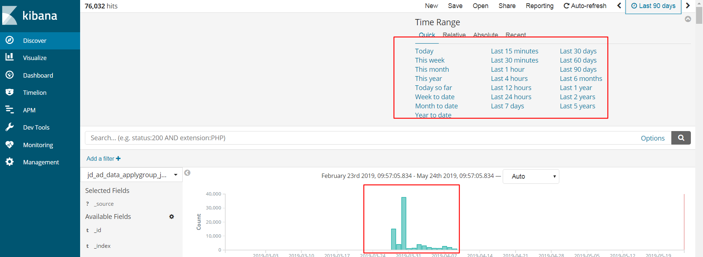
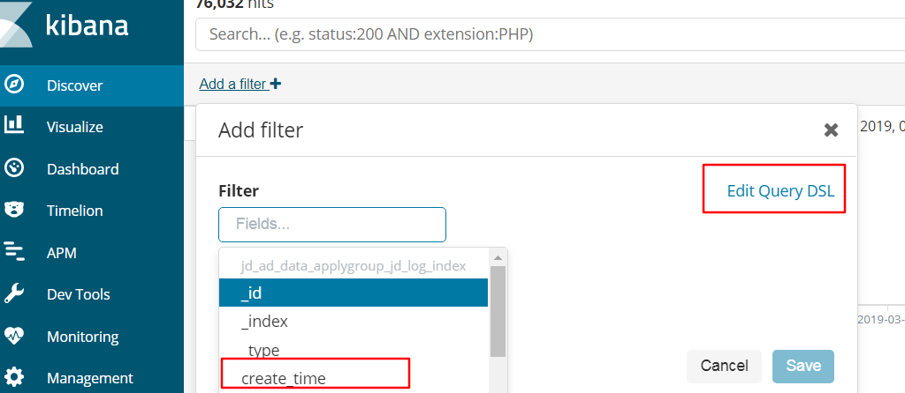
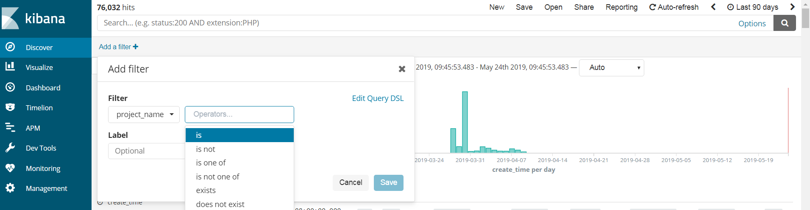

- [kibana官方文档地址](https://www.elastic.co/guide/cn/kibana/current/set-time-filter.html)

# 1、设置时间过滤器

# 2、搜索您的数据

在搜索栏输入您的搜索条件，然后回车或点击  来向 Elasticsearch 提交搜索请求。

- 直接输入文本字符串来进行简单文本搜索。例如，查询 Web 服务器日志的时候输入 safari 来搜索所有字段中包含词条 safari 的文档。
- 可以用字段名作为前缀来根据指定字段进行搜索。例如，输入 status:200 来搜索字段 status 中包含词条200 的文档。
- 可以通过中括号指定范围搜索， [START_VALUE TO END_VALUE] 。例如，搜索状态为 4xx 的条目，您可以输入 status:[400 TO 499] 。
- 您可以通过布尔操作符 AND 、 OR 和 NOT 来指定更多的搜索条件。例如，搜索状态为 4xx 而且扩展名为 php 或 html 的条目，您可以输入 status:[400 TO 499] AND (extension:php OR extension:html) 。

# 3、根据字段过滤

# 4、查看文档数据

# 5、查看文档上下文

# 6、展示字段数据统计

# filter过滤

在这里可以通过指定字段设置过滤的筛选条件，过滤掉一部分的数据，也可以通过编写DSL语言进行筛选

