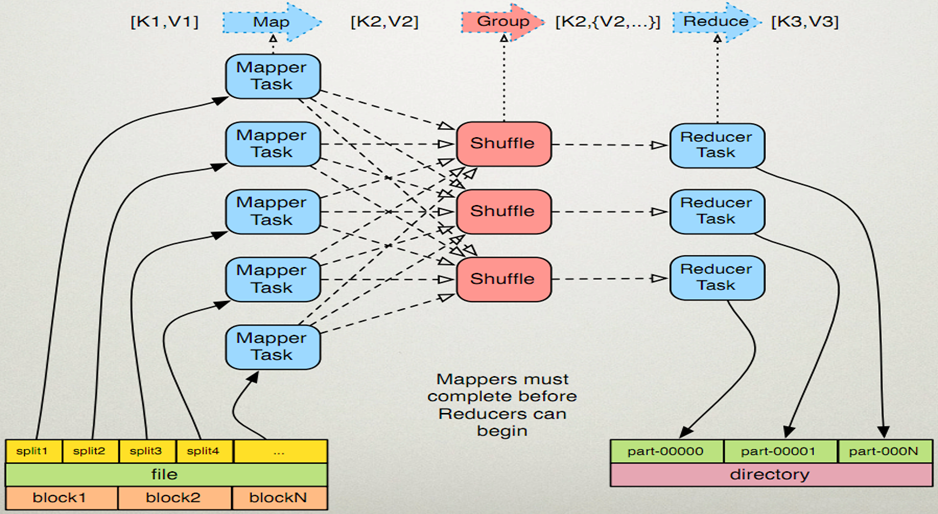
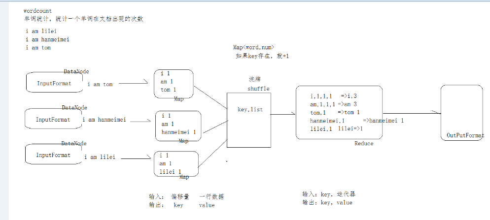
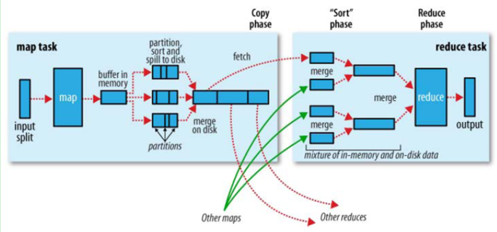

<!-- TOC -->

- [1、MapReduce的运行机制](#1mapreduce的运行机制)
    - [1.1、输入分片（input split）](#11输入分片input-split)
    - [1.2、map阶段](#12map阶段)
    - [1.3、combiner阶段](#13combiner阶段)
    - [1.4、shuffle阶段](#14shuffle阶段)
    - [1.5、reduce阶段：和map函数一样也是程序员编写的，最终结果是存储在hdfs上的。](#15reduce阶段和map函数一样也是程序员编写的最终结果是存储在hdfs上的)
- [2、Mapreduce的相关问题](#2mapreduce的相关问题)

<!-- /TOC -->

# 1、MapReduce的运行机制

首先是客户端要编写好mapreduce程序，配置好mapreduce的作业也就是job，接下来就是提交job了，提交job是提交到JobTracker上的，
这个时候JobTracker就会构建这个job，具体就是分配一个新的job任务的ID值，接下来它会做检查操作，这个检查就是确定输出目录是否存在，
如果存在那么job就不能正常运行下去，JobTracker会抛出错误给客户端，接下来还要检查输入目录是否存在，如果不存在同样抛出错误，
如果存在JobTracker会根据输入计算输入分片（Input Split），如果分片计算不出来也会抛出错误，至于输入分片后面会做讲解的，
这些都做好了JobTracker就会配置Job需要的资源了。分配好资源后，JobTracker就会初始化作业，初始化主要做的是将Job放入一个内部的队列，
让配置好的作业调度器能调度到这个作业，作业调度器会初始化这个job，初始化就是创建一个正在运行的job对象（封装任务和记录信息），
以便JobTracker跟踪job的状态和进程。

初始化完毕后，作业调度器会获取输入分片信息（input split），每个分片创建一个map任务。
接下来就是任务分配了，这个时候tasktracker会运行一个简单的循环机制定期发送心跳给jobtracker，心跳间隔是5秒，程序员可以配置这个时间，
心跳就是jobtracker和tasktracker沟通的桥梁，通过心跳，jobtracker可以监控tasktracker是否存活，也可以获取tasktracker处理的状态和问题，
同时tasktracker也可以通过心跳里的返回值获取jobtracker给它的操作指令。任务分配好后就是执行任务了。
在任务执行时候jobtracker可以通过心跳机制监控tasktracker的状态和进度，同时也能计算出整个job的状态和进度，
而tasktracker也可以本地监控自己的状态和进度。当jobtracker获得了最后一个完成指定任务的tasktracker操作成功的通知时候，
jobtracker会把整个job状态置为成功，然后当客户端查询job运行状态时候（注意：这个是异步操作），客户端会查到job完成的通知的。
如果job中途失败，mapreduce也会有相应机制处理，一般而言如果不是程序员程序本身有bug，mapreduce错误处理机制都能保证提交的job能正常完成。
下面我从逻辑实体的角度讲解mapreduce运行机制，这些按照时间顺序包括：输入分片（input split）、map阶段、combiner阶段、shuffle阶段和reduce阶段。

## 1.1、输入分片（input split）

在进行map计算之前，mapreduce会根据输入文件计算输入分片（input split），
每个输入分片（input split）针对一个map任务，输入分片（input split）存储的并非数据本身，而是一个分片长度和一个记录数据的位置的数组，
输入分片（input split）往往和hdfs的block（块）关系很密切，假如我们设定hdfs的块的大小是64mb，
如果我们输入有三个文件，大小分别是3mb、65mb和127mb，那么mapreduce会把3mb文件分为一个输入分片（input split），
65mb则是两个输入分片（input split）而127mb也是两个输入分片（input split），换句话说我们如果在map计算前做输入分片调整，
例如合并小文件，那么就会有5个map任务将执行，而且每个map执行的数据大小不均，这个也是mapreduce优化计算的一个关键点。

## 1.2、map阶段

就是程序员编写好的map函数了，因此map函数效率相对好控制，而且一般map操作都是本地化操作也就是在数据存储节点上进行；

## 1.3、combiner阶段

combiner阶段是程序员可以选择的，combiner其实也是一种reduce操作，因此我们看见WordCount类里是用reduce进行加载的。
Combiner是一个本地化的reduce操作，它是map运算的后续操作，主要是在map计算出中间文件前做一个简单的合并重复key值的操作，
例如我们对文件里的单词频率做统计，map计算时候如果碰到一个hadoop的单词就会记录为1，但是这篇文章里hadoop可能会出现n多次，
那么map输出文件冗余就会很多，因此在reduce计算前对相同的key做一个合并操作，那么文件会变小，这样就提高了宽带的传输效率，
毕竟hadoop计算力宽带资源往往是计算的瓶颈也是最为宝贵的资源，但是combiner操作是有风险的，
使用它的原则是combiner的输入不会影响到reduce计算的最终输入，例如：如果计算只是求总数，最大值，最小值可以使用combiner，
但是做平均值计算使用combiner的话，最终的reduce计算结果就会出错。

## 1.4、shuffle阶段

将map的输出作为reduce的输入的过程就是shuffle了，这个是mapreduce优化的重点地方。这里我不讲怎么优化shuffle阶段，

讲讲shuffle阶段的原理，因为大部分的书籍里都没讲清楚shuffle阶段。Shuffle一开始就是map阶段做输出操作，一般mapreduce计算的都是海量数据，
map输出时候不可能把所有文件都放到内存操作，因此map写入磁盘的过程十分的复杂，更何况map输出时候要对结果进行排序，
内存开销是很大的，map在做输出时候会在内存里开启一个环形内存缓冲区，这个缓冲区专门用来输出的，默认大小是100mb，
并且在配置文件里为这个缓冲区设定了一个阀值，默认是0.80（这个大小和阀值都是可以在配置文件里进行配置的），
同时map还会为输出操作启动一个守护线程，如果缓冲区的内存达到了阀值的80%时候，这个守护线程就会把内容写到磁盘上，这个过程叫spill，
另外的20%内存可以继续写入要写进磁盘的数据，写入磁盘和写入内存操作是互不干扰的，如果缓存区被撑满了，那么map就会阻塞写入内存的操作，
让写入磁盘操作完成后再继续执行写入内存操作，前面我讲到写入磁盘前会有个排序操作，这个是在写入磁盘操作时候进行，
不是在写入内存时候进行的，如果我们定义了combiner函数，那么排序前还会执行combiner操作。
每次spill操作也就是写入磁盘操作时候就会写一个溢出文件，也就是说在做map输出有几次spill就会产生多少个溢出文件，等map输出全部做完后，
map会合并这些输出文件。这个过程里还会有一个Partitioner操作，对于这个操作很多人都很迷糊，
其实Partitioner操作和map阶段的输入分片（Input split）很像，一个Partitioner对应一个reduce作业，如果我们mapreduce操作只有一个reduce操作，
那么Partitioner就只有一个，如果我们有多个reduce操作，那么Partitioner对应的就会有多个，Partitioner因此就是reduce的输入分片，
这个程序员可以编程控制，主要是根据实际key和value的值，根据实际业务类型或者为了更好的reduce负载均衡要求进行，
这是提高reduce效率的一个关键所在。到了reduce阶段就是合并map输出文件了，Partitioner会找到对应的map输出文件，然后进行复制操作，
复制操作时reduce会开启几个复制线程，这些线程默认个数是5个，程序员也可以在配置文件更改复制线程的个数，这个复制过程和map写入磁盘过程类似，
也有阀值和内存大小，阀值一样可以在配置文件里配置，而内存大小是直接使用reduce的tasktracker的内存大小，
复制时候reduce还会进行排序操作和合并文件操作，这些操作完了就会进行reduce计算了。

## 1.5、reduce阶段：和map函数一样也是程序员编写的，最终结果是存储在hdfs上的。

# 2、Mapreduce的相关问题

2.1、jobtracker的单点故障：jobtracker和hdfs的namenode一样也存在单点故障，单点故障一直是hadoop被人诟病的大问题，
为什么hadoop的做的文件系统和mapreduce计算框架都是高容错的，但是最重要的管理节点的故障机制却如此不好，
我认为主要是namenode和jobtracker在实际运行中都是在内存操作，而做到内存的容错就比较复杂了，只有当内存数据被持久化后容错才好做，
namenode和jobtracker都可以备份自己持久化的文件，但是这个持久化都会有延迟，因此真的出故障，任然不能整体恢复，另外hadoop框架里包含zookeeper框架，zookeeper可以结合jobtracker，用几台机器同时部署jobtracker，保证一台出故障，有一台马上能补充上，不过这种方式也没法恢复正在跑的mapreduce任务。

2.2、做mapreduce计算时候，输出一般是一个文件夹，而且该文件夹是不能存在，而且这个检查做的很早，当我们提交job时候就会进行，
mapreduce之所以这么设计是保证数据可靠性，如果输出目录存在reduce就搞不清楚你到底是要追加还是覆盖，
不管是追加和覆盖操作都会有可能导致最终结果出问题，mapreduce是做海量数据计算，一个生产计算的成本很高，
例如一个job完全执行完可能要几个小时，因此一切影响错误的情况mapreduce是零容忍的。

2.3、Mapreduce还有一个InputFormat和OutputFormat，我们在编写map函数时候发现map方法的参数是之间操作行数据，
没有牵涉到InputFormat，这些事情在我们new Path时候mapreduce计算框架帮我们做好了，
而OutputFormat也是reduce帮我们做好了，我们使用什么样的输入文件，就要调用什么样的InputFormat，
InputFormat是和我们输入的文件类型相关的，mapreduce里常用的InputFormat有FileInputFormat普通文本文件，
SequenceFileInputFormat是指hadoop的序列化文件，另外还有KeyValueTextInputFormat。
OutputFormat就是我们想最终存储到hdfs系统上的文件格式了，这个根据你需要定义了，hadoop有支持很多文件格式。

