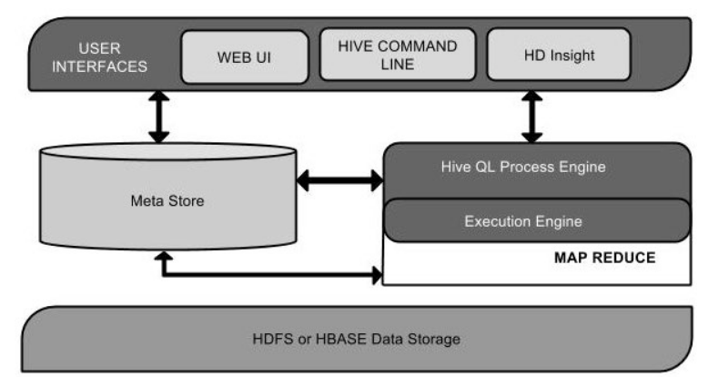
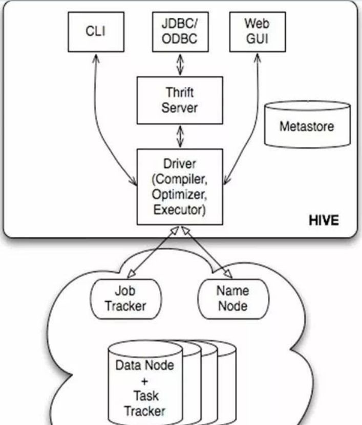
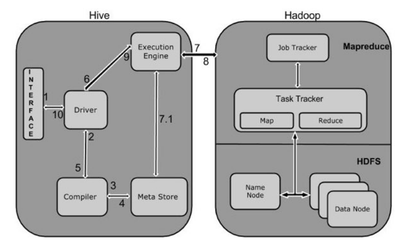
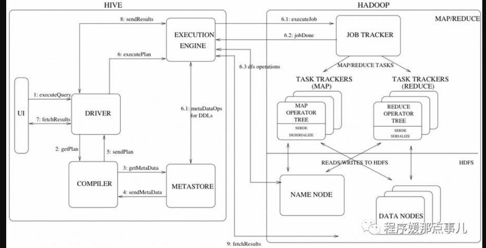

hive工作原理简介

Hive 不是
- 一个关系数据库

- 一个设计用于联机事务处理（OLTP）

- 实时查询和行级更新的语言

Hiver特点

- 它存储架构在一个数据库中并处理数据到HDFS。

- 它是专为OLAP设计。

- 它提供SQL类型语言查询叫HiveQL或HQL。

- 它是熟知，快速，可扩展和可扩展的。

Hive架构
下面的组件图描绘了Hive的结构：

Hive的体系结构可以分为以下几部分：

1、用户接口主要有三个：CLI，Client 和 WUI。其中最常用的是CLI，Cli启动的时候，会同时启动一个Hive副本。Client是Hive的客户端，用户连接至Hive Server。在启动 Client模式的时候，需要指出Hive Server所在节点，并且在该节点启动Hive Server。 WUI是通过浏览器访问Hive。

2、Hive将元数据存储在数据库中，如mysql、derby。Hive中的元数据包括表的名字，表的列和分区及其属性，表的属性（是否为外部表等），表的数据所在目录等。

3、解释器、编译器、优化器完成HQL查询语句从词法分析、语法分析、编译、优化以及查询计划的生成。生成的查询计划存储在HDFS中，并在随后有MapReduce调用执行。

4、Hive的数据存储在HDFS中，大部分的查询、计算由MapReduce完成（包含*的查询，比如select * from tbl不会生成MapRedcue任务）。

Hive工作原理

下图描述了Hive 和Hadoop之间的工作流程。

下表定义Hive和Hadoop框架的交互方式：

Step No.操作

1 Execute Query

Hive接口，如命令行或Web UI发送查询驱动程序（任何数据库驱动程序，如JDBC，ODBC等）来执行。

2 Get Plan

在驱动程序帮助下查询编译器，分析查询检查语法和查询计划或查询的要求。

3 Get Metadata

编译器发送元数据请求到Metastore（任何数据库）。

4 Send Metadata

Metastore发送元数据，以编译器的响应。

5 Send Plan

编译器检查要求，并重新发送计划给驱动程序。到此为止，查询解析和编译完成。

6 Execute Plan

驱动程序发送的执行计划到执行引擎。

7 Execute Job

在内部，执行作业的过程是一个MapReduce工作。执行引擎发送作业给JobTracker，在名称节点并把它分配作业到TaskTracker，这是在数据节点。在这里，查询执行MapReduce工作。

7.1 Metadata Ops

与此同时，在执行时，执行引擎可以通过Metastore执行元数据操作。

8 Fetch Result

执行引擎接收来自数据节点的结果。

9 Send Results

执行引擎发送这些结果值给驱动程序。

10 Send Results

驱动程序将结果发送给Hive接口。

# 参考
- [从HiveQL到MapReduce job过程简析](https://www.cnblogs.com/harrymore/p/8950210.html)
- [如何通俗地理解Hive的工作原理？](https://www.zhihu.com/question/49969423)
- [HiveSQL解析原理：包括SQL转化为MapReduce过程及MapReduce如何实现基本SQL操作](https://blog.csdn.net/youzhouliu/article/details/70807993)
- [Hive SQL转化为MapReduce执行计划深度解析](https://blog.csdn.net/i000zheng/article/details/81082774)

- [Hive原理](https://yq.aliyun.com/articles/653935)

- [Hive架构和工作原理](https://cloud.tencent.com/developer/news/362488)

