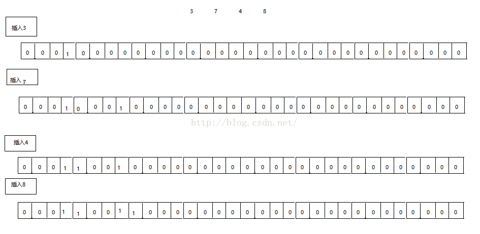

# 参考
[漫画：Bitmap算法 整合版](https://mp.weixin.qq.com/s/xxauNrJY9HlVNvLrL5j2hg)


# 简介
位图：位图的原理就是用一个bit来标识一个数字是否存在，采用一个bit来存储一个数据，所以这样可以大大的节省空间。
例如一个int型有32bit，那么就可以用这32个bit来存储0~31这些整型数据，所以可以将1~31这些数据仅用1个bit来存储，这样节省了空间。
例如要存储3，7，4，8,如下所示：



# java实现


# 应用


> 地址：https://github.com/lishuai2016/lishuai-notes  
> 项目：ls-java-core  
> 实现类：com.ls.algorithm.BitMap  


参考：
http://www.cnblogs.com/senlinyang/p/7885685.html


#总结
1、jdk的实现是bitset；
2、优化后的实现是Google的包下的EWAHCompressedBitmap；

```xml
<!--EWAHCompressedBitmap对应的maven依赖如下：-->

<dependency>
  <groupId>com.googlecode.javaewah</groupId>
  <artifactId>JavaEWAH</artifactId>
  <version>1.1.0</version>
</dependency>

```