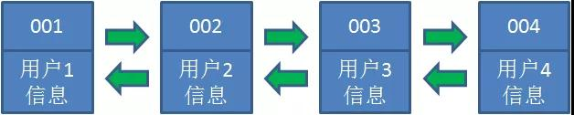
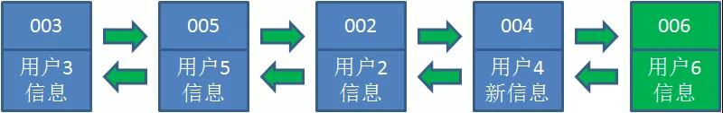

[漫画：什么是LRU算法？](https://mp.weixin.qq.com/s/h_Ns5HY27NmL_odCYLgx_Q)
[LRU原理和Redis实现——一个今日头条的面试题](https://zhuanlan.zhihu.com/p/34133067)


LRU全称 least recently used 最近最少使用，是一种内存管理算法。

LRU算法基于一种假设：
长期不再使用的数据，未来使用的概率也很小。因此，当内存达到一定的阈值，就要移掉最近最少使用的数据。

哈希链表可以实现这种数据结构，[linkedhashmap 实现了这种数据结构]

什么是哈希链表呢？

我们都知道，哈希表是由若干个Key-Value所组成。在“逻辑”上，这些Key-Value是无所谓排列顺序的，谁先谁后都一样。


在哈希链表当中，这些Key-Value不再是彼此无关的存在，而是被一个链条串了起来。
每一个Key-Value都具有它的前驱Key-Value、后继Key-Value，就像双向链表中的节点一样。


这样一来，原本无序的哈希表拥有了固定的排列顺序。

让我们以用户信息的需求为例，来演示一下LRU算法的基本思路：

1.假设我们使用哈希链表来缓存用户信息，目前缓存了4个用户，这4个用户是按照时间顺序依次从链表右端插入的。


2.此时，业务方访问用户5，由于哈希链表中没有用户5的数据，我们从数据库中读取出来，插入到缓存当中。
这时候，链表中最右端是最新访问到的用户5，最左端是最近最少访问的用户1。


3.接下来，业务方访问用户2，哈希链表中存在用户2的数据，我们怎么做呢？我们把用户2从它的前驱节点和后继节点之间移除，
重新插入到链表最右端。这时候，链表中最右端变成了最新访问到的用户2，最左端仍然是最近最少访问的用户1。


4.接下来，业务方请求修改用户4的信息。同样道理，我们把用户4从原来的位置移动到链表最右侧，并把用户信息的值更新。
这时候，链表中最右端是最新访问到的用户4，最左端仍然是最近最少访问的用户1。


5.后来业务方换口味了，访问用户6，用户6在缓存里没有，需要插入到哈希链表。
假设这时候缓存容量已经达到上限，必须先删除最近最少访问的数据，那么位于哈希链表最左端的用户1就会被删除掉，
然后再把用户6插入到最右端。



以上，就是LRU算法的基本思路。

```java
public class LRUCache{
    private Node head;
    private Node end;
    //缓存存储上限
    private int limit;
    
    private HashMap<String, Node> hashMap;
    
    public LRUCache(int limit) {
       this.limit = limit;
       hashMap = new HashMap<String, Node>();
    }
    
    public String get(String key) {
       Node node = hashMap.get(key);
       if (node == null){
           return null;
       }
       refreshNode(node);
       return node.value;
    }
    
    public void put(String key, String value) {
       Node node = hashMap.get(key);
       if (node == null) {
           //如果key不存在，插入key-value
           if (hashMap.size() >= limit) {
               String oldKey = removeNode(head);
               hashMap.remove(oldKey);
           }
           node = new Node(key, value);
           addNode(node);
           hashMap.put(key, node);
       }else {
           //如果key存在，刷新key-value
           node.value = value;
           refreshNode(node);
       }
    }
    
    public void remove(String key) {
       Node node = hashMap.get(key);
       removeNode(node);
       hashMap.remove(key);
    }
    
    /**
    * 刷新被访问的节点位置
    * @param  node 被访问的节点
    */
    private void refreshNode(Node node) {
       //如果访问的是尾节点，无需移动节点
       if (node == end) {
           return;
       }
       //移除节点
       removeNode(node);
       //重新插入节点
       addNode(node);
    }
    
    /**
    * 删除节点
    * @param  node 要删除的节点
    */
    
    private String removeNode(Node node) {
       if (node == end) {
           //移除尾节点
           end = end.pre;
       }else if(node == head){
           //移除头节点
           head = head.next;
       } else {
           //移除中间节点
           node.pre.next = node.next;
           node.next.pre = node.pre;
       }
       return node.key;
    }
    
    /**
    * 尾部插入节点
    * @param  node 要插入的节点
    */
    private void addNode(Node node) {
       if(end != null) {
           end.next = node;
           node.pre = end;
           node.next = null;
       }
       end = node;
       if(head == null){
           head = node;
       }
    }
    
    class Node {
       Node(String key, String value){
           this.key = key;
           this.value = value;
       }
       public Node pre;
       public Node next;
       public String key;
       public String value;
    }
    
    public static void main(String[] args) {
       LRUCache lruCache = new LRUCache(5);
       lruCache.put("001", "用户1信息");
       lruCache.put("002", "用户1信息");
       lruCache.put("003", "用户1信息");
       lruCache.put("004", "用户1信息");
       lruCache.put("005", "用户1信息");
       lruCache.get("002");
       lruCache.put("004", "用户2信息更新");
       lruCache.put("006", "用户6信息");
       System.out.println(lruCache.get("001"));
       System.out.println(lruCache.get("006"));
    } 
}
```


很久前参加过今日头条的面试，遇到一个题，目前半部分是如何实现 LRU，后半部分是 Redis 中如何实现 LRU。

我的第一反应是操作系统课程里学过，应该是内存不够的场景下，淘汰旧内容的策略。LRU ... Least Recent Used，淘汰掉最不经常使用的。
可以稍微多补充两句，因为计算机体系结构中，最大的最可靠的存储是硬盘，它容量很大，并且内容可以固化，
但是访问速度很慢，所以需要把使用的内容载入内存中；内存速度很快，但是容量有限，并且断电后内容会丢失，并且为了进一步提升性能，
还有CPU内部的 L1 Cache，L2 Cache等概念。因为速度越快的地方，它的单位成本越高，容量越小，新的内容不断被载入，旧的内容肯定要被淘汰，
所以就有这样的使用背景。

# LRU原理
在一般标准的操作系统教材里，会用下面的方式来演示 LRU 原理，假设内存只能容纳3个页大小，按照 7 0 1 2 0 3 0 4 的次序访问页。
假设内存按照栈的方式来描述访问时间，在上面的，是最近访问的，在下面的是，最远时间访问的，LRU就是这样工作的。


但是如果让我们自己设计一个基于 LRU 的缓存，这样设计可能问题很多，这段内存按照访问时间进行了排序，
会有大量的内存拷贝操作，所以性能肯定是不能接受的。

那么如何设计一个LRU缓存，使得放入和移除都是 O(1) 的，我们需要把访问次序维护起来，
但是不能通过内存中的真实排序来反应，有一种方案就是使用双向链表。

# 基于 HashMap 和 双向链表实现 LRU 的实现

整体的设计思路是，可以使用 HashMap 存储 key，这样可以做到 save 和 get key的时间都是 O(1)，
而 HashMap 的 Value 指向双向链表实现的 LRU 的 Node 节点，如图所示。


LRU 存储是基于双向链表实现的，下面的图演示了它的原理。其中 head 代表双向链表的表头，tail 代表尾部。
首先预先设置 LRU 的容量，如果存储满了，可以通过 O(1) 的时间淘汰掉双向链表的尾部，每次新增和访问数据，
都可以通过 O(1)的效率把新的节点增加到对头，或者把已经存在的节点移动到队头。

下面展示了，预设大小是 3 的，LRU存储的在存储和访问过程中的变化。为了简化图复杂度，
图中没有展示 HashMap部分的变化，仅仅演示了上图 LRU 双向链表的变化。我们对这个LRU缓存的操作序列如下：

save("key1", 7)

save("key2", 0)

save("key3", 1)

save("key4", 2)

get("key2")

save("key5", 3)

get("key2")

save("key6", 4)

相应的 LRU 双向链表部分变化如下：


s = save, g = get
总结一下核心操作的步骤:

save(key, value)，首先在 HashMap 找到 Key 对应的节点，如果节点存在，更新节点的值，并把这个节点移动队头。
如果不存在，需要构造新的节点，并且尝试把节点塞到队头，如果LRU空间不足，则通过 tail 淘汰掉队尾的节点，
同时在 HashMap 中移除 Key。

get(key)，通过 HashMap 找到 LRU 链表节点，因为根据LRU 原理，这个节点是最新访问的，所以要把节点插入到队头，然后返回缓存的值。
完整基于 Java 的代码参考如下
```java
class DLinkedNode {
	String key;
	int value;
	DLinkedNode pre;
	DLinkedNode post;
}
LRU Cache

public class LRUCache {
   
    private Hashtable<Integer, DLinkedNode>
            cache = new Hashtable<Integer, DLinkedNode>();
    private int count;
    private int capacity;
    private DLinkedNode head, tail;

    public LRUCache(int capacity) {
        this.count = 0;
        this.capacity = capacity;

        head = new DLinkedNode();
        head.pre = null;

        tail = new DLinkedNode();
        tail.post = null;

        head.post = tail;
        tail.pre = head;
    }

    public int get(String key) {

        DLinkedNode node = cache.get(key);
        if(node == null){
            return -1; // should raise exception here.
        }

        // move the accessed node to the head;
        this.moveToHead(node);

        return node.value;
    }


    public void set(String key, int value) {
        DLinkedNode node = cache.get(key);

        if(node == null){

            DLinkedNode newNode = new DLinkedNode();
            newNode.key = key;
            newNode.value = value;

            this.cache.put(key, newNode);
            this.addNode(newNode);

            ++count;

            if(count > capacity){
                // pop the tail
                DLinkedNode tail = this.popTail();
                this.cache.remove(tail.key);
                --count;
            }
        }else{
            // update the value.
            node.value = value;
            this.moveToHead(node);
        }
    }
    /**
     * Always add the new node right after head;
     */
    private void addNode(DLinkedNode node){
        node.pre = head;
        node.post = head.post;

        head.post.pre = node;
        head.post = node;
    }

    /**
     * Remove an existing node from the linked list.
     */
    private void removeNode(DLinkedNode node){
        DLinkedNode pre = node.pre;
        DLinkedNode post = node.post;

        pre.post = post;
        post.pre = pre;
    }

    /**
     * Move certain node in between to the head.
     */
    private void moveToHead(DLinkedNode node){
        this.removeNode(node);
        this.addNode(node);
    }

    // pop the current tail.
    private DLinkedNode popTail(){
        DLinkedNode res = tail.pre;
        this.removeNode(res);
        return res;
    }
}
```

那么问题的后半部分，是 Redis 如何实现，这个问题这么问肯定是有坑的，那就是redis肯定不是这样实现的。

# Redis的LRU实现

如果按照HashMap和双向链表实现，需要额外的存储存放 next 和 prev 指针，牺牲比较大的存储空间，显然是不划算的。
所以Redis采用了一个近似的做法，就是随机取出若干个key，然后按照访问时间排序后，淘汰掉最不经常使用的，具体分析如下：

为了支持LRU，Redis 2.8.19中使用了一个全局的LRU时钟，server.lruclock，定义如下，
```java
#define REDIS_LRU_BITS 24
unsigned lruclock:REDIS_LRU_BITS; /* Clock for LRU eviction */
```
默认的LRU时钟的分辨率是1秒，可以通过改变REDIS_LRU_CLOCK_RESOLUTION宏的值来改变，
Redis会在serverCron()中调用updateLRUClock定期的更新LRU时钟，更新的频率和hz参数有关，默认为100ms一次，如下，
```java
#define REDIS_LRU_CLOCK_MAX ((1<<REDIS_LRU_BITS)-1) /* Max value of obj->lru */
#define REDIS_LRU_CLOCK_RESOLUTION 1 /* LRU clock resolution in seconds */

void updateLRUClock(void) {
    server.lruclock = (server.unixtime / REDIS_LRU_CLOCK_RESOLUTION) &
                                                REDIS_LRU_CLOCK_MAX;
}
```

server.unixtime是系统当前的unix时间戳，当 lruclock 的值超出REDIS_LRU_CLOCK_MAX时，会从头开始计算，
所以在计算一个key的最长没有访问时间时，可能key本身保存的lru访问时间会比当前的lrulock还要大，这个时候需要计算额外时间，如下，
```java
/* Given an object returns the min number of seconds the object was never
 * requested, using an approximated LRU algorithm. */
unsigned long estimateObjectIdleTime(robj *o) {
    if (server.lruclock >= o->lru) {
        return (server.lruclock - o->lru) * REDIS_LRU_CLOCK_RESOLUTION;
    } else {
        return ((REDIS_LRU_CLOCK_MAX - o->lru) + server.lruclock) *
                    REDIS_LRU_CLOCK_RESOLUTION;
    }
}

```

Redis支持和LRU相关淘汰策略包括，

volatile-lru 设置了过期时间的key参与近似的lru淘汰策略
allkeys-lru 所有的key均参与近似的lru淘汰策略
当进行LRU淘汰时，Redis按如下方式进行的，
```java
 /* volatile-lru and allkeys-lru policy */
            else if (server.maxmemory_policy == REDIS_MAXMEMORY_ALLKEYS_LRU ||
                server.maxmemory_policy == REDIS_MAXMEMORY_VOLATILE_LRU)
            {
                for (k = 0; k < server.maxmemory_samples; k++) {
                    sds thiskey;
                    long thisval;
                    robj *o;

                    de = dictGetRandomKey(dict);
                    thiskey = dictGetKey(de);
                    /* When policy is volatile-lru we need an additional lookup
                     * to locate the real key, as dict is set to db->expires. */
                    if (server.maxmemory_policy == REDIS_MAXMEMORY_VOLATILE_LRU)
                        de = dictFind(db->dict, thiskey);
                    o = dictGetVal(de);
                    thisval = estimateObjectIdleTime(o);

                    /* Higher idle time is better candidate for deletion */
                    if (bestkey == NULL || thisval > bestval) {
                        bestkey = thiskey;
                        bestval = thisval;
                    }
                }
            }
```
Redis会基于server.maxmemory_samples配置选取固定数目的key，然后比较它们的lru访问时间，然后淘汰最近最久没有访问的key，
maxmemory_samples的值越大，Redis的近似LRU算法就越接近于严格LRU算法，但是相应消耗也变高，对性能有一定影响，样本值默认为5。

总结
看来，虽然一个简单的概念，在工业界的产品中，为了追求空间的利用率，也会采用权衡的实现方案。