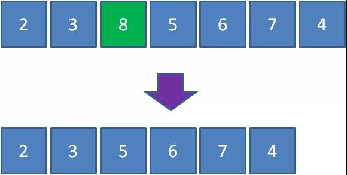

# 
[漫画：什么是优先队列？](https://mp.weixin.qq.com/s/4hXBw7sZ-NKs_asOQxS7gA)

队列的特点是什么？是先进先出（FIFO）。

那么，优先队列又是什么样子呢？

优先队列不再遵循先入先出的原则，而是分为两种情况：
最大优先队列，无论入队顺序，当前最大的元素优先出队。
最小优先队列，无论入队顺序，当前最小的元素优先出队。

比如有一个最大优先队列，它的最大元素是8，那么虽然元素8并不是队首元素，但出队的时候仍然让元素8首先出队：


要满足以上需求，利用线性数据结构并非不能实现，但是时间复杂度较高，最坏时间复杂度O（n），并不是最理想的方式。
至于为什么最坏时间复杂度是O（n），大家可以思考下。

遍历找到最大值。


让我们回顾一下二叉堆的特性：

1.最大堆的堆顶是整个堆中的最大元素
2.最小堆的堆顶是整个堆中的最小元素

因此，我们可以用最大堆来实现最大优先队列，每一次入队操作就是堆的插入操作，每一次出队操作就是删除堆顶节点。

[入队和出队的时间复杂度均为logN]

优先级队列的实现

```java
public class PriorityQueue {
private int[] array;
private int size;

public PriorityQueue(){
   //队列初始长度32
   array = new int[32];
}

/**
* 入队
* @param key  入队元素
*/
private void enQueue(int key) {
   //队列长度超出范围，扩容
   if(size >= array.length){
       resize();
   }
   array[size++] = key;
   upAdjust();
}

/**
* 出队
*/
private int deQueue() throws Exception {
   if(size <= 0){
       throw new Exception("the queue is empty !");
   }
   //获取堆顶元素
   int head = array[0];
   //最后一个元素移动到堆顶
   array[0] = array[--size];
   downAdjust();
   return head;
}

/**
* 上浮调整
*/
private void upAdjust() {
   int childIndex = size-1;
   int parentIndex = childIndex/2;
   // temp保存插入的叶子节点值，用于最后的赋值
   int temp = array[childIndex];
   while (childIndex > 0 && temp > array[parentIndex])
   {
       //无需真正交换，单向赋值即可
       array[childIndex] = array[parentIndex];
       childIndex = parentIndex;
       parentIndex = parentIndex / 2;
   }
   array[childIndex] = temp;
}

/**
* 下沉调整
*/
private void downAdjust() {
   // temp保存父节点值，用于最后的赋值
   int parentIndex = 0;
   int temp = array[parentIndex];
   int childIndex = 1;
   while (childIndex < size) {
       // 如果有右孩子，且右孩子大于左孩子的值，则定位到右孩子
       if (childIndex + 1 < size && array[childIndex + 1] > array[childIndex]) {
           childIndex++;
       }
       // 如果父节点大于任何一个孩子的值，直接跳出
       if (temp >= array[childIndex])
           break;
       //无需真正交换，单向赋值即可
       array[parentIndex] = array[childIndex];
       parentIndex = childIndex;
       childIndex = 2 * childIndex + 1;
   }
   array[parentIndex] = temp;
}

/**
* 下沉调整
*/
private void resize() {
   //队列容量翻倍
   int newSize = this.size * 2;
   this.array = Arrays.copyOf(this.array, newSize);
}

public static void main(String[] args) throws Exception {
   PriorityQueue priorityQueue = new PriorityQueue();
   priorityQueue.enQueue(3);
   priorityQueue.enQueue(5);
   priorityQueue.enQueue(10);
   priorityQueue.enQueue(2);
   priorityQueue.enQueue(7);
   System.out.println("出队元素：" + priorityQueue.deQueue());
   System.out.println("出队元素：" + priorityQueue.deQueue());
}

}

```

