[漫画：什么是分布式锁？](https://mp.weixin.qq.com/s/8fdBKAyHZrfHmSajXT_dnA)

# 分布式锁的实现有哪些？

1.Memcached分布式锁

利用Memcached的add命令。此命令是原子性操作，只有在key不存在的情况下，才能add成功，也就意味着线程得到了锁。

2.Redis分布式锁

和Memcached的方式类似，利用Redis的setnx命令。此命令同样是原子性操作，只有在key不存在的情况下，才能set成功。（setnx命令并不完善，后续会介绍替代方案）

3.Zookeeper分布式锁

利用Zookeeper的顺序临时节点，来实现分布式锁和等待队列。Zookeeper设计的初衷，就是为了实现分布式锁服务的。

4.Chubby

Google公司实现的粗粒度分布式锁服务，底层利用了Paxos一致性算法。


# 如何用Redis实现分布式锁？

Redis分布式锁的基本流程并不难理解，但要想写得尽善尽美，也并不是那么容易。在这里，我们需要先了解分布式锁实现的三个核心要素：

## 1.加锁

最简单的方法是使用setnx命令。key是锁的唯一标识，按业务来决定命名。比如想要给一种商品的秒杀活动加锁，
可以给key命名为 “lock_sale_商品ID” 。而value设置成什么呢？我们可以姑且设置成1。加锁的伪代码如下：    
setnx（key，1）

当一个线程执行setnx返回1，说明key原本不存在，该线程成功得到了锁；当一个线程执行setnx返回0，说明key已经存在，该线程抢锁失败。


## 2.解锁

有加锁就得有解锁。当得到锁的线程执行完任务，需要释放锁，以便其他线程可以进入。释放锁的最简单方式是执行del指令，伪代码如下：

del（key）

释放锁之后，其他线程就可以继续执行setnx命令来获得锁。


## 3.锁超时

锁超时是什么意思呢？如果一个得到锁的线程在执行任务的过程中挂掉，来不及显式地释放锁，这块资源将会永远被锁住，别的线程再也别想进来。

所以，setnx的key必须设置一个超时时间，以保证即使没有被显式释放，这把锁也要在一定时间后自动释放。
setnx不支持超时参数，所以需要额外的指令，伪代码如下：

expire（key， 30）

综合起来，我们分布式锁实现的第一版伪代码如下：

```
if（setnx（key，1） == 1）{
    expire（key，30）
    try {
        do something ......
    } finally {
        del（key）
    }
}
```

因为上面的伪代码中，存在着三个致命问题：

1. setnx和expire的非原子性

设想一个极端场景，当某线程执行setnx，成功得到了锁：
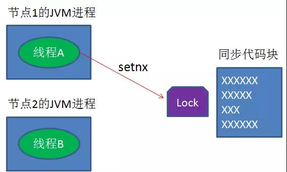

setnx刚执行成功，还未来得及执行expire指令，节点1 Duang的一声挂掉了。
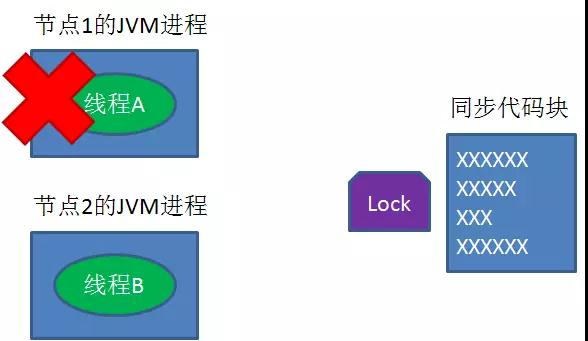

这样一来，这把锁就没有设置过期时间，变得“长生不老”，别的线程再也无法获得锁了。

怎么解决呢？setnx指令本身是不支持传入超时时间的，幸好Redis 2.6.12以上版本为set指令增加了可选参数，伪代码如下：

set（key，1，30，NX）

这样就可以取代setnx指令。


2. del 导致误删

又是一个极端场景，假如某线程成功得到了锁，并且设置的超时时间是30秒。
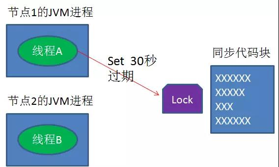

如果某些原因导致线程A执行的很慢很慢，过了30秒都没执行完，这时候锁过期自动释放，线程B得到了锁。
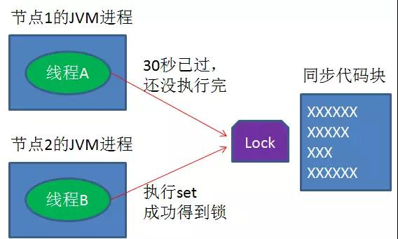

随后，线程A执行完了任务，线程A接着执行del指令来释放锁。但这时候线程B还没执行完，
线程A实际上删除的是线程B加的锁。
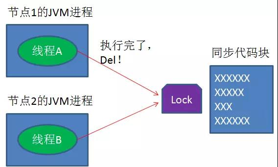

怎么避免这种情况呢？可以在del释放锁之前做一个判断，验证当前的锁是不是自己加的锁。

至于具体的实现，可以在加锁的时候把当前的线程ID当做value，并在删除之前验证key对应的value是不是自己线程的ID。

加锁：
String threadId = Thread.currentThread().getId()
set（key，threadId ，30，NX）

解锁：
if（threadId .equals(redisClient.get(key))）{
    del(key)
}

但是，这样做又隐含了一个新的问题，判断和释放锁是两个独立操作，不是原子性。

我们都是追求极致的程序员，所以这一块要用Lua脚本来实现：

String luaScript = "if redis.call('get', KEYS[1]) == ARGV[1] then return redis.call('del', KEYS[1]) else return 0 end";

redisClient.eval(luaScript , Collections.singletonList(key), Collections.singletonList(threadId));

这样一来，验证和删除过程就是原子操作了。


3. 出现并发的可能性

还是刚才第二点所描述的场景，虽然我们避免了线程A误删掉key的情况，但是同一时间有A，B两个线程在访问代码块，
仍然是不完美的。

怎么办呢？我们可以让获得锁的线程开启一个守护线程，用来给快要过期的锁“续航”。
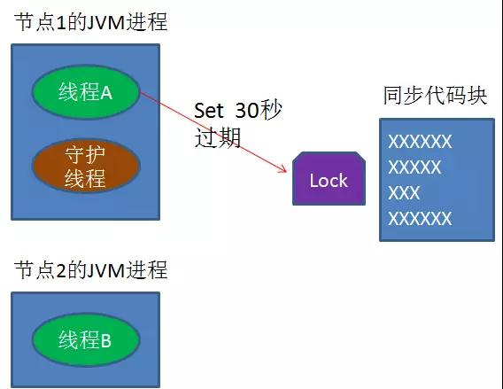

当过去了29秒，线程A还没执行完，这时候守护线程会执行expire指令，为这把锁“续命”20秒。
守护线程从第29秒开始执行，每20秒执行一次。
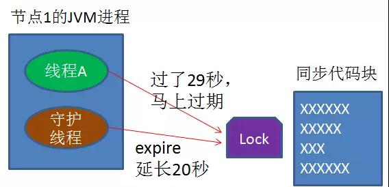


当线程A执行完任务，会显式关掉守护线程。
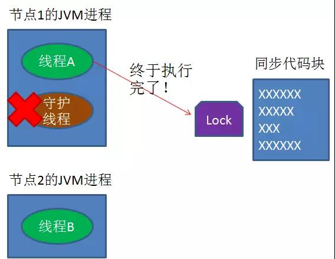


另一种情况，如果节点1 忽然断电，由于线程A和守护线程在同一个进程，守护线程也会停下。
这把锁到了超时的时候，没人给它续命，也就自动释放了。
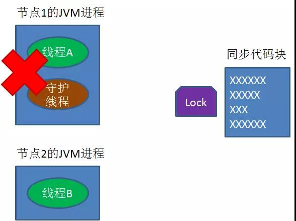

守护线程的代码并不难实现，有了大体思路，大家可以自己尝试实现一下。


# Zookeeper来实现分布式锁[临时顺序节点][Apache Curator包含了zookeeper对分布式锁的实现]
[漫画：如何用Zookeeper实现分布式锁？](https://mp.weixin.qq.com/s/u8QDlrDj3Rl1YjY4TyKMCA)


## 什么是临时顺序节点？

Zookeeper的数据存储结构就像一棵树，这棵树由节点组成，这种节点叫做Znode。
Znode分为四种类型：

1.持久节点 （PERSISTENT）

默认的节点类型。创建节点的客户端与zookeeper断开连接后，该节点依旧存在 。

2.持久节点顺序节点（PERSISTENT_SEQUENTIAL）

所谓顺序节点，就是在创建节点时，Zookeeper根据创建的时间顺序给该节点名称进行编号：
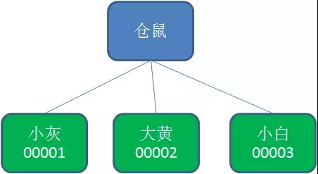


3.临时节点（EPHEMERAL） 
和持久节点相反，当创建节点的客户端与zookeeper断开连接后，临时节点会被删除：
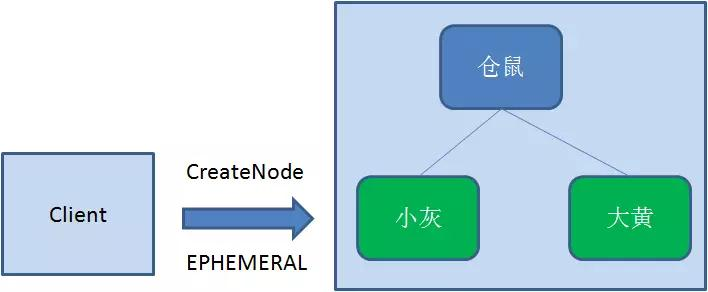
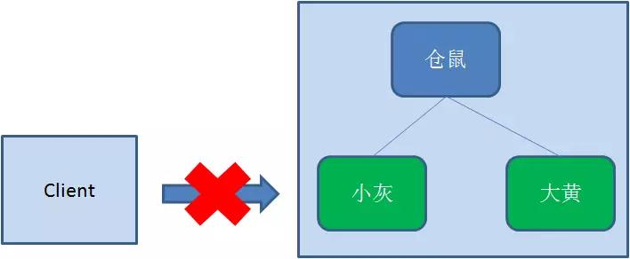
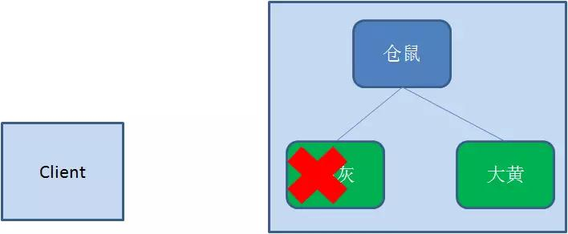


4.临时顺序节点（EPHEMERAL_SEQUENTIAL） 

顾名思义，临时顺序节点结合和临时节点和顺序节点的特点：在创建节点时，Zookeeper根据创建的时间顺序给该节点名称进行编号；
当创建节点的客户端与zookeeper断开连接后，临时节点会被删除。


## Zookeeper分布式锁的原理

Zookeeper分布式锁恰恰应用了临时顺序节点。具体如何实现呢？让我们来看一看详细步骤：

### 1、获取锁

首先，在Zookeeper当中创建一个持久节点ParentLock。当第一个客户端想要获得锁时，
需要在ParentLock这个节点下面创建一个临时顺序节点 Lock1。
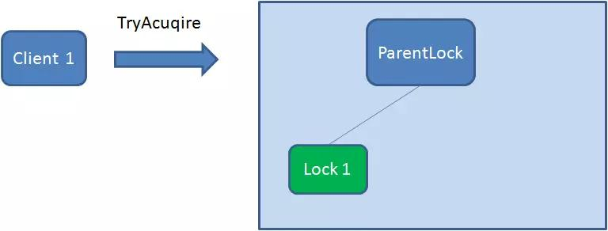

之后，Client1查找ParentLock下面所有的临时顺序节点并排序，判断自己所创建的节点Lock1是不是顺序最靠前的一个。
如果是第一个节点，则成功获得锁。
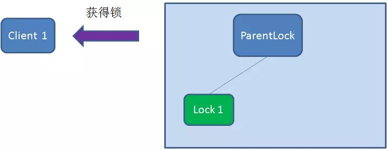

这时候，如果再有一个客户端 Client2 前来获取锁，则在ParentLock下载再创建一个临时顺序节点Lock2。
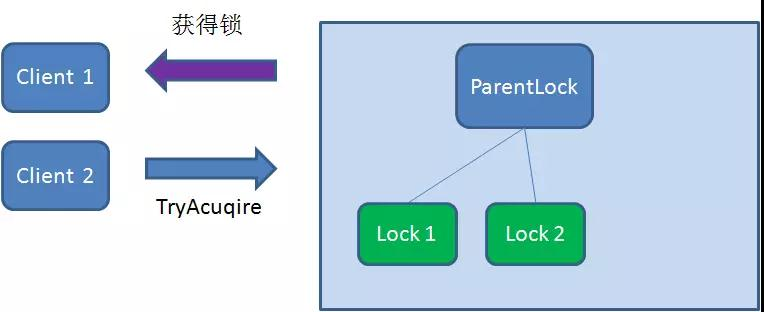

Client2查找ParentLock下面所有的临时顺序节点并排序，判断自己所创建的节点Lock2是不是顺序最靠前的一个，结果发现节点Lock2并不是最小的。

于是，Client2向排序仅比它靠前的节点Lock1注册Watcher，用于监听Lock1节点是否存在。这意味着Client2抢锁失败，进入了等待状态。
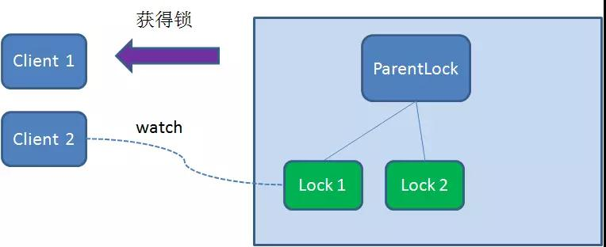

这时候，如果又有一个客户端Client3前来获取锁，则在ParentLock下载再创建一个临时顺序节点Lock3。
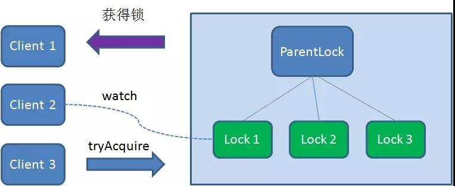

Client3查找ParentLock下面所有的临时顺序节点并排序，判断自己所创建的节点Lock3是不是顺序最靠前的一个，
结果同样发现节点Lock3并不是最小的。

于是，Client3向排序仅比它靠前的节点Lock2注册Watcher，用于监听Lock2节点是否存在。这意味着Client3同样抢锁失败，进入了等待状态。
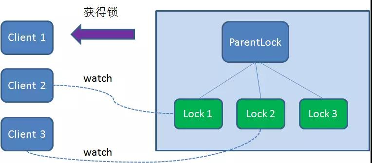


这样一来，Client1得到了锁，Client2监听了Lock1，Client3监听了Lock2。这恰恰形成了一个等待队列，
很像是Java当中ReentrantLock所依赖的AQS（AbstractQueuedSynchronizer）。

### 2、释放锁

释放锁分为两种情况：

1.任务完成，客户端显示释放

当任务完成时，Client1会显示调用删除节点Lock1的指令。
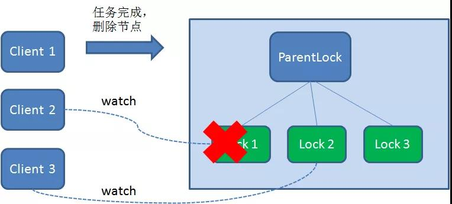

2.任务执行过程中，客户端崩溃

获得锁的Client1在任务执行过程中，如果Duang的一声崩溃，则会断开与Zookeeper服务端的链接。
根据临时节点的特性，相关联的节点Lock1会随之自动删除。
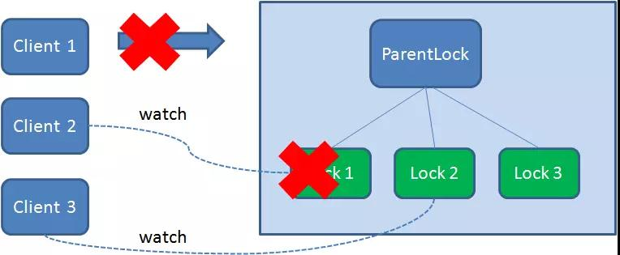

由于Client2一直监听着Lock1的存在状态，当Lock1节点被删除，Client2会立刻收到通知。
这时候Client2会再次查询ParentLock下面的所有节点，确认自己创建的节点Lock2是不是目前最小的节点。
如果是最小，则Client2顺理成章获得了锁。
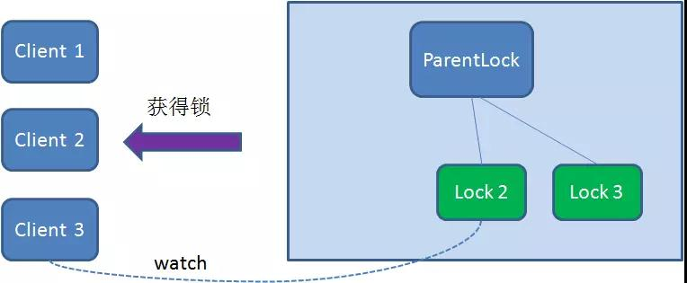

同理，如果Client2也因为任务完成或者节点崩溃而删除了节点Lock2，那么Client3就会接到通知。
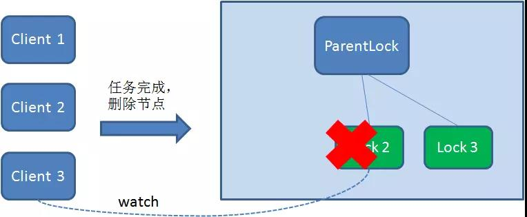

最终，Client3成功得到了锁。
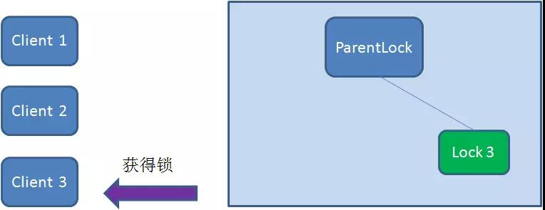

## Zookeeper和Redis分布式锁的比较

下面的表格总结了Zookeeper和Redis分布式锁的优缺点：
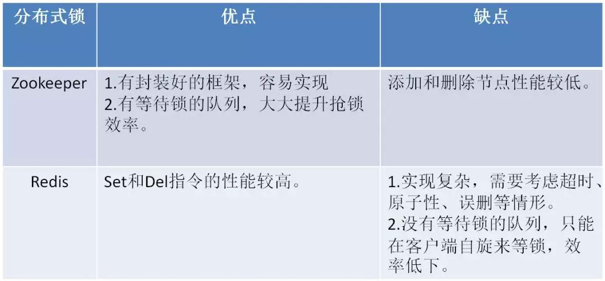


有人说Zookeeper实现的分布式锁支持可重入，Redis实现的分布式锁不支持可重入，这是错误的观点。
两者都可以在客户端实现可重入逻辑。

在Apache的开源框架 Apache Curator 中，包含了对Zookeeper分布式锁的实现，有兴趣的小伙伴可以看看源码：

https://github.com/apache/curator/


