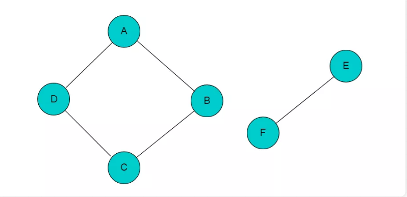
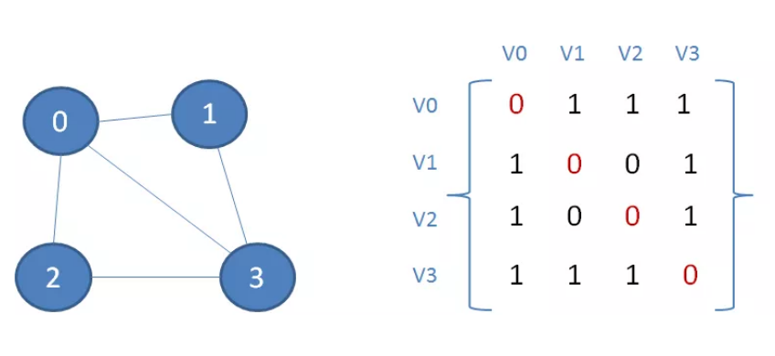
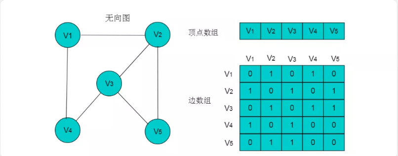
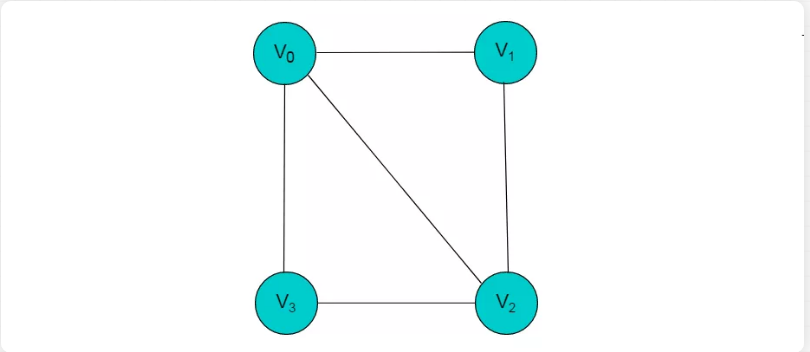

- [漫画：什么是 “图”？（修订版）](https://mp.weixin.qq.com/s/4JEHZWanGtsQHYrZ0MDq7Q)
- [数据结构与算法——图论基础与图存储结构](https://mp.weixin.qq.com/s/EjO9CwwDsYxU3uUDno8lHA)

# 1 概述什么是图

图，是一种比树更为复杂的数据结构。树的节点之间是一对多的关系，并且存在父与子的层级划分；
而图的顶点（注意，这里不叫节点）之间是多对多的关系，并且所有顶点都是平等的，无所谓谁是父谁是子。

图是数据结构中重要内容。相比于线性表与树，图的结构更为复杂。
在线性表的存储结构中，数据直接按照前驱后继的线性组织形式排列。
在树的结构中，数据节点以层的方式排列，节点与节点之间是一种层次关系。
但是，在图的结构中数据之间可以有任意关系，这就使得图的数据结构相对复杂。

下面我们来介绍一下图的基本术语

在图中，最基本的单元是顶点（vertex），相当于树中的节点。顶点之间的关联关系，被称为边（edge）。

在有些图中，每一条边并不是完全等同的。比如刚才地铁线路的例子，从A站到B站的距离是3公里，从B站到C站的距离是5公里......
这样就引入一个新概念：边的权重（Weight）。涉及到权重的图，被称为带权图（Weighted Graph）。

还有一种图，顶点之间的关联并不是完全对称的。还拿微信来举例，你的好友列表里有我，但我的好友列表里未必有你。
这样一来，顶点之间的边就有了方向的区分，这种带有方向的图被称为有向图。

相应的，在QQ当中，只要我把你从好友里删除，你在自己的好友列表里也就看不到我了。（貌似是这样）
因此，QQ的好友关系可以认为是一个没有方向区分的图，这种图被称为无向图。

图论基础知识

图这样表示：G=(V,E)。一个图的顶点数目|V|称为G的阶，边的数目|E|称为图G的边数

- 环边(loop)：图中两端点重合的边称为环边
- 重边(multipleedges):设u和v是图G的顶点，G中连接u和v的两条或两条以上的边称为G中uv间的重边
- 简单图(simple graph):既无环边也无重边的图
- 完全图(complete graph):任意两点间都有一条边的简单图，n阶完全图记为Kn
- 空图(empty graph):边集为空的图
- 平凡图(trivial graph):只有一个顶点的空图
- 零图(mull graph):顶点集和边集都空（注：顶点集空边集必为空）

- 子图(subgraph)：对于图G和H，H中的顶点集和边集都是G的子集
- 生成子图(spanning subgraph)：H是G的子图且V(H)=V(G)，则H是G的生成子图
- 点导出子图(induced subgraph)：设图G和H，V(H)是V(G)的子集，以V(H)为顶点集，以G中两端点均属于V(H)的边作为边集形成的子图成为G的点导出子图
- 边导出子图(edge-induced subgraph)：设G和H，E(H)是E(G)的子集，以E(H)为边集，以E(H)中所有端点作为顶点集组成的子图称为G的边导出子图

- 完全图没有点割集，割点是1-点割集
图的连通度定义为k(G)=min(|V'| | V'是连通图G的点割集)，特别地，V阶完全图的连通度定义为k(Kv)=v-1，不连通图的连通度定义为0，若k（G）>=m，则称G是m连通的。这里加上点我自己的理解：完全图加上重边和环边依旧没有点割集，连通度依旧为v-1

- 接下来说双连通，也就是2-连通图：
没有割点的连通图称为块。设G是一个图，H是G的一个子图，若H本身是一个块且他是G中具有此性质的极大子图，则称H是G的一个块。
这里有一点需要注意，网上很少看到提过这点的文章，就是：至少有三个顶点的图是快当且仅当他是2-连通图，因为如果只有两个顶点，且这两个顶点连通，比如K2，它是个块，但不是2-连通的，它的连通度是1。先提前说一个东西，就是点双连通不一定是边双连通，K2就是个反例，所以说一定要记得看图的阶，如果是2的话要非常注意，至于点双连通和边双连通的定义有时间会补上。

## 1.1 定义

图（Graph）是由顶点的有穷非空集合和顶点之间边的集合组成，通常表示为：G（V，E），其中，G表示一个图，V 是图 G 中顶点的集合，E 是图 G 中边的集合。
例如：图 2.1所示

在图 2.1 中，共有 V0，V1，V2，V3 这 4 个顶点，4 个顶点之间共有 5 条边。

注：
- 当线性表没有数据节点时，线性表为空表。
- 树中没有节点时，树为空树。
- 但是，在图中不允许没有顶点，但是可以没有边。

## 1.2 无向边

无向边：若顶点 x 和 y 之间的边没有方向，则称该边为无向边(x,y)，(x,y) 与 (y,x) 意义相同，表示 x 和 y 之间有连接。

图 2.2 所示图中的边均为无向边。

## 1.3 有向边

有向边：若顶点 x 和 y 之间的边有方向，则称该边为有向边，与表示的意义是不同的，表示从 x 连接到 y ，x 称为尾，y 称为头。表示从 y 连接到 x ，y 称为尾， x 称为头。

图2.3所示图中的边为有向边。

## 1.4 无向图

无向图：若图中任意两个顶点之间的边均是无向边，则称该图为无向图。图2.2所示图为无向图。

## 1.5 有向图

有向图：若图中任意两个顶点之间的边均是有向边，则称该图为有向图。图2.3所示的图为有向图。

## 1.6 顶点与顶点的度

顶点的度：

顶点 V 的度是和 V 相关联的边的数目，记为TD(V)。图中，V0 顶点的度为 3 。

入度：以顶点v为头的边的数目，记为ID(V)。图中，V0的入度为1。[简单理解就是进入顶点的]

出度：以顶点 v 为尾的边的数目，记为 OD(V)。图中，V0的出度为2。[简单理解就是从顶点出去的]

顶点的度 = 入度 + 出度。

即 TD(V) = ID(V) + OD(V)。

## 1.7 邻接

  邻接是两个顶点之间的一种关系。如果图包含（u,v），则称顶点 v 与顶点 u 邻接。在无向图中，这也暗示了顶点 u 也与顶点 v 邻接。换句话说，在无向图中邻接关系是对称的。

## 1.8 路径

路径：在图中，依次遍历顶点序列之间的边所形成的轨迹。例如：在图 2.8 中所示图中依次访问顶点 V0 、V3 和 V2 ，则构成一条路径。

## 1.9 完全图

  完全图：每个顶点都与其他顶点相邻接的图。

  无向完全图：在无向图中，如果任意两个顶点之间都存在边，则称该图为无向完全图。（含有n个顶点的无向完全图有(n×(n-1))/2条边）

  有向完全图：在有向图中，如果任意两个顶点之间都存在方向互为相反的两条边，则称该图为有向完全图。（含有 n 个顶点的有向完全图有 n×(n-1) 条边）

## 1.10 连通图

  在无向图 G 中，如果从顶点 v 到顶点 v' 有路径，则称 v 和 v' 是连通的。 
如果对于图中任意两个顶点 vi 、vj ∈E， vi，和vj都是连通的，则称 G 是连通图，否则图为非连通图。

例如：图4.1所示图，图中顶点A、B、C、D是连通的，但是其中任一顶点与顶点E或者顶点F之间没有路径，因此图4.1中所示的图为非连通图。

若添加顶点B与顶点F之间的邻接边，则图变为连通图，如图4.2所示：

# 2 图的表示

## 2.1 邻接矩阵

拥有n个顶点的图，它所包含的连接数量最多是n（n-1）个。
因此，要表达各个顶点之间的关联关系，最清晰易懂的方式是使用二维数组（矩阵）。

具体如何表示呢？我们首先来看看无向图的矩阵表示：

如图所示，顶点0和顶点1之间有边关联，那么矩阵中的元素A[0][1]与A[1][0]的值就是1；
顶点1和顶点2之间没有边关联，那么矩阵中的元素A[1][2]与A[2][1]的值就是0。
像这样表达图中顶点关联关系的矩阵，就叫做邻接矩阵。

需要注意的是，矩阵从左上到右下的一条对角线，其上的元素值必然是0。这样很容易想明白：任何一个顶点与它自身是没有连接的。

同时，无向图对应的矩阵是一个对称矩阵，V0和V1有关联，那么V1和V0也必定有关联，因此A[0][1]和A[1][0]的值一定相等。
那么，有向图的邻接矩阵又是什么样子呢？

从图中可以看出，有向图不再是一个对称矩阵。从V0可以到达V1，从V1却未必能到达V0，因此A[0][1]和A[1][0]的值不一定相等。

邻接矩阵的优点是什么呢？简单直观，可以快速查到一个顶点和另一顶点之间的关联关系。

邻接矩阵的缺点是什么呢？占用了太多的空间。试想，如果一个图有1000个顶点，其中只有10个顶点之间有关联（这种情况叫做稀疏图），却不得不建立一个1000X1000的二维数组，实在太浪费了。

> 详细描述

图的数组存储方式也称为邻接矩阵存储。图中的数据信息包括：顶点信息和描述顶点之间关系的边的信息，将这两种信息存储在数组中即为图的数组存储。
首先，创建顶点数组，顶点数组中存储的是图的顶点信息，采用一维数组的方式即可存储所有的顶点信息。
存储图中边的信息时，由于边是描述顶点与顶点之间关系的信息，因此需要采用二维数组进行存储。

定义：设图 G 有 n 个顶点，则邻接矩阵是一个n X n的方阵A，定义为：

其中，或者(Vi , Vj,)表示顶点 Vi 与顶点 Vj 邻接。wi,j表示边的权重值。

例如：下图所示的无向图，采用数组存储形式如下。

注：图中的数组存储方式简化了边的权值为 1 。

无向图的数组存储主要有以下特性：

- （1）顶点数组长度为图的顶点数目n。边数组为n X n的二维数组。
- （2）边数组中，A[i][j] =1代表顶点i与顶点j邻接，A[i][j] = 0代表顶点i与顶点j不邻接。
- （3）在无向图中。由于边是无向边，因此顶点的邻接关系是对称的，边数组为对称二维数组。
- （4）顶点与自身之间并未邻接关系，因此边数组的对角线上的元素均为0。
- （5）顶点的度即为顶点所在的行或者列1的数目。例如：顶点V2的度为3，则V2所在行和列中的1的数目为3。

当图为有向图时，图的数组存储方式要发生变化。
例如：图5.2所示的有向图，采用数组存储形式如下。

有向图的数组存储主要有以下特性：

- （1）顶点数组长度为图的顶点数目n。边数组为n X n的二维数组。
- （2）边数组中，数组元素为1，即A[i][j] = 1,代表第i个顶点与第j个顶点邻接，且i为尾，j为头。 A[i][j] = 0代表顶点与顶点不邻接。
- （3）在有向图中，由于边存在方向性，因此数组不一定为对称数组。
- （4）对角线上元素为0。
- （5）第i行中，1的数目代表第i个顶点的出度。例如：顶点V1的出度为2，则顶点V1所在行的1的数目为2。
- （6）第j列中，1的数目代表第j个顶点的入度。例如：V3的入度为1，则V3所在列中1的数目为1。

> 数组存储方式优点：
  数组存储方式容易实现图的操作。例如：求某顶点的度、判断顶点之间是否有边（弧）、找顶点的邻接点等等。

> 数组存储方式缺点：
  采用数组存储方式，图若有n个顶点则需要n2个单元存储边(弧)，空间存储效率为O(n2)。 当顶点数目较多，边数目较少时，此时图为稀疏图，这时尤其浪费空间。
  例如：图5.3所示的图，图中有 9 个顶点，边数为10，需要 9X9 的二维数组，而实际存储边信息空间只有10，造成空间浪费。

图5.3所示无向图的存储数组：

## 2.2 邻接表和逆邻接表

为了解决邻接矩阵占用空间的问题，人们想到了另一种图的表示方法：邻接表

在邻接表中，图的每一个顶点都是一个链表的头节点，其后连接着该顶点能够直接达到的相邻顶点。

很明显，这种邻接表的存储方式，占用的空间比邻接矩阵要小得多。

要想查出从顶点0能否到达顶点1，该怎么做呢？很简单，我们从顶点0开始，顺着链表的头节点向后遍历，看看后继的节点中是否存在顶点1。

要想查出顶点0能够到达的所有相邻节点，也很简单，从顶点0向后的所有链表节点，就是顶点0能到达的相邻节点。

那么，要想查出有哪些节点能一步到达顶点1，又该怎么做呢？这样就麻烦一些了，我们要遍历每一个顶点所在的链表，看看链表节点中是否包含节点1，最后发现顶点0和顶点3可以到达顶点1。

像这种逆向查找的麻烦，该如何解决呢？我们可以是用逆邻接表来解决。

逆邻接表顾名思义，和邻接表是正好相反的。逆邻接表每一个顶点作为链表的头节点，后继节点所存储的是能够直接达到该顶点的相邻顶点。

这样一来，要想查出有哪些节点能一步到达顶点1就容易了，从顶点1向后的所有链表节点，就是能一步到达顶点1的节点。

因此，我们可以根据实际需求，选择使用邻接表还是逆邻接表。

缺点：这样一个图需要保存两个链表。

### 邻接表

当使用数组存储时，主要有以下三个问题：

- （1）对于一个图，若图中的顶点数目过大，则无法使用邻接矩阵进行存储。因为在分配数组内存时可能会导致内存分配失败。
- （2）对于某些稀疏图（即顶点数目多，边数目少），创建的数组大小很大，而真正存储的有用信息又很少，这就造成了空间上的浪费。 
- （3）有时两个点之间不止存在有一条边，这是用邻接矩阵就无法同时表示两条以上的边。

针对以上情况，提出了一种特殊的图存储方式，让每个节点拥有的数组大小刚好就等于它所连接的边数，由此建立一种邻接表的存储方式。

邻接表存储方法是一种数组存储和链式存储相结合的存储方法。在邻接表中，对图中的每个顶点建立一个单链表，
第 i 个单链表中的结点依附于顶点 Vi 的边（对有向图是以顶点Vi为尾的弧）。链表中的节点称为表节点，共有 3个域，具体结构见下图： 

表结点由三个域组成，adjvex存储与Vi邻接的点在图中的位置，nextarc存储下一条边或弧的结点，data存储与边或弧相关的信息如权值。

除表节点外，需要在数组中存储头节点，头结点由两个域组成，分别指向链表中第一个顶点和存储Vi的名或其他信息。具体结构如下图：

其中，data域中存储顶点相关信息，firstarc指向链表的第一个节点。

> 无向图采用邻接表方式存储

例如：图6.1所示的无向图采用邻接表存储。

采用邻接表方式存储图 6.1 中的无向图，绘图过程中忽略边节点的info信息，头结点中的 data 域存储顶点名称。以V1顶点为例，V1顶点的邻接顶点为V2、V3、V4，则可以创建3个表节点，表节点中adjvex分别存储V2、V3、V4的索引1、2、3，按照此方式，得到的邻接表为：

无向图的邻接表存储特性：

（1）数组中头节点的数目为图的顶点数目。
（2）链表的长度即为顶点的度。例如：V1顶点的度为3，则以V1为头节点的链表中表节点的数目为3。
有向图采用邻接表方式存储
例如：图 6.3 所示的有向图采用邻接表存储。

采用邻接表方式存储图6.3中的有向图，绘图过程中忽略边节点的info信息，头结点中的data域存储顶点名称。以V1顶点为例，V1顶点的邻接顶点为V2、V3、V4，但是以V1顶点为尾的边只有两条，即和因此，创建2个表节点。表节点中adjvex分别存储V3、V4的索引2、3，按照此方式，得到的邻接表为：

有向图的邻接表存储特性：

（1）数组中表节点的数目为图的顶点数目。
（2）链表的长度即为顶点的出度。例如V1的出度为2，V1为头节点的链表中，表节点的数目为2。
（3）顶点Vi的入度为邻接表中所有adjvex值域为i的表结点数目。例如：顶点V3的入度为4，则链表中所有adjvex值域为2的表结点数目为4。
注：图采用邻接表的方式表示时，其表示方式是不唯一的。这是因为在每个顶点对应的单链表中，各边节点的链接次序可以是任意的，取决于建立邻接表的算法以及边的输入次序。

### 逆邻接表

  在邻接表中，可以轻易的得出顶点的出度，但是想要得到顶点的入度，则需要遍历整个链表。为了便于确定顶点的入度，可以建立有向图的逆邻接表。逆邻接表的建立与邻接表相反。
  采用逆邻接表的方式存储图3.2所示的无向图。以V3顶点为例，V3顶点的邻接顶点为V1、V2、V4、V5，以V3顶点为头的边有4条，即、、、因此，创建4个表节点。表节点中adjvex分别存储V0、V1、V3、V4的索引0、1、3、4，按照此方式，得到的逆邻接表为：

## 2.3 十字链表

十字链表长什么样呢？用最直观的示意，是下面这样

如图所示，十字链表的每一个顶点，都是两个链表的根节点，其中一个链表存储着该顶点能到达的相邻顶点，另一个链表存储着能到达该顶点的相邻节点。

不过，上图只是一个便于理解的示意图，我们没有必要把链表的节点都重复存储两次。
在优化之后的十字链表中，链表的每一个节点不再是顶点，而是一条边，里面包含起止顶点的下标。

十字链表节点和边的对应关系，如下图所示：

因此，优化之后的十字链表，是下面这个样子：

图中每一条带有蓝色箭头的链表，存储着从顶点出发的边；每一条带有橙色箭头的链表，存储着进入顶点的边。初学十字链表的时候，可能会觉得有些乱。

> 详细解析

 对于有向图而言，邻接链表的缺陷是要查询某个顶点的入度时需要遍历整个链表，而逆邻接链表在查询某个顶点的出度时要遍历整个链表。为了解决这些问题，十字链表将邻接链表和逆邻接链表综合了起来，而得到的一种十字链表。在十字链表中，每一条边对应一种边节点，每一个顶点对应为顶点节点。

顶点节点
顶点节点即为头节点，由3个域构成，具体形式如下：

其中，data域存储与顶点相关的信息，firstin和firstout分别指向以此顶点为头或尾的第一个边节点。
边节点
在边节点为链表节点，共有 5 个域，具体形式如下：

其中，尾域tailvex和头域headvex分别指向尾和头的顶点在图中的位置。链域hlink指向头相同的下一条边，链域tlink指向尾相同的下一条边。info 存储此条边的相关信息。
例如：图8.1所示的有向图，采用十字链表存储图方式。

采用十字链表的方式存储图8.1中的有向图，绘图过程忽略边节点中的info信息，表头节点中的data域存储顶点名称。以V1顶点为例，顶点节点的data域存储V1顶点名，firstin存储以V1顶点为头第一个边节点，以V1顶点为头边为，firstout存储以以V1顶点为尾第一个边节点，对应边为。按照此规则，得到的十字链表存储为：

注：采用十字链表存储时，表头节点仍然使用数组存储，采用下标索引方式获取。

## 2.4 邻接多重表

  对于无向图而言，其每条边在邻接链表中都需要两个结点来表示，而邻接多重表正是对其进行优化，让同一条边只用一个结点表示即可。邻接多重表仿照了十字链表的思想，对邻接链表的边表结点进行了改进。

  重新定义的边结点结构如下图：

其中，ivex和jvex是指某条边依附的两个顶点在顶点表中的下标。 ilink指向依附顶点ivex的下一条边，jlink指向依附顶点jvex的下一条边。info存储边的相关信息。

  重新定义的顶点结构如下图：

其中，data存储顶点的相关信息，firstedge指向第一条依附于该顶点的边。
例如：图9.1所示的无向图，采用邻接多重表存储图。

图 9.1 所示的无向图，采用邻接多重表存储，以 V0 为例，顶点节点的data域存储V0名称，firstedge 指向(V0 , V1)边，边节点中的ilink指向依附V0顶点的下一条边(V0 , V3)，jlink指向依附V1顶点的下一条边(V1 , V2)，按照此方式建立邻接多重表：

# 3、图的常用算法

## 3.1、深度优先遍历 和 广度优先遍历

- [深度优先遍历 和 广度优先遍历](https://mp.weixin.qq.com/s/WA5hQXkcACIarcdVnRnuiw)

> 深度优先遍历

什么是 深度/广度 优先遍历？

深度优先遍历简称DFS（Depth First Search），广度优先遍历简称BFS（Breadth First Search），它们是遍历图当中所有顶点的两种方式。

这两种遍历方式有什么不同呢？我们来举个栗子：

我们来到一个游乐场，游乐场里有11个景点。我们从景点0开始，要玩遍游乐场的所有景点，可以有什么样的游玩次序呢？

第一种是一头扎到底的玩法。我们选择一条支路，尽可能不断地深入，如果遇到死路就往回退，回退过程中如果遇到没探索过的支路，就进入该支路继续深入。

在图中，我们首先选择景点1的这条路，继续深入到景点7、景点8，终于发现走不动了（景点旁边的数字代表探索次序）：

于是，我们退回到景点7，然后探索景点10，又走到了死胡同。于是，退回到景点1，探索景点9：

按照这个思路，我们再退回到景点0，后续依次探索景点2、3、5、4、6，终于玩遍了整个游乐场：

像这样先深入探索，走到头再回退寻找其他出路的遍历方式，就叫做深度优先遍历（DFS）。

> 广度优先遍历

除了像深度优先遍历这样一头扎到底的玩法以外，我们还有另一种玩法：首先把起点相邻的几个景点玩遍，然后去玩距离起点稍远一些（隔一层）的景点，然后再去玩距离起点更远一些（隔两层）的景点......

在图中，我们首先探索景点0的相邻景点1、2、3、4：

接着，我们探索与景点0相隔一层的景点7、9、5、6：

最后，我们探索与景点0相隔两层的景点8、10：

像这样一层一层由内而外的遍历方式，就叫做广度优先遍历（BFS）。

### 深度优先遍历实现

首先说说深度优先遍历的实现过程。这里所说的回溯是什么意思呢？回溯顾名思义，就是自后向前，追溯曾经走过的路径。

我们把刚才游乐场的例子抽象成数据结构的图，假如我们依次访问了顶点0、1、7、8，发现无路可走了，这时候我们要从顶点8退回到顶点7。

而后我们探索了顶点10，又无路可走了，这时候我们要从顶点10退回到顶点7，再退回到顶点1。

像这样的自后向前追溯曾经访问过的路径，就叫做回溯。

要想实现回溯，可以利用栈的先入后出特性，也可以采用递归的方式（因为递归本身就是基于方法调用栈来实现）。

下面我们来演示一下具体实现过程。

首先访问顶点0、1、7、8，这四个顶点依次入栈，此时顶点8是栈顶：

从顶点8退回到顶点7，顶点8出栈：

接下来访问顶点10，顶点10入栈：

### 广度优先遍历实现

## 3.2、图的 “最短路径” 问题

- [图的 “最短路径” 问题](https://mp.weixin.qq.com/s/gjjrsj95X4w7QdWBlAKnaA)

## 3.3、Dijkstra 算法的优化

- [Dijkstra 算法的优化](https://mp.weixin.qq.com/s/ALQntqQJkdWf4RbPaGOOhg)

## 3.4、图的 “多源” 最短路径

- [图的 “多源” 最短路径](https://mp.weixin.qq.com/s/qnPSzv_xWSZN0VpdUgwvMg)

