# 漫画：什么是二叉堆？（修正版）
[漫画：什么是二叉堆？（修正版）](https://mp.weixin.qq.com/s/cq2EhVtOTzTVpNpLDXfeJg)
[漫画：什么是堆排序？](https://mp.weixin.qq.com/s/8Bid1naBLtEjPoP-R4HkBg)
[常见排序算法 - 堆排序 (Heap Sort)](http://bubkoo.com/2014/01/14/sort-algorithm/heap-sort/)
[白话经典算法系列之七 堆与堆排序](https://blog.csdn.net/morewindows/article/details/6709644)


什么是二叉堆？

二叉堆本质上是一种完全二叉树，它分为两个类型：
1.最大堆
2.最小堆

什么是最大堆呢？最大堆任何一个父节点的值，都大于等于它左右孩子节点的值。


什么是最小堆呢？最小堆任何一个父节点的值，都小于等于它左右孩子节点的值。
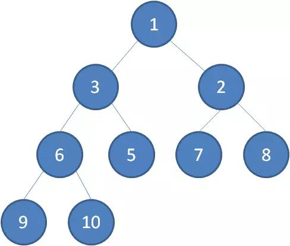


二叉堆的根节点叫做堆顶。

最大堆和最小堆的特点，决定了在最大堆的堆顶是整个堆中的最大元素；最小堆的堆顶是整个堆中的最小元素。

堆的自我调整 、对于二叉堆，如下有几种操作：
- 插入节点
- 删除节点
- 构建二叉堆
这几种操作都是基于堆的自我调整。下面让我们以最小堆为例，看一看二叉堆是如何进行自我调整的。

## 1.插入节点[尾部插入，节点上浮]

二叉堆的节点插入，插入位置是完全二叉树的最后一个位置。比如我们插入一个新节点，值是 0。
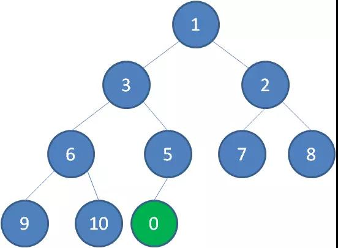

这时候，我们让节点0的它的父节点5做比较，如果0小于5，则让新节点“上浮”，和父节点交换位置。
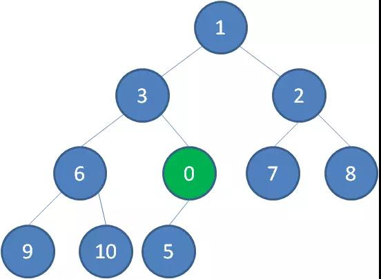

继续用节点0和父节点3做比较，如果0小于3，则让新节点继续“上浮”。
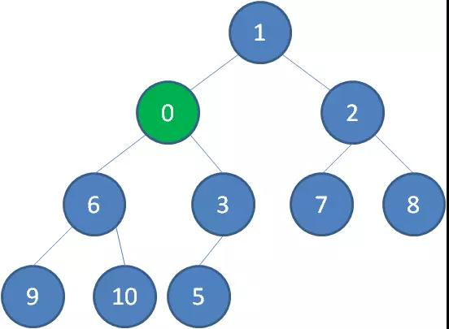

继续比较，最终让新节点0上浮到了堆顶位置。
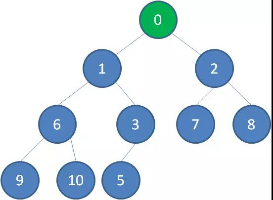


## 2.删除节点【头部删除，尾部节点补头部节点的位置，堆排序采用的就是让头尾交换进行排序】

二叉堆的节点删除过程和插入过程正好相反，所删除的是处于堆顶的节点。比如我们删除最小堆的堆顶节点1。
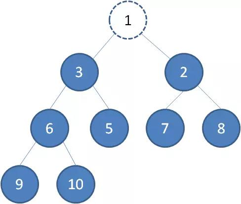

这时候，为了维持完全二叉树的结构，我们把堆的最后一个节点10补到原本堆顶的位置。
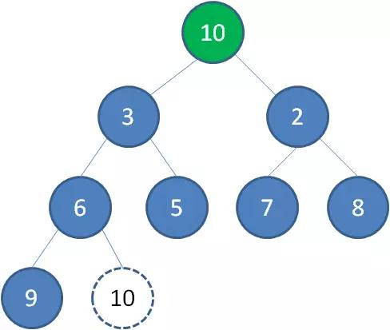

接下来我们让移动到堆顶的节点10和它的左右孩子进行比较，如果左右孩子中最小的一个（显然是节点2）比节点10小，
那么让节点10“下沉”。
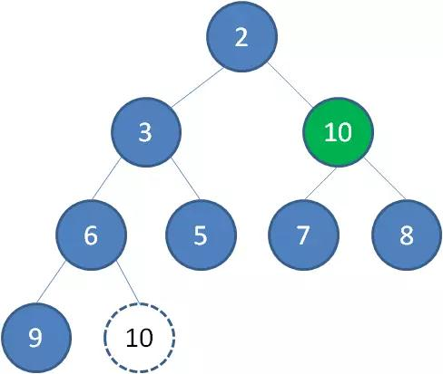

继续让节点10和它的左右孩子做比较，左右孩子中最小的是节点7，由于10大于7，让节点10继续“下沉”。
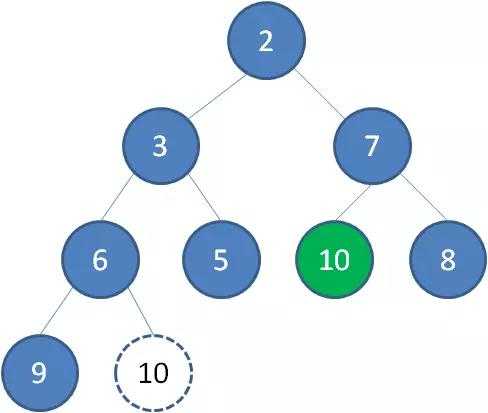

这样一来，二叉堆重新得到了调整。


## 3.构建二叉堆

构建二叉堆，也就是把一个无序的完全二叉树调整为二叉堆，本质上就是让所有非叶子节点依次下沉。

我们举一个无序完全二叉树的例子：
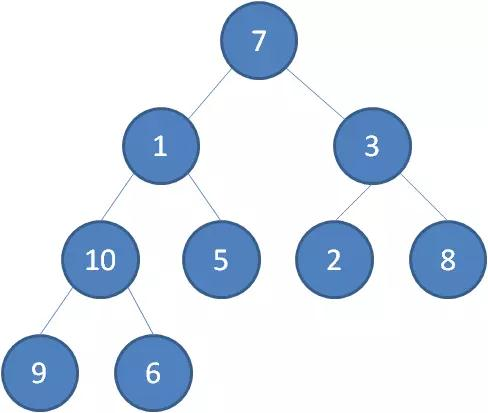

首先，我们从最后一个非叶子节点开始，也就是从节点10开始。如果节点10大于它左右孩子中最小的一个，则节点10下沉。
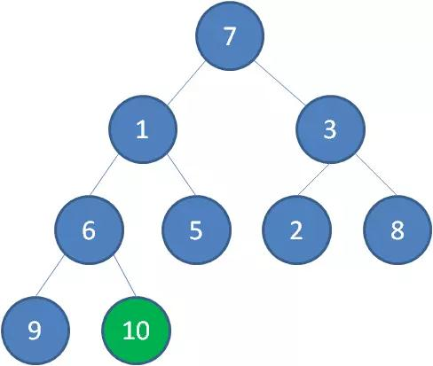

接下来轮到节点3，如果节点3大于它左右孩子中最小的一个，则节点3下沉。
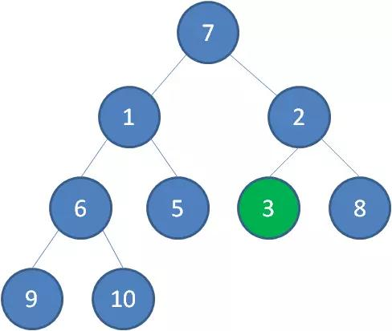


接下来轮到节点1，如果节点1大于它左右孩子中最小的一个，则节点1下沉。事实上节点1小于它的左右孩子，所以不用改变。

接下来轮到节点7，如果节点7大于它左右孩子中最小的一个，则节点7下沉。

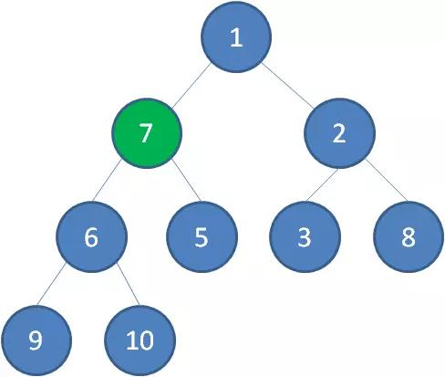

节点7继续比较，继续下沉。
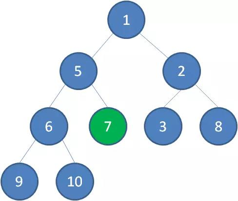

这样一来，一颗无序的完全二叉树就构建成了一个最小堆。


## 堆的代码实现

二叉堆虽然是一颗完全二叉树，但它的存储方式并不是链式存储，而是顺序存储。
换句话说，二叉堆的所有节点都存储在数组当中。
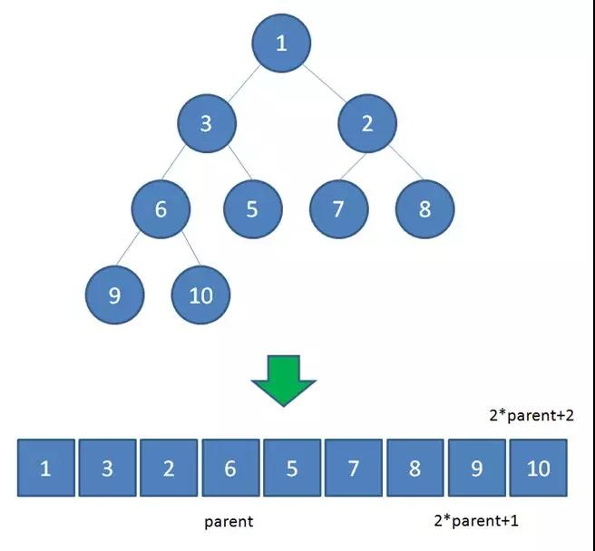

数组中，在没有左右指针的情况下，如何定位到一个父节点的左孩子和右孩子呢？

像图中那样，我们可以依靠数组下标来计算。

假设父节点的下标是parent，那么它的左孩子下标就是 2*parent+1；它的右孩子下标就是  2*parent+2 。

比如上面例子中，节点6包含9和10两个孩子，节点6在数组中的下标是3，节点9在数组中的下标是7，节点10在数组中的下标是8。

7 = 3*2+1
8 = 3*2+2


最小堆插入元素上浮
```
/**
* 上浮调整
* @param array     待调整的堆
*/
public static void upAdjust(int[] array) {
   int childIndex = array.length-1;
   int parentIndex = (childIndex-1)/2;
   // temp保存插入的叶子节点值，用于最后的赋值
   int temp = array[childIndex];
   while (childIndex > 0 && temp < array[parentIndex])
   {
       //无需真正交换，单向赋值即可
       array[childIndex] = array[parentIndex];
       childIndex = parentIndex;
       parentIndex = (parentIndex-1) / 2;
   }
   array[childIndex] = temp;

/**
* 下沉调整
* @param array     待调整的堆
* @param parentIndex    要下沉的父节点
* @param parentIndex    堆的有效大小
*/
public static void downAdjust(int[] array, int parentIndex, int length) {
   // temp保存父节点值，用于最后的赋值
   int temp = array[parentIndex];
   int childIndex = 2 * parentIndex + 1;
   while (childIndex < length) {
       // 如果有右孩子，且右孩子小于左孩子的值，则定位到右孩子
       if (childIndex + 1 < length && array[childIndex + 1] < array[childIndex]) {
           childIndex++;
       }
       // 如果父节点小于任何一个孩子的值，直接跳出
       if (temp <= array[childIndex])
           break;
       //无需真正交换，单向赋值即可
       array[parentIndex] = array[childIndex];
       parentIndex = childIndex;
       childIndex = 2 * childIndex + 1;
   }
   array[parentIndex] = temp;
}

/**
* 构建堆
* @param array     待调整的堆
*/
public static void buildHeap(int[] array) {
   // 从最后一个非叶子节点开始，依次下沉调整
   for (int i = array.length / 2; i >= 0; i--) {
       downAdjust(array, i, array.length - 1);
   }
}

public static void main(String[] args) {
   int[] array = new int[] {1,3,2,6,5,7,8,9,10,0};
   upAdjust(array);
   System.out.println(Arrays.toString(array));
   array = new int[] {7,1,3,10,5,2,8,9,6};
   buildHeap(array);
   System.out.println(Arrays.toString(array));
}
}


```

