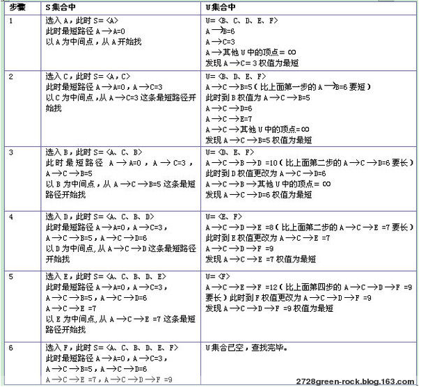
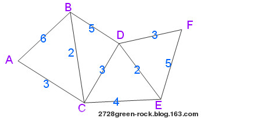
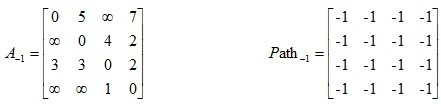
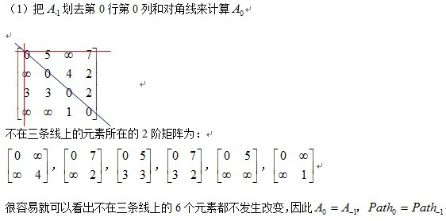
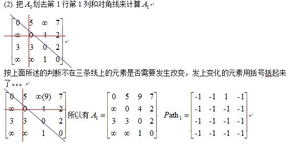
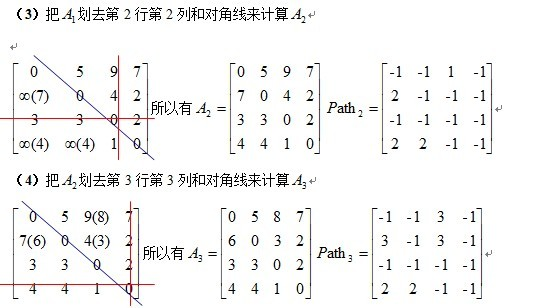

# 最短路径算法
最短路径算法
1、
Dijkstra算法（最后的结果保存源点到所有点的最短路径值）

1.定义概览

Dijkstra(迪杰斯特拉)算法是典型的单源最短路径算法，用于计算一个节点到其他所有节点的最短路径。主要特点是以起始点为中心向外层层扩展，直到扩展到终点为止。Dijkstra算法是很有代表性的最短路径算法，在很多专业课程中都作为基本内容有详细的介绍，如数据结构，图论，运筹学等等。注意该算法要求图中不存在负权边。

问题描述：在无向图 G=(V,E) 中，假设每条边 E[i] 的长度为 w[i]，找到由顶点 V0 到其余各点的最短路径。（单源最短路径）

2.算法描述

1)算法思想：设G=(V,E)是一个带权有向图，把图中顶点集合V分成两组，第一组为已求出最短路径的顶点集合（用S表示，初始时S中只有一个源点，以后每求得一条最短路径 , 就将加入到集合S中，直到全部顶点都加入到S中，算法就结束了），第二组为其余未确定最短路径的顶点集合（用U表示），按最短路径长度的递增次序依次把第二组的顶点加入S中。在加入的过程中，总保持从源点v到S中各顶点的最短路径长度不大于从源点v到U中任何顶点的最短路径长度。此外，每个顶点对应一个距离，S中的顶点的距离就是从v到此顶点的最短路径长度，U中的顶点的距离，是从v到此顶点只包括S中的顶点为中间顶点的当前最短路径长度。

2)算法步骤：

a.初始时，S只包含源点，即S＝{v}，v的距离为0。U包含除v外的其他顶点，即:U={其余顶点}，若v与U中顶点u有边，则<u,v>正常有权值，若u不是v的出边邻接点，则<u,v>权值为∞。

b.从U中选取一个距离v最小的顶点k，把k，加入S中（该选定的距离就是v到k的最短路径长度）。

c.以k为新考虑的中间点，修改U中各顶点的距离；若从源点v到顶点u的距离（经过顶点k）比原来距离（不经过顶点k）短，则修改顶点u的距离值，修改后的距离值的顶点k的距离加上边上的权。

d.重复步骤b和c直到所有顶点都包含在S中。

算法步骤
    （1）初始化时，S只含有源节点；
    （2）从U中选取一个距离v最小的顶点k加入S中（该选定的距离就是v到k的最短路径长度）；
    （3）以k为新考虑的中间点，修改U中各顶点的距离；若从源节点v到顶点u的距离（经过顶点k）比原来距离（不经过顶点k）短，则修改顶点u的距离值，修改后的距离值是顶点k的距离加上k到u的距离；
    （4）重复步骤（2）和（3），直到所有顶点都包含在S中。
    具体图例与算法执行步骤：（就从A开始，到各节点的最短路径）。
    
    具体执行步骤如下图所示。

2、
Floyd-Warshall算法（Floyd-Warshall algorithm）是解决任意两点间的最短路径的一种算法，可以正确处理有向图或负权的最短路径问题，同时也被用于计算有向图的传递闭包。Floyd-Warshall算法的时间复杂度为O(N3)，空间复杂度为O(N2)。
 
2.算法描述
1)算法思想原理：
     Floyd算法是一个经典的动态规划算法。用通俗的语言来描述的话，首先我们的目标是寻找从点i到点j的最短路径。从动态规划的角度看问题，我们需要为这个目标重新做一个诠释（这个诠释正是动态规划最富创造力的精华所在）
      从任意节点i到任意节点j的最短路径不外乎2种可能，1是直接从i到j，2是从i经过若干个节点k到j。所以，我们假设Dis(i,j)为节点u到节点v的最短路径的距离，对于每一个节点k，我们检查Dis(i,k) + Dis(k,j) < Dis(i,j)是否成立，如果成立，证明从i到k再到j的路径比i直接到j的路径短，我们便设置Dis(i,j) = Dis(i,k) + Dis(k,j)，这样一来，当我们遍历完所有节点k，Dis(i,j)中记录的便是i到j的最短路径的距离。
2).算法描述：
a.从任意一条单边路径开始。所有两点之间的距离是边的权，如果两点之间没有边相连，则权为无穷大。 　　
b.对于每一对顶点 u 和 v，看看是否存在一个顶点 w 使得从 u 到 w 再到 v 比己知的路径更短。如果是更新它。
3).Floyd算法过程矩阵的计算----十字交叉法
方法：两条线，从左上角开始计算一直到右下角 如下所示
给出矩阵，其中矩阵A是邻接矩阵，而矩阵Path记录u,v两点之间最短路径所必须经过的点

相应计算方法如下：

最后A3即为所求结果

