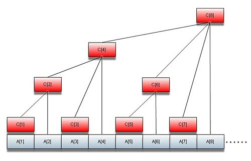

# 树状数组
树状数组

树状数组(Binary Indexed Tree(B.I.T), Fenwick Tree)是一个查询和修改复杂度都为log(n)的数据结构。主要用于查询任意两位之间的所有元素之和，但是每次只能修改一个元素的值；经过简单修改可以在log(n)的复杂度下进行范围修改，但是这时只能查询其中一个元素的值(如果加入多个辅助数组则可以实现区间修改与区间查询)。

这种数据结构（算法）并没有C++和Java的库支持，需要自己手动实现。在Competitive Programming的竞赛中被广泛的使用。树状数组和线段树很像，但能用树状数组解决的问题，基本上都能用线段树解决，而线段树能解决的树状数组不一定能解决。相比较而言，树状数组效率要高很多。
她又是怎样做到不断的一分为二呢？说这个之前我先说个叫lowbit的东西，lowbit(k)就是把k的二进制的高位1全部清空，只留下最低位的1,比如10的二进制是1010,则lowbit(k)=lowbit(1010)=0010(2进制)，介于这个lowbit在下面会经常用到，这里给一个非常方便的实现方式，比较普遍的方法lowbit(k)=k&-k，这是位运算，我们知道一个数加一个负号是把这个数的二进制取反+1，如-10的二进制就是-1010=0101+1=0110，然后用1010&0110，答案就是0010了！明白了求解lowbit的方法就可以了，继续下面。介于下面讨论十进制已经没有意义（这个世界本来就是二进制的，人非要主观的构建一个十进制），下面所有的数没有特别说明都当作二进制。
       上面那么多文字说lowbit，还没说它的用处呢，它就是为了联系a数组和c数组的！ck表示从ak开始往左连续求lowbit(k)个数的和，比如c[0110]=a[0110]+a[0101]，就是从110开始计算了0010个数的和，因为lowbit(0110)=0010，可以看到其实只有低位的1起作用，因为很显然可以写出c[0010]=a[0010]+a[0001]，这就为什么我们任何数都只关心它的lowbit，因为高位不起作用（基于我们的二分规则它必须如此！），除非除了高位其余位都是0，这时本身就是lowbit。
既然关系建立好了，看看如何实现a某一个位置数据跟改的，她不会直接改的（开始就说了，a根本不存在），她每次改其实都要维护c数组应有的性质，因为后面求和要用到。而维护也很简单，比如更改了a[0011]，我们接着要修改c[0011],c[0100],c[1000]，这是很容易从图上看出来的，但是你可能会问，他们之间有申明必然联系吗？每次求解总不能总要拿图来看吧？其实从0011——>0100——>1000的变化都是进行“去尾”操作，又是自己造的词--''，我来解释下，就是把尾部应该去掉的1都去掉转而换到更高位的1,记住每次变换都要有一个高位的1产生，所以0100是不能变换到0101的，因为没有新的高位1产生，这个变换过程恰好是可以借助我们的lowbit进行的，k +=lowbit(k)。
       好吧，现在更新的次序都有了，可能又会产生新的疑问了：为什么它非要是这种关系啊？这就要追究到之前我们说c8可以看作a1～a8的左半边和+右半边和……的内容了，为什么c[0011]会影响到c[0100]而不会影响到c[0101]，这就是之前说的c[0100]的求解实际上是这样分段的区间 c[0001]~c[0001] 和区间c[0011]~c[0011]的和，数字太小，可能这样不太理解，在比如c[0100]会影响c[1000]，为什么呢？因为c[1000]可以看作0001～0100的和加上0101~1000的和，但是0101位置的数变化并会直接作用于c[1000]，因为它的尾部1不能一下在跳两级在产生两次高位1,是通过c[0110]间接影响的，但是，c[0100]却可以跳一级产生一次高位1。
         可能上面说的你比较绕了，那么此时你只需注意：c的构成性质（其实是分组性质）决定了c[0011]只会直接影响c[0100]，而c[0100]只会直接影响[1000]，而下表之间的关系恰好是也必须是k +=lowbit(k)。此时我们就是写出跟新维护树的代码：

[cpp] view plain copy print?

- void add(int k,int num)
- {
-     while(k<=n)
-     {
-         tree[k]+=num;
-         k+=k&-k;
-     }
- }

       有了上面的基础，说求和就比较简单了。比如求0001～0110的和就直接c[0100]+c[0110]，分析方法与上面的恰好逆过来，而且写法也是逆过来的，具体就不累述了：

[cpp] view plain copy print?

- int read(int k)//1~k的区间和
- {
-     int sum=0;
-     while(k)
-     {
-         sum+=tree[k];
-         k-=k&-k;
-     }
-     return sum;
- }

三、总结一下吧
          首先，明白树状数组所白了是按照二分对数组进行分组；维护和查询都是O(lgn)的复杂度，复杂度取决于最坏的情况，也是O(lgn);lowbit这里只是一个技巧，关键在于明白c数组的构成规律;分析的过程二进制一定要深入人心，当作心目中的十进制。

C1 = A1

C2 = A1 + A2

C3 = A3

C4 = A1 + A2 + A3 + A4

C5 = A5

C6 = A5 + A6

C7 = A7

C8 = A1 + A2 + A3 + A4 + A5 + A6 + A7 + A8

...

C16 = A1 + A2 + A3 + A4 + A5 + A6 + A7 + A8 + A9 + A10 + A11 + A12 + A13 + A14 + A15 + A16

很容易知道C8表示A1～A8的和，但是C6却是表示A5～A6的和，为什么会产生这样的区别的呢？或者说发明她的人为什么这样区别对待呢？

答案是，这样会使操作更简单！看到这相信有些人就有些感觉了，为什么复杂度被log了呢？可以看到，C8可以看作A1～A8的左半边和+右半边和，而其中左半边和是确定的C4，右半边其实也是同样的规则把A5～A8一分为二……继续下去都是一分为二直到不能分树状数组巧妙地利用了二分，树状数组并不神秘，关键是巧妙！

(1)C[t]展开以后有多少项？由下面公式计算：

int lowbit(int t){//计算c[t]展开的项数
   return t&(-t);
  }

C[t]展开的项数就是lowbit(t),C[t]就是从A[t]开始往左连续求lowbit(t)个数的和.

(2)修改
    比如修改了A3,必须修改C3,C4,C8,C16,C32,C64...
    当我们修改A[i]的值时，可以从C[i]往根节点一路上溯，调整这条路上的所有C[]即可，对于节点i，父节点下标 p=i+lowbit(i)

//给A[i]加上 x后，更新一系列C[j]

[java] view plain copy print?

- update(int i,int x){
-  while(i<=n){
-     c[i]=c[i]+x;
-     i=i+lowbit(i);
-      }
- }

应用1：求数列A[]的前n项和，只需找到n以前的所有最大子树，把其根节点的C加起来即可。

[java] view plain copy print?

-   如：Sun(1)=C[1]=A[1];
-       Sun(2)=C[2]=A[1]+A[2];
-       Sun(3)=C[3]+C[2]=A[1]+A[2]+A[3];
-       Sun(4)=C[4]=A[1]+A[2]+A[3]+A[4];
-       Sun(5)=C[5]+C[4];
-       Sun(6)=C[6]+C[4];
-       Sun(7)=C[7]+C[6]+C[4];
-       Sun(8)=C[8];
-       ,,,,,,
-
- int Sum(int n) //求前n项的和.
- {
-     int sum=0;
-     while(n>0)
-     {
-          sum+=C[n];
-          n=n-lowbit(n);
-     }
-     return sum;
- }

二、树状数组可以扩充到二维。
问题：一个由数字构成的大矩阵，能进行两种操作
1) 对矩阵里的某个数加上一个整数（可正可负）
2) 查询某个子矩阵里所有数字的和,要求对每次查询，输出结果。

一维树状数组很容易扩展到二维，在二维情况下:数组A[][]的树状数组定义为：

  C[x][y] = ∑ a[i][j], 其中，
    x-lowbit(x) + 1 <= i <= x,
    y-lowbit(y) + 1 <= j <= y.

例：举个例子来看看C[][]的组成。
     设原始二维数组为：
　A[][]={{a11,a12,a13,a14,a15,a16,a17,a18,a19},
         {a21,a22,a23,a24,a25,a26,a27,a28,a29},
         {a31,a32,a33,a34,a35,a36,a37,a38,a39}，
         {a41,a42,a43,a44,a45,a46,a47,a48,a49}};
那么它对应的二维树状数组C[][]呢？

记:
  B[1]={a11,a11+a12,a13,a11+a12+a13+a14,a15,a15+a16,...} 这是第一行的一维树状数组
  B[2]={a21,a21+a22,a23,a21+a22+a23+a24,a25,a25+a26,...} 这是第二行的一维树状数组
  B[3]={a31,a31+a32,a33,a31+a32+a33+a34,a35,a35+a36,...} 这是第三行的一维树状数组
  B[4]={a41,a41+a42,a43,a41+a42+a43+a44,a45,a45+a46,...} 这是第四行的一维树状数组
那么：
C[1][1]=a11,C[1][2]=a11+a12,C[1][3]=a13,C[1][4]=a11+a12+a13+a14,c[1][5]=a15,C[1][6]=a15+a16,...
   这是A[][]第一行的一维树状数组

C[2][1]=a11+a21,C[2][2]=a11+a12+a21+a22,C[2][3]=a13+a23,C[2][4]=a11+a12+a13+a14+a21+a22+a23+a24,
C[2][5]=a15+a25,C[2][6]=a15+a16+a25+a26,...
   这是A[][]数组第一行与第二行相加后的树状数组

C[3][1]=a31,C[3][2]=a31+a32,C[3][3]=a33,C[3][4]=a31+a32+a33+a34,C[3][5]=a35,C[3][6]=a35+a36,...
   这是A[][]第三行的一维树状数组

C[4][1]=a11+a21+a31+a41,C[4][2]=a11+a12+a21+a22+a31+a32+a41+a42,C[4][3]=a13+a23+a33+a43,...
    这是A[][]数组第一行+第二行+第三行+第四行后的树状数组

搞清楚了二维树状数组C[][]的规律了吗？ 仔细研究一下,会发现:

（1）在二维情况下，如果修改了A[i][j]=delta,则对应的二维树状数组更新函数为：

[java] view plain copy print?

- private void Modify(int i, int j, int delta){
-
-         A[i][j]+=delta;
-
-       for(int x = i; x< A.length; x += lowbit(x))
-        for(int y = j; y <A[i].length; y += lowbit(y)){
-          C[x][y] += delta;
-
-        }
-     }

（2）在二维情况下，求子矩阵元素之和∑ a[i][j](前i行和前j列)的函数为

[java] view plain copy print?

-  int Sum(int i, int j){
-    int result = 0;
-    for(int x = i; x > 0; x -= lowbit(x)) {
-      for(int y = j; y > 0; y -= lowbit(y)) {
-          result += C[x][y];
-      }
-    }
-  return result;
- }
-
-  Sun(1,1)=C[1][1];  Sun(1,2)=C[1][2]; Sun(1,3)=C[1][3]+C[1][2];...
-  Sun(2,1)=C[2][1];  Sun(2,2)=C[2][2]; Sun(2,3)=C[2][3]+C[2][2];...
-  Sun(3,1)=C[3][1]+C[2][1]; Sun(3,2)=C[3][2]+C[2][2];

顶
5

踩

