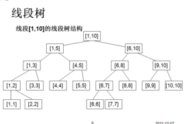

# 线段树（区间树）

线段树（区间树）

线段树是一种二叉搜索树，与区间树相似，它将一个区间划分成一些单元区间，每个单元区间对应线段树中的一个叶结点。

使用线段树可以快速的查找某一个节点在若干条线段中出现的次数，时间复杂度为O(logN）。而未优化的空间复杂度为2N，因此有时需要离散化让空间压缩。

性质：父亲的区间是[a,b],(c=(a+b)/2)左儿子的区间是[a,c]，右儿子的区间是[c+1,b]，线段树需要的空间为数组大小的四倍

//节点定义
public class SegmentTreeNode {

     public int start, end, max;
     public SegmentTreeNode left, right;
     public SegmentTreeNode(int start, int end, int max) {
          this.start = start;
          this.end = end;
          this.max = max;
          this.left = this.right = null;
     }
     public SegmentTreeNode(int start, int end) {
          this.start = start;
          this.end = end;
          this.left = this.right = null;
     }
}

1、建立区间树

线段树是一棵二叉树，他的每个节点包含了两个额外的属性start和end用于表示该节点所代表的区间。start和end都是整数，并按照如下的方式赋值:

根节点的 start 和 end 由 build 方法所给出。
对于节点 A 的左儿子，有 start=A.left, end=(A.left + A.right) / 2。
对于节点 A 的右儿子，有 start=(A.left + A.right) / 2 + 1, end=A.right。
如果 start 等于 end, 那么该节点是叶子节点，不再有左右儿子。
实现一个 build 方法，接受 start 和 end 作为参数, 然后构造一个代表区间 [start, end] 的线段树，返回这棵线段树的根。

说明
线段树(又称区间树), 是一种高级数据结构，他可以支持这样的一些操作:

查找给定的点包含在了哪些区间内
查找给定的区间包含了哪些点
见百科：
线段树
区间树

样例
比如给定start=1, end=6，对应的线段树为：

               [1,  6]
             /        \
      [1,  3]           [4,  6]
      /     \           /     \
   [1, 2]  [3,3]     [4, 5]   [6,6]
   /    \           /     \
[1,1]   [2,2]     [4,4]   [5,5]
      */

     public static void main(String[] args) {
          SegmentTreeNode n = build(1,6);
          System.out.println(n);
     }
     public static SegmentTreeNode build(int start, int end) {
        // write your code here
          if (start > end) {
              return null;
          }
          if (start == end) {
              return new SegmentTreeNode(start,start);
          }
          SegmentTreeNode root = new SegmentTreeNode(start,end);
          b(root,start,end);
          return root;
    }
     public static void b(SegmentTreeNode root, int start, int end) {
          if (start < end) {
              int mid = (start + end) / 2;
              SegmentTreeNode left = new SegmentTreeNode(start, mid);
              SegmentTreeNode right = new SegmentTreeNode(mid + 1, end);
              root.left = left;
              root.right = right;
              b(root.left, start, mid);
              b(root.right, mid + 1, end);
          }
     }

思路：先生成一个节点，然后判断是不是叶子节点，是叶子节点直接返回，不是的话，递归操作。
//优化
public SegmentTreeNode build(int start, int end) {
        // write your code here
        if(start > end) {  // check core case
            return null;
        }
     
        SegmentTreeNode root = new SegmentTreeNode(start, end);
     
        if(start != end) {
            int mid = (start + end) / 2;
            root.left = build(start, mid);
            root.right = build(mid+1, end);
         
            // root.max = Math.max(root.left.max, root.right.max);
        }
        return root;
    }
2、建立带有最大值的线段树

     /**
      * @author lishuai
      * @data 2017-4-5 下午4:36:10
线段树是一棵二叉树，他的每个节点包含了两个额外的属性start和end用于表示该节点所代表的区间。start和end都是整数，并按照如下的方式赋值:

根节点的 start 和 end 由 build 方法所给出。
对于节点 A 的左儿子，有 start=A.left, end=(A.left + A.right) / 2。
对于节点 A 的右儿子，有 start=(A.left + A.right) / 2 + 1, end=A.right。
如果 start 等于 end, 那么该节点是叶子节点，不再有左右儿子。
对于给定数组设计一个build方法，构造出线段树

max为区间最大值

样例
给出[3,2,1,4]，线段树将被这样构造

                 [0,  3] (max = 4)
                  /            \
        [0,  1] (max = 3)     [2, 3]  (max = 4)
        /        \               /             \
[0, 0](max = 3)  [1, 1](max = 2)[2, 2](max = 1) [3, 3] (max = 4)
      */
//方案一：
     public static void main(String[] args) {
          // TODO Auto-generated method stub

     }
     public static SegmentTreeNode build(int[] A) {
        // write your code here
          if (A == null || A.length == 0) {
              return null;
          }
          if (A.length == 1) {
              return new SegmentTreeNode(0,0,A[0]);
          }
          int max = getMax(A, 0, A.length - 1);
          SegmentTreeNode root = new SegmentTreeNode(0, A.length - 1, max);
          b(A, root, 0, A.length - 1);
          return root;
    }

     public static void b(int[] A ,SegmentTreeNode root, int start, int end) {
          if (start < end) {
              int mid = (start + end) / 2;
              int max1 = getMax(A, start, mid);
              int max2 = getMax(A, mid + 1, end);
              SegmentTreeNode left = new SegmentTreeNode(start, mid, max1);
              SegmentTreeNode right = new SegmentTreeNode(mid + 1, end, max2);
              root.left = left;
              root.right = right;
              b(A, root.left, start, mid);
              b(A, root.right, mid + 1, end);
          }
     }

     public static int getMax(int[] a, int start, int end) {
          int max = a[start];
          for (int i = start + 1; i <= end; i++) {
              if (a[i] > max) {
                   max = a[i];
              }
          }
          return max;
     }

//方案二：
public SegmentTreeNode build(int[] A) {
        // write your code here
        return buildTree(0, A.length - 1, A);
    }

    public SegmentTreeNode buildTree(int start, int end, int[] A) {
        if (start > end)
            return null;

        if (start == end) {
            return new SegmentTreeNode(start, end, A[start]);
        }
        SegmentTreeNode node = new SegmentTreeNode(start, end, A[start]);
        int mid = (start + end) / 2;
        node.left = this.buildTree(start, mid, A);
        node.right = this.buildTree(mid + 1, end, A);
        if (node.left != null && node.left.max > node.max)
            node.max = node.left.max;
        if (node.right != null && node.right.max > node.max)
            node.max = node.right.max;
        return node;
    }
3、修改
对于一棵 最大线段树, 每个节点包含一个额外的 max 属性，用于存储该节点所代表区间的最大值。

设计一个 modify 的方法，接受三个参数 root、 index 和value。该方法将 root 为跟的线段树中 [start, end] = [index,index] 的节点修改为了新的 value ，并确保在修改后，线段树的每个节点的 max 属性仍然具有正确的值。

思路1：分两步走
第一步，先把指定位置的元素修改最大值
第二步，根据左右子节点的最大值比较，递归调整每个节点的最大值；
public void modify(SegmentTreeNode root, int index, int value) {
        // write your code here
        if (root == null) {
            return;
        }
        m(root, index, value);
        getMax(root);
    }
    public int getMax(SegmentTreeNode root) {
        if (root == null) {
            return 0;
        }
        if (root.start == root.end) {
            return root.max;
        }
        int left = getMax(root.left);
        int right = getMax(root.right);
        int max = Math.max(left, right);
        if (root.max != max) {
            root.max = max;
        }
        return max;
    }

    public void m(SegmentTreeNode root, int index, int value) {
        if (root == null) {
            return;
        }
        if (root.start == root.end && root.start == index) {
            root.max = value;
            return;
        }
        int mid = (root.start + root.end) / 2;
        if (index <= mid) {
            m(root.left, index, value);
        } else {
            m(root.right, index, value);
        }
    }

//思路2：优解
public void modify(SegmentTreeNode root, int index, int value) {
        // write your code here
        if(root.start == index && root.end == index) { // 查找到
            root.max = value;
            return;
        }
       
        // 查询
        int mid = (root.start + root.end) / 2;
        if(root.start <= index && index <=mid) {
            modify(root.left, index, value);
        }
       
        if(mid < index && index <= root.end) {
            modify(root.right, index, value);
        }
        //更新
        root.max = Math.max(root.left.max, root.right.max);
    }

4、查询1

对于一个有n个数的整数数组，在对应的线段树中, 根节点所代表的区间为0-n-1, 每个节点有一个额外的属性max，值为该节点所代表的数组区间start到end内的最大值。

为SegmentTree设计一个 query 的方法，接受3个参数root, start和end，线段树root所代表的数组中子区间[start, end]内的最大值。

思路1:
借助于先序遍历，判断在start和end范围的叶子节点
public int max = Integer.MIN_VALUE;
    public int query(SegmentTreeNode root, int start, int end) {
        traverse(root, start, end);
        return max;
    }
    public void traverse(SegmentTreeNode root, int start, int end) {
        if (root != null) {
            if (root.start == root.end && start <= root.start && root.start <= end && root.max > max) {
                max = root.max;
            }

            int mid = (root.start + root.end) / 2;
            if (start > mid) {
                traverse(root.right, start, end);
            } else if (end < mid) {
                traverse(root.left, start, end);
            } else {
                traverse(root.left, start, end);
                traverse(root.right, start, end);
            }
        }
    }
//思路2：
public int query(SegmentTreeNode root, int start, int end) {
        // write your code here
        if(start == root.start && root.end == end) { // 相等
            return root.max;
        }
       
       
        int mid = (root.start + root.end)/2;
        int leftmax = Integer.MIN_VALUE, rightmax = Integer.MIN_VALUE;
        // 左子区
        if(start <= mid) {
            if( mid < end) { // 分裂
                leftmax =  query(root.left, start, mid);
            } else { // 包含
                leftmax = query(root.left, start, end);
            }
            // leftmax = query(root.left, start, Math.min(mid,end));
        }
        // 右子区
        if(mid < end) { // 分裂 3
            if(start <= mid) {
                rightmax = query(root.right, mid+1, end);
            } else { //  包含
                rightmax = query(root.right, start, end);
            }
            //rightmax = query(root.right, Math.max(mid+1,start), end);
        } 
        // else 就是不相交
        return Math.max(leftmax, rightmax);
    }
5、查询2
对于一个数组，我们可以对其建立一棵 线段树, 每个结点存储一个额外的值 count 来代表这个结点所指代的数组区间内的元素个数. (数组中并不一定每个位置上都有元素)

实现一个 query 的方法，该方法接受三个参数 root, start 和end, 分别代表线段树的根节点和需要查询的区间，找到数组中在区间[start, end]内的元素个数。
//思路1：
public static int max = 0;
    public static  int query(SegmentTreeNode root, int start, int end) {
        max = 0;
        traverse(root, start, end);
        return max;
    }
    public static void traverse(SegmentTreeNode root, int start, int end) {
        if (root != null) {
            if (root.start == root.end && start <= root.start && root.start <= end) {
                max += root.count;
            }
            int mid = (root.start + root.end) / 2;
            if (start > mid) {
                traverse(root.right, start, end);
            } else if (end < mid) {
                traverse(root.left, start, end);
            } else {
                traverse(root.left, start, end);
                traverse(root.right, start, end);
            }
        }
    }

//思路2：
public int query(SegmentTreeNode root, int start, int end) {
        // write your code here
        if(start > end || root==null)
            return 0;
        if(start <= root.start && root.end <= end) { // 相等
            return root.count;
        }
       
        int mid = (root.start + root.end)/2;
        int leftsum = 0, rightsum = 0;
        // 左子区
        if(start <= mid) {
            if( mid < end) { // 分裂
                leftsum =  query(root.left, start, mid);
            } else { // 包含
                leftsum = query(root.left, start, end);
            }
        }
        // 右子区
        if(mid < end) { // 分裂 3
            if(start <= mid) {
                rightsum = query(root.right, mid+1, end);
            } else { //  包含
                rightsum = query(root.right, start, end);
            }
        } 
        // else 就是不相交
        return leftsum + rightsum;
    }

6、区间最小数

给定一个整数数组（下标由 0 到 n-1，其中 n 表示数组的规模），以及一个查询列表。每一个查询列表有两个整数[start, end]。 对于每个查询，计算出数组中从下标 start 到 end 之间的数的最小值，并返回在结果列表中。

 
样例

对于数组 [1,2,7,8,5]， 查询 [(1,2),(0,4),(2,4)]，返回 [2,1,5]

class SegmentTreeNode {
    public int start, end, min;
    public SegmentTreeNode left, right;
    public SegmentTreeNode(int start, int end, int min) {
          this.start = start;
          this.end = end;
          this.min = min;
          this.left = this.right = null;
    }}public class Solution {
    /**
    *@param A, queries: Given an integer array and an query list
    *@return: The result list
    */
    public SegmentTreeNode build(int start, int end, int[] A) {
        // write your code here
        if(start > end) {  // check core case
            return null;
        }
       
        SegmentTreeNode root = new SegmentTreeNode(start, end, Integer.MAX_VALUE);
       
        if(start != end) {
            int mid = (start + end) / 2;
            root.left = build(start, mid, A);
            root.right = build(mid+1, end, A);
           
            root.min = Math.min(root.left.min, root.right.min);
        } else {
            root.min = A[start];
        }
        return root;
    }
    public int query(SegmentTreeNode root, int start, int end) {
        // write your code here
        if(start == root.start && root.end == end) { // 相等
            return root.min;
        }
       
       
        int mid = (root.start + root.end)/2;
        int leftmin = Integer.MAX_VALUE, rightmin = Integer.MAX_VALUE;
        // 左子区
        if(start <= mid) {
            if( mid < end) { // 分裂
                leftmin =  query(root.left, start, mid);
            } else { // 包含
                leftmin = query(root.left, start, end);
            }
        }
        // 右子区
        if(mid < end) { // 分裂 3
            if(start <= mid) {
                rightmin = query(root.right, mid+1, end);
            } else { //  包含
                rightmin = query(root.right, start, end);
            }
        } 
        // else 就是不相交
        return Math.min(leftmin, rightmin);
    }
   
    public ArrayList<Integer> intervalMinNumber(int[] A,
                                                ArrayList<Interval> queries) {
        // write your code here
        SegmentTreeNode root = build(0, A.length - 1, A);
        ArrayList ans = new ArrayList<Integer>();
        for(Interval in : queries) {
            ans.add(query(root, in.start, in.end));
        }
        return ans;
    }}

