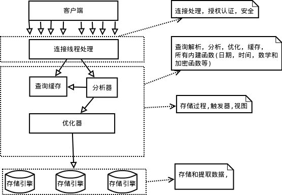

# 第一章 MySQL架构与历史
1、mysql服务器逻辑架构

每个虚线框为一层，总共三层。

第一层，服务层(为客户端服务):为请求做连接处理，授权认证，安全等。

第二层，核心层:查询解析，分析，优化，缓存，提供内建函数;存储过程，触发器，视图。

第三层，存储引擎层，不光做存储和提取数据，而且针对特殊数据引擎还要做事务处理。

2、并发
读锁和写锁也叫共享锁和排它锁
写锁具有排他性
写锁的优先级高于读锁

锁策略：在锁的开销和数据的安全性之间寻求平衡
锁的粒度：表锁和行锁

行级锁只是在存储引擎层实现，而MySQL服务器层没有实现

3、事务

事务的ACID，原子性，一致性、隔离性、持久性
atomicity、consistentcy、isolation、durability

四种隔离级别：
1、读未提交
read uncommitted
2、读已提交
read committed
3、可重复读（MySQL默认的事务隔离级别）
repeatable read
4、可串行化（会在每一行数据上都加锁读，可能会导致超时和锁争用）
serializable

隔离级别脏读（Dirty Read）不可重复读（NonRepeatable Read）幻读（Phantom Read）读未提交（Read uncommitted）可能可能可能读已提交（Read committed）不可能可能可能可重复读（Repeatable read）不可能不可能可能可串行化（Serializable ）不可能不可能不可能

死锁是两个或者以上的事务在同一资源上相互占用，并且请求锁定对方占用的资源，从而导致恶性循环。
当多个事务试图以不同的顺序锁定资源时，就可能会产生死锁。

事务日志
4、多版本并发操作（MVCC）

mvcc是通过保存数据在某个时间点的快照来实现的。
mvcc只在读已提交和可重复读两个隔离级别下工作。

5、存储引擎

总结：
MyISAM：不支持事务和外键；支持全文索引；表级别锁；应用在读比较的的情形下
InnoDB：支持事务和外键；不支持全文索引；行级锁；应用在插入和更新的比较多的情形下（有缓存池，缓存数据和索引）

innodb 5.5默认的存储引擎
myisam 在5.1之前是默认的存储引擎，不支持事务和行级锁而且崩溃后无法安全恢复

选择合适的存储引擎需要考虑的点
1、事务
2、备份
3、崩溃后恢复
4、特有的特性

总结：MySQL拥有分层架构，上层是服务器层的服务和查询执行引擎，下层是存储引擎。存储引擎的API很重要，要是能理解MySQL在存储引擎和服务层之间处理查询时如何通过API来回交互，就能抓住MySQL的核心基础架构。

# 第二章 MySQL基准测试（压力测试）

sysbench   oltp和fileio

概念：
TPS每秒的事务数
OLTP在线事务处理

基准测试的作用
1、验证基于系统放入一些假设，是否和期望的一样
2、重现系统中的某些异常行为，以便解决异常
3、测试系统当前的运行状况，查找系统以后扩展可能遇到的瓶颈

基准测试的策略
1、集成测试：查找系统整体的瓶颈在哪里
2、单组件测试

测试的指标
1、吞吐量：单位时间内处理的事务数TPS
2、响应时间或者延迟：用于测试任务完成所需要的整体时间
3、并发性
4、可扩展性

基准测试需要运行足够长的时间

基准测试工具
1、集成测试工具
ab是Apache http服务器基准测试工具，测试http服务器每秒钟可以处理的请求数；单URL
http_load 功能类似ab，但是可以多URL
jmeter 可以测试web服务器，ftp服务器、jdbc连接等

2、单组件测试工具
sysbench多线程系统压测工具

# 第三章 服务器性能剖析（性能即响应时间）

常见的三个性能相关的服务请求
1、如何确定服务器是否达到了性能最佳的状态
2、找出某条语句为什么执行的不够快
3、诊断被用户描述成“停顿”、“堆积”，或者“卡死”的某些间歇性疑难故障

# 第四章 schema与数据类型优化
4、5、6三章讨论逻辑设计、物理设计和查询执行，以及他们之间的关系

4.1、选择优化的数据类型
标准：
1、更小的通常最好，即选择满足要求的最小存储数据类型；
2、简单就好，比如字符操作就比整型复杂；
3、尽量指定列为 not null，因为可为null的列使得索引、索引统计和值比较都更复杂；

1、整数类型

tinyint（1字节）smallint（2） mediumint（3）int（4）bigint（8）

2、实数类型
float（4）double（8）近视计算
decimal精确计算

3、字符串类型

char 定长字符串
适用场景：
1、存储很短的字符串
2、所有的值接近同一个长度（例如MD5加密值）

varchar 存储可变长字符串，需要额外的一个或者两个字节来保存字符串的长度
适用场景：
1、字符串列的最大长度比平均长度大很多；
2、列的更新很少，所以碎片不是问题；
3、使用了想utf-8这样复杂的字符集，每个字符都使用不同的字节数进行存储；

blob 和text 存储很大的字符串数据类型，分别采用二进制和字符方式存储
和int类似，上面的两种数据类型，每个都有对应的五个版本
smallblob和blob同义
smalltext和text同义

enum

4、日期时间类型

5、位数据类型

6、选择标识符（indentifier）

7、特殊类型数据

4.2、MySQL schema设计中的陷阱

4.3、范式和反范式
1、范式的优点和缺点
2、反范式的优点和缺点
3、混合使用

4.4、缓存表和汇总表
1、物化视图
2、计数器表

4.5、加快alter table操作的速度
1、只修改.frm文件
2、快速创建myisam索引

# 第五章 创建高性能的索引（大多数情况下是B-tree索引）

# 第六章 查询性能优化

# 第七章 MySQL高级特性

1、分区表（是一种粗粒度的、简易的索引策略，适应于大数据量的过滤场景）

2、视图（对好几个表的复杂查询，使用视图有时候会大大简化问题）

3、外键（确保系统的完整性，但是会影响系统的性能）

4、存储过程

5、绑定变量

6、插件

7、字符集

8、全文索引

9、XA事务

10、查询缓存

# 第八章 优化服务器设置

# 第九章 操作系统和硬件优化

# 第十章 复制

# 第十一章 可扩展的MySQL
  
  常见的负载均衡算法
  随机
  轮询
  权重
  hash
  最少连接数
  最快响应时间

# 第十二章 高可用性

# 第十三章 云端的MySQL 

# 第十四章 应用层优化

# 第十五章 备份与恢复

# 第十六章 MySQL用户工具

