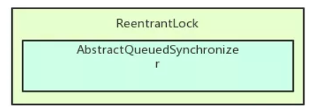
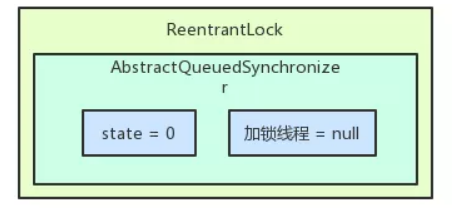
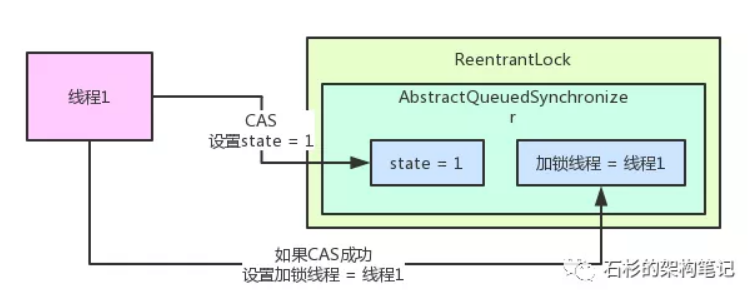
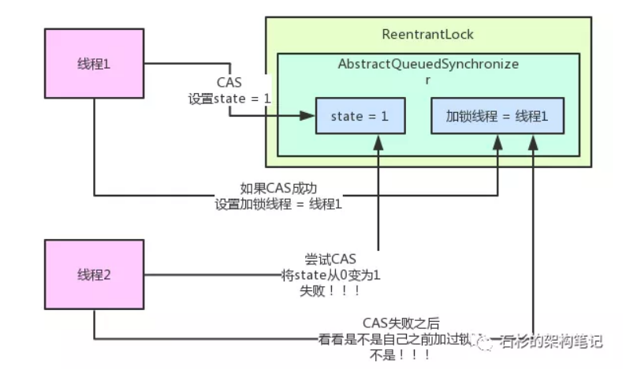
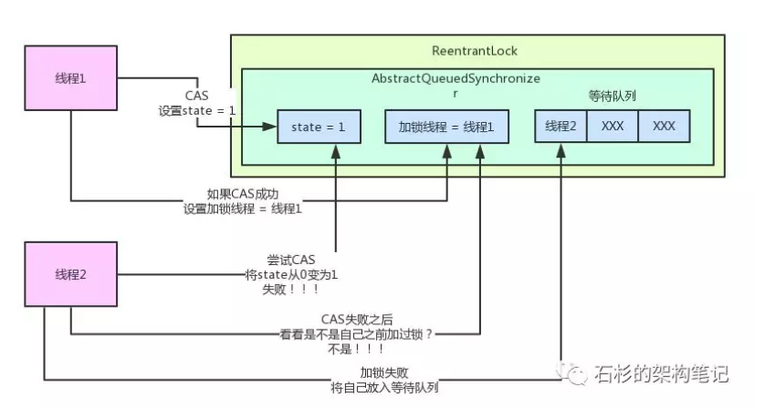
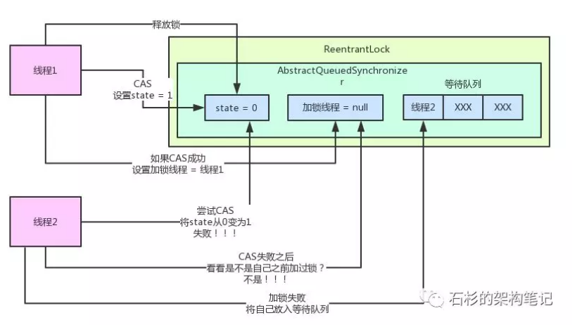
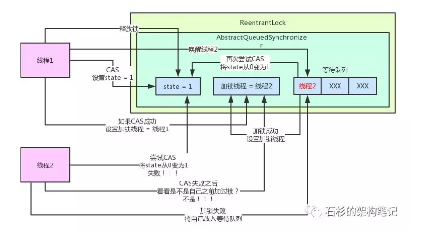

# AQS解析

## 1、ReentrantLock和AQS(AbstractQueuedSynchronizer，抽象队列同步器)的关系

首先我们来看看，如果用java并发包下的ReentrantLock来加锁和释放锁，是个什么样的感觉？
这个基本学过java的同学应该都会吧，毕竟这个是java并发基本API的使用，应该每个人都是学过的，所以我们直接看一下代码就好了：
```java
public class Test_ReentrantLock {
    private static ReentrantLock reentrantLock = new ReentrantLock();

    void method() {
        reentrantLock.lock();
        //业务逻辑处理
        reentrantLock.unlock();

    }
}
```

上面那段代码应该不难理解吧，无非就是搞一个Lock对象，然后加锁和释放锁。
你这时可能会问，这个跟AQS有啥关系？关系大了去了！因为java并发包下很多API都是基于AQS来实现的加锁和释放锁等功能的，AQS是java并发包的基础类。
举个例子，比如说ReentrantLock、ReentrantReadWriteLock底层都是基于AQS来实现的。
那么AQS的全称是什么呢？AbstractQueuedSynchronizer，抽象队列同步器。给大家画一个图先，看一下ReentrantLock和AQS之间的关系。

 

我们来看上面的图。说白了，ReentrantLock内部包含了一个AQS对象，也就是AbstractQueuedSynchronizer类型的对象。
这个AQS对象就是ReentrantLock可以实现加锁和释放锁的关键性的核心组件。

## 2、ReentrantLock加锁和释放锁的底层原理

好了，那么现在如果有一个线程过来尝试用ReentrantLock的lock()方法进行加锁，会发生什么事情呢？
很简单，这个AQS对象内部有一个核心的变量叫做state，是int类型的，代表了加锁的状态。初始状态下，这个state的值是0。
另外，这个AQS内部还有一个关键变量，用来记录当前加锁的是哪个线程，初始化状态下，这个变量是null。



接着线程1跑过来调用ReentrantLock的lock()方法尝试进行加锁，这个加锁的过程，直接就是用CAS操作将state值从0变为1。
如果之前没人加过锁，那么state的值肯定是0，此时线程1就可以加锁成功。
一旦线程1加锁成功了之后，就可以设置当前加锁线程是自己。所以大家看下面的图，就是线程1跑过来加锁的一个过程。



其实看到这儿，大家应该对所谓的AQS有感觉了。说白了，就是并发包里的一个核心组件，里面有state变量、加锁线程变量等核心的东西，维护了加锁状态。
你会发现，ReentrantLock这种东西只是一个外层的API，内核中的锁机制实现都是依赖AQS组件的。
这个ReentrantLock之所以用Reentrant打头，意思就是他是一个可重入锁。
可重入锁的意思，就是你可以对一个ReentrantLock对象多次执行lock()加锁和unlock()释放锁，也就是可以对一个锁加多次，叫做可重入加锁。
大家看明白了那个state变量之后，就知道了如何进行可重入加锁！
其实每次线程1可重入加锁一次，会判断一下当前加锁线程就是自己，那么他自己就可以可重入多次加锁，每次加锁就是把state的值给累加1，别的没啥变化。
接着，如果线程1加锁了之后，线程2跑过来加锁会怎么样呢？

我们来看看锁的互斥是如何实现的？线程2跑过来一下看到，哎呀！state的值不是0啊？所以CAS操作将state从0变为1的过程会失败，因为state的值当前为1，
说明已经有人加锁了！
接着线程2会看一下，是不是自己之前加的锁啊？当然不是了，“加锁线程”这个变量明确记录了是线程1占用了这个锁，所以线程2此时就是加锁失败。
给大家来一张图，一起来感受一下这个过程：



接着，线程2会将自己放入AQS中的一个等待队列，因为自己尝试加锁失败了，此时就要将自己放入队列中来等待，等待线程1释放锁之后，自己就可以重新尝试加锁了
所以大家可以看到，AQS是如此的核心！AQS内部还有一个等待队列，专门放那些加锁失败的线程！
同样，给大家来一张图，一起感受一下：



接着，线程1在执行完自己的业务逻辑代码之后，就会释放锁！他释放锁的过程非常的简单，就是将AQS内的state变量的值递减1，
如果state值为0，则彻底释放锁，会将“加锁线程”变量也设置为null！
整个过程，参见下图：



接下来，会从等待队列的队头唤醒线程2重新尝试加锁。
好！线程2现在就重新尝试加锁，这时还是用CAS操作将state从0变为1，此时就会成功，成功之后代表加锁成功，就会将state设置为1。
此外，还要把“加锁线程”设置为线程2自己，同时线程2自己就从等待队列中出队了。
最后再来一张图，大家来看看这个过程。



## 3、总结
其实一句话总结AQS就是一个并发包的基础组件，用来实现各种锁，各种同步组件的。它包含了state变量、加锁线程、等待队列等并发中的核心组件。

[参考：石杉的架构笔记]