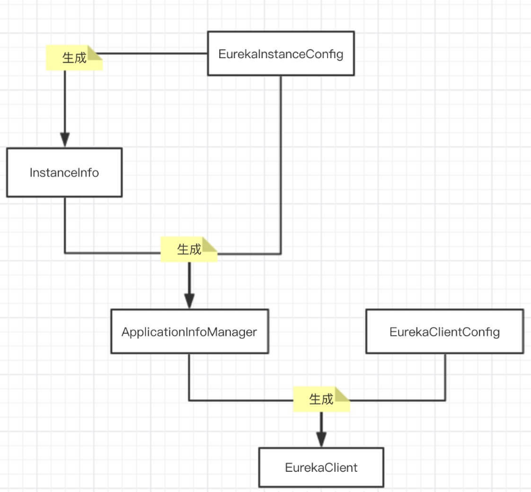
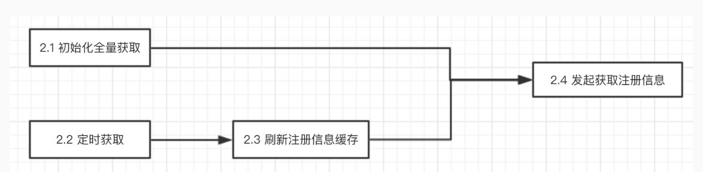

spring-cloud-netflix 中的下面两个子模块是对eureka的封装实现。

- [spring-cloud-netflix ](https://github.com/lishuai2016/spring-cloud-netflix)

- spring-cloud-netflix-eureka-client
- spring-cloud-netflix-eureka-server


> 项目结构


- eureka-client 模块为 Eureka-Client 的功能实现
    - com.netflix.appinfo 包：Eureka-Client 的应用配置
    - com.netflix.discovery 包：Eureka-Client 的注册与发现相关功能

- eureka-client-archaius2   Archaius 是 Netflix 开源的配置管理组件。

- eureka-client-jersey2 
    - Eureka-Server 使用 Jersey Server 创建 RESTful Server 。
    - Eureka-Client 使用 Jersey Client 请求 Eureka-Server 。

- eureka-core 模块为 Eureka-Server 的功能实现 
    - com.netflix.eureka.EurekaBootStrap 类：Eureka-Server 启动类。
    - com.netflix.eureka.aws 包：与亚马逊 AWS 服务相关的类。
    - com.netflix.eureka.cluster 包：Eureka-Server 集群数据复制相关的代码。
    - com.netflix.eureka.lease 包：应用注册后的租约管理( 注册 / 取消 / 续期 / 过期 )。
    - com.netflix.eureka.resousrces 包：资源，基于 Jersey Server 实现，相当于 Spring MVC 的控制层代码。
    - com.netflix.eureka.transport 包：Eureka-Server 对 Eureka-Server 的 RESTful HTTP 客户端，基于 com.netflix.discovery.shared.transport 封装实现。
    - com.netflix.eureka.util 包：工具类。

- eureka-core-jersey2 

- eureka-resources 模块，使用 JSP 实现 Eureka-Server 的运维后台界面

- eureka-server 模块，将 eureka-client + eureka-core + eureka-resources 三者打包成 Eureka-Server 的 war 包

- eureka-server-governator  Governator，一款对 Google Guice 进行扩展的类库，提供了Classpath扫描及自动绑定、生命周期管理、成员属性验证等功能。

- eureka-examples 模块，提供 Eureka-Client 使用例子

- eureka-test-utils 模块，提供 Eureka 单元测试工具类


> 依赖关系

core 依赖client
server依赖client和core


 >> Eureka-Client 初始化




- EurekaInstanceConfig，重在应用实例，例如，应用名、应用的端口等等。此处应用指的是，Application Consumer 和 Application Provider。

- EurekaClientConfig，重在 Eureka-Client，例如， 连接的 Eureka-Server 的地址、获取服务提供者列表的频率、注册自身为服务提供者的频率等等。


>> Eureka-Server 启动


EurekaServerConfig--->DefaultEurekaServerConfig

- EurekaBootStrap:初始化 Eureka-Server 配置环境和上下文
- Filter
    - StatusFilter
    - ServerRequestAuthFilter
    - RateLimitingFilter
    - GzipEncodingEnforcingFilter
    - ServletContainer


urekaBootStrap 实现了 javax.servlet.ServletContextListener 接口，在 Servlet 容器( 例如 Tomcat、Jetty )启动时，调用 #contextInitialized() 方法，初始化 Eureka-Server


应用实例信息的注册表类关系图如下


- LookupService
- LeaseManager
- InstanceRegistry
- AbstractInstanceRegistry
- PeerAwareInstanceRegistry
- PeerAwareInstanceRegistryImpl


- 在 Eureka-Client 里，EurekaClient 继承该接口。
- 在 Eureka-Server 里，com.netflix.eureka.registry.InstanceRegistry 继承该接口。


> 应用实例注册发现（一）之注册

Eureka-Client 向 Eureka-Server 发起注册应用实例需要符合如下条件：

- 配置 eureka.registration.enabled = true，Eureka-Client 向 Eureka-Server 发起注册应用实例的开关。
- InstanceInfo 在 Eureka-Client 和 Eureka-Server 数据不一致。
每次 InstanceInfo 发生属性变化时，标记 isInstanceInfoDirty 属性为 true，表示 InstanceInfo 在 Eureka-Client 和 Eureka-Server 数据不一致，需要注册。另外，InstanceInfo 刚被创建时，在 Eureka-Server 不存在，也会被注册。

当符合条件时，InstanceInfo 不会立即向 Eureka-Server 注册，而是后台线程定时注册。

当 InstanceInfo 的状态( status ) 属性发生变化时，并且配置 eureka.shouldOnDemandUpdateStatusChange = true 时，立即向 Eureka-Server 注册。因为状态属性非常重要，一般情况下建议开启，当然默认情况也是开启的。


- 蓝框部分，为本文重点。
- 非蓝框部分，Eureka-Server 集群间复制注册的应用实例信息

> 应用实例注册发现（二）之续租

Eureka-Client 向 Eureka-Server 发起注册应用实例成功后获得租约 ( Lease )。
Eureka-Client 固定间隔向 Eureka-Server 发起续租( renew )，避免租约过期。

默认情况下，租约有效期为 90 秒，续租频率为 30 秒。两者比例为 1 : 3 ，保证在网络异常等情况下，有三次重试的机会。

Eureka-Client 在初始化过程中，创建心跳线程，固定间隔向 Eureka-Server 发起续租( renew )。


心跳续租


> 应用实例注册发现（三）之下线


应用实例关闭时，Eureka-Client 向 Eureka-Server 发起下线应用实例。需要满足如下条件才可发起：

- 配置 eureka.registration.enabled = true ，应用实例开启注册开关。默认为 false 。

- 配置 eureka.shouldUnregisterOnShutdown = true ，应用实例开启关闭时下线开关。默认为 true 。


> 应用实例注册发现（四）之自我保护机制

当Eureka Server节点在短时间内丢失过多客户端时（可能发生了网络分区故障），那么这个节点就会进入自我保护模式。一旦进入该模式，Eureka Server就会保护服务注册表中的信息，不再删除服务注册表中的数据（也就是不会注销任何微服务）。当网络故障恢复后，该Eureka Server节点会自动退出自我保护模式。


> 应用实例注册发现（五）之过期


为什么需要过期

正常情况下，应用实例下线时候会主动向 Eureka-Server 发起下线请求。但实际情况下，应用实例可能异常崩溃，又或者是网络异常等原因，导致下线请求无法被成功提交。

介于这种情况，通过 Eureka-Client 心跳延长租约，配合 Eureka-Server 清理超时的租约解决上述异常。


> 应用实例注册发现（六）之全量获取





Applications 与 InstanceInfo 类关系如下：


配置 eureka.shouldFetchRegistry = true，开启从 Eureka-Server 获取注册信息。默认值：true 。


com.netflix.eureka.registry.ResponseCacheImpl，响应缓存实现类。

在 ResponseCacheImpl 里，将缓存拆分成两层 ：

- 只读缓存( readOnlyCacheMap )
- 固定过期 + 固定大小的读写缓存( readWriteCacheMap )

默认配置下，缓存读取策略如下：


缓存过期策略如下：

- 应用实例注册、下线、过期时，只只只过期 readWriteCacheMap 。
- readWriteCacheMap 写入一段时间( 可配置 )后自动过期。
- 定时任务对比 readWriteCacheMap 和 readOnlyCacheMap 的缓存值，若不一致，以前者为主。通过这样的方式，实现了 readOnlyCacheMap 的定时过期。

注意：应用实例注册、下线、过期时，不会很快刷新到 readWriteCacheMap 缓存里。默认配置下，最大延迟在 30 秒。

为什么可以使用缓存？

在 CAP 的选择上，Eureka 选择了 AP ，不同于 Zookeeper 选择了 CP 。


> 应用实例注册发现（七）之增量获取


Applications.appsHashCode ，应用集合一致性哈希码。

增量获取注册的应用集合( Applications ) 时，Eureka-Client 会获取到：

- Eureka-Server 近期变化( 注册、下线 )的应用集合[增量]
- Eureka-Server 应用集合一致性哈希码

Eureka-Client 将变化的应用集合和本地缓存的应用集合进行合并后进行计算本地的应用集合一致性哈希码。若两个哈希码相等，意味着增量获取成功；若不相等，意味着增量获取失败，Eureka-Client 重新和 Eureka-Server 全量获取应用集合。

Eureka 比较应用集合一致性哈希码，和日常我们通过哈希码比较两个对象是否相等类似。


> 应用实例注册发现（八）之覆盖状态

这里要注意下，不是应用实例的状态( status )，而是覆盖状态( overridestatus

调用 Eureka-Server HTTP Restful 接口 apps/${APP_NAME}/${INSTANCE_ID}/status 对应用实例覆盖状态的变更，从而达到主动的、强制的变更应用实例状态。注意，实际不会真的修改 Eureka-Client 应用实例的状态，而是修改在 Eureka-Server 注册的应用实例的状态。

通过这样的方式，Eureka-Client 在获取到注册信息时，并且配置 eureka.shouldFilterOnlyUpInstances = true，过滤掉非 InstanceStatus.UP 的应用实例，从而避免调动该实例，以达到应用实例的暂停服务( InstanceStatus.OUT_OF_SERVICE )，而无需关闭应用实例。

接口 apps/${APP_NAME}/${INSTANCE_ID}/status 实际是两个：

- PUT apps/${APP_NAME}/${INSTANCE_ID}/status
- DELETE apps/${APP_NAME}/${INSTANCE_ID}/status


> 应用实例注册发现 （九）之岁月是把萌萌的读写锁

com.netflix.eureka.registry.AbstractInstanceRegistry

```java
public abstract class AbstractInstanceRegistry implements InstanceRegistry {

    private final ReentrantReadWriteLock readWriteLock = new ReentrantReadWriteLock();
    private final Lock read = readWriteLock.readLock();
    private final Lock write = readWriteLock.writeLock();

    // ... 省略其他代码

}
```


我们来回想下，在 Eureka 应用集合一致性哈希码的公式：appsHashCode = ${status}_${count}_ 


我们把目光移向唯一使用写锁的 #getApplicationDeltasFromMultipleRegions(...) 方法，该方法执行过程中，需要保证 recentlyChangedQueue 和 registry 共享变量的应用实例的状态一致，不然返回的增量应用实例集合的状态是不准确的。此时能够达到该效果，必须让 #getApplicationDeltasFromMultipleRegions(...) 和前六个方法互斥。方案如下：

- a. 全部 synchronized
- b. #getApplicationDeltasFromMultipleRegions(...) 使用读锁，前六个方法使用写锁
- c. #getApplicationDeltasFromMultipleRegions(...) 使用写锁，前六个方法使用读锁

Eureka 选择了方案c，原因如下：

- a. 性能太差
- b. 前六个方法使用写锁，势必冲突太大，虽然读肯定比写多。
- c. #getApplicationDeltasFromMultipleRegions(...) 使用写锁，配合 ResponseCache ，即减少了写锁使用的频率，每次缓存过期才使用，又避免了前六个方法因为方案b中的写锁导致互斥。


再解释 D

getApplicationsFromMultipleRegions(...) 方法的逻辑，只依赖 registry 共享变量，不存在应用实例的状态一致的困扰，所以不使用锁。

最后解释 B

renew(...) 方法的逻辑，虽然会影响应用实例的状态，但是是极小概率，考虑到它调用的比较频繁，比起因为锁给这个方法带来的性能降低，不如返回的结果暂时不够准确。


> 源码

>> 客户端

- 注册入口：com.netflix.discovery.DiscoveryClient#register
    - com.netflix.discovery.shared.transport.jersey.AbstractJerseyEurekaHttpClient#register 对应的发起http请求到server

- 续约入口：com.netflix.discovery.DiscoveryClient#renew
    - com.netflix.discovery.shared.transport.jersey.AbstractJerseyEurekaHttpClient#sendHeartBeat 对应的发起http请求到server

- 下线入口: com.netflix.discovery.DiscoveryClient#shutdown,内部调用com.netflix.discovery.DiscoveryClient#unregister
    - com.netflix.discovery.shared.transport.jersey.AbstractJerseyEurekaHttpClient#cancel 对应的发起http请求到server


- 全量获取注册信息：com.netflix.discovery.DiscoveryClient#getAndStoreFullRegistry
    - com.netflix.discovery.shared.transport.jersey.AbstractJerseyEurekaHttpClient#getApplications 对应的发起http请求到server

- 增量获取注册信息：com.netflix.discovery.DiscoveryClient#getAndUpdateDelta
    - com.netflix.discovery.shared.transport.jersey.AbstractJerseyEurekaHttpClient#getDelta 对应的发起http请求到server


>> 服务端

- 注册实例：com.netflix.eureka.resources.ApplicationResource#addInstance

- 续约：com.netflix.eureka.resources.InstanceResource#renewLease

- 下线：com.netflix.eureka.resources.InstanceResource#cancelLease


- 接收全量获取请求：com.netflix.eureka.resources.ApplicationsResource#getContainers


> StringCache

- [深入解析String#intern](https://tech.meituan.com/2014/03/06/in-depth-understanding-string-intern.html)


在 JAVA 语言中有8中基本类型和一种比较特殊的类型 String。这些类型为了使他们在运行过程中速度更快，更节省内存，都提供了一种常量池的概念。常量池就类似一个 JAVA 系统级别提供的缓存。
8 种基本类型的常量池都是系统协调的，String 类型的常量池比较特殊。它的主要使用方法有两种：

    - 直接使用双引号声明出来的 String 对象会直接存储在常量池中
    - 如果不是用双引号声明的 String 对象，可以使用String提供的 intern 方法。intern 方法会从字符串常量池中查询当前字符串是否存在，若不存在就会将当前字符串放入常量池中


- 字符串常量池能带来速度更快，更节省内存的好处
- 非双引号声明的 String 对象，需要使用 String#intern() 方法，将字符串存储到字符串常量池。

看起来一切都非常非常非常美好，那为什么 Eureka 自己实现了 StringCache ？


AVA 使用 JNI 调用 c++ 实现的 StringTable 的 intern 方法, StringTable的 intern 方法跟 Java 中的 HashMap 的实现是差不多的, 只是不能自动扩容。默认大小是1009。

要注意的是，String 的 String Pool 是一个固定大小的 Hashtable，默认值大小长度是 1009，如果放进 String Pool 的 String 非常多，就会造成Hash冲突严重，从而导致链表会很长，而链表长了后直接会造成的影响就是当调用String.intern时性能会大幅下降（因为要一个一个找）。

在 JDK6 中 StringTable 是固定的，就是 1009 的长度，所以如果常量池中的字符串过多就会导致效率下降很快。在jdk7中，StringTable的长度可以通过一个参数指定：

-XX:StringTableSize=99991
JDK 自带的 String Pool 固定大小( 即使可配 )，不支持自动扩容，大量使用 String#intern(...) 后，会导致性能大幅度下降。
Eureka 的应用实例( InstanceInfo ) 的 appName、appGroupName、vipAddress、secureVipAddress、metadata 和应用( Application )的 name 等属性需要使用到 String Pool ，为了在大量的网络通信序列化反序列的过程中，速度更快，更节省内容。


> 主要内容

- Eureka-Client 初始化（一）之 EurekaInstanceConfig
- Eureka-Client 初始化（二）之 EurekaClientConfig
- Eureka-Client 初始化（三）之 EurekaClient
- Eureka-Server 启动（一）之 ServerConfig
- Eureka-Server 启动（二）之 EurekaBootStrap
- 注册表 InstanceRegistry 类关系
- 应用实例注册发现（一）之注册
- 应用实例注册发现（二）之续租
- 应用实例注册发现（三）之下线
- 应用实例注册发现（四）之自我保护机制
- 应用实例注册发现（五）之过期
- 应用实例注册发现（六）之全量获取
- 应用实例注册发现（七）之增量获取
- 应用实例注册发现（八）之覆盖状态
- 应用实例注册发现 （九）之岁月是把萌萌的读写锁
- 任务批处理
-  EndPoint 与 解析器
- 网络通信
- Eureka-Server 集群同步
- 基于令牌桶算法的 RateLimiter
- StringCache