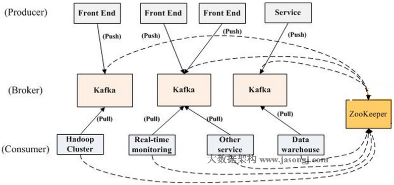
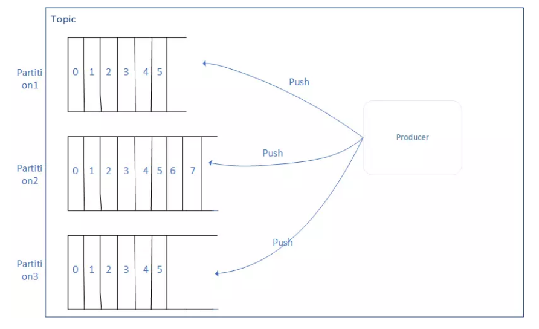
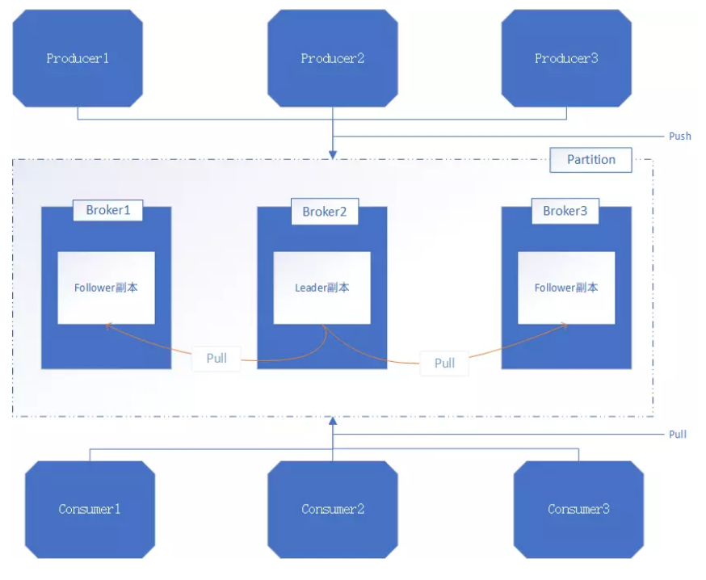
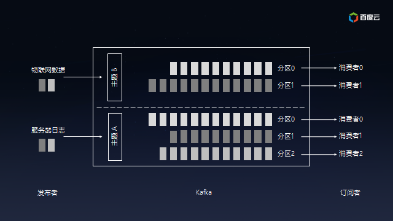
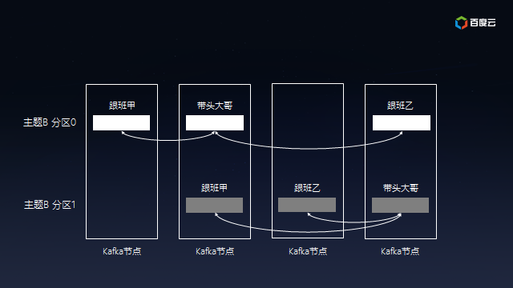

<!-- TOC -->

- [1、kafka简介](#1kafka简介)
- [2、核心技术点](#2核心技术点)
    - [1、基础结构](#1基础结构)
    - [2、Producer写](#2producer写)
    - [3、consumer读](#3consumer读)
    - [4、delivery guarantee 消息投放确认，不丢不重复](#4delivery-guarantee-消息投放确认不丢不重复)
- [3、特点](#3特点)
- [4、Kafka拓扑结构](#4kafka拓扑结构)
- [5、基本概念](#5基本概念)
    - [1、Broker](#1broker)
    - [2、消息](#2消息)
    - [3、Topic](#3topic)
    - [4、分区(partition)](#4分区partition)
    - [5、Log](#5log)
    - [6、副本](#6副本)
    - [7、生产者](#7生产者)
    - [8、消费者](#8消费者)
    - [9、ISR集合](#9isr集合)
    - [10、kafka的topic和分区](#10kafka的topic和分区)

<!-- /TOC -->

# 1、kafka简介

主要设计目标如下：

- 以时间复杂度为O(1)的方式提供消息[数据持久化]能力，即使对TB级以上数据也能保证常数时间复杂度的访问性能

- 高吞吐率。即使在非常廉价的商用机器上也能做到单机支持每秒100K条以上消息的传输

- 支持Kafka Server间的消息分区，及分布式消费，同时保证每个Partition内的消息顺序传输

- 同时支持离线数据处理和实时数据处理

- Scale out：支持在线水平扩展

# 2、核心技术点

## 1、基础结构

- 一个topic可以设置多个partition，并发读写，提高吞吐量，一个partition对应物理文件夹（包括数据文件和索引文件），一个partition只会存在一个broker物理机上[所以一般partition的数量多于broker的数量]；

- Kafka提供两种策略删除旧数据。一是基于时间，二是基于Partition文件大小。可以通过配置设置，和consumer消费与否没关；

- kafka把消息存到磁盘上，保证可靠；

## 2、Producer写

- kafka每条消息都被append到Partition中，属于顺序写磁盘，因此效率非常高（经验证，顺序写磁盘效率比随机写内存还要高，这是Kafka高吞吐率的一个很重要的保证）；

- Producer消息路由，Producer发送消息到broker时，会根据Paritition机制选择将其存储到哪一个Partition。如果Partition机制设置合理，所有消息可以均匀分布到不同的Partition里，这样就实现了负载均衡。如果一个Topic对应一个文件，那这个文件所在的机器I/O将会成为这个Topic的性能瓶颈，而有了Partition后，不同的消息可以并行写入不同broker的不同Partition里，极大的提高了吞吐率。在发送一条消息时，可以指定这条消息的key，Producer根据这个key和Partition机制来判断应该将这条消息发送到哪个Parition。

## 3、consumer读

- Kafka读取特定消息的时间复杂度为O(1)，即与文件大小无关，所以这里删除过期文件与提高Kafka性能无关。选择怎样的删除策略只与磁盘以及具体的需求有关；

- 这是Kafka用来实现一个Topic消息的广播（发给所有的Consumer）和单播（发给某一个Consumer）的手段。一个Topic可以对应多个Consumer Group。如果需要实现广播，只要每个Consumer有一个独立的Group就可以了。要实现单播只要所有的Consumer在同一个Group里；用Consumer Group还可以将Consumer进行自由的分组而不需要多次发送消息到不同的Topic；

- consumer通过pull来拉数据，自己来控制消费的速率；

## 4、delivery guarantee 消息投放确认，不丢不重复

这么几种可能的delivery guarantee：

At most once 消息可能会丢，但绝不会重复传输

At least one 消息绝不会丢，但可能会重复传输

Exactly once 每条消息肯定会被传输一次且仅传输一次，很多时候这是用户所想要的。

- Kafka默认保证At least once，并且允许通过设置Producer异步提交来实现At most once。而Exactly once要求与外部存储系统协作，幸运的是Kafka提供的offset可以非常直接非常容易得使用这种方式。

# 3、特点

Kafka是一个[分布式的]、[可分区的]、[可复制的]、[基于发布/订阅的消息系统],Kafka主要用于大数据领域,当然在分布式系统中也有应用。目前市面上流行的消息队列RocketMQ就是阿里借鉴Kafka的原理、用Java开发而得.Kafka适合离线和在线的消息消费,其消息保存在磁盘上。Kafka以Topic为单位进行消息的归纳,Producers向Topic发送(Push)消息,Consumers会消费(Pull)预订了Topic的消息。

备注：所有的消息都是落到磁盘文件的方式，消息被删除的时机不是被消费掉，Kafka提供两种策略删除旧数据。一是基于时间，二是基于Partition文件大小。

# 4、Kafka拓扑结构

如上图所示，一个典型的Kafka集群中包含若干Producer（可以是web前端产生的Page View，或者是服务器日志，系统CPU、Memory等），若干broker（Kafka支持水平扩展，一般broker数量越多，集群吞吐率越高），若干Consumer Group，以及一个Zookeeper集群。Kafka通过Zookeeper管理集群配置，选举leader，以及在Consumer Group发生变化时进行rebalance。Producer使用push模式将消息发布到broker，Consumer使用pull模式从broker订阅并消费消息。 

# 5、基本概念

## 1、Broker

一个单独的Kafka server就是一个Broker,Broker的主要工作就是接收生产者发送来的消息,分配offset,然后将包装过的数据保存到磁盘上;此外,Broker还会接收消费者和其他Broker的请求,根据请求的类型进行相应的处理然后返回响应。多个Broker可以做成一个Cluster(集群)对外提供服务,每个Cluster当中会选出一个Broker来担任Controller,Controller是Kafka集群的指挥中心,其他的Broker则听从Controller指挥实现相应的功能。Controller负责管理分区的状态、管理每个分区的副本状态、监听zookeeper中数据的变化等。Controller也是一主多从的实现,所有的Broker都会监听Controller Leader的状态,当Leader Controller出现了故障的时候就重新选举新的Controller Leader。

## 2、消息

消息是Kafka中最基本的消息单元。消息由一串字节组成,其中主要由key和value构成,key和value都是字节数组。key的主要作用是根据一定的策略,将这个消息路由到指定的分区中,这样就可以保证包含同一个key的消息全部写入同一个分区

## 3、Topic

Topic是用于存储消息的逻辑概念,Topic可以看做是一个消息的集合。每个Topic可以有多个生产者向其中push消息,也可以有多个消费者向其中pull消息。

## 4、分区(partition)

每一个Topic都可以划分成多个分区(每一个Topic都至少有一个分区),不同的分区会分配在不同的Broker上以对Kafka进行水平扩展从而增加Kafka的并行处理能力。同一个Topic下的不同分区包含的消息是不同的。每一个消息在被添加到分区的时候,都会被分配一个offset,他是消息在此分区中的唯一编号,此外,Kafka通过offset保证消息在分区中的顺序,offset的顺序性不跨分区,也就是说在Kafka的同一个分区中的消息是有序的,不同分区的消息可能不是有序的。

## 5、Log

分区在逻辑上对应着一个Log,当生产者将消息写入分区的时候,实际上就是写入到了一个Log中。Log是一个逻辑概念,对应的是一个磁盘上的文件夹。Log由多个Segment组成,每一个Segment又对应着一个日志文件和一个索引文件。

## 6、副本

Kafka对消息进行了冗余备份,每一个分区都可以有多个副本,每一个副本中包含的消息是相同的(但不保证同一时刻下完全相同)。副本的类型分为Leader和Follower,当分区只有一个副本的时候,该副本属于Leader,没有Follower。Kafka的副本具有一定的同步机制,在每个副本集合中,都会选举出一个副本作为Leader副本,Kafka在不同的场景中会采用不同的选举策略。Kafka中所有的读写请求都由选举出的Leader副本处理,其他的都作为Follower副本,Follower副本仅仅是从Leader副本中把数据拉取到本地之后,同步更新到自己的Log中。

## 7、生产者

生产者主要是生产消息,并将消息按照一定的规则推送到Topic的分区中

## 8、消费者

消费者主要是从Topic中拉取消息,并对消息进行消费。Consumer维护消费者消费Partition的哪一个位置(offset的值)这一信息。在Kafka中,多个Consumer可以组成一个Consumer Group,一个Consumer只能属于一个Consumer Group。Consumer Group保证其订阅的Topic中每一个分区只被分配给此Consumer Group中的一个消费者处理,所以如果需要实现消息的广播消费,则将消费者放在多个不同的Consumer Group中即可实现。通过向Consumer Group中动态的添加适量的Consumer,可以出发Kafka的Rebalance操作重新分配分区与消费者的对应关系,从而实现了水平扩展的能力。

## 9、ISR集合

ISR集合表示的是目前可用(alive)且消息量与Leader相差不多的副本集合,即整个副本集合的子集。ISR集合中副本所在的节点都与ZK保持着连接,此外,副本的最后一条消息的offset与Leader副本的最后一条消息的offset之间的差值不能超出指定的阈值。每一个分区的Leader副本都维护此分区的ISR集合。如上面所述,Leader副本进行了消息的写请求,Follower副本会从Leader上拉取写入的消息,第二个过程中会存在Follower副本中的消息数量少于Leader副本的状态,只要差值少于指定的阈值,那么此时的副本集合就是ISR集合。

## 10、kafka的topic和分区

本质上Kafka是分布式的流数据平台，因为以下特性而著名：

- 提供Pub/Sub方式的海量消息处理。

- 以高容错的方式存储海量数据流。

- 保证数据流的顺序。

Kafka提供的Pub/Sub就是典型的异步消息交换，用户可以为服务器日志或者物联网设备创建不同主题（Topic），后端数据仓库、流式分析或者全文检索等对接特定主题，服务器或者物联网设备是无需关心的。同时，Kafka可以将主题划分为多个分区（Partition），会根据分区规则选择把消息存储到哪个分区中，只要如果分区规则设置的合理，那么所有的消息将会被均匀的分布到不同的分区中，这样就实现了负载均衡和水平扩展。另外，多个订阅者可以从一个或者多个分区中同时消费数据，以支撑海量数据处理能力：

Kafka的设计也是源自生活，好比是为公路运输，不同的起始点和目的地需要修不同高速公路（主题），高速公路上可以提供多条车道（分区），流量大的公路多修几条车道保证畅通，流量小的公路少修几条车道避免浪费。收费站好比消费者，车多的时候多开几个一起收费避免堵在路上，车少的时候开几个让汽车并道就好了，嗯……。顺便说一句，由于消息是以追加到分区中的，多个分区顺序写磁盘的总效率要比随机写内存还要高（引用Apache Kafka – A High Throughput Distributed Messaging System的观点），是Kafka高吞吐率的重要保证之一。为了保证数据的可靠性，Kafka会给每个分区找一个节点当带头大哥（Leader），以及若干个节点当随从（Follower）。消息写入分区时，带头大哥除了自己复制一份外还会复制到多个随从。如果随从挂了，Kafka会再找一个随从从带头大哥那里同步历史消息；如果带头大哥挂了，随从中会选举出新一任的带头大哥，继续笑傲江湖。

最后，每个发布者发送到Kafka分区中的消息是确保顺序的，订阅者可以依赖这个承诺进行后续处理。

[资料]
- http://www.jasongj.com/2015/03/10/KafkaColumn1/
- http://www.jasongj.com/categories/index.html
- https://blog.csdn.net/YChenFeng/article/details/74980531
- https://zhuanlan.zhihu.com/habren-kafka
- https://zhuanlan.zhihu.com/c_1036270698523828224
- https://juejin.im/entry/59b3c1595188257e6e260252
- https://juejin.im/post/5b20e2e16fb9a01e2c698c51
- http://jm.taobao.org/2018/06/13/%E6%97%A5%E5%BF%97%E9%87%87%E9%9B%86%E4%B8%AD%E7%9A%84%E5%85%B3%E9%94%AE%E6%8A%80%E6%9C%AF%E5%88%86%E6%9E%90/
