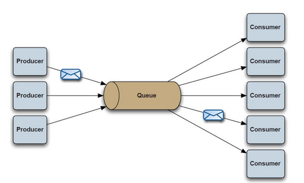
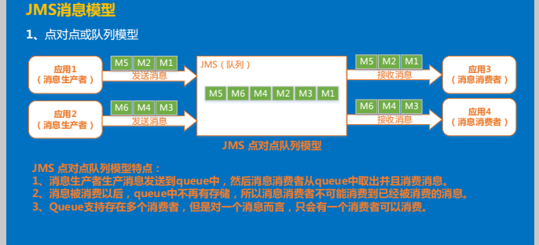
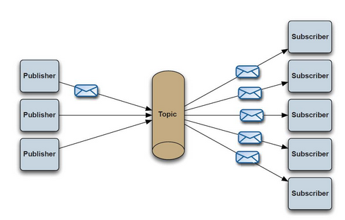
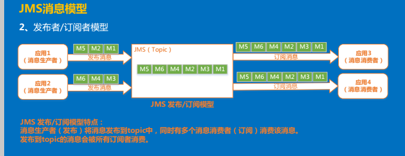

<!-- TOC -->

- [1、消息队列的作用](#1消息队列的作用)
- [2、分布式消息队列两种模式](#2分布式消息队列两种模式)
- [3、消息队列技术列表](#3消息队列技术列表)
    - [3.1、RabbitMQ](#31rabbitmq)
    - [3.2、Redis](#32redis)
    - [3.3、ZeroMQ](#33zeromq)
    - [3.4、ActiveMQ](#34activemq)
    - [3.5、Kafka/Jafka](#35kafkajafka)

<!-- /TOC -->

# 1、消息队列的作用
消息队列在实际应用中常用的四个使用场景：

- 异步处理(注册)，
- 应用解耦（订单），
- 流量削锋（秒杀）和消息通讯、
- 日志收集

# 2、分布式消息队列两种模式
- 点对点模式：Queue队列，仅有一个订阅者会收到消息，消息一旦被处理就不会存在队列中
- 发布订阅模式：Topic主题 ，放入一个消息，所有订阅者都会收到，这个是主题目的地是一对多的

# 3、消息队列技术列表
- Active MQ
- Rabbit MQ
- Zero MQ
- kafka
- RocketMQ

## 3.1、RabbitMQ
　　RabbitMQ是使用Erlang编写的一个开源的消息队列，本身支持很多的协议：AMQP，XMPP, SMTP, STOMP，也正因如此，
它非常重量级，更适合于企业级的开发。同时实现了Broker构架，这意味着消息在发送给客户端时先在中心队列排队。
对路由，负载均衡或者数据持久化都有很好的支持。

## 3.2、Redis
　　Redis是一个基于Key-Value对的NoSQL数据库，开发维护很活跃。虽然它是一个Key-Value数据库存储系统，
但它本身支持MQ功能，所以完全可以当做一个轻量级的队列服务来使用。对于RabbitMQ和Redis的入队和出队操作，各执行100万次，
每10万次记录一次执行时间。测试数据分为128Bytes、512Bytes、1K和10K四个不同大小的数据。实验表明：入队时，
当数据比较小时Redis的性能要高于RabbitMQ，而如果数据大小超过了10K，Redis则慢的无法忍受；出队时，无论数据大小，
Redis都表现出非常好的性能，而RabbitMQ的出队性能则远低于Redis。

## 3.3、ZeroMQ
　　ZeroMQ号称最快的消息队列系统，尤其针对大吞吐量的需求场景。ZMQ能够实现RabbitMQ不擅长的高级/复杂的队列，
但是开发人员需要自己组合多种技术框架，技术上的复杂度是对这MQ能够应用成功的挑战。ZeroMQ具有一个独特的非中间件的模式，
你不需要安装和运行一个消息服务器或中间件，因为你的应用程序将扮演这个服务器角色。你只需要简单的引用ZeroMQ程序库，
可以使用NuGet安装，然后你就可以愉快的在应用程序之间发送消息了。但是ZeroMQ仅提供非持久性的队列，也就是说如果宕机，
数据将会丢失。其中，Twitter的Storm 0.9.0以前的版本中默认使用ZeroMQ作为数据流的传输
（Storm从0.9版本开始同时支持ZeroMQ和Netty作为传输模块）。

## 3.4、ActiveMQ
　　ActiveMQ是Apache下的一个子项目。 类似于ZeroMQ，它能够以代理人和点对点的技术实现队列。同时类似于RabbitMQ，
它少量代码就可以高效地实现高级应用场景。

## 3.5、Kafka/Jafka
　　Kafka是Apache下的一个子项目，是一个高性能跨语言分布式发布/订阅消息队列系统，而Jafka是在Kafka之上孵化而来的，
即Kafka的一个升级版。具有以下特性：快速持久化，可以在O(1)的系统开销下进行消息持久化；
高吞吐，在一台普通的服务器上既可以达到10W/s的吞吐速率；完全的分布式系统，Broker、Producer、Consumer都原生自动支持分布式，
自动实现负载均衡；支持Hadoop数据并行加载，对于像Hadoop的一样的日志数据和离线分析系统，但又要求实时处理的限制，
这是一个可行的解决方案。Kafka通过Hadoop的并行加载机制统一了在线和离线的消息处理。
Apache Kafka相对于ActiveMQ是一个非常轻量级的消息系统，除了性能非常好之外，还是一个工作良好的分布式系统。