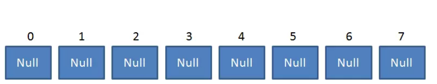
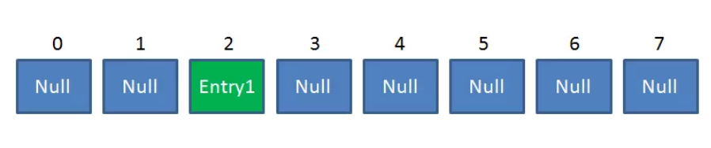
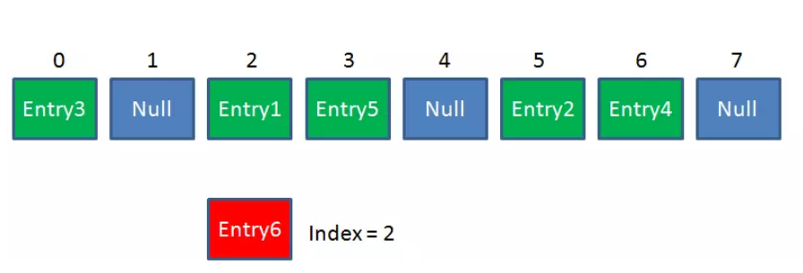
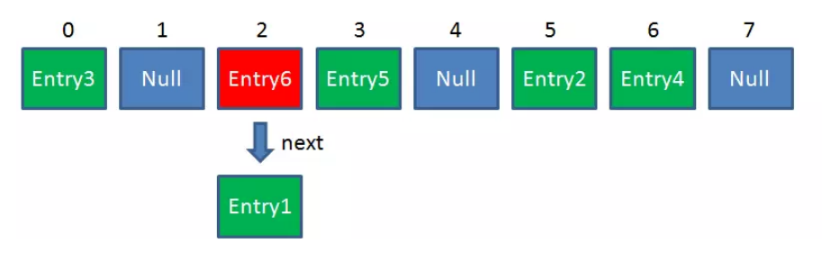
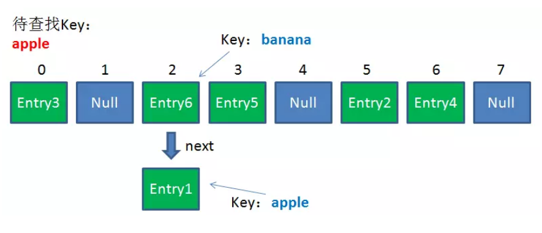
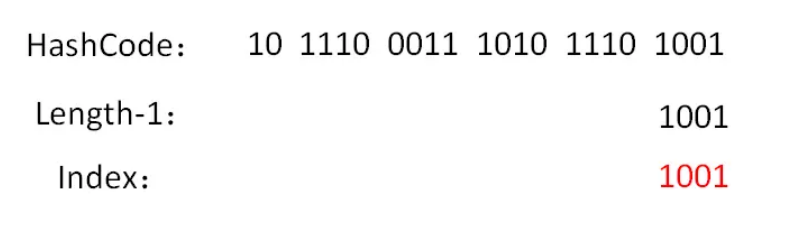
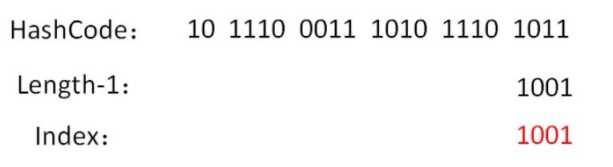
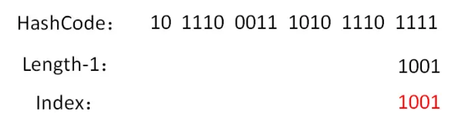

#参考
[漫画：什么是HashMap？](https://juejin.im/post/5a215783f265da431d3c7bba)
[漫画：高并发下的HashMap](https://mp.weixin.qq.com/s/dzNq50zBQ4iDrOAhM4a70A)

# 总结
1、相同的对象其hash值一定相同，不同的对象其hash值可能相同，相同的话就采用链表采用头插法解决冲突；

# 什么是HashMap？

众所周知，HashMap是一个用于存储Key-Value键值对的集合，每一个键值对也叫做Entry。这些个键值对（Entry）分散存储在一个数组当中，这个数组就是HashMap的主干。
HashMap数组每一个元素的初始值都是Null。

对于HashMap，我们最常使用的是两个方法：Get 和 Put。

# 1.Put方法的原理

调用Put方法的时候发生了什么呢？比如调用 hashMap.put("apple", 0) ，插入一个Key为“apple"的元素。
这时候我们需要利用一个哈希函数来确定Entry的插入位置（index）：index =  Hash（“apple”）
假定最后计算出的index是2，那么结果如下：

但是，因为HashMap的长度是有限的，当插入的Entry越来越多时，再完美的Hash函数也难免会出现index冲突的情况。比如下面这样：

这时候该怎么办呢？我们可以利用链表来解决。HashMap数组的每一个元素不止是一个Entry对象，也是一个链表的头节点。
每一个Entry对象通过Next指针指向它的下一个Entry节点。当新来的Entry映射到冲突的数组位置时，只需要插入到对应的链表即可：

需要注意的是，新来的Entry节点插入链表时，使用的是“头插法”。至于为什么不插入链表尾部，后面会有解释。

# 2.Get方法的原理使用

Get方法根据Key来查找Value的时候，发生了什么呢？首先会把输入的Key做一次Hash映射，得到对应的index：index =  Hash（“apple”）

由于刚才所说的Hash冲突，同一个位置有可能匹配到多个Entry，这时候就需要顺着对应链表的头节点，一个一个向下来查找。
假设我们要查找的Key是“apple”：
第一步，我们查看的是头节点Entry6，Entry6的Key是banana，显然不是我们要找的结果。
第二步，我们查看的是Next节点Entry1，Entry1的Key是apple，正是我们要找的结果。
之所以把Entry6放在头节点，是因为HashMap的发明者认为，后插入的Entry被查找的可能性更大。

# 3、hashmap的默认初始长度是多少？为什么这么规定？
hashmap的默认初始长度为16，并且每次自动扩展或者是手动初始化时，长度必须是2的幂。

之所以会选择16，是为了服务于从KEY映射到index的hash算法。

之前说过，从Key映射到HashMap数组的对应位置，会用到一个Hash函数：index =  Hash（“apple”）

如何实现一个尽量均匀分布的Hash函数呢？我们通过利用Key的HashCode值来做某种运算。

index =  HashCode（Key） % Length ? 
错，这种方式固然简单，但是效率比较低。为了实现高效的hash算法，hashmap的发明者使用了位运算的方式

如何进行位运算呢？有如下的公式（Length是HashMap的长度）：index =  HashCode（Key） &  （Length - 1） 

下面我们以值为“book”的Key来演示整个过程：
1.计算book的hashcode，结果为十进制的3029737，二进制的101110001110101110 1001。
2.假定HashMap长度是默认的16，计算Length-1的结果为十进制的15，二进制的1111。
3.把以上两个结果做与运算，101110001110101110 1001 & 1111 = 1001，十进制是9，所以 index=9。

可以说，Hash算法最终得到的index结果，完全取决于Key的Hashcode值的最后几位。

至于为什么是16，我们假设是10实时，看会出现什么问题？

假设HashMap的长度是10，重复刚才的运算步骤：

单独看这个结果，表面上并没有问题。我们再来尝试一个新的HashCode  101110001110101110 1011 ：

让我们再换一个HashCode 101110001110101110 1111 试试  

是的，虽然HashCode的倒数第二第三位从0变成了1，但是运算的结果都是1001。也就是说，当HashMap长度为10的时候，
有些index结果的出现几率会更大，而有些index结果永远不会出现（比如0111）！这样，显然不符合Hash算法均匀分布的原则。
反观长度16或者其他2的幂，Length-1的值是所有二进制位全为1，这种情况下，index的结果等同于HashCode后几位的值。
只要输入的HashCode本身分布均匀，Hash算法的结果就是均匀的。

# 4、高并发下hashmap为什么会出现死锁？
总结：
1.Hashmap在插入元素过多的时候需要进行Resize，Resize的条件是: HashMap.Size   >=  Capacity * LoadFactor。
2.Hashmap的Resize包含扩容和ReHash两个步骤，ReHash在并发的情况下可能会形成链表环。

# 5、在java8中，hashmap的结构有什么样的变化？

