[漫画：什么是 CAS 机制？](https://mp.weixin.qq.com/s/f9PYMnpAgS1gAQYPDuCq-w)
[漫画：什么是CAS机制？（进阶篇）](https://mp.weixin.qq.com/s/nRnQKhiSUrDKu3mz3vItWg)

# 总结
1. Java语言CAS底层如何实现？
利用unsafe提供了原子性操作方法。

2. 什么是ABA问题？怎么解决？
当一个值从A更新成B，又更新会A，普通CAS机制会误判通过检测。
利用版本号比较可以有效解决ABA问题。

# 提出问题
示例程序：启动两个线程，每个线程中让静态变量count循环累加100次。
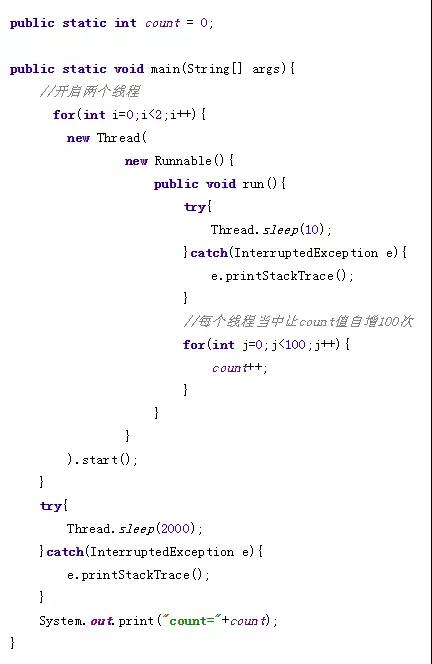

最终输出的count结果是什么呢？一定会是200吗？
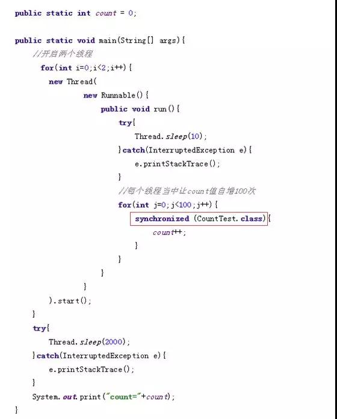

加了同步锁之后，count自增的操作变成了原子性操作，所以最终的输出一定是count=200，代码实现了线程安全。

为什么这么说呢？关键在于性能问题。

Synchronized关键字会让没有得到锁资源的线程进入BLOCKED状态，而后在争夺到锁资源后恢复为RUNNABLE状态，
这个过程中涉及到操作系统用户模式和内核模式的转换，代价比较高。

尽管Java1.6为Synchronized做了优化，增加了从偏向锁到轻量级锁再到重量级锁的过度，
但是在最终转变为重量级锁之后，性能仍然较低。

# 原子操作类
所谓原子操作类，指的是java.util.concurrent.atomic包下，一系列以Atomic开头的包装类。
例如AtomicBoolean，AtomicInteger，AtomicLong。它们分别用于Boolean，Integer，Long类型的原子性操作。

现在我们尝试在代码中引入AtomicInteger类：
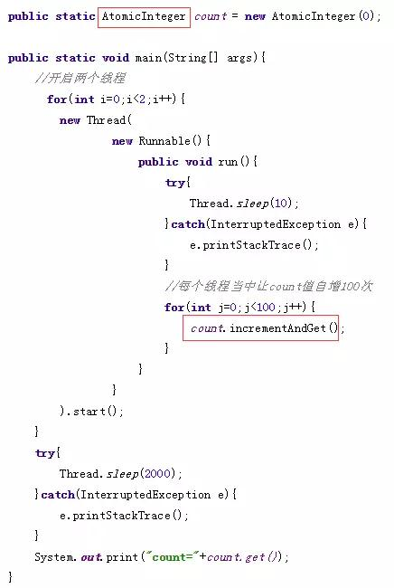

使用AtomicInteger之后，最终的输出结果同样可以保证是200。并且在某些情况下，代码的性能会比Synchronized更好。


# 什么是CAS？

CAS是英文单词Compare And Swap的缩写，翻译过来就是比较并替换。

CAS机制当中使用了3个基本操作数：内存地址V，旧的预期值A，要修改的新值B。

更新一个变量的时候，只有当变量的预期值A和内存地址V当中的实际值相同时，才会将内存地址V对应的值修改为B。

这样说或许有些抽象，我们来看一个例子：
1.在内存地址V当中，存储着值为10的变量。


2.此时线程1想要把变量的值增加1。对线程1来说，旧的预期值A=10，要修改的新值B=11。
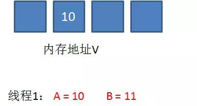

3.在线程1要提交更新之前，另一个线程2抢先一步，把内存地址V中的变量值率先更新成了11。
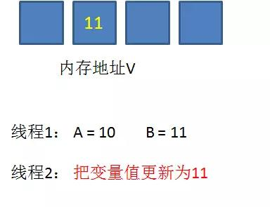

4.线程1开始提交更新，首先进行A和地址V的实际值比较（Compare），发现A不等于V的实际值，提交失败。
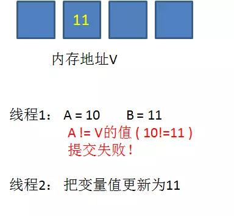

5.线程1重新获取内存地址V的当前值，并重新计算想要修改的新值。此时对线程1来说，A=11，B=12。
这个重新尝试的过程被称为自旋。


6.这一次比较幸运，没有其他线程改变地址V的值。线程1进行Compare，发现A和地址V的实际值是相等的。
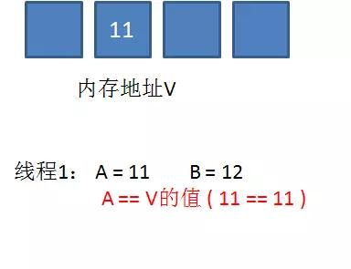

7.线程1进行SWAP，把地址V的值替换为B，也就是12。
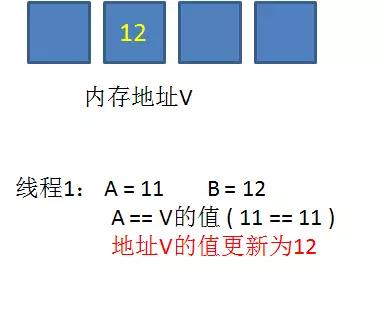

从思想上来说，Synchronized属于悲观锁，悲观地认为程序中的并发情况严重，所以严防死守。
CAS属于乐观锁，乐观地认为程序中的并发情况不那么严重，所以让线程不断去尝试更新。


# CAS的缺点

1.CPU开销较大
在并发量比较高的情况下，如果许多线程反复尝试更新某一个变量，却又一直更新不成功，循环往复，
会给CPU带来很大的压力。

2.不能保证代码块的原子性
CAS机制所保证的只是一个变量的原子性操作，而不能保证整个代码块的原子性。
比如需要保证3个变量共同进行原子性的更新，就不得不使用Synchronized了。

3.ABA问题
这是CAS机制最大的问题所在。

# CAS原理
首先看一看AtomicInteger当中常用的自增方法 incrementAndGet：
```
public final int incrementAndGet() {
    for (;;) {
        int current = get();
        int next = current + 1;
        if (compareAndSet(current, next))
            return next;
    }
}
private volatile int value;
public final int get() {
    return value;
}
```


这段代码是一个无限循环，也就是CAS的自旋。循环体当中做了三件事：
1.获取当前值。
2.当前值+1，计算出目标值。
3.进行CAS操作，如果成功则跳出循环，如果失败则重复上述步骤。

这里需要注意的重点是 get 方法，这个方法的作用是获取变量的当前值。

如何保证获得的当前值是内存中的最新值呢？很简单，用volatile关键字来保证。

接下来看一看compareAndSet方法的实现，以及方法所依赖对象的来历：
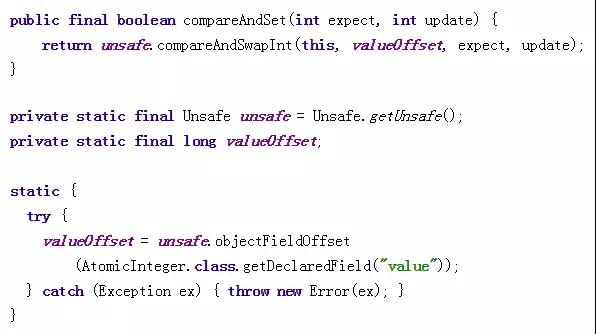

compareAndSet方法的实现很简单，只有一行代码。这里涉及到两个重要的对象，一个是unsafe，一个是valueOffset。

什么是unsafe呢？Java语言不像C，C++那样可以直接访问底层操作系统，但是JVM为我们提供了一个后门，
这个后门就是unsafe。unsafe为我们提供了硬件级别的原子操作。

至于valueOffset对象，是通过unsafe.objectFieldOffset方法得到，所代表的是AtomicInteger对象value成员变量在内存中的偏移量。
我们可以简单地把valueOffset理解为value变量的内存地址。

我们在上一期说过，CAS机制当中使用了3个基本操作数：内存地址V，旧的预期值A，要修改的新值B。

而unsafe的compareAndSwapInt方法参数包括了这三个基本元素：valueOffset参数代表了V，expect参数代表了A，update参数代表了B。

正是unsafe的compareAndSwapInt方法保证了Compare和Swap操作之间的原子性操作。


# ABA问题
什么是ABA呢？假设内存中有一个值为A的变量，存储在地址V当中。
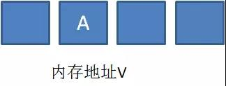

此时有三个线程想使用CAS的方式更新这个变量值，每个线程的执行时间有略微的偏差。
线程1和线程2已经获得当前值，线程3还未获得当前值。
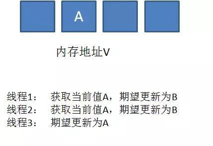

接下来，线程1先一步执行成功，把当前值成功从A更新为B；
同时线程2因为某种原因被阻塞住，没有做更新操作；
线程3在线程1更新之后，获得了当前值B。
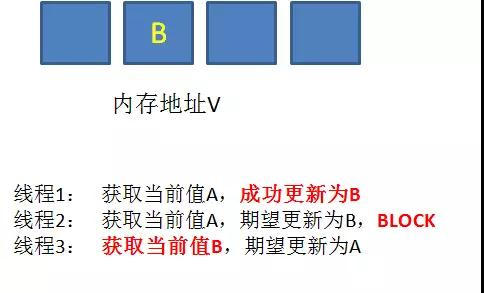

再之后，线程2仍然处于阻塞状态，线程3继续执行，成功把当前值从B更新成了A。
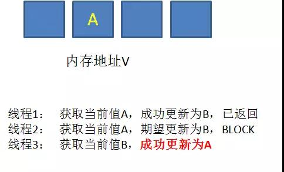

最后，线程2终于恢复了运行状态，由于阻塞之前已经获得了“当前值”A，并且经过compare检测，
内存地址V中的实际值也是A，所以成功把变量值A更新成了B。
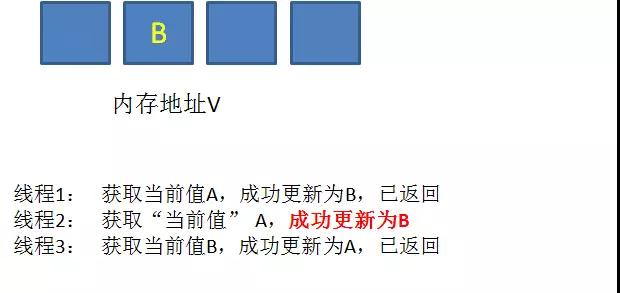

这个过程中，线程2获取到的变量值A是一个旧值，尽管和当前的实际值相同，但内存地址V中的变量已经经历了A->B->A的改变。


当我们举一个提款机的例子。假设有一个遵循CAS原理的提款机，小灰有100元存款，要用这个提款机来提款50元。


由于提款机硬件出了点小问题，小灰的提款操作被同时提交两次，开启了两个线程，两个线程都是获取当前值100元，要更新成50元。

理想情况下，应该一个线程更新成功，另一个线程更新失败，小灰的存款只被扣一次。


线程1首先执行成功，把余额从100改成50。线程2因为某种原因阻塞了。这时候，小灰的妈妈刚好给小灰汇款50元。

线程2仍然是阻塞状态，线程3执行成功，把余额从50改成100。

线程2恢复运行，由于阻塞之前已经获得了“当前值”100，并且经过compare检测，此时存款实际值也是100，
所以成功把变量值100更新成了50。

这个举例改编自《java特种兵》当中的一段例子。原本线程2应当提交失败，小灰的正确余额应该保持为100元，
结果由于ABA问题提交成功了。


# ABA问题的解决

什么意思呢？真正要做到严谨的CAS机制，我们在Compare阶段不仅要比较期望值A和地址V中的实际值，还要比较变量的版本号是否一致。

我们仍然以最初的例子来说明一下，假设地址V中存储着变量值A，当前版本号是01。
线程1获得了当前值A和版本号01，想要更新为B，但是被阻塞了。
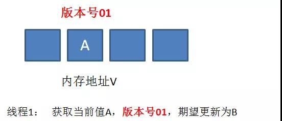

这时候，内存地址V中的变量发生了多次改变，版本号提升为03，但是变量值仍然是A。


随后线程1恢复运行，进行Compare操作。经过比较，线程1所获得的值和地址V的实际值都是A，
但是版本号不相等，所以这一次更新失败。
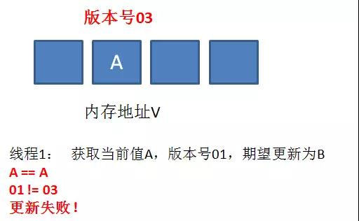

在Java当中，AtomicStampedReference类就实现了用版本号做比较的CAS机制。


