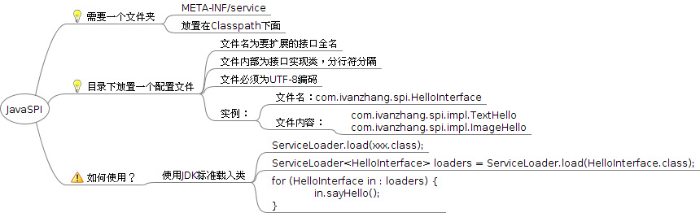

# 什么是JavaSPI机制

java的SPI机制简介
SPI的全名为Service Provider Interface.普通开发人员可能不熟悉，因为这个是针对厂商或者插件的。在java.util.ServiceLoader的文档里有比较详细的介绍。究其思想，其实是和"Callback"差不多。“Callback”的思想是在我们调用API的时候，我们可以自己写一段逻辑代码，传入到API里面，API内部在合适的时候会调用它，从而实现某种程度的“定制”。

我们系统里抽象的各个模块，往往有很多不同的实现方案，比如日志模块的方案，xml解析模块、jdbc模块的方案等。面向的对象的设计里，我们一般推荐模块之间基于接口编程，模块之间不对实现类进行硬编码。一旦代码里涉及具体的实现类，就违反了可拔插的原则，如果需要替换一种实现，就需要修改代码。

为了实现在模块装配的时候能不在程序里动态指明，这就需要一种服务发现机制。java spi就是提供这样的一个机制：为某个接口寻找服务实现的机制。有点类似IOC的思想，就是将装配的控制权移到程序之外，在模块化设计中这个机制尤其重要。

java spi的具体约定如下  ：

当服务的提供者，提供了服务接口的一种实现之后，在jar包的META-INF/services/目录里同时创建一个以服务接口命名的文件。该文件里就是实现该服务接口的具体实现类。而当外部程序装配这个模块的时候，就能通过该jar包META-INF/services/里的配置文件找到具体的实现类名，并装载实例化，完成模块的注入。

基于这样一个约定就能很好的找到服务接口的实现类，而不需要再代码里制定。

jdk提供服务实现查找的一个工具类：java.util.ServiceLoader

Java SPI机制简介
SPI 简介SPI 全称为 (Service Provider Interface) ,是JDK内置的一种服务提供发现机制。 目前有不少框架用它来做服务的扩展发现， 简单来说，它就是一种动态替换发现的机制， 举个例子来说， 有个接口，想运行时动态的给它添加实现，你只需要添加一个实现，
而后，把新加的实现，描述给JDK知道就行啦（通过改一个文本文件即可） 公司内部，目前Dubbo框架就基于SPI机制提供扩展功能。
简单示例

通过一个简单例子来说明SPI是如何使用的。 首先通过一张图来看看，用SPI需要遵循哪些规范，因为spi毕竟是JDK的一种标准。 
我们首先需要一个目录，META-INF\services 如下，最终的目录路径就像这样：

└── src
├── com
│   └── ivanzhang
│       └── spi
│           ├── HelloInterface.java
│           ├── impl
│           │   ├── ImageHello.java
│           │   └── TextHello.java
│           └── SPIMain.java
└── META-INF
    └── services
        └── com.ivanzhang.spi.HelloInterface

文件名字为 接口/抽象类： 全名
文件内容： 接口/抽象类 实现类
就像这样： com.ivanzhang.spi.impl.TextHello com.ivanzhang.spi.impl.ImageHello

接下来， 我们需要定义接口和实现类：

public interface HelloInterface {
  public void sayHello();
}

实现类：

public class TextHello implements HelloInterface {
  @Override
  public void sayHello() {
      System.out.println("Text Hello.");
  }
}
public class ImageHello implements HelloInterface {
  @Override
  public void sayHello() {
      System.out.println("Image Hello");
}

最后，来看看，如果使用SPI机制，客户端代码：

public class SPIMain {
    public static void main(String[] args) {
        ServiceLoader<HelloInterface> loaders = 
              ServiceLoader.load(HelloInterface.class);
        for (HelloInterface in : loaders) {
            in.sayHello();
        }
    }
}

最后的输出： Text Hello.Image Hello
