类加载机制

<!-- TOC -->

- [0、为什么说Java语言是跨平台的？](#0为什么说java语言是跨平台的)
- [1、Java虚拟机启动、加载类过程分析](#1java虚拟机启动加载类过程分析)
    - [Step 1.根据JVM内存配置要求，为JVM申请特定大小的内存空间](#step-1根据jvm内存配置要求为jvm申请特定大小的内存空间)
    - [Step 2.创建一个引导类加载器实例，初步加载系统类到内存方法区区域中](#step-2创建一个引导类加载器实例初步加载系统类到内存方法区区域中)
    - [Step 3. 创建JVM 启动器实例 Launcher,并取得类加载器ClassLoader](#step-3-创建jvm-启动器实例-launcher并取得类加载器classloader)
    - [Step 4. 使用类加载器ClassLoader加载Main类](#step-4-使用类加载器classloader加载main类)
        - [1. 加载java.lang.Object、java.lang.System、java.io.PrintStream、java,lang.Class](#1-加载javalangobjectjavalangsystemjavaioprintstreamjavalangclass)
        - [2. 加载sun.security.pkcs11.P11Util](#2-加载sunsecuritypkcs11p11util)
        - [3. 加载org.luanlouis.jvm.load.Main](#3-加载orgluanlouisjvmloadmain)
    - [Step 5. 使用Main类的main方法作为程序入口运行程序](#step-5-使用main类的main方法作为程序入口运行程序)
    - [Step 6. 方法执行完毕，JVM销毁，释放内存](#step-6-方法执行完毕jvm销毁释放内存)
- [2、类加载器有哪些？其组织结构是怎样的？](#2类加载器有哪些其组织结构是怎样的)
    - [2.1、类加载器(Class Loader)：](#21类加载器class-loader)
    - [2.2、引导类加载器(Bootstrap Class Loader):](#22引导类加载器bootstrap-class-loader)
    - [2.3、拓展类加载器(Extension Class Loader):](#23拓展类加载器extension-class-loader)
    - [2.4、应用类加载器(Applocatoin Class Loader):](#24应用类加载器applocatoin-class-loader)
    - [2.5、用户自定义类加载器（Customized Class Loader）：](#25用户自定义类加载器customized-class-loader)
- [3、双亲加载模型的逻辑和底层代码实现是怎样的？](#3双亲加载模型的逻辑和底层代码实现是怎样的)
- [4、类加载器与Class<T>  实例的关系](#4类加载器与classt -实例的关系)
- [5、线程上下文加载器](#5线程上下文加载器)
- [6、类加载器加载类的层次结构图：](#6类加载器加载类的层次结构图)
    - [类加载器的双亲委派模型](#类加载器的双亲委派模型)
    - [Class.forname()与ClassLoader.loadClass()区别](#classforname与classloaderloadclass区别)

<!-- /TOC -->

> 参考

- [java笔记--理解java类加载器以及ClassLoader类](https://www.cnblogs.com/fingerboy/p/5456371.html)
- [《Java虚拟机原理图解》5. JVM类加载器机制与类加载过程](https://blog.csdn.net/luanlouis/article/details/50529868)
- [【深入Java虚拟机】之四：类加载机制](https://blog.csdn.net/ns_code/article/details/17881581)


> 双亲委派模型

模型如下图：

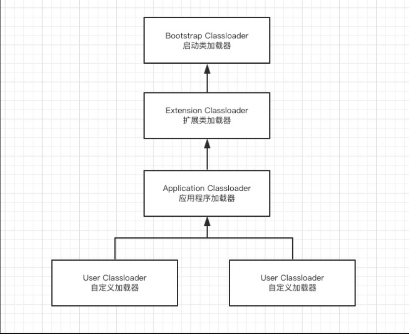

双亲委派模型中除了启动类加载器之外其余都需要有自己的父类加载器

当一个类收到了类加载请求时: 自己不会首先加载，而是委派给父加载器进行加载，每个层次的加载器都是这样。

所以最终每个加载请求都会经过启动类加载器。只有当父类加载返回不能加载时子加载器才会进行加载。

双亲委派的好处 : 由于每个类加载都会经过最顶层的启动类加载器，比如 `java.lang.Object`这样的类在各个类加载器下都是同一个类(只有当两个类是由同一个类加载器加载的才有意义，这两个类才相等。)

如果没有双亲委派模型，由各个类加载器自行加载的话。当用户自己编写了一个 `java.lang.Object`类，那样系统中就会出现多个 `Object`，这样 Java 程序中最基本的行为都无法保证，程序会变的非常混乱。

# 0、为什么说Java语言是跨平台的？

Java语言之所以说它是跨平台的、可以在当前绝大部分的操作系统平台下运行，是因为Java语言的运行环境是在Java虚拟机中。 
Java虚拟机消除了各个平台之间的差异，只要操作系统平台下安装了Java虚拟机，那么使用Java开发的东西都能在其上面运行。如下图所示：

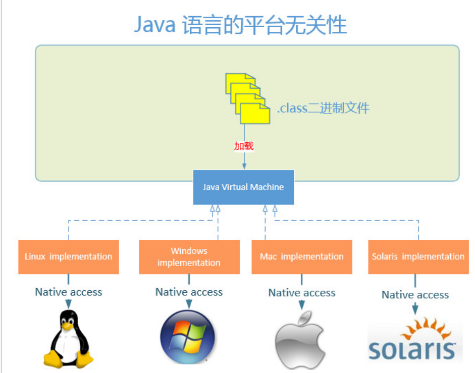

Java虚拟机对各个平台而言，实质上是各个平台上的一个可执行程序。例如在windows平台下，java虚拟机对于windows而言，就是一个java.exe进程而已。


# 1、Java虚拟机启动、加载类过程分析
下面我将定义一个非常简单的java程序并运行它，来逐步分析java虚拟机启动的过程。

```
package org.luanlouis.jvm.load;
import sun.security.pkcs11.P11Util;
 
/**
 * Created by louis on 2016/1/16.
 */
public class Main{
 
    public static void main(String[] args) {
        System.out.println("Hello,World!");
 
        ClassLoader loader = P11Util.class.getClassLoader();
 
        System.out.println(loader);
    }
}
```

在windows命令行下输入： 
java    org.luanlouis.jvm.load.Main

当输入上述的命令时： 
windows开始运行{JRE_HOME}/bin/java.exe程序，java.exe 程序将完成以下步骤： 
- 1、根据JVM内存配置要求，为JVM申请特定大小的内存空间；
- 2、创建一个引导类加载器实例，初步加载系统类到内存方法区区域中；
- 3、创建JVM 启动器实例 Launcher,并取得类加载器ClassLoader；
- 4、使用上述获取的ClassLoader实例加载我们定义的 org.luanlouis.jvm.load.Main类；
- 5、加载完成时候JVM会执行Main类的main方法入口，执行Main类的main方法；
- 6、结束，java程序运行结束，JVM销毁。

## Step 1.根据JVM内存配置要求，为JVM申请特定大小的内存空间

JVM启动时，按功能划分，其内存应该由以下几部分组成： 

- 

如上图所示，JVM内存按照功能上的划分，可以粗略地划分为方法区(Method Area) 和堆(Heap),而所有的类的定义信息都会被加载到方法区中。


## Step 2.创建一个引导类加载器实例，初步加载系统类到内存方法区区域中

JVM申请好内存空间后，JVM会创建一个[引导类加载器（Bootstrap Classloader）]实例，引导类加载器是使用C++语言实现的，
负责加载JVM虚拟机运行时所需的基本[系统级别的类]，如java.lang.String, java.lang.Object等等。
引导类加载器(Bootstrap Classloader)会读取 {JRE_HOME}/lib 下的jar包和配置，然后将这些系统类加载到方法区内。

本例中，引导类加载器是用 {JRE_HOME}/lib加载类的，不过，你也可以使用参数 -Xbootclasspath 或 系统变量sun.boot.class.path来指定的目录来加载类。
一般而言，{JRE_HOME}/lib下存放着JVM正常工作所需要的系统类，如下表所示：

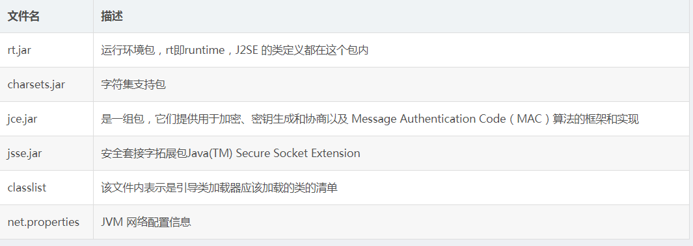

引导类加载器(Bootstrap ClassLoader） 加载系统类后，JVM内存会呈现如下格局：

- 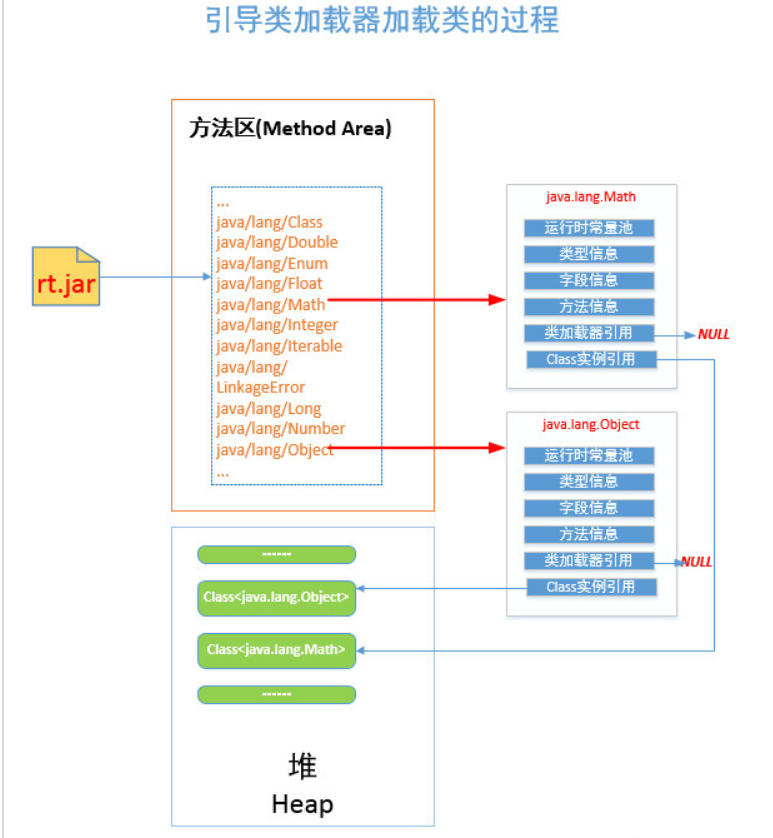

- 引导类加载器将类信息加载到方法区中，以特定方式组织，对于某一个特定的类而言，在方法区中它应该有 运行时常量池、类型信息、字段信息、方法信息、类加载器的引用，对应class实例的引用等信息。

- 类加载器的引用,由于这些类是由引导类加载器(Bootstrap Classloader)进行加载的，而 引导类加载器是有C++语言实现的，所以是无法访问的，故而该引用为NULL

- 对应class实例的引用， 类加载器在加载类信息放到方法区中后，会创建一个对应的Class 类型的实例放到堆(Heap)中, 作为开发人员访问方法区中类定义的入口和切入点。

小测试：
当我们在代码中尝试获取系统类如java.lang.Object的类加载器时，你会始终得到NULL：
```
        System.out.println(String.class.getClassLoader());//null
        System.out.println(Object.class.getClassLoader());//null
        System.out.println(Math.class.getClassLoader());//null
        System.out.println(System.class.getClassLoader());//null
```


## Step 3. 创建JVM 启动器实例 Launcher,并取得类加载器ClassLoader

上述步骤完成，JVM基本运行环境就准备就绪了。接着，我们要让JVM工作起来了：运行我们定义的程序 org.luanlouis.jvm.load.Main。
此时，JVM虚拟机调用已经加载在方法区的类[sun.misc.Launcher] 的静态方法getLauncher(),  获取sun.misc.Launcher 实例：

sun.misc.Launcher launcher = sun.misc.Launcher.getLauncher(); //获取Java启动器
ClassLoader classLoader = launcher.getClassLoader();          //获取类加载器ClassLoader用来加载class到内存来
sun.misc.Launcher 使用了单例模式设计，保证一个JVM虚拟机内只有一个sun.misc.Launcher实例。
在Launcher的内部，其定义了两个类加载器(ClassLoader),分别是sun.misc.Launcher.ExtClassLoader和sun.misc.Launcher.AppClassLoader，
这两个类加载器分别被称为拓展类加载器([Extension ClassLoader]) 和 应用类加载器([Application ClassLoader]).如下图所示：


- 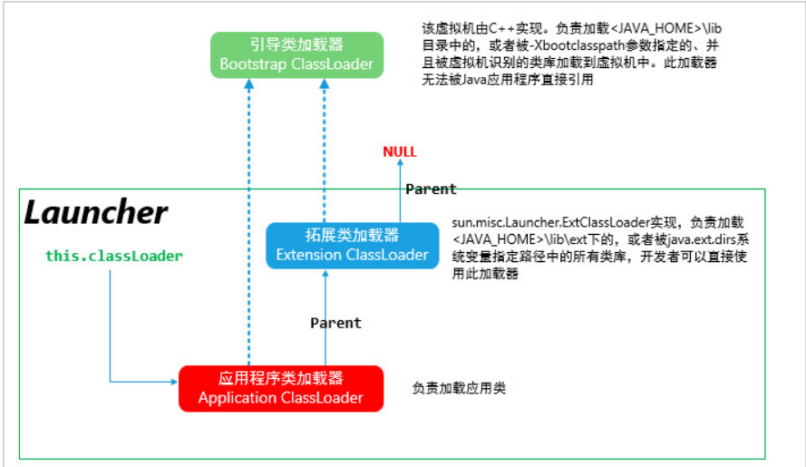


图例注释：
除了引导类加载器(Bootstrap Class Loader )的所有类加载器，都有一个能力，就是判断某一个类是否被引导类加载器加载过，如果加载过，可以直接返回对应的Class<T> instance，如果没有，则返回null.  
图上的指向引导类加载器的虚线表示类加载器的这个有限的访问 引导类加载器的功能。

此时的launcher.getClassLoader() 方法将会返回 AppClassLoader 实例，AppClassLoader将ExtClassLoader作为自己的父加载器。

当AppClassLoader加载类时，会首先尝试让父加载器ExtClassLoader进行加载，如果父加载器ExtClassLoader加载成功，则AppClassLoader直接返回父加载器ExtClassLoader加载的结果；
如果父加载器ExtClassLoader加载失败，AppClassLoader则会判断该类是否是引导的系统类(即是否是通过Bootstrap类加载器加载，这会调用Native方法进行查找)；
若要加载的类不是系统引导类，那么ClassLoader将会尝试自己加载，加载失败将会抛出“ClassNotFoundException”。

具体AppClassLoader的工作流程如下所示：

- 


[双亲委派模型(parent-delegation model)]
上面讨论的应用类加载器AppClassLoader的加载类的模式就是我们常说的双亲委派模型(parent-delegation model).
对于某个特定的类加载器而言，应该为其指定一个父类加载器，当用其进行加载类的时候：
- 1.委托父类加载器帮忙加载；
- 2.父类加载器加载不了，则查询引导类加载器有没有加载过该类；
- 3.如果引导类加载器没有加载过该类，则当前的类加载器应该自己加载该类；
- 4.若加载成功，返回 对应的Class<T> 对象；若失败，抛出异常“ClassNotFoundException”。

请注意：
双亲委派模型中的"双亲"并不是指它有两个父类加载器的意思，一个类加载器只应该有一个父加载器。上面的步骤中，有两个角色：
- 1.父类加载器(parent classloader)：它可以替子加载器尝试加载类
- 2.引导类加载器（bootstrap classloader）: 子类加载器只能判断某个类是否被引导类加载器加载过，而不能委托它加载某个类；

换句话说，就是子类加载器不能接触到引导类加载器，引导类加载器对其他类加载器而言是透明的。

一般情况下，双亲加载模型如下所示：

- 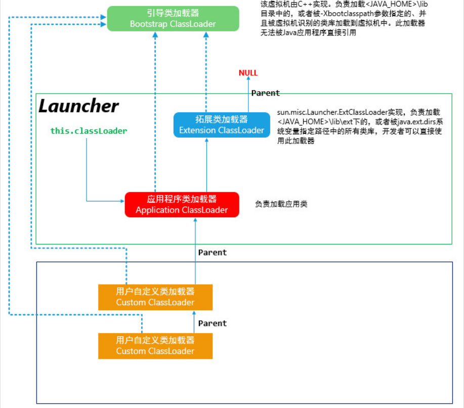


## Step 4. 使用类加载器ClassLoader加载Main类

通过 launcher.getClassLoader()方法返回AppClassLoader实例，接着就是AppClassLoader加载 org.luanlouis.jvm.load.Main类的时候了。

ClassLoader classloader = launcher.getClassLoader();//取得AppClassLoader类

classLoader.loadClass("org.luanlouis.jvm.load.Main");//加载自定义类

上述定义的org.luanlouis.jvm.load.Main类被编译成org.luanlouis.jvm.load.Main class二进制文件，
这个class文件中有一个叫常量池(Constant Pool)的结构体来存储该class的常量信息。常量池中有CONSTANT_CLASS_INFO类型的常量，
表示该class中声明了要用到那些类：

- 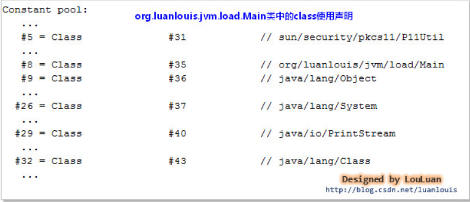

当AppClassLoader要加载 org.luanlouis.jvm.load.Main类时，会去查看该类的定义，发现它内部声明使用了其它的类： 
sun.security.pkcs11.P11Util、java.lang.Object、java.lang.System、java.io.PrintStream、java.lang.Class；org.luanlouis.jvm.load.Main类要想正常工作，
首先要能够保证这些其内部声明的类加载成功。所以AppClassLoader要先将这些类加载到内存中。
（注：为了理解方便，这里没有考虑懒加载的情况，事实上的JVM加载类过程比这复杂的多）

加载顺序：

### 1. 加载java.lang.Object、java.lang.System、java.io.PrintStream、java,lang.Class

AppClassLoader尝试加载这些类的时候，会先委托ExtClassLoader进行加载；而ExtClassLoader发现不是其加载范围，其返回null；
AppClassLoader发现父类加载器ExtClassLoader无法加载，则会查询这些类是否已经BootstrapClassLoader加载过，
结果表明这些类已经被BootstrapClassLoader加载过，则无需重复加载，直接返回对应的Class<T>实例；

### 2. 加载sun.security.pkcs11.P11Util

此在{JRE_HOME}/lib/ext/sunpkcs11.jar包内，属于ExtClassLoader负责加载的范畴。AppClassLoader尝试加载这些类的时候，
会先委托ExtClassLoader进行加载；而ExtClassLoader发现其正好属于加载范围，故ExtClassLoader负责将其加载到内存中。
ExtClassLoader在加载sun.security.pkcs11.P11Util时也分析这个类内都使用了哪些类，并将这些类先加载内存后，才开始加载sun.security.pkcs11.P11Util，加载成功后直接返回对应的Class<sun.security.pkcs11.P11Util>实例；

### 3. 加载org.luanlouis.jvm.load.Main

AppClassLoader尝试加载这些类的时候，会先委托ExtClassLoader进行加载；
而ExtClassLoader发现不是其加载范围，其返回null；AppClassLoader发现父类加载器ExtClassLoader无法加载，则会查询这些类是否已经被BootstrapClassLoader加载过。而结果表明BootstrapClassLoader 没有加载过它，这时候AppClassLoader只能自己动手负责将其加载到内存中，然后返回对应的Class<org.luanlouis.jvm.load.Main>实例引用；

以上三步骤都成功，才表示classLoader.loadClass("org.luanlouis.jvm.load.Main")完成，上述操作完成后，JVM内存方法区的格局会如下所示：

- 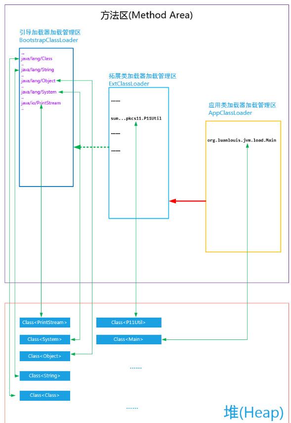

如上图所示：
- JVM方法区的类信息区是按照类加载器进行划分的，每个类加载器会维护自己加载类信息；
- [某个类加载器在加载相应的类时，会相应地在JVM内存堆（Heap）中创建一个对应的Class<T>，用来表示访问该类信息的入口]

## Step 5. 使用Main类的main方法作为程序入口运行程序

## Step 6. 方法执行完毕，JVM销毁，释放内存


# 2、类加载器有哪些？其组织结构是怎样的？

## 2.1、类加载器(Class Loader)：

顾名思义，指的是可以加载类的工具。JVM自身定义了三个类加载器：
引导类加载器(Bootstrap Class Loader)、拓展类加载器(Extension Class Loader )、应用加载器(Application Class Loader)。
当然，我们有时候也会自己定义一些类加载器来满足自身的需要。

## 2.2、引导类加载器(Bootstrap Class Loader): 

该类加载器使JVM使用C/C++底层代码实现的加载器，用以加载JVM运行时所需要的系统类，这些系统类在{JRE_HOME}/lib目录下。由于类加载器是使用平台相关的底层C/C++语言实现的， 所以该加载器不能被Java代码访问到。但是，我们可以查询某个类是否被引导类加载器加载过。我们经常使用的系统类如：java.lang.String,java.lang.Object,java.lang*....... 这些都被放在 {JRE_HOME}/lib/rt.jar包内， 当JVM系统启动的时候，引导类加载器会将其加载到 JVM内存的方法区中。

## 2.3、拓展类加载器(Extension Class Loader): 

该加载器是用于加载 java 的拓展类 ，拓展类一般会放在 {JRE_HOME}/lib/ext/ 目录下，用来提供除了系统类之外的额外功能。
拓展类加载器是是整个JVM加载器的Java代码可以访问到的类加载器的最顶端，即是超级父加载器，拓展类加载器是没有父类加载器的。

## 2.4、应用类加载器(Applocatoin Class Loader): 

该类加载器是用于加载用户代码，是用户代码的入口。我经常执行指令 java   xxx.x.xxx.x.x.XClass , 实际上，
JVM就是使用的AppClassLoader加载 xxx.x.xxx.x.x.XClass 类的。应用类加载器将拓展类加载器当成自己的父类加载器，
当其尝试加载类的时候，首先尝试让其父加载器-拓展类加载器加载；如果拓展类加载器加载成功，则直接返回加载结果Class<T> instance,加载失败，
则会询问是否引导类加载器已经加载了该类；只有没有加载的时候，应用类加载器才会尝试自己加载。由于xxx.x.xxx.x.x.XClass是整个用户代码的入口
，在Java虚拟机规范中，称其为 初始类(Initial Class).

## 2.5、用户自定义类加载器（Customized Class Loader）：

用户可以自己定义类加载器来加载类。所有的类加载器都要继承java.lang.ClassLoader类。

- 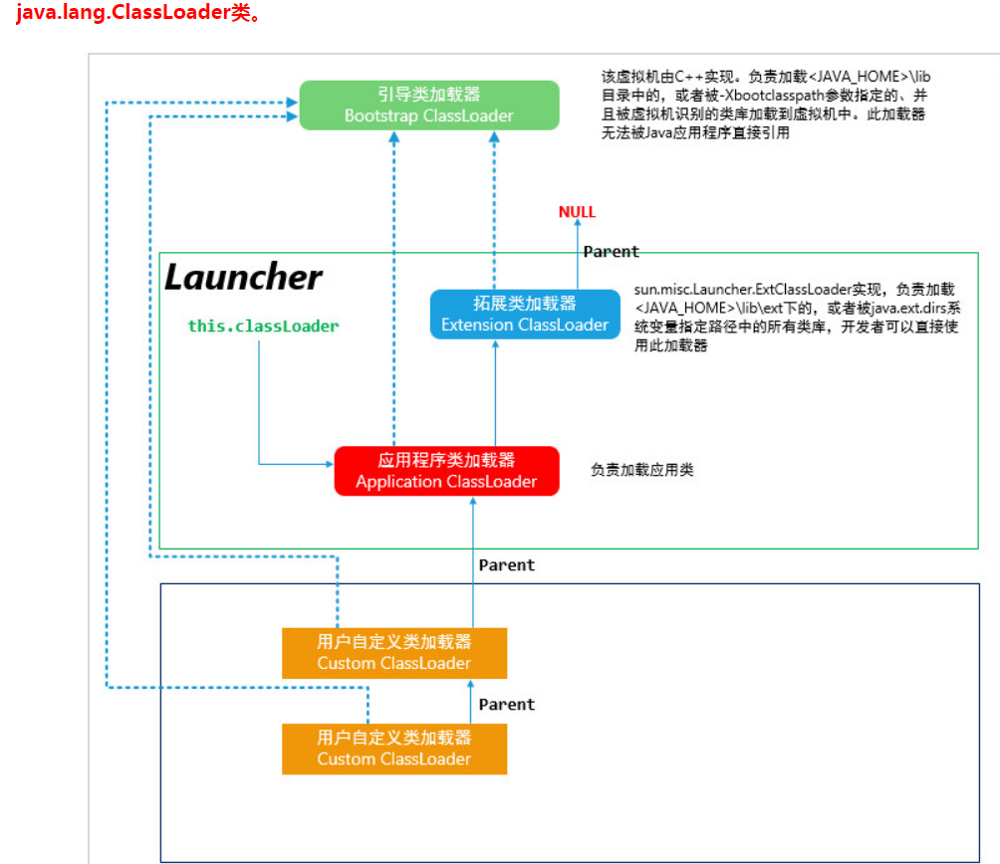
           
# 3、双亲加载模型的逻辑和底层代码实现是怎样的？

上面已经不厌其烦地讲解什么是双亲加载模型，以及其机制是什么，这些东西都是可以通过底层代码查看到的。
我们也可以通过JDK源码看java.lang.ClassLoader的核心方法 loadClass()的实现：

```
  
    //提供class类的二进制名称表示，加载对应class，加载成功，则返回表示该类对应的Class<T> instance 实例
    public Class<?> loadClass(String name) throws ClassNotFoundException {
        return loadClass(name, false);
    }
 
    
    protected Class<?> loadClass(String name, boolean resolve)
        throws ClassNotFoundException
    {
        synchronized (getClassLoadingLock(name)) {
            // 首先，检查是否已经被当前的类加载器记载过了，如果已经被加载，直接返回对应的Class<T>实例
            Class<?> c = findLoadedClass(name);
                //初次加载
                if (c == null) {
                long t0 = System.nanoTime();
                try {
                    if (parent != null) {
                        //如果有父类加载器，则先让父类加载器加载
                        c = parent.loadClass(name, false);
                    } else {
                        // 没有父加载器，则查看是否已经被引导类加载器加载，有则直接返回
                        c = findBootstrapClassOrNull(name);
                    }
                } catch (ClassNotFoundException e) {
                    // ClassNotFoundException thrown if class not found
                    // from the non-null parent class loader
                }
                // 父加载器加载失败，并且没有被引导类加载器加载，则尝试该类加载器自己尝试加载
                if (c == null) {
                    // If still not found, then invoke findClass in order
                    // to find the class.
                    long t1 = System.nanoTime();
                    // 自己尝试加载
                    c = findClass(name);
 
                    // this is the defining class loader; record the stats
                    sun.misc.PerfCounter.getParentDelegationTime().addTime(t1 - t0);
                    sun.misc.PerfCounter.getFindClassTime().addElapsedTimeFrom(t1);
                    sun.misc.PerfCounter.getFindClasses().increment();
                }
            }
            //是否解析类 
            if (resolve) {
                resolveClass(c);
            }
            return c;
        }
    }

```

相对应地，我们可以整理出双亲模型的工作流程图：

- 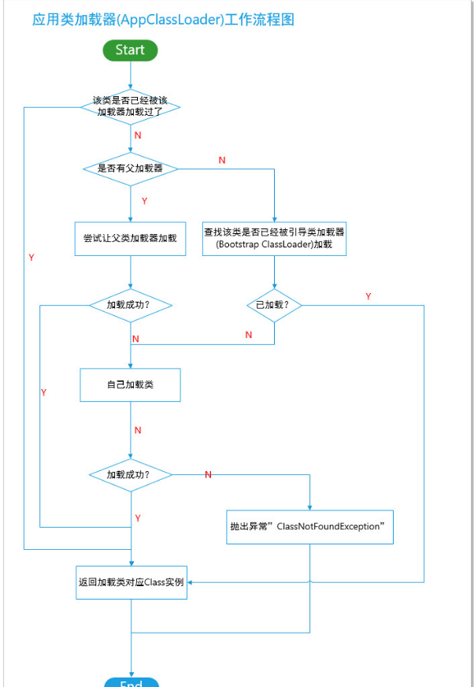


相信读者看过这张图后会对双亲加载模型有了非常清晰的脉络。当然，这是JDK自身默认的加载类的行为，我们可以通过继承复写该方法，改变其行为。

# 4、类加载器与Class<T>  实例的关系


- 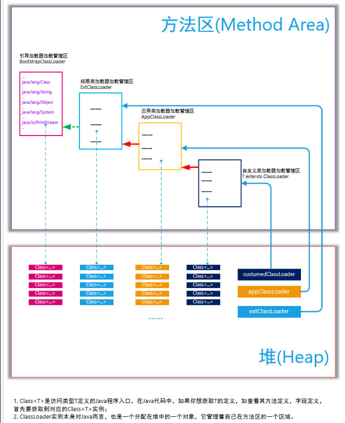


# 5、线程上下文加载器

Java 任何一段代码的执行，都有对应的线程上下文。如果我们在代码中，想看当前是哪一个线程在执行当前代码，我们经常是使用如下方法：
 Thread  thread = Thread.currentThread();//返回对当当前运行线程的引用


- 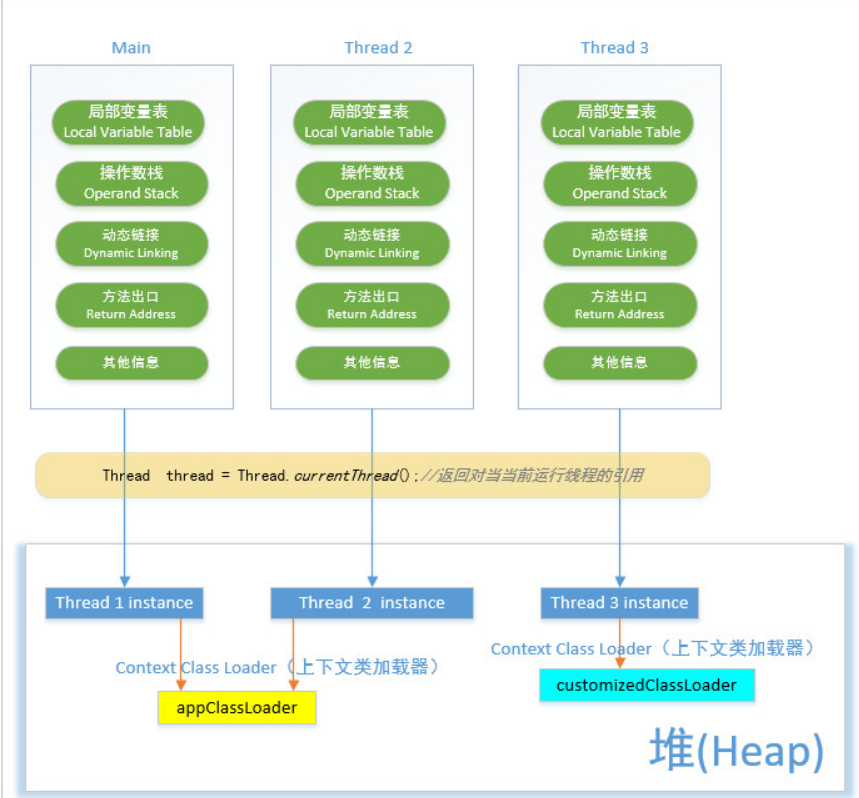


相应地，我们可以为当前的线程指定类加载器。在上述的例子中， 当执行   java    org.luanlouis.jvm.load.Main  的时候，
JVM会创建一个Main线程，而创建应用类加载器AppClassLoader的时候，会将AppClassLoader  设置成Main线程的上下文类加载器：

```
public Launcher() {
        Launcher.ExtClassLoader var1;
        try {
            var1 = Launcher.ExtClassLoader.getExtClassLoader();
        } catch (IOException var10) {
            throw new InternalError("Could not create extension class loader", var10);
        }
 
        try {
            this.loader = Launcher.AppClassLoader.getAppClassLoader(var1);
        } catch (IOException var9) {
            throw new InternalError("Could not create application class loader", var9);
        }
		//将AppClassLoader设置成当前线程的上下文加载器
        Thread.currentThread().setContextClassLoader(this.loader);
        //.......
 
    }

```

线程上下文类加载器是从线程的角度来看待类的加载，为每一个线程绑定一个类加载器，可以将类的加载从单纯的 双亲加载模型解放出来，进而实现特定的加载需求。


# 6、类加载器加载类的层次结构图：

- 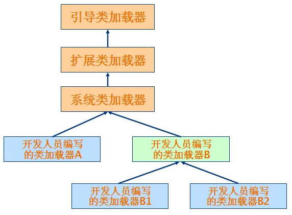


使用代码观察一下类加载器:（com.ls.classload.TestClassLoader）

```java
public class TestClassLoader {

    public static void main(String[] args) {
        ClassLoader loader = TestClassLoader.class.getClassLoader();
        System.out.println(loader.toString());
        System.out.println(loader.getParent().toString());
        System.out.println(loader.getParent().getParent());
    }
}
```


观察打印结果:
sun.misc.Launcher$AppClassLoader@500c05c2
sun.misc.Launcher$ExtClassLoader@454e2c9c
null

第一行打印的是应用程序类加载器(默认加载器);
第二行打印的是其父类加载器,扩展类加载器,按照我们的想法第三行应该打印启动类加载器的,这里却返回的null,
原因是getParent(),返回时null的话,就默认使用启动类加载器作为父加载器.

## 类加载器的双亲委派模型
双亲委派模型是一种组织类加载器之间关系的一种规范,工作原理是:
如果一个类加载器收到了类加载的请求,它不会自己去尝试加载这个类,而是把这个请求委派给父类加载器去完成,这样层层递进,
最终所有的加载请求都被传到最顶层的启动类加载器中,只有当父类加载器无法完成这个加载请求(它的搜索范围内没有找到所需的类)时,才会交给子类加载器去尝试加载.
这样的好处是:java类随着它的类加载器一起具备了带有优先级的层次关系.
这是十分必要的,比如java.langObject,它存放在\jre\lib\rt.jar中,它是所有java类的父类,
因此无论哪个类加载都要加载这个类,最终所有的加载请求都汇总到顶层的启动类加载器中,因此Object类会由启动类加载器来加载,
所以加载的都是同一个类,如果不使用双亲委派模型,由各个类加载器自行去加载的话,系统中就会出现不止一个Object类,应用程序就会全乱了.

## Class.forname()与ClassLoader.loadClass()区别
Class.forname():是一个静态方法,最常用的是Class.forname(String className);根据传入的类的全限定名返回一个Class对象.该方法在将Class文件加载到内存的同时,会执行类的初始化.
如: Class.forName("com.wang.HelloWorld");

ClassLoader.loadClass():这是一个实例方法,需要一个ClassLoader对象来调用该方法,该方法将Class文件加载到内存时,并不会执行类的初始化,直到这个类第一次使用时才进行初始化.该方法因为需要得到一个ClassLoader对象,所以可以根据需要指定使用哪个类加载器.
如:ClassLoader cl=.......;cl.loadClass("com.wang.HelloWorld");
