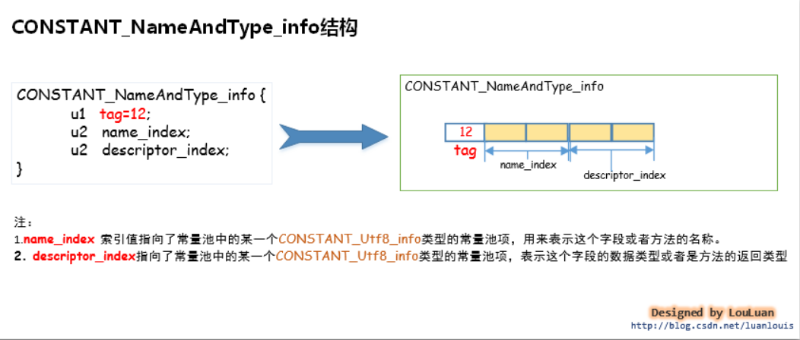
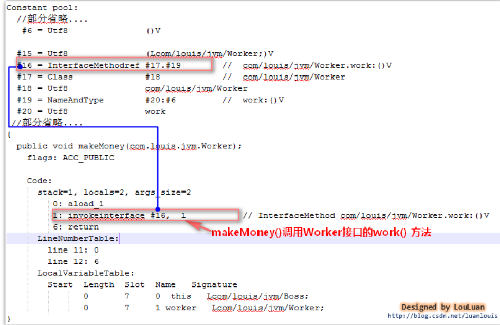
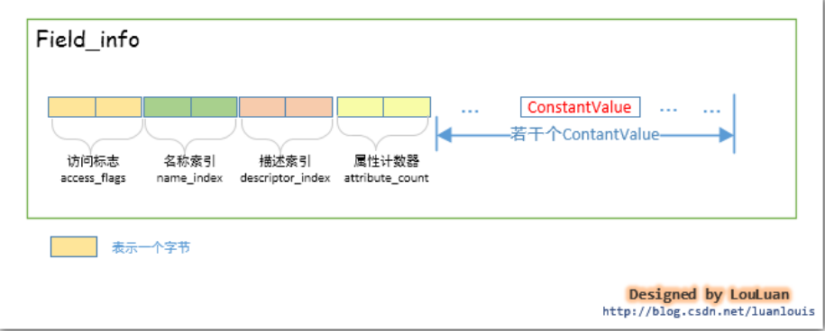
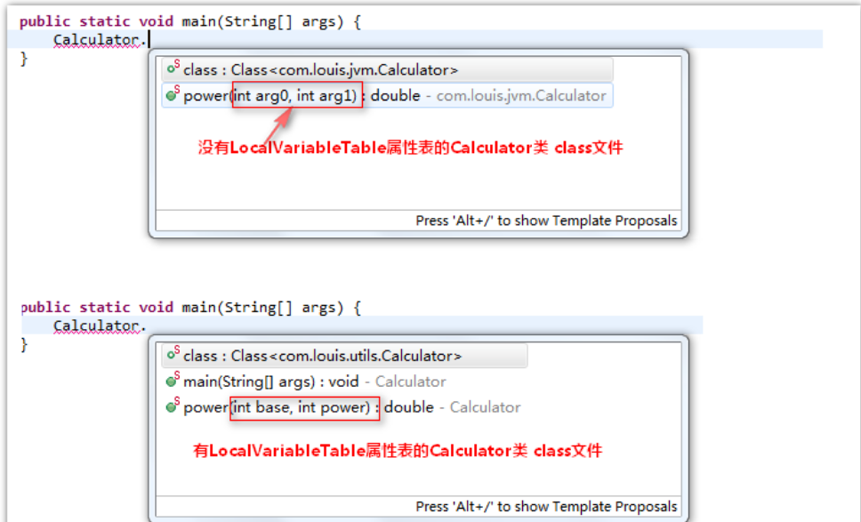
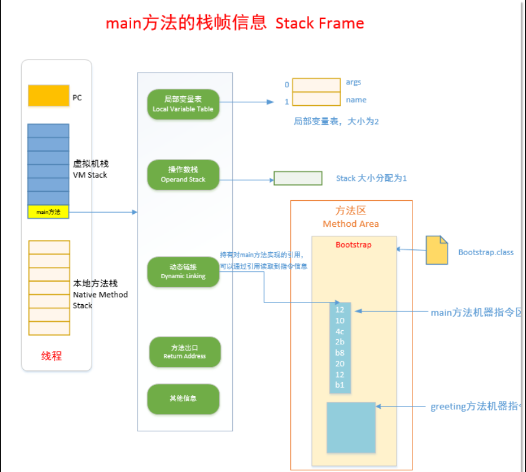
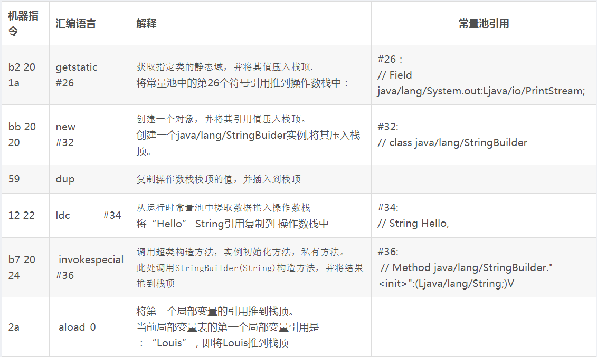

Java虚拟机原理图解

> 总结
这里主要详细解析class文件[字节码文件]各个部分的构成以及各个部分的含义

> 参考
- [Java虚拟机原理图解](https://blog.csdn.net/u010349169/column/info/jvm-principle)


目录：


<!-- TOC -->

- [1. 、JVM运行时数据区](#1-jvm运行时数据区)
    - [1.1. Topic 1.JVM运行时数据区里有什么？](#11-topic-1jvm运行时数据区里有什么)
    - [1.2. Topic 2. 虚拟机栈是什么？虚拟机栈里有什么？](#12-topic-2-虚拟机栈是什么虚拟机栈里有什么)
    - [1.3. Topic 3. 栈帧是什么？栈帧里有什么？](#13-topic-3-栈帧是什么栈帧里有什么)
    - [1.4. Topic 4. 方法区是什么？方法区里有什么？](#14-topic-4-方法区是什么方法区里有什么)
- [2. 、class文件基本组织结构](#2-class文件基本组织结构)
    - [2.1. 、魔数(magic)](#21-魔数magic)
    - [2.2. 、版本号(minor_version,major_version)](#22-版本号minor_versionmajor_version)
    - [2.3. 、常量池计数器(constant_pool_count)](#23-常量池计数器constant_pool_count)
    - [2.4. 、常量池数据区(constant_pool[contstant_pool_count-1])](#24-常量池数据区constant_poolcontstant_pool_count-1)
    - [2.5. 、访问标志(access_flags)](#25-访问标志access_flags)
    - [2.6. 、类索引(this_class)](#26-类索引this_class)
    - [2.7. 、父类索引(super_class)](#27-父类索引super_class)
    - [2.8. 、接口计数器(interfaces_count)](#28-接口计数器interfaces_count)
    - [2.9. 、接口信息数据区(interfaces[interfaces_count])](#29-接口信息数据区interfacesinterfaces_count)
    - [2.10. 、字段计数器(fields_count)](#210-字段计数器fields_count)
    - [2.11. 、.字段信息数据区(fields[fields_count])](#211-字段信息数据区fieldsfields_count)
    - [2.12. 、方法计数器(methods_count)](#212-方法计数器methods_count)
    - [2.13. 、方法信息数据区(methods[methods_count])](#213-方法信息数据区methodsmethods_count)
    - [2.14. 、属性计数器(attributes_count)](#214-属性计数器attributes_count)
    - [2.15. 、属性信息数据区(attributes[attributes_count])](#215-属性信息数据区attributesattributes_count)
- [3. 、Class文件中的常量池详解](#3-class文件中的常量池详解)
    - [3.1. 、常量池在class文件的什么位置？](#31-常量池在class文件的什么位置)
    - [3.2. 、常量池的里面是怎么组织的？](#32-常量池的里面是怎么组织的)
    - [3.3. 、常量池项 (cp_info) 的结构是什么？](#33-常量池项-cp_info-的结构是什么)
    - [3.4. 、常量池能够表示那些信息？](#34-常量池能够表示那些信息)
    - [3.5. 、int和float数据类型的常量在常量池中是怎样表示和存储的？(CONSTANT_Integer_info, CONSTANT_Float_info)](#35-int和float数据类型的常量在常量池中是怎样表示和存储的constant_integer_info-constant_float_info)
    - [3.6. 、long和 double数据类型的常量在常量池中是怎样表示和存储的？(CONSTANT_Long_info、CONSTANT_Double_info )](#36-long和-double数据类型的常量在常量池中是怎样表示和存储的constant_long_infoconstant_double_info-)
    - [3.7. 、String类型的字符串常量在常量池中是怎样表示和存储的？（CONSTANT_String_info、CONSTANT_Utf8_info）](#37-string类型的字符串常量在常量池中是怎样表示和存储的constant_string_infoconstant_utf8_info)
    - [3.8. 、类文件中定义的类名和类中使用到的类在常量池中是怎样被组织和存储的？(CONSTANT_Class_info)](#38-类文件中定义的类名和类中使用到的类在常量池中是怎样被组织和存储的constant_class_info)
    - [3.9. 、类中引用到的field字段在常量池中是怎样描述的？(CONSTANT_Fieldref_info, CONSTANT_Name_Type_info)](#39-类中引用到的field字段在常量池中是怎样描述的constant_fieldref_info-constant_name_type_info)
    - [3.10. 、类中引用到的method方法在常量池中是怎样描述的？(CONSTANT_Methodref_info, CONSTANT_Name_Type_info)](#310-类中引用到的method方法在常量池中是怎样描述的constant_methodref_info-constant_name_type_info)
    - [3.11. 、类中引用到某个接口中定义的method方法在常量池中是怎样描述的？(CONSTANT_InterfaceMethodref_info, CONSTANT_Name_Type_info)](#311-类中引用到某个接口中定义的method方法在常量池中是怎样描述的constant_interfacemethodref_info-constant_name_type_info)
    - [3.12. 、CONSTANT_MethodType_info，CONSTANT_MethodHandle_info，CONSTANT_InvokeDynamic_info](#312-constant_methodtype_infoconstant_methodhandle_infoconstant_invokedynamic_info)
- [4. 、class文件中的访问标志、类索引、父类索引、接口索引集合](#4-class文件中的访问标志类索引父类索引接口索引集合)
    - [4.1. 访问标志、类索引、父类索引、接口索引集合 在class文件中的位置](#41-访问标志类索引父类索引接口索引集合-在class文件中的位置)
    - [4.2. 访问标志(access_flags)能够表示什么？](#42-访问标志access_flags能够表示什么)
    - [4.3. 类索引(this_class)是什么？](#43-类索引this_class是什么)
    - [4.4. 、父类索引(super_class)是什么？](#44-父类索引super_class是什么)
    - [4.5. 、接口索引集合(interfaces)是什么？](#45-接口索引集合interfaces是什么)
- [5. 、class文件中的字段表集合--field字段在class文件中是怎样组织的](#5-class文件中的字段表集合--field字段在class文件中是怎样组织的)
    - [5.1. 概述](#51-概述)
    - [5.2. 字段表集合在class文件中的位置](#52-字段表集合在class文件中的位置)
    - [5.3. Java中的一个Field字段应该包含那些信息？------字段表field_info结构体的定义](#53-java中的一个field字段应该包含那些信息------字段表field_info结构体的定义)
    - [5.4. field字段的访问标志](#54-field字段的访问标志)
    - [5.5. 字段的数据类型表示和字段名称表示](#55-字段的数据类型表示和字段名称表示)
    - [5.6. 属性表集合-----静态field字段的初始化](#56-属性表集合-----静态field字段的初始化)
    - [5.7. 实例解析：](#57-实例解析)
    - [5.8. 您还需要了解什么](#58-您还需要了解什么)
- [6. 、 class文件中的方法表集合--method方法在class文件中是怎样组织的](#6--class文件中的方法表集合--method方法在class文件中是怎样组织的)
    - [6.1. 概述](#61-概述)
    - [6.2. method方法的描述-方法表集合在class文件中的位置](#62-method方法的描述-方法表集合在class文件中的位置)
    - [6.3. 一个类中的method方法应该包含哪些信息？----method_info结构体的定义](#63-一个类中的method方法应该包含哪些信息----method_info结构体的定义)
        - [6.3.1. 访问标志(access_flags)：](#631-访问标志access_flags)
        - [6.3.2. 名称索引(name_index)：](#632-名称索引name_index)
        - [6.3.3. 描述索引(descriptor_index)：](#633-描述索引descriptor_index)
        - [6.3.4. 属性表(attribute_info)集合：](#634-属性表attribute_info集合)
    - [6.4. 访问标志(access_flags)---记录着method方法的访问信息](#64-访问标志access_flags---记录着method方法的访问信息)
    - [6.5. 名称索引和描述符索引----一个方法的签名](#65-名称索引和描述符索引----一个方法的签名)
    - [6.6. 属性表集合--记录方法的机器指令和抛出异常等信息](#66-属性表集合--记录方法的机器指令和抛出异常等信息)
        - [6.6.1. Code类型的属性表--method方法中的机器指令的信息](#661-code类型的属性表--method方法中的机器指令的信息)
        - [6.6.2. Exceptions类型的属性表----method方法声明的要抛出的异常信息](#662-exceptions类型的属性表----method方法声明的要抛出的异常信息)
    - [6.7. IDE代码提示功能实现的基本原理](#67-ide代码提示功能实现的基本原理)
    - [6.8. 写在后面](#68-写在后面)
- [7. 、JVM机器指令集](#7-jvm机器指令集)
    - [7.1. 前言](#71-前言)
    - [7.2. Java虚拟机对运行时虚拟机栈（JVM Stack）的组织](#72-java虚拟机对运行时虚拟机栈jvm-stack的组织)
    - [7.3. 方法调用过程在JVM中是如何表示的](#73-方法调用过程在jvm中是如何表示的)
    - [7.4. JVM对一个方法执行的基本策略](#74-jvm对一个方法执行的基本策略)
    - [7.5. 机器指令的格式](#75-机器指令的格式)
    - [7.6. 机器指令的执行模式---基于操作数栈的模式](#76-机器指令的执行模式---基于操作数栈的模式)

<!-- /TOC -->


备注：[方法区类的存储方式]
- 1、引导类加载器将类信息加载到方法区中，以特定方式组织，对于某一个特定的类而言，
在方法区中它应该有 [运行时常量池]、[类型信息]、[字段信息]、[方法信息]、[类加载器的引用]，对应class实例的引用等信息;
- 2、类加载器的引用,由于这些类是由引导类加载器(Bootstrap Classloader)进行加载的，而 引导类加载器是有C++语言实现的，所以是无法访问的，
故而该引用为NULL;
- 3、对应class实例的引用， 类加载器在加载类信息放到方法区中后，会创建一个对应的Class 类型的实例放到堆(Heap)中, 
作为开发人员访问方法区中类定义的入口和切入点;


# 1. 、JVM运行时数据区

JVM运行时数据区(JVM Runtime Area)其实就是指JVM在运行期间，其对计算机内存空间的划分和分配。本文将通过以下几个话题来讨论JVM运行时数据区。

- Topic 1. JVM运行时数据区里有什么？
- Topic 2. 虚拟机栈 是什么？虚拟机栈里有什么？
- Topic 3.栈帧是什么？栈帧里有什么？
- Topic 4. 方法区是什么？方法区里有什么？

## 1.1. Topic 1.JVM运行时数据区里有什么？


## 1.2. Topic 2. 虚拟机栈是什么？虚拟机栈里有什么？


## 1.3. Topic 3. 栈帧是什么？栈帧里有什么？


## 1.4. Topic 4. 方法区是什么？方法区里有什么？


# 2. 、class文件基本组织结构
我们知道，我们写好的.java 源代码，最后会被Java编译器编译成后缀为.class的文件，该类型的文件是由字节组成的文件，
又叫字节码文件。那么，class字节码文件里面到底是有什么呢？它又是怎样组织的呢？让我们先来大概了解一下他的组成结构吧。


## 2.1. 、魔数(magic)
所有的由Java编译器编译而成的class文件的前[4个字节]都是“0xCAFEBABE”  
它的作用在于：当JVM在尝试加载某个文件到内存中来的时候，会首先判断此class文件有没有JVM认为可以接受的“签名”，
即JVM会首先读取文件的前4个字节，判断该4个字节是否是“0xCAFEBABE”，如果是，则JVM会认为可以将此文件当作class文件来加载并使用。

## 2.2. 、版本号(minor_version,major_version)
随着Java本身的发展，Java语言特性和JVM虚拟机也会有相应的更新和增强。目前我们能够用到的JDK版本如：1.5，1.6，1.7，
还有现如今最新的1.8。发布新版本的目的在于：在原有的版本上增加新特性和相应的JVM虚拟机的优化。而随着主版本发布的次版本，
则是修改相应主版本上出现的bug。我们平时只需要关注主版本就可以了。
[主版本号和次版本号在class文件中各占两个字节]，副版本号占用第5、6两个字节，而主版本号则占用第7，8两个字节。
JDK1.0的主版本号为45，以后的每个新主版本都会在原先版本的基础上加1。若现在使用的是JDK1.7编译出来的class文件，则相应的主版本号应该是51,
对应的7，8个字节的十六进制的值应该是 0x33。

一个 JVM实例只能支持特定范围内的主版本号 （Mi 至Mj） 和 0 至特定范围内 （0 至 m） 的副版本号。
假设一个 Class 文件的格式版本号为 V， 仅当Mi.0 ≤ v ≤ Mj.m成立时，这个 Class 文件才可以被此 Java 虚拟机支持。
不同版本的 Java 虚拟机实现支持的版本号也不同，高版本号的 Java 虚拟机实现可以支持低版本号的 Class 文件，反之则不成立。
JVM在加载class文件的时候，会读取出主版本号，然后比较这个class文件的主版本号和JVM本身的版本号，
如果JVM本身的版本号 < class文件的版本号，JVM会认为加载不了这个class文件，会抛出我们经常见到的"java.lang.UnsupportedClassVersionError:
 Bad version number in .class file " Error 错误；反之，JVM会认为可以加载此class文件，继续加载此class文件。

小贴士：
1. 有时候我们在运行程序时会抛出这个Error 错误："java.lang.UnsupportedClassVersionError: Bad version number in .class file"。
上面已经揭示了出现这个问题的原因，就是在于当前尝试加载class文件的JVM虚拟机的版本 低于class文件的版本。
解决方法：1.重新使用当前jvm编译源代码，然后再运行代码；2.将当前JVM虚拟机更新到class文件的版本。

2. 怎样查看class文件的版本号？
可以借助于文本编辑工具，直接查看该文件的7，8个字节的值，确定class文件是什么版本的。
当然快捷的方式使用JDK自带的javap工具，如当前有Programmer.class 文件，进入此文件所在的目录，
然后执行 ”javap -v Programmer“,结果会类似如下所示：


## 2.3. 、常量池计数器(constant_pool_count)
常量池是class文件中非常重要的结构，它描述着整个class文件的字面量信息。 
常量池是由一组constant_pool结构体数组组成的，而数组的大小则由常量池计数器指定。
常量池计数器constant_pool_count 的值 =constant_pool表中的成员数+ 1。
constant_pool表的索引值只有在大于 0 且小于constant_pool_count时才会被认为是有效的。

## 2.4. 、常量池数据区(constant_pool[contstant_pool_count-1])
常量池，constant_pool是一种表结构,它包含 Class 文件结构及其子结构中引用的所有字符串常量、 类或接口名、字段名和其它常量。 
常量池中的每一项都具备相同的格式特征——第一个字节作为类型标记用于识别该项是哪种类型的常量，称为 “tag byte” 。
常量池的索引范围是 1 至constant_pool_count−1。常量池的具体细节我们会稍后讨论。

## 2.5. 、访问标志(access_flags)
访问标志，access_flags 是一种掩码标志，用于表示某个类或者接口的访问权限及基础属性。


## 2.6. 、类索引(this_class)
类索引，this_class的值必须是对constant_pool表中项目的一个有效索引值。
constant_pool表在这个索引处的项必须为CONSTANT_Class_info 类型常量，表示这个 Class 文件所定义的类或接口。

## 2.7. 、父类索引(super_class)
父类索引，对于类来说，super_class 的值必须为 0 或者是对constant_pool 表中项目的一个有效索引值。
如果它的值不为 0，那 constant_pool 表在这个索引处的项必须为CONSTANT_Class_info 类型常量，表示这个 Class 文件所定义的类的直接父类。
当前类的直接父类，以及它所有间接父类的access_flag 中都不能带有ACC_FINAL 标记。对于接口来说，
它的Class文件的super_class项的值必须是对constant_pool表中项目的一个有效索引值。
constant_pool表在这个索引处的项必须为代表 java.lang.Object 的 CONSTANT_Class_info 类型常量 。
如果 Class 文件的 super_class的值为 0，那这个Class文件只可能是定义的是java.lang.Object类，只有它是唯一没有父类的类。

## 2.8. 、接口计数器(interfaces_count)
接口计数器，interfaces_count的值表示当前类或接口的直接父接口数量。

## 2.9. 、接口信息数据区(interfaces[interfaces_count])
接口表，interfaces[]数组中的每个成员的值必须是一个对constant_pool表中项目的一个有效索引值， 它的长度为 interfaces_count。
每个成员 interfaces[i]  必须为 CONSTANT_Class_info类型常量，其中 0 ≤ i <interfaces_count。
在interfaces[]数组中，成员所表示的接口顺序和对应的源代码中给定的接口顺序（从左至右）一样，即interfaces[0]对应的是源代码中最左边的接口。

## 2.10. 、字段计数器(fields_count)
字段计数器，fields_count的值表示当前 Class 文件 fields[]数组的成员个数。 fields[]数组中每一项都是一个field_info结构的数据项，
它用于表示该类或接口声明的类字段或者实例字段。

## 2.11. 、.字段信息数据区(fields[fields_count])
字段表，fields[]数组中的每个成员都必须是一个fields_info结构的数据项，用于表示当前类或接口中某个字段的完整描述。
fields[]数组描述当前类或接口声明的所有字段，但不包括从父类或父接口继承的部分。

## 2.12. 、方法计数器(methods_count)
方法计数器， methods_count的值表示当前Class 文件 methods[]数组的成员个数。Methods[]数组中每一项都是一个 method_info 结构的数据项。

## 2.13. 、方法信息数据区(methods[methods_count])
方法表，methods[] 数组中的每个成员都必须是一个 method_info 结构的数据项，用于表示当前类或接口中某个方法的完整描述。
如果某个method_info 结构的access_flags 项既没有设置 ACC_NATIVE 标志也没有设置ACC_ABSTRACT 标志
，那么它所对应的方法体就应当可以被 Java 虚拟机直接从当前类加载，而不需要引用其它类。
 method_info结构可以表示类和接口中定义的所有方法，包括实例方法、类方法、实例初始化方法方法和类或接口初始化方法方法 。
 methods[]数组只描述当前类或接口中声明的方法，不包括从父类或父接口继承的方法。

## 2.14. 、属性计数器(attributes_count)
属性计数器，attributes_count的值表示当前 Class 文件attributes表的成员个数。attributes表中每一项都是一个attribute_info 结构的数据项。

## 2.15. 、属性信息数据区(attributes[attributes_count])
属性表，attributes 表的每个项的值必须是attribute_info结构。
在Java 7 规范里，Class文件结构中的attributes表的项包括下列定义的属性： 
InnerClasses  、 EnclosingMethod 、 Synthetic  、Signature、SourceFile，SourceDebugExtension 、Deprecated、RuntimeVisibleAnnotations 、
RuntimeInvisibleAnnotations以及BootstrapMethods属性。

对于支持 Class 文件格式版本号为 49.0 或更高的 Java 虚拟机实现，必须正确识别并读取attributes表中的Signature、
RuntimeVisibleAnnotations和RuntimeInvisibleAnnotations属性。对于支持Class文件格式版本号为 51.0 或更高的 Java 虚拟机实现，
必须正确识别并读取 attributes表中的BootstrapMethods属性。
Java 7 规范 要求任一 Java 虚拟机实现可以自动忽略 Class 文件的 attributes表中的若干 （甚至全部） 它不可识别的属性项。
任何本规范未定义的属性不能影响Class文件的语义，只能提供附加的描述信息 。
根据上述的叙述，我们可以将class的文件组织结构概括成以下面这个结构体：


# 3. 、Class文件中的常量池详解

## 3.1. 、常量池在class文件的什么位置？
class文件基本组织结构中已经提到了class的文件结构，在class文件中的魔数、副版本号、主版本之后，紧接着就是常量池的数据区域了。

## 3.2. 、常量池的里面是怎么组织的？
常量池的组织很简单，前端的两个字节占有的位置叫做常量池计数器(constant_pool_count)，它记录着常量池的组成元素常量池项(cp_info) 的个数。
紧接着会排列着constant_pool_count-1个常量池项(cp_info)。如下图所示：


## 3.3. 、常量池项 (cp_info) 的结构是什么？
每个常量池项(cp_info) 都会对应记录着class文件中的某中类型的字面量。让我们先来了解一下常量池项(cp_info)的结构吧：


    
JVM虚拟机规定了不同的tag值和不同类型的字面量对应关系如下：


所以根据cp_info中的tag 不同的值，可以将cp_info 更细化为以下结构体：
```
CONSTANT_Utf8_info,CONSTANT_Integer_info,CONSTANT_Float_info,CONSTANT_Long_info,
CONSTANT_Double_info,CONSTANT_Class_info,CONSTANT_String_info,CONSTANT_Fieldref_info,
CONSTANT_Methodref_info,CONSTANT_InterfaceMethodref_info,CONSTANT_NameAndType_info,CONSTANT_MethodHandle_info,
CONSTANT_MethodType_info,CONSTANT_InvokeDynamic_info。
```


[问题：]这个CONSTANT_Utf8_info和CONSTANT_String_info的区别？为什么一个是字面量、一个是引用类型？是因为后者为new String生成的吗？为类变量实例化后的结果？


现在让我们看一下细化了的常量池的结构会是类似下图所示的样子：


          
## 3.4. 、常量池能够表示那些信息？


 

## 3.5. 、int和float数据类型的常量在常量池中是怎样表示和存储的？(CONSTANT_Integer_info, CONSTANT_Float_info)
Java语言规范规定了 int类型和Float 类型的数据类型占用 4 个字节的空间。那么存在于class字节码文件中的该类型的常量是如何存储的呢？
相应地，在常量池中，将 int和Float类型的常量分别使用CONSTANT_Integer_info和 Constant_float_info表示，他们的结构如下所示：


举例：建下面的类 IntAndFloatTest.java，在这个类中，我们声明了五个变量，但是取值就两种int类型的10 和Float类型的11f。

```java
package com.louis.jvm;
 
public class IntAndFloatTest {
	
	private final int a = 10;
	private final int b = 10;
	private float c = 11f;
	private float d = 11f;
	private float e = 11f;
	
}
```

然后用编译器编译成IntAndFloatTest.class字节码文件，我们通过javap -v IntAndFloatTest 指令来看一下其常量池中的信息，
可以看到虽然我们在代码中写了两次10 和三次11f，但是常量池中，就只有一个常量10 和一个常量11f,如下图所示:


从结果上可以看到常量池第#8 个常量池项(cp_info) 就是CONSTANT_Integer_info,值为10；
第#23个常量池项(cp_info) 就是CONSTANT_Float_info,值为11f。
代码中所有用到 int 类型 10 的地方，会使用指向常量池的指针值#8 定位到第#8 个常量池项(cp_info)，即值为 10的结构体 CONSTANT_Integer_info，
而用到float类型的11f时，也会指向常量池的指针值#23来定位到第#23个常量池项(cp_info) 即值为11f的结构体CONSTANT_Float_info。如下图所示：


## 3.6. 、long和 double数据类型的常量在常量池中是怎样表示和存储的？(CONSTANT_Long_info、CONSTANT_Double_info )
Java语言规范规定了 long 类型和 double类型的数据类型占用8 个字节的空间。那么存在于class 字节码文件中的该类型的常量是如何存储的呢？
相应地，在常量池中，将long和double类型的常量分别使用CONSTANT_Long_info和Constant_Double_info表示，他们的结构如下所示：


举例：建下面的类 LongAndDoubleTest.java，在这个类中，我们声明了六个变量，但是取值就两种Long 类型的-6076574518398440533L 和Double 
类型的10.1234567890D。

```java
package com.louis.jvm;
 
public class LongAndDoubleTest {
	
	private long a = -6076574518398440533L;
	private long b = -6076574518398440533L;
	private long c = -6076574518398440533L;
	private double d = 10.1234567890D;
	private double e = 10.1234567890D;
	private double f = 10.1234567890D;
}
```
然后用编译器编译成 LongAndDoubleTest.class 字节码文件，我们通过javap -v LongAndDoubleTest指令来看一下其常量池中的信息，
可以看到虽然我们在代码中写了三次-6076574518398440533L 和三次10.1234567890D，但是常量池中，就只有一个常量-6076574518398440533L 
和一个常量10.1234567890D,如下图所示:


 从结果上可以看到常量池第 #18 个常量池项(cp_info) 就是CONSTANT_Long_info,值为-6076574518398440533L ；
 第 #26个常量池项(cp_info) 就是CONSTANT_Double_info,值为10.1234567890D。
代码中所有用到 long 类型-6076574518398440533L 的地方，会使用指向常量池的指针值#18 定位到第 #18 个常量池项(cp_info)，
即值为-6076574518398440533L 的结构体CONSTANT_Long_info，而用到double类型的10.1234567890D时，
也会指向常量池的指针值#26 来定位到第 #26 个常量池项(cp_info) 即值为10.1234567890D的结构体CONSTANT_Double_info。如下图所示：


## 3.7. 、String类型的字符串常量在常量池中是怎样表示和存储的？（CONSTANT_String_info、CONSTANT_Utf8_info）
对于字符串而言，JVM会将字符串类型的字面量以UTF-8 编码格式存储到在class字节码文件中。这么说可能有点摸不着北，
我们先从直观的Java源码中中出现的用双引号"" 括起来的字符串来看，在编译器编译的时候，都会将这些字符串转换成CONSTANT_String_info结构体，
然后放置于常量池中。其结构如下所示：


如上图所示的结构体，CONSTANT_String_info结构体中的string_index的值指向了CONSTANT_Utf8_info结构体，
而字符串的utf-8编码数据就在这个结构体之中。如下图所示：


请看一例，定义一个简单的StringTest.java类，然后在这个类里加一个"JVM原理" 字符串，然后，我们来看看它在class文件中是怎样组织的。

```java
package com.louis.jvm;
 
public class StringTest {
	private String s1 = "JVM原理";
	private String s2 = "JVM原理";
	private String s3 = "JVM原理";
	private String s4 = "JVM原理";
}
```
将Java源码编译成StringTest.class文件后，在此文件的目录下执行 javap -v StringTest 命令，会看到如下的常量池信息的轮廓：


 
(PS :使用javap -v 指令能看到易于我们阅读的信息，查看真正的字节码文件可以使用HEXWin、NOTEPAD++、UtraEdit 等工具。)
在面的图中，我们可以看到CONSTANT_String_info结构体位于常量池的第#15个索引位置。
而存放"Java虚拟机原理" 字符串的 UTF-8编码格式的字节数组被放到CONSTANT_Utf8_info结构体中，该结构体位于常量池的第#16个索引位置。
上面的图只是看了个轮廓，让我们再深入地看一下它们的组织吧。请看下图：


由上图可见：“JVM原理”的UTF-8编码的数组是：4A564D E5 8E 9FE7 90 86，并且存入了CONSTANT_Utf8_info结构体中。

  

## 3.8. 、类文件中定义的类名和类中使用到的类在常量池中是怎样被组织和存储的？(CONSTANT_Class_info)
JVM会将某个Java 类中所有使用到了的类的完全限定名 以二进制形式的完全限定名 封装成CONSTANT_Class_info结构体中，
然后将其放置到常量池里。CONSTANT_Class_info 的tag值为 7 。其结构如下：


        

> Tips：类的完全限定名和二进制形式的完全限定名

在某个Java源码中，我们会使用很多个类，比如我们定义了一个 ClassTest的类，并把它放到com.louis.jvm 包下，
则 ClassTest类的完全限定名为com.louis.jvm.ClassTest，将JVM编译器将类编译成class文件后，此完全限定名在class文件中，
是以二进制形式的完全限定名存储的，即它会把完全限定符的"."换成"/" ，
即在class文件中存储的 ClassTest类的完全限定名称是"com/louis/jvm/ClassTest"。
因为这种形式的完全限定名是放在了class二进制形式的字节码文件中，所以就称之为 二进制形式的完全限定名。

举例，我们定义一个很简单的ClassTest类，来看一下常量池是怎么对类的完全限定名进行存储的。

```java
package com.jvm;
import  java.util.Date;
public class ClassTest {
	private Date date =new Date();
}
```
将Java源码编译成ClassTest.class文件后，在此文件的目录下执行 javap -v ClassTest 命令，会看到如下的常量池信息的轮廓：


如上图所示，在ClassTest.class文件的常量池中，共有 3 个CONSTANT_Class_info结构体，分别表示ClassTest 中用到的Class信息。
 我们就看其中一个表示com/jvm.ClassTest的CONSTANT_Class_info 结构体。它在常量池中的位置是#1，它的name_index值为#2，
 它指向了常量池的第2 个常量池项，如下所示:


 
注意：
对于某个类而言，其class文件中至少要有两个CONSTANT_Class_info常量池项，用来表示自己的类信息和其父类信息。
(除了java.lang.Object类除外，其他的任何类都会默认继承自java.lang.Object）如果类声明实现了某些接口，
那么接口的信息也会生成对应的CONSTANT_Class_info常量池项。

除此之外，如果在类中使用到了其他的类，只有真正使用到了相应的类，JDK编译器才会将类的信息组成CONSTANT_Class_info常量池项放置到常量池中。
如下图：

```java
package com.louis.jvm;
 
import java.util.Date;
 
public  class Other{
	private Date date;
	
	public Other()
	{
		Date da;
	}
}
```
上述的Other的类，在JDK将其编译成class文件时，常量池中并没有java.util.Date对应的CONSTANT_Class_info常量池项，为什么呢?
在Other类中虽然定义了Date类型的两个变量date、da，但是JDK编译的时候，认为你只是声明了“Ljava/util/Date”类型的变量，
并没有实际使用到Ljava/util/Date类。将类信息放置到常量池中的目的，是为了在后续的代码中有可能会反复用到它。
很显然，JDK在编译Other类的时候，会解析到Date类有没有用到，发现该类在代码中就没有用到过，所以就认为没有必要将它的信息放置到常量池中了。

将上述的Other类改写一下，仅使用new Date()，如下图所示：


```java
package com.louis.jvm;
 
import java.util.Date;
 
public  class Other{
	public Other()
	{
		new Date();
	}
}
```
这时候使用javap -v Other ，可以查看到常量池中有表示java/util/Date的常量池项：

> 总结：
- 1.对于某个类或接口而言，其自身、父类和继承或实现的接口的信息会被直接组装成CONSTANT_Class_info常量池项放置到常量池中；  
- 2.类中或接口中使用到了其他的类，只有在类中实际使用到了该类时，该类的信息才会在常量池中有对应的CONSTANT_Class_info常量池项；
- 3.类中或接口中仅仅定义某种类型的变量，JDK只会将变量的类型描述信息以UTF-8字符串组成CONSTANT_Utf8_info常量池项放置到常量池中，上面在类中的private Date date;JDK编译器只会将表示date的数据类型的“Ljava/util/Date”字符串放置到常量池中。

## 3.9. 、类中引用到的field字段在常量池中是怎样描述的？(CONSTANT_Fieldref_info, CONSTANT_Name_Type_info)
一般而言，我们在定义类的过程中会定义一些 field 字段，然后会在这个类的其他地方（如方法中）使用到它。
有可能我们在类的方法中只使用field字段一次，也有可能我们会在类定义的方法中使用它很多很多次。
举一个简单的例子，我们定一个叫Person的简单java bean，它有name和age两个field字段，如下所示：

```java
package com.louis.jvm;
 
public class Person {
 
	private String name;
	private int age;
	
	public String getName() {
		return name;
	}
	
	public void setName(String name) {
		this.name = name;
	}
	public int getAge() {
		return age;
	}
	
	public void setAge(int age) {
		this.age = age;
	}
}
```
 
在上面定义的类中，我们在Person类中的一系列方法里，多次引用到namefield字段 和agefield字段，
对于JVM编译器而言，name和age只是一个符号而已，并且它在由于它可能会在此类中重复出现多次，所以JVM把它当作常量来看待，
将name和age以field字段常量的形式保存到常量池中。
将它name和age封装成 [CONSTANT_Fieldref_info] 常量池项，放到常量池中，在类中引用到它的地方，直接放置一个指向field字段所在常量池的索引。
上面的Person类，使用javap -v Person指令，查看class文件的信息，你会看到，在Person类中引用到age和namefield字段的地方，
都是指向了常量池中age和namefield字段对应的常量池项中。表示field字段的常量池项叫做CONSTANT_Fieldref_info。


怎样描述某一个field字段的引用？





实例解析： 现在，让我们来看一下Person类中定义的namefield字段在常量池中的表示。通过使用javap -v Person会查看到如下的常量池信息：


请读者看上图中namefield字段的数据类型，它在#6个常量池项，以UTF-8编码格式的字符串“Ljava/lang/String;” 
表示，这表示着这个field 字段是java.lang.String 类型的。关于field字段的数据类型，class文件中存储的方式和我们在源码中声明的有些不一样。
请看下图的对应关系：


[注意]
如果我们在类中定义了field 字段，但是没有在类中的其他地方用到这些字段，它是不会被编译器放到常量池中的。
读者可以自己试一下。（当然了，定义了但是没有在类中的其它地方引用到这种情况很少。）
[只有在类中的其他地方引用到了，才会将他放到常量池中。]


## 3.10. 、类中引用到的method方法在常量池中是怎样描述的？(CONSTANT_Methodref_info, CONSTANT_Name_Type_info)
1.举例：
还是以Person类为例。在Person类中，我们定义了setName(String name)、getName()、setAge(int age)、getAge()这些方法：   

```java
package com.louis.jvm;
 
public class Person {
 
	private String name;
	private int age;
	
	public String getName() {
		return name;
	}
	
	public void setName(String name) {
		this.name = name;
	}
	public int getAge() {
		return age;
	}
	
	public void setAge(int age) {
		this.age = age;
	}
	
}
```
虽然我们定义了方法，但是这些方法没有在类总的其他地方被用到（即没有在类中其他的方法中引用到），所以它们的方法引用信息并不会放到常量中。
现在我们在类中加一个方法 getInfo()，调用了getName()和getAge() 方法：

	public String getInfo()
	{
		
		return getName()+"\t"+getAge();
	}

这时候JVM编译器会将getName()和getAge()方法的引用信息包装成CONSTANT_Methodref_info结构体放入到常量池之中。


这里的方法调用的方式牵涉到Java非常重要的一个术语和机制，叫动态绑定。这个动态绑定问题以后在单独谈谈。

2.  怎样表示一个方法引用？
请看下图：


3.  方法描述符的组成


 

4.  getName() 方法引用在常量池中的表示


## 3.11. 、类中引用到某个接口中定义的method方法在常量池中是怎样描述的？(CONSTANT_InterfaceMethodref_info, CONSTANT_Name_Type_info)
当我们在某个类中使用到了某个接口中的方法，JVM会将用到的接口中的方法信息方知道这个类的常量池中。
比如我们定义了一个Worker接口，和一个Boss类，在Boss类中调用了Worker接口中的方法，这时候在Boss类的常量池中会有Worker接口的方法的引用表示。

```java
package com.louis.jvm;
 
/**
 * Worker 接口类
 * @author luan louis
 */
public interface Worker{
	
	public void work();
 
}
package com.louis.jvm;
 
/**
 * Boss 类，makeMoney()方法 调用Worker 接口的work
 * @author louluan
 */
public class Boss {
	
	public void makeMoney(Worker worker)
	{
		worker.work();
	}
 
}
```
我们对Boss.class执行javap -v  Boss,然后会看到如下信息：




如上图所示，在Boss类的makeMoney()方法中调用了Worker接口的work()方法，机器指令是通过invokeinterface指令完成的，
invokeinterface指令后面的操作数，是指向了Boss常量池中Worker接口的work()方法描述，表示的意思就是：“我要调用Worker接口的work()方法”。

Worker接口的work()方法引用信息，JVM会使用CONSTANT_InterfaceMethodref_info结构体来描述，CONSTANT_InterfaceMethodref_info定义如下：


CONSTANT_InterfaceMethodref_info结构体和上面介绍的CONSTANT_Methodref_info 结构体很基本上相同，它们的不同点只有：
- 1.CONSTANT_InterfaceMethodref_info 的tag 值为11，而CONSTANT_Methodref_info的tag值为10；
- 2.CONSTANT_InterfaceMethodref_info 描述的是接口中定义的方法，而CONSTANT_Methodref_info描述的是实例类中的方法；


> 小试牛刀

关于方法的描述,完全相同CONSTANT_InterfaceMethodref_info和上述的CONSTANT_Methodref_info 结构体完全一致，
这里就不单独为CONSTANT_InterfaceMethodref_info绘制结构图了，请读者依照CONSTANT_Methodref_info的描述，
结合本例子关于Worker接口和Boss类的关系，使用javap -v Boss,查看常量池信息，然后根据常量池信息，自己动手绘制work() 方法在常量池中的结构。


 

## 3.12. 、CONSTANT_MethodType_info，CONSTANT_MethodHandle_info，CONSTANT_InvokeDynamic_info
如果你从我的《常量池详解》NO1节看到了NO11节，那么恭喜你，你已经学会了几乎所有的常量池项！只要你掌握了上述的常量池项，
你就可以读懂你平常所见到的任何一个class文件的常量池了。
至于NO12所列出来的三项：CONSTANT_MethodType_info,CONSTANT_MethodHandle_info,CONSTANT_InvokeDynamic_info，我想对你说，暂时先不管它吧。
这三项主要是为了让Java语言支持动态语言特性而在Java 7 版本中新增的三个常量池项，只会在极其特别的情况能用到它，
在class文件中几乎不会生成这三个常量池项。   其实我花了一些时间来研究这三项，并且想通过各种方式生成这三项，不过没有成功，
最后搞的还是迷迷糊糊的。从我了解到的信息来看，Java 7对动态语言的支持很笨拙，并且当前没有什么应用价值，然后就对着三项的研究先放一放了。

 
# 4. 、class文件中的访问标志、类索引、父类索引、接口索引集合
讲完了class文件中的常量池，我们就相当于克服了class文件中最麻烦的模块了。现在，我们来看一下class文件中紧接着常量池后面的几个东西：
访问标志、类索引、父类索引、接口索引集合。

## 4.1. 访问标志、类索引、父类索引、接口索引集合 在class文件中的位置


## 4.2. 访问标志(access_flags)能够表示什么？
访问标志（access_flags）紧接着常量池后，占有两个字节，总共16位，如下图所示：


当JVM在编译某个类或者接口的源代码时，JVM会解析出这个类或者接口的访问标志信息，然后，
将这些标志设置到访问标志（access_flags）这16个位上。JVM会考虑如下设置如下访问表示信息：

- a. 我们知道，每个定义的类或者接口都会生成class文件（这里也包括内部类，在某个类中定义的静态内部类也会单独生成一个class文件）。
对于定义的类，JVM在将其编译成class文件时，会将class文件的访问标志的第11位设置为1 。第11位叫做ACC_SUPER标志位；
对于定义的接口，JVM在将其编译成class文件时，会将class文件的访问标志的第8位 设置为 1 。第8位叫做ACC_INTERFACE标志位；

- b. class文件表示的类或者接口的访问权限有public类型的和包package类型的。
如果类或者接口被声明为public类型的，那么，JVM将其编译成class文件时，会将class文件的访问标志的第16位设置为1 。第16位叫做ACC_PUBLIC标志符；

- c. 类是否为抽象类型的，即我们定义的类有没有被abstract关键字修饰，即我们定义的类是否为抽象类。
如果我们形如：
public  abstract  class MyClass{......} 
定义某个类时，JVM将它编译成class文件的时候，会将class文件的访问标志的第7位设置为1 。
第7位叫做ACC_ABSTRACT标志位。 另外值得注意的是，对于定义的接口，JVM在编译接口的时候也会对class文件的访问标志上的ACC_ABSTRACT标志位设置为 1；

- d. 该类是否被声明了final类型,即表示该类不能被继承。
此时JVM会在编译class文件的过程中，会将class文件的访问标志的第12位设置为 1 。第12位叫做ACC_FINAL标志位；

- e.如果我们这个class文件不是JVM通过java源代码文件编译而成的，而是用户自己通过class文件的组织规则生成的，
那么，一般会对class文件的访问标志第4位设置为 1 。通过JVM编译源代码产生的class文件此标志位为 0，第4位叫做ACC_SYNTHETIC标志位；

- f. 枚举类，对于定义的枚举类如：public enum EnumTest{....}，JVM也会对此枚举类编译成class文件，这时，对于这样的class文件，
JVM会对访问标志第2位设置为 1 ，以表示它是枚举类。第2位叫做ACC_ENUM标志位；

- g. 注解类，对于定义的注解类如：public @interface{.....},JVM会对此注解类编译成class文件，对于这样的class文件，
JVM会将访问标志第3位设置为1，以表示这是个注解类，第3位叫做ACC_ANNOTATION标志位。

当JVM确定了上述标志位的值后，就可以确定访问标志（[access_flags]）的值了。实际上JVM上述标志会根据上述确定的标志位的值，
对这些标志位的值取或，便得到了访问标志（access_flags）。如下图所示:


举例：定义一个最简单的类Simple.java，使用编译器编译成class文件，然后观察class文件中的访问标志的值，以及使用javap -v Simple 查看访问标志。

 package com.louis.jvm;
 
public class Simple {
 
}
使用UltraEdit查看编译成的class文件，如下图所示：


上述的图中黄色部分表示的是常量池部分,常量池后面紧跟着就是访问标志，它的十六进制值为0x0021,二进制的值为：00000000 00100001，
由二进制的1的位数可以得出第11、16位为1，分别对应ACC_SUPER标志位和ACC_PUBLIC标志位。
也可以通过一下运算：
 0x0021 = 0x0001 | 0x0020,  即：   访问标志表示的标志是ACC_PUBLIC + ACC_SUPER

为了验证我们的运算，使用javap -v Simple查看反编译信息如下：
（小技巧：使用javap -v Simple指令的结果展示在命令提示符下显示不友好，一般我是使用javap -v Simple > temp.txt，将结果重定向到文件中，然后查看文件）


 

## 4.3. 类索引(this_class)是什么？
我们知道一般情况下一个Java类源文件经过JVM编译会生成一个class文件，也有可能一个Java类源文件中定义了其他类或者内部类，
这样编译出来的class文件就不止一个，但每一个class文件表示某一个类，至于这个class表示哪一个类，便可以通过 [类索引] 这个数据项来确定。

JVM通过类的完全限定名确定是某一个类。
类索引的作用，就是为了指出class文件所描述的这个类叫什么名字。
类索引紧接着访问标志的后面，占有两个字节，在这两个字节中存储的值是一个指向常量池的一个索引，该索引指向的是CONSTANT_Class_info常量池项，


          
以上面定义的Simple.class 为例，如下图所示，查看他的类索引在什么位置和取什么值。


          
由上可知，它的类索引值为0x0001,那么，它指向了常量池中的第一个常量池项，那我们再看一下常量池中的信息。使用javap -v Simple,常量池中有以下信息：


         
可以看到常量池中的第一项是CONSTANT_Class_info项，它表示一个"com/louis/jvm/Simple"的类名。即类索引是告诉我们这个class文件所表示的是哪一个类。


## 4.4. 、父类索引(super_class)是什么？
Java支持单继承模式，除了java.lang.Object 类除外，每一个类都会有且只有一个父类。class文件中紧接着类索引(this_class)之后的两个字节区域表示父类索引，
跟类索引一样，父类索引这两个字节中的值指向了常量池中的某个常量池项CONSTANT_Class_info，表示该class表示的类是继承自哪一个类。


## 4.5. 、接口索引集合(interfaces)是什么？
一个类可以不实现任何接口，也可以实现很多个接口，为了表示当前类实现的接口信息，class文件使用了如下结构体描述某个类的接口实现信息:


由于类实现的接口数目不确定，所以接口索引集合的描述的前部分叫做接口计数器（interfaces_count），
接口计数器占用两个字节，其中的值表示着这个类实现了多少个接口，紧跟着接口计数器的部分就是接口索引部分了，
每一个接口索引占有两个字节，接口计数器的值代表着后面跟着的接口索引的个数。接口索引和类索引和父类索引一样，
其内的值存储的是指向了常量池中的常量池项的索引，表示着这个接口的完全限定名。

举例：定义一个Worker接口，然后类Programmer实现这个Worker接口，然后我们观察Programmer的接口索引集合是怎样表示的。

```
/**
 * Worker 接口类
 * @author luan louis
 */
public interface Worker{
	
	public void work();
 
}
package com.louis.jvm;
 
public class Programmer implements Worker {
 
	@Override
	public void work() {
		System.out.println("I'm Programmer,Just coding....");
	}
}
```


# 5. 、class文件中的字段表集合--field字段在class文件中是怎样组织的

- 1、类中定义的field字段是如何在class文件中组织的

- 2、不同的数据类型在class文件中是如何表示的

- 3、static final类型的field字段的初始化赋值问题


## 5.1. 概述
     字段表集合是指由若干个字段表（field_info）组成的集合。对于在类中定义的若干个字段，经过JVM编译成class文件后，会将相应的字段信息组织到一个叫做字段表集合的结构中，字段表集合是一个类数组结构，如下图所示：


注意：这里所讲的字段是指在类中定义的静态或者非静态的变量，而不是在类中的方法内定义的变量。请注意区别。

比如，如果某个类中定义了5个字段，那么，JVM在编译此类的时候，会生成5个字段表（field_info）信息,然后将字段表集合中的字段计数器的值设置成5，将5个字段表信息依次放置到字段计数器的后面。

## 5.2. 字段表集合在class文件中的位置
字段表集合紧跟在class文件的接口索引集合结构的后面，如下图所示：


## 5.3. Java中的一个Field字段应该包含那些信息？------字段表field_info结构体的定义    


针对上述的字段表示，JVM虚拟机规范规定了field_info结构体来描述字段，其表示信息如下：





下面我将一一讲解FIeld_info的组成元素：访问标志（access_flags）、名称索引（name_index）、描述索引（descriptor_index）、属性表集合

## 5.4. field字段的访问标志
     如上图所示定义的field_info结构体，field字段的访问标志(access_flags)占有两个字节，它能够表述的信息如下所示：


举例：如果我们在某个类中有定义field域：private static String str;，那么在访问标志上，第15位ACC_PRIVATE和第13位ACC_STATIC标志位都应该为1。field域str的访问标志信息应该是如下所示：


如上图所示，str字段的访问标志的值为0x000A，它由两个修饰符ACC_PRIVATE和ACC_STATIC组成。

根据给定的访问标志（access_flags），我们可以通过以下运算来得到这个域有哪些修饰符：


上面列举的str字段的访问标志的值为000A，那么分别域上述的标志符的特征值取&，结果为1的只有ACC_PRIVATE和ACC_STATIC，所以该字段的标志符只有有ACC_PRIVATE和ACC_STATIC。


## 5.5. 字段的数据类型表示和字段名称表示

class文件对数据类型的表示如下图所示：


field字段名称，我们定义了一个形如private static String str的field字段，其中"str"就是这个字段的名称。

class文件将字段名称和field字段的数据类型表示作为字符串存储在常量池中。在field_info结构体中，紧接着访问标志的，就是字段名称索引和字段描述符索引，它们分别占有两个字节，其内部存储的是指向了常量池中的某个常量池项的索引，对应的常量池项中存储的字符串，分别表示该字段的名称和字段描述符。


## 5.6. 属性表集合-----静态field字段的初始化
在定义field字段的过程中，我们有时候会很自然地对field字段直接赋值，如下所示：

- public static final int MAX=100;
- public  int count=0;

对于虚拟机而言，上述的两个field字段赋值的时机是不同的：
- 对于非静态（即无static修饰）的field字段的赋值将会出现在实例构造方法<init>()中
- 对于静态的field字段，有两个选择：

1、在静态构造方法<cinit>()中进行；

2 、使用ConstantValue属性进行赋值

> Sun javac编译器对于静态field字段的初始化赋值策略

目前的Sun javac编译器的选择是：如果使用final和static同时修饰一个field字段，并且这个字段是基本类型或者String类型的，那么编译器在编译这个字段的时候，会在对应的field_info结构体中增加一个ConstantValue类型的结构体，在赋值的时候使用这个ConstantValue进行赋值；如果该field字段并没有被final修饰，或者不是基本类型或者String类型，那么将在类构造方法<cinit>()中赋值。

对于上述的public static final init MAX=100;   

javac编译器在编译此field字段构建field_info结构体时，除了访问标志、名称索引、描述符索引外，会增加一个ConstantValue类型的属性表。


## 5.7. 实例解析：
定义如下一个简单的Simple类，然后通过查看Simple.class文件内容并结合javap -v Simple 生成的常量池内容，分析str field字段的结构：

```
package com.louis.jvm;
 
public class Simple {
 
	private  transient static final String str ="This is a test";
}

```


注：

- 1.字段计数器中的值为0x0001,表示这个类就定义了一个field字段
- 2.字段的访问标志是0x009A,二进制是00000000 10011010，即第9、12、13、15位标志位为1，这个字段的标志符有：ACC_TRANSIENT、ACC_FINAL、ACC_STATIC、ACC_PRIVATE;

- 3.名称索引中的值为0x0005,指向了常量池中的第5项，为“str”,表明这个field字段的名称是str；

- 4.描述索引中的值为0x0006,指向了常量池中的第6项，为"Ljava/lang/String;"，表明这个field字段的数据类型是java.lang.String类型；

- 5.属性表计数器中的值为0x0001,表明field_info还有一个属性表；

- 6.属性表名称索引中的值为0x0007,指向常量池中的第7项，为“ConstantValue”,表明这个属性表的名称是ConstantValue，即属性表的类型是ConstantValue类型的；

- 7.属性长度中的值为0x0002，因为此属性表是ConstantValue类型，它的值固定为2；

- 8.常量值索引 中的值为0x0008,指向了常量池中的第8项，为CONSTANT_String_info类型的项，表示“This is a test” 的常量。在对此field赋值时，会使用此常量对field赋值。


## 5.8. 您还需要了解什么
简单地说，对于一个类而言，它有两部分组成：field字段和 method方法。本文主要介绍了field字段，那还剩些一个method方法method方法啦。method方法可是说是class文件中最为重要的一部分了，它包含了方法的实现代码，即机器指令，机器指令是整个class文件的核心，如果你想了解method方法和其内的机器指令 是如何在class文件中组织的，请看下文：


 
# 6. 、 class文件中的方法表集合--method方法在class文件中是怎样组织的

- 1、类中定义的method方法是如何在class文件中组织的

- 2、method方法的表示-方法表集合在class文件的什么位置

- 3、类中的method方法的实现代码---即机器码指令存放到哪了，并初步了解机器指令

- 4、为什么没有在类中定义自己的构造函数，却可以使用new ClassName()构造函数创建对象

- 5、IDE代码提示功能的基本原理

## 6.1. 概述
      方法表集合是指由若干个方法表（method_info）组成的集合。对于在类中定义的若干个，经过JVM编译成class文件后，会将相应的method方法信息组织到一个叫做方法表集合的结构中，字段表集合是一个类数组结构，如下图所示：


 

## 6.2. method方法的描述-方法表集合在class文件中的位置

method方法的描述-方法表集合紧跟在字段表集合的后面（想了解字段表集合的读者可以点击我查看），如下图所示：


接下来让我们看看Method_info 结构体是怎么组织method方法信息的:

## 6.3. 一个类中的method方法应该包含哪些信息？----method_info结构体的定义

对于一个方法的表示，我们根据我们可以概括的信息如下所示：


      

实际上JVM还会对method方法的描述添加其他信息，我们将在后面详细讨论。如上图中的method_info结构体的定义，该结构体的定义跟描述field字段 的field_info结构体的结构几乎完全一致,如下图所示。


        

方法表的结构体由：访问标志(access_flags)、名称索引(name_index)、描述索引(descriptor_index)、属性表(attribute_info)集合组成。

### 6.3.1. 访问标志(access_flags)：

method_info结构体最前面的两个字节表示的访问标志（access_flags），记录这这个方法的作用域、静态or非静态、可变性、是否可同步、是否本地方法、是否抽象等信息，实际上不止这些信息，我们后面会详细介绍访问标志这两个字节的每一位具体表示什么意思。

### 6.3.2. 名称索引(name_index)：

紧跟在访问标志（access_flags）后面的两个字节称为名称索引，这两个字节中的值指向了常量池中的某一个常量池项，这个方法的名称以UTF-8格式的字符串存储在这个常量池项中。如public void methodName(),很显然，“methodName”则表示着这个方法的名称，那么在常量池中会有一个CONSTANT_Utf8_info格式的常量池项，里面存储着“methodName”字符串，而mehodName()方法的方法表中的名称索引则指向了这个常量池项。

### 6.3.3. 描述索引(descriptor_index)：

描述索引表示的是这个方法的特征或者说是签名，一个方法会有若干个参数和返回值，而若干个参数的数据类型和返回值的数据类型构成了这个方法的描述，其基本格式为：     (参数数据类型描述列表)返回值数据类型   。我们将在后面继续讨论。

### 6.3.4. 属性表(attribute_info)集合：

    这个属性表集合非常重要，方法的实现被JVM编译成JVM的机器码指令，机器码指令就存放在一个Code类型的属性表中；如果方法声明要抛出异常，那么异常信息会在一个Exceptions类型的属性表中予以展现。Code类型的属性表可以说是非常复杂的内容，也是本文最难的地方。


接下来，我们将一一击破它们，看看它们到底是怎么表示的。

## 6.4. 访问标志(access_flags)---记录着method方法的访问信息

访问标志（access_flags）共占有2 个字节，分为 16 位，这 16位 表示的含义如下所示：


举例：某个类中定义了如下方法：

	public static synchronized final void greeting(){
	}

greeting()方法的修饰符有：public、static、synchronized、final 这几个修饰符修饰，那么相对应地，greeting()方法的访问标志中的ACC_PUBLIC、ACC_STATIC、ACC_SYNCHRONIZED、ACC_FINAL标志位都应该是1，即：


从上图中可以看出访问标志的值应该是二进制00000000 00111001,即十六进制0x0039。我们将在文章的最后一个例子中证实这里点。

## 6.5. 名称索引和描述符索引----一个方法的签名

    紧接着访问标志（access_flags）后面的两个字节，叫做名称索引(name_index)，这两个字节中的值是指向了常量池中某个常量池项的索引，该常量池项表示这这个方法名称的字符串。

    方法描述符索引(descrptor_index)是紧跟在名称索引后面的两个字节，这两个字节中的值跟名称索引中的值性质一样，都是指向了常量池中的某个常量池项。这两个字节中的指向的常量池项，是表示了方法描述符的字符串。

   所谓的方法描述符，实质上就是指用一个什么样的字符串来描述一个方法，方法描述符的组成如下图所示：


 

关于不同的数据类型的描述符是怎样的，我已经在《Java虚拟机原理图解》1.4 class文件中的字段表集合--field字段在class文件中是怎样组织的  第五部分字段的数据类型表示和字段名称表示 进行过详细的阐释，感兴趣的读者可以前去查看。


举例：对于如下定义的的greeting()方法，我们来看一下对应的method_info结构体中的名称索引和描述符索引信息是怎样组织的。

	public static synchronized final void greeting(){
	}

如下图所示,method_info结构体的名称索引中存储了一个索引值x，指向了常量池中的第x项，第 x项表示的是字符串"greeting",即表示该方法名称是"greeting"；描述符索引中的y 值指向了常量池的第y项，该项表示字符串"()V"，即表示该方法没有参数，返回值是void类型。
 


## 6.6. 属性表集合--记录方法的机器指令和抛出异常等信息

属性表集合记录了某个方法的一些属性信息，这些信息包括：

- 这个方法的代码实现，即方法的可执行的机器指令
- 这个方法声明的要抛出的异常信息
- 这个方法是否被@deprecated注解表示
- 这个方法是否是编译器自动生成的

属性表（attribute_info）结构体的一般结构如下所示：


### 6.6.1. Code类型的属性表--method方法中的机器指令的信息

Code类型的属性表(attribute_info)可以说是class文件中最为重要的部分，因为它包含的是JVM可以运行的机器码指令，JVM能够运行这个类，就是从这个属性中取出机器码的。除了要执行的机器码，它还包含了一些其他信息，如下所示：


Code属性表的组成部分：

> 机器指令----code：

目前的JVM使用一个字节表示机器操作码，即对JVM底层而言，它能表示的机器操作码不多于2的 8 次方，即 256个。class文件中的机器指令部分是class文件中最重要的部分，并且非常复杂，本文的重点不止介绍它，我将专门在一片博文中讨论它，敬请期待。

> 异常处理跳转信息---exception_table：

如果代码中出现了try{}catch{}块，那么try{}块内的机器指令的地址范围记录下来，并且记录对应的catch{}块中的起始机器指令地址，当运行时在try块中有异常抛出的话，JVM会将catch{}块对应懂得其实机器指令地址传递给PC寄存器，从而实现指令跳转；

> Java源码行号和机器指令的对应关系---LineNumberTable属性表：

编译器在将java源码编译成class文件时，会将源码中的语句行号跟编译好的机器指令关联起来，这样的class文件加载到内存中并运行时，如果抛出异常，JVM可以根据这个对应关系，抛出异常信息，告诉我们我们的源码的多少行有问题，方便我们定位问题。这个信息不是运行时必不可少的信息，但是默认情况下，编译器会生成这一项信息，如果你项取消这一信息，你可以使用-g:none 或-g:lines来取消或者要求设置这一项信息。如果使用了-g:none来生成class文件，class文件中将不会有LineNumberTable属性表，造成的影响就是 将来如果代码报错，将无法定位错误信息报错的行，并且如果项调试代码，将不能在此类中打断点（因为没有指定行号。）

> 局部变量表描述信息----LocalVariableTable属性表：

局部变量表信息会记录栈帧局部变量表中的变量和java源码中定义的变量之间的关系，这个信息不是运行时必须的属性，默认情况下不会生成到class文件中。你可以根据javac指令的-g:none或者-g:vars选项来取消或者设置这一项信息。

它有什么作用呢？  当我们使用IDE进行开发时，最喜欢的莫过于它们的代码提示功能了。如果在项目中引用到了第三方的jar包，而第三方的包中的class文件中有无LocalVariableTable属性表的区别如下所示：




Code属性表结构体的解释：
- 1.attribute_name_index,属性名称索引，占有2个字节，其内的值指向了常量池中的某一项，该项表示字符串“Code”;

- 2.attribute_length,属性长度，占有 4个字节，其内的值表示后面有多少个字节是属于此Code属性表的；

- 3.max_stack,操作数栈深度的最大值，占有 2 个字节，在方法执行的任意时刻，操作数栈都不应该超过这个值，虚拟机的运行的时候，会根据这个值来设置该方法对应的栈帧(Stack Frame)中的操作数栈的深度；

- 4.max_locals,最大局部变量数目，占有 2个字节，其内的值表示局部变量表所需要的存储空间大小；

- 5.code_length,机器指令长度，占有 4 个字节，表示跟在其后的多少个字节表示的是机器指令；

- 6.code,机器指令区域，该区域占有的字节数目由 code_length中的值决定。JVM最底层的要执行的机器指令就存储在这里；

- 7.exception_table_length,显式异常表长度，占有2个字节，如果在方法代码中出现了try{} catch()形式的结构，该值不会为空，紧跟其后会跟着若干个exception_table结构体，以表示异常捕获情况；

- 8.exception_table，显式异常表，占有8 个字节，start_pc,end_pc,handler_pc中的值都表示的是PC计数器中的指令地址。exception_table表示的意思是：如果字节码从第start_pc行到第end_pc行之间出现了catch_type所描述的异常类型，那么将跳转到handler_pc行继续处理。

- 9.attribute_count,属性计数器，占有 2 个字节，表示Code属性表的其他属性的数目

- 10.attribute_info,表示Code属性表具有的属性表，它主要分为两个类型的属性表：“LineNumberTable”类型和“LocalVariableTable”类型。

“LineNumberTable”类型的属性表记录着Java源码和机器指令之间的对应关系

“LocalVariableTable”类型的属性表记录着局部变量描述

举例：

    如下定义Simple类，使用javac -g:none Simple.java 编译出Simple.class 文件，并使用javap -v Simple > Simple.txt 查看反编译的信息，然后看Simple.class文件中的方法表集合是怎样组织的：

```
package com.louis.jvm;
 
public class Simple {
 
	public static synchronized final void greeting(){
		int a = 10;
	}
}
```

> 1.Simple.class文件组织信息如下所示：


如上所示，方法表集合使用了蓝色线段圈了起来。

请注意：方法表集合的头两个字节，即方法表计数器（method_count）的值是0x0002，它表示该类中有2 个方法。细心的读者会注意到，我们的Simple.java中就定义了一个greeting()方法，为什么class文件中会显示有两个方法呢？？

在Simple.classz中出现了两个方法表，分别代表构造方法<init>()和 greeting()方法，现在让我们分别来讨论这两个方法：


>> A.Simple.class 中的<init>() 方法:


 解释：

- 1.方法访问标志(access_flags)： 占有 2个字节，值为0x0001,即标志位的第 16 位为 1，所以该<init>()方法的修饰符是：ACC_PUBLIC;

- 2.名称索引(name_index)： 占有 2 个字节，值为 0x0004，指向常量池的第 4项，该项表示字符串“<init>”，即该方法的名称是“<init>”;

- 3.描述符索引(descriptor_index): 占有 2 个字节，值为0x0005,指向常量池的第 5 项，该项表示字符串“()V”，即表示该方法不带参数，并且无返回值（构造函数确实也没有返回值）；

- 4.属性计数器（attribute_count): 占有 2 个字节，值为0x0001,表示该方法表中含有一个属性表，后面会紧跟着一个属性表；

- 5.属性表的名称索引(attribute_name_index)：占有 2 个字节，值为0x0006,指向常量池中的第6 项，该项表示字符串“Code”，表示这个属性表是Code类型的属性表；

- 6.属性长度（attribute_length）：占有4个字节，值为0x0000 0011，即十进制的 17，表明后续的 17 个字节可以表示这个Code属性表的属性信息；

- 7.操作数栈的最大深度（max_stack）：占有2个字节，值为0x0001,表示栈帧中操作数栈的最大深度是1；

- 8.局部变量表的最大容量（max_variable）：占有2个字节，值为0x0001, JVM在调用该方法时，根据这个值设置栈帧中的局部变量表的大小；

- 9.机器指令数目(code_length)：占有4个字节，值为0x0000 0005,表示后续的5 个字节 0x2A 、0xB7、 0x00、0x01、0xB1表示机器指令;

- 10.机器指令集(code[code_length])：这里共有  5个字节，值为0x2A 、0xB7、 0x00、0x01、0xB1；

- 11.显式异常表集合（exception_table_count）： 占有2 个字节，值为0x0000,表示方法中没有需要处理的异常信息；

- 12.Code属性表的属性表集合（attribute_count）： 占有2 个字节，值为0x0000，表示它没有其他的属性表集合，因为我们使用了-g:none 禁止编译器生成Code属性表的 LineNumberTable 和LocalVariableTable;


>> B.Simple.class 中的greeting() 方法:


 解释：

- 1.方法访问标志(access_flags)： 占有 2个字节，值为 0x0039 ,即二进制的00000000 00111001,即标志位的第11、12、13、16位为1，根据上面讲的方法标志位的表示，可以得到该greeting()方法的修饰符有：ACC_SYNCHRONIZED、ACC_FINAL、ACC_STATIC、ACC_PUBLIC;

- 2.名称索引(name_index)： 占有 2 个字节，值为 0x0007，指向常量池的第 7 项，该项表示字符串“greeting”，即该方法的名称是“greeting”;

- 3.描述符索引(descriptor_index): 占有 2 个字节，值为0x0005,指向常量池的第 5 项，该项表示字符串“()V”，即表示该方法不带参数，并且无返回值；

- 4.属性计数器（attribute_count): 占有 2 个字节，值为0x0001,表示该方法表中含有一个属性表，后面会紧跟着一个属性表；

- 5.属性表的名称索引(attribute_name_index)：占有 2 个字节，值为0x0006,指向常量池中的第6 项，该项表示字符串“Code”，表示这个属性表是Code类型的属性表；

- 6.属性长度（attribute_length）：占有4个字节，值为0x0000 0010，即十进制的16，表明后续的16个字节可以表示这个Code属性表的属性信息；

- 7.操作数栈的最大深度（max_stack）：占有2个字节，值为0x0001,表示栈帧中操作数栈的最大深度是1；

- 8.局部变量表的最大容量（max_variable）：占有2个字节，值为0x0001, JVM在调用该方法时，根据这个值设置栈帧中的局部变量表的大小；

- 9.机器指令数目(code_length)：占有4 个字节，值为0x0000 0004,表示后续的4个字节0x10、 0x0A、 0x3B、0xB1的是表示机器指令;

- 10.机器指令集(code[code_length])：这里共有4 个字节，值为0x10、 0x0A、 0x3B、0xB1 ；

- 11.显式异常表集合（exception_table_count）： 占有2 个字节，值为0x0000,表示方法中没有需要处理的异常信息；

- 12.Code属性表的属性表集合（attribute_count）： 占有2 个字节，值为0x0000，表示它没有其他的属性表集合，因为我们使用了-g:none 禁止编译器生成Code属性表的 LineNumberTable 和LocalVariableTable;


### 6.6.2. Exceptions类型的属性表----method方法声明的要抛出的异常信息

有些方法在定义的时候，会声明该方法会抛出什么类型的异常，如下定义一个Interface接口，它声明了sayHello()方法，抛出Exception异常：

```
package com.louis.jvm;
 
public interface Interface {
 
	public  void sayHello() throws Exception;
}
```

现在让我们看一下Exceptions类型的属性表(attribute_info)结构体是怎样组织的：


如上图所示，Exceptions类型的属性表(attribute_info)结构体由一下元素组成：

- 属性名称索引(attribute_name_index)：占有 2个字节，其中的值指向了常量池中的表示"Exceptions"字符串的常量池项；

- 属性长度(attribute_length)：它比较特殊，占有4个字节，它的值表示跟在其后面多少个字节表示异常信息；

- 异常数量(number_of_exceptions)：占有2 个字节，它的值表示方法声明抛出了多少个异常，即表示跟在其后有多少个异常名称索引；

- 异常名称索引(exceptions_index_table)：占有2个字节，它的值指向了常量池中的某一项，该项是一个CONSTANT_Class_info类型的项，表示这个异常的完全限定名称；


> Exceptions类型的属性表的长度计算

如果某个方法定义中，没有声明抛出异常，那么，表示该方法的方法表(method_info)结构体中的属性表集合中不会有Exceptions类型的属性表；换句话说，如果方法声明了要抛出的异常，方法表(method_info)结构体中的属性表集合中必然会有Exceptions类型的属性表，并且该属性表中的异常数量不小于1。

我们假设异常数量中的值为 N，那么后面的异常名称索引的数量就为N，它们总共占有的字节数为N*2，而异常数量占有2个字节，那么将有下面的这个关系式：

属性长度(attribute_length)中的值= 2  + 2*异常数量(number_of_exceptions)中的值

 Exceptions类型的属性表（attribute_info）的长度=2+4+属性长度(attribute_length)中的值

> 举例：

将上面定义的Interface接口类编译成class文件，然后我们查看Interface.class文件，找出方法表集合所在位置和相应的数据，并辅助javap -v  Inerface 查看常量池信息，如下图所示：        


由于sayHello()方法是在的Interface接口类中声明的，它没有被实现，所以它对应的方法表(method_info)结构体中的属性表集合中没有Code类型的属性表。

注：

- 1.方法计数器（methods_count）中的值为0x0001，表明其后的方法表(method_info)就一个,即我们就定义了一个方法，其后会紧跟着一个方法表(method_info)结构体；

- 2.方法的访问标志（access_flags）的值是0x0401，二进制是00000100 00000001,第6位和第16位是1，对应上面的标志位信息，可以得出它的访问标志符有：ACC_ABSTRACT、ACC_PUBLIC。细心的读者可能会发现，在上面声明的sayHello()方法中并没有声明为abstract类型啊。确实如此，这是因为编译器对于接口内声明的方法自动加上ACC_ABSTRACT标志。

- 3.名称索引（name_index）中的值为0x0005，0x0005指向了常量池的第5项，第五项表示的字符串为“sayHello”，即表示的方法名称是sayHello

- 4.描述符索引(descriptor_index)中的值为0x0006,0x0006指向了常量池中的第6项，第6项表示的字符串为“()V” 表示这个方法的无入参，返回值为void类型

- 5.属性表计数器(attribute_count)中的值为0x0001,表示后面的属性表的个数就1个，后面紧跟着一个attribute_info结构体；

- 6.属性表（attribute_info）中的属性名称索引(attribute_name_index)中的值为0x0007，0x0007指向了常量池中的第7 项，第 7项指向字符串“Exceptions”，即表示该属性表表示的异常信息；

- 7.属性长度（attribute_length）中的值为：0x00000004,即后续的4个字节将会被解析成属性值；

- 8.异常数量（number_of_exceptions）中的值为0x0001,表示这个方法声明抛出的异常个数是1个；

- 9.异常名称索引(exception_index_table)中的值为0x0008,指向了常量池中的第8项，第8项表示的是CONSTANT_Class_info类型的常量池项，表示“java/lang/Exception”，即表示此方法抛出了java.lang.Exception异常。


## 6.7. IDE代码提示功能实现的基本原理

现在对于企业级的开发，开发者们越来越依赖IDE如Intellij IDEA、Eclipse、MyEclipse、NetBeans等，利用他们提供的高级功能，可以极大地提高编码的速度和效率。

每个IDE都提供了代码提示功能，它们实现的基本原理其实就是IDE针对它们项目下的包中所有的class文件进行建模，解析出它们的方法信息，当我们一定的条件时，IDE会自动地将合适条件的方法列表展示给开发者，供开发者使用。


 

在上面将Code属性表的时候也讲了，如果编译的第三方包，没有LocalVariableTable属性表信息，IDE的提示信息会稍有不同：


## 6.8. 写在后面

以上就是Class文件的方法表集合的全部内容。

读者可能觉得本文关于方法表的Code属性表讨论的不够深入，在讨论Code属性表的时候，我简单介绍了它的两个属性表LineNumberTable 和LocalVariableTable这两个在有什么实际作用，但是没有详细第介绍它们，并且在列举的例子中，刻意地使用了  -g:none 选项 ，以使生成的class文件没有这两项信息，这么做是因为Code 属性太过复杂，而本文主要是想让读者了解的是 方法表集合，所以就生成了最精简的Code属性表，以减少读者的负担。

接下来的一篇文章，我打算专门来讨论Code属性表，揭开Code属性表的所有秘密，敬请关注~~

本文还引出了一个需要讨论的话题：就是Code属性表中的机器指令,机器指令的运行要依赖于JVM体系结构的设计机制，理解机器指令的运行机制，这将是根非常非常难啃的骨头.......


# 7. 、JVM机器指令集


## 7.1. 前言
     Java虚拟机和真实的计算机一样，运行的都是二进制的机器码；而我们将.java 源代码编译成.class 文件，class文件便是Java虚拟机能够认识的二进制机器码，Java能够识别class文件中的信息和机器指令，进而执行这些机器指令。那么，Java虚拟机是如何运行这些二进制的机器码的呢? 本文将通过一个非常简单的例子，带你感受一下Java虚拟机运行机器码的过程和其工作的基本原理。


- 1、Java虚拟机对运行时虚拟机栈(JVM Stack) 的组织

- 2、方法调用过程是怎样在JVM中表示的

- 3、JVM对一个方法执行的基本策略

- 4.JVM机器指令的格式

- 5.机器指令的执行模式---基于操作数栈的模式


## 7.2. Java虚拟机对运行时虚拟机栈（JVM Stack）的组织

Java虚拟机在运行时会为每一个线程在内存中分配了一个虚拟机栈，来表示线程的运行状态和信息，虚拟机栈中的元素称之为栈帧（JVM stack frame）,每一个栈帧表示这对一个方法的调用信息。如下所示：


上述的描述可能会有点抽象，为了给读者一个直观的感受，我们定义一个简单的Java类，然后执行这个运行这个类，逐步分析整个Java虚拟机的运行时信息的组织的。

## 7.3. 方法调用过程在JVM中是如何表示的

我们将定义如下带有main方法的简单类org.louis.jvm.codeset.Bootstrap.java ，逐步分析该类在JVM中是如何表示的，方法是如何一步步运行的：

```
package org.louis.jvm.codeset;
/**
 * JVM 原理简单用例
 * @author louis
 *
 */
public class Bootstrap {
	
	public static void main(String[] args) {
		String name = "Louis";
		greeting(name);
	}
	
	public static void greeting(String name)
	{
		System.out.println("Hello,"+name);
	}
	
}


```

当我们将Bootstrap.java 编译成Bootstrap.class 并运行这段程序的时候，在JVM复杂的运行逻辑中，会有以下几步：

- 1.首先JVM会先将这个Bootstrap.class 信息加载到 内存中的方法区(Method Area)中。

Bootstrap.class 中包含了常量池信息，方法的定义 以及编译后的方法实现的二进制形式的机器指令，所有的线程共享一个方法区，从中读取方法定义和方法的指令集。

- 2.接着，JVM会在Heap堆上为Bootstrap.class 创建一个Class<Bootstrap>实例用来表示Bootstrap.class 的 类实例。

- 3.JVM开始执行main方法，这时会为main方法创建一个栈帧，以表示main方法的整个执行过程（我会在后面章节中详细展开这个过程）；

- 4.main方法在执行的过程之中，调用了greeting静态方法，则JVM会为greeting方法创建一个栈帧，推到虚拟机栈顶（我会在后面章节中详细展开这个过程）。

- 5.当greeting方法运行完成后，则greeting方法出栈，main方法继续运行；


JVM方法调用的过程是通过栈帧来实现的，那么，方法的指令是如何运行的呢？弄清楚这个之前，我们要先了解对于JVM而言，方法的结构是什么样的。

我们知道，class 文件时 JVM能够识别的二进制文件，其中通过特定的结构描述了每个方法的定义。

JVM在编译Bootstrap.java 的过程中，在将源代码编译成二进制机器码的同时，会判断其中的每一个方法的三个信息：

- 1 ).在运行时会使用到的局部变量的数量（作用是：当JVM为方法创建栈帧的时候，在栈帧中为该方法创建一个局部变量表，来存储方法指令在运算时的局部变量值）

- 2 ).其机器指令执行时所需要的最大的操作数栈的大小（当JVM为方法创建栈帧的时候，在栈帧中为方法创建一个操作数栈，保证方法内指令可以完成工作）

- 3 ).方法的参数的数量


经过编译之后，我们可以得到main方法和greeting方法的信息如下：

 

注： 上述编译后的信息全部都存储在Bootstrap.class 文件中，并按照这Class文件格式的形式存储，关于Class文件格式的定义，我在前几篇文章中已经做了非常详尽的介绍，如果您全部阅读了，那么相信您已经可以“读懂” class 文件了。如何读懂class二进制文件中关于method及其相应机器码的组织，请阅读《Java虚拟机原理图解》1.5、 class文件中的方法表集合--method方法在class文件中是怎样组织的。


> JVM运行main方法的过程：

>> 1.为main方法创建栈帧： 

   JVM解析main方法，发现其 局部变量的数量为 2，操作数栈的数量为1， 则会为main方法创建一个栈帧（VM Stack），并将其加入虚拟机栈中：




>> 2.完成栈帧初始化：

main栈帧创建完成后，会将栈帧push 到虚拟机栈中，现在有两步重要的事情要做：

a). 计算PC值。PC 是指令计数器，其内部的值决定了JVM虚拟机下一步应该执行哪一个机器指令，而机器指令存放在方法区，我们需要让PC的值指向方法区的main方法上；

初始化 PC = main方法在方法区指令的地址+0；

b). 局部变量的初始化。main方法有个入参(String[] args) ，JVM已经在main所在的栈帧的局部变量表中为其空出来了一个slot ，我们需要将 args 的引用值初始化到局部点亮表中；

 


接着JVM开始读取PC指向的机器指令。如上图所示，main方法的指令序列：12 10 4c 2b b8 20 12 b1 ，通过JVM虚拟机指令集规范，可以将这个指令序列解析成以下Java汇编语言:


当main方法调用greeting()时， JVM会为greeting方法创建一个栈帧，用以表示对greeting方法的调用，具体栈帧信息如下：


 

具体的greeting方法的机器码表示的含义如下图所示：




 	 	 	 


## 7.4. JVM对一个方法执行的基本策略

一般地，对于java方法的执行，在JVM在其某一特定线程的虚拟机栈(JVM Stack) 中会为方法分配一个 局部变量表，一个操作数栈，用以存储方法的运行过程中的中间值存储。

由于JVM的指令是基于栈的，即大部分的指令的执行，都伴随着操作数的出栈和入栈。所以在学习JVM的机器指令的时候，一定要铭记一点：

每个机器指令的执行，对操作数栈和局部变量的影响，充分地了解了这个机制，你就可以非常顺畅地读懂class文件中的二进制机器指令了。

如下是栈帧信息的简化图，在分析JVM指令时，脑海中对栈帧有个清晰的认识：

 


## 7.5. 机器指令的格式

所谓的机器指令，就是只有机器才能够认识的二进制代码。一个机器指令分为两部分组成：

 

注：

a).如上图所示JVM虚拟机的操作码是由一个字节组成的，也就是说对于JVM虚拟机而言，其指令的数量最多为 2^8,即 256个;

b).上图中的操作码如:b2,bb,59....等等都是表示某一特定的机器指令，为了方便我们识别，其分别有相应的助记符：getstatic,new,dup.... 这样方便我们理解。


## 7.6. 机器指令的执行模式---基于操作数栈的模式


对于传统的物理机而言，大部分的机器指令的设计都是寄存器的，物理机内设置若干个寄存器，用以存储机器指令运行过程中的值，寄存器的数量和支持的指令的个数决定了这个机器的处理能力。

但是Java虚拟机的设计的机制并不是这样的，Java虚拟机使用操作数栈 来存储机器指令的运算过程中的值。所有的操作数的操作，都要遵循出栈和入栈的规则，所以在《Java虚拟机规范》中，你会发现有很多机器指令都是关于出栈入栈的操作。


本文旨在介绍JVM虚拟机指令的运行原理，如果你想更深入地了解指令集的信息以及使用注意事项，请您阅读《Java虚拟机规范（Java Virtual Machine Specification）》 关于机器指令集的详细定义。

