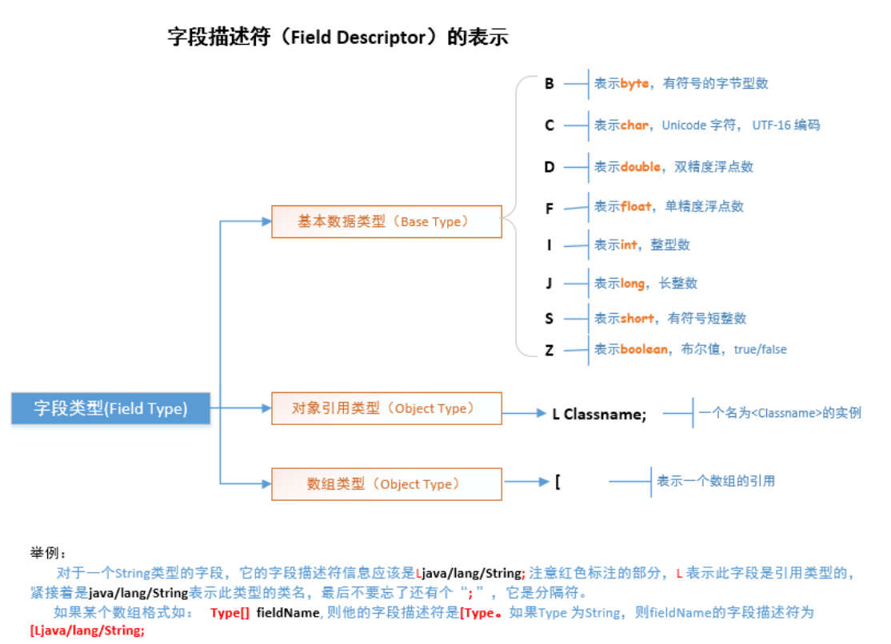

# class文件的数据类型

class文件中的描述符：[八个基本类型]
- B字节byte
- C字符char
- D double
- F float
- I int
- J long
- S short
- Z boolean





对象引用 L  比如Ljava.lang.String表示字符串String引用
[ 数组类型   比如字符串数组 [java.lang.String

## jmap -histo pid 打印每个class的实例数目，内存占用，类全名信息
```mysql
[hadoop@DEV logs]$ jmap -histo 24527 | head -30

 num     #instances         #bytes  class name
----------------------------------------------
   1:         31939       98883072  [C
   2:          8594        9461992  [B
   3:         30326        4256232  <constMethodKlass>
   4:         30326        3892592  <methodKlass>
   5:          2719        3226344  <constantPoolKlass>
   6:          2450        1948704  <constantPoolCacheKlass>
   7:          2719        1869200  <instanceKlassKlass>
   8:         27599         662376  java.lang.String
   9:           836         442968  <methodDataKlass>
  10:          8215         394320  org.apache.tomcat.util.buf.ByteChunk
  11:          3012         366720  java.lang.Class
  12:         11257         360224  java.util.HashMap$Entry
  13:          3417         273360  java.lang.reflect.Method
  14:          6763         270520  java.util.TreeMap$Entry
  15:          4326         260720  [S
  16:          5410         259680  org.apache.tomcat.util.buf.MessageBytes
  17:          6410         256400  org.apache.tomcat.util.buf.CharChunk
  18:          4558         238352  [[I
  19:          3347         211512  [Ljava.lang.Object;
  20:          2144         189280  [I
  21:           276         147936  <objArrayKlassKlass>
  22:           948         142216  [Ljava.util.HashMap$Entry;
  23:          2874         137952  java.util.HashMap
  24:           621          89424  java.text.DecimalFormat
  25:          2555          81760  java.util.concurrent.ConcurrentHashMap$HashEntry
  26:           620          69440  java.util.GregorianCalendar
  27:          1052          68936  [Ljava.lang.String;
```

其中：
- [C is a char[]
- [S is a short[]
- [I is a int[]
- [B is a byte[]
- [[I is a int[][]

上面的输出中[C对象占用Heap这么多，往往跟String有关，String其内部使用final char[]数组来保存数据的。

constMethodKlass/ methodKlass/ constantPoolKlass/ constantPoolCacheKlass/ instanceKlassKlass/ methodDataKlass与Classloader相关，常驻与Perm区;