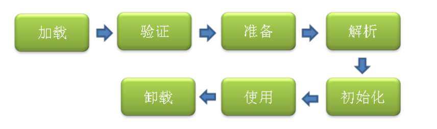
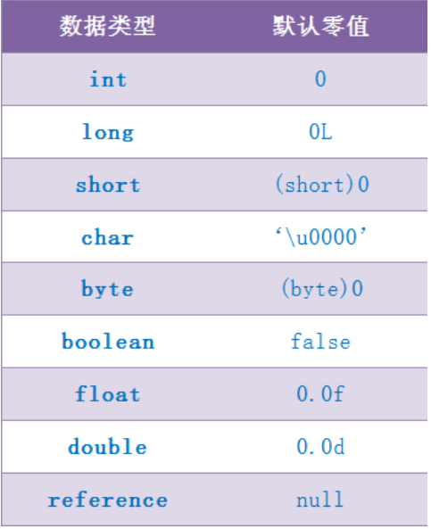
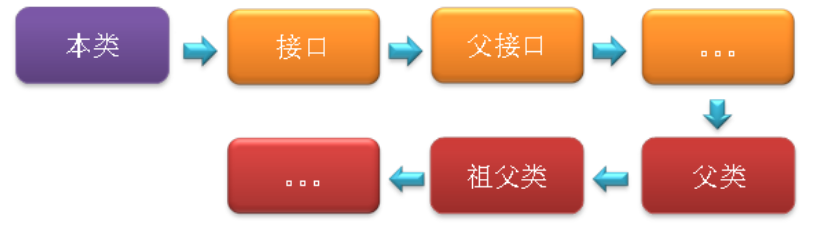

类加载机制流程详解
<!-- TOC -->

- [0、类加载过程](#0类加载过程)
- [1、加载](#1加载)
- [2、验证](#2验证)
- [3、准备](#3准备)
- [4、解析](#4解析)
- [5、初始化[类构造器和实例构造器]](#5初始化类构造器和实例构造器)
- [总结](#总结)

<!-- /TOC -->


> 参考
[【深入Java虚拟机】之四：类加载机制](https://blog.csdn.net/ns_code/article/details/17881581)


# 0、类加载过程
类从被加载到虚拟机内存中开始，到卸载出内存为止，它的整个生命周期包括：加载、验证、准备、解析、初始化、使用和卸载七个阶段。它们开始的顺序如下图所示：



其中类加载的过程包括了加载、验证、准备、解析、初始化五个阶段。在这五个阶段中，加载、验证、准备和初始化这四个阶段发生的顺序是确定的，
而解析阶段则不一定，它在某些情况下可以在初始化阶段之后开始，这是为了支持Java语言的运行时绑定（也成为动态绑定或晚期绑定）。
另外注意这里的几个阶段是按顺序开始，而不是按顺序进行或完成，因为这些阶段通常都是互相交叉地混合进行的，通常在一个阶段执行的过程中调用或激活另一个阶段。

这里简要说明下Java中的绑定：绑定指的是把一个方法的调用与方法所在的类(方法主体)关联起来，对java来说，绑定分为静态绑定和动态绑定：

- [静态绑定]：即前期绑定。在程序执行前方法已经被绑定，此时由编译器或其它连接程序实现。针对java，简单的可以理解为程序编译期的绑定。
java当中的方法只有final，static，private和构造方法是前期绑定的。

- [动态绑定]：即晚期绑定，也叫运行时绑定。在运行时根据具体对象的类型进行绑定。在java中，几乎所有的方法都是后期绑定的。

下面详细讲述类加载过程中每个阶段所做的工作。


# 1、加载
加载时类加载过程的第一个阶段，在加载阶段，虚拟机需要完成以下三件事情：
- 1、通过一个类的全限定名来获取其定义的二进制字节流。
- 2、将这个字节流所代表的静态存储结构转化为方法区的运行时数据结构。
- 3、[在Java堆中生成一个代表这个类的java.lang.Class对象，作为对方法区中这些数据的访问入口]。

注意，这里第1条中的二进制字节流并不只是单纯地从Class文件中获取，比如它还可以从Jar包中获取、从网络中获取（最典型的应用便是Applet）、由其他文件生成（JSP应用）等。

相对于类加载的其他阶段而言，加载阶段（准确地说，是加载阶段获取类的二进制字节流的动作）是可控性最强的阶段，
因为开发人员既可以使用系统提供的类加载器来完成加载，也可以自定义自己的类加载器来完成加载。

加载阶段完成后，虚拟机外部的 二进制字节流就按照虚拟机所需的格式存储在方法区之中，而且在Java堆中也创建一个java.lang.Class类的对象，这样便可以通过该对象访问方法区中的这些数据。

说到加载，不得不提到类加载器，下面就具体讲述下类加载器。

类加载器虽然只用于实现类的加载动作，但它在Java程序中起到的作用却远远不限于类的加载阶段。对于任意一个类，
都需要由它的类加载器和这个类本身一同确定其在就Java虚拟机中的唯一性，也就是说，即使两个类来源于同一个Class文件，只要加载它们的类加载器不同，那这两个类就必定不相等。这里的“相等”包括了代表类的Class对象的equals（）、isAssignableFrom（）、isInstance（）等方法的返回结果，也包括了使用instanceof关键字对对象所属关系的判定结果。

站在Java虚拟机的角度来讲，只存在两种不同的类加载器：
- 启动类加载器：它使用C++实现（这里仅限于Hotspot，也就是JDK1.5之后默认的虚拟机，有很多其他的虚拟机是用Java语言实现的），是虚拟机自身的一部分。
- 所有其他的类加载器：这些类加载器都由Java语言实现，独立于虚拟机之外，并且全部继承自抽象类java.lang.ClassLoader，
这些类加载器需要由启动类加载器加载到内存中之后才能去加载其他的类。

站在Java开发人员的角度来看，类加载器可以大致划分为以下三类：

- 启动类加载器：Bootstrap ClassLoader，跟上面相同。它负责加载存放在JDK\jre\lib(JDK代表JDK的安装目录，下同)下，或被-Xbootclasspath参数指定的路径中的，并且能被虚拟机识别的类库（如rt.jar，所有的java.*开头的类均被Bootstrap ClassLoader加载）。启动类加载器是无法被Java程序直接引用的。

- 扩展类加载器：Extension ClassLoader，该加载器由sun.misc.Launcher$ExtClassLoader实现，它负责加载JDK\jre\lib\ext目录中，或者由java.ext.dirs系统变量指定的路径中的所有类库（如javax.*开头的类），开发者可以直接使用扩展类加载器。

- 应用程序类加载器：Application ClassLoader，该类加载器由sun.misc.Launcher$AppClassLoader来实现，它负责加载用户类路径（ClassPath）所指定的类，开发者可以直接使用该类加载器，如果应用程序中没有自定义过自己的类加载器，一般情况下这个就是程序中默认的类加载器。
     
应用程序都是由这三种类加载器互相配合进行加载的，如果有必要，我们还可以加入自定义的类加载器。
因为JVM自带的ClassLoader只是懂得从本地文件系统加载标准的java class文件，因此如果编写了自己的ClassLoader，便可以做到如下几点：
- 1）在执行非置信代码之前，自动验证数字签名。
- 2）动态地创建符合用户特定需要的定制化构建类。
- 3）从特定的场所取得java class，例如数据库中和网络中。

事实上当使用Applet的时候，就用到了特定的ClassLoader，因为这时需要从网络上加载java class，并且要检查相关的安全信息，应用服务器也大都使用了自定义的ClassLoader技术。


# 2、验证

验证的目的是为了确保Class文件中的字节流包含的信息符合当前虚拟机的要求，而且不会危害虚拟机自身的安全。不同的虚拟机对类验证的实现可能会有所不同，
但大致都会完成以下四个阶段的验证：文件格式的验证、元数据的验证、字节码验证和符号引用验证。

- (1)文件格式的验证：验证字节流是否符合Class文件格式的规范，并且能被当前版本的虚拟机处理，
该验证的主要目的是保证输入的字节流能正确地解析并存储于方法区之内。经过该阶段的验证后，
字节流才会进入内存的方法区中进行存储，后面的三个验证都是基于方法区的存储结构进行的。

- (2)元数据验证：对类的元数据信息进行语义校验（其实就是对类中的各数据类型进行语法校验），保证不存在不符合Java语法规范的元数据信息。

- (3)字节码验证：该阶段验证的主要工作是进行数据流和控制流分析，对类的方法体进行校验分析，以保证被校验的类的方法在运行时不会做出危害虚拟机安全的行为。

- (4)符号引用验证：这是最后一个阶段的验证，它发生在虚拟机将符号引用转化为直接引用的时候（解析阶段中发生该转化，后面会有讲解），主要是对类自身以外的信息（常量池中的各种符号引用）进行匹配性的校验。


# 3、准备

准备阶段是正式为类变量分配内存并设置类变量初始值的阶段，这些内存都将在[方法区中分配]。对于该阶段有以下几点需要注意：

> 3.1、这时候进行内存分配的仅包括类变量（static），而不包括实例变量，实例变量会在对象实例化时随着对象一块分配在Java堆中。

> 3.2、这里所设置的初始值通常情况下是数据类型默认的零值（如0、0L、null、false等），而不是被在Java代码中被显式地赋予的值。

假设一个类变量的定义为：
public static int value = 3；
那么变量value在准备阶段过后的初始值为0，而不是3，因为这时候尚未开始执行任何Java方法，而把value赋值为3的putstatic指令是在程序编译后，
存放于[类构造器<clinit>（）]方法之中的，所以把value赋值为3的动作将在初始化阶段才会执行。

下表列出了Java中所有基本数据类型以及reference类型的默认零值：



这里还需要注意如下几点：

- (1)对基本数据类型来说，对于类变量（static）和全局变量，如果不显式地对其赋值而直接使用，则系统会为其赋予默认的零值，而对于局部变量来说，在使用前必须显式地为其赋值，否则编译时不通过。

- (2)对于同时被static和final修饰的常量，必须在声明的时候就为其显式地赋值，否则编译时不通过；而只被final修饰的常量则既可以在声明时显式地为其赋值，也可以在类初始化时显式地为其赋值，总之，在使用前必须为其显式地赋值，系统不会为其赋予默认零值。

- (3)对于引用数据类型reference来说，如数组引用、对象引用等，如果没有对其进行显式地赋值而直接使用，系统都会为其赋予默认的零值，即null。

- (4)如果在数组初始化时没有对数组中的各元素赋值，那么其中的元素将根据对应的数据类型而被赋予默认的零值。
    
> 3.3、如果类字段的字段属性表中存在ConstantValue属性，即同时被final和static修饰，那么在准备阶段变量value就会被初始化为ConstValue属性所指定的值。

假设上面的类变量value被定义为： 
public static final int value = 3；
编译时Javac将会为value生成ConstantValue属性，在准备阶段虚拟机就会根据ConstantValue的设置将value赋值为3。
我们可以理解为static final常量在编译期就将其结果放入了调用它的类的常量池中。


# 4、解析

解析阶段是虚拟机将常量池中的符号引用转化为直接引用的过程。前面说解析阶段可能开始于初始化之前，也可能在初始化之后开始，虚拟机会根据需要来判断，
到底是在类被加载器加载时就对常量池中的符号引用进行解析（初始化之前），还是等到一个符号引用将要被使用前才去解析它（初始化之后）。
对同一个符号引用进行多次解析请求时很常见的事情，虚拟机实现可能会对第一次解析的结果进行缓存（在运行时常量池中记录直接引用，并把常量标示为已解析状态），
从而避免解析动作重复进行。
解析动作主要针对类或接口、字段、类方法、接口方法四类符号引用进行，
分别对应于常量池中的CONSTANT_Class_info、CONSTANT_Fieldref_info、CONSTANT_Methodref_info、CONSTANT_InterfaceMethodref_info四种常量类型。

- 类或接口的解析：判断所要转化成的直接引用是对数组类型，还是普通的对象类型的引用，从而进行不同的解析。

- 字段解析：对字段进行解析时，会先在本类中查找是否包含有简单名称和字段描述符都与目标相匹配的字段，如果有，则查找结束；如果没有，则会按照继承关系从上往下递归搜索该类所实现的各个接口和它们的父接口，还没有，则按照继承关系从上往下递归搜索其父类，直至查找结束，
查找流程如下图所示：



从下面一段代码的执行结果中很容易看出来字段解析的搜索顺序：

```
class Super{
	public static int m = 11;
	static{
		System.out.println("执行了super类静态语句块");
	}
}
 
class Father extends Super{
	public static int m = 33;
	static{
		System.out.println("执行了父类静态语句块");
	}
}
 
class Child extends Father{
	static{
		System.out.println("执行了子类静态语句块");
	}
}
 
public class StaticTest{
	public static void main(String[] args){
		System.out.println(Child.m);
	}
}
```

执行结果如下：

```
执行了super类静态语句块
执行了父类静态语句块
33
如果注释掉Father类中对m定义的那一行，则输出结果如下：
执行了super类静态语句块
11
```
   
static变量发生在静态解析阶段，也即是初始化之前，此时已经将字段的符号引用转化为了内存引用，也便将它与对应的类关联在了一起，
由于在子类中没有查找到与m相匹配的字段，那么m便不会与子类关联在一起，因此并不会触发子类的初始化。

最后需要注意：理论上是按照上述顺序进行搜索解析，但在实际应用中，虚拟机的编译器实现可能要比上述规范要求的更严格一些。
如果有一个同名字段同时出现在该类的接口和父类中，或同时在自己或父类的接口中出现，编译器可能会拒绝编译。
如果对上面的代码做些修改，将Super改为接口，并将Child类继承Father类且实现Super接口，那么在编译时会报出如下错误：
StaticTest.java:24: 对 m 的引用不明确，Father 中的 变量 m 和 Super 中的 变量 m
都匹配
System.out.println(Child.m);                                 ^
1 错误
4.3、类方法解析：对类方法的解析与对字段解析的搜索步骤差不多，只是多了判断该方法所处的是类还是接口的步骤，而且对类方法的匹配搜索，
是先搜索父类，再搜索接口。
4.4、接口方法解析：与类方法解析步骤类似，知识接口不会有父类，因此，只递归向上搜索父接口就行了。

# 5、初始化[类构造器和实例构造器]
初始化是类加载过程的最后一步，到了此阶段，才真正开始[执行类中定义的Java程序代码]。在准备阶段，类变量已经被赋过一次系统要求的初始值，
而在初始化阶段，则是根据程序员通过程序指定的主观计划去初始化类变量和其他资源，或者可以从另一个角度来表达：初始化阶段是执行类构造器<clinit>()方法的过程。
这里简单说明下<clinit>（）方法的执行规则:
1、<clinit>（）方法是由编译器自动收集类中的所有类变量的赋值动作和静态语句块中的语句合并产生的，编译器收集的顺序是由语句在源文件中出现的顺序所决定的，
静态语句块中只能访问到定义在静态语句块之前的变量，定义在它之后的变量，在前面的静态语句中可以赋值，但是不能访问。
2、<clinit>（）方法与实例构造器<init>（）方法（类的构造函数）不同，它不需要显式地调用父类构造器，虚拟机会保证在子类的<clinit>（）方法执行之前，
父类的<clinit>（）方法已经执行完毕。因此，在虚拟机中第一个被执行的<clinit>（）方法的类肯定是java.lang.Object。
3、<clinit>（）方法对于类或接口来说并不是必须的，如果一个类中没有静态语句块，也没有对类变量的赋值操作，那么编译器可以不为这个类生成<clinit>（）方法。
4、接口中不能使用静态语句块，但仍然有类变量（final static）初始化的赋值操作，因此接口与类一样会生成<clinit>（）方法。
但是接口鱼类不同的是：执行接口的<clinit>（）方法不需要先执行父接口的<clinit>（）方法，只有当父接口中定义的变量被使用时，父接口才会被初始化。
另外，接口的实现类在初始化时也一样不会执行接口的<clinit>（）方法。
5、虚拟机会保证一个类的<clinit>（）方法在多线程环境中被正确地加锁和同步，如果多个线程同时去初始化一个类，
那么只会有一个线程去执行这个类的<clinit>（）方法，其他线程都需要阻塞等待，直到活动线程执行<clinit>（）方法完毕。
如果在一个类的<clinit>（）方法中有耗时很长的操作，那就可能造成多个线程阻塞，在实际应用中这种阻塞往往是很隐蔽的。

下面给出一个简单的例子，以便更清晰地说明如上规则：
class Father{
	public static int a = 1;
	static{
		a = 2;
	}
}
 
class Child extends Father{
	public static int b = a;
}
 
public class ClinitTest{
	public static void main(String[] args){
		System.out.println(Child.b);
	}
}
执行上面的代码，会打印出2，也就是说b的值被赋为了2。
我们来看得到该结果的步骤。首先在准备阶段为类变量分配内存并设置类变量初始值，这样A和B均被赋值为默认值0，
而后再在调用<clinit>（）方法时给他们赋予程序中指定的值。当我们调用Child.b时，触发Child的<clinit>（）方法，
根据规则2，在此之前，要先执行完其父类Father的<clinit>（）方法，又根据规则1，在执行<clinit>（）方法时，
需要按static语句或static变量赋值操作等在代码中出现的顺序来执行相关的static语句，因此当触发执行Father的<clinit>（）方法时，
会先将a赋值为1，再执行static语句块中语句，将a赋值为2，而后再执行Child类的<clinit>（）方法，这样便会将b的赋值为2.
如果我们颠倒一下Father类中“public static int a = 1;”语句和“static语句块”的顺序，程序执行后，则会打印出1。很明显是根据规则1，
执行Father的<clinit>（）方法时，根据顺序先执行了static语句块中的内容，后执行了“public static int a = 1;”语句。
另外，在颠倒二者的顺序之后，如果在static语句块中对a进行访问（比如将a赋给某个变量），在编译时将会报错，因为根据规则1，它只能对a进行赋值，而不能访问。


# 总结
整个类加载过程中，除了在加载阶段用户应用程序可以自定义类加载器参与之外，其余所有的动作完全由虚拟机主导和控制。
到了初始化才开始执行类中定义的Java程序代码（亦及字节码），但这里的执行代码只是个开端，它仅限于<clinit>（）方法。
类加载过程中主要是将Class文件（准确地讲，应该是类的二进制字节流）加载到虚拟机内存中，真正执行字节码的操作，在加载完成后才真正开始。