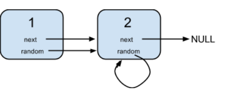

# 138. 复制带随机指针的链表

- [copy-list-with-random-pointer](https://leetcode-cn.com/problems/copy-list-with-random-pointer/)

## 描述

给定一个链表，每个节点包含一个额外增加的随机指针，该指针可以指向链表中的任何节点或空节点。

要求返回这个链表的深拷贝。 

 

示例：

输入：
{"$id":"1","next":{"$id":"2","next":null,"random":{"$ref":"2"},"val":2},"random":{"$ref":"2"},"val":1}

解释：
节点 1 的值是 1，它的下一个指针和随机指针都指向节点 2 。
节点 2 的值是 2，它的下一个指针指向 null，随机指针指向它自己。
 

提示：

- 你必须返回给定头的拷贝作为对克隆列表的引用。

## 思路

## 解析

