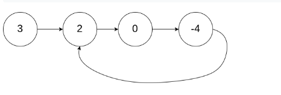
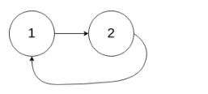
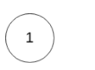

# 142. 环形链表 II

- [linked-list-cycle-ii](https://leetcode-cn.com/problems/linked-list-cycle-ii/)


## 题目描述

给定一个链表，返回链表开始入环的第一个节点。 如果链表无环，则返回 null。

为了表示给定链表中的环，我们使用整数 pos 来表示链表尾连接到链表中的位置（索引从 0 开始）。 如果 pos 是 -1，则在该链表中没有环。

说明：不允许修改给定的链表。

 

示例 1：

输入：head = [3,2,0,-4], pos = 1
输出：tail connects to node index 1
解释：链表中有一个环，其尾部连接到第二个节点。


示例 2：

输入：head = [1,2], pos = 0
输出：tail connects to node index 0
解释：链表中有一个环，其尾部连接到第一个节点。


示例 3：

输入：head = [1], pos = -1
输出：no cycle
解释：链表中没有环。


## 思路

- 思路1

假设x为从头结点到环开始的节点的距离，k为从环开始节点到相遇节点的距离，y为环的长度。两个指针slow fast，slow每次走一步，fast每次走两步，则有

t = X + nY + K

2t = X + mY + K

化简可以得到：

X+K  =  (m-2n)Y   即 (k=y-x)

或者X = (Y - K) + (m - 2n - 1)Y

则可以得到 ：从相遇节点往下走到环的开始节点的距离和从head节点到环的开始节点的距离相等。

## 解析


```
/**
 * Definition for singly-linked list.
 * class ListNode {
 *     int val;
 *     ListNode next;
 *     ListNode(int x) {
 *         val = x;
 *         next = null;
 *     }
 * }
 */
public class Solution {
    public ListNode detectCycle(ListNode head) {
        ListNode fast = head;
        ListNode slow = head;
        while (fast != null && fast.next != null) {
            fast = fast.next.next;
            slow = slow.next;
            if (fast == slow) {//说明有环
                while (head != slow) {
                    head = head.next;
                    slow = slow.next;
                }
                return head;
            }
        }
        return null;
    }
}

```
