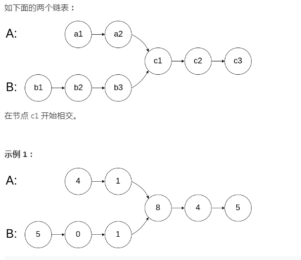
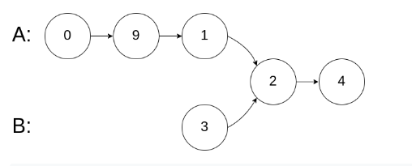
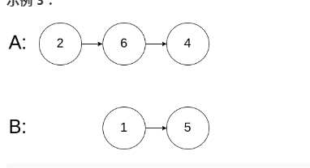

# 160. 相交链表

- [intersection-of-two-linked-lists](https://leetcode-cn.com/problems/intersection-of-two-linked-lists/)

## 题目描述
编写一个程序，找到两个单链表相交的起始节点。

如下面的两个链表：



在节点 c1 开始相交。

 

示例 1：


输入：intersectVal = 8, listA = [4,1,8,4,5], listB = [5,0,1,8,4,5], skipA = 2, skipB = 3
输出：Reference of the node with value = 8
输入解释：相交节点的值为 8 （注意，如果两个列表相交则不能为 0）。从各自的表头开始算起，链表 A 为 [4,1,8,4,5]，链表 B 为 [5,0,1,8,4,5]。在 A 中，相交节点前有 2 个节点；在 B 中，相交节点前有 3 个节点。
 

示例 2：



输入：intersectVal = 2, listA = [0,9,1,2,4], listB = [3,2,4], skipA = 3, skipB = 1
输出：Reference of the node with value = 2
输入解释：相交节点的值为 2 （注意，如果两个列表相交则不能为 0）。从各自的表头开始算起，链表 A 为 [0,9,1,2,4]，链表 B 为 [3,2,4]。在 A 中，相交节点前有 3 个节点；在 B 中，相交节点前有 1 个节点。
 

示例 3：



输入：intersectVal = 0, listA = [2,6,4], listB = [1,5], skipA = 3, skipB = 2
输出：null
输入解释：从各自的表头开始算起，链表 A 为 [2,6,4]，链表 B 为 [1,5]。由于这两个链表不相交，所以 intersectVal 必须为 0，而 skipA 和 skipB 可以是任意值。
解释：这两个链表不相交，因此返回 null。
 

注意：
如果两个链表没有交点，返回 null.
在返回结果后，两个链表仍须保持原有的结构。
可假定整个链表结构中没有循环。
程序尽量满足 O(n) 时间复杂度，且仅用 O(1) 内存。


## 思路
- 思路1：首先计算出两个链表的长度，然后用二指针法来判断是否相遇[时间复杂度N]
查找两个链表的第一个公共节点，如果两个节点的尾节点相同，肯定存在公共节点
方法： 长的链表开始多走 （h1的数量 - h2的数量）步，然后和短链表同步往下走，遇到的第一个相同的节点就是最早的公共节点

- 思路2：[时间复杂度log（M+N）]  


- 思路3：


## 答案
### 思路1

```java
/**
 * Definition for singly-linked list.
 * public class ListNode {
 *     int val;
 *     ListNode next;
 *     ListNode(int x) {
 *         val = x;
 *         next = null;
 *     }
 * }
 */
public class Solution {
    public ListNode getIntersectionNode(ListNode headA, ListNode headB) {
        if (headA == null || headB == null) {
            return null;
        }
        int sizeA = 0;
        ListNode p = headA;
        while (p != null && p.next != null ) {
            sizeA++;
            p = p.next;
        }
        
        int sizeB = 0;
        ListNode q = headB;
        while (q != null && q.next != null ) {
            sizeB++;
            q = q.next;
        }
        
        ListNode fast = null;
        ListNode slow = null;
        
        if (sizeA > sizeB) {
            fast = headA;
            slow = headB;
        } else {
            fast = headB;
            slow = headA;
        }
        
        for (int i = 0; i < Math.abs(sizeA - sizeB); i++) { //快指针先走
            fast = fast.next;
        }
        
        while (fast != null && slow != null) {
            if (fast == slow) {
                return fast;
            }
            fast = fast.next;
            slow = slow.next;
        }
        return null;
    }
}
```

## 思路2

```java
public class Solution {
//2 时间复杂度log（M+N）
    public ListNode getIntersectionNode(ListNode headA, ListNode headB) {
        //boundary check
        if(headA == null || headB == null) return null;

        ListNode a = headA;
        ListNode b = headB;

        //if a & b have different len, then we will stop the loop after second iteration
        while( a != b){
            //for the end of first iteration, we just reset the pointer to the head of another linkedlist
            a = a == null? headB : a.next;
            b = b == null? headA : b.next;   
        }

        return a;
    }

}
```

## 思路3

```java
public class Solution {
//3九章    根据找一个链表的环节点的入口
    public ListNode getIntersectionNode(ListNode headA, ListNode headB) {
        if (headA == null || headB == null) {
            return null;
        }

        // get the tail of list A.
        ListNode node = headA;
        while (node.next != null) {
            node = node.next;
        }
        node.next = headB;
        ListNode result = listCycleII(headA);
        node.next = null;
        return result;
    }

    private ListNode listCycleII(ListNode head) {
        ListNode slow = head, fast = head.next;

        while (slow != fast) {
            if (fast == null || fast.next == null) {
                return null;
            }

            slow = slow.next;
            fast = fast.next.next;
        }

        slow = head;
        fast = fast.next;
        while (slow != fast) {
            slow = slow.next;
            fast = fast.next;
        }

        return slow;
    }

}
```