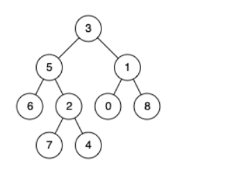

# 236. 二叉树的最近公共祖先

- [二叉树的最近公共祖先](https://leetcode-cn.com/problems/lowest-common-ancestor-of-a-binary-tree/)


## 描述

给定一个二叉树, 找到该树中两个指定节点的最近公共祖先。

百度百科中最近公共祖先的定义为：“对于有根树 T 的两个结点 p、q，最近公共祖先表示为一个结点 x，满足 x 是 p、q 的祖先且 x 的深度尽可能大（一个节点也可以是它自己的祖先）。”

例如，给定如下二叉树:  root = [3,5,1,6,2,0,8,null,null,7,4]



 

示例 1:

输入: root = [3,5,1,6,2,0,8,null,null,7,4], p = 5, q = 1
输出: 3
解释: 节点 5 和节点 1 的最近公共祖先是节点 3。

示例 2:

输入: root = [3,5,1,6,2,0,8,null,null,7,4], p = 5, q = 4
输出: 5
解释: 节点 5 和节点 4 的最近公共祖先是节点 5。因为根据定义最近公共祖先节点可以为节点本身。
 

说明:

所有节点的值都是唯一的。
p、q 为不同节点且均存在于给定的二叉树中。


## 思路
- 思路：
一旦匹配到某一个节点就把该节点返回，此子树的遍历到处结束，然后遍历该节点同层级的右子树，
如果另外一个目标节点不在右子树中，结果即为返回的左子树节点；如果另外一个目标节点在右子树中，则结果为该节点的父节点。

从根节点开始遍历，如果node1和node2中的任一个和root匹配，那么root就是最低公共祖先。 
如果都不匹配，则分别递归左、右子树，如果有一个 节点出现在左子树，并且另一个节点出现在右子树，则root就是最低公共祖先.  
如果两个节点都出现在左子树，则说明最低公共祖先在左子树中，否则在右子树。


给定一棵树，同时给出树中的两个结点(n1和n2)，求它们的最低公共祖先。也就是常见的LCA(Lowest Common Ancestor )问题。

> 方法一

下面是一个简单的复杂度为 O(n) 的算法，解决LCA问题
- 1)找到从根到n1的路径，并存储在一个向量或数组中。
- 2)找到从根到n2的路径，并存储在一个向量或数组中。
- 3)遍历这两条路径，直到遇到一个不同的节点，则前面的那个即为最低公共祖先.


>第二种方法(只遍历一次)

上面的方法虽然是O(n)，但是操作依然繁琐了一点，并且需要额外的空间来存储路径。其实可以只遍历一次，利用递归的巧妙之处。学好二叉树，其实就是学好递归。

从root开始遍历，如果n1和n2中的任一个和root匹配，那么root就是LCA。 
如果都不匹配，则分别递归左、右子树，如果有一个 key（n1或n2）出现在左子树，并且另一个key(n1或n2)出现在右子树，则root就是LCA.  
如果两个key都出现在左子树，则说明LCA在左子树中，否则在右子树。


## 答案

```java
/**
 * Definition for a binary tree node.
 * public class TreeNode {
 *     int val;
 *     TreeNode left;
 *     TreeNode right;
 *     TreeNode(int x) { val = x; }
 * }
 */
class Solution {
    public TreeNode lowestCommonAncestor(TreeNode root, TreeNode p, TreeNode q) {
        //发现目标节点则通过返回值标记该子树发现了某个目标结点 
        if (root == null || p == root || q == root) {
            return root;
        }
        //查看左子树中是否有目标结点，没有为null
        TreeNode left = lowestCommonAncestor(root.left,p,q);
        //查看右子树是否有目标节点，没有为null
        TreeNode right = lowestCommonAncestor(root.right,p,q);
         //都不为空，说明左右子树都有目标结点，则公共祖先就是本身
        if (left != null && right != null) {
            return root;
        }
        //如果发现了目标节点，则继续向上标记为该目标节点
        return left == null ? right : left;
    }
}
```
