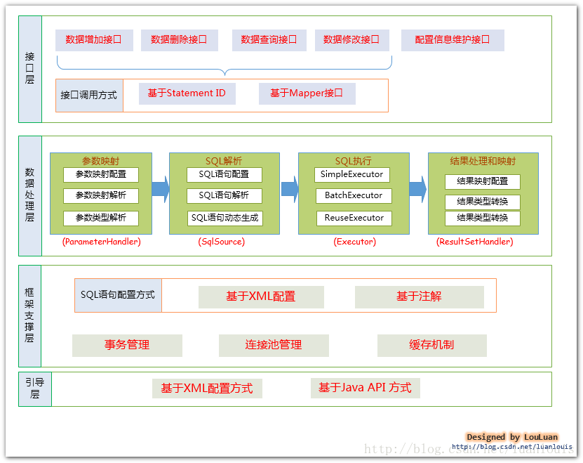
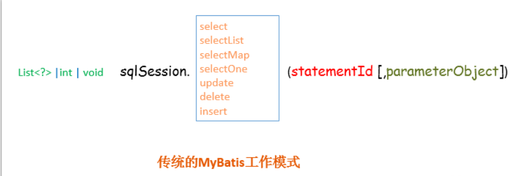
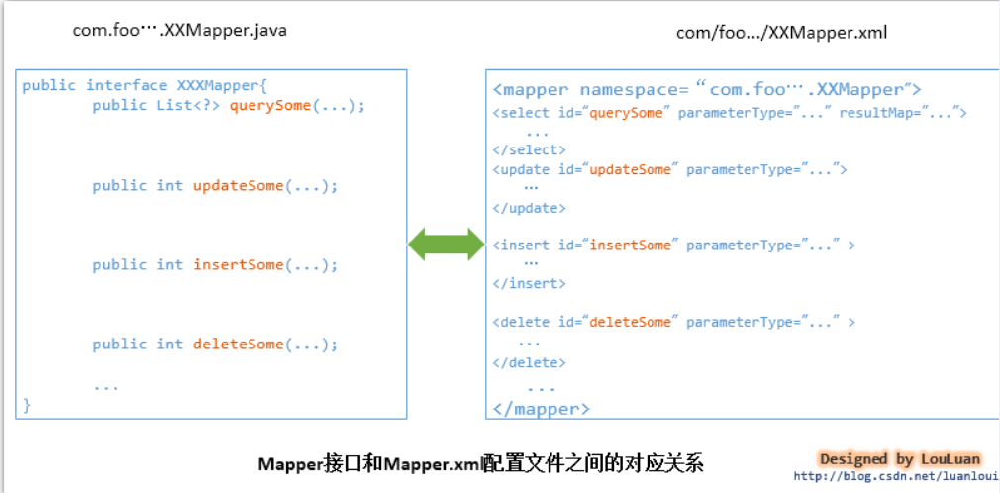
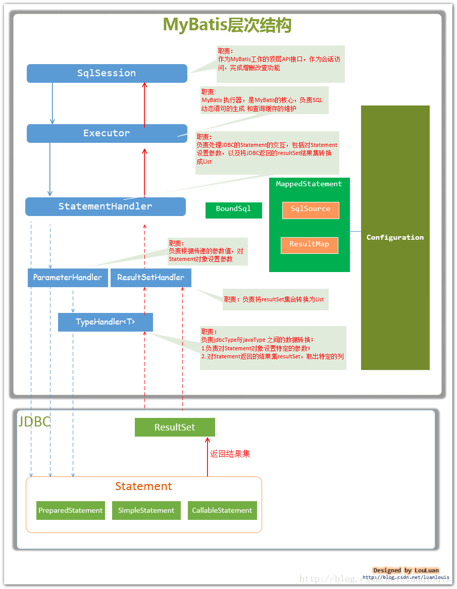
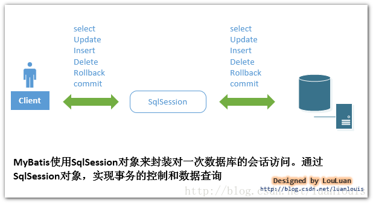

MyBatis的架构设计以及实例分析


[参考](https://blog.csdn.net/luanlouis/article/details/40422941)
[参考](https://chenjc-it.iteye.com/)

# 目录
一、MyBatis的框架设计
1.接口层---和数据库交互的方式
1.1.使用传统的MyBatis提供的API
1.2. 使用Mapper接口
2.数据处理层
2.1.参数映射和动态SQL语句生成
2.2. SQL语句的执行以及封装查询结果集成List<E>
3. 框架支撑层
3.1. 事务管理机制
3.2. 连接池管理机制
3.3. 缓存机制
3.4. SQL语句的配置方式
4、 引导层
二、MyBatis的主要构件及其相互关系
三、从MyBatis一次select 查询语句来分析MyBatis的架构设计
1.开启一个数据库访问会话---创建SqlSession对象
2.为SqlSession传递一个配置的Sql语句 的Statement Id和参数，然后返回结果
3.MyBatis执行器Executor根据SqlSession传递的参数执行query()方法
4.StatementHandler对象负责设置Statement对象中的查询参数、处理JDBC返回的resultSet，将resultSet加工为List 集合返回
5.StatementHandler 的parameterize(statement) 方法的实现
6.StatementHandler 的List<E> query(Statement statement, ResultHandler resultHandler)方法的实现
 


# 概要总结
[MyBatis的主要的核心部件有以下几个]
SqlSession            作为MyBatis工作的主要顶层API，表示和数据库交互的会话，完成必要数据库增删改查功能[connection和事务]
Executor              MyBatis执行器，是MyBatis 调度的核心，负责SQL语句的生成和查询缓存的维护
StatementHandler   封装了[JDBC Statement]操作，负责对JDBC statement 的操作，如设置参数、将Statement结果集转换成List集合。
ParameterHandler   负责对用户传递的参数转换成JDBC Statement 所需要的参数，
ResultSetHandler    负责将[JDBC返回的ResultSet]结果集对象转换成List类型的集合；
TypeHandler          负责java数据类型和jdbc数据类型之间的映射和转换
MappedStatement   MappedStatement维护了一条<select|update|delete|insert>节点的封装[封装xml的配置]
SqlSource            负责根据用户传递的parameterObject，动态地生成SQL语句，将信息封装到BoundSql对象中，并返回
BoundSql             表示动态生成的SQL语句以及相应的参数信息
Configuration        MyBatis所有的配置信息都维持在Configuration对象之中。


# MyBatis的框架设计
接口层
数据处理层
框架支撑层
引导层

        

## 接口层---和数据库交互的方式
MyBatis和数据库的交互有两种方式：
a.使用传统的MyBatis提供的API；
b. 使用Mapper接口

### 使用传统的MyBatis提供的API
这是传统的传递Statement Id 和查询参数给 SqlSession 对象，使用 SqlSession对象完成和数据库的交互；
MyBatis 提供了非常方便和简单的API，供用户实现对数据库的增删改查数据操作，以及对数据库连接信息和MyBatis 自身配置信息的维护操作。

                   
上述使用MyBatis 的方法，是创建一个和数据库打交道的SqlSession对象，然后根据Statement Id 和参数来操作数据库，这种方式固然很简单和实用，
但是它不符合面向对象语言的概念和面向接口编程的编程习惯。由于面向接口的编程是面向对象的大趋势，MyBatis 为了适应这一趋势，
增加了第二种使用MyBatis 支持接口（Interface）调用方式。

### 使用Mapper接口
MyBatis 将配置文件中的每一个<mapper> 节点抽象为一个 Mapper 接口，而这个接口中声明的方法和跟<mapper> 节点中的<select|update|delete|insert> 
节点项对应，即<select|update|delete|insert> 节点的id值为Mapper 接口中的方法名称，parameterType 值表示Mapper 对应方法的入参类型，
而resultMap 值则对应了Mapper 接口表示的返回值类型或者返回结果集的元素类型。

 
根据MyBatis 的配置规范配置好后，通过SqlSession.getMapper(XXXMapper.class) 方法，MyBatis 会根据相应的接口声明的方法信息，
通过[动态代理机制生成一个Mapper 实例]，我们使用Mapper 接口的某一个方法时，MyBatis 会根据这个方法的方法名和参数类型，确定Statement Id，
[底层还是通过SqlSession.select("statementId",parameterObject);或者SqlSession.update("statementId",parameterObject)]
等等来实现对数据库的操作；
MyBatis 引用Mapper 接口这种调用方式，纯粹是为了满足面向接口编程的需要。
（其实还有一个原因是在于，面向接口的编程，使得用户在接口上可以使用注解来配置SQL语句，这样就可以脱离XML配置文件，实现“0配置”）。

## 数据处理层
数据处理层可以说是MyBatis 的核心，从大的方面上讲，它要完成三个功能：
a. 通过传入参数构建动态SQL语句；
b. SQL语句的执行以及封装查询结果集成List<E>

### 参数映射和动态SQL语句生成
[动态语句]生成可以说是MyBatis框架非常优雅的一个设计，MyBatis 通过传入的参数值，使用 Ognl 来动态地构造SQL语句，使得MyBatis 有很强的灵活性和扩展性。
[参数映射]指的是对于java 数据类型和jdbc数据类型之间的转换：这里有包括两个过程：查询阶段，我们要将java类型的数据，转换成jdbc类型的数据，
通过 preparedStatement.setXXX() 来设值；另一个就是对resultset查询结果集的jdbcType 数据转换成java 数据类型。

### SQL语句的执行以及封装查询结果集成List<E>
 动态SQL语句生成之后，MyBatis 将执行SQL语句，并将可能返回的结果集转换成List<E> 列表。MyBatis 在对结果集的处理中，支持结果集关系一对多和多对一的转换，
 并且有两种支持方式，一种为嵌套查询语句的查询，还有一种是嵌套结果集的查询。

## 框架支撑层
### 事务管理机制
事务管理机制对于ORM框架而言是不可缺少的一部分，事务管理机制的质量也是考量一个ORM框架是否优秀的一个标准，
对于数据管理机制我已经在我的博文《深入理解mybatis原理》 MyBatis事务管理机制 中有非常详细的讨论，感兴趣的读者可以点击查看。

### 连接池管理机制
由于创建一个数据库连接所占用的资源比较大， 对于数据吞吐量大和访问量非常大的应用而言，连接池的设计就显得非常重要，
对于连接池管理机制我已经在我的博文《深入理解mybatis原理》 Mybatis数据源与连接池 中有非常详细的讨论，感兴趣的读者可以点击查看。

### 缓存机制
为了提高数据利用率和减小服务器和数据库的压力，MyBatis 会对于一些查询提供会话级别的数据缓存，会将对某一次查询，
放置到SqlSession 中，在允许的时间间隔内，对于完全相同的查询，MyBatis 会直接将缓存结果返回给用户，而不用再到数据库中查找。（至于具体的MyBatis缓存机制，我将准备专门一篇文章来讨论，敬请关注~）

### SQL语句的配置方式
传统的MyBatis 配置SQL 语句方式就是使用XML文件进行配置的，但是这种方式不能很好地支持面向接口编程的理念，为了支持面向接口的编程，
MyBatis 引入了Mapper接口的概念，面向接口的引入，对使用注解来配置SQL 语句成为可能，用户只需要在接口上添加必要的注解即可，不用再去配置XML文件了，
但是，目前的MyBatis 只是对注解配置SQL 语句提供了有限的支持，某些高级功能还是要依赖XML配置文件配置SQL 语句。

## 引导层
引导层是配置和启动MyBatis 配置信息的方式。MyBatis 提供两种方式来引导MyBatis ：基于XML配置文件的方式和基于Java API 的方式，
读者可以参考我的另一片博文：Java Persistence with MyBatis 3(中文版) 第二章 引导MyBatis

    
# MyBatis的主要构件及其相互关系
从MyBatis代码实现的角度来看，MyBatis的主要的核心部件有以下几个[不是全部]：

SqlSession            作为MyBatis工作的主要顶层API，表示和数据库交互的会话，完成必要数据库增删改查功能
Executor              MyBatis执行器，是MyBatis 调度的核心，负责SQL语句的生成和查询缓存的维护
StatementHandler   封装了JDBC Statement操作，负责对JDBC statement 的操作，如设置参数、将Statement结果集转换成List集合。
ParameterHandler   负责对用户传递的参数转换成JDBC Statement 所需要的参数，
ResultSetHandler    负责将JDBC返回的ResultSet结果集对象转换成List类型的集合；
TypeHandler          负责java数据类型和jdbc数据类型之间的映射和转换
MappedStatement   MappedStatement维护了一条<select|update|delete|insert>节点的封装， 
SqlSource            负责根据用户传递的parameterObject，动态地生成SQL语句，将信息封装到BoundSql对象中，并返回
BoundSql             表示动态生成的SQL语句以及相应的参数信息
Configuration        MyBatis所有的配置信息都维持在Configuration对象之中。

它们的关系如下图所示：



# 从MyBatis一次select 查询语句来分析MyBatis的架构设计
数据准备（非常熟悉和应用过MyBatis 的读者可以迅速浏览此节即可）

1. 准备数据库数据，创建EMPLOYEES表，插入数据：      
```sql
 --创建一个员工基本信息表
    create  table "EMPLOYEES"(
        "EMPLOYEE_ID" NUMBER(6) not null,
       "FIRST_NAME" VARCHAR2(20),
       "LAST_NAME" VARCHAR2(25) not null,
       "EMAIL" VARCHAR2(25) not null unique,
       "SALARY" NUMBER(8,2),
        constraint "EMP_EMP_ID_PK" primary key ("EMPLOYEE_ID")
    );
    comment on table EMPLOYEES is '员工信息表';
    comment on column EMPLOYEES.EMPLOYEE_ID is '员工id';
    comment on column EMPLOYEES.FIRST_NAME is 'first name';
    comment on column EMPLOYEES.LAST_NAME is 'last name';
    comment on column EMPLOYEES.EMAIL is 'email address';
    comment on column EMPLOYEES.SALARY is 'salary';
    
    --添加数据
	insert into EMPLOYEES (EMPLOYEE_ID, FIRST_NAME, LAST_NAME, EMAIL, SALARY)
	values (100, 'Steven', 'King', 'SKING', 24000.00);
	
	insert into EMPLOYEES (EMPLOYEE_ID, FIRST_NAME, LAST_NAME, EMAIL, SALARY)
	values (101, 'Neena', 'Kochhar', 'NKOCHHAR', 17000.00);
	
	insert into EMPLOYEES (EMPLOYEE_ID, FIRST_NAME, LAST_NAME, EMAIL, SALARY)
	values (102, 'Lex', 'De Haan', 'LDEHAAN', 17000.00);
	
	insert into EMPLOYEES (EMPLOYEE_ID, FIRST_NAME, LAST_NAME, EMAIL, SALARY)
	values (103, 'Alexander', 'Hunold', 'AHUNOLD', 9000.00);
	
	insert into EMPLOYEES (EMPLOYEE_ID, FIRST_NAME, LAST_NAME, EMAIL, SALARY)
	values (104, 'Bruce', 'Ernst', 'BERNST', 6000.00);
	
	insert into EMPLOYEES (EMPLOYEE_ID, FIRST_NAME, LAST_NAME, EMAIL, SALARY)
	values (105, 'David', 'Austin', 'DAUSTIN', 4800.00);
	
	insert into EMPLOYEES (EMPLOYEE_ID, FIRST_NAME, LAST_NAME, EMAIL, SALARY)
	values (106, 'Valli', 'Pataballa', 'VPATABAL', 4800.00);
	
	insert into EMPLOYEES (EMPLOYEE_ID, FIRST_NAME, LAST_NAME, EMAIL, SALARY)
	values (107, 'Diana', 'Lorentz', 'DLORENTZ', 4200.00);  
```  
  
2. 配置Mybatis的配置文件，命名为mybatisConfig.xml：

```xml
<?xml version="1.0" encoding="utf-8"?>
<!DOCTYPE configuration PUBLIC "-//mybatis.org//DTD Config 3.0//EN"
"http://mybatis.org/dtd/mybatis-3-config.dtd">
<configuration>
  <environments default="development">
    <environment id="development">
      <transactionManager type="JDBC" />
      <dataSource type="POOLED">
	 <property name="driver" value="oracle.jdbc.driver.OracleDriver" />  
         <property name="url" value="jdbc:oracle:thin:@localhost:1521:xe" />  
         <property name="username" value="louis" />  
         <property name="password" value="123456" />
      </dataSource>
    </environment>
  </environments>
    <mappers>
       <mapper  resource="com/louis/mybatis/domain/EmployeesMapper.xml"/>
    </mappers>
</configuration>
```

3.创建Employee实体Bean 以及配置Mapper配置文件
```java
package com.louis.mybatis.model;
 
import java.math.BigDecimal;
 
public class Employee {
    private Integer employeeId;
 
    private String firstName;
 
    private String lastName;
 
    private String email;
 
    private BigDecimal salary;
 
    public Integer getEmployeeId() {
        return employeeId;
    }
 
    public void setEmployeeId(Integer employeeId) {
        this.employeeId = employeeId;
    }
 
    public String getFirstName() {
        return firstName;
    }
 
    public void setFirstName(String firstName) {
        this.firstName = firstName;
    }
 
    public String getLastName() {
        return lastName;
    }
 
    public void setLastName(String lastName) {
        this.lastName = lastName;
    }
 
    public String getEmail() {
        return email;
    }
 
    public void setEmail(String email) {
        this.email = email;
    }
 
    public BigDecimal getSalary() {
        return salary;
    }
 
    public void setSalary(BigDecimal salary) {
        this.salary = salary;
    }
}
```


```xml
<?xml version="1.0" encoding="UTF-8" ?>
<!DOCTYPE mapper PUBLIC "-//mybatis.org//DTD Mapper 3.0//EN" "http://mybatis.org/dtd/mybatis-3-mapper.dtd" >
<mapper namespace="com.louis.mybatis.dao.EmployeesMapper" >
 
  <resultMap id="BaseResultMap" type="com.louis.mybatis.model.Employee" >
    <id column="EMPLOYEE_ID" property="employeeId" jdbcType="DECIMAL" />
    <result column="FIRST_NAME" property="firstName" jdbcType="VARCHAR" />
    <result column="LAST_NAME" property="lastName" jdbcType="VARCHAR" />
    <result column="EMAIL" property="email" jdbcType="VARCHAR" />
    <result column="SALARY" property="salary" jdbcType="DECIMAL" />
  </resultMap>
  
  <select id="selectByPrimaryKey" resultMap="BaseResultMap" parameterType="java.lang.Integer" >
    select 
    	EMPLOYEE_ID, FIRST_NAME, LAST_NAME, EMAIL, SALARY
    	from LOUIS.EMPLOYEES
    	where EMPLOYEE_ID = #{employeeId,jdbcType=DECIMAL}
  </select>
</mapper>
```

4. 创建eclipse 或者myeclipse 的maven项目，maven配置如下：
```xml
<project xmlns="http://maven.apache.org/POM/4.0.0" xmlns:xsi="http://www.w3.org/2001/XMLSchema-instance"
  xsi:schemaLocation="http://maven.apache.org/POM/4.0.0 http://maven.apache.org/xsd/maven-4.0.0.xsd">
  <modelVersion>4.0.0</modelVersion>
 
  <groupId>batis</groupId>
  <artifactId>batis</artifactId>
  <version>0.0.1-SNAPSHOT</version>
  <packaging>jar</packaging>
 
  <name>batis</name>
  <url>http://maven.apache.org</url>
 
  <properties>
    <project.build.sourceEncoding>UTF-8</project.build.sourceEncoding>
  </properties>
 
  <dependencies>
    <dependency>
      <groupId>junit</groupId>
      <artifactId>junit</artifactId>
      <version>3.8.1</version>
      <scope>test</scope>
    </dependency>
    <dependency>
			<groupId>org.mybatis</groupId>
			<artifactId>mybatis</artifactId>
			<version>3.2.7</version>
	</dependency>
	<dependency>
		<groupId>com.oracle</groupId>
		<artifactId>ojdbc14</artifactId>
		<version>10.2.0.4.0</version>
	</dependency>
    
  </dependencies>
</project>
```

5. 客户端代码：
```java
package com.louis.mybatis.test;
 
import java.io.InputStream;
import java.util.HashMap;
import java.util.List;
import java.util.Map;
 
import org.apache.ibatis.io.Resources;
import org.apache.ibatis.session.SqlSession;
import org.apache.ibatis.session.SqlSessionFactory;
import org.apache.ibatis.session.SqlSessionFactoryBuilder;
 
import com.louis.mybatis.model.Employee;
 
/**
 * SqlSession 简单查询演示类
 * @author louluan
 */
public class SelectDemo {
 
	public static void main(String[] args) throws Exception {
		/*
		 * 1.加载mybatis的配置文件，初始化mybatis，创建出SqlSessionFactory，是创建SqlSession的工厂
		 * 这里只是为了演示的需要，SqlSessionFactory临时创建出来，在实际的使用中，SqlSessionFactory只需要创建一次，当作单例来使用
		 */
		InputStream inputStream = Resources.getResourceAsStream("mybatisConfig.xml");
		SqlSessionFactoryBuilder builder = new SqlSessionFactoryBuilder();
		SqlSessionFactory factory = builder.build(inputStream);
		
		//2. 从SqlSession工厂 SqlSessionFactory中创建一个SqlSession，进行数据库操作
		SqlSession sqlSession = factory.openSession();
	
		//3.使用SqlSession查询
		Map<String,Object> params = new HashMap<String,Object>();
		
		params.put("min_salary",10000);
		//a.查询工资低于10000的员工
		List<Employee> result = sqlSession.selectList("com.louis.mybatis.dao.EmployeesMapper.selectByMinSalary",params);
		//b.未传最低工资，查所有员工
		List<Employee> result1 = sqlSession.selectList("com.louis.mybatis.dao.EmployeesMapper.selectByMinSalary");
		System.out.println("薪资低于10000的员工数："+result.size());
		//~output :   查询到的数据总数：5  
		System.out.println("所有员工数: "+result1.size());
		//~output :  所有员工数: 8
	}
 
}
```


[SqlSession 的工作过程分析]
## 开启一个数据库访问会话---创建SqlSession对象


SqlSession sqlSession = factory.openSession();
MyBatis封装了对数据库的访问，把对数据库的会话和事务控制放到了SqlSession对象中。


## 为SqlSession传递一个配置的Sql语句 的Statement Id和参数，然后返回结果
List<Employee> result = sqlSession.selectList("com.louis.mybatis.dao.EmployeesMapper.selectByMinSalary",params);
上述的"com.louis.mybatis.dao.EmployeesMapper.selectByMinSalary"，是配置在EmployeesMapper.xml 的Statement ID，params 是传递的查询参数。

我们来看一下sqlSession.selectList()方法的定义： 
```java
 public <E> List<E> selectList(String statement, Object parameter) {
        return this.selectList(statement, parameter, RowBounds.DEFAULT);
      }
     
      public <E> List<E> selectList(String statement, Object parameter, RowBounds rowBounds) {
        try {
          //1.根据Statement Id，在mybatis 配置对象Configuration中查找和配置文件相对应的MappedStatement	
          MappedStatement ms = configuration.getMappedStatement(statement);
          //2. 将查询任务委托给MyBatis 的执行器 Executor
          List<E> result = executor.query(ms, wrapCollection(parameter), rowBounds, Executor.NO_RESULT_HANDLER);
          return result;
        } catch (Exception e) {
          throw ExceptionFactory.wrapException("Error querying database.  Cause: " + e, e);
        } finally {
          ErrorContext.instance().reset();
        }
      }
```

MyBatis在初始化的时候，会将MyBatis的配置信息全部加载到内存中，使用org.apache.ibatis.session.Configuration实例来维护。
使用者可以使用sqlSession.getConfiguration()方法来获取。MyBatis的配置文件中配置信息的组织格式和内存中对象的组织格式几乎完全对应的。
上述例子中的

      <select id="selectByMinSalary" resultMap="BaseResultMap" parameterType="java.util.Map" >
        select 
            EMPLOYEE_ID, FIRST_NAME, LAST_NAME, EMAIL, SALARY
            from LOUIS.EMPLOYEES
            <if test="min_salary != null">
                where SALARY < #{min_salary,jdbcType=DECIMAL}
            </if>
      </select>
加载到内存中会生成一个对应的MappedStatement对象，然后会以key="com.louis.mybatis.dao.EmployeesMapper.selectByMinSalary" ，
value为MappedStatement对象的形式维护到Configuration的一个Map中。当以后需要使用的时候，只需要通过Id值来获取就可以了。
从上述的代码中我们可以看到SqlSession的职能是：
SqlSession根据Statement ID, 在mybatis配置对象Configuration中获取到对应的MappedStatement对象，然后调用mybatis执行器来执行具体的操作。

## MyBatis执行器Executor根据SqlSession传递的参数执行query()方法（由于代码过长，读者只需阅读我注释的地方即可）：
```java
 /**
    * BaseExecutor 类部分代码
    *
    */
    public <E> List<E> query(MappedStatement ms, Object parameter, RowBounds rowBounds, ResultHandler resultHandler) throws SQLException {
          
        // 1.根据具体传入的参数，动态地生成需要执行的SQL语句，用BoundSql对象表示  
        BoundSql boundSql = ms.getBoundSql(parameter);
        // 2.为当前的查询创建一个缓存Key
        CacheKey key = createCacheKey(ms, parameter, rowBounds, boundSql);
        return query(ms, parameter, rowBounds, resultHandler, key, boundSql);
     }
 
      @SuppressWarnings("unchecked")
      public <E> List<E> query(MappedStatement ms, Object parameter, RowBounds rowBounds, ResultHandler resultHandler, CacheKey key, BoundSql boundSql) throws SQLException {
        ErrorContext.instance().resource(ms.getResource()).activity("executing a query").object(ms.getId());
        if (closed) throw new ExecutorException("Executor was closed.");
        if (queryStack == 0 && ms.isFlushCacheRequired()) {
          clearLocalCache();
        }
        List<E> list;
        try {
          queryStack++;
          list = resultHandler == null ? (List<E>) localCache.getObject(key) : null;
          if (list != null) {
            handleLocallyCachedOutputParameters(ms, key, parameter, boundSql);
          } else {
            // 3.缓存中没有值，直接从数据库中读取数据  
            list = queryFromDatabase(ms, parameter, rowBounds, resultHandler, key, boundSql);
          }
        } finally {
          queryStack--;
        }
        if (queryStack == 0) {
          for (DeferredLoad deferredLoad : deferredLoads) {
            deferredLoad.load();
          }
          deferredLoads.clear(); // issue #601
          if (configuration.getLocalCacheScope() == LocalCacheScope.STATEMENT) {
            clearLocalCache(); // issue #482
          }
        }
        return list;
      }
     private <E> List<E> queryFromDatabase(MappedStatement ms, Object parameter, RowBounds rowBounds, ResultHandler resultHandler, CacheKey key, BoundSql boundSql) throws SQLException {
        List<E> list;
        localCache.putObject(key, EXECUTION_PLACEHOLDER);
        try {
            
          //4. 执行查询，返回List 结果，然后	将查询的结果放入缓存之中
          list = doQuery(ms, parameter, rowBounds, resultHandler, boundSql);
        } finally {
          localCache.removeObject(key);
        }
        localCache.putObject(key, list);
        if (ms.getStatementType() == StatementType.CALLABLE) {
          localOutputParameterCache.putObject(key, parameter);
        }
        return list;
      }

    /**
    *
    *SimpleExecutor类的doQuery()方法实现
    *
    */
      public <E> List<E> doQuery(MappedStatement ms, Object parameter, RowBounds rowBounds, ResultHandler resultHandler, BoundSql boundSql) throws SQLException {
        Statement stmt = null;
        try {
          Configuration configuration = ms.getConfiguration();
          //5. 根据既有的参数，创建StatementHandler对象来执行查询操作
          StatementHandler handler = configuration.newStatementHandler(wrapper, ms, parameter, rowBounds, resultHandler, boundSql);
          //6. 创建java.Sql.Statement对象，传递给StatementHandler对象
          stmt = prepareStatement(handler, ms.getStatementLog());
          //7. 调用StatementHandler.query()方法，返回List结果集
          return handler.<E>query(stmt, resultHandler);
        } finally {
          closeStatement(stmt);
        }
      }
```
上述的Executor.query()方法几经转折，最后会创建一个StatementHandler对象，然后将必要的参数传递给StatementHandler，使用StatementHandler来完成对数据库的查询，
最终返回List结果集。从上面的代码中我们可以看出，Executor的功能和作用是：
(1、根据传递的参数，完成SQL语句的动态解析，生成BoundSql对象，供StatementHandler使用；
(2、为查询创建缓存，以提高性能（具体它的缓存机制不是本文的重点，我会单独拿出来跟大家探讨，感兴趣的读者可以关注我的其他博文）；
(3、创建JDBC的Statement连接对象，传递给StatementHandler对象，返回List查询结果。

## StatementHandler对象负责设置Statement对象中的查询参数、处理JDBC返回的resultSet，将resultSet加工为List 集合返回：
接着上面的Executor第六步，看一下：prepareStatement() 方法的实现：
```java
   /**
    *
    *SimpleExecutor类的doQuery()方法实现
    *
    */
    public <E> List<E> doQuery(MappedStatement ms, Object parameter, RowBounds rowBounds, ResultHandler resultHandler, BoundSql boundSql) throws SQLException 
    { 
    Statement stmt = null; 
    try { 
        Configuration configuration = ms.getConfiguration(); 
        StatementHandler handler = configuration.newStatementHandler(wrapper, ms, parameter, rowBounds, resultHandler, boundSql); 
        // 1.准备Statement对象，并设置Statement对象的参数 
        stmt = prepareStatement(handler, ms.getStatementLog()); 
        // 2. StatementHandler执行query()方法，返回List结果 
        return handler.<E>query(stmt, resultHandler); 
    } finally { 
        closeStatement(stmt); 
    } 
    }
     
      private Statement prepareStatement(StatementHandler handler, Log statementLog) throws SQLException {
        Statement stmt;
        Connection connection = getConnection(statementLog);
        stmt = handler.prepare(connection);
        //对创建的Statement对象设置参数，即设置SQL 语句中 ? 设置为指定的参数
        handler.parameterize(stmt);
        return stmt;
      }
```
 以上我们可以总结StatementHandler对象主要完成两个工作：
(1. 对于JDBC的PreparedStatement类型的对象，创建的过程中，我们使用的是SQL语句字符串会包含 若干个? 占位符，我们其后再对占位符进行设值。
StatementHandler通过parameterize(statement)方法对Statement进行设值；       
(2.StatementHandler通过List<E> query(Statement statement, ResultHandler resultHandler)方法来完成执行Statement，和将Statement对象返回的resultSet封装成List；


## StatementHandler 的parameterize(statement) 方法的实现：
```java
 /**
    *   StatementHandler 类的parameterize(statement) 方法实现 
    */
    public void parameterize(Statement statement) throws SQLException {
        //使用ParameterHandler对象来完成对Statement的设值  
        parameterHandler.setParameters((PreparedStatement) statement);
      }

      /**
       * 
       *ParameterHandler类的setParameters(PreparedStatement ps) 实现
       * 对某一个Statement进行设置参数
       */
      public void setParameters(PreparedStatement ps) throws SQLException {
        ErrorContext.instance().activity("setting parameters").object(mappedStatement.getParameterMap().getId());
        List<ParameterMapping> parameterMappings = boundSql.getParameterMappings();
        if (parameterMappings != null) {
          for (int i = 0; i < parameterMappings.size(); i++) {
            ParameterMapping parameterMapping = parameterMappings.get(i);
            if (parameterMapping.getMode() != ParameterMode.OUT) {
              Object value;
              String propertyName = parameterMapping.getProperty();
              if (boundSql.hasAdditionalParameter(propertyName)) { // issue #448 ask first for additional params
                value = boundSql.getAdditionalParameter(propertyName);
              } else if (parameterObject == null) {
                value = null;
              } else if (typeHandlerRegistry.hasTypeHandler(parameterObject.getClass())) {
                value = parameterObject;
              } else {
                MetaObject metaObject = configuration.newMetaObject(parameterObject);
                value = metaObject.getValue(propertyName);
              }
              
              // 每一个Mapping都有一个TypeHandler，根据TypeHandler来对preparedStatement进行设置参数
              TypeHandler typeHandler = parameterMapping.getTypeHandler();
              JdbcType jdbcType = parameterMapping.getJdbcType();
              if (value == null && jdbcType == null) jdbcType = configuration.getJdbcTypeForNull();
              // 设置参数
              typeHandler.setParameter(ps, i + 1, value, jdbcType);
            }
          }
        }
      }
```
从上述的代码可以看到,StatementHandler 的parameterize(Statement) 方法调用了 ParameterHandler的setParameters(statement) 方法，
ParameterHandler的setParameters(Statement)方法负责 根据我们输入的参数，对statement对象的 ? 占位符处进行赋值。


## StatementHandler 的List<E> query(Statement statement, ResultHandler resultHandler)方法的实现：
```java
 /**
       * PreParedStatement类的query方法实现
       */
      public <E> List<E> query(Statement statement, ResultHandler resultHandler) throws SQLException {
        // 1.调用preparedStatemnt。execute()方法，然后将resultSet交给ResultSetHandler处理  
        PreparedStatement ps = (PreparedStatement) statement;
        ps.execute();
        //2. 使用ResultHandler来处理ResultSet
        return resultSetHandler.<E> handleResultSets(ps);
      }
      
    /**  
    *ResultSetHandler类的handleResultSets()方法实现
    *
    */
    public List<Object> handleResultSets(Statement stmt) throws SQLException {
        final List<Object> multipleResults = new ArrayList<Object>();
     
        int resultSetCount = 0;
        ResultSetWrapper rsw = getFirstResultSet(stmt);
     
        List<ResultMap> resultMaps = mappedStatement.getResultMaps();
        int resultMapCount = resultMaps.size();
        validateResultMapsCount(rsw, resultMapCount);
        
        while (rsw != null && resultMapCount > resultSetCount) {
          ResultMap resultMap = resultMaps.get(resultSetCount);
          
          //将resultSet
          handleResultSet(rsw, resultMap, multipleResults, null);
          rsw = getNextResultSet(stmt);
          cleanUpAfterHandlingResultSet();
          resultSetCount++;
        }
     
        String[] resultSets = mappedStatement.getResulSets();
        if (resultSets != null) {
          while (rsw != null && resultSetCount < resultSets.length) {
            ResultMapping parentMapping = nextResultMaps.get(resultSets[resultSetCount]);
            if (parentMapping != null) {
              String nestedResultMapId = parentMapping.getNestedResultMapId();
              ResultMap resultMap = configuration.getResultMap(nestedResultMapId);
              handleResultSet(rsw, resultMap, null, parentMapping);
            }
            rsw = getNextResultSet(stmt);
            cleanUpAfterHandlingResultSet();
            resultSetCount++;
          }
        }
     
        return collapseSingleResultList(multipleResults);
      }

```
从上述代码我们可以看出，StatementHandler 的List<E> query(Statement statement, ResultHandler resultHandler)方法的实现，
是调用了ResultSetHandler的handleResultSets(Statement) 方法。ResultSetHandler的handleResultSets(Statement) 方法会将Statement语句执行后生成的resultSet 
结果集转换成List<E> 结果集：

      //
      // DefaultResultSetHandler 类的handleResultSets(Statement stmt)实现 
      //HANDLE RESULT SETS
      //
     
      public List<Object> handleResultSets(Statement stmt) throws SQLException {
        final List<Object> multipleResults = new ArrayList<Object>();
     
        int resultSetCount = 0;
        ResultSetWrapper rsw = getFirstResultSet(stmt);
     
        List<ResultMap> resultMaps = mappedStatement.getResultMaps();
        int resultMapCount = resultMaps.size();
        validateResultMapsCount(rsw, resultMapCount);
        
        while (rsw != null && resultMapCount > resultSetCount) {
          ResultMap resultMap = resultMaps.get(resultSetCount);
          
          //将resultSet
          handleResultSet(rsw, resultMap, multipleResults, null);
          rsw = getNextResultSet(stmt);
          cleanUpAfterHandlingResultSet();
          resultSetCount++;
        }
     
        String[] resultSets = mappedStatement.getResulSets();
        if (resultSets != null) {
          while (rsw != null && resultSetCount < resultSets.length) {
            ResultMapping parentMapping = nextResultMaps.get(resultSets[resultSetCount]);
            if (parentMapping != null) {
              String nestedResultMapId = parentMapping.getNestedResultMapId();
              ResultMap resultMap = configuration.getResultMap(nestedResultMapId);
              handleResultSet(rsw, resultMap, null, parentMapping);
            }
            rsw = getNextResultSet(stmt);
            cleanUpAfterHandlingResultSet();
            resultSetCount++;
          }
        }
     
        return collapseSingleResultList(multipleResults);
      }


由于上述的过程时序图太过复杂，就不贴出来了，读者可以下载MyBatis源码, 使用Eclipse、Intellij IDEA、NetBeans 等IDE集成环境创建项目，
Debug MyBatis源码，一步步跟踪MyBatis的实现，这样对学习MyBatis框架很有帮助~
