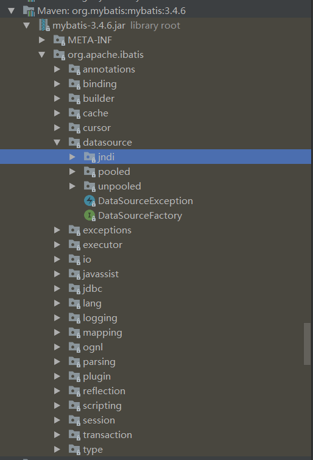
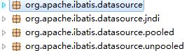
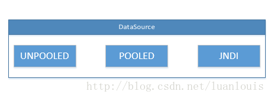
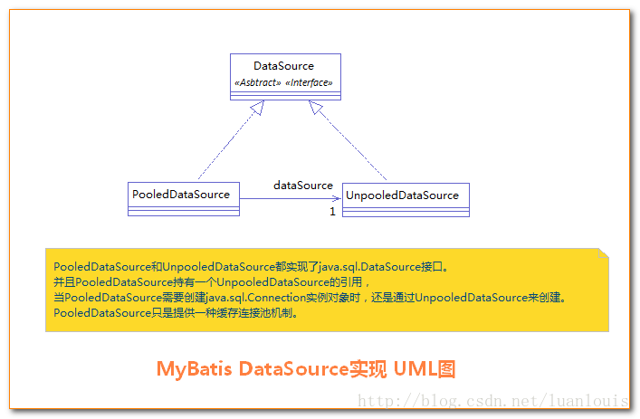
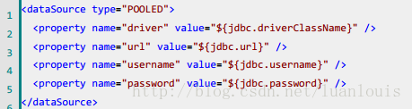
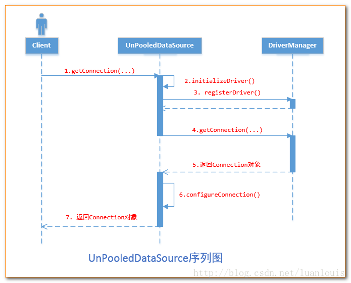
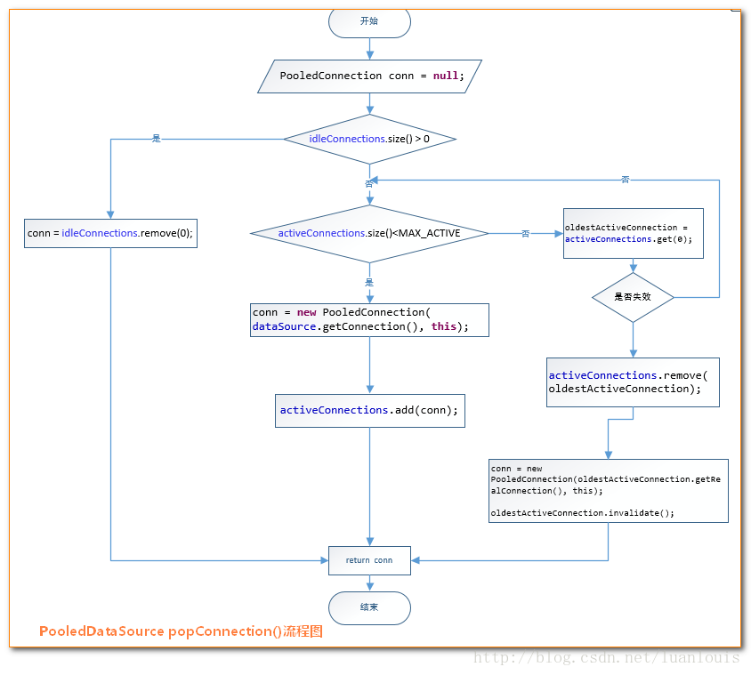

Mybatis数据源与连接池


[参考](https://blog.csdn.net/luanlouis/article/details/37671851)


一、MyBatis数据源DataSource分类
二、数据源DataSource的创建过程
三、 DataSource什么时候创建Connection对象
四、不使用连接池的UnpooledDataSource
五、为什么要使用连接池？
六、使用了连接池的PooledDataSource


mybatis3.4.6源码的包结构


# 概述  PooledConnection解析
[动态代理模式获得数据库连接池中的数据库connection]
PooledConnection 对真正数据库连接的封装
```java
class PooledConnection implements InvocationHandler {
    private static final Class<?>[] IFACES = new Class[]{Connection.class};//动态代理的接口
    private final PooledDataSource dataSource;
    private final Connection realConnection;//真正数据库连接
    private final Connection proxyConnection;//代理的数据库连接
    /../.
    //必须的两个参数，connection真正数据库连接；dataSource，用于释放连接的时候把它放回连接池
    public PooledConnection(Connection connection, PooledDataSource dataSource) { 
        this.hashCode = connection.hashCode();
        this.realConnection = connection;//真正数据库连接
        this.dataSource = dataSource;
        this.createdTimestamp = System.currentTimeMillis();
        this.lastUsedTimestamp = System.currentTimeMillis();
        this.valid = true;
        [ this.proxyConnection = (Connection)Proxy.newProxyInstance(Connection.class.getClassLoader(), IFACES, this);]  
        我们连接数据库使用的是这个代理connection
    }
/../.

public Object invoke(Object proxy, Method method, Object[] args) throws Throwable {
        String methodName = method.getName();
        if ("close".hashCode() == methodName.hashCode() && "close".equals(methodName)) {
            this.dataSource.pushConnection(this); //释放的时候把数据库连接放回连接池
            return null;
        } else {
            try {
                if (!Object.class.equals(method.getDeclaringClass())) {
                    this.checkConnection();
                }
                return method.invoke(this.realConnection, args);
            } catch (Throwable var6) {
                throw ExceptionUtil.unwrapThrowable(var6);
            }
        }
    }
}
```


本文首先会讲述MyBatis的数据源的分类，然后会介绍数据源是如何加载和使用的。紧接着将分类介绍UNPOOLED、POOLED和JNDI类型的数据源组织；
期间我们会重点讲解POOLED类型的数据源和其实现的连接池原理。

# MyBatis数据源DataSource分类
MyBatis数据源实现是在以下三个包中：




MyBatis把数据源DataSource分为三种：
UNPOOLED        不使用连接池的数据源
POOLED       使用连接池的数据源
JNDI       使用JNDI实现的数据源


相应地，MyBatis内部分别定义了实现了java.sql.DataSource接口的UnpooledDataSource，PooledDataSource类来表示UNPOOLED、POOLED类型的数据源。 如下图所示：

对于JNDI类型的数据源DataSource，则是通过JNDI上下文中取值。

# 数据源DataSource的创建过程
[MyBatis数据源DataSource对象的创建发生在MyBatis初始化的过程中]。下面让我们一步步地了解MyBatis是如何创建数据源DataSource的。
在mybatis的XML配置文件中，使用<dataSource>元素来配置数据源：


## MyBatis在初始化时，解析此文件，根据<dataSource>的type属性来创建相应类型的的数据源DataSource，即：
type=”POOLED”  ：MyBatis会创建PooledDataSource实例
type=”UNPOOLED” ：MyBatis会创建UnpooledDataSource实例
type=”JNDI”     ：MyBatis会从JNDI服务上查找DataSource实例，然后返回使用

## MyBatis是通过工厂模式来创建数据源DataSource对象的
MyBatis定义了抽象的工厂接口:org.apache.ibatis.datasource.DataSourceFactory,通过其getDataSource()方法返回数据源DataSource：定义如下：
public interface DataSourceFactory {
 
  void setProperties(Properties props);
  //生产DataSource
  DataSource getDataSource();
}
上述三种不同类型的type，则有对应的以下dataSource工厂：
POOLED        PooledDataSourceFactory
UNPOOLED     UnpooledDataSourceFactory
JNDI          JndiDataSourceFactory
其类图如下所示：


## MyBatis创建了DataSource实例后，会将其放到Configuration对象内的Environment对象中， 供以后使用。

# DataSource什么时候创建Connection对象

当我们需要创建SqlSession对象并需要执行SQL语句时，这时候MyBatis才会去调用dataSource对象来创建java.sql.Connection对象。
也就是说，java.sql.Connection对象的创建一直延迟到执行SQL语句的时候。

比如，我们有如下方法执行一个简单的SQL语句：
```java
String resource = "mybatis-config.xml";
InputStream inputStream = Resources.getResourceAsStream(resource);
SqlSessionFactory sqlSessionFactory = new SqlSessionFactoryBuilder().build(inputStream);
SqlSession sqlSession = sqlSessionFactory.openSession();
sqlSession.selectList("SELECT * FROM STUDENTS");
```

前4句都不会导致java.sql.Connection对象的创建，只有当第5句sqlSession.selectList("SELECT * FROM STUDENTS")，
才会触发MyBatis在底层执行下面这个方法来创建java.sql.Connection对象：
```java
protected void openConnection() throws SQLException {
    if (log.isDebugEnabled()) {
      log.debug("Opening JDBC Connection");
    }
    connection = dataSource.getConnection();
    if (level != null) {
      connection.setTransactionIsolation(level.getLevel());
    }
    setDesiredAutoCommit(autoCommmit);
  }
```
而对于DataSource的UNPOOLED的类型的实现-UnpooledDataSource是怎样实现getConnection()方法的呢？请看下一节。

# 不使用连接池的UnpooledDataSource
当 <dataSource>的type属性被配置成了”UNPOOLED”，MyBatis首先会实例化一个UnpooledDataSourceFactory工厂实例，
然后通过.getDataSource()方法返回一个UnpooledDataSource实例对象引用，我们假定为dataSource。
使用UnpooledDataSource的getConnection(),[每调用一次就会产生一个新的Connection实例对象]
UnPooledDataSource的getConnection()方法实现如下：
```java
 /*
    UnpooledDataSource的getConnection()实现
    */
    public Connection getConnection() throws SQLException
    {
        return doGetConnection(username, password);
    }
 
    private Connection doGetConnection(String username, String password) throws SQLException {
        //封装username和password成properties
        Properties props = new Properties();
        if (driverProperties != null)
        {
            props.putAll(driverProperties);
        }
        if (username != null)
        {
            props.setProperty("user", username);
        }
        if (password != null)
        {
            props.setProperty("password", password);
        }
        return doGetConnection(props);
    }
 
    /*
     *  获取数据连接
     */
    private Connection doGetConnection(Properties properties) throws SQLException
    {
        //1.初始化驱动
        initializeDriver();
        //2.从DriverManager中获取连接，获取新的Connection对象
        Connection connection = DriverManager.getConnection(url, properties);
        //3.配置connection属性
        configureConnection(connection);
        return connection;
    }
```

如上代码所示，UnpooledDataSource会做以下事情：
1.初始化驱动:判断driver驱动是否已经加载到内存中，如果还没有加载，则会动态地加载driver类，并实例化一个Driver对象，使用DriverManager.registerDriver()方法将其注册到内存中，以供后续使用。
2.创建Connection对象：使用DriverManager.getConnection()方法创建连接。
3.配置Connection对象：设置是否自动提交autoCommit和隔离级别isolationLevel。
4.返回Connection对象。

上述的序列图如下所示：


总结：从上述的代码中可以看到，我们每调用一次getConnection()方法，都会通过DriverManager.getConnection()返回新的java.sql.Connection实例。

# 为什么要使用连接池？

## 创建一个java.sql.Connection实例对象的代价
首先让我们来看一下创建一个java.sql.Connection对象的资源消耗。我们通过连接Oracle数据库，创建创建Connection对象，来看创建一个Connection对象、
执行SQL语句各消耗多长时间。代码如下：
```java
 public static void main(String[] args) throws Exception {
     
        String sql = "select * from hr.employees where employee_id < ? and employee_id >= ?";
        PreparedStatement st = null;
        ResultSet rs = null;
     
        long beforeTimeOffset = -1L; //创建Connection对象前时间
        long afterTimeOffset = -1L; //创建Connection对象后时间
        long executeTimeOffset = -1L; //创建Connection对象后时间
     
        Connection con = null;
        Class.forName("oracle.jdbc.driver.OracleDriver");
     
        beforeTimeOffset = new Date().getTime();
        System.out.println("before:\t" + beforeTimeOffset);
     
        con = DriverManager.getConnection("jdbc:oracle:thin:@127.0.0.1:1521:xe", "louluan", "123456");
     
        afterTimeOffset = new Date().getTime();
        System.out.println("after:\t\t" + afterTimeOffset);
        System.out.println("Create Costs:\t\t" + (afterTimeOffset - beforeTimeOffset) + " ms");
     
        st = con.prepareStatement(sql);
        //设置参数
        st.setInt(1, 101);
        st.setInt(2, 0);
        //查询，得出结果集
        rs = st.executeQuery();
        executeTimeOffset = new Date().getTime();
        System.out.println("Exec Costs:\t\t" + (executeTimeOffset - afterTimeOffset) + " ms");
     
    }
```

上述程序在我笔记本上的执行结果为：


从此结果可以清楚地看出，创建一个Connection对象，用了250 毫秒；而执行SQL的时间用了170毫秒。
创建一个Connection对象用了250毫秒！这个时间对计算机来说可以说是一个非常奢侈的！
这仅仅是一个Connection对象就有这么大的代价，设想一下另外一种情况：如果我们在Web应用程序中，为用户的每一个请求就操作一次数据库，
当有10000个在线用户并发操作的话，对计算机而言，仅仅创建Connection对象不包括做业务的时间就要损耗10000×250ms= 250 0000 ms = 2500 s = 41.6667 min,
竟然要41分钟！！！如果对高用户群体使用这样的系统，简直就是开玩笑！

## 问题分析
创建一个java.sql.Connection对象的代价是如此巨大，是因为创建一个Connection对象的过程，在底层就相当于和数据库建立的通信连接，
在建立通信连接的过程，消耗了这么多的时间，而往往我们建立连接后（即创建Connection对象后），就执行一个简单的SQL语句，然后就要抛弃掉，
这是一个非常大的资源浪费！

## 解决方案
对于需要频繁地跟数据库交互的应用程序，可以在创建了Connection对象，并操作完数据库后，可以不释放掉资源，而是将它放到内存中，
当下次需要操作数据库时，可以直接从内存中取出Connection对象，不需要再创建了，这样就极大地节省了创建Connection对象的资源消耗。
由于内存也是有限和宝贵的，这又对我们对内存中的Connection对象怎么有效地维护提出了很高的要求。
我们将在内存中存放Connection对象的容器称之为 连接池（Connection Pool）。下面让我们来看一下MyBatis的线程池是怎样实现的。


# 使用了连接池的PooledDataSource
同样地，我们也是使用PooledDataSource的getConnection()方法来返回Connection对象。现在让我们看一下它的基本原理：
PooledDataSource将java.sql.Connection对象包裹成PooledConnection对象放到了PoolState类型的容器中维护。 
MyBatis将连接池中的PooledConnection分为两种状态： 空闲状态（idle）和活动状态(active)，
这两种状态的PooledConnection对象分别被存储到PoolState容器内的idleConnections和activeConnections两个List集合中：
[idleConnections]:空闲(idle)状态PooledConnection对象被放置到此集合中，表示当前闲置的没有被使用的PooledConnection集合，
调用PooledDataSource的getConnection()方法时，会优先从此集合中取PooledConnection对象。当用完一个java.sql.Connection对象时，
MyBatis会将其包裹成PooledConnection对象放到此集合中。
[activeConnections]:活动(active)状态的PooledConnection对象被放置到名为activeConnections的ArrayList中，
表示当前正在被使用的PooledConnection集合，调用PooledDataSource的getConnection()方法时，
会优先从idleConnections集合中取PooledConnection对象,如果没有，则看此集合是否已满，如果未满，PooledDataSource会创建出一个PooledConnection，
添加到此集合中，并返回。
PoolState连接池的大致结构如下所示：


## 获取java.sql.Connection对象的过程
下面让我们看一下PooledDataSource 的getConnection()方法获取Connection对象的实现：
 ```java
public Connection getConnection() throws SQLException {
    return popConnection(dataSource.getUsername(), dataSource.getPassword()).getProxyConnection();
  }
 
  public Connection getConnection(String username, String password) throws SQLException {
    return popConnection(username, password).getProxyConnection();
  }
```

上述的popConnection()方法，会从连接池中返回一个可用的PooledConnection对象，然后再调用getProxyConnection()方法最终返回Conection对象。
（至于为什么会有getProxyConnection(),请关注下一节）
现在让我们看一下popConnection()方法到底做了什么：
1.先看是否有空闲(idle)状态下的PooledConnection对象，如果有，就直接返回一个可用的PooledConnection对象；否则进行第2步。
2.查看活动状态的PooledConnection池activeConnections是否已满；如果没有满，则创建一个新的PooledConnection对象，然后放到activeConnections池中，
然后返回此PooledConnection对象；否则进行第三步；
3.看最先进入activeConnections池中的PooledConnection对象是否已经过期：如果已经过期，从activeConnections池中移除此对象，
然后创建一个新的PooledConnection对象，添加到activeConnections中，然后将此对象返回；否则进行第4步。
4.线程等待，循环2步
```java
 /*
     * 传递一个用户名和密码，从连接池中返回可用的PooledConnection
     */
    private PooledConnection popConnection(String username, String password) throws SQLException {
        boolean countedWait = false;
        PooledConnection conn = null;
        long t = System.currentTimeMillis();
        int localBadConnectionCount = 0;
     
        while (conn == null)
        {
            synchronized (state)
            {
                if (state.idleConnections.size() > 0)
                {
                    // 连接池中有空闲连接，取出第一个
                    conn = state.idleConnections.remove(0);
                    if (log.isDebugEnabled())
                    {
                        log.debug("Checked out connection " + conn.getRealHashCode() + " from pool.");
                    }
                }
                else
                {
                    // 连接池中没有空闲连接，则取当前正在使用的连接数小于最大限定值，
                    if (state.activeConnections.size() < poolMaximumActiveConnections)
                    {
                        // 创建一个新的connection对象
                        conn = new PooledConnection(dataSource.getConnection(), this);
                        @SuppressWarnings("unused")
                        //used in logging, if enabled
                        Connection realConn = conn.getRealConnection();
                        if (log.isDebugEnabled())
                        {
                            log.debug("Created connection " + conn.getRealHashCode() + ".");
                        }
                    }
                    else
                    {
                        // Cannot create new connection 当活动连接池已满，不能创建时，取出活动连接池的第一个，即最先进入连接池的PooledConnection对象
                        // 计算它的校验时间，如果校验时间大于连接池规定的最大校验时间，则认为它已经过期了，利用这个PoolConnection内部的realConnection重新生成一个PooledConnection
                        //
                        PooledConnection oldestActiveConnection = state.activeConnections.get(0);
                        long longestCheckoutTime = oldestActiveConnection.getCheckoutTime();
                        if (longestCheckoutTime > poolMaximumCheckoutTime)
                        {
                            // Can claim overdue connection
                            state.claimedOverdueConnectionCount++;
                            state.accumulatedCheckoutTimeOfOverdueConnections += longestCheckoutTime;
                            state.accumulatedCheckoutTime += longestCheckoutTime;
                            state.activeConnections.remove(oldestActiveConnection);
                            if (!oldestActiveConnection.getRealConnection().getAutoCommit())
                            {
                                oldestActiveConnection.getRealConnection().rollback();
                            }
                            conn = new PooledConnection(oldestActiveConnection.getRealConnection(), this);
                            oldestActiveConnection.invalidate();
                            if (log.isDebugEnabled())
                            {
                                log.debug("Claimed overdue connection " + conn.getRealHashCode() + ".");
                            }
                        }
                        else
                        {
     
                            //如果不能释放，则必须等待有
                            // Must wait
                            try
                            {
                                if (!countedWait)
                                {
                                    state.hadToWaitCount++;
                                    countedWait = true;
                                }
                                if (log.isDebugEnabled())
                                {
                                    log.debug("Waiting as long as " + poolTimeToWait + " milliseconds for connection.");
                                }
                                long wt = System.currentTimeMillis();
                                state.wait(poolTimeToWait);
                                state.accumulatedWaitTime += System.currentTimeMillis() - wt;
                            }
                            catch (InterruptedException e)
                            {
                                break;
                            }
                        }
                    }
                }
     
                //如果获取PooledConnection成功，则更新其信息
     
                if (conn != null)
                {
                    if (conn.isValid())
                    {
                        if (!conn.getRealConnection().getAutoCommit())
                        {
                            conn.getRealConnection().rollback();
                        }
                        conn.setConnectionTypeCode(assembleConnectionTypeCode(dataSource.getUrl(), username, password));
                        conn.setCheckoutTimestamp(System.currentTimeMillis());
                        conn.setLastUsedTimestamp(System.currentTimeMillis());
                        state.activeConnections.add(conn);
                        state.requestCount++;
                        state.accumulatedRequestTime += System.currentTimeMillis() - t;
                    }
                    else
                    {
                        if (log.isDebugEnabled())
                        {
                            log.debug("A bad connection (" + conn.getRealHashCode() + ") was returned from the pool, getting another connection.");
                        }
                        state.badConnectionCount++;
                        localBadConnectionCount++;
                        conn = null;
                        if (localBadConnectionCount > (poolMaximumIdleConnections + 3))
                        {
                            if (log.isDebugEnabled())
                            {
                                log.debug("PooledDataSource: Could not get a good connection to the database.");
                            }
                            throw new SQLException("PooledDataSource: Could not get a good connection to the database.");
                        }
                    }
                }
            }
     
        }
     
        if (conn == null)
        {
            if (log.isDebugEnabled())
            {
                log.debug("PooledDataSource: Unknown severe error condition.  The connection pool returned a null connection.");
            }
            throw new SQLException("PooledDataSource: Unknown severe error condition.  The connection pool returned a null connection.");
        }
     
        return conn;
    }
```
对应的处理流程图如下所示：


如上所示,对于PooledDataSource的getConnection()方法内，先是调用类PooledDataSource的popConnection()方法返回了一个PooledConnection对象，
然后调用了PooledConnection的getProxyConnection()来返回Connection对象。

## java.sql.Connection对象的回收
当我们的程序中使用完Connection对象时，如果不使用数据库连接池，我们一般会调用 connection.close()方法，关闭connection连接，释放资源。如下所示：
```java
 private void test() throws ClassNotFoundException, SQLException {
        String sql = "select * from hr.employees where employee_id < ? and employee_id >= ?";
        PreparedStatement st = null;
        ResultSet rs = null;
     
        Connection con = null;
        Class.forName("oracle.jdbc.driver.OracleDriver");
        try
        {
            con = DriverManager.getConnection("jdbc:oracle:thin:@127.0.0.1:1521:xe", "louluan", "123456");
            st = con.prepareStatement(sql);
            //设置参数
            st.setInt(1, 101);
            st.setInt(2, 0);
            //查询，得出结果集
            rs = st.executeQuery();
            //取数据，省略
            //关闭，释放资源
            con.close();
        }
        catch (SQLException e)
        {
            con.close();
            e.printStackTrace();
        }
    }
```

调用过close()方法的Connection对象所持有的资源会被全部释放掉，Connection对象也就不能再使用。
那么，如果我们使用了连接池，我们在用完了Connection对象时，需要将它放在连接池中，该怎样做呢？
可能大家第一个在脑海里闪现出来的想法就是：我在应该调用con.close()方法的时候，不调用close()f方法，将其换成将Connection对象放到连接池容器中的代码！
好，我们将上述的想法实现，首先定义一个简易连接池Pool，然后将上面的代码改写：
```java
 package com.foo.jdbc;
     
    import java.sql.Connection;
    import java.sql.DriverManager;
    import java.sql.SQLException;
    import java.util.Vector;
     
    /**
     * 
     * 一个线程安全的简易连接池实现，此连接池是单例的
     *  putConnection()将Connection添加到连接池中
     *  getConnection()返回一个Connection对象
     */
    public class Pool {
     
        private static Vector<Connection> pool = new Vector<Connection>();
        
        private static int MAX_CONNECTION =100;
        
        private static String DRIVER="oracle.jdbc.driver.OracleDriver";
        private static String URL = "jdbc:oracle:thin:@127.0.0.1:1521:xe";
        private static String USERNAME = "louluan";
        private static String PASSWROD = "123456";
        
        static {
            try {
                Class.forName(DRIVER);
            } catch (ClassNotFoundException e) {
                e.printStackTrace();
            }
        }
        
        /**
         * 将一个Connection对象放置到连接池中 
         */
        public static  void putConnection(Connection connection){
            
            synchronized(pool)
            {
                if(pool.size()<MAX_CONNECTION)
                {
                    pool.add(connection);       
                }
            }
        }
        
        
        /**
         * 返回一个Connection对象，如果连接池内有元素，则pop出第一个元素；
         * 如果连接池Pool中没有元素，则创建一个connection对象，然后添加到pool中
         * @return Connection
         */
        public static Connection getConnection(){
            Connection connection = null;
            synchronized(pool)
            {
                if(pool.size()>0)
                {
                    connection = pool.get(0);
                    pool.remove(0);
                }
                else
                {
                    connection = createConnection();
                    pool.add(connection);
                }
            }
            return connection;
        }
        
        /**
         * 创建一个新的Connection对象
         */
        private static Connection createConnection()
        {
            Connection connection = null;
            try {
                connection = DriverManager.getConnection(URL, USERNAME,PASSWROD);
            } catch (SQLException e) {
                e.printStackTrace();
            }
            return connection;
        }
        
    }
```

```java
 package com.foo.jdbc;
     
    import java.sql.Connection;
    import java.sql.DriverManager;
    import java.sql.PreparedStatement;
    import java.sql.ResultSet;
    import java.sql.SQLException;
    import java.util.Vector;
     
    public class PoolTest
    {
     
        private void test() throws ClassNotFoundException, SQLException
        {
            String sql = "select * from hr.employees where employee_id < ? and employee_id >= ?";
            PreparedStatement st = null;
            ResultSet rs = null;
     
            Connection con = null;
            Class.forName("oracle.jdbc.driver.OracleDriver");
            try
            {
                con = DriverManager.getConnection("jdbc:oracle:thin:@127.0.0.1:1521:xe", "louluan", "123456");
                st = con.prepareStatement(sql);
                //设置参数
                st.setInt(1, 101);
                st.setInt(2, 0);
                //查询，得出结果集
                rs = st.executeQuery();
                //取数据，省略
                //将不再使用的Connection对象放到连接池中，供以后使用
                Pool.putConnection(con);
            }
            catch (SQLException e)
            {
                e.printStackTrace();
            }
        }
    }
```
 
上述的代码就是将我们使用过的Connection对象放到Pool连接池中，我们需要Connection对象的话，只需要使用Pool.getConnection()方法从里面取即可。
是的,上述的代码完全可以实现此能力，不过有一个很不优雅的实现：就是我们需要手动地将Connection对象放到Pool连接池中，这是一个很傻的实现方式。
这也和一般使用Connection对象的方式不一样：一般使用Connection的方式是使用完后，然后调用.close()方法释放资源。

为了和一般的使用Conneciton对象的方式保持一致，我们希望当Connection使用完后，调用.close()方法，而实际上Connection资源并没有被释放，
而实际上被添加到了连接池中。这样可以做到吗？答案是可以。上述的要求从另外一个角度来描述就是：能否提供一种机制，
让我们知道Connection对象调用了什么方法，从而根据不同的方法自定义相应的处理机制。恰好[代理机制]就可以完成上述要求.
怎样实现Connection对象调用了close()方法，而实际是将其添加到连接池中
这是要使用代理模式，为真正的Connection对象创建一个代理对象，代理对象所有的方法都是调用相应的真正Connection对象的方法实现。
当代理对象执行close()方法时，要特殊处理，不调用真正Connection对象的close()方法，而是将Connection对象添加到连接池中。

MyBatis的PooledDataSource的PoolState内部维护的对象是PooledConnection类型的对象，
而PooledConnection则是对真正的数据库连接java.sql.Connection实例对象的包裹器。
PooledConnection对象内持有一个真正的数据库连接java.sql.Connection实例对象和一个java.sql.Connection的代理：

其部分定义如下：
```java
 class PooledConnection implements InvocationHandler {
      
      /../....
      //所创建它的datasource引用
      private PooledDataSource dataSource;
      //真正的Connection对象
      private Connection realConnection;
      //代理自己的代理Connection
      private Connection proxyConnection;
      
      /../....
    }

```
PooledConenction实现了InvocationHandler接口，并且，proxyConnection对象也是根据这个它来生成的代理对象：
```java
 public PooledConnection(Connection connection, PooledDataSource dataSource) {
        this.hashCode = connection.hashCode();
        this.realConnection = connection;
        this.dataSource = dataSource;
        this.createdTimestamp = System.currentTimeMillis();
        this.lastUsedTimestamp = System.currentTimeMillis();
        this.valid = true;
        this.proxyConnection = (Connection) Proxy.newProxyInstance(Connection.class.getClassLoader(), IFACES, this);
      }
```

实际上，我们调用PooledDataSource的getConnection()方法返回的就是这个proxyConnection对象。
当我们调用此proxyConnection对象上的任何方法时，都会调用PooledConnection对象内invoke()方法。
让我们看一下PooledConnection类中的invoke()方法定义：
```java
public Object invoke(Object proxy, Method method, Object[] args) throws Throwable {
        String methodName = method.getName();
        //当调用关闭的时候，回收此Connection到PooledDataSource中
        if (CLOSE.hashCode() == methodName.hashCode() && CLOSE.equals(methodName)) {
          dataSource.pushConnection(this);
          return null;
        } else {
          try {
            if (!Object.class.equals(method.getDeclaringClass())) {
              checkConnection();
            }
            return method.invoke(realConnection, args);
          } catch (Throwable t) {
            throw ExceptionUtil.unwrapThrowable(t);
          }
        }
      }
```

从上述代码可以看到，当我们使用了pooledDataSource.getConnection()返回的Connection对象的close()方法时，不会调用真正Connection的close()方法，
而是将此Connection对象放到连接池中。

# JNDI类型的数据源DataSource
对于JNDI类型的数据源DataSource的获取就比较简单，MyBatis定义了一个JndiDataSourceFactory工厂来创建通过JNDI形式生成的DataSource。

下面让我们看一下JndiDataSourceFactory的关键代码：
```java
if (properties.containsKey(INITIAL_CONTEXT)
        && properties.containsKey(DATA_SOURCE))
{
    //从JNDI上下文中找到DataSource并返回
    Context ctx = (Context) initCtx.lookup(properties.getProperty(INITIAL_CONTEXT));
    dataSource = (DataSource) ctx.lookup(properties.getProperty(DATA_SOURCE));
}
else if (properties.containsKey(DATA_SOURCE))
{
    // //从JNDI上下文中找到DataSource并返回
    dataSource = (DataSource) initCtx.lookup(properties.getProperty(DATA_SOURCE));
```


