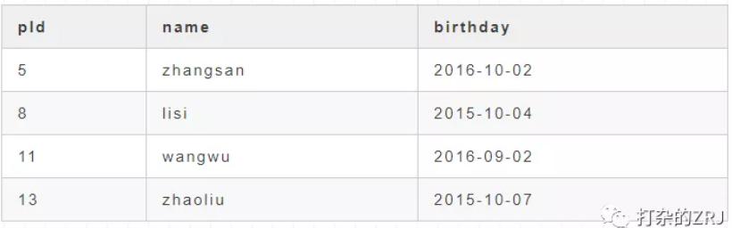
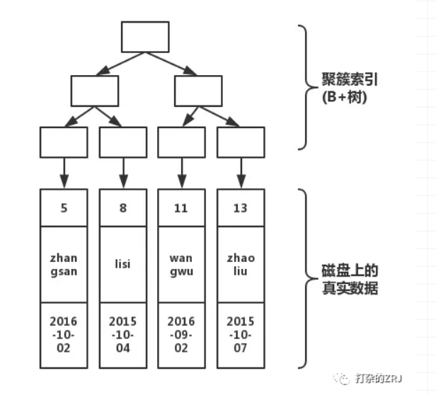
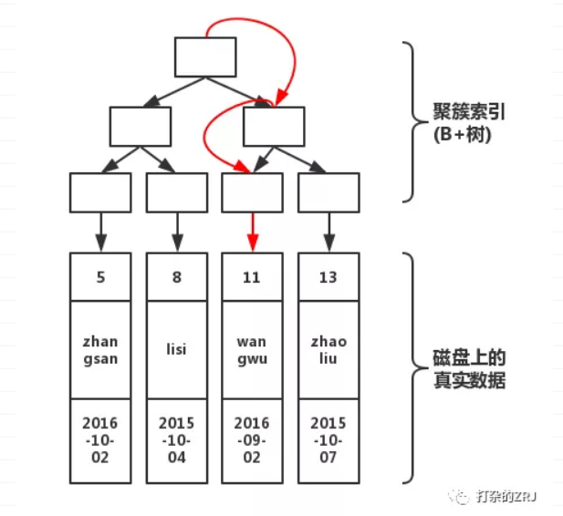
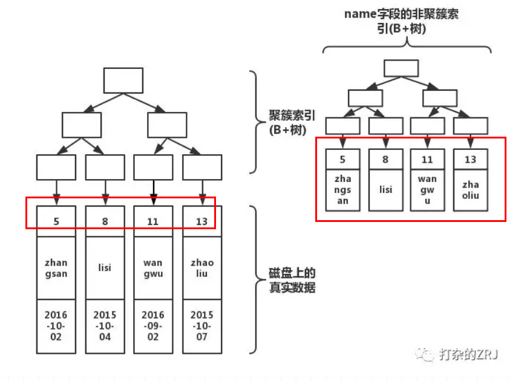
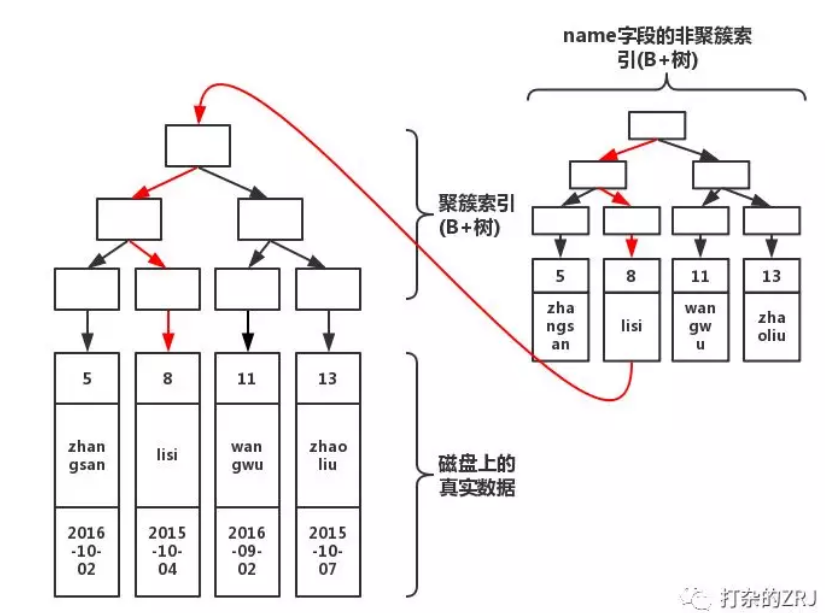
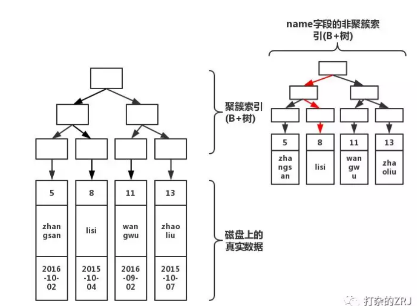
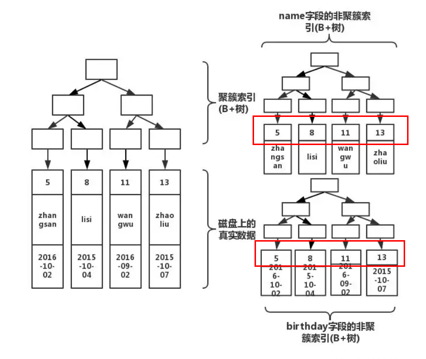
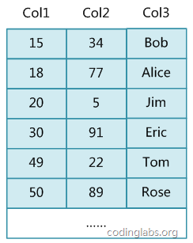
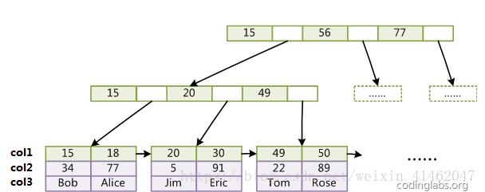
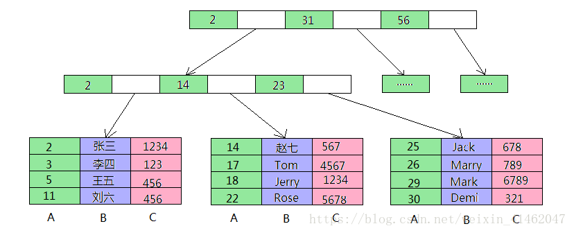

[MySQL——索引基础](www.cnblogs.com/kerrycode/p/9484559.html)
[MySQL——索引优化实战](https://mp.weixin.qq.com/s/1jnwkifOGTYJhCCwu6zwHg)
[MySQL(Innodb)索引的原理](https://mp.weixin.qq.com/s/EUxdmjEh-sTpTbyXV2P2qg)

# 索引的基础概念

## 1、什么是索引
“索引（在MySQL中也叫“键key”）是存储引擎快速找到记录的一种数据结构。” ——《高性能MySQL》

我们需要知道索引其实是一种数据结构，其功能是帮助我们快速匹配查找到需要的数据行，是数据库性能优化最常用的工具之一。
其作用相当于超市里的导购员、书本里的目录。

## 2、索引类型

可以使用SHOW INDEX FROM table_name;查看索引详情：
```sql
mysql> show index from sys_user;
+----------+------------+----------+--------------+-------------+-----------+-------------+----------+--------+------+------------+---------+---------------+
| Table    | Non_unique | Key_name | Seq_in_index | Column_name | Collation | Cardinality | Sub_part | Packed | Null | Index_type | Comment | Index_comment |
+----------+------------+----------+--------------+-------------+-----------+-------------+----------+--------+------+------------+---------+---------------+
| sys_user |          0 | PRIMARY  |            1 | user_id     | A         |           2 |     NULL | NULL   |      | BTREE      |         |               |
| sys_user |          0 | username |            1 | username    | A         |           2 |     NULL | NULL   |      | BTREE      |         |               |
| sys_user |          1 | mobile   |            1 | mobile      | A         |           2 |     NULL | NULL   | YES  | BTREE      |         |               |
+----------+------------+----------+--------------+-------------+-----------+-------------+----------+--------+------+------------+---------+---------------+
```

2.1、主键索引 PRIMARY KEY 
它是一种特殊的唯一索引，不允许有空值。一般是在建表的时候同时创建主键索引。
注意：一个表只能有一个主键
如user_id

2.2、唯一索引 UNIQUE
唯一索引列的值必须唯一，但允许有空值。如果是组合索引，则列值的组合必须唯一。
可以通过ALTER TABLE table_name ADD UNIQUE (column);创建唯一索引
可以通过ALTER TABLE table_name ADD UNIQUE (column1,column2);创建唯一组合索引

2.3、普通索引 INDEX

最基本的索引，它没有任何限制。

可以通过ALTER TABLE table_name ADD INDEX index_name (column);创建普通索引


2.4、组合索引 INDEX

组合索引，即一个索引包含多个列。多用于避免回表查询。

可以通过ALTER TABLE table_name ADD INDEX index_name(column1, column2, column3);创建组合索引


2.5、全文索引 FULLTEXT

全文索引（也称全文检索）是目前搜索引擎使用的一种关键技术。

可以通过ALTER TABLE table_name ADD FULLTEXT (column);创建全文索引

索引一经创建不能修改，如果要修改索引，只能删除重建。可以使用DROP INDEX index_name ON table_name;删除索引。

## 3、索引设计的原则
适合索引的列是出现在where子句中的列，或者连接子句中指定的列

基数较小的列，索引效果较差，没有必要在此列建立索引

使用短索引，如果对长字符串列进行索引，应该指定一个前缀长度，这样能够节省大量索引空间

不要过度索引。索引需要额外的磁盘空间，并降低写操作的性能。在修改表内容的时候，索引会进行更新甚至重构，索引列越多，这个时间就会越长。
所以只保持需要的索引有利于查询即可。


## 4、索引相关的重要概念

1、基数:单个列唯一键（distict_keys）的数量叫做基数。
SELECT COUNT(DISTINCT name),COUNT(DISTINCT gender) FROM user;

2、回表

当对一个列创建索引之后，索引会包含该列的键值及键值对应行所在的rowid。通过索引中记录的rowid访问表中的数据就叫回表。
回表次数太多会严重影响SQL性能，如果回表次数太多，就不应该走索引扫描，应该直接走全表扫描。

EXPLAIN命令结果中的Using Index意味着不会回表，通过索引就可以获得主要的数据。Using Where则意味着需要回表取数据。

3、查看索引的使用情况

有些时候虽然数据库有索引，但是并不被优化器选择使用。

我们可以通过SHOW STATUS LIKE 'Handler_read%';查看索引的使用情况：

```sql
mysql> SHOW STATUS LIKE 'Handler_read%';
+-----------------------+-------+
| Variable_name         | Value |
+-----------------------+-------+
| Handler_read_first    | 0     |
| Handler_read_key      | 0     |
| Handler_read_last     | 0     |
| Handler_read_next     | 0     |
| Handler_read_prev     | 0     |
| Handler_read_rnd      | 0     |
| Handler_read_rnd_next | 5174  |
+-----------------------+-------+
7 rows in set (0.01 sec)
```

Handler_read_key：如果索引正在工作，Handler_read_key的值将很高。

Handler_read_rnd_next：数据文件中读取下一行的请求数，如果正在进行大量的表扫描，值将较高，则说明索引利用不理想。


# B+树在数据库中的应用
为什么使用B+树？言简意赅，就是因为：
1.文件很大，不可能全部存储在内存中，故要存储到磁盘上
2.索引的结构组织要尽量减少查找过程中磁盘I/O的存取次数（为什么使用B-/+Tree，还跟磁盘存取原理有关。）
3.局部性原理与磁盘预读，预读的长度一般为页（page）的整倍数，（在许多操作系统中，页得大小通常为4k）
4.数据库系统巧妙利用了磁盘预读原理，将一个节点的大小设为等于一个页，这样每个节点只需要一次I/O就可以完全载入，
(由于节点中有两个数组，所以地址连续)。
而红黑树这种结构，h明显要深的多。由于逻辑上很近的节点（父子）物理上可能很远，无法利用局部性
 

# InnoDB 与 MyISAM 结构上的区别

1.MyISAM索引文件和数据文件是分离的，索引文件仅保存数据记录的地址。而在InnoDB中，
表数据文件本身就是按B+Tree组织的一个索引结构，这棵树的叶节点data域保存了完整的数据记录。
这个索引的key是数据表的主键，因此InnoDB表数据文件本身就是主索引，所以必须有主键，
如果没有显示定义，自动为生成一个隐含字段作为主键，这个字段长度为6个字节，类型为长整形

2.InnoDB的辅助索引（Secondary Index， 也就是非主键索引）也会包含主键列，比如名字建立索引，内部节点 会包含名字，
叶子节点会包含该名字对应的主键的值，如果主键定义的比较大，其他索引也将很大

3.MyISAM引擎使用B+Tree作为索引结构，索引文件叶节点的data域存放的是数据记录的地址，指向数据文件中对应的值，每个节点只有该索引列的值

4.MyISAM主索引和辅助索引（Secondary key）在结构上没有任何区别，只是主索引要求key是唯一的，辅助索引可以重复，
（由于MyISAM辅助索引在叶子节点上存储的是数据记录的地址，和主键索引一样，所以相对于B+的InnoDB可通过辅助索引快速找到所有的数据，
而不需要再遍历一边主键索引，所以适用于OLAP）

## InnoDB索引和MyISAM索引的区别：
一是主索引的区别，InnoDB的数据文件本身就是索引文件。而MyISAM的索引和数据是分开的。
二是辅助索引的区别：InnoDB的辅助索引data域存储相应记录主键的值而不是地址。而MyISAM的辅助索引和主索引没有多大区别。


## 1、索引简介（聚簇索引和非聚簇索引）

聚簇索引：主索引的结构和数据在一起
非聚簇索引：主索引的结构和数据不在一起

MySQL创建索引的格式：
CREATE [UNIQUE|FULLTEXT|SPATIAL] INDEX index_name
    [USING index_type]
    ON tbl_name (index_col_name,...)

index_col_name:
    col_name [(length)] [ASC | DESC]
    
创建的索引，如复合索引、前缀索引、唯一索引，都是属于非聚簇索引，在有的书籍中，又将其称为辅助索引(secondary index)。
在后文中，我们称其为非聚簇索引，其数据结构为B+树。

那么，这个聚簇索引，在Mysql中是没有语句来另外生成的。在Innodb中，Mysql中的数据是按照主键的顺序来存放的。
那么聚簇索引就是按照每张表的主键来构造一颗B+树，叶子节点存放的就是整张表的行数据。
由于表里的数据只能按照一颗B+树排序，因此一张表只能有一个聚簇索引。
在Innodb中，聚簇索引默认就是主键索引。

这个时候，机智的读者，应该要问我，如果我的表没建主键呢？
回答是，如果没有主键，则按照下列规则来建聚簇索引：
- 没有主键时，会用一个唯一且不为空的索引列做为主键，成为此表的聚簇索引
- 如果没有这样的索引，InnoDB会隐式定义一个主键来作为聚簇索引。

ps:大家还记得，自增主键和uuid作为主键的区别么？由于主键使用了聚簇索引，如果主键是自增id，
那么对应的数据一定也是相邻地存放在磁盘上的，写入性能比较高。
如果是uuid的形式，频繁的插入会使innodb频繁地移动磁盘块，写入性能就比较低了。

## 2、innodb索引原理介绍
先来一张带主键的表，如下所示，pId是主键


接下来，我们画出该表的结构图如下


如上图所示，分为上下两个部分，上半部分是由主键形成的B+树，下半部分就是磁盘上真实的数据！那么，当我们， 执行下面的语句
select * from table where pId='11'
那么，执行过程如下


如上图所示，从根开始，经过3次查找，就可以找到真实数据。如果不使用索引，那就要在磁盘上，进行逐行扫描，
直到找到数据位置。显然，使用索引速度会快。但是在写入数据的时候，需要维护这颗B+树的结构，因此写入性能会下降！
OK，接下来引入非聚簇索引!我们执行下面的语句
create index index_name on table(name);
此时结构图如下所示


大家注意看，会根据你的索引字段生成一颗新的B+树。因此， 我们每加一个索引，就会增加表的体积， 占用磁盘存储空间。
然而，注意看叶子节点，非聚簇索引的叶子节点并不是真实数据，它的叶子节点依然是索引节点，
存放的是该索引字段的值以及对应的主键索引(聚簇索引)。
如果我们执行下列语句
select * from table where name='lisi'
此时结构图如下所示


通过上图红线可以看出，先从非聚簇索引树开始查找，然后找到聚簇索引后。根据聚簇索引，在聚簇索引的B+树上，找到完整的数据！
那什么情况不去聚簇索引树上查询呢？
还记得我们的非聚簇索引树上存着该索引字段的值么。如果，此时我们执行下面的语句
select name from table where name='lisi'
此时结构图如下


如上图红线所示，如果在非聚簇索引树上找到了想要的值，就不会去聚簇索引树上查询。
当执行select col from table where col = ?，col上有索引的时候，效率比执行select * from table where col = ? 速度快好几倍！
看完上面的图，你应该对这句话有更深层的理解了。

那么这个时候，我们执行了下述语句，又会发生什么呢？
create index index_birthday on table(birthday);
此时结构图如下


看到了么，多加一个索引，就会多生成一颗非聚簇索引树。因此，很多文章才说，索引不能乱加。因为，有几个索引，就有几颗非聚簇索引树！
你在做插入操作的时候，需要同时维护这几颗树的变化！因此，如果索引太多，插入性能就会下降!

InnoDB 表是基于聚簇索引建立的。因此InnoDB 的索引能提供一种非常快速的主键查找性能。
不过，它的辅助索引（Secondary Index， 也就是非主键索引）也会包含主键列，所以，如果主键定义的比较大，其他索引也将很大
。如果想在表上定义 、很多索引，则争取尽量把主键定义得小一些。InnoDB 不会压缩索引。

文字符的ASCII码作为比较准则。聚集索引这种实现方式使得按主键的搜索十分高效，但是辅助索引搜索需要检索两遍索引：
首先检索辅助索引获得主键，然后用主键到主索引中检索获得记录。
不同存储引擎的索引实现方式对于正确使用和优化索引都非常有帮助，例如知道了InnoDB的索引实现后，
就很容易明白为什么不建议使用过长的字段作为主键，因为所有辅助索引都引用主索引，过长的主索引会令辅助索引变得过大。
再例如，用非单调的字段作为主键在InnoDB中不是个好主意，因为InnoDB数据文件本身是一颗B+Tree，
非单调的主键会造成在插入新记录时数据文件为了维持B+Tree的特性而频繁的分裂调整，十分低效，
而使用自增字段作为主键则是一个很好的选择。


## 3、MyISAM索引实现
##3.1、主键索引：

MyISAM引擎使用B+Tree作为索引结构，叶节点的data域存放的是数据记录的地址。下图是MyISAM主键索引的原理图：


这里设表一共有三列，假设我们以Col1为主键，图myisam1是一个MyISAM表的主索引（Primary key）示意。
可以看出MyISAM的索引文件仅仅保存数据记录的地址。

###3.2、辅助索引（Secondary key）
在MyISAM中，主索引和辅助索引（Secondary key）在结构上没有任何区别，只是主索引要求key是唯一的，而辅助索引的key可以重复。
如果我们在Col2上建立一个辅助索引，则此索引的结构如下图所示：


同样也是一颗B+Tree，data域保存数据记录的地址。因此，MyISAM中索引检索的算法为首先按照B+Tree搜索算法搜索索引，
如果指定的Key存在，则取出其data域的值，然后以data域的值为地址，读取相应数据记录。
MyISAM的索引方式也叫做“非聚集”的，之所以这么称呼是为了与InnoDB的聚集索引区分

## 4、组合索引

数据库表T有A，B，C三个字段，对其建立联合索引uniq(A,B,C)，请问如下查询哪些会用到索引？ 
1. SELECT * FROM T WHERE A=a AND B=b AND C=c; 
2. SELECT * FROM T WHERE A=a AND B=b; 
3. SELECT * FROM T WHERE A=a AND C=c; 
4. SELECT * FROM T WHERE B=b AND C=c;

大家都知道联合索引有最左原则。也就是说，如果联合索引的第一个列没有在WHERE语句中，
或者所查询的列其中并没有在索引中被建立。那么，这个联合索引是无效的。 
比如，上面的问题，这个索引可以被用于搜索如下所示的数据列组合： 
A，B，C 
A，B 
A

MySQL不能利用这个索引来搜索没有包含在最左前缀的内容。例如，如果你按照B或C来搜索，就不会使用到这个索引。 
如果你搜索给定的A和C的组合，该索引也是不能用于这种组合值的，尽管MySQL可以利用索引来查找匹配的A从而缩小搜索的范围。

那么，为什么是最左原则呢？ 
--------------------- 


这是一张表格，col1 是主建，col2和col3 是普通字段。 


那么，多列的索引是这样的 
 

也就是说，联合索引(col1, col2, col3)也是一棵B+树，其非叶子节点存储的是第一个关键字的索引，
而叶子节点存储的则是三个关键字col1、col2、col3三个关键字的数据，且按照col1-col2-col3的顺序进行排序。
索引还可以这么画。 

 
如果执行的是，SELECT * FROM T WHERE B=‘Tom’ AND C=4567; 
那么无法使用索引，因为索引是用A字段先排序的，如果没有先确定A，直接查找B和C，那么将会是全表查询。

如果执行的是，SELECT * FROM T WHERE A=‘30’ AND B=Demi; 
那么，会先找到A字段，再在A等于30的数据中（比如有很多条），找B等于Demi的数据。这样是可以用到索引的。

如果执行的是，SELECT * FROM T WHERE A=‘18’ AND C=1234; 
那么，A字段可以索引，而C不能索引。所以可以部分索引，也比全表查询快。

备注：觉得图11和12有点不完整，索引的最后应该有指向数据最后存放地址的链接，如何是myisam引擎，链接就是存放数据文件的物理地址；
若是innodb引擎，链接存放的就应该是主键索引的位置，大概应该如下图所示：


## 5、总结
也就是每个innodb引擎的MySQL都会存在一个B+树的聚族索引并且树的叶子保存表的数据，
其他的非聚族索引都会指向它来获取数据（在索引不能覆盖的情况下）
