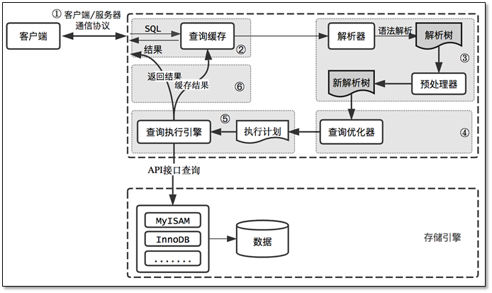

[重要]


# MySQL优化原理
[我必须得告诉大家的MySQL优化原理](https://www.jianshu.com/p/d7665192aaaf)
高性能MySQL内容

## 1、MySQL逻辑架构


MySQL逻辑架构整体分为三层，最上层为客户端层，并非MySQL所独有，诸如：连接处理、授权认证、安全等功能均在这一层处理。
MySQL大多数核心服务均在中间这一层，包括查询解析、分析、优化、缓存、内置函数(比如：时间、数学、加密等函数)。所有的跨存储引擎的功能也在这一层实现：存储过程、触发器、视图等。
最下层为存储引擎，其负责MySQL中的数据存储和提取。和Linux下的文件系统类似，每种存储引擎都有其优势和劣势。中间的服务层通过API与存储引擎通信，这些API接口屏蔽了不同存储引擎间的差异。

## 2、MySQL查询过程
我们总是希望MySQL能够获得更高的查询性能，最好的办法是弄清楚MySQL是如何优化和执行查询的。一旦理解了这一点，就会发现：很多的查询优化工作实际上就是遵循一些原则让MySQL的优化器能够按照预想的合理方式运行而已。
当向MySQL发送一个请求的时候，MySQL到底做了些什么呢？



## 3、客户端/服务端通信协议
MySQL客户端/服务端通信协议是“半双工”的：在任一时刻，要么是服务器向客户端发送数据，要么是客户端向服务器发送数据，
这两个动作不能同时发生。一旦一端开始发送消息，另一端要接收完整个消息才能响应它，所以我们无法也无须将一个消息切成小块独立发送，
也没有办法进行流量控制。

客户端用一个单独的数据包将查询请求发送给服务器，所以当查询语句很长的时候，需要设置max_allowed_packet参数。
但是需要注意的是，如果查询实在是太大，服务端会拒绝接收更多数据并抛出异常。

与之相反的是，服务器响应给用户的数据通常会很多，由多个数据包组成。
但是当服务器响应客户端请求时，客户端必须完整的接收整个返回结果，而不能简单的只取前面几条结果，然后让服务器停止发送。
因而在实际开发中，尽量保持查询简单且只返回必需的数据，减小通信间数据包的大小和数量是一个非常好的习惯，
这也是查询中尽量避免使用SELECT *以及加上LIMIT限制的原因之一。


## 4、查询缓存
在解析一个查询语句前，如果查询缓存是打开的，那么MySQL会检查这个查询语句是否命中查询缓存中的数据。
如果当前查询恰好命中查询缓存，在检查一次用户权限后直接返回缓存中的结果。这种情况下，查询不会被解析，也不会生成执行计划，更不会执行。

MySQL将缓存存放在一个引用表（不要理解成table，可以认为是类似于HashMap的数据结构），通过一个哈希值索引，
这个哈希值通过查询本身、当前要查询的数据库、客户端协议版本号等一些可能影响结果的信息计算得来。
所以两个查询在任何字符上的不同（例如：空格、注释），都会导致缓存不会命中。

如果查询中包含任何用户自定义函数、存储函数、用户变量、临时表、mysql库中的系统表，其查询结果都不会被缓存。
比如函数NOW()或者CURRENT_DATE()会因为不同的查询时间，返回不同的查询结果，
再比如包含CURRENT_USER或者CONNECION_ID()的查询语句会因为不同的用户而返回不同的结果，将这样的查询结果缓存起来没有任何的意义。

既然是缓存，就会失效，那查询缓存何时失效呢？MySQL的查询缓存系统会跟踪查询中涉及的每个表，如果这些表（数据或结构）发生变化，
那么和这张表相关的所有缓存数据都将失效。正因为如此，在任何的写操作时，MySQL必须将对应表的所有缓存都设置为失效。
如果查询缓存非常大或者碎片很多，这个操作就可能带来很大的系统消耗，甚至导致系统僵死一会儿。
而且查询缓存对系统的额外消耗也不仅仅在写操作，读操作也不例外：

- 1、任何的查询语句在开始之前都必须经过检查，即使这条SQL语句永远不会命中缓存
- 2、如果查询结果可以被缓存，那么执行完成后，会将结果存入缓存，也会带来额外的系统消耗

基于此，我们要知道并不是什么情况下查询缓存都会提高系统性能，缓存和失效都会带来额外消耗，只有当缓存带来的资源节约大于其本身消耗的资源时，
才会给系统带来性能提升。但要如何评估打开缓存是否能够带来性能提升是一件非常困难的事情，也不在本文讨论的范畴内。
如果系统确实存在一些性能问题，可以尝试打开查询缓存，并在数据库设计上做一些优化，比如：

- 1、用多个小表代替一个大表，注意不要过度设计
- 2、批量插入代替循环单条插入
- 3、合理控制缓存空间大小，一般来说其大小设置为几十兆比较合适
- 4、可以通过SQL_CACHE和SQL_NO_CACHE来控制某个查询语句是否需要进行缓存

最后的忠告是不要轻易打开查询缓存，特别是写密集型应用。如果你实在是忍不住，可以将query_cache_type设置为DEMAND，
这时只有加入SQL_CACHE的查询才会走缓存，其他查询则不会，这样可以非常自由地控制哪些查询需要被缓存。

当然查询缓存系统本身是非常复杂的，这里讨论的也只是很小的一部分，其他更深入的话题，
比如：缓存是如何使用内存的？如何控制内存的碎片化？事务对查询缓存有何影响等等，读者可以自行阅读相关资料，这里权当抛砖引玉吧。

## 5、语法解析和预处理
MySQL通过关键字将SQL语句进行解析，并生成一颗对应的解析树。这个过程解析器主要通过语法规则来验证和解析。
比如SQL中是否使用了错误的关键字或者关键字的顺序是否正确等等。预处理则会根据MySQL规则进一步检查解析树是否合法。
比如检查要查询的数据表和数据列是否存在等等。


## 6、查询优化
经过前面的步骤生成的语法树被认为是合法的了，并且由优化器将其转化成查询计划。
多数情况下，一条查询可以有很多种执行方式，最后都返回相应的结果。优化器的作用就是找到这其中最好的执行计划。
MySQL使用基于成本的优化器，它尝试预测一个查询使用某种执行计划时的成本，并选择其中成本最小的一个。
在MySQL可以通过查询当前会话的last_query_cost的值来得到其计算当前查询的成本。

```sql
mysql> select * from t_message limit 10;
...省略结果集

mysql> show status like 'last_query_cost';
+-----------------+-------------+
| Variable_name   | Value       |
+-----------------+-------------+
| Last_query_cost | 6391.799000 |
+-----------------+-------------+
```

示例中的结果表示优化器认为大概需要做6391个数据页的随机查找才能完成上面的查询。这个结果是根据一些列的统计信息计算得来的，
这些统计信息包括：每张表或者索引的页面个数、索引的基数、索引和数据行的长度、索引的分布情况等等。

有非常多的原因会导致MySQL选择错误的执行计划，比如统计信息不准确、不会考虑不受其控制的操作成本（用户自定义函数、存储过程）、
MySQL认为的最优跟我们想的不一样（我们希望执行时间尽可能短，但MySQL值选择它认为成本小的，但成本小并不意味着执行时间短）等等。

MySQL的查询优化器是一个非常复杂的部件，它使用了非常多的优化策略来生成一个最优的执行计划：

- 1、重新定义表的关联顺序（多张表关联查询时，并不一定按照SQL中指定的顺序进行，但有一些技巧可以指定关联顺序）
- 2、优化MIN()和MAX()函数（找某列的最小值，如果该列有索引，只需要查找B+Tree索引最左端，反之则可以找到最大值，具体原理见下文）
- 3、提前终止查询（比如：使用Limit时，查找到满足数量的结果集后会立即终止查询）
- 4、优化排序（在老版本MySQL会使用两次传输排序，即先读取行指针和需要排序的字段在内存中对其排序，然后再根据排序结果去读取数据行，而新版本采用的是单次传输排序，也就是一次读取所有的数据行，然后根据给定的列排序。对于I/O密集型应用，效率会高很多）

随着MySQL的不断发展，优化器使用的优化策略也在不断的进化，这里仅仅介绍几个非常常用且容易理解的优化策略，其他的优化策略，大家自行查阅吧。

## 7、查询执行引擎
在完成解析和优化阶段以后，MySQL会生成对应的执行计划，查询执行引擎根据执行计划给出的指令逐步执行得出结果。
整个执行过程的大部分操作均是通过调用存储引擎实现的接口来完成，这些接口被称为handler API。查询过程中的每一张表由一个handler实例表示。
实际上，MySQL在查询优化阶段就为每一张表创建了一个handler实例，优化器可以根据这些实例的接口来获取表的相关信息，
包括表的所有列名、索引统计信息等。存储引擎接口提供了非常丰富的功能，但其底层仅有几十个接口，这些接口像搭积木一样完成了一次查询的大部分操作。


## 8、返回结果给客户端
查询执行的最后一个阶段就是将结果返回给客户端。即使查询不到数据，MySQL仍然会返回这个查询的相关信息，比如该查询影响到的行数以及执行时间等等。
如果查询缓存被打开且这个查询可以被缓存，MySQL也会将结果存放到缓存中。
结果集返回客户端是一个增量且逐步返回的过程。有可能MySQL在生成第一条结果时，就开始向客户端逐步返回结果集了。
这样服务端就无须存储太多结果而消耗过多内存，也可以让客户端第一时间获得返回结果。
需要注意的是，结果集中的每一行都会以一个满足①中所描述的通信协议的数据包发送，再通过TCP协议进行传输，
在传输过程中，可能对MySQL的数据包进行缓存然后批量发送。

回头总结一下MySQL整个查询执行过程，总的来说分为5个步骤：

- 1、客户端向MySQL服务器发送一条查询请求
- 2、服务器首先检查查询缓存，如果命中缓存，则立刻返回存储在缓存中的结果。否则进入下一阶段
- 3、服务器进行SQL解析、预处理、再由优化器生成对应的执行计划
- 4、MySQL根据执行计划，调用存储引擎的API来执行查询
- 5、将结果返回给客户端，同时缓存查询结果

## 9、性能优化建议

看了这么多，你可能会期待给出一些优化手段，是的，下面会从3个不同方面给出一些优化建议。但请等等，还有一句忠告要先送给你：
不要听信你看到的关于优化的“绝对真理”，包括本文所讨论的内容，而应该是在实际的业务场景下通过测试来验证你关于执行计划以及响应时间的假设。

### 9.1、Scheme设计与数据类型优化
选择数据类型只要遵循小而简单的原则就好，越小的数据类型通常会更快，占用更少的磁盘、内存，处理时需要的CPU周期也更少。
越简单的数据类型在计算时需要更少的CPU周期，比如，整型就比字符操作代价低，因而会使用整型来存储ip地址，使用DATETIME来存储时间，而不是使用字符串。

这里总结几个可能容易理解错误的技巧：

- 1、通常来说把可为NULL的列改为NOT NULL不会对性能提升有多少帮助，只是如果计划在列上创建索引，就应该将该列设置为NOT NULL。
- 2、对整数类型指定宽度，比如INT(11)，没有任何卵用。INT使用32位（4个字节）存储空间，那么它的表示范围已经确定，所以INT(1)和INT(20)对于存储和计算是相同的。

- 3、UNSIGNED表示不允许负值，大致可以使正数的上限提高一倍。比如TINYINT存储范围是-128 ~ 127，而UNSIGNED TINYINT存储的范围却是0 - 255。
- 4、通常来讲，没有太大的必要使用DECIMAL数据类型。即使是在需要存储财务数据时，仍然可以使用BIGINT。比如需要精确到万分之一，那么可以将数据乘以一百万然后使用BIGINT存储。这样可以避免浮点数计算不准确和DECIMAL精确计算代价高的问题。

- 5、TIMESTAMP使用4个字节存储空间，DATETIME使用8个字节存储空间。因而，TIMESTAMP只能表示1970 - 2038年，比DATETIME表示的范围小得多，而且TIMESTAMP的值因时区不同而不同。
- 6、大多数情况下没有使用枚举类型的必要，其中一个缺点是枚举的字符串列表是固定的，添加和删除字符串（枚举选项）必须使用ALTER TABLE（如果只只是在列表末尾追加元素，不需要重建表）。
- 7、schema的列不要太多。原因是存储引擎的API工作时需要在服务器层和存储引擎层之间通过行缓冲格式拷贝数据，然后在服务器层将缓冲内容解码成各个列，这个转换过程的代价是非常高的。如果列太多而实际使用的列又很少的话，有可能会导致CPU占用过高。
- 8、大表ALTER TABLE非常耗时，MySQL执行大部分修改表结果操作的方法是用新的结构创建一个张空表，从旧表中查出所有的数据插入新表，然后再删除旧表。尤其当内存不足而表又很大，而且还有很大索引的情况下，耗时更久。当然有一些奇技淫巧可以解决这个问题，有兴趣可自行查阅。

### 9.2、创建高性能索引
索引是提高MySQL查询性能的一个重要途径，但过多的索引可能会导致过高的磁盘使用率以及过高的内存占用，从而影响应用程序的整体性能。
应当尽量避免事后才想起添加索引，因为事后可能需要监控大量的SQL才能定位到问题所在，而且添加索引的时间肯定是远大于初始添加索引所需要的时间，
可见索引的添加也是非常有技术含量的。

接下来将向你展示一系列创建高性能索引的策略，以及每条策略其背后的工作原理。但在此之前，先了解与索引相关的一些算法和数据结构，将有助于更好的理解后文的内容。

#### 索引相关的数据结构和算法

通常我们所说的索引是指B-Tree索引，它是目前关系型数据库中查找数据最为常用和有效的索引，大多数存储引擎都支持这种索引。
使用B-Tree这个术语，是因为MySQL在CREATE TABLE或其它语句中使用了这个关键字，但实际上不同的存储引擎可能使用不同的数据结构，比如InnoDB就是使用的B+Tree。

B+Tree中的B是指balance，意为平衡。需要注意的是，B+树索引并不能找到一个给定键值的具体行，它找到的只是被查找数据行所在的页，接着数据库会把页读入到内存，
再在内存中进行查找，最后得到要查找的数据。

在介绍B+Tree前，先了解一下二叉查找树，它是一种经典的数据结构，其左子树的值总是小于根的值，右子树的值总是大于根的值，如下图①。
如果要在这课树中查找值为5的记录，其大致流程：先找到根，其值为6，大于5，所以查找左子树，找到3，而5大于3，接着找3的右子树，总共找了3次。
同样的方法，如果查找值为8的记录，也需要查找3次。所以二叉查找树的平均查找次数为(3 + 3 + 3 + 2 + 2 + 1) / 6 = 2.3次，
而顺序查找的话，查找值为2的记录，仅需要1次，但查找值为8的记录则需要6次，所以顺序查找的平均查找次数为：(1 + 2 + 3 + 4 + 5 + 6) / 6 = 3.3次，
因此大多数情况下二叉查找树的平均查找速度比顺序查找要快。


由于二叉查找树可以任意构造，同样的值，可以构造出如图②的二叉查找树，显然这棵二叉树的查询效率和顺序查找差不多。
若想二叉查找数的查询性能最高，需要这棵二叉查找树是平衡的，也即平衡二叉树（AVL树）。

平衡二叉树首先需要符合二叉查找树的定义，其次必须满足任何节点的两个子树的高度差不能大于1。
显然图②不满足平衡二叉树的定义，而图①是一课平衡二叉树。平衡二叉树的查找性能是比较高的（性能最好的是最优二叉树），查询性能越好，维护的成本就越大。
比如图①的平衡二叉树，当用户需要插入一个新的值9的节点时，就需要做出如下变动。


通过一次左旋操作就将插入后的树重新变为平衡二叉树是最简单的情况了，实际应用场景中可能需要旋转多次。
至此我们可以考虑一个问题，平衡二叉树的查找效率还不错，实现也非常简单，相应的维护成本还能接受，为什么MySQL索引不直接使用平衡二叉树？

随着数据库中数据的增加，索引本身大小随之增加，不可能全部存储在内存中，因此索引往往以索引文件的形式存储的磁盘上。
这样的话，索引查找过程中就要产生磁盘I/O消耗，相对于内存存取，I/O存取的消耗要高几个数量级。可以想象一下一棵几百万节点的二叉树的深度是多少？
如果将这么大深度的一颗二叉树放磁盘上，每读取一个节点，需要一次磁盘的I/O读取，整个查找的耗时显然是不能够接受的。那么如何减少查找过程中的I/O存取次数？


一种行之有效的解决方法是减少树的深度，将二叉树变为m叉树（多路搜索树），而B+Tree就是一种多路搜索树。
理解B+Tree时，只需要理解其最重要的两个特征即可：
第一，所有的关键字（可以理解为数据）都存储在叶子节点（Leaf Page），非叶子节点（Index Page）并不存储真正的数据，所有记录节点都是按键值大小顺序存放在同一层叶子节点上。
第二，所有的叶子节点由指针连接。如下图为高度为2的简化了的B+Tree。


怎么理解这两个特征？MySQL将每个节点的大小设置为一个页的整数倍（原因下文会介绍），也就是在节点空间大小一定的情况下，每个节点可以存储更多的内结点，
这样每个结点能索引的范围更大更精确。所有的叶子节点使用指针链接的好处是可以进行区间访问，比如上图中，如果查找大于20而小于30的记录，只需要找到节点20，
就可以遍历指针依次找到25、30。如果没有链接指针的话，就无法进行区间查找。这也是MySQL使用B+Tree作为索引存储结构的重要原因。

MySQL为何将节点大小设置为页的整数倍，这就需要理解磁盘的存储原理。磁盘本身存取就比主存慢很多，在加上机械运动损耗（特别是普通的机械硬盘），
磁盘的存取速度往往是主存的几百万分之一，为了尽量减少磁盘I/O，磁盘往往不是严格按需读取，而是每次都会预读，即使只需要一个字节，磁盘也会从这个位置开始，
顺序向后读取一定长度的数据放入内存，预读的长度一般为页的整数倍。

```
页是计算机管理存储器的逻辑块，硬件及OS往往将主存和磁盘存储区分割为连续的大小相等的块，每个存储块称为一页（许多OS中，页的大小通常为4K）。
主存和磁盘以页为单位交换数据。当程序要读取的数据不在主存中时，会触发一个缺页异常，此时系统会向磁盘发出读盘信号，
磁盘会找到数据的起始位置并向后连续读取一页或几页载入内存中，然后一起返回，程序继续运行。
```

MySQL巧妙利用了磁盘预读原理，将一个节点的大小设为等于一个页，这样每个节点只需要一次I/O就可以完全载入。为了达到这个目的，每次新建节点时，
直接申请一个页的空间，这样就保证一个节点物理上也存储在一个页里，加之计算机存储分配都是按页对齐的，就实现了读取一个节点只需一次I/O。
假设B+Tree的高度为h，一次检索最多需要h-1次I/O（根节点常驻内存），复杂度O(h) = O(logmN)。
实际应用场景中，M通常较大，常常超过100，因此树的高度一般都比较小，通常不超过3。

最后简单了解下B+Tree节点的操作，在整体上对索引的维护有一个大概的了解，虽然索引可以大大提高查询效率，但维护索引仍要花费很大的代价，因此合理的创建索引也就尤为重要。
仍以上面的树为例，我们假设每个节点只能存储4个内节点。首先要插入第一个节点28，如下图所示。


接着插入下一个节点70，在Index Page中查询后得知应该插入到50 - 70之间的叶子节点，但叶子节点已满，这时候就需要进行页分裂的操作，
当前的叶子节点起点为50，所以根据中间值来拆分叶子节点，如下图所示。


最后插入一个节点95，这时候Index Page和Leaf Page都满了，就需要做两次拆分，如下图所示。


拆分后最终形成了这样一颗树。


B+Tree为了保持平衡，对于新插入的值需要做大量的拆分页操作，而页的拆分需要I/O操作，为了尽可能的减少页的拆分操作，B+Tree也提供了类似于平衡二叉树的旋转功能。
当Leaf Page已满但其左右兄弟节点没有满的情况下，B+Tree并不急于去做拆分操作，而是将记录移到当前所在页的兄弟节点上。
通常情况下，左兄弟会被先检查用来做旋转操作。就比如上面第二个示例，当插入70的时候，并不会去做页拆分，而是左旋操作。


通过旋转操作可以最大限度的减少页分裂，从而减少索引维护过程中的磁盘的I/O操作，也提高索引维护效率。
需要注意的是，删除节点跟插入节点类似，仍然需要旋转和拆分操作，这里就不再说明。

#### 高性能策略
通过上文，相信你对B+Tree的数据结构已经有了大致的了解，但MySQL中索引是如何组织数据的存储呢？以一个简单的示例来说明，假如有如下数据表：
```sql
CREATE TABLE People(
    last_name varchar(50) not null,
    first_name varchar(50) not null,
    dob date not null,
    gender enum(`m`,`f`) not null,
    key(last_name,first_name,dob)
);
```

对于表中每一行数据，索引中包含了last_name、first_name、dob列的值，下图展示了索引是如何组织数据存储的。


可以看到，索引首先根据第一个字段来排列顺序，当名字相同时，则根据第三个字段，即出生日期来排序，正是因为这个原因，才有了索引的“最左原则”。

1、MySQL不会使用索引的情况：非独立的列
“独立的列”是指索引列不能是表达式的一部分，也不能是函数的参数。比如：
select * from where id + 1 = 5

我们很容易看出其等价于 id = 4，但是MySQL无法自动解析这个表达式，使用函数是同样的道理。

2、前缀索引
如果列很长，通常可以索引开始的部分字符，这样可以有效节约索引空间，从而提高索引效率。

3、多列索引和索引顺序
在多数情况下，在多个列上建立独立的索引并不能提高查询性能。理由非常简单，MySQL不知道选择哪个索引的查询效率更好，所以在老版本，
比如MySQL5.0之前就会随便选择一个列的索引，而新的版本会采用合并索引的策略。
举个简单的例子，在一张电影演员表中，在actor_id和film_id两个列上都建立了独立的索引，然后有如下查询：
select film_id,actor_id from film_actor where actor_id = 1 or film_id = 1

老版本的MySQL会随机选择一个索引，但新版本做如下的优化：
select film_id,actor_id from film_actor where actor_id = 1  
union all 
select film_id,actor_id from film_actor where film_id = 1 and actor_id <> 1


当出现多个索引做相交操作时（多个AND条件），通常来说一个包含所有相关列的索引要优于多个独立索引。
当出现多个索引做联合操作时（多个OR条件），对结果集的合并、排序等操作需要耗费大量的CPU和内存资源，特别是当其中的某些索引的选择性不高，
需要返回合并大量数据时，查询成本更高。所以这种情况下还不如走全表扫描。

因此explain时如果发现有索引合并（Extra字段出现Using union），应该好好检查一下查询和表结构是不是已经是最优的，
如果查询和表都没有问题，那只能说明索引建的非常糟糕，应当慎重考虑索引是否合适，有可能一个包含所有相关列的多列索引更适合。

前面我们提到过索引如何组织数据存储的，从图中可以看到多列索引时，索引的顺序对于查询是至关重要的，很明显应该把选择性更高的字段放到索引的前面，
这样通过第一个字段就可以过滤掉大多数不符合条件的数据。

索引选择性是指不重复的索引值和数据表的总记录数的比值，选择性越高查询效率越高，因为选择性越高的索引可以让MySQL在查询时过滤掉更多的行。
唯一索引的选择性是1，这是最好的索引选择性，性能也是最好的。

理解索引选择性的概念后，就不难确定哪个字段的选择性较高了，查一下就知道了，比如：
SELECT * FROM payment where staff_id = 2 and customer_id = 584

是应该创建(staff_id,customer_id)的索引还是应该颠倒一下顺序？执行下面的查询，哪个字段的选择性更接近1就把哪个字段索引前面就好。
select count(distinct staff_id)/count(*) as staff_id_selectivity,
       count(distinct customer_id)/count(*) as customer_id_selectivity,
       count(*) from payment

多数情况下使用这个原则没有任何问题，但仍然注意你的数据中是否存在一些特殊情况。举个简单的例子，比如要查询某个用户组下有过交易的用户信息：
select user_id from trade where user_group_id = 1 and trade_amount > 0

MySQL为这个查询选择了索引(user_group_id,trade_amount)，如果不考虑特殊情况，这看起来没有任何问题，
但实际情况是这张表的大多数数据都是从老系统中迁移过来的，由于新老系统的数据不兼容，所以就给老系统迁移过来的数据赋予了一个默认的用户组。
这种情况下，通过索引扫描的行数跟全表扫描基本没什么区别，索引也就起不到任何作用。
推广开来说，经验法则和推论在多数情况下是有用的，可以指导我们开发和设计，但实际情况往往会更复杂，实际业务场景下的某些特殊情况可能会摧毁你的整个设计。

4、避免多个范围条件
实际开发中，我们会经常使用多个范围条件，比如想查询某个时间段内登录过的用户：
select user.* from user where login_time > '2017-04-01' and age between 18 and 30;

这个查询有一个问题：它有两个范围条件，login_time列和age列，MySQL可以使用login_time列的索引或者age列的索引，但无法同时使用它们。


5、覆盖索引
如果一个索引包含或者说覆盖所有需要查询的字段的值，那么就没有必要再回表查询，这就称为覆盖索引。
覆盖索引是非常有用的工具，可以极大的提高性能，因为查询只需要扫描索引会带来许多好处：

索引条目远小于数据行大小，如果只读取索引，极大减少数据访问量
索引是有按照列值顺序存储的，对于I/O密集型的范围查询要比随机从磁盘读取每一行数据的IO要少的多

6、使用索引扫描来排序
MySQL有两种方式可以生产有序的结果集，
其一是对结果集进行排序的操作，
其二是按照索引顺序扫描得出的结果自然是有序的。如果explain的结果中type列的值为index表示使用了索引扫描来做排序。

扫描索引本身很快，因为只需要从一条索引记录移动到相邻的下一条记录。但如果索引本身不能覆盖所有需要查询的列，
那么就不得不每扫描一条索引记录就回表查询一次对应的行。这个读取操作基本上是随机I/O，因此按照索引顺序读取数据的速度通常要比顺序地全表扫描要慢。
在设计索引时，如果一个索引既能够满足排序，又满足查询，是最好的。
只有当索引的列顺序和ORDER BY子句的顺序完全一致，并且所有列的排序方向也一样时，才能够使用索引来对结果做排序。
如果查询需要关联多张表，则只有ORDER BY子句引用的字段全部为第一张表时，才能使用索引做排序。
ORDER BY子句和查询的限制是一样的，都要满足最左前缀的要求（有一种情况例外，就是最左的列被指定为常数，下面是一个简单的示例），
其他情况下都需要执行排序操作，而无法利用索引排序。

// 最左列为常数，索引：(date,staff_id,customer_id)
select  staff_id,customer_id from demo where date = '2015-06-01' order by staff_id,customer_id


7、冗余和重复索引
冗余索引是指在相同的列上按照相同的顺序创建的相同类型的索引，应当尽量避免这种索引，发现后立即删除。
比如有一个索引(A,B)，再创建索引(A)就是冗余索引。冗余索引经常发生在为表添加新索引时，比如有人新建了索引(A,B)，但这个索引不是扩展已有的索引(A)。

大多数情况下都应该尽量扩展已有的索引而不是创建新索引。但有极少情况下出现性能方面的考虑需要冗余索引，比如扩展已有索引而导致其变得过大，
从而影响到其他使用该索引的查询。

8、删除长期未使用的索引
定期删除一些长时间未使用过的索引是一个非常好的习惯。
关于索引这个话题打算就此打住，最后要说一句，索引并不总是最好的工具，只有当索引帮助提高查询速度带来的好处大于其带来的额外工作时，索引才是有效的。
对于非常小的表，简单的全表扫描更高效。对于中到大型的表，索引就非常有效。对于超大型的表，建立和维护索引的代价随之增长，
这时候其他技术也许更有效，比如分区表。最后的最后，explain后再提测是一种美德。


### 3、特定类型查询优化

#### 优化COUNT()查询

COUNT()可能是被大家误解最多的函数了，它有两种不同的作用，其一是统计某个列值的数量，其二是统计行数。统计列值时，要求列值是非空的，它不会统计NULL。
如果确认括号中的表达式不可能为空时，实际上就是在统计行数。最简单的就是当使用COUNT(*)时，并不是我们所想象的那样扩展成所有的列，
实际上，它会忽略所有的列而直接统计行数。

我们最常见的误解也就在这儿，在括号内指定了一列却希望统计结果是行数，而且还常常误以为前者的性能会更好。
但实际并非这样，如果要统计行数，直接使用COUNT(*)，意义清晰，且性能更好。
有时候某些业务场景并不需要完全精确的COUNT值，可以用近似值来代替，EXPLAIN出来的行数就是一个不错的近似值，而且执行EXPLAIN并不需要真正地去执行查询，
所以成本非常低。通常来说，执行COUNT()都需要扫描大量的行才能获取到精确的数据，因此很难优化，MySQL层面还能做得也就只有覆盖索引了。
如果不还能解决问题，只有从架构层面解决了，比如添加汇总表，或者使用redis这样的外部缓存系统。

#### 优化关联查询

在大数据场景下，表与表之间通过一个冗余字段来关联，要比直接使用JOIN有更好的性能。如果确实需要使用关联查询的情况下，需要特别注意的是：

1、确保ON和USING字句中的列上有索引。在创建索引的时候就要考虑到关联的顺序。当表A和表B用列c关联的时候，
如果优化器关联的顺序是A、B，那么就不需要在A表的对应列上创建索引。没有用到的索引会带来额外的负担，
一般来说，除非有其他理由，只需要在关联顺序中的第二张表的相应列上创建索引（具体原因下文分析）。

2、确保任何的GROUP BY和ORDER BY中的表达式只涉及到一个表中的列，这样MySQL才有可能使用索引来优化。

要理解优化关联查询的第一个技巧，就需要理解MySQL是如何执行关联查询的。当前MySQL关联执行的策略非常简单，它对任何的关联都执行嵌套循环关联操作，
即先在一个表中循环取出单条数据，然后在嵌套循环到下一个表中寻找匹配的行，依次下去，直到找到所有表中匹配的行为为止。
然后根据各个表匹配的行，返回查询中需要的各个列。
太抽象了？以上面的示例来说明，比如有这样的一个查询：
SELECT A.xx,B.yy 
FROM A INNER JOIN B USING(c)
WHERE A.xx IN (5,6)

假设MySQL按照查询中的关联顺序A、B来进行关联操作，那么可以用下面的伪代码表示MySQL如何完成这个查询：
outer_iterator = SELECT A.xx,A.c FROM A WHERE A.xx IN (5,6);
outer_row = outer_iterator.next;
while(outer_row) {
    inner_iterator = SELECT B.yy FROM B WHERE B.c = outer_row.c;
    inner_row = inner_iterator.next;
    while(inner_row) {
        output[inner_row.yy,outer_row.xx];
        inner_row = inner_iterator.next;
    }
    outer_row = outer_iterator.next;
}

可以看到，最外层的查询是根据A.xx列来查询的，A.c上如果有索引的话，整个关联查询也不会使用。
再看内层的查询，很明显B.c上如果有索引的话，能够加速查询，因此只需要在关联顺序中的第二张表的相应列上创建索引即可。

#### 优化LIMIT分页

当需要分页操作时，通常会使用LIMIT加上偏移量的办法实现，同时加上合适的ORDER BY字句。如果有对应的索引，通常效率会不错，否则，MySQL需要做大量的文件排序操作。
一个常见的问题是当偏移量非常大的时候，比如：LIMIT 10000 20这样的查询，MySQL需要查询10020条记录然后只返回20条记录，前面的10000条都将被抛弃，这样的代价非常高。
优化这种查询一个最简单的办法就是尽可能的使用覆盖索引扫描，而不是查询所有的列。然后根据需要做一次关联查询再返回所有的列。
对于偏移量很大时，这样做的效率会提升非常大。考虑下面的查询：
SELECT film_id,description FROM film ORDER BY title LIMIT 50,5;

如果这张表非常大，那么这个查询最好改成下面的样子：
SELECT film.film_id,film.description
FROM film INNER JOIN (
    SELECT film_id FROM film ORDER BY title LIMIT 50,5
) AS tmp USING(film_id);

这里的延迟关联将大大提升查询效率，让MySQL扫描尽可能少的页面，获取需要访问的记录后在根据关联列回原表查询所需要的列。
有时候如果可以使用书签记录上次取数据的位置，那么下次就可以直接从该书签记录的位置开始扫描，这样就可以避免使用OFFSET，比如下面的查询：
SELECT id FROM t LIMIT 10000, 10;
改为：
SELECT id FROM t WHERE id > 10000 LIMIT 10;

其他优化的办法还包括使用预先计算的汇总表，或者关联到一个冗余表，冗余表中只包含主键列和需要做排序的列。

#### 优化UNION
MySQL处理UNION的策略是先创建临时表，然后再把各个查询结果插入到临时表中，最后再来做查询。
因此很多优化策略在UNION查询中都没有办法很好的时候。经常需要手动将WHERE、LIMIT、ORDER BY等字句“下推”到各个子查询中，以便优化器可以充分利用这些条件先优化。
除非确实需要服务器去重，否则就一定要使用UNION ALL，如果没有ALL关键字，MySQL会给临时表加上DISTINCT选项，这会导致整个临时表的数据做唯一性检查，
这样做的代价非常高。当然即使使用ALL关键字，MySQL总是将结果放入临时表，然后再读出，再返回给客户端。虽然很多时候没有这个必要，
比如有时候可以直接把每个子查询的结果返回给客户端。

### 结语
理解查询是如何执行以及时间都消耗在哪些地方，再加上一些优化过程的知识，可以帮助大家更好的理解MySQL，理解常见优化技巧背后的原理。
希望本文中的原理、示例能够帮助大家更好的将理论和实践联系起来，更多的将理论知识运用到实践中。
其他也没啥说的了，给大家留两个思考题吧，可以在脑袋里想想答案，这也是大家经常挂在嘴边的，但很少有人会思考为什么？

1、有非常多的程序员在分享时都会抛出这样一个观点：尽可能不要使用存储过程，存储过程非常不容易维护，也会增加使用成本，应该把业务逻辑放到客户端。
既然客户端都能干这些事，那为什么还要存储过程？
2、JOIN本身也挺方便的，直接查询就好了，为什么还需要视图呢？

[我必须得告诉大家的MySQL优化原理2](https://www.jianshu.com/p/01b9f028d9c7)

## 分区表

合理的使用索引可以极大提升MySQL的查询性能，但如果单表数据量达到一定的程度，索引就无法起作用，
因为在数据量超大的情况下，除非覆盖索引，因回表查询会产生大量的随机I/O，数据库的响应时间可能会达到不可接受的程度。
而且索引维护（磁盘空间、I/O操作）的代价也会非常大。

因此，当单表数据量达到一定程度时（在MySQL4.x时代，MyISAM存储引擎业内公认的性能拐点是500W行，MySQL5.x时代的性能拐点则为1KW ~ 2KW行级别，
具体需根据实际情况测试），为了提升性能，最为常用的方法就是分表。分表的策略可以是垂直拆分（比如：不同订单状态的订单拆分到不同的表），
也可以是水平拆分（比如：按月将订单拆分到不同表）。但总的来说，分表可以看作是从业务角度来解决大数据量问题，
它在一定程度上可以提升性能，但也大大提升了编码的复杂度，有过这种经历的同学可能深有体会。

在业务层分表大大增加了编码的复杂程度，而且处理数据库的相关代码会大量散落在应用各处，维护困难。那是否可以将分表的逻辑抽象出来，
统一处理，这样业务层就不用关心底层是否分表，只需要专注在业务即可。答案当然是肯定的，目前有非常多的数据库中间件都可以屏蔽分表后的细节，
让业务层像查询单表一样查询分表后的数据。如果再将抽象的逻辑下移到数据库的服务层，就是我们今天要讲的分区表。

分区可以看作是从技术层面解决大数据问题的有效方法，简单的理解，可以认为是MySQL底层帮我们实现分表，分区表是一个独立的逻辑表，
底层由多个物理子表组成。存储引擎管理分区的各个底层表和管理普通表一样（所有底层表必须使用相同的存储引擎），
分区表的索引也是在各个底层表上各自加上一个完全相同的索引。从存储引擎的角度来看，底层表和普通表没有任何不同，存储引擎也无须知道。
在执行查询时，优化器会根据分区的定义过滤那些没有我们需要数据的分区，这样查询就无需扫描所有分区，只需要查找包含需要数据的分区就可以了。

更好的理解分区表，我们从一个示例入手：一张订单表，数据量大概有10TB，如何设计才能使性能达到最优？
首先可以肯定的是，因为数据量巨大，肯定不能走全表扫描。使用索引的话，你会发现数据并不是按照想要的方式聚集，而且会产生大量的碎片，
最终会导致一个查询产生成千上万的随机I/O，应用随之僵死。所以需要选择一些更粗粒度并且消耗更少的方式来检索数据。
比如先根据索引找到一大块数据，然后再在这块数据上顺序扫描。
这正是分区要做的事情，理解分区时还可以将其当作索引的最初形态，以代价非常小的方式定位到需要的数据在哪一片“区域”，
在这片“区域”中，你可以顺序扫描，可以建索引，还可以将数据都缓存在内存中。因为分区无须额外的数据结构记录每个分区有哪些数据，
所以其代价非常低。只需要一个简单的表达式就可以表达每个分区存放的是什么数据。
对表分区，可以在创建表时，使用如下语句：
```sql
CREATE TABLE sales {
    order_date DATETIME NOT NULL
    -- other columns
} ENGINE=InnoDB PARTITION BY RANGE(YEAR(order_date)) (
    PARTITION p_2014 VALUES LESS THAN (2014),
    PARTITION p_2015 VALUES LESS THAN (2015)
    PARTITION p_2016 VALUES LESS THAN (2016)
    PARTITION p_2017 VALUES LESS THAN (2017)
    PARTITION p_catchall VALUES LESS THAN MAXVALUE
)
```

分区子句中可以使用各种函数，但表达式的返回值必须是一个确定的整数，且不能是一个常数。MySQL还支持一些其他分区，
比如键值、哈希、列表分区，但在生产环境中很少见到。在MySQL5.5以后可以使用RANGE COLUMNS类型分区，这样即使是基于时间分区，
也无需再将其转化成一个整数。

接下来简单看下分区表上的各种操作逻辑：

1、SELECT：当查询一个分区表时，分区层先打开并锁住所有的底层表，优化器先判断是否可以过滤部分分区，然后在调用对应的存储引擎接口访问各个分区的数据

2、INSERT：当插入一条记录时，分区层先打开并锁住所有的底层表，然后确定哪个分区接收这条记录，再将记录写入对应的底层表，DELETE操作与其类似

3、UPDATE：当更新一条数据时，分区层先打开并锁住所有的底层表，然后确定数据对应的分区，然后取出数据并更新，再判断更新后的数据应该存放到哪个分区，最后对底层表进行写入操作，并对原数据所在的底层表进行删除操作

有些操作是支持条件过滤的。例如，当删除一条记录时，MySQL需要先找到这条记录，
如果WHERE条件恰好和分区表达式匹配，就可以将所有不包含这条记录的分区都过滤掉，这对UPDATE语句同样有效。
如果是INSERT操作，本身就只命中一个分区，其他分区都会被过滤。

虽然每个操作都会 “先打开并锁住所有的底层表”，但这并不是说分区表在处理过程中是锁住全表的。
如果存储引擎能够自己实现行级锁，例如InnoDB，则会在分区层释放对应表锁。这个加锁和解锁的操作过程与普通InnoDB上的查询类似。

在使用分区表时，为了保证大数据量的可扩展性，一般有两个策略：

1、全量扫描数据，不用索引。即只要能够根据WHERE条件将需要查询的数据限制在少数分区中，效率是不错的
2、索引数据，分离热点。如果数据有明显的“热点”，而且除了这部分数据，其他数据很少被访问到，
那么可以将这部分热点数据单独存放在一个分区中，让这个分区的数据能够有机会都缓存在内存中。
这样查询就可以值访问一个很小的分区表，能够使用索引，也能够有效的利用缓存。

分区表的优点是优化器可以根据分区函数来过滤一些分区，但很重要的一点是要在WHERE条件中带入分区列，有时候即使看似多余的也要带上，
这样就可以让优化器能够过滤掉无须访问的分区，如果没有这些条件，MySQL就需要让对应的存储引擎访问这个表的所有分区，如果表非常大的话，就可能会非常慢。

上面两个分区策略基于两个非常重要的前提：查询都能够过滤掉很多额外的分区、分区本身并不会带来很多额外的代价。
而这两个前提在某些场景下是有问题的，比如：

1、NULL值会使分区过滤无效
假设按照PARTITION BY RANGE YEAR(order_date)分区，那么所有order_date为NULL或者非法值时，记录都会被存放到第一个分区。
所以WHERE order_date BETWEEN '2017-05-01' AND ‘2017-05-31’，这个查询会检查两个分区，而不是我们认为的2017年这个分区（会额外的检查第一个分区），
是因为YEAR()在接收非法值时会返回NULL。如果第一个分区的数据量非常大，而且使用全表扫描的策略时，代价会非常大。
为了解决这个问题，我们可以创建一个无用的分区，比如：PARTITION p_null values less than (0)。如果插入的数据都是有效的话，第一个分区就是空的。

在MySQL5.5以后就不需要这个技巧了，因为可以直接使用列本身而不是基于列的函数进行分区：PARTITION BY RANGE COLUMNS(order_date)
。直接使用这个语法可避免这个问题。

2、分区列和索引列不匹配
当分区列和索引列不匹配时，可能会导致查询无法进行分区过滤，除非每个查询条件中都包含分区列。假设在列a上定义了索引，而在列b上进行分区。
因为每个分区都有其独立的索引，所以在扫描列b上的索引就需要扫描每一个分区内对应的索引，当然这种速度不会太慢，但是能够跳过不匹配的分区肯定会更好。
这个问题看起来很容易避免，但需要注意一种情况就是，关联查询。如果分区表是关联顺序的第2张表，并且关联使用的索引与分区条件并不匹配，
那么关联时对第一张表中符合条件的每一行都需要访问并搜索第二张表的所有分区（关联查询原理，请参考前一篇文章）

3、选择分区的成本可能很高
分区有很多种类型，不同类型的分区实现方式也不同，所以它们的性能也不尽相同，尤其是范围分区，在确认这一行属于哪个分区时会扫描所有的分区定义，
这样的线性扫描效率并不高，所以随着分区数的增长，成本会越来越高。特别是在批量插入数据时，由于每条记录在插入前，都需要确认其属于哪一个分区，
如果分区数太大，会造成插入性能的急剧下降。因此有必要限制分区数量，但也不用太过担心，对于大多数系统，100个左右的分区是没有问题的。

4、打开并锁住所有底层表的成本在某些时候会很高
前面说过，打开并锁住所有底层表并不会对性能有太大的影响，但在某些情况下，比如只需要查询主键，那么锁住的成本相对于主键的查询来说，成本就略高。

5、维护分区的成本可能会很高
新增和删除分区的速度都很快，但是修改分区会造成数据的复制，这与ALTER TABLE的原理类似，需要先创建一个历史分区，然后将数据复制到其中，
最后删除原分区。因此，设计数据库时，考虑业务的增长需要，合理的创建分区表是一个非常好的习惯。
在MySQL5.6以后的版本可以使用ALTER TABLE EXCHAGE PARTITION语句来修改分区，其性能会有很大提升。
分区表还有一些其他限制，比如所有的底层表必须使用相同的存储引擎，某些存储引擎也不支持分区。分区一般应用于一台服务器上，
但一台服务器的物理资源总是有限的，当数据达到这个极限时，即使分区，性能也可能会很低，所以这个时候分库是必须的。但不管是分区、分库还是分表，
它们的思想都是一样的，大家可以好好体会下。

## 10、视图
对于一些关联表的复杂查询，使用视图有时候会大大简化问题，因此在许多场合下都可以看到视图的身影，但视图真如我们所想那样简单吗？
它和直接使用JOIN的SQL语句有何区别？视图背后的原理又了解多少？
视图本身是一个虚拟表，不存放任何数据，查询视图的数据集由其他表生成。
MySQL底层通过两种算法来实现视图：临时表算法（TEMPTABLE）和合并算法（MERGE）。所谓临时表算法就是将SELECT语句的结果存放到临时表中，
当需要访问视图的时候，直接访问这个临时表即可。而合并算法则是重写包含视图的查询，将视图定义的SQL直接包含进查询SQL中。
通过两个简单的示例来体会两个算法的差异，创建如下视图：
// 视图的作用是查询未支付订单
CREATE VIEW unpay_order AS
SELECT * FROM sales WHERE status = 'new'
WITH CHECK OPTION;   // 其作用下文会讲

现要从未支付订单中查询购买者为csc的订单，可以使用如下查询：
// 查询购买者为csc且未支付的订单
SELECT order_id,order_amount,buyer FROM unpay_order WHERE buyer = 'csc'; 

使用临时表来模拟视图：
CREATE TEMPORARY TABLE tmp_order_unpay AS SELECT * FROM sales WHERE status = 'new';
SELECT order_id,order_amount,buyer FROM tmp_order_unpay WHERE buyer = 'csc';

使用合并算法将视图定义的SQL合并进查询SQL后的样子：
SELECT order_id,order_amount,buyer FROM sales WHERE status = 'new' AND buyer = 'csc';

MySQL可以嵌套定义视图，即在一个视图上在定义另一个视图，可以在EXPLAN EXTENDED之后使用SHOW WARNINGS来查看使用视图的查询重写后的结果。
如果采用临时表算法实现的视图，EXPLAIN中会显示为派生表（DERIVED），注意EXPLAIN时需要实际执行并产生临时表，所以有可能会很慢。
明显地，临时表上没有任何索引，而且优化器也很难优化临时表上的查询，因此，如有可能，尽量使用合并算法会有更好的性能。

那么问题来了：合并算法（类似于直接查询）有更好的性能，为什么还要使用视图？

首先视图可以简化应用上层的操作，让应用更专注于其所关心的数据。
其次，视图能够对敏感数据提供安全保护，比如：对不同的用户定义不同的视图，可以使敏感数据不出现在不应该看到这些数据的用户视图上；
也可以使用视图实现基于列的权限控制，而不需要真正的在数据库中创建列权限。
再者，视图可以方便系统运维，比如：在重构schema的时候使用视图，使得在修改视图底层表结构的时候，应用代码还可以继续运行不报错。
基于此，使用视图其实更多的是基于业务或者维护成本上的考虑，其本身并不会对性能提升有多大作用

（注意：此处只是基于MySQL考虑，其他关系性数据库中视图可能会有更好的性能，比如ORACLE和MS SQL SERVER都支持物化视图，它们都比MySQL视图有更好的性能）。
而且使用临时表算法实现的视图，在某些时候性能可能会非常糟糕，比如：
// 视图的作用是统计每日支出金额，DATE('2017-06-15 12:00:23') = 2017-06-15
CREATE VIEW cost_per_day AS
SELECT DATE(create_time) AS date,SUM(cost) AS cost FROM costs GROUP BY date;

现要统计每日的收入与支出，有类似于上面的收入表，可以使用如下SQL：
SELECT c.date,c.cost,s.amount
FROM cost_per_day AS c
JOIN sale_per_day AS s USING(date)
WHERE date BETWEEN '2017-06-01' AND '2017-06-30'

这个查询中，MySQL先执行视图的SQL，生成临时表，然后再将sale_per_day表和临时表进行关联。这里WHERE字句中的BETWEEN条件并不能下推到视图中，
因而视图在创建时，会将所有的数据放到临时表中，而不是一个月数据，并且这个临时表也不会有索引。
当然这个示例中的临时表数据不会太大，毕竟日期的数量不会太多，但仍然要考虑生成临时表的性能（如果costs表数据过大，GROUP BY有可能会比较慢）。
而且本示例中索引也不是问题，通过上一篇我们知道，如果MySQL将临时表作为关联顺序中的第一张表，仍然可以使用sale_per_day中的索引。
但如果是对两个视图做关联的话，优化器就没有任何索引可以使用，这时就需要严格测试应用的性能是否满足需求。


我们很少会在实际业务场景中去更新视图，因此印象中，视图是不能更新的。但实际上，在某些情况下，视图是可以更新的。
可更新视图是指通过更新这个视图来更新视图涉及的相关表，只要指定了合适的条件，就可以更新、删除甚至是向视图中插入数据。
通过上文的了解，不难推断出：更新视图的实质就是更新视图关联的表，将创建视图的WHERE子句转化为UPDATE语句的WHERE子句，
只有使用合并算法的视图才能更新，并且更新的列必须来自同一个表中。回顾上文创建视图的SQL语句，其中有一句：WITH CHECK OPTION，
其作用就是表示通过视图更新的行，都必须符合视图本身的WHERE条件定义，不能更新视图定义列以外的列，否则就会抛出check option failed错误。


视图还有一个容易造成误解的地方：“对于一些简单的查询，视图会使用合并算法，而对于一些比较复杂的查询，视图就会使用临时表算法”。
但实际上，视图的实现算法是视图本身的属性决定的，跟作用在视图上的SQL没有任何关系。那什么时候视图采用临时表算法，什么时候采用合并算法呢？
一般来说，只要原表记录和视图中的记录无法建立一一映射的关系时，MySQL都将使用临时表算法来实现视图。
比如创建视图的SQL中包含GROUP BY、DISTINCT、UNION、聚合函数、子查询的时候，视图都将采用临时表算法
（这些规则在以后的版本中，可能会发生改变，具体请参考官方手册）。


相比于其它关系型数据库的视图，MySQL的视图在功能上会弱很多，比如ORACLE和MS SQL SERVER都支持物化视图。
物化视图是指将视图结果数据存放在一个可以查询的表中，并定期从原始表中刷新数据到这张表中，这张表和普通物理表一样，
可以创建索引、主键约束等等，性能相比于临时表会有质的提升。但遗憾的是MySQL目前并不支持物化视图，当然MySQL也不支持在视图中创建索引。


## 11、存储过程与触发器

回到第二个问题，有非常多的人在分享时都会抛出这样一个观点：尽可能不要使用存储过程，存储过程非常不容易维护，也会增加使用成本，
应该把业务逻辑放到客户端。既然客户端都能干这些事，那为什么还要存储过程？

如果有深入了解过存储过程，就会发现存储过程并没有大家描述的那么不堪。我曾经经历过一些重度使用存储过程的产品，依赖到什么程度呢？
就这么说吧，上层的应用基本上只处理交互与动效的逻辑，所有的业务逻辑，甚至是参数的校验均在存储过程中实现。
曾经有出现过一个超大的存储过程，其文件大小达到惊人的80K，可想而知，其业务逻辑有多么复杂。在大多数人眼中，这样的技术架构简直有点不可理喻，但实际上这款产品非常成功。
其成功的原因在一定程度上得益于存储过程的优点，由于业务层代码没有任何侵入业务的代码，在不改变前端展示效果的同时，可以非常快速的修复BUG、开发新功能。
由于这款产品需要部署在客户的私有环境上，快速响应客户的需求就变得尤为重要，正是得益于这种架构，可以在客户出现问题或者提出新需求时，快速响应，
极端情况下，我们可以在1小时内修复客户遇到的问题。正是这种快速响应机制，让我们获得大量的客户。
当然存储过程还有其他的优点，比如，可以非常方便的加密存储过程代码，而不用担心应用部署到私有环境造成源代码泄露、
可以像调试其他应用程序一样调试存储过程、可以设定存储过程的使用权限来保证数据安全等等。一切都非常美好，
但我们的产品是基于MS SQL SERVER实现的，其可以通过T-SQL非常方便的实现复杂的业务逻辑。你可以把T-SQL看做是一门编程语言，其包含SQL的所有功能，
还具备流程控制、批处理、定时任务等能力，你甚至可以用其来解析XML数据。关于T-SQL的更多信息可以参考MSDN，
主流的关系型数据库目前只有MS SQL SERVER支持T-SQL，因此，MySQL并不具备上文描述的一些能力，
比如，MySQL的存储过程调试非常不方便（当然可以通过付费软件来获得很好的支持）。
除此之外，MySQL存储过程还有一些其他的限制：

1、优化器无法评估存储过程的执行成本
2、每个连接都有独立的存储过程执行计划缓存，如果有多个连接需要调用同一个存储过程，将会浪费缓存空间来缓存相同的执行计划

因此，在MySQL中使用存储过程并不是一个太好策略，特别是在一些大数据、高并发的场景下，将复杂的逻辑交给上层应用实现，
可以非常方便的扩展已有资源以便获得更高的计算能力。而且对于熟悉的编程语言，其可读性会比存储过程更好一些，也更加灵活。
不过，在某些场景下，如果存储过程比其他实现会快很多，并且是一些较小的操作，可以适当考虑使用存储过程。


和存储过程类似的，还有触发器，触发器可以让你在执行INSERT、UPDATE和DELETE时，执行一些特定的操作。
在MySQL中可以选择在SQL执行之前触发还是在SQL执行后触发。触发器一般用于实现一些强制的限制，这些限制如果在应用程序中实现会让业务代码变得非常复杂，
而且它也可以减少客户端与服务器之间的通信。MySQL触发器的实现非常简单，所以功能非常有限，如果你在其他数据库产品中已经重度依赖触发器，
那么在使用MySQL触发器时候需要注意，因为MySQL触发器的表现和预想的不一致。

首先对一张表的每一个事件，最多只能定义一个触发器，而且它只支持“基于行的触发”，也就是触发器始终是针对一条记录的，而不是针对整个SQL语句。
如果是批量更新的话，效率可能会很低。其次，触发器可以掩盖服务器本质工作，一个简单的SQL语句背后，因为触发器，可能包含了很多看不见的工作。
再者，触发器出现问题时很难排查。最后，触发器并不一定能保证原子性，比如MyISAM引擎下触发器执行失败了，也不能回滚。
在InnoDB表上的触发器是在同一个事务中执行完成的，所以她们的执行是原子的，原操作和触发器操作会同时失败或者成功。
虽然触发器有这么多限制，但它仍有适用的场景，比如，当你需要记录MySQL数据的变更日志，这时触发器就非常方便了。

## 12、外键约束
目前在大多数互联网项目，特别是在大数据的场景下，已经不建议使用外键了，主要是考虑到外键的使用成本：

外键通常要求每次修改数据时都要在另外一张表中执行一次查找操作。
在InnoDB存储引擎中会强制外键使用索引，但在大数据的情况下，仍然不能忽略外键检查带来的开销，特别是当外键的选择性很低时，
会导致一个非常大且选择性低的索引。

如果向子表中插入一条记录，外键约束会让InnoDB检查对应的父表的记录，也就需要对父表对应记录进行加锁操作，
来确保这条记录不会在这个事务完成之时就被删除了。这会导致额外的锁等待，甚至会导致一些死锁。

高并发场景下，数据库很容易成为性能瓶颈，自然而然的就希望数据库可以水平扩展，这时就需要把数据的一致性控制放到应用层，
也就是让应用服务器可以承担压力，这种情况下，数据库层面就不能使用外键。

因此，当不用过多考虑数据库的性问题时，比如一些内部项目或传统行业项目（其使用人数有限，而且数据量一般不会太大），
使用外键是一个不错的选择，毕竟想要确保相关表始终有一致的数据，使用外键要比在应用程序中检查一致性方便简单许多，
此外，外键在相关数据的删除和更新操作上也会比在应用中要高效。


## 13、绑定变量
可能大家看到“绑定变量”这个词时，会有一点陌生，换个说法可能会熟悉一些：prepared statement。
绑定变量的SQL，使用问号标记可以接收参数的位置，当真正需要执行具体查询的时候，则使用具体的数值代替这些问号，比如：
SELECT order_no, order_amount FROM sales WHERE order_status = ? and buyer = ?

为什么要使用绑定变量？总所周知的原因是可以预先编译，减少SQL注入的风险，除了这些呢？

当创建一个绑定变量SQL时，客户端向服务器发送了一个SQL语句原型，服务器收到这个SQL语句的框架后，解析并存储这个SQL语句的部分执行计划，
返回给客户端一个SQL语句处理句柄，从此以后，客户端通过向服务器发送各个问号的取值和这个句柄来执行一个具体查询，
这样就可以更高效地执行大量重复语句，因为：

- 1、服务器只需要解析一次SQL语句
- 2、服务器某些优化器的优化工作也只需要做一次，因为MySQL会缓存部分执行计划
- 3、通信中仅仅发送的是参数，而不是整个语句，网络开销也会更小，而且以二进制发送参数和句柄要比发送ASCII文本的效率更高

需要注意的是，MySQL并不是总能缓存执行计划，如果某些执行计划需要根据传入的参数来计算时，MySQL就无法缓存这部分执行计划。比如：
// 这里假装有一个例子，大家可以自己思考一下

使用绑定变量的最大陷阱是：你知道其原理，但不知道它是如何实现的。有时候，很难解释如下3种绑定变量类型之间的区别：

1、客户端模拟的绑定变量：客户端的驱动程序接收一个带参数的SQL，再将参数的值带入其中，最后将完整的查询发送到服务器。
2、服务器绑定变量：客户端使用特殊的二进制协议将带参数的SQL语句发送到服务器端，然后使用二进制协议将具体的参数值发送给服务器并执行。
3、SQL接口的绑定变量：客户端先发送一个带参数的SQL语句到服务器端，这类似于使用prepared的SQL语句，然后发送设置的参数，最后在发送execute指令来执行SQL，所有这些都是用普通的文本传输协议。

比如某些不支持预编译的JDBC驱动，在调用connection.prepareStatement(sql)时，并不会把SQL语句发送给数据库做预处理，
而是等到调用executeQuery方法时才把整个语句发送到服务器，这种方式就类似于第1种情况。
因此，在程序中使用绑定变量时，理解你使用的驱动通过哪种方式来实现就显得很有必要。
延伸开来说，对于自己使用的框架、开源工具，不应仅仅停留在会使用这个层面，有时间可以深入了解其原理和实现，不然有可能被骗了都不知道哦。


## 14、用户自定义函数

MySQL本身内置了非常多的函数，比如SUM、COUNT、AVG等等，可实际应用中，我们常常需要更多。大多数情况下，更强大的功能都是在应用层面实现，
但实际上MySQL也提供了机会让我们可以去扩展MySQL函数，这就是用户自定义函数(user-defined function)，也称为：UDF。
需要注意UDF与存储过程和通过SQL创建函数的区别，存储过程只能使用SQL来编写，而UDF没有这个限制，可以使用支持C语言调用约定的任何编程语言来实现。

UDF必须事先编译好并动态链接到服务器上，这种平台相关性使得UDF在很多方面都很强大，UDF速度非常快，而且可以访问大量操作系统功能，还可以使用大量库函数。
如果需要一个MySQL不支持的统计聚合函数，并且无法使用存储过程来实现，而且还想不同的语言都可以调用，那么UDF是不错的选择，
至少不需要每种语言都来实现相同的逻辑。

所谓能力越大，责任也就越大，UDF中的一个错误可能直接让服务器崩溃，甚至扰乱服务器的内存和数据，因此，使用时需要注意其潜在的风险。
在MySQL版本升级时也需要注意，因为你可能需要重新编译或者修改这些UDF，以便让它们能在新版本中工作。
这里有一个简单的示例来展示如何创建UDF：将结果集转化为JSON，具体的代码请参考：lib_mysqludf_json。
// 1、首先使用c语言实现功能
// 2、编译
// 这里省略第1、2步，实现并编译成.so
// 3、使用SQL创建函数
drop function json_array;
create function json_array returns string soname 'lib_mysqludf_json.so';
// 4、使用函数
select json_array(
           customer_id
       ,   first_name
       ,   last_name
       ,   last_update
       ) as customer
from   customer
where  customer_id =1;
// 5、得到的结果如下：
+------------------------------------------+
| customer                                 |
+------------------------------------------+
| [1,"MARY","SMITH","2006-02-15 04:57:20"] |
+------------------------------------------+

其大致的实现流程：使用C语言实现逻辑 -> 编译成.so文件 -> 创建函数 -> 使用函数。UDF在实际工作中可能很少使用，但作为开发者的我们，
了解这么一款强大的工具，在解决棘手问题时，也让我们有了更多的选择。


## 16、字符集
最后说说字符集。
关于字符集大多数人的第一印象可能就是：数据库字符集尽量使用UTF8，因为UTF8字符集是目前最适合于实现多种不同字符集之间的转换的字符集，
可以最大程度上避免乱码问题，也可以方便以后的数据迁移。But why？
字符集是指一种从二进制编码到某类字符符号的映射，可以参考如何使用一个字节来表示英文字母。校对规则是指一组用于某个字符集的排序规则，
即采用何种规则对某类字符进行排序。MySQL每一类编码字符都有其对应的字符集和校对规则。MySQL对各种字符集的支持都非常完善，
但同时也带来一些复杂性，某些场景下甚至会有一些性能牺牲。
一种字符集可能对应多种校对规则，且都有一个默认校对规则，那在MySQL中是如何使用字符集的？在MySQL中可以通过两种方式设置字符集：
创建对象时设置默认值、客户端与服务器通信时显式设置。
MySQL采用“阶梯”式的方式来设定字符集默认值，每个数据库，每张表都有自己的默认值，它们逐层继承，最终最靠底层的默认设置将影响你创建的对象。
比如，创建数据库时，将根据服务器上的character_set_server来设置数据库的默认字符集，
同样的道理，根据database的字符集来指定库中所有表的字符集......不管是对数据库，还是表和列，只有当它们没有显式指定字符集时，默认字符集才会起作用。
当客户端与服务器通信时，它们可以使用不同的字符集，这时候服务器将进行必要的转换工作。当客户端向服务器发送请求时，
数据以character_set_client设置的字符集进行编码；而当服务器收到客户端的SQL或者数据时，会按照character_set_connection设置的字符集进行转换；
当服务器将要进行增删改查等操作前会再次将数据转换成character_set_database(数据库采用的字符集，没有单独配置即使用默认配置，具体参考上文)，
最后当服务器返回数据或者错误信息时，则将数据按character_set_result设置的字符集进行编码。服务器端可以使用SET CHARACTER SET来改变上面的配置，
客户端也可以根据对应的API来改变字符集配置。客户端和服务器端都使用正确的字符集才能避免在通信中出现问题。
那如何选择字符集？
在考虑使用何种字符集时，最主要的衡量因素是存储的内容，在能够满足存储内容的前提下，尽量使用较小的字符集。因为更小的字符集意味着更少空间占用、
以及更高的网络传输效率，也间接提高了系统的性能。如果存储的内容是英文字符等拉丁语系字符的话，那么使用默认的latin1字符集完全没有问题，
如果需要存储汉字、俄文、阿拉伯语等非拉丁语系字符，则建议使用UTF8字符集。当然不同字符在使用UTF8字符集所占用的空间是不同的，
比如英文字符在UTF8字符集中只使用一个字节，而一个汉字则占用3个字节。
除了字符集，校对规则也是我们需要考虑的问题。对于校对规则，一般来说只需要考虑是否以大小写敏感的方式比较字符串或者是否用字符串编码的二进制来比较大小，
其对应的校对规则的后缀分别是_cs、_ci和_bin。大小写敏感和二进制校对规则的不同之处在于，二进制校对规则直接使用字符的字节进行比较，
而大小写敏感的校对规则在多字节字符集时，如德语，有更复杂的比较规则。举个简单的例子，UTF8字符集对应校对规则有三种：


utf8_bin将字符串中的每一个字符用二进制数据存储，区分大小写

utf8_general_ci不区分大小写，ci为case insensitive的缩写，即大小写不敏感

utf8_general_cs区分大小写，cs为case sensitive的缩写，即大小写敏感

比如，创建一张表，使用UTF8编码，且大小写敏感时，可以使用如下语句：
CREATE TABLE sales (
    order_no VARCHAR(32) NOT NULL PRIMARY KEY,
    order_amount INT NOT NULL DEFAULT 0,
    ......
) ENGINE=InnoDB COLLATE=utf8_general_cs;

因此，在项目中直接使用UTF8字符集是完全没有问题的，但需要记住的是不要在一个数据库中使用多个不同的字符集，不同字符集之间的不兼容问题很难缠。
有时候，看起来一切正常，但是当某个特殊字符出现时，一切操作都会出错，而且你很难发现错误的原因。
字符集对数据库的性能有影响吗？
某些字符集和校对规则可能会需要多个的CPU操作，可能会消耗更多的内存和存储空间，这点在前文已经说过。特别是在同一个数据库中使用不同的字符集，
造成的影响可能会更大。
不同字符集和校对规则之间的转换可能会带来额外的系统开销，比如，数据表sales在buyer字段上有索引，则可以加速下面的ORDER BY操作：
SELECT order_no,order_amount FROM sales ORDER BY buyer;

只有当SQL查询中排序要求的字符集与服务器数据的字符集相同时，才能使用索引进行排序。你可能会说，这不是废话吗？
其实不然，MySQL是可以单独指定排序时使用的校对规则的，比如：
// 你说，这不是吃饱了撑的吗？我觉得也是，也许会有其适用的场景吧
// 这时候就不能使用索引排序呢，只能使用文件排序
SELECT order_no,order_amount FROM sales ORDER BY buyer COLLATE utf8_bin;

当使用两个字符集不同的列来关联两张表时，MySQL会尝试转换其中一个列的字符集。这和在数据列外面封装一个函数一样，会让MySQL无法使用这个列上的索引。关于MySQL字符集还有一些坑，但在实际应用场景中遇到的字符集问题，其实不是特别的多，所以就此打住。

## 结语
MySQL还有一些其他高级特性，但在大多数场景下我们很少会使用，因此这里也没有讨论，但多了解一些总是好的，至少在需要的时候，你知道有这样一个东西。
我们非常多的人，总是会认为自己所学的知识就像碎片一样不成体系，又找不到解决办法，那你有没有想过也许是碎片不够多的缘故？点太少，
自然不能连接成线，线太少，自然不能结成网。因而，没有其他办法，保持好奇心、多学习、多积累，量变总有一天会质变，写在这儿，与大家共勉吧。
前面我写的一些文章里面会有提到过，架构设计是一种平衡的艺术，其实质应该是一种妥协，是对现有资源的一种妥协。
有时候我们会不自觉的陷入某一个点，比如，为了追求数据的扩展性，很多人一上来就开始分库分表，然后把应用搞得非常复杂
，到最后表里还没有装满数据，项目就已经死了。所以在资源有限或者未来还不可知的情况下，尽量使用数据库、语言本身的特性来完成相应的工作，
是不是会更好一点。解决大数据问题，也不只是分库分表，你还应该还可以想到分区；有些业务即使在分布式环境下也不一定非要在业务层完成，
合理使用存储过程和触发器，也许会让你更轻松......
最后，本文所讨论的知识点均出自《高性能MySQL》，强烈建议大家读一读这本书。


# mysql基本知识点梳理和查询优化
[](http://www.cnblogs.com/chenfangzhi/p/9979676.html)

## 一、索引相关
索引基数：基数是数据列所包含的不同值的数量。
例如，某个数据列包含值1、3、7、4、7、3，那么它的基数就是4。
索引的基数相对于数据表行数较高（也就是说，列中包含很多不同的值，重复的值很少）的时候，它的工作效果最好。
如果某数据列含有很多不同的年龄，索引会很快地分辨数据行。如果某个数据列用于记录性别（只有"M"和"F"两种值），那么索引的用处就不大。
如果值出现的几率几乎相等，那么无论搜索哪个值都可能得到一半的数据行。在这些情况下，最好根本不要使用索引，
因为查询优化器发现某个值出现在表的数据行中的百分比很高的时候，它一般会忽略索引，进行全表扫描。惯用的百分比界线是"30%"。

### 索引失效原因
- 1、对索引列运算，运算包括（+、-、*、/、！、<>、%、like'%_'（%放在前面）
- 2、类型错误，如字段类型为varchar，where条件用number。
- 3、对索引应用内部函数，这种情况下应该建立基于函数的索引
如select * from template t where ROUND(t.logicdb_id) = 1
此时应该建ROUND(t.logicdb_id)为索引，mysql8.0开始支持函数索引，5.7可以通过虚拟列的方式来支持，之前只能新建一个ROUND(t.logicdb_id)列然后去维护
- 4、如果条件有or，即使其中有条件带索引也不会使用（这也是为什么建议少使用or的原因），如果想使用or，又想索引有效，只能将or条件中的每个列加上索引
- 5、如果列类型是字符串，那一定要在条件中数据使用引号，否则不使用索引；
- 6、B-tree索引 is null不会走,is not null会走,位图索引 is null,is not null 都会走
- 7、组合索引遵循最左原则

### 索引的建立

1、最重要的肯定是根据业务经常查询的语句
2、尽量选择区分度高的列作为索引，区分度的公式是 COUNT(DISTINCT col) / COUNT(*)。表示字段不重复的比率，比率越大我们扫描的记录数就越少
3、如果业务中唯一特性最好建立唯一键，一方面可以保证数据的正确性，另一方面索引的效率能大大提高

## 二、EXPLIAN中有用的信息

### 1、基本用法

- desc 或者 explain 加上你的sql
- extended explain加上你的sql，然后通过show warnings可以查看实际执行的语句，这一点也是非常有用的，很多时候不同的写法经过sql分析之后实际执行的代码是一样的

提高性能的特性

索引覆盖(covering index)：需要查询的数据在索引上都可以查到不需要回表 EXTRA列显示using index
ICP特性(Index Condition Pushdown)：本来index仅仅是data access的一种访问模式，存数引擎通过索引回表获取的数据会传递到MySQL server层进行where条件过滤,5.6版本开始当ICP打开时，如果部分where条件能使用索引的字段，MySQL server会把这部分下推到引擎层，可以利用index过滤的where条件在存储引擎层进行数据过滤。EXTRA显示using index condition。需要了解mysql的架构图分为server和存储引擎层
索引合并(index merge)：对多个索引分别进行条件扫描，然后将它们各自的结果进行合并(intersect/union)。一般用OR会用到，如果是AND条件，考虑建立复合索引。EXPLAIN显示的索引类型会显示index_merge，EXTRA会显示具体的合并算法和用到的索引

extra字段
1、using filesort： 说明MySQL会对数据使用一个外部的索引排序，而不是按照表内的索引顺序进行读取。MySQL中无法利用索引完成的排序操作称为“文件排序” ，其实不一定是文件排序，内部使用的是快排
2、using temporary：  使用了临时表保存中间结果，MySQL在对查询结果排序时使用临时表。常见于排序order by和分组查询group by
3、using index： 表示相应的SELECT操作中使用了覆盖索引（Covering Index），避免访问了表的数据行，效率不错。
6、impossible where： WHERE子句的值总是false，不能用来获取任何元组
7、select tables optimized away： 在没有GROUP BY子句的情况下基于索引优化MIN/MAX操作或者对于MyISAM存储引擎优化COUNT(*)操作， 不必等到执行阶段再进行计算，查询执行计划生成的阶段即完成优化
8、distinct： 优化distinct操作，在找到第一匹配的元祖后即停止找同样值的操作

using filesort,using temporary这两项出现时需要注意下，这两项是十分耗费性能的，在使用group by的时候，虽然没有使用order by，如果没有索引，是可能同时出现using filesort,using temporary的，因为group by就是先排序在分组，如果没有排序的需要，可以加上一个order by NULL来避免排序，这样using filesort就会去除，能提升一点性能。

type字段
system：表只有一行记录（等于系统表），这是const类型的特例，平时不会出现
const：如果通过索引依次就找到了，const用于比较主键索引或者unique索引。 因为只能匹配一行数据，所以很快。如果将主键置于where列表中，MySQL就能将该查询转换为一个常量
eq_ref：唯一性索引扫描，对于每个索引键，表中只有一条记录与之匹配。常见于主键或唯一索引扫描
ref：非唯一性索引扫描，返回匹配某个单独值的所有行。本质上也是一种索引访问，它返回所有匹配 某个单独值的行，然而它可能会找到多个符合条件的行，所以它应该属于查找和扫描的混合体
range：只检索给定范围的行，使用一个索引来选择行。key列显示使用了哪个索引，一般就是在你的where语句中出现between、<、>、in等的查询，这种范围扫描索引比全表扫描要好，因为只需要开始于缩印的某一点，而结束于另一点，不用扫描全部索引
index：Full Index Scan ，index与ALL的区别为index类型只遍历索引树，这通常比ALL快，因为索引文件通常比数据文件小。 （也就是说虽然ALL和index都是读全表， 但index是从索引中读取的，而ALL是从硬盘读取的）
all：Full Table Scan，遍历全表获得匹配的行

参考地址：https://blog.csdn.net/DrDanger/article/details/79092808

## 三、字段类型和编码

mysql返回字符串长度：CHARACTER_LENGTH方法(CHAR_LENGTH一样的)返回的是字符数，LENGTH函数返回的是字节数，一个汉字三个字节
varvhar等字段建立索引长度计算语句：select count(distinct left(test,5))/count(*) from table; 越趋近1越好
mysql的utf8最大是3个字节不支持emoji表情符号，必须只用utf8mb4。需要在mysql配置文件中配置客户端字符集为utf8mb4。jdbc的连接串不支持配置characterEncoding=utf8mb4，最好的办法是在连接池中指定初始化sql，例如：hikari连接池，其他连接池类似spring.datasource.hikari.connection-init-sql=set names utf8mb4。否则需要每次执行sql前都先执行set names utf8mb4。
msyql排序规则(一般使用_bin和_genera_ci)：
utf8_genera_ci不区分大小写，ci为case insensitive的缩写，即大小写不敏感，
utf8_general_cs区分大小写，cs为case sensitive的缩写，即大小写敏感，但是目前MySQL版本中已经不支持类似于***_genera_cs的排序规则，直接使用utf8_bin替代。
utf8_bin将字符串中的每一个字符用二进制数据存储，区分大小写。

那么，同样是区分大小写，utf8_general_cs和utf8_bin有什么区别？
cs为case sensitive的缩写，即大小写敏感；bin的意思是二进制，也就是二进制编码比较。
utf8_general_cs排序规则下，即便是区分了大小写，但是某些西欧的字符和拉丁字符是不区分的，比如ä=a，但是有时并不需要ä=a，所以才有utf8_bin
utf8_bin的特点在于使用字符的二进制的编码进行运算，任何不同的二进制编码都是不同的，因此在utf8_bin排序规则下：ä<>a

sql yog中初始连接指定编码类型使用连接配置的初始化命令

## 四、SQL语句总结
常用的但容易忘的：

如果有主键或者唯一键冲突则不插入：insert ignore into
如果有主键或者唯一键冲突则更新,注意这个会影响自增的增量：INSERT INTO room_remarks(room_id,room_remarks) VALUE(1,"sdf") ON DUPLICATE KEY UPDATE room_remarks="234"
如果有就用新的替代，values如果不包含自增列，自增列的值会变化： REPLACE INTO room_remarks(room_id,room_remarks) VALUE(1,"sdf")
备份表：CREATE TABLE user_info SELECT * FROM user_info
复制表结构：CREATE TABLE user_v2 LIKE user
从查询语句中导入：INSERT INTO user_v2 SELECT * FROM user或者INSERT INTO user_v2(id,num) SELECT id,num FROM user
连表更新：UPDATE user a, room b SET a.num=a.num+1 WHERE a.room_id=b.id
连表删除：DELETE user FROM user,black WHERE user.id=black.id

### 锁相关(作为了解，很少用)

共享锁： select id from tb_test where id = 1 lock in share mode;
排它锁： select id from tb_test where id = 1 for update

### 优化时用到：

强制使用某个索引： select * from table force index(idx_user) limit 2;
禁止使用某个索引： select * from table ignore index(idx_user) limit 2;
禁用缓存(在测试时去除缓存的影响)： select SQL_NO_CACHE from table limit 2;

### 查看状态

查看字符集 SHOW VARIABLES LIKE 'character_set%';
查看排序规则 SHOW VARIABLES LIKE 'collation%';

### SQL编写注意

[where语句的解析顺序是从右到左]，条件尽量放where不要放having
采用延迟关联(deferred join)技术优化超多分页场景，比如limit 10000,10,延迟关联可以避免回表
distinct语句非常损耗性能，可以通过group by来优化
连表尽量不要超过三个表

## 五、踩坑
如果有自增列，truncate语句会把自增列的基数重置为0，有些场景用自增列作为业务上的id需要十分重视
聚合函数会自动滤空，比如a列的类型是int且全部是NULL，则SUM(a)返回的是NULL而不是0
mysql判断null相等不能用“a=null”,这个结果永远为UnKnown，where和having中,UnKnown永远被视为false，check约束中，UnKnown就会视为true来处理。所以要用“a is null”处理

## 六、千万大表在线修改
mysql在表数据量很大的时候，如果修改表结构会导致锁表，业务请求被阻塞。mysql在5.6之后引入了在线更新，但是在某些情况下还是会锁表，所以一般都采用pt工具( Percona Toolkit)

如对表添加索引：

pt-online-schema-change --user='root' --host='localhost' --ask-pass --alter "add index idx_user_id(room_id,create_time)" D=fission_show_room_v2,t=room_favorite_info --execute

## 七、慢查询日志
有时候如果线上请求超时，应该去关注下慢查询日志，慢查询的分析很简单，先找到慢查询日志文件的位置，然后利用mysqldumpslow去分析。查询慢查询日志信息可以直接通过执行sql命令查看相关变量，常用的sql如下：

-- 查看慢查询配置
-- slow_query_log  慢查询日志是否开启
-- slow_query_log_file 的值是记录的慢查询日志到文件中
-- long_query_time 指定了慢查询的阈值
-- log_queries_not_using_indexes 是否记录所有没有利用索引的查询
SHOW VARIABLES LIKE '%quer%';

-- 查看慢查询是日志还是表的形式
SHOW VARIABLES LIKE 'log_output'

-- 查看慢查询的数量
SHOW GLOBAL STATUS LIKE 'slow_queries';
mysqldumpslow的工具十分简单，我主要用到的是参数如下：

-t:限制输出的行数，我一般取前十条就够了
-s:根据什么来排序默认是平均查询时间at，我还经常用到c查询次数，因为查询次数很频繁但是时间不高也是有必要优化的，还有t查询时间，查看那个语句特别卡。
-v:输出详细信息

例子：mysqldumpslow -v -s t -t 10 mysql_slow.log.2018-11-20-0500

## 八、查看sql进程和杀死进程
如果你执行了一个sql的操作，但是迟迟没有返回，你可以通过查询进程列表看看他的实际执行状况，如果该sql十分耗时，为了避免影响线上可以用kill命令杀死进程，通过查看进程列表也能直观的看下当前sql的执行状态，如果当前数据库负载很高，在进程列表可能会出现，大量的进程夯住，执行时间很长。命令如下：

--查看进程列表
SHOW PROCESSLIST;
--杀死某个进程
kill 183665
如果你使用的sqlyog，那么也有图形化的页面，在菜单栏-工具-显示-进程列表。在进程列表页面可以右键杀死进程。如下所示：


## 九、一些数据库性能的思考
在对公司慢查询日志做优化的时候，很多时候可能是忘了建索引，像这种问题很容易解决，加个索引就行了。但是有两种情况就不是简单能加索引能解决了：

1、业务代码循环读数据库： 考虑这样一个场景，获取用户粉丝列表信息 加入分页是十个 其实像这样的sql是十分简单的，通过连表查询性能也很高，但是有时候，很多开发采用了取出一串id，然后循环读每个id的信息，这样如果id很多对数据库的压力是很大的，而且性能也很低
2、统计sql：很多时候，业务上都会有排行榜这种，发现公司有很多地方直接采用数据库做计算，在对一些大表的做聚合运算的时候，经常超过五秒，这些sql一般很长而且很难优化， 像这种场景，如果业务允许（比如一致性要求不高或者是隔一段时间才统计的），可以专门在从库里面做统计。另外我建议还是采用redis缓存来处理这种业务
3、超大分页: 在慢查询日志中发现了一些超大分页的慢查询如 limit 40000,1000，因为mysql的分页是在server层做的，可以采用延迟关联在减少回表。但是看了相关的业务代码正常的业务逻辑是不会出现这样的请求的，所以很有可能是有恶意用户在刷接口，所以最好在开发的时候也对接口加上校验拦截这些恶意请求。


# SQL 优化指南
[SQL 优化指南](http://www.cnblogs.com/fengyumeng/p/9888148.html)

## 1、慢查询日志 
开启了MySQL慢查询日志之后，MySQL会自动将执行时间超过指定秒数的SQL统统记录下来，这对于搜罗线上慢SQL有很大的帮助。

SHOW VARIABLES LIKE 'slow%'

以我刚安装的mysql5.7为例 查询结果是这样子的：
+---------------------+----------------------+
| Variable_name       | Value                |
+---------------------+----------------------+
| slow_launch_time    | 2                    |
| slow_query_log      | ON                   |
| slow_query_log_file | ZB-PF115ML1-slow.log |
+---------------------+----------------------+

slow_launch_time：表示如果建立线程花费了比这个值更长的时间,slow_launch_threads 计数器将增加
slow_query_log：是否开启慢查询日志 ON开启，OFF关闭 默认没有开启
slow_query_log_file：日志保存路径

查看查询超过多少秒就会把SQL记录下来
SHOW VARIABLES LIKE 'long%'

+-----------------+-----------+
| Variable_name   | Value     |
+-----------------+-----------+
| long_query_time | 10.000000 |
+-----------------+-----------+

long_query_time：达到多少秒的sql就记录日志 ，默认是10秒；

客户端可以用set设置变量的方式让慢查询开启，但是个人不推荐，因为真实操作起来会有一些问题，比如说，重启MySQL后就失效了，或者是开启了慢查询，我又去改变量值，它就不生效了。

编辑MySQL的配置文件：
vim /etc/my.cnf

加入如下三行：
　　slow_query_log=ON
　　slow_query_log_file=/var/lib/mysql/localhost-centos-slow.log
　　long_query_time=3
我这里设置的是3秒

 重启MySQL

systemctl restart mysqld;
服务器开一个监控：

tail -f /var/lib/mysql/localhost-centos-slow.log
客户端走一条SQL：

SELECT SLEEP(11)
此时发现sql已经被记录到日志里了。（超过指定秒数才会记录，相等不记录）
```
Time                 Id Command    Argument
# Time: 2019-04-20T15:22:18.547000Z
# User@Host: root[root] @ localhost [::1]  Id:     5
# Query_time: 11.006000  Lock_time: 0.000000 Rows_sent: 1  Rows_examined: 0
use renren_security;
SET timestamp=1555773738;
SELECT SLEEP(11);
```


## 2、EXPLAIN 
explain是一个神奇的命令，可以查看sql的具体的执行计划。
SELECT * FROM sys_user u join sys_user_role r on u.user_id = r.user_id

以一条联查sql为例：

 EXPLAIN SELECT * FROM sys_user u join sys_user_role r on u.user_id = r.user_id;
+----+-------------+-------+------------+--------+---------------+---------+---------+---------------------------+------+----------+-------------+
| id | select_type | table | partitions | type   | possible_keys | key     | key_len | ref                       | rows | filtered | Extra       |
+----+-------------+-------+------------+--------+---------------+---------+---------+---------------------------+------+----------+-------------+
|  1 | SIMPLE      | r     | NULL       | ALL    | NULL          | NULL    | NULL    | NULL                      |    1 |   100.00 | Using where |
|  1 | SIMPLE      | u     | NULL       | eq_ref | PRIMARY       | PRIMARY | 8       | renren_security.r.user_id |    1 |   100.00 | NULL        |
+----+-------------+-------+------------+--------+---------------+---------+---------+---------------------------+------+----------+-------------+

这就是这条SQL的执行计划，下面来说明一下这个执行计划怎么看

id：代表优先级  id值越大，越先执行，id值相同，从上往下执行。（比如示例的这条sql的执行计划，就是先执行第一行，再执行第二行）

select_type：表示select类型 取值如下
- simple 简单表 即不使用表连接或者子查询
- primary 包含union或者子查询的主查询 即外层的查询
- union UNION中的第二个或者后面的查询语句
- subquery 一般子查询中的子查询被标记为subquery，也就是位于select列表中的查询
- derived 派生表 该临时表是从子查询派生出来的，等等

type：表示MySQL在表中查找数据的方式，或者叫访问类型，以下对于type取值的说明 从上往下性能由最差到最好

　　　　all:全表扫描，MySQL遍历全表来找到匹配的行
　　　　index：索引全扫描，MySQL遍历挣个索引来查询匹配的行
　　　　range：索引范围扫描，常见于<、<=、>、>=、between等操作符
　　　　ref：使用非唯一索引或唯一索引的前缀扫描，返回匹配的单行数据
　　　　eq_ref：类似ref，区别就在于使用的索引是唯一索引，简单来说，就是多表连接中使用primary key或者unique index作为关联条件。
　　　　const/system：单表中最多有一个匹配行，查询起来非常迅速，常见于根据primary key或者唯一索引unique index进行的单表查询
　　　　null：mysql不用访问表或者索引，直接就能够得到查询的结果，例如select 1+2 as result。

　　possible_keys：表示查询时可能使用的索引

　　key：表示实际使用的索引

　　key_len：使用到索引字段的长度

　　rows：扫描数量

　　Extra：执行情况的说明和描述，包含不适合在其他列中显示但是对执行计划非常重要的额外信息，常用取值如下：

　　　　Using index：直接访问索引就取到了数据，高性能的表现。
　　　　Using where：直接在主键索引上过滤数据，必带where子句，而且用不上索引
　　　　Using index condition：先条件过滤索引，再查数据，
　　　　Using filesort：使用了外部文件排序 只要见到这个 就要优化掉
　　　　Using temporary：创建了临时表来处理查询 只要见到这个 也要尽量优化掉


## 3、count()
### 统计列与统计行？
　　COUNT()是一个特殊的函数，有两种不同的作用，它可以统计某个列值的数量，也可以统计行数。

　　在统计列值的时候要求列值是非空的，也就是不统计null。

　　当我们统计行的时候，常见的是COUNT(*)，这种情况下，通配符*并不会像我们猜想的那样扩展成所有的列，实际上，它会忽略所有的列而直接统计所有的行数

```
mysql> EXPLAIN SELECT COUNT(*) FROM sys_user;
+----+-------------+----------+------------+-------+---------------+----------+---------+------+------+----------+-------------+
| id | select_type | table    | partitions | type  | possible_keys | key      | key_len | ref  | rows | filtered | Extra       |
+----+-------------+----------+------------+-------+---------------+----------+---------+------+------+----------+-------------+
|  1 | SIMPLE      | sys_user | NULL       | index | NULL          | username | 152     | NULL |    2 |   100.00 | Using index |
+----+-------------+----------+------------+-------+---------------+----------+---------+------+------+----------+-------------+
1 row in set, 1 warning (0.00 sec)

mysql> EXPLAIN SELECT COUNT(1) FROM sys_user;
+----+-------------+----------+------------+-------+---------------+----------+---------+------+------+----------+-------------+
| id | select_type | table    | partitions | type  | possible_keys | key      | key_len | ref  | rows | filtered | Extra       |
+----+-------------+----------+------------+-------+---------------+----------+---------+------+------+----------+-------------+
|  1 | SIMPLE      | sys_user | NULL       | index | NULL          | username | 152     | NULL |    2 |   100.00 | Using index |
+----+-------------+----------+------------+-------+---------------+----------+---------+------+------+----------+-------------+
1 row in set, 1 warning (0.00 sec)

mysql> EXPLAIN SELECT COUNT(username) FROM sys_user;
+----+-------------+----------+------------+-------+---------------+----------+---------+------+------+----------+-------------+
| id | select_type | table    | partitions | type  | possible_keys | key      | key_len | ref  | rows | filtered | Extra       |
+----+-------------+----------+------------+-------+---------------+----------+---------+------+------+----------+-------------+
|  1 | SIMPLE      | sys_user | NULL       | index | NULL          | username | 152     | NULL |    2 |   100.00 | Using index |
+----+-------------+----------+------------+-------+---------------+----------+---------+------+------+----------+-------------+
1 row in set, 1 warning (0.00 sec)
```
EXPLAIN SELECT COUNT(*) FROM sys_user;
EXPLAIN SELECT COUNT(1) FROM sys_user;
EXPLAIN SELECT COUNT(username) FROM sys_user;
上面三种语句执行过程是一样的。


### 解密MyiSAM的‘快’
　　这是一个容易产生误解的事情：MyiSAM的count()函数总是非常快。

　　不过它是有前提条件的，条件是没有任何where条件的count(*)才非常快，因为此时无须实际的去计算表的行数，mysql可以利用存储引擎的特性直接获得这个值，如果mysql知道某列不可能有null值，那么mysql内部会将count(列)表达式优化为count(*)。

　　当统计带有where条件的查询，那么mysql的count()和其他存储引擎就没有什么不同了。

COUNT(1)、COUNT(*)、COUNT(列) （先提前申明，本人是在innodb库里做的实验。）

　　1.count(1)和count(*)直接就是统计唯一索引或者主键，当两者都存在时，走唯一索引，见上面。他们两个的效率是一样的。如果删除主键，他们都走全表扫描。

　　2.如果count(列)中的字段是索引的话，count(列)和count(*)一样快，否则count(列)走全表扫描。


## 4、优化order by 语句[排序字段建立索引]
MySQL的排序方式
　　优化order by语句就不得不了解mysql的排序方式。

　　1.第一种通过有序索引返回数据，这种方式的extra显示为Using Index,不需要额外的排序，操作效率较高。

　　2.第二种是对返回的数据进行排序，也就是通常看到的Using filesort，filesort是通过相应的排序算法，将数据放在sort_buffer_size系统变量设置的内存排序区中进行排序，如果内存装载不下，它就会将磁盘上的数据进行分块，再对各个数据块进行排序，然后将各个块合并成有序的结果集。

filesort的优化
　　了解了MySQL排序的方式，优化目标就清晰了：尽量减少额外的排序，通过索引直接返回有序数据。where条件和order by使用相同的索引。

　　1.创建合适的索引减少filesort的出现。

　　2.查询时尽量只使用必要的字段，select 具体字段的名称，而不是select * 选择所有字段，这样可以减少排序区的使用，提高SQL性能。


## 5、优化group by 语句
为什么order by后面不能跟group by ?
　　事实上，MySQL在所有的group by 后面隐式的加了order by ，也就是说group by语句的结果会默认进行排序。

　　如果你要在order by后面加group by ，那结果执行的SQL是不是这样：select * from tb order by ... group by ... order by ... ？ 这不是搞笑吗？

禁止排序
　　既然知道问题了，那么就容易优化了，如果查询包括group by但又不关心结果集的顺序，而这种默认排序又导致了需要文件排序，则可以指定order by null 禁止排序。

例如：

select * from tb group by name order by null;

## 6、优化limit 分页
　　一个非常常见又非常头痛的场景：‘limit 1000,20’。

　　这时MySQL需要查询1020条记录然后只返回最后20条，前面的1000条都将被抛弃，这样的代价非常高。如果所有页面的访问频率都相同，那么这样的查询平均需要访问半个表的数据。

第一种思路 在索引上分页
　　在索引上完成分页操作，最后根据主键关联回原表查询所需要的其他列的内容。

例如：

SELECT * FROM tb_user LIMIT 1000,10
可以优化成这样：

SELECT * FROM tb_user u 
INNER JOIN (SELECT id FROM tb_user LIMIT 1000,10) AS b ON b.id=u.id

第二种思路 将limit转换成位置查询

这种思路需要加一个参数来辅助，标记分页的开始位置：

SELECT * FROM tb_user WHERE id > 1000 LIMIT 10


## 7、优化子查询
　　子查询，也就是查询中有查询，常见的是where后面跟一个括号里面又是一条查询sql

　　尽可能的使用join关联查询来代替子查询。

　　当然 这不是绝对的，比如某些非常简单的子查询就比关联查询效率高，事实效果如何还要看执行计划。

　　只能说大部分的子查询都可以优化成Join关联查询。


## 8、改变执行计划
提高索引优先级
　　use index 可以让MySQL去参考指定的索引，但是无法强制MySQL去使用这个索引，当MySQL觉得这个索引效率太差，它宁愿去走全表扫描。。。

SELECT * FROM tb_user USE INDEX (user_name)
　　注意：必须是索引，不能是普通字段，（亲测主键也不行）。

忽略索引
　　ignore index 可以让MySQL忽略一个索引

SELECT * FROM tb_user IGNORE INDEX (user_name) WHERE user_name="张学友" 
强制使用索引
　　force index 使用了force index 之后 尽管效率非常低，MySQL也会照你的话去执行

SELECT * FROM tb_user FORCE INDEX (user_name) WHERE user_name="张学友" 

## 总结
查看执行计划时建议依次观察以下几个要点：
　　1.SQL内部的执行顺序。
　　2.查看select的查询类型。
　　3.实际有没有使用索引。
　　4.Extra描述信息

PS:一定要养成查看执行计划的习惯，这个习惯非常重要。


# MySQL 中优化 SQL 语句查询常用的 30 种方法
[](https://mp.weixin.qq.com/s/kCzpv6BRZ5WY2EGQrKAMlQ)
[](http://www.cnblogs.com/yunfeifei/p/3850440.html)


索引失效总结：
1、is null判断；
2、!= 或 <> 操作符；
3、in 和not in；
4、like %在前；
5、where中使用参数；
6、字段的表达式运算和函数运算[“=”左边进行函数、算术运算或其他表达式运算]；
7、复合索引需要满足左前缀匹配；


下面的测试验证用到的表结构
```sql
CREATE TABLE `sys_user` (
  `user_id` bigint(20) NOT NULL AUTO_INCREMENT,
  `username` varchar(50) NOT NULL COMMENT '用户名',
  `password` varchar(100) DEFAULT NULL COMMENT '密码',
  `salt` varchar(20) DEFAULT NULL COMMENT '盐',
  `email` varchar(100) DEFAULT NULL COMMENT '邮箱',
  `mobile` varchar(100) DEFAULT NULL COMMENT '手机号',
  `status` tinyint(4) DEFAULT NULL COMMENT '状态  0：禁用   1：正常',
  `dept_id` bigint(20) DEFAULT NULL COMMENT '部门ID',
  `create_time` datetime DEFAULT NULL COMMENT '创建时间',
  PRIMARY KEY (`user_id`),
  UNIQUE KEY `username` (`username`),
  KEY `mobile` (`mobile`) USING BTREE
) ENGINE=InnoDB AUTO_INCREMENT=4 DEFAULT CHARSET=utf8 COMMENT='系统用户';
```
user_id 主键索引
username 唯一索引
mobile 普通索引


1.对查询进行优化，要尽量避免全表扫描，首先应考虑在 where 及 order by 涉及的列上建立索引。


2.应尽量避免在 where 子句中对字段进行 null 值判断，否则将导致引擎放弃使用索引而进行全表扫描，如：

select id from t where num is null
最好不要给数据库留NULL，尽可能的使用 NOT NULL填充数据库.

备注、描述、评论之类的可以设置为 NULL，其他的，最好不要使用NULL。

不要以为 NULL 不需要空间，比如：char(100) 型，在字段建立时，空间就固定了， 不管是否插入值（NULL也包含在内），都是占用 100个字符的空间的，如果是varchar这样的变长字段， null 不占用空间。


可以在num上设置默认值0，确保表中num列没有null值，然后这样查询：

select id from t where num = 0

```
备注：username 为唯一索引

mysql> EXPLAIN SELECT * FROM sys_user   WHERE username is  NULL;
+----+-------------+-------+------------+------+---------------+------+---------+------+------+----------+------------------+
| id | select_type | table | partitions | type | possible_keys | key  | key_len | ref  | rows | filtered | Extra            |
+----+-------------+-------+------------+------+---------------+------+---------+------+------+----------+------------------+
|  1 | SIMPLE      | NULL  | NULL       | NULL | NULL          | NULL | NULL    | NULL | NULL |     NULL | Impossible WHERE |
+----+-------------+-------+------------+------+---------------+------+---------+------+------+----------+------------------+
1 row in set, 1 warning (0.00 sec)

mysql> EXPLAIN SELECT * FROM sys_user   WHERE username is not NULL;
+----+-------------+----------+------------+------+---------------+------+---------+------+------+----------+-------------+
| id | select_type | table    | partitions | type | possible_keys | key  | key_len | ref  | rows | filtered | Extra       |
+----+-------------+----------+------------+------+---------------+------+---------+------+------+----------+-------------+
|  1 | SIMPLE      | sys_user | NULL       | ALL  | username      | NULL | NULL    | NULL |    2 |    50.00 | Using where |

is null 的type为null表示可以直接计算获得
not NULL type 为all，走的是全表扫描 Using where表示没有走索引


mysql> EXPLAIN SELECT * FROM sys_user   WHERE mobile = '1';
+----+-------------+----------+------------+------+---------------+--------+---------+-------+------+----------+-------+
| id | select_type | table    | partitions | type | possible_keys | key    | key_len | ref   | rows | filtered | Extra |
+----+-------------+----------+------------+------+---------------+--------+---------+-------+------+----------+-------+
|  1 | SIMPLE      | sys_user | NULL       | ref  | mobile        | mobile | 303     | const |    1 |   100.00 | NULL  |
+----+-------------+----------+------------+------+---------------+--------+---------+-------+------+----------+-------+
1 row in set, 1 warning (0.00 sec)

mysql> EXPLAIN SELECT * FROM sys_user   WHERE mobile is NULL;
+----+-------------+----------+------------+------+---------------+--------+---------+-------+------+----------+-----------------------+
| id | select_type | table    | partitions | type | possible_keys | key    | key_len | ref   | rows | filtered | Extra                 |
+----+-------------+----------+------------+------+---------------+--------+---------+-------+------+----------+-----------------------+
|  1 | SIMPLE      | sys_user | NULL       | ref  | mobile        | mobile | 303     | const |    1 |   100.00 | Using index condition |
+----+-------------+----------+------------+------+---------------+--------+---------+-------+------+----------+-----------------------+
1 row in set, 1 warning (0.00 sec)

mysql> EXPLAIN SELECT * FROM sys_user   WHERE mobile is NOT NULL;
+----+-------------+----------+------------+------+---------------+------+---------+------+------+----------+-------------+
| id | select_type | table    | partitions | type | possible_keys | key  | key_len | ref  | rows | filtered | Extra       |
+----+-------------+----------+------------+------+---------------+------+---------+------+------+----------+-------------+
|  1 | SIMPLE      | sys_user | NULL       | ALL  | mobile        | NULL | NULL    | NULL |    2 |   100.00 | Using where |
+----+-------------+----------+------------+------+---------------+------+---------+------+------+----------+-------------+

从上面看出 
is NULL 普通索引还是走索引了
is NOT NULL 没有走索引

结论：普通索引还是唯一索引，is null还是走索引了；
```

3.应尽量避免在 where 子句中使用 != 或 <> 操作符，否则将引擎放弃使用索引而进行全表扫描。
[在主键索引走range，唯一索引和普通索引不走索引]
```sql
mysql> EXPLAIN SELECT * FROM sys_user   WHERE user_id != 1;
+----+-------------+----------+------------+-------+---------------+---------+---------+------+------+----------+-------------+
| id | select_type | table    | partitions | type  | possible_keys | key     | key_len | ref  | rows | filtered | Extra       |
+----+-------------+----------+------------+-------+---------------+---------+---------+------+------+----------+-------------+
|  1 | SIMPLE      | sys_user | NULL       | range | PRIMARY       | PRIMARY | 8       | NULL |    3 |   100.00 | Using where |
+----+-------------+----------+------------+-------+---------------+---------+---------+------+------+----------+-------------+
1 row in set, 1 warning (0.00 sec)

mysql> EXPLAIN SELECT * FROM sys_user   WHERE user_id <> 1;
+----+-------------+----------+------------+-------+---------------+---------+---------+------+------+----------+-------------+
| id | select_type | table    | partitions | type  | possible_keys | key     | key_len | ref  | rows | filtered | Extra       |
+----+-------------+----------+------------+-------+---------------+---------+---------+------+------+----------+-------------+
|  1 | SIMPLE      | sys_user | NULL       | range | PRIMARY       | PRIMARY | 8       | NULL |    3 |   100.00 | Using where |
+----+-------------+----------+------------+-------+---------------+---------+---------+------+------+----------+-------------+
1 row in set, 1 warning (0.00 sec)

mysql> EXPLAIN SELECT * FROM sys_user   WHERE username != '1';
+----+-------------+----------+------------+------+---------------+------+---------+------+------+----------+-------------+
| id | select_type | table    | partitions | type | possible_keys | key  | key_len | ref  | rows | filtered | Extra       |
+----+-------------+----------+------------+------+---------------+------+---------+------+------+----------+-------------+
|  1 | SIMPLE      | sys_user | NULL       | ALL  | username      | NULL | NULL    | NULL |    2 |   100.00 | Using where |
+----+-------------+----------+------------+------+---------------+------+---------+------+------+----------+-------------+
1 row in set, 1 warning (0.00 sec)

mysql> EXPLAIN SELECT * FROM sys_user   WHERE username <> '1';
+----+-------------+----------+------------+------+---------------+------+---------+------+------+----------+-------------+
| id | select_type | table    | partitions | type | possible_keys | key  | key_len | ref  | rows | filtered | Extra       |
+----+-------------+----------+------------+------+---------------+------+---------+------+------+----------+-------------+
|  1 | SIMPLE      | sys_user | NULL       | ALL  | username      | NULL | NULL    | NULL |    2 |   100.00 | Using where |
+----+-------------+----------+------------+------+---------------+------+---------+------+------+----------+-------------+
1 row in set, 1 warning (0.00 sec)
mysql> EXPLAIN SELECT * FROM sys_user   WHERE mobile != '1';
+----+-------------+----------+------------+------+---------------+------+---------+------+------+----------+-------------+
| id | select_type | table    | partitions | type | possible_keys | key  | key_len | ref  | rows | filtered | Extra       |
+----+-------------+----------+------------+------+---------------+------+---------+------+------+----------+-------------+
|  1 | SIMPLE      | sys_user | NULL       | ALL  | mobile        | NULL | NULL    | NULL |    2 |   100.00 | Using where |
+----+-------------+----------+------------+------+---------------+------+---------+------+------+----------+-------------+
1 row in set, 1 warning (0.00 sec)

mysql> EXPLAIN SELECT * FROM sys_user   WHERE mobile <> '1';
+----+-------------+----------+------------+------+---------------+------+---------+------+------+----------+-------------+
| id | select_type | table    | partitions | type | possible_keys | key  | key_len | ref  | rows | filtered | Extra       |
+----+-------------+----------+------------+------+---------------+------+---------+------+------+----------+-------------+
|  1 | SIMPLE      | sys_user | NULL       | ALL  | mobile        | NULL | NULL    | NULL |    2 |   100.00 | Using where |
+----+-------------+----------+------------+------+---------------+------+---------+------+------+----------+-------------+
1 row in set, 1 warning (0.00 sec)
```


4.应尽量避免在 where 子句中使用 or 来连接条件，如果一个字段有索引，一个字段没有索引，将导致引擎放弃使用索引而进行全表扫描，如：

select id from t where num=10 or Name = 'admin'
可以这样查询：

select id from t where num = 10
union all
select id from t where Name = 'admin'

5.in 和 not in 也要慎用，否则会导致全表扫描，如：

select id from t where num in(1,2,3)
对于连续的数值，能用 between 就不要用 in 了：

select id from t where num between 1 and 3
很多时候用 exists 代替 in 是一个好的选择：

select num from a where num in(select num from b)
用下面的语句替换：

select num from a where exists(select 1 from b where num=a.num)
 

6.下面的查询也将导致全表扫描：

select id from t where name like ‘%abc%’
若要提高效率，可以考虑全文检索。

7.如果在 where 子句中使用参数，也会导致全表扫描。因为SQL只有在运行时才会解析局部变量，但优化程序不能将访问计划的选择推迟到运行时；它必须在编译时进行选择。然 而，如果在编译时建立访问计划，变量的值还是未知的，因而无法作为索引选择的输入项。如下面语句将进行全表扫描：

select id from t where num = @num
可以改为强制查询使用索引：

select id from t with(index(索引名)) where num = @num
.应尽量避免在 where 子句中对字段进行表达式操作，这将导致引擎放弃使用索引而进行全表扫描。如：

select id from t where num/2 = 100
应改为:

select id from t where num = 100*2

9.应尽量避免在where子句中对字段进行函数操作，这将导致引擎放弃使用索引而进行全表扫描。如：

select id from t where substring(name,1,3) = ’abc’       -–name以abc开头的id
select id from t where datediff(day,createdate,’2005-11-30′) = 0    -–‘2005-11-30’    --生成的id
应改为:

select id from t where name like 'abc%'
select id from t where createdate >= '2005-11-30' and createdate < '2005-12-1'

10.不要在 where 子句中的“=”左边进行函数、算术运算或其他表达式运算，否则系统将可能无法正确使用索引。

11.在使用索引字段作为条件时，如果该索引是复合索引，那么必须使用到该索引中的第一个字段作为条件时才能保证系统使用该索引，否则该索引将不会被使用，并且应尽可能的让字段顺序与索引顺序相一致。

12.不要写一些没有意义的查询，如需要生成一个空表结构：

select col1,col2 into #t from t where 1=0
这类代码不会返回任何结果集，但是会消耗系统资源的，应改成这样：
create table #t(…)

13.Update 语句，如果只更改1、2个字段，不要Update全部字段，否则频繁调用会引起明显的性能消耗，同时带来大量日志。

14.对于多张大数据量（这里几百条就算大了）的表JOIN，要先分页再JOIN，否则逻辑读会很高，性能很差。

15.select count(*) from table；这样不带任何条件的count会引起全表扫描，并且没有任何业务意义，是一定要杜绝的。


16.索引并不是越多越好，索引固然可以提高相应的 select 的效率，但同时也降低了 insert 及 update 的效率，因为 insert 或 update 时有可能会重建索引，所以怎样建索引需要慎重考虑，视具体情况而定。一个表的索引数最好不要超过6个，若太多则应考虑一些不常使用到的列上建的索引是否有 必要。

17.应尽可能的避免更新 clustered 索引数据列，因为 clustered 索引数据列的顺序就是表记录的物理存储顺序，一旦该列值改变将导致整个表记录的顺序的调整，会耗费相当大的资源。若应用系统需要频繁更新 clustered 索引数据列，那么需要考虑是否应将该索引建为 clustered 索引。

18.尽量使用数字型字段，若只含数值信息的字段尽量不要设计为字符型，这会降低查询和连接的性能，并会增加存储开销。这是因为引擎在处理查询和连 接时会逐个比较字符串中每一个字符，而对于数字型而言只需要比较一次就够了。

19.尽可能的使用 varchar/nvarchar 代替 char/nchar ，因为首先变长字段存储空间小，可以节省存储空间，其次对于查询来说，在一个相对较小的字段内搜索效率显然要高些。

20.任何地方都不要使用 select * from t ，用具体的字段列表代替“*”，不要返回用不到的任何字段。

21.尽量使用表变量来代替临时表。如果表变量包含大量数据，请注意索引非常有限（只有主键索引）。

22. 避免频繁创建和删除临时表，以减少系统表资源的消耗。临时表并不是不可使用，适当地使用它们可以使某些例程更有效，例如，当需要重复引用大型表或常用表中的某个数据集时。但是，对于一次性事件， 最好使用导出表。

23.在新建临时表时，如果一次性插入数据量很大，那么可以使用 select into 代替 create table，避免造成大量 log ，以提高速度；如果数据量不大，为了缓和系统表的资源，应先create table，然后insert。

24.如果使用到了临时表，在存储过程的最后务必将所有的临时表显式删除，先 truncate table ，然后 drop table ，这样可以避免系统表的较长时间锁定。

25.尽量避免使用游标，因为游标的效率较差，如果游标操作的数据超过1万行，那么就应该考虑改写。

26.使用基于游标的方法或临时表方法之前，应先寻找基于集的解决方案来解决问题，基于集的方法通常更有效。

27.与临时表一样，游标并不是不可使用。对小型数据集使用 FAST_FORWARD 游标通常要优于其他逐行处理方法，尤其是在必须引用几个表才能获得所需的数据时。在结果集中包括“合计”的例程通常要比使用游标执行的速度快。如果开发时 间允许，基于游标的方法和基于集的方法都可以尝试一下，看哪一种方法的效果更好。

28.在所有的存储过程和触发器的开始处设置 SET NOCOUNT ON ，在结束时设置 SET NOCOUNT OFF 。无需在执行存储过程和触发器的每个语句后向客户端发送 DONE_IN_PROC 消息。

29.尽量避免大事务操作，提高系统并发能力。

30.尽量避免向客户端返回大数据量，若数据量过大，应该考虑相应需求是否合理。

31、并不是所有索引对查询都有效，SQL是根据表中数据来进行查询优化的，当索引列有大量数据重复时，SQL查询可能不会去利用索引，如一表中有字段sex，male、female几乎各一半，那么即使在sex上建了索引也对查询效率起不了作用。 


实际案例分析：拆分大的 DELETE 或INSERT 语句，批量提交SQL语句
　　如果你需要在一个在线的网站上去执行一个大的 DELETE 或 INSERT 查询，你需要非常小心，要避免你的操作让你的整个网站停止相应。因为这两个操作是会锁表的，表一锁住了，别的操作都进不来了。
　　Apache 会有很多的子进程或线程。所以，其工作起来相当有效率，而我们的服务器也不希望有太多的子进程，线程和数据库链接，这是极大的占服务器资源的事情，尤其是内存。
　　如果你把你的表锁上一段时间，比如30秒钟，那么对于一个有很高访问量的站点来说，这30秒所积累的访问进程/线程，数据库链接，打开的文件数，可能不仅仅会让你的WEB服务崩溃，还可能会让你的整台服务器马上挂了。
　　所以，如果你有一个大的处理，你一定把其拆分，使用 LIMIT oracle(rownum),sqlserver(top)条件是一个好的方法。下面是一个mysql示例：

```
while(1){

 　　//每次只做1000条

　　 mysql_query(“delete from logs where log_date <= ’2012-11-01’ limit 1000”);

 　　if(mysql_affected_rows() == 0){

　　 　　//删除完成，退出！
　　 　　break；
　　}

//每次暂停一段时间，释放表让其他进程/线程访问。
usleep(50000)

}
```
 
[巧用这19条MySQL优化，效率至少提高3倍](https://mp.weixin.qq.com/s/N_MD18LHYxHx4Dhtmcq9hw)
32、SQL语句中IN包含的值不应过多

MySQL对于IN做了相应的优化，即将IN中的常量全部存储在一个数组里面，而且这个数组是排好序的。
但是如果数值较多，产生的消耗也是比较大的。
再例如：select id from t where num in(1,2,3) 对于连续的数值，能用between就不要用in了；再或者使用连接来替换。


33、SELECT语句务必指明字段名称

SELECT*增加很多不必要的消耗（CPU、IO、内存、网络带宽）；
增加了使用覆盖索引的可能性；
当表结构发生改变时，前断也需要更新。所以要求直接在select后面接上字段名。


34、当只需要一条数据的时候，使用limit 1
这是为了使EXPLAIN中type列达到const类型


35、如果排序字段没有用到索引，就尽量少排序

36、如果限制条件中其他字段没有索引，尽量少用or

or两边的字段中，如果有一个不是索引字段，而其他条件也不是索引字段，会造成该查询不走索引的情况。
很多时候使用union all或者是union（必要的时候）的方式来代替“or”会得到更好的效果。

37、尽量用union all代替union

union和union all的差异主要是前者需要将结果集合并后再进行唯一性过滤操作，这就会涉及到排序，增加大量的CPU运算，
加大资源消耗及延迟。当然，union all的前提条件是两个结果集没有重复数据。

38、区分in和exists、not in和not exists

select * from 表A where id in (select id from 表B)
上面SQL语句相当于
select * from 表A where exists(select * from 表B where 表B.id=表A.id)


区分in和exists主要是造成了驱动顺序的改变（这是性能变化的关键），
如果是exists，那么以外层表为驱动表，先被访问，
如果是IN，那么先执行子查询。所以IN适合于外表大而内表小的情况；EXISTS适合于外表小而内表大的情况。

关于not in和not exists，推荐使用not exists，不仅仅是效率问题，not in可能存在逻辑问题。
如何高效的写出一个替代not exists的SQL语句？


原SQL语句：
select colname … from A表 where a.id not in (select b.id from B表)
高效的SQL语句：
select colname … from A表 Left join B表 on where a.id = b.id where b.id is null
取出的结果集如下图表示，A表不在B表中的数据：


39、使用合理的分页方式以提高分页的效率

select id,name from product limit 866613, 20
使用上述SQL语句做分页的时候，可能有人会发现，随着表数据量的增加，直接使用limit分页查询会越来越慢。

优化的方法如下：可以取前一页的最大行数的id，然后根据这个最大的id来限制下一页的起点。
比如此列中，上一页最大的id是866612。SQL可以采用如下的写法：
select id,name from product where id> 866612 limit 20

40、分段查询

在一些用户选择页面中，可能一些用户选择的时间范围过大，造成查询缓慢。主要的原因是扫描行数过多。
这个时候可以通过程序，分段进行查询，循环遍历，将结果合并处理进行展示。

41、不建议使用%前缀模糊查询
例如LIKE“%name”或者LIKE“%name%”，这种查询会导致索引失效而进行全表扫描。但是可以使用LIKE “name%”。

那如何查询%name%？虽然给secret字段添加了索引，但在explain结果并没有使用：
那么如何解决这个问题呢，答案：使用全文索引。

在我们查询中经常会用到select id,fnum,fdst from dynamic_201606 where user_name like '%zhangsan%'; 。
这样的语句，普通索引是无法满足查询需求的。庆幸的是在MySQL中，有全文索引来帮助我们。


创建全文索引的SQL语法是：
ALTER TABLE `dynamic_201606` ADD FULLTEXT INDEX `idx_user_name` (`user_name`);

使用全文索引的SQL语句是：
select id,fnum,fdst from dynamic_201606 where match(user_name) against('zhangsan' in boolean mode);
注意：在需要创建全文索引之前，请联系DBA确定能否创建。同时需要注意的是查询语句的写法与普通索引的区别。

42、关于JOIN优化
LEFT JOIN A表为驱动表，INNER JOIN MySQL会自动找出那个数据少的表作用驱动表，RIGHT JOIN B表为驱动表。

1）MySQL中没有full join，可以用以下方式来解决：
select * from A left join B on B.name = A.name where B.name is null union all select * from B;

2）尽量使用inner join，避免left join：
参与联合查询的表至少为2张表，一般都存在大小之分。
如果连接方式是inner join，在没有其他过滤条件的情况下MySQL会自动选择小表作为驱动表，
但是left join在驱动表的选择上遵循的是左边驱动右边的原则，即left join左边的表名为驱动表。

3）合理利用索引：
被驱动表的索引字段作为on的限制字段。


4）利用小表去驱动大表：

5）巧用STRAIGHT_JOIN：

inner join是由MySQL选择驱动表，但是有些特殊情况需要选择另个表作为驱动表，
比如有group by、order by等「Using filesort」、「Using temporary」时。
STRAIGHT_JOIN来强制连接顺序，在STRAIGHT_JOIN左边的表名就是驱动表，右边则是被驱动表。
在使用STRAIGHT_JOIN有个前提条件是该查询是内连接，也就是inner join。
其他链接不推荐使用STRAIGHT_JOIN，否则可能造成查询结果不准确。


# MySQL 更改数据库数据存储目录
[](https://mp.weixin.qq.com/s/dLJrjjVIeWokM283lDb-Hw)

MySQL数据库默认的数据库文件位于/var/lib/mysql下，有时候由于存储规划等原因，需要更改MySQL数据库的数据存储目录。下文总结整理了实践过程的操作步骤。

1：确认MySQL数据库存储目录
mysql> SHOW VARIABLES LIKE '%datadir';
+---------------+---------------------------------------------+
| Variable_name | Value                                       |
+---------------+---------------------------------------------+
| datadir       | C:\ProgramData\MySQL\MySQL Server 5.7\Data\ |
+---------------+---------------------------------------------+