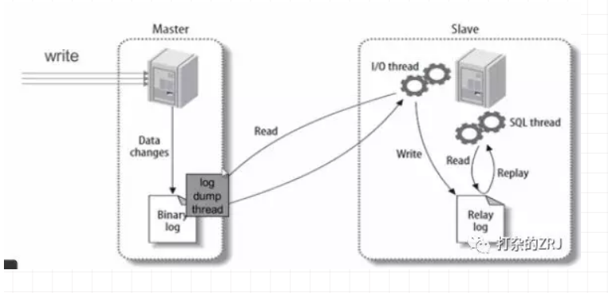

# 数据库优化的几个阶段

# 第一阶段 优化sql和索引
这才是调优的第一阶段啊，为什么呢？
因为这一步成本最低啊，不需要加什么中间件。你没经过索引优化和SQL优化，就来什么水平拆分，这不是坑人么。
那步骤是什么样呢?我说个大概
(1)用慢查询日志定位执行效率低的SQL语句
(2)用explain分析SQL的执行计划
(3)确定问题，采取相应的优化措施，建立索引啊，等

# 第二阶段 搭建缓存
在优化sql无法解决问题的情况下，才考虑搭建缓存。毕竟你使用缓存的目的，就是将复杂的、耗时的、不常变的执行结果缓存起来，降低数据库的资源消耗。
这里需要注意的是:搭建缓存后，系统的复杂性增加了。你需要考虑很多问题，比如:

- 1、缓存和数据库一致性问题？(比如是更缓存，还是删缓存)
- 2、缓存击穿、缓存穿透、缓存雪崩问题如何解决？是否有做缓存预热的必要。

# 第三阶段 读写分离
缓存也搞不定的情况下，搞主从复制，上读写分离。在应用层，区分读写请求。或者利用现成的中间件mycat或者altas等做读写分离。
需要注意的是,只要你敢说你用了主从架构，有三个问题，你要准备:
(1)主从的好处？
回答:实现数据库备份，实现数据库负载均衡，提高数据库可用性

(2)主从的原理?
回答:如图所示

主库有一个log dump线程，将binlog传给从库 
从库有两个线程，一个I/O线程，一个SQL线程，I/O线程读取主库传过来的binlog内容并写入到relay log,SQL线程从relay log里面读取内容，
写入从库的数据库。

(3)如何解决主从一致性?

回答:这个问题，我不建议在数据库层面解决该问题。根据CAP定理，主从架构本来就是一种高可用架构，是无法满足一致性的。
哪怕你采用同步复制模式或者半同步复制模式，都是弱一致性，并不是强一致性。所以，推荐还是利用缓存，来解决该问题。

步骤如下:
1、自己通过测试，计算主从延迟时间，建议mysql版本为5.7以后，因为mysql自5.7开始，多线程复制功能比较完善，
一般能保证延迟在1s内。不过话说回来，mysql现在都出到8.x了，还有人用5.x的版本么。
2、数据库的写操作，先写数据库，再写cache，但是有效期很短，就比主从延时的时间稍微长一点。
3、读请求的时候，先读缓存，缓存存在则直接返回。如果缓存不存在(这时主从同步已经完成)，再读数据库。

# 第四阶段 利用分区表
说句实在话，你们面试的时候，其实可以略过这个阶段。因为很多互联网公司都不建议用分区表，我自己也不太建议用分区表，采用这个分区表，坑太多。
这里引用一下其他文章的回答:
什么是mysql的分区表？
回答：所有数据还在一个表中，但物理存储根据一定的规则放在不同的文件中。这个是mysql支持的功能，业务代码不需要改动，
但是sql语句需要改动，sql条件需要带上分区的列。
缺点
(1)分区键设计不太灵活，如果不走分区键，很容易出现全表锁
(2)在分区表使用ALTER TABLE … ORDER BY，只能在每个分区内进行order by。
(3)分区表的分区键创建索引，那么这个索引也将被分区。分区键没有全局索引一说。
(4)自己分库分表，自己掌控业务场景与访问模式，可控。分区表，研发写了一个sql，都不确定该去哪个分区查，不太可控。
…不列举了，不推荐

# 第五阶段 垂直拆分
上面四个阶段都没搞定，就来垂直拆分了。垂直拆分的复杂度还是比水平拆分小的。将你的表，按模块拆分为不同的小表。
如果你有幸能够在什么运营商、银行等公司上班，你会发现他们一个表，几百个字段都是很常见的事情。所以，应该要进行拆分，拆分原则一般是如下三点:
(1)把不常用的字段单独放在一张表。
(2)把常用的字段单独放一张表
(3)经常组合查询的列放在一张表中（联合索引）。

# 第六阶段 水平拆分
OK,水平拆分是最麻烦的一个阶段，拆分后会有很多的问题，我再强调一次，水平拆分一定是最最最最后的选择。
从某种意义上，我觉得还不如垂直拆分。因为你用垂直拆分，分成不同模块后，发现单模块的压力过大，你完全可以给该模块单独做优化，
例如提高该模块的机器配置等。如果是水平拆分，拆成两张表，代码需要变动，然后发现两张表还不行，再变代码，再拆成三张表的？
水平拆分后，各模块间耦合性太强，成本太大，慎重。

