> 总结

- 1、把异步和同步，以及阻塞和非阻塞解释的比较清楚；
- 2、详解Unix各种io；
- 3、0拷贝技术，把数据在内核和用户空间的拷贝从4次降低到2次；

<!-- TOC -->

- [参考](#参考)
- [1、同步与异步](#1同步与异步)
- [2、阻塞与非阻塞](#2阻塞与非阻塞)
- [3、Unix支持的5种IO模型](#3unix支持的5种io模型)
    - [1、阻塞IO](#1阻塞io)
    - [2、非阻塞IO](#2非阻塞io)
    - [3、IO多路复用](#3io多路复用)
        - [1、文件描述符fd](#1文件描述符fd)
        - [2、select](#2select)
        - [3、poll](#3poll)
        - [4、epoll](#4epoll)
    - [4、信号驱动式IO](#4信号驱动式io)
    - [5、异步IO](#5异步io)
    - [6、5中I/O模型的对比](#65中io模型的对比)
    - [7、零拷贝](#7零拷贝)
        - [1、缓存 IO](#1缓存-io)
        - [2、零拷贝技术分类](#2零拷贝技术分类)
        - [3、让数据传输不需要经过user space，使用mmap](#3让数据传输不需要经过user-space使用mmap)
        - [4、java中的实现](#4java中的实现)
- [4、java中的IO模型](#4java中的io模型)
    - [1、JDK 1.4之前的同步阻塞IO](#1jdk-14之前的同步阻塞io)
    - [2、JDK 1.4之后的同步非阻塞NIO](#2jdk-14之后的同步非阻塞nio)
    - [3、NIO网络通信与IO多路复用模型[同步非阻塞]](#3nio网络通信与io多路复用模型同步非阻塞)
    - [4、AIO以及异步IO模型](#4aio以及异步io模型)

<!-- /TOC -->


# 参考
- [聊聊Unix与Java的IO模型](https://mp.weixin.qq.com/s/mEahtWqeFqzzaETHKAWtzw)
- [NIO相关基础篇三](https://mp.weixin.qq.com/s/5SKgdkC0kaHN495psLd3Tg?scene=25#wechat_redirect)
- [Linux 五种IO模型](https://blog.csdn.net/weily11/article/details/80311258)
- [什么是Zero-Copy?](https://mp.weixin.qq.com/s/aInxpcCC6k_R_tNzzURByg)


# 1、同步与异步

想要搞明白IO模型，就先得搞明白“同步”与“异步”的关系。

所谓的“同步”，比如说调用者去调用一个接口，这个接口比如要执行一些磁盘文件读写操作，或者是网络通信操作。

假设是“同步”的模式，调用者必须要等待这个接口的磁盘读写或者网络通信的操作执行完毕了，调用者才能返回，这就是“同步”，如下图所示：

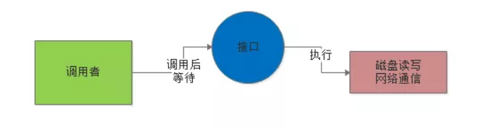

所谓的“异步”，就是说这个调用者调用接口之后，直接就返回了，他去干别的事儿了，也不管那个接口的磁盘读写或者是网络通信是否成功。


然后这个接口后续如果干完了自己的任务，比如写完了文件或者是什么的，会反过来通知调用者，之前你的那个调用成功了。可以通过一些内部通信机制来通知，也可以通过回调函数来通知，如下图。


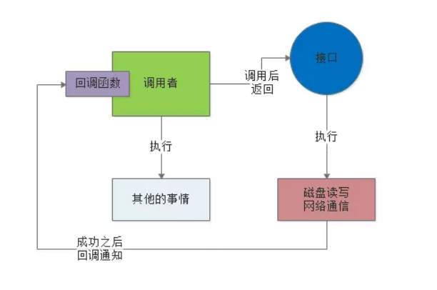


> 用生活中的例子理解同步与异步

如果给大家举个生活中的例子，那么就可以用买烟这个事儿来举个例子

比如说现在你要去一个柜台买很多条香烟，但是现在柜台没那么多货，他需要打电话给库房来查一下有没有足够的货。

这个时候，库房的工作人员正好去吃饭了，那现在你有两种选择：

第一种选择，你可以在柜台等着，一直等待库房工作人员回来，柜台专员打通电话给他查到了库存是否充足，你再走。

这个就是“同步”，你找柜台工作人员买香烟，他要打电话给库房工作人员问库存，如果你选择“同步”模式，那么你就在柜台一直等着，直到成功查询到库存为止。

第二种选择，你可以先回家干点儿别的，比如说洗衣服做饭之类的，然后过了一会儿，柜台工作人员打通电话给库房工作人员，查到香烟库存了，就会打个电话给你，告诉你这个事儿。

这就是“异步”，你跟柜台工作人员说了这个事儿，就直接走了，干别的去了，柜台工作人员后面完成他的任务之后，就会反过来打电话回调通知你。


# 2、阻塞与非阻塞

实际上阻塞与非阻塞的概念，通常是针对底层的IO操作来说的。

比如现在我们的程序想要通过网络读取数据，如果是阻塞IO模式，一旦发起请求到操作系统内核去从网络中读取数据，就会阻塞在那里，必须要等待网络中的数据到达了之后，才能从网络读取数据到内核，再从内核返回给程序，如下图。

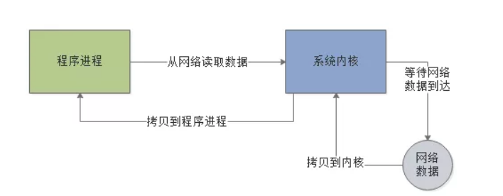

而非阻塞，指的就是程序发送请求给内核要从网络读取数据，但是此时网络中的数据还没到，此时不会阻塞住，内核会返回一个异常消息给程序。

程序就可以干点儿别的，然后过一会儿再来发起一次请求给内核，让内核尝试从网络读取数据。

因为如果网络中的数据还没到位，是不会阻塞住程序的，需要程序自己不断的轮询内核去尝试读取数据，所以这种IO就是非阻塞的。如下图：

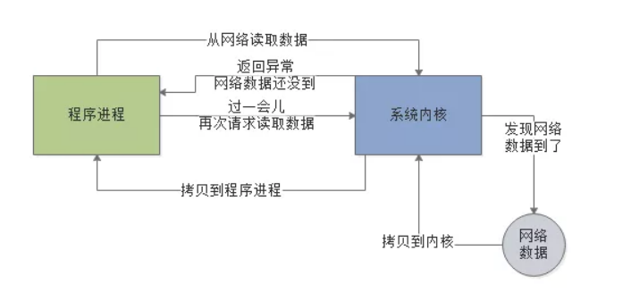


> 总结（重点）

大家不要把“同步/异步”概念和“阻塞/非阻塞”概念混淆起来，实际上他们是两组不同的概念。

“同步/异步”更多的是针对比如接口调用，服务调用，API类库调用，类似这样的场景。

而“阻塞/非阻塞”概念针对的是底层IO操作的场景，比如磁盘IO，网络IO。但是在Java IO模型里，两种概念之间是有一定的关联关系的 。


# 3、Unix支持的5种IO模型


> 用户空间以及内核空间概念

我们知道现在操作系统都是采用虚拟存储器，那么对32位操作系统而言，它的寻址空间（虚拟存储空间）为4G（2的32次方）。操心系统的核心是内核，独立于普通的应用程序，可以访问受保护的内存空间，也有访问底层硬件设备的所有权限。为了保证用户进程不能直接操作内核，保证内核的安全，操心系统将虚拟空间划分为两部分，一部分为内核空间，一部分为用户空间。针对linux操作系统而言，将最高的1G字节（从虚拟地址0xC0000000到0xFFFFFFFF），供内核使用，称为内核空间，而将较低的3G字节（从虚拟地址0x00000000到0xBFFFFFFF），供各个进程使用，称为用户空间。每个进程可以通过系统调用进入内核，因此，Linux内核由系统内的所有进程共享。于是，从具体进程的角度来看，每个进程可以拥有4G字节的虚拟空间。


空间分配如下图所示：

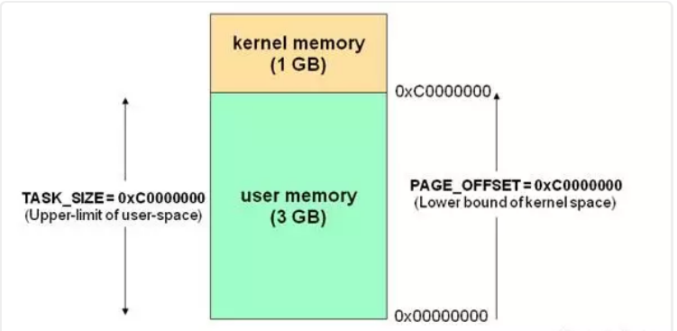

有了用户空间和内核空间，整个linux内部结构可以分为三部分，从最底层到最上层依次是：硬件-->内核空间-->用户空间。

如下图所示：

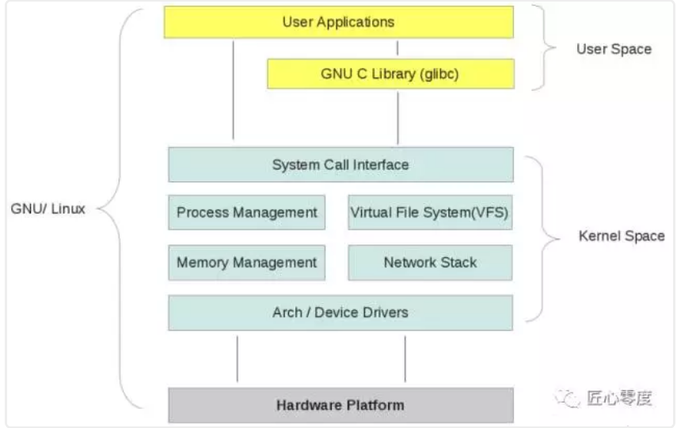


>> 需要注意的细节问题，从上图可以看出内核的组成:

- 内核空间中存放的是内核代码和数据，而进程的用户空间中存放的是用户程序的代码和数据。不管是内核空间还是用户空间，它们都处于虚拟空间中。

- Linux使用两级保护机制：0级供内核使用，3级供用户程序使用。


我们都知道，为了OS的安全性等的考虑，进程是无法直接操作I/O设备的，其必须通过系统调用请求内核来协助完成I/O动作，而内核会为每个I/O设备维护一个buffer。

如下图所示：

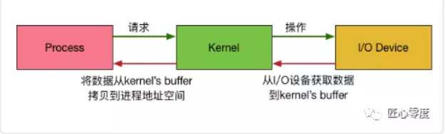


整个请求过程为： 用户进程发起请求，内核接受到请求后，从I/O设备中获取数据到buffer中，再将buffer中的数据copy到用户进程的地址空间，该用户进程获取到数据后再响应客户端。

在整个请求过程中，数据输入至buffer需要时间，而从buffer复制数据至进程也需要时间。因此根据在这两段时间内等待方式的不同，I/O动作可以分为以下五种模式：

- 阻塞I/O (Blocking I/O)

- 非阻塞I/O (Non-Blocking I/O)

- I/O复用（I/O Multiplexing)

- 信号驱动的I/O (Signal Driven I/O)

- 异步I/O (Asynchrnous I/O) 

>> 记住这两点很重要

- 1 等待数据准备 (Waiting for the data to be ready)

- 2 将数据从内核拷贝到进程中 (Copying the data from the kernel to the process)


>> 基本 Linux IO 模型的简单矩阵

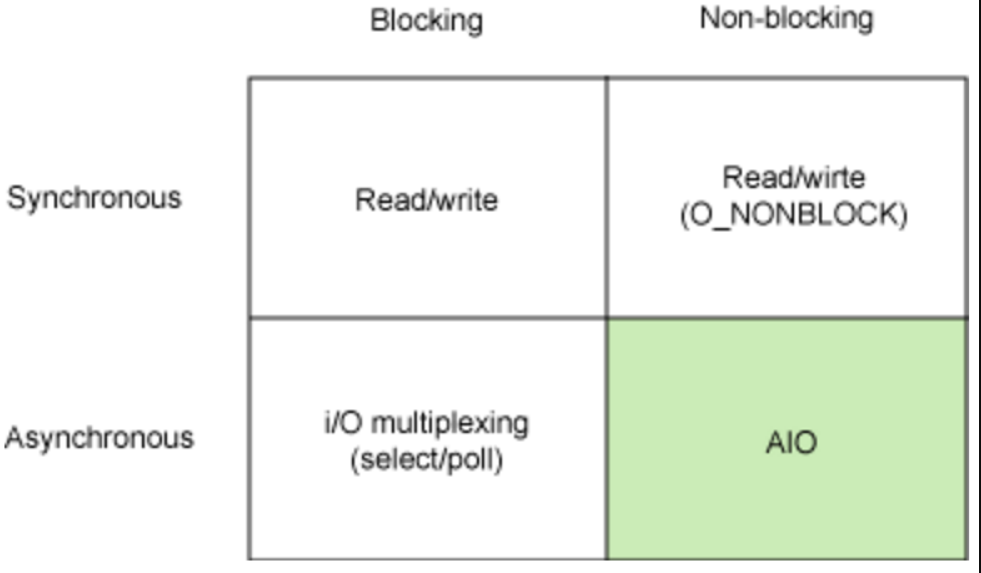


## 1、阻塞IO

就是上面图里的那种阻塞IO模式，程序发起请求之后会阻塞，一直到系统内核发现网络中有数据到达了，拷贝数据给程序进程了，才能返回.

在linux中，默认情况下所有的socket都是blocking，一个典型的读操作流程大概是这样：

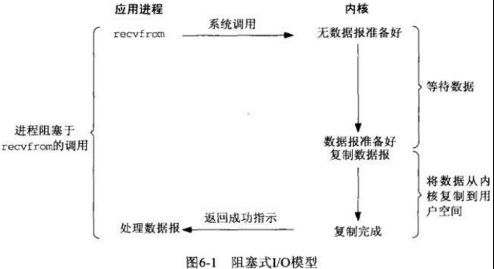

当用户进程调用了recvfrom这个系统调用，内核就开始了IO的第一个阶段：等待数据准备。对于network io来说，很多时候数据在一开始还没有到达（比如，还没有收到一个完整的UDP包），这个时候内核就要等待足够的数据到来。而在用户进程这边，整个进程会被阻塞。当内核一直等到数据准备好了，它就会将数据从内核中拷贝到用户内存，然后内核返回结果，用户进程才解除block的状态，重新运行起来。
所以，blocking IO的特点就是在IO执行的两个阶段都被block了。


## 2、非阻塞IO

就是上面图里的那种非阻塞IO模式，程序发起请求读取数据，系统内核发现网络数据还没到，就返回一个异常信息，程序不会阻塞在IO操作上，但是过一会儿还得再来发起请求给内核，直到内核发现网络数据到达了，此时就会拷贝数据给程序进程。

linux下，可以通过设置socket使其变为non-blocking。当对一个non-blocking socket执行读操作时，流程是这个样子：

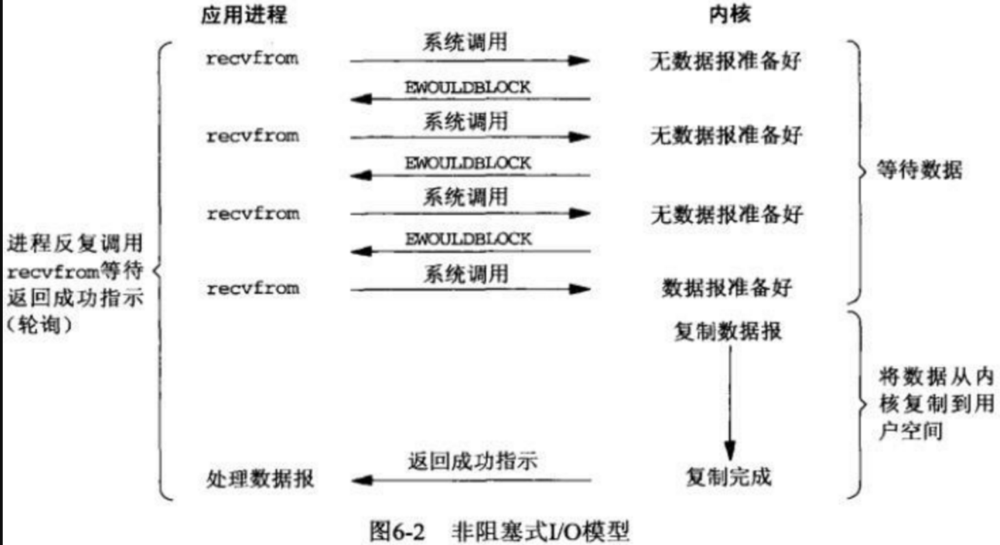


当用户进程调用recvfrom时，系统不会阻塞用户进程，而是立刻返回一个ewouldblock错误，从用户进程角度讲 ，并不需要等待，而是马上就得到了一个结果。用户进程判断标志是ewouldblock时，就知道数据还没准备好，于是它就可以去做其他的事了，于是它可以再次发送recvfrom，一旦内核中的数据准备好了。并且又再次收到了用户进程的system call，那么它马上就将数据拷贝到了用户内存，然后返回。

当一个应用程序在一个循环里对一个非阻塞调用recvfrom，我们称为轮询。应用程序不断轮询内核，看看是否已经准备好了某些操作。这通常是浪费CPU时间，但这种模式偶尔会遇到。


## 3、IO多路复用

IO multiplexing这个词可能有点陌生，但是如果我说select，epoll，大概就都能明白了。有些地方也称这种IO方式为event driven IO。我们都知道，select/epoll的好处就在于单个process就可以同时处理多个网络连接的IO。它的基本原理就是select/epoll这个function会不断的轮询所负责的所有socket，当某个socket有数据到达了，就通知用户进程。它的流程如图：

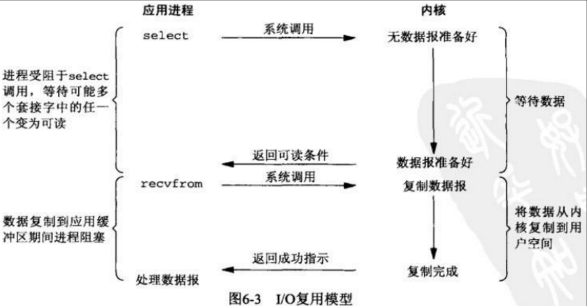

当用户进程调用了select，那么整个进程会被block，而同时，内核会“监视”所有select负责的socket，当任何一个socket中的数据准备好了，select就会返回。这个时候用户进程再调用read操作，将数据从内核拷贝到用户进程。

这个图和blocking IO的图其实并没有太大的不同，事实上，还更差一些。因为这里需要使用两个system call (select 和 recvfrom)，而blocking IO只调用了一个system call (recvfrom)。但是，用select的优势在于它可以同时处理多个connection。（多说一句。所以，如果处理的连接数不是很高的话，使用select/epoll的web server不一定比使用multi-threading + blocking IO的web server性能更好，可能延迟还更大。select/epoll的优势并不是对于单个连接能处理得更快，而是在于能处理更多的连接。）
在IO multiplexing Model中，实际中，对于每一个socket，一般都设置成为non-blocking，但是，如上图所示，整个用户的process其实是一直被block的。只不过process是被select这个函数block，而不是被socket IO给block。


### 1、文件描述符fd

Linux的内核将所有外部设备都可以看做一个文件来操作。那么我们对与外部设备的操作都可以看做对文件进行操作。我们对一个文件的读写，都通过调用内核提供的系统调用；内核给我们返回一个filede scriptor（fd,文件描述符）。而对一个socket的读写也会有相应的描述符，称为socketfd(socket描述符）。描述符就是一个数字，指向内核中一个结构体（文件路径，数据区，等一些属性）。那么我们的应用程序对文件的读写就通过对描述符的读写完成。

### 2、select

基本原理：select 函数监视的文件描述符分3类，分别是writefds、readfds、和exceptfds。调用后select函数会阻塞，直到有描述符就绪（有数据 可读、可写、或者有except），或者超时（timeout指定等待时间，如果立即返回设为null即可），函数返回。当select函数返回后，可以通过遍历fdset，来找到就绪的描述符。

> 缺点:

- 1、select最大的缺陷就是单个进程所打开的FD是有一定限制的，它由FDSETSIZE设置，32位机默认是1024个，64位机默认是2048。

一般来说这个数目和系统内存关系很大，”具体数目可以cat /proc/sys/fs/file-max察看”。32位机默认是1024个。64位机默认是2048.

- 2、对socket进行扫描时是线性扫描，即采用轮询的方法，效率较低。

当套接字比较多的时候，每次select()都要通过遍历FDSETSIZE个Socket来完成调度，不管哪个Socket是活跃的，都遍历一遍。这会浪费很多CPU时间。”如果能给套接字注册某个回调函数，当他们活跃时，自动完成相关操作，那就避免了轮询”，这正是epoll与kqueue做的。

- 3、需要维护一个用来存放大量fd的数据结构，这样会使得用户空间和内核空间在传递该结构时复制开销大。

### 3、poll

基本原理：poll本质上和select没有区别，它将用户传入的数组拷贝到内核空间，然后查询每个fd对应的设备状态，如果设备就绪则在设备等待队列中加入一项并继续遍历，如果遍历完所有fd后没有发现就绪设备，则挂起当前进程，直到设备就绪或者主动超时，被唤醒后它又要再次遍历fd。这个过程经历了多次无谓的遍历。

它没有最大连接数的限制，原因是它是基于链表来存储的，但是同样有一个缺点：

- 1、大量的fd的数组被整体复制于用户态和内核地址空间之间，而不管这样的复制是不是有意义。

- 2、poll还有一个特点是“水平触发”，如果报告了fd后，没有被处理，那么下次poll时会再次报告该fd。

注意：从上面看，select和poll都需要在返回后，通过遍历文件描述符来获取已经就绪的socket。事实上，同时连接的大量客户端在一时刻可能只有很少的处于就绪状态，因此随着监视的描述符数量的增长，其效率也会线性下降。

### 4、epoll

epoll是在2.6内核中提出的，是之前的select和poll的增强版本。相对于select和poll来说，epoll更加灵活，没有描述符限制。epoll使用一个文件描述符管理多个描述符，将用户关系的文件描述符的事件存放到内核的一个事件表中，这样在用户空间和内核空间的copy只需一次。

基本原理：epoll支持水平触发和边缘触发，最大的特点在于边缘触发，它只告诉进程哪些fd刚刚变为就绪态，并且只会通知一次。
还有一个特点是，epoll使用“事件”的就绪通知方式，通过epollctl注册fd，一旦该fd就绪，内核就会采用类似callback的回调机制来激活该fd，epollwait便可以收到通知。

epoll的优点：
- 1、没有最大并发连接的限制，能打开的FD的上限远大于1024（1G的内存上能监听约10万个端口）。

- 2、效率提升，不是轮询的方式，不会随着FD数目的增加效率下降。

只有活跃可用的FD才会调用callback函数；即Epoll最大的优点就在于它只管你“活跃”的连接，而跟连接总数无关，因此在实际的网络环境中，Epoll的效率就会远远高于select和poll。

- 3、内存拷贝，利用mmap()文件映射内存加速与内核空间的消息传递；即epoll使用mmap减少复制开销。

JDK1.5_update10版本使用epoll替代了传统的select/poll，极大的提升了NIO通信的性能。

备注：JDK NIO的BUG，例如臭名昭著的epoll bug，它会导致Selector空轮询，最终导致CPU 100%。官方声称在JDK1.6版本的update18修复了该问题，但是直到JDK1.7版本该问题仍旧存在，只不过该BUG发生概率降低了一些而已，它并没有被根本解决。这个可以在后续netty系列里面进行说明下。


## 4、信号驱动式IO


由于signal driven IO在实际中并不常用，所以简单提下。

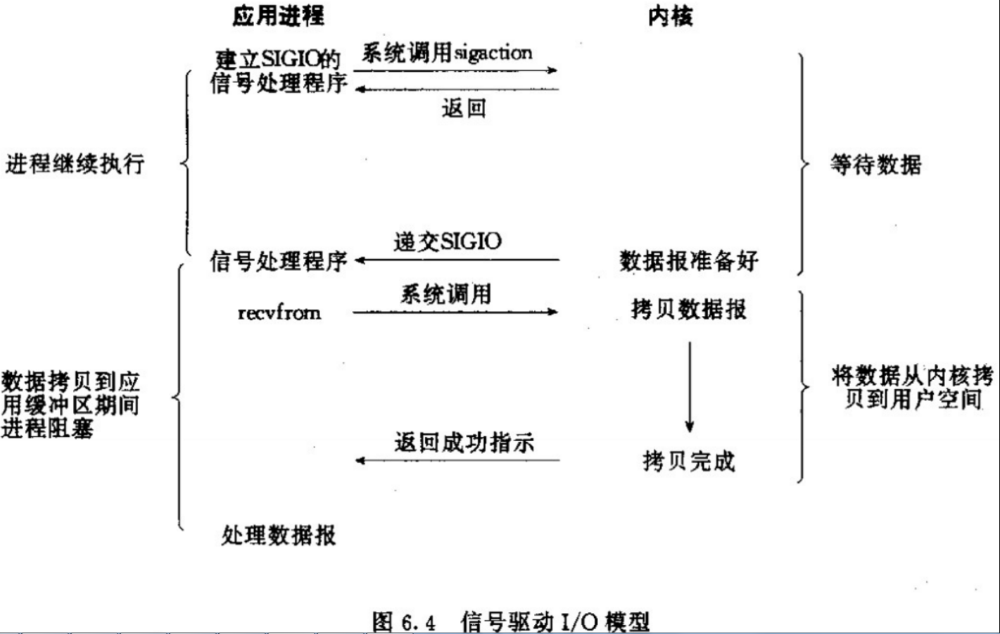


很明显可以看出用户进程不是阻塞的。首先用户进程建立SIGIO信号处理程序，并通过系统调用sigaction执行一个信号处理函数，这时用户进程便可以做其他的事了，一旦数据准备好，系统便为该进程生成一个SIGIO信号，去通知它数据已经准备好了，于是用户进程便调用recvfrom把数据从内核拷贝出来，并返回结果。


## 5、异步IO

一般来说，这些函数通过告诉内核启动操作并在整个操作（包括内核的数据到缓冲区的副本）完成时通知我们。这个模型和前面的信号驱动I/O模型的主要区别是，在信号驱动的I/O中，内核告诉我们何时可以启动I/O操作，但是异步I/O时，内核告诉我们何时I/O操作完成。

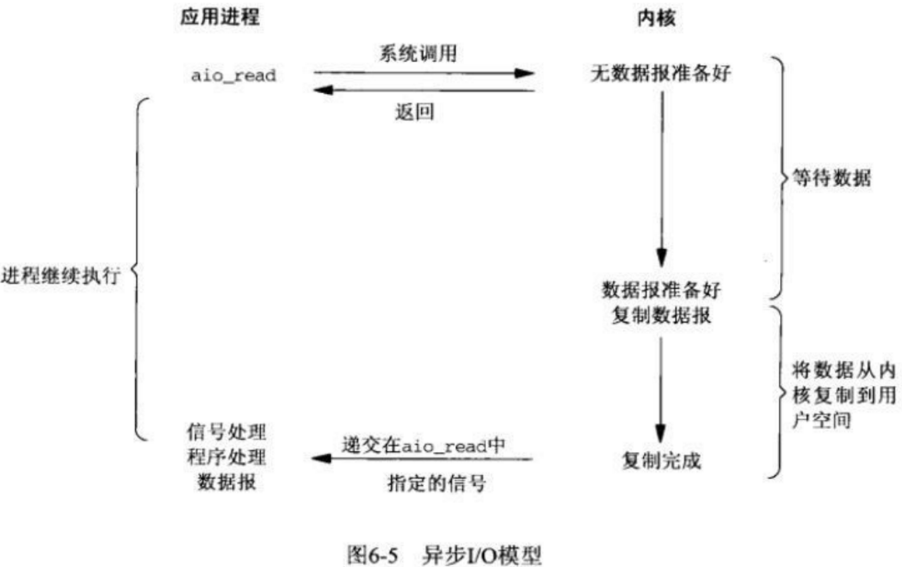

当用户进程向内核发起某个操作后，会立刻得到返回，并把所有的任务都交给内核去完成（包括将数据从内核拷贝到用户自己的缓冲区），内核完成之后，只需返回一个信号告诉用户进程已经完成就可以了。

## 6、5中I/O模型的对比

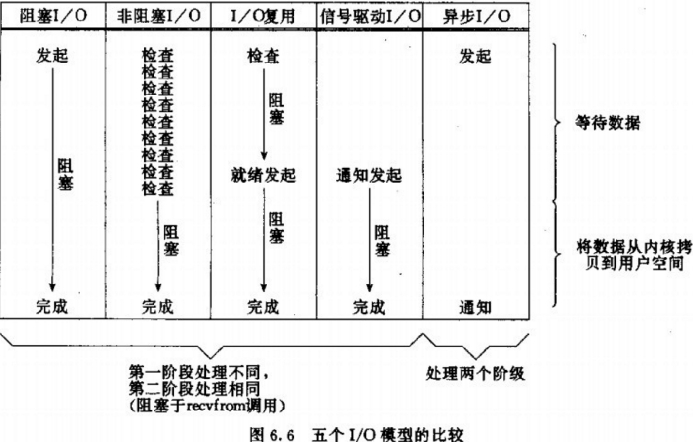

结果表明：前四个模型之间的主要区别是第一阶段，四个模型的第二阶段是一样的：过程受阻在调用recvfrom当数据从内核拷贝到用户缓冲区。然而，异步I/O处理两个阶段，与前四个不同。

从同步、异步，以及阻塞、非阻塞两个维度来划分来看：

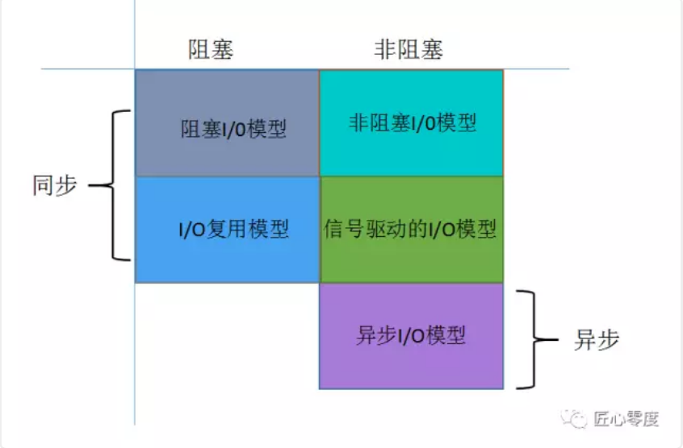

## 7、零拷贝

CPU不执行拷贝数据从一个存储区域到另一个存储区域的任务，这通常用于在网络上传输文件时节省CPU周期和内存带宽。

### 1、缓存 IO

缓存 IO 又被称作标准 IO，大多数文件系统的默认 IO 操作都是缓存 IO。在 Linux 的缓存 IO 机制中，操作系统会将 IO 的数据缓存在文件系统的页缓存（ page cache ）中，也就是说，数据会先被拷贝到操作系统内核的缓冲区中，然后才会从操作系统内核的缓冲区拷贝到应用程序的地址空间。

缓存 IO 的缺点：数据在传输过程中需要在应用程序地址空间和内核进行多次数据拷贝操作，这些数据拷贝操作所带来的 CPU 以及内存开销是非常大的。

### 2、零拷贝技术分类

零拷贝技术的发展很多样化，现有的零拷贝技术种类也非常多，而当前并没有一个适合于所有场景的零拷贝技术的出现。对于 Linux 来说，现存的零拷贝技术也比较多，这些零拷贝技术大部分存在于不同的 Linux 内核版本，有些旧的技术在不同的 Linux 内核版本间得到了很大的发展或者已经渐渐被新的技术所代替。本文针对这些零拷贝技术所适用的不同场景对它们进行了划分。概括起来，Linux 中的零拷贝技术主要有下面这几种：

- 1、直接 I/O

对于这种数据传输方式来说，应用程序可以直接访问硬件存储，操作系统内核只是辅助数据传输：这类零拷贝技术针对的是操作系统内核并不需要对数据进行直接处理的情况，数据可以在应用程序地址空间的缓冲区和磁盘之间直接进行传输，完全不需要 Linux 操作系统内核提供的页缓存的支持。

- 2、在数据传输的过程中，避免数据在操作系统内核地址空间的缓冲区和用户应用程序地址空间的缓冲区之间进行拷贝。

有的时候，应用程序在数据进行传输的过程中不需要对数据进行访问，那么，将数据从 Linux 的页缓存拷贝到用户进程的缓冲区中就可以完全避免，传输的数据在页缓存中就可以得到处理。在某些特殊的情况下，这种零拷贝技术可以获得较好的性能。Linux 中提供类似的系统调用主要有 mmap()，sendfile() 以及 splice()。

- 3、对数据在 Linux 的页缓存和用户进程的缓冲区之间的传输过程进行优化。

该零拷贝技术侧重于灵活地处理数据在用户进程的缓冲区和操作系统的页缓存之间的拷贝操作。这种方法延续了传统的通信方式，但是更加灵活。在Linux 中，该方法主要利用了写时复制技术。

前两类方法的目的主要是为了避免应用程序地址空间和操作系统内核地址空间这两者之间的缓冲区拷贝操作。这两类零拷贝技术通常适用在某些特殊的情况下，比如要传送的数据不需要经过操作系统内核的处理或者不需要经过应用程序的处理。

第三类方法则继承了传统的应用程序地址空间和操作系统内核地址空间之间数据传输的概念，进而针对数据传输本身进行优化。我们知道，硬件和软件之间的数据传输可以通过使用 DMA 来进行，DMA 进行数据传输的过程中几乎不需要CPU参与，这样就可以把 CPU 解放出来去做更多其他的事情，但是当数据需要在用户地址空间的缓冲区和 Linux 操作系统内核的页缓存之间进行传输的时候，并没有类似DMA 这种工具可以使用，CPU 需要全程参与到这种数据拷贝操作中，所以这第三类方法的目的是可以有效地改善数据在用户地址空间和操作系统内核地址空间之间传递的效率。

> 注意，对于各种零拷贝机制是否能够实现都是依赖于操作系统底层是否提供相应的支持。

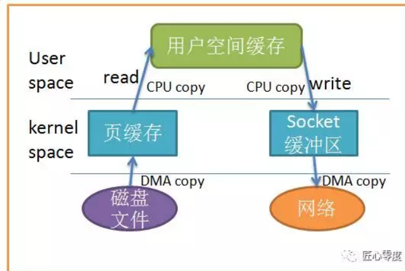

当应用程序访问某块数据时，操作系统首先会检查，是不是最近访问过此文件，文件内容是否缓存在内核缓冲区，如果是，操作系统则直接根据read系统调用提供的buf地址，将内核缓冲区的内容拷贝到buf所指定的用户空间缓冲区中去。如果不是，操作系统则首先将磁盘上的数据拷贝的内核缓冲区，这一步目前主要依靠DMA来传输，然后再把内核缓冲区上的内容拷贝到用户缓冲区中。接下来，write系统调用再把用户缓冲区的内容拷贝到网络堆栈相关的内核缓冲区中，最后socket再把内核缓冲区的内容发送到网卡上。

从上图中可以看出，共产生了四次数据拷贝，即使使用了DMA来处理了与硬件的通讯，CPU仍然需要处理两次数据拷贝，与此同时，在用户态与内核态也发生了多次上下文切换，无疑也加重了CPU负担。

在此过程中，我们没有对文件内容做任何修改，那么在内核空间和用户空间来回拷贝数据无疑就是一种浪费，而零拷贝主要就是为了解决这种低效性。

### 3、让数据传输不需要经过user space，使用mmap

我们减少拷贝次数的一种方法是调用mmap()来代替read调用：

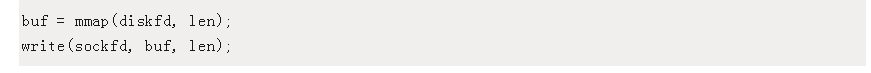


应用程序调用 mmap()，磁盘上的数据会通过 DMA被拷贝的内核缓冲区，接着操作系统会把这段内核缓冲区与应用程序共享，这样就不需要把内核缓冲区的内容往用户空间拷贝。应用程序再调用 write(),操作系统直接将内核缓冲区的内容拷贝到 socket缓冲区中，这一切都发生在内核态，最后， socket缓冲区再把数据发到网卡去。

同样的，看图很简单：

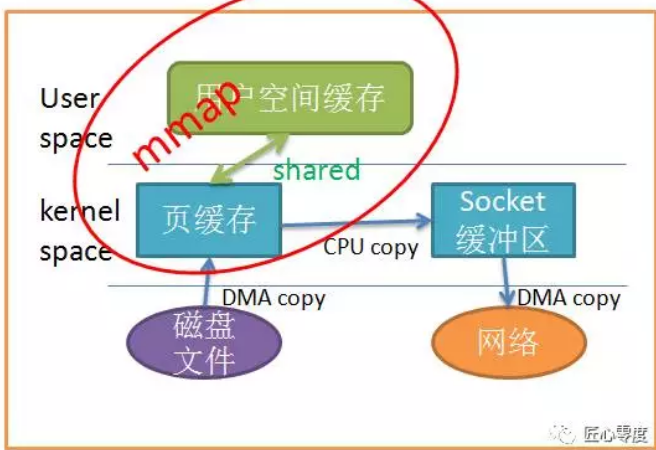


使用mmap替代read很明显减少了一次拷贝，当拷贝数据量很大时，无疑提升了效率。但是使用 mmap是有代价的。当你使用 mmap时，你可能会遇到一些隐藏的陷阱。例如，当你的程序 map了一个文件，但是当这个文件被另一个进程截断(truncate)时, write系统调用会因为访问非法地址而被 SIGBUS信号终止。 SIGBUS信号默认会杀死你的进程并产生一个 coredump,如果你的服务器这样被中止了，那会产生一笔损失。

通常我们使用以下解决方案避免这种问题：

- 1、为SIGBUS信号建立信号处理程序 当遇到 SIGBUS信号时，信号处理程序简单地返回， write系统调用在被中断之前会返回已经写入的字节数，并且 errno会被设置成success,但是这是一种糟糕的处理办法，因为你并没有解决问题的实质核心。

- 2、使用文件租借锁 通常我们使用这种方法，在文件描述符上使用租借锁，我们为文件向内核申请一个租借锁，当其它进程想要截断这个文件时，内核会向我们发送一个实时的 RT_SIGNAL_LEASE信号，告诉我们内核正在破坏你加持在文件上的读写锁。这样在程序访问非法内存并且被 SIGBUS杀死之前，你的 write系统调用会被中断。 write会返回已经写入的字节数，并且置 errno为success。 我们应该在 mmap文件之前加锁，并且在操作完文件后解锁：


### 4、java中的实现


考虑这样一种常用的情形：你需要将静态内容（类似图片、文件）展示给用户。那么这个情形就意味着你需要先将静态内容从磁盘中拷贝出来放到一个内存buf中，然后将这个buf通过socket传输给用户，进而用户或者静态内容的展示。这看起来再正常不过了，但是实际上这是很低效的流程，我们把上面的这种情形抽象成下面的过程：

read(file, tmp_buf, len);

write(socket, tmp_buf, len);

首先调用read将静态内容，这里假设为文件A，读取到tmp_buf, 然后调用write将tmp_buf写入到socket中，如图：

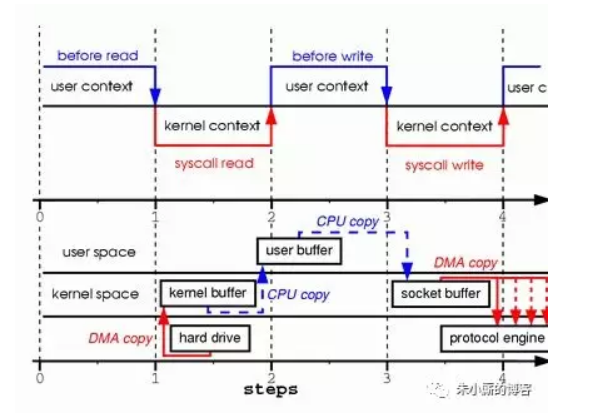

在这个过程中文件A的经历了4次copy的过程：

首先，调用read时，文件A拷贝到了kernel模式；

之后，CPU控制将kernel模式数据copy到user模式下；

调用write时，先将user模式下的内容copy到kernel模式下的socket的buffer中；

最后将kernel模式下的socket buffer的数据copy到网卡设备中传送；

从上面的过程可以看出，数据白白从kernel模式到user模式走了一圈，浪费了2次copy(第一次，从kernel模式拷贝到user模式；第二次从user模式再拷贝回kernel模式，即上面4次过程的第2和3步骤。)。而且上面的过程中kernel和user模式的上下文的切换也是4次。

幸运的是，你可以用一种叫做Zero-Copy的技术来去掉这些无谓的copy。应用程序用Zero-Copy来请求kernel直接把disk的data传输给socket，而不是通过应用程序传输。Zero-Copy大大提高了应用程序的性能，并且减少了kernel和user模式上下文的切换。


Zero-Copy技术省去了将操作系统的read buffer拷贝到程序的buffer，以及从程序buffer拷贝到socket buffer的步骤，直接将read buffer拷贝到socket buffer. Java NIO中的FileChannal.transferTo()方法就是这样的实现，这个实现是依赖于操作系统底层的sendFile()实现的。

```
public void transferTo(long position, long count, WritableByteChannel target);

他底层的调用时系统调用sendFile()方法：

#include <sys/socket.h>
ssize_t sendfile(int out_fd, int in_fd, off_t *offset, size_t count);
```

下图展示了在transferTo()之后的数据流向：

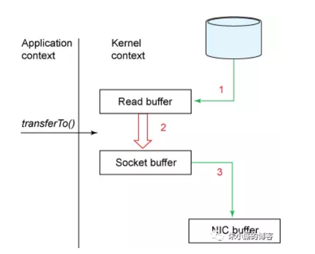


下图展示了在使用transferTo()之后的上下文切换：

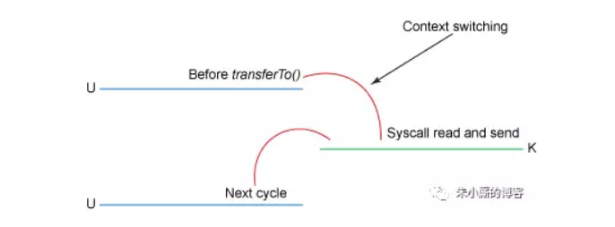

使用了Zero-Copy技术之后，整个过程如下：

- 1、transferTo()方法使得文件A的内容直接拷贝到一个read buffer（kernel buffer）中；

- 2、然后数据(kernel buffer)拷贝到socket buffer中。

- 3、最后将socket buffer中的数据拷贝到网卡设备（protocol engine）中传输；

这显然是一个伟大的进步：这里把上下文的切换次数从4次减少到2次，同时也把数据copy的次数从4次降低到了3次。

但是这是Zero-Copy么，答案是否定的。

> 进阶

Linux 2.1内核开始引入了sendfile函数（上一节有提到）,用于将文件通过socket传送。

sendfile(socket, file, len);
该函数通过一次系统调用完成了文件的传送，减少了原来read/write方式的模式切换。此外更是减少了数据的copy, sendfile的详细过程如图：


通过sendfile传送文件只需要一次系统调用，当调用sendfile时：

首先（通过DMA）将数据从磁盘读取到kernel buffer中；

然后将kernel buffer拷贝到socket buffer中；

最后将socket buffer中的数据copy到网卡设备（protocol engine）中发送；

这个过程就是第二节（详述）中的那个步骤。

sendfile与read/write模式相比，少了一次copy。但是从上述过程中也可以发现从kernel buffer中将数据copy到socket buffer是没有必要的。

Linux2.4 内核对sendfile做了改进，如图：


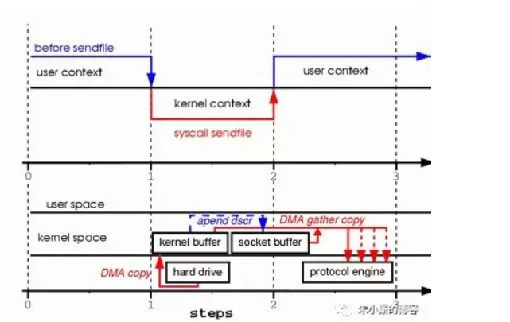

改进后的处理过程如下：

将文件拷贝到kernel buffer中；

向socket buffer中追加当前要发生的数据在kernel buffer中的位置和偏移量；

根据socket buffer中的位置和偏移量直接将kernel buffer的数据copy到网卡设备（protocol engine）中；

经过上述过程，数据只经过了2次copy就从磁盘传送出去了。这个才是真正的Zero-Copy(这里的零拷贝是针对kernel来讲的，数据在kernel模式下是Zero-Copy)。

正是Linux2.4的内核做了改进，Java中的TransferTo()实现了Zero-Copy,如下图：

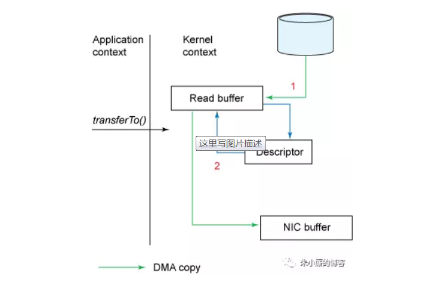

Zero-Copy技术的使用场景有很多，比如Kafka, 又或者是Netty等，可以大大提升程序的性能。


# 4、java中的IO模型


## 1、JDK 1.4之前的同步阻塞IO

在JDK 1.4之前，主要就是同步阻塞IO模型，在Java里叫做BIO。

在Java代码里调用IO相关接口，发起IO操作之后，Java程序就会同步等待，这个同步指的是Java程序调用IO API接口的层面而言。

而IO API在底层的IO操作是基于阻塞IO来的，向操作系统内核发起IO请求，系统内核会等待数据就位之后，才会执行IO操作，执行完毕了才会返回。


## 2、JDK 1.4之后的同步非阻塞NIO

在JDK 1.4之后提供了NIO，他的概念是同步非阻塞，也就是说如果你调用NIO接口去执行IO操作，其实还是同步等待的，但是在底层的IO操作上 ，会对系统内核发起非阻塞IO请求，以非阻塞的形式来执行IO。

也就是说，如果底层数据没到位，那么内核返回异常信息，不会阻塞住，但是NIO接口内部会采用非阻塞方式过一会儿再次调用内核发起IO请求，直到成功为止。


但是之所以说是同步非阻塞，这里的“同步”指的就是因为在你的Java代码调用NIO接口层面是同步的，你还是要同步等待底层IO操作真正完成了才可以返回，只不过在执行底层IO的时候采用了非阻塞的方式来执行罢了。


## 3、NIO网络通信与IO多路复用模型[同步非阻塞]


实际上，如果基于NIO进行网络通信，采取的就是多路复用的IO模型，这个多路复用IO模型针对的是网络通信中的IO场景来说的。

简单来说，就是在基于Socket进行网络通信的时候，如果有多个客户端跟你的服务端建立了Socket连接，那你就需要维护多个Socket连接。

而所谓的多路复用IO模型，就是说你的Java代码直接通过一个select函数调用，直接会进入一个同步等待的状态。

这也是为什么说NIO一定是“同步”的[???]，因为你必须在这里同步等待某个Socket连接有请求到来。


接着你就要同步等着select函数去对底层的多个 Socket 连接进行轮询，不断的查看各个 Socket 连接谁有请求到达，就可以让select函数返回，交给我们的Java程序来处理。


select函数在底层会通过非阻塞的方式轮询各个Socket，任何一个Socket如果没有数据到达，那么非阻塞的特性会立即返回一个信息。

然后select函数可以轮询下一个Socket，不会阻塞在某个Socket上，所以底层是基于这种非阻塞的模式来“监视”各个Socket谁有数据到达的。


这就是所谓的“同步非阻塞”，但是因为操作系统把上述工作都封装在一个select函数调用里了，可以对多路Socket连接同时进行监视，所以就把这种模型称之为“IO多路复用”模型。


通过这种IO多路复用的模型，就可以用一个线程，调用一个select函数，然后监视大量的客户端连接了，如下图。

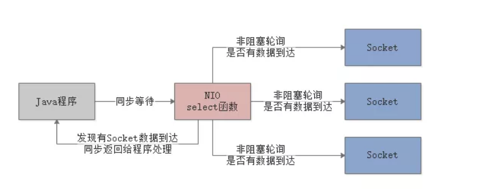


## 4、AIO以及异步IO模型

最后就是JDK 1.7之后，又支持了AIO，也叫做NIO 2.0，他就支持异步IO模型了。

我们先说一下异步IO模型是什么意思。

简单来说，就是你的Java程序可以基于AIO API发起一个请求，比如说接收网络数据，AIO API底层会基于异步IO模型来调用操作系统内核。

此时不需要去管这个IO是否成功了，AIO接口会直接返回，你的Java程序也会直接返回。

然后，你的Java程序就可以去干别的事儿了。大家联想一下上面说的那个异步的例子，就可以理解这里为什么叫做异步了。

因为BIO、NIO都是同步的，你发起IO请求，都必须同步等待IO操作完成。

但是这里你发起一个IO请求，直接AIO接口就返回了，你就可以干别的事儿了，纯异步的方式。

不过你需要提供一个回调函数给AIO接口，一旦底层系统内核完成了具体的IO请求，比如网络读写之类的，就会回调你提供的回调函数。

比如说你要是通过网络读取数据，那么此时AIO接口就会把操作系统异步读取到的数据交给你的回调函数。

整个过程如下图：

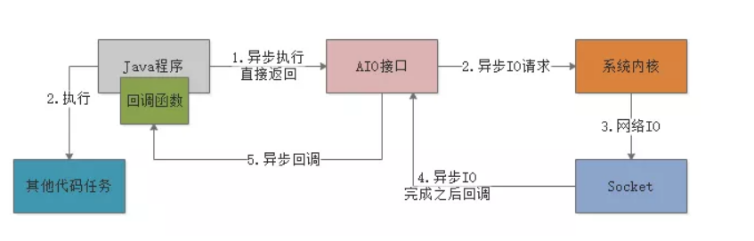


