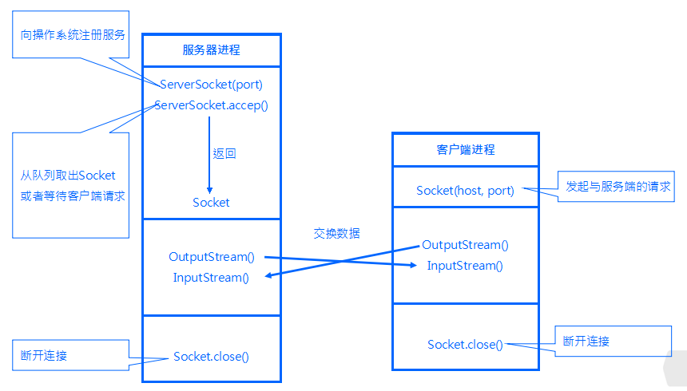

<!-- TOC -->

- [socket编程](#socket编程)
    - [1、网络编程中两个主要的问题](#1网络编程中两个主要的问题)
    - [2、 两类传输协议：TCP；UDP](#2-两类传输协议tcpudp)
    - [3、基于Socket的java网络编程](#3基于socket的java网络编程)
    - [4、多线程的ServerSocket](#4多线程的serversocket)
- [参考](#参考)

<!-- /TOC -->


# socket编程




## 1、网络编程中两个主要的问题
[一个是如何准确的定位网络上一台或多台主机，另一个就是找到主机后如何可靠高效的进行数据传输]

在TCP/IP协议中IP层主要负责网络主机的定位，数据传输的路由，由IP地址可以唯一地确定Internet上的一台主机。
而TCP层则提供面向应用的可靠（tcp）的或非可靠（UDP）的数据传输机制，这是网络编程的主要对象，一般不需要关心IP层是如何处理数据的。
目前较为流行的网络编程模型是客户机/服务器（C/S）结构。即通信双方一方作为服务器等待客户提出请求并予以响应。客户则在需要服务时向服务器提出申请。
服务器一般作为守护进程始终运行，监听网络端口，一旦有客户请求，就会启动一个服务进程来响应该客户，同时自己继续监听服务端口，
使后来的客户也能及时得到服务。

## 2、 两类传输协议：TCP；UDP

TCP是Tranfer Control Protocol的 简称，是一种面向连接的保证可靠传输的协议。通过TCP协议传输，得到的是一个顺序的无差错的数据流。发送方和接收方的成对的两个socket之间必须建 立连接，以便在TCP协议的基础上进行通信，当一个socket（通常都是server socket）等待建立连接时，另一个socket可以要求进行连接，一旦这两个socket连接起来，它们就可以进行双向数据传输，双方都可以进行发送 或接收操作。
UDP是User Datagram Protocol的简称，是一种无连接的协议，每个数据报都是一个独立的信息，包括完整的源地址或目的地址，它在网络上以任何可能的路径传往目的地，因此能否到达目的地，到达目的地的时间以及内容的正确性都是不能被保证的。

比较：
UDP：
1，每个数据报中都给出了完整的地址信息，因此无需要建立发送方和接收方的连接。
2，UDP传输数据时是有大小限制的，每个被传输的数据报必须限定在64KB之内。
3，UDP是一个不可靠的协议，发送方所发送的数据报并不一定以相同的次序到达接收方

TCP：
1，面向连接的协议，在socket之间进行数据传输之前必然要建立连接，所以在TCP中需要连接时间。
2，TCP传输数据大小限制，一旦连接建立起来，双方的socket就可以按统一的格式传输大的数据。
3，TCP是一个可靠的协议，它确保接收方完全正确地获取发送方所发送的全部数据。

应用：
1，TCP在网络通信上有极强的生命力，例如远程连接（Telnet）和文件传输（FTP）都需要不定长度的数据被可靠地传输。
但是可靠的传输是要付出代价的，对数据内容正确性的检验必然占用计算机的处理时间和网络的带宽，因此TCP传输的效率不如UDP高。

2，UDP操作简单，而且仅需要较少的监护，因此通常用于局域网高可靠性的分散系统中client/server应用程序。例如视频会议系统，
并不要求音频视频数据绝对的正确，只要保证连贯性就可以了，这种情况下显然使用UDP会更合理一些。

## 3、基于Socket的java网络编程

1，什么是Socket
网络上的两个程序通过一个双向的通讯连接实现数据的交换，这个双向链路的一端称为一个Socket。Socket通常用来实现客户方和服务方的连接。
Socket是TCP/IP协议的一个十分流行的编程界面，一个Socket由一个IP地址和一个端口号唯一确定。
但是，Socket所支持的协议种类也不光TCP/IP一种，因此两者之间是没有必然联系的。在Java环境下，Socket编程主要是指基于TCP/IP协议的网络编程。

2，Socket通讯的过程
Server端Listen(监听)某个端口是否有连接请求，Client端向Server 端发出Connect(连接)请求，Server端向Client端发回Accept（接受）消息。
一个连接就建立起来了。Server端和Client 端都可以通过Send，Write等方法与对方通信。

对于一个功能齐全的Socket，都要包含以下基本结构，其工作过程包含以下四个基本的步骤：
（1） 创建Socket；
（2） 打开连接到Socket的输入/出流；
（3） 按照一定的协议对Socket进行读/写操作；
（4） 关闭Socket.（在实际应用中，并未使用到显示的close，虽然很多文章都推荐如此，不过在我的程序中，可能因为程序本身比较简单，要求不高，所以并未造成什么影响。）

3，创建Socket

java在包java.net中提供了两个类Socket和ServerSocket，分别用来表示双向连接的客户端和服务端。这是两个封装得非常好的类，使用很方便。其构造方法如下：

　　Socket(InetAddress address, int port);

　　Socket(InetAddress address, int port, boolean stream);

　　Socket(String host, int prot);

　　Socket(String host, int prot, boolean stream);

　　Socket(SocketImpl impl)

　　Socket(String host, int port, InetAddress localAddr, int localPort)

　　Socket(InetAddress address, int port, InetAddress localAddr, int localPort)


　　ServerSocket(int port);

　　ServerSocket(int port, int backlog);

　　ServerSocket(int port, int backlog, InetAddress bindAddr)

其中address、host和port分别是双向连接中另一方的IP地址、主机名和端 口号，stream指明socket是流socket还是数据报socket，localPort表示本地主机的端口号，localAddr和 bindAddr是本地机器的地址（ServerSocket的主机地址），impl是socket的父类，既可以用来创建serverSocket又可 以用来创建Socket。count则表示服务端所能支持的最大连接数。例如：学习视频网http://www.xxspw.com

　　Socket client = new Socket("127.0.01.", 80);

　　ServerSocket server = new ServerSocket(80);

　　注意，在选择端口时，必须小心。每一个端口提供一种特定的服务，只有给出正确的端口，才 能获得相应的服务。0~1023的端口号为系统所保留，例如http服务的端口号为80,telnet服务的端口号为21,ftp服务的端口号为23, 所以我们在选择端口号时，最好选择一个大于1023的数以防止发生冲突。

　　在创建socket时如果发生错误，将产生IOException，在程序中必须对之作出处理。所以在创建Socket或ServerSocket是必须捕获或抛出例外。

4、实例
4.1、客户端
```java
/**
 *
 */
package socket;

import java.io.BufferedReader;
import java.io.InputStreamReader;
import java.io.PrintWriter;
import java.net.Socket;

/**
 * @author lishuai
 * @data 2017-3-2 下午5:04:47
 */

public class TalkClient {

 public static void main(String args[]) {

            try{

                Socket socket=new Socket("127.0.0.1",4700);

                //向本机的4700端口发出客户请求

                BufferedReader sin=new BufferedReader(new InputStreamReader(System.in));

                //由系统标准输入设备构造BufferedReader对象

                PrintWriter os=new PrintWriter(socket.getOutputStream());

                //由Socket对象得到输出流，并构造PrintWriter对象

                BufferedReader is=new BufferedReader(new InputStreamReader(socket.getInputStream()));

                //由Socket对象得到输入流，并构造相应的BufferedReader对象

                String readline;

                readline=sin.readLine(); //从系统标准输入读入一字符串

                while(!readline.equals("bye")){

                    //若从标准输入读入的字符串为 "bye"则停止循环

                    os.println(readline);

                    //将从系统标准输入读入的字符串输出到Server

                    os.flush();

                    //刷新输出流，使Server马上收到该字符串

                    System.out.println("Client:"+readline);

                    //在系统标准输出上打印读入的字符串

                    System.out.println("Server:"+is.readLine());

                    //从Server读入一字符串，并打印到标准输出上

                    readline=sin.readLine(); //从系统标准输入读入一字符串

                } //继续循环

                os.close(); //关闭Socket输出流

                is.close(); //关闭Socket输入流

                socket.close(); //关闭Socket

            }catch(Exception e) {

                System.out.println("Error"+e); //出错，则打印出错信息

            }

    }

}

```


```java
/**
 *
 */
package socket;

import java.io.BufferedReader;
import java.io.InputStreamReader;
import java.io.PrintWriter;
import java.net.ServerSocket;
import java.net.Socket;

/**
 * @author lishuai
 * @data 2017-3-2 下午5:09:38
 */

public class TalkServer{

    public static void main(String args[]) {

            try{

                ServerSocket server=null;

                    try{

                        server=new ServerSocket(4700);

                        //创建一个ServerSocket在端口4700监听客户请求

                    }catch(Exception e) {

                        System.out.println("can not listen to:"+e);

                        //出错，打印出错信息

                    }

            Socket socket=null;

                try{

                    socket=server.accept();

                    //使用accept()阻塞等待客户请求，有客户

                    //请求到来则产生一个Socket对象，并继续执行

                }catch(Exception e) {

                    System.out.println("Error."+e);

                    //出错，打印出错信息

                }

            String line;

            BufferedReader is=new BufferedReader(new InputStreamReader(socket.getInputStream()));

            //由Socket对象得到输入流，并构造相应的BufferedReader对象

            PrintWriter os=new PrintWriter(socket.getOutputStream());

            //由Socket对象得到输出流，并构造PrintWriter对象

            BufferedReader sin=new BufferedReader(new InputStreamReader(System.in));

            //由系统标准输入设备构造BufferedReader对象

            System.out.println("Client:"+is.readLine());

            //在标准输出上打印从客户端读入的字符串

            line=sin.readLine();

            //从标准输入读入一字符串

            while(!line.equals("bye")){

                //如果该字符串为 "bye"，则停止循环

                os.println(line);

                //向客户端输出该字符串

                os.flush();

                //刷新输出流，使Client马上收到该字符串

                System.out.println("Server:"+line);

                //在系统标准输出上打印读入的字符串

                System.out.println("Client:"+is.readLine());

                //从Client读入一字符串，并打印到标准输出上

                line=sin.readLine();

                //从系统标准输入读入一字符串

            }
            //继续循环

                os.close(); //关闭Socket输出流

                is.close(); //关闭Socket输入流

                socket.close(); //关闭Socket

                server.close(); //关闭ServerSocket

            } catch(Exception e) {       
                System.out.println("Error:"+e);//出错，打印出错信息       
            }

        }

}

```

## 4、多线程的ServerSocket
多线程的好处不用多说，而且大多数的场景都是多线程的，无论是我们的即时类游戏还是IM，多线程的需求都是必须的。下面说说实现方式：
1、主线程会循环执行ServerSocket.accept()；
2、当拿到客户端连接请求的时候，就会将Socket对象传递给多线程，让多线程去执行具体的操作；

实现多线程的方法要么继承Thread类，要么实现Runnable接口。当然也可以使用线程池，但实现的本质都是差不多的。
 
这里举例：
下面代码为服务器的主线程。为每个客户分配一个工作线程：

    public void service(){
        while(true){
            Socket socket=null;
            try{
                socket=serverSocket.accept();                        //主线程获取客户端连接
                Thread workThread=new Thread(new Handler(socket));    //创建线程
                workThread.start();                                    //启动线程
            }catch(Exception e){
                e.printStackTrace();
            }
        }
    }

    class Handler implements Runnable{
        private Socket socket;
        public Handler(Socket socket){
            this.socket=socket;
        }
    
        public void run(){
            try{
                System.out.println("新连接:"+socket.getInetAddress()+":"+socket.getPort());
                Thread.sleep(10000);
            }catch(Exception e){e.printStackTrace();}finally{
                try{
                    System.out.println("关闭连接:"+socket.getInetAddress()+":"+socket.getPort());
                    if(socket!=null)socket.close();
                }catch(IOException e){
                    e.printStackTrace();
                }
            }
        }
    }


# 参考
[java socket编程](http://www.cnblogs.com/linzheng/archive/2011/01/23/1942328.html)