高性能网络编程系列文章
<!-- TOC -->

- [0、C10K问题](#0c10k问题)
    - [1、C10K问题由来](#1c10k问题由来)
    - [2、C10K问题的本质](#2c10k问题的本质)
    - [3、C10K问题的解决方案](#3c10k问题的解决方案)
        - [1、每个进程/线程处理一个连接](#1每个进程线程处理一个连接)
        - [2、每个进程/线程同时处理 多个连接(I/O多路复用)](#2每个进程线程同时处理-多个连接io多路复用)
            - [1、select方式](#1select方式)
            - [2、 poll方式](#2-poll方式)
            - [3、epoll方式](#3epoll方式)
            - [4、异步I/O以及Windows](#4异步io以及windows)
- [1、高性能网络编程(一)：单台服务器并发TCP连接数到底可以有多少](#1高性能网络编程一单台服务器并发tcp连接数到底可以有多少)
    - [1、常识一：文件句柄限制](#1常识一文件句柄限制)
        - [1、进程限制](#1进程限制)
        - [2、全局限制](#2全局限制)
    - [2、常识二：端口号范围限制？](#2常识二端口号范围限制)
    - [3、本文小结](#3本文小结)
- [2、高性能网络编程(二)：上一个10年，著名的C10K并发连接问题](#2高性能网络编程二上一个10年著名的c10k并发连接问题)
    - [1、C10K问题的由来](#1c10k问题的由来)
    - [2、技术解读C10K问题](#2技术解读c10k问题)
    - [3、C10K问题的本质](#3c10k问题的本质)
    - [4、C10K问题的解决方案探讨](#4c10k问题的解决方案探讨)
        - [1、思路一：每个进程/线程处理一个连接](#1思路一每个进程线程处理一个连接)
        - [2、思路二：每个进程/线程同时处理多个连接（IO多路复用）](#2思路二每个进程线程同时处理多个连接io多路复用)
- [3、高性能网络编程(三)：下一个10年，是时候考虑C10M并发问题了](#3高性能网络编程三下一个10年是时候考虑c10m并发问题了)
    - [1、回顾一下C10K问题](#1回顾一下c10k问题)
    - [2、实现C10M意味着什么？](#2实现c10m意味着什么)
    - [3、为什么说实现C10M的挑战不在硬件而在软件？](#3为什么说实现c10m的挑战不在硬件而在软件)
        - [1、理由概述](#1理由概述)
        - [2、解决思路](#2解决思路)
    - [3、解决C10M问题的思路总结](#3解决c10m问题的思路总结)
- [4、高性能网络编程(四)：从C10K到C10M高性能网络应用的理论探索](#4高性能网络编程四从c10k到c10m高性能网络应用的理论探索)
- [5、高性能网络编程(五)：一文读懂高性能网络编程中的I/O模型](#5高性能网络编程五一文读懂高性能网络编程中的io模型)
    - [1、互联网服务端处理网络请求的原理](#1互联网服务端处理网络请求的原理)
    - [2、“I/O 模型”的基本认识](#2io-模型的基本认识)
    - [3、I/O模型1：阻塞式 I/O 模型(blocking I/O）](#3io模型1阻塞式-io-模型blocking-io)
    - [4、I/O模型2：非阻塞式 I/O 模型(non-blocking I/O）](#4io模型2非阻塞式-io-模型non-blocking-io)
    - [5、I/O模型3：I/O 复用模型(I/O multiplexing）](#5io模型3io-复用模型io-multiplexing)
    - [6、I/O模型4：信号驱动式 I/O 模型（signal-driven I/O)](#6io模型4信号驱动式-io-模型signal-driven-io)
    - [7、I/O模型5：异步 I/O 模型（即AIO，全称asynchronous I/O）](#7io模型5异步-io-模型即aio全称asynchronous-io)
    - [8、5 种 I/O 模型总结](#85-种-io-模型总结)
- [6、高性能网络编程(六)：一文读懂高性能网络编程中的线程模型](#6高性能网络编程六一文读懂高性能网络编程中的线程模型)
    - [1、线程模型](#1线程模型)
    - [2、线程模型1：传统阻塞 I/O 服务模型](#2线程模型1传统阻塞-io-服务模型)
    - [3、线程模型2：Reactor 模式](#3线程模型2reactor-模式)
        - [1基本介绍](#1基本介绍)
        - [2单 Reactor 单线程](#2单-reactor-单线程)
        - [3单 Reactor 多线程](#3单-reactor-多线程)
        - [4主从 Reactor 多线程](#4主从-reactor-多线程)
        - [5小结](#5小结)
    - [4、线程模型2：Proactor 模型](#4线程模型2proactor-模型)
- [参考](#参考)

<!-- /TOC -->

# 0、C10K问题

## 1、C10K问题由来

随着互联网的普及，应用的用户群体几何倍增长，此时服务器性能问题就出现。最初的服务器是基于进程/线程模型。新到来一个TCP连接，就需要分配一个进程。假如有C10K，就需要创建1W个进程，可想而知单机是无法承受的。那么如何突破单机性能是高性能网络编程必须要面对的问题，进而这些局限和问题就统称为C10K问题，最早是由Dan Kegel进行归纳和总结的，并且他也系统的分析和提出解决方案。

## 2、C10K问题的本质

C10K问题的本质上是操作系统的问题。对于Web 1.0/2.0时代的操作系统，传统的同步阻塞I/O模型处理方式都是requests per second。当创建的进程或线程多了，数据拷贝频繁（缓存I/O、内核将数据拷贝到用户进程空间、阻塞，进程/线程上下文切换消耗大， 导致操作系统崩溃，这就是C10K问题的本质。可见, 解决C10K问题的关键就是尽可能减少这些CPU资源消耗。

## 3、C10K问题的解决方案

从网络编程技术的角度来说，主要思路：

- 1、每个连接分配一个独立的线程/进程
- 2、同一个线程/进程同时处理多个连接

### 1、每个进程/线程处理一个连接

该思路最为直接，但是申请进程/线程是需要系统资源的，且系统需要管理这些进程/线程，所以会使资源占用过多，可扩展性差

### 2、每个进程/线程同时处理 多个连接(I/O多路复用)

#### 1、select方式

使用fd_set结构体告诉内核同时监控那些文件句柄，使用逐个排查方式去检查是否有文件句柄就绪或者超时。该方式有以下缺点：文件句柄数量是有上线的，逐个检查吞吐量低，每次调用都要重复初始化fd_set。

#### 2、 poll方式

该方式主要解决了select方式的2个缺点，文件句柄上限问题(链表方式存储)以及重复初始化问题(不同字段标注关注事件和发生事件)，但是逐个去检查文件句柄是否就绪的问题仍然没有解决。

#### 3、epoll方式

该方式可以说是C10K问题的killer，他不去轮询监听所有文件句柄是否已经就绪。epoll只对发生变化的文件句柄感兴趣。其工作机制是，使用"事件"的就绪通知方式，通过epoll_ctl注册文件描述符fd，一旦该fd就绪，内核就会采用类似callback的回调机制来激活该fd, epoll_wait便可以收到通知, 并通知应用程序。而且epoll使用一个文件描述符管理多个描述符,将用户进程的文件描述符的事件存放到内核的一个事件表中, 这样数据只需要从内核缓存空间拷贝一次到用户进程地址空间。而且epoll是通过内核与用户空间共享内存方式来实现事件就绪消息传递的，其效率非常高。但是epoll是依赖系统的(Linux)。

#### 4、异步I/O以及Windows

该方式在windows上支持很好，这里就不具体介绍啦。

# 1、高性能网络编程(一)：单台服务器并发TCP连接数到底可以有多少

## 1、常识一：文件句柄限制

在linux下编写网络服务器程序的朋友肯定都知道每一个tcp连接都要占一个文件描述符，一旦这个文件描述符使用完了，新的连接到来返回给我们的错误是“Socket/File:Can't open so many files”。

这时你需要明白操作系统对可以打开的最大文件数的限制。

### 1、进程限制

执行 ulimit -n 输出 1024，说明对于一个进程而言最多只能打开1024个文件，所以你要采用此默认配置最多也就可以并发上千个TCP连接。临时修改：ulimit -n 1000000，但是这种临时修改只对当前登录用户目前的使用环境有效，系统重启或用户退出后就会失效。

重启后失效的修改（不过我在CentOS 6.5下测试，重启后未发现失效），编辑 /etc/security/limits.conf 文件， 修改后内容为：

soft nofile 1000000

hard nofile 1000000

永久修改：编辑/etc/rc.local，在其后添加如下内容：

ulimit -SHn 1000000

### 2、全局限制

执行 cat /proc/sys/fs/file-nr 输出 9344 0 592026，分别为：

- 1.已经分配的文件句柄数，
- 2.已经分配但没有使用的文件句柄数，
- 3.最大文件句柄数。

但在kernel 2.6版本中第二项的值总为0，这并不是一个错误，它实际上意味着已经分配的文件描述符无一浪费的都已经被使用了 。

我们可以把这个数值改大些，用 root 权限修改 /etc/sysctl.conf 文件:

fs.file-max = 1000000

net.ipv4.ip_conntrack_max = 1000000

net.ipv4.netfilter.ip_conntrack_max = 1000000

## 2、常识二：端口号范围限制？

操作系统上端口号1024以下是系统保留的，从1024-65535是用户使用的。由于每个TCP连接都要占一个端口号，所以我们最多可以有60000多个并发连接。我想有这种错误思路朋友不在少数吧？（其中我过去就一直这么认为）

我们来分析一下吧。

如何标识一个TCP连接：

系统用一个4四元组来唯一标识一个TCP连接：{local ip, local port,remote ip,remote port}。好吧，我们拿出《UNIX网络编程：卷一》第四章中对accept的讲解来看看概念性的东西，第二个参数cliaddr代表了客户端的ip地址和端口号。而我们作为服务端实际只使用了bind时这一个端口，说明端口号65535并不是并发量的限制。

server最大tcp连接数：

server通常固定在某个本地端口上监听，等待client的连接请求。不考虑地址重用（unix的SO_REUSEADDR选项）的情况下，即使server端有多个ip，本地监听端口也是独占的，因此server端tcp连接4元组中只有remote ip（也就是client ip）和remote port（客户端port）是可变的，因此最大tcp连接为客户端ip数×客户端port数，对IPV4，不考虑ip地址分类等因素，最大tcp连接数约为2的32次方（ip数）×2的16次方（port数），也就是server端单机最大tcp连接数约为2的48次方。

## 3、本文小结

上面给出的结论都是理论上的单机TCP并发连接数，实际上单机并发连接数肯定要受硬件资源（内存）、网络资源（带宽）的限制，至少对我们的需求现在可以做到数十万级的并发了，你的呢？

# 2、高性能网络编程(二)：上一个10年，著名的C10K并发连接问题

## 1、C10K问题的由来

大家都知道互联网的基础就是网络通信，早期的互联网可以说是一个小群体的集合。互联网还不够普及，用户也不多，一台服务器同时在线100个用户估计在当时已经算是大型应用了，所以并不存在什么 C10K 的难题。互联网的爆发期应该是在www网站，浏览器，雅虎出现后。最早的互联网称之为Web1.0，互联网大部分的使用场景是下载一个HTML页面，用户在浏览器中查看网页上的信息，这个时期也不存在C10K问题。

Web2.0时代到来后就不同了，一方面是普及率大大提高了，用户群体几何倍增长。另一方面是互联网不再是单纯的浏览万维网网页，逐渐开始进行交互，而且应用程序的逻辑也变的更复杂，从简单的表单提交，到即时通信和在线实时互动，C10K的问题才体现出来了。因为每一个用户都必须与服务器保持TCP连接才能进行实时的数据交互，诸如Facebook这样的网站同一时间的并发TCP连接很可能已经过亿。

早期的腾讯QQ也同样面临C10K问题，只不过他们是用了UDP这种原始的包交换协议来实现的，绕开了这个难题，当然过程肯定是痛苦的。如果当时有epoll技术，他们肯定会用TCP。众所周之，后来的手机QQ、微信都采用TCP协议。

实际上当时也有异步模式，如：select/poll模型，这些技术都有一定的缺点：如selelct最大不能超过1024、poll没有限制，但每次收到数据需要遍历每一个连接查看哪个连接有数据请求。

这时候问题就来了，最初的服务器都是基于进程/线程模型的，新到来一个TCP连接，就需要分配1个进程（或者线程）。而进程又是操作系统最昂贵的资源，一台机器无法创建很多进程。如果是C10K就要创建1万个进程，那么单机而言操作系统是无法承受的（往往出现效率低下甚至完全瘫痪）。如果是采用分布式系统，维持1亿用户在线需要10万台服务器，成本巨大，也只有Facebook、Google、雅虎等巨头才有财力购买如此多的服务器。

基于上述考虑，如何突破单机性能局限，是高性能网络编程所必须要直面的问题。这些局限和问题最早被Dan Kegel 进行了归纳和总结，并首次成系统地分析和提出解决方案，后来这种普遍的网络现象和技术局限都被大家称为 C10K 问题。

## 2、技术解读C10K问题

C10K 问题的最大特点是：设计不够良好的程序，其性能和连接数及机器性能的关系往往是非线性的。

举个例子：如果没有考虑过 C10K 问题，一个经典的基于 select 的程序能在旧服务器上很好处理 1000 并发的吞吐量，它在 2 倍性能新服务器上往往处理不了并发 2000 的吞吐量。这是因为在策略不当时，大量操作的消耗和当前连接数 n 成线性相关。会导致单个任务的资源消耗和当前连接数的关系会是 O(n)。而服务程序需要同时对数以万计的socket 进行 I/O 处理，积累下来的资源消耗会相当可观，这显然会导致系统吞吐量不能和机器性能匹配。

以上这就是典型的C10K问题在技术层面的表现。这也是为何同样的功能，大多数开发人员都能很容易地从功能上实现，但一旦放到大并发场景下，初级与高级开发者对同一个功能的技术实现所体现出的实际应用效果，则是截然不同的。

所以说，一些没有太多大并发实践经验的技术同行，所实现的诸如即时通讯应用在内的网络应用，所谓的理论负载动不动就宣称能支持单机上万、上十万甚至上百万的情况，是经不起检验和考验的。

## 3、C10K问题的本质

C10K问题本质上是操作系统的问题。对于Web1.0/2.0时代的操作系统而言， 传统的同步阻塞I/O模型都是一样的，处理的方式都是requests per second，并发10K和100的区别关键在于CPU。

创建的进程线程多了，数据拷贝频繁（缓存I/O、内核将数据拷贝到用户进程空间、阻塞）， 进程/线程上下文切换消耗大， 导致操作系统崩溃，这就是C10K问题的本质！

可见，解决C10K问题的关键就是尽可能减少这些CPU等核心计算资源消耗，从而榨干单台服务器的性能，突破C10K问题所描述的瓶颈。

## 4、C10K问题的解决方案探讨

要解决这一问题，从纯网络编程技术角度看，主要思路有两个：

一个是对于每个连接处理分配一个独立的进程/线程；
另一个思路是用同一进程/线程来同时处理若干连接。

### 1、思路一：每个进程/线程处理一个连接

这一思路最为直接。但是由于申请进程/线程会占用相当可观的系统资源，同时对于多进程/线程的管理会对系统造成压力，因此这种方案不具备良好的可扩展性。

因此，这一思路在服务器资源还没有富裕到足够程度的时候，是不可行的。即便资源足够富裕，效率也不够高。总之，此思路技术实现会使得资源占用过多，可扩展性差。

### 2、思路二：每个进程/线程同时处理多个连接（IO多路复用）

IO多路复用从技术实现上又分很多种，我们逐一来看看下述各种实现方式的优劣。

-  实现方式1：传统思路最简单的方法是循环挨个处理各个连接，每个连接对应一个 socket，当所有 socket 都有数据的时候，这种方法是可行的。但是当应用读取某个 socket 的文件数据不 ready 的时候，整个应用会阻塞在这里等待该文件句柄，即使别的文件句柄 ready，也无法往下处理。

实现小结：直接循环处理多个连接。

问题归纳：任一文件句柄的不成功会阻塞住整个应用。

- 实现方式2：select要解决上面阻塞的问题，思路很简单，如果我在读取文件句柄之前，先查下它的状态，ready 了就进行处理，不 ready 就不进行处理，这不就解决了这个问题了嘛？于是有了 select 方案。用一个 fd_set 结构体来告诉内核同时监控多个文件句柄，当其中有文件句柄的状态发生指定变化（例如某句柄由不可用变为可用）或超时，则调用返回。之后应用可以使用 FD_ISSET 来逐个查看是哪个文件句柄的状态发生了变化。这样做，小规模的连接问题不大，但当连接数很多（文件句柄个数很多）的时候，逐个检查状态就很慢了。因此，select 往往存在管理的句柄上限（FD_SETSIZE）。同时，在使用上，因为只有一个字段记录关注和发生事件，每次调用之前要重新初始化 fd_set 结构体。

intselect(int nfds, fd_set *readfds, fd_set *writefds, fd_set *exceptfds, struct timeval *timeout);

实现小结：有连接请求抵达了再检查处理。

问题归纳：句柄上限+重复初始化+逐个排查所有文件句柄状态效率不高。

- 实现方式3：poll 主要解决 select 的前两个问题：通过一个 pollfd 数组向内核传递需要关注的事件消除文件句柄上限，同时使用不同字段分别标注关注事件和发生事件，来避免重复初始化。

实现小结：设计新的数据结构提供使用效率。

问题归纳：逐个排查所有文件句柄状态效率不高。

- 实现方式4：epoll既然逐个排查所有文件句柄状态效率不高，很自然的，如果调用返回的时候只给应用提供发生了状态变化（很可能是数据 ready）的文件句柄，进行排查的效率不就高多了么。epoll 采用了这种设计，适用于大规模的应用场景。实验表明，当文件句柄数目超过 10 之后，epoll 性能将优于 select 和 poll；当文件句柄数目达到 10K 的时候，epoll 已经超过 select 和 poll 两个数量级。

实现小结：只返回状态变化的文件句柄。

问题归纳：依赖特定平台（Linux）。

因为Linux是互联网企业中使用率最高的操作系统，Epoll就成为C10K killer、高并发、高性能、异步非阻塞这些技术的代名词了。FreeBSD推出了kqueue，Linux推出了epoll，Windows推出了IOCP，Solaris推出了/dev/poll。这些操作系统提供的功能就是为了解决C10K问题。epoll技术的编程模型就是异步非阻塞回调，也可以叫做Reactor，事件驱动，事件轮循（EventLoop）。Nginx，libevent，node.js这些就是Epoll时代的产物。

- 实现方式5：由于epoll, kqueue, IOCP每个接口都有自己的特点，程序移植非常困难，于是需要对这些接口进行封装，以让它们易于使用和移植，其中libevent库就是其中之一。跨平台，封装底层平台的调用，提供统一的 API，但底层在不同平台上自动选择合适的调用。按照libevent的官方网站，libevent库提供了以下功能：当一个文件描述符的特定事件（如可读，可写或出错）发生了，或一个定时事件发生了，libevent就会自动执行用户指定的回调函数，来处理事件。目前，libevent已支持以下接口/dev/poll, kqueue, event ports, select, poll 和 epoll。Libevent的内部事件机制完全是基于所使用的接口的。因此libevent非常容易移植，也使它的扩展性非常容易。目前，libevent已在以下操作系统中编译通过：Linux，BSD，Mac OS X，Solaris和Windows。使用libevent库进行开发非常简单，也很容易在各种unix平台上移植。一个简单的使用libevent库的程序如下：

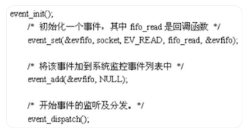

# 3、高性能网络编程(三)：下一个10年，是时候考虑C10M并发问题了

## 1、回顾一下C10K问题

10年前，开发人员处理C10K可扩展性问题时，尽量避免服务器处理超过1万个的并发连接。通过改进操作系统内核以及用事件驱动服务器（典型技术实现如：Nginx和Node）代替线程服务器（典型代表：Apache），使得这个问题已经被解决。人们用十年的时间从Apache转移到可扩展服务器，在近几年，可扩展服务器的采用率增长得更快了。

以传统网络编程模型作为代表的Apache为例，我们来看看它在C10K问题上的局限表现在哪些方面，并针对性的讨论对应的解决方法。

Apache的问题在于服务器的性能会随着连接数的增多而变差，实际上性能和可扩展性并不是一回事。当人们谈论规模时，他们往往是在谈论性能，但是规模和性能是不同的，比如Apache。持续几秒的短期连接：比如快速事务，如果每秒处理1000个事务，只能有约1000个并发连接到服务器。如果事务延长到10秒，要维持每秒1000个事务则必须打开1万个并发连接。这种情况下：尽管你不顾DoS攻击，Apache也会性能陡降，同时大量的下载操作也会使Apache崩溃。

如果每秒处理的连接从5千增加到1万，你会怎么做？比方说，你升级硬件并且提高处理器速度到原来的2倍。到底发生了什么？你得到两倍的性能，但你没有得到两倍的处理规模。每秒处理的连接可能只达到了6000。你继续提高速度，情况也没有改善。甚至16倍的性能时，仍然不能处理1万个并发连接。所以说性能和可扩展性是不一样的。

问题在于Apache会创建一个CGI进程，然后关闭，这个步骤并没有扩展。为什么呢？内核使用的O(N^2)算法使服务器无法处理1万个并发连接。

> OS内核中的两个基本问题：

连接数=线程数/进程数：当一个数据包进来，内核会遍历其所有进程以决定由哪个进程来处理这个数据包。

连接数=选择数/轮询次数（单线程）：同样的可扩展性问题，每个包都要走一遭列表上所有的socket。

通过上述针对Apache所表现出的问题，实际上彻底解决并发性能问题的解决方法的根本就是改进OS内核使其在常数时间内查找，使线程切换时间与线程数量无关，使用一个新的可扩展epoll()/IOCompletionPort常数时间去做socket查询。

因为线程调度并没有得到扩展，所以服务器大规模对socket使用epoll方法，这样就导致需要使用异步编程模式，而这些编程模式正是Nginx和Node类型服务器具有的。所以当从Apache迁移到Nginx和Node类型服务器时，即使在一个配置较低的服务器上增加连接数，性能也不会突降。所以在处理C10K连接时，一台笔记本电脑的速度甚至超过了16核的服务器。这也是前一个10年解决C10K问题的普遍方法。

## 2、实现C10M意味着什么？

实现10M（即1千万）的并发连接挑战意味着什么： 

- 1千万的并发连接数；
- 100万个连接/秒：每个连接以这个速率持续约10秒；
- 10GB/秒的连接：快速连接到互联网；
- 1千万个数据包/秒：据估计目前的服务器每秒处理50K数据包，以后会更多；
- 10微秒的延迟：可扩展服务器也许可以处理这个规模（但延迟可能会飙升）；
- 10微秒的抖动：限制最大延迟；
- 并发10核技术：软件应支持更多核的服务器（通常情况下，软件能轻松扩展到四核，服务器可以扩展到更多核，因此需要重写软件，以支持更多核的服务器）。

## 3、为什么说实现C10M的挑战不在硬件而在软件？

### 1、理由概述

硬件不是10M问题的性能瓶颈所在处，真正的问题出在软件上，尤其是*nux操作系统。理由如下面这几点：

首先：最初的设计是让Unix成为一个电话网络的控制系统，而不是成为一个服务器操作系统。对于控制系统而言，针对的主要目标是用户和任务，而并没有针对作为协助功能的数据处理做特别设计，也就是既没有所谓的快速路径、慢速路径，也没有各种数据服务处理的优先级差别。

其次：传统的CPU，因为只有一个核，操作系统代码以多线程或多任务的形式来提升整体性能。而现在，4核、8核、32核、64核和100核，都已经是真实存在的CPU芯片，如何提高多核的性能可扩展性，是一个必须面对的问题。比如让同一任务分割在多个核心上执行，以避免CPU的空闲浪费，当然，这里面要解决的技术点有任务分割、任务同步和异步等。

再次：核心缓存大小与内存速度是一个关键问题。现在，内存已经变得非常的便宜，随便一台普通的笔记本电脑，内存至少也就是4G以上，高端服务器的内存上24G那是相当的平常。但是，内存的访问速度仍然很慢，CPU访问一次内存需要约60~100纳秒，相比很久以前的内存访问速度，这基本没有增长多少。对于在一个带有1GHZ主频CPU的电脑硬件里，如果要实现10M性能，那么平均每一个包只有100纳秒，如果存在两次CPU访问内存，那么10M性能就达不到了。核心缓存，也就是CPU L1/L2/LL Cache，虽然访问速度会快些，但大小仍然不够，我之前接触到的高端至强，LLC容量大小貌似也就是12M。

### 2、解决思路

解决这些问题的关键在于如何将功能逻辑做好恰当的划分，比如专门负责控制逻辑的控制面和专门负责数据逻辑的数据面。数据面专门负责数据的处理，属于资源消耗的主要因素，压力巨大，而相比如此，控制面只负责一些偶尔才有非业务逻辑，比如与外部用户的交互、信息的统计等等。我之前接触过几种网络数据处理框架，比如Intel的DPDK、6wind、windriver，它们都针对Linux系统做了特别的补充设计，增加了数据面、快速路径等等特性，其性能的提升自然是相当巨大。

1、看一下这些高性能框架的共同特点：

> 数据包直接传递到业务逻辑：

而不是经过Linux内核协议栈。这是很明显的事情，因为我们知道，Linux协议栈是复杂和繁琐的，数据包经过它无非会导致性能的巨大下降，并且会占用大量的内存资源，之前有同事测试过，Linux内核要吃掉2.5KB内存/socket。我研究过很长一段时间的DPDK源码，其提供的82576和82599网卡驱动就直接运行在应用层，将接管网卡收到的数据包直接传递到应用层的业务逻辑里进行处理，而无需经过Linux内核协议栈。当然，发往本服务器的非业务逻辑数据包还是要经过Linux内核协议栈的，比如用户的SSH远程登录操作连接等。

> 多线程的核间绑定：

一个具有8核心的设备，一般会有1个控制面线程和7个或8个数据面线程，每一个线程绑定到一个处理核心（其中可能会存在一个控制面线程和一个数据面线程都绑定到同一个处理核心的情况）。这样做的好处是最大化核心CACHE利用、实现无锁设计、避免进程切换消耗等等。

> 内存是另外一个核心要素：

常见的内存池设计必须在这里得以切实应用。有几个考虑点，首先，可以在Linux系统启动时把业务所需内存直接预留出来，脱离Linux内核的管理。其次，Linux一般采用4K每页，而我们可以采用更大内存分页，比如2M，这样能在一定程度上减少地址转换等的性能消耗。

2、关于Intel的DPDK框架介绍：

随着网络技术的不断创新和市场的发展，越来越多的网络设备基础架构开始向基于通用处理器平台的架构方向融合，期望用更低的成本和更短的产品开发周期来提供多样的网络单元和丰富的功能，如应用处理、控制处理、包处理、信号处理等。为了适应这一新的产业趋势， Intel推出了基于Intel x86架构DPDK (Data Plane Development Kit，数据平面开发套件) 实现了高效灵活的包处理解决方案。经过近6年的发展，DPDK已经发展成支持多种高性能网卡和多通用处理器平台的开源软件工具包。

## 3、解决C10M问题的思路总结

综上所述，解决C10M问题的关键主要是从下面几个方面入手：

- 网卡问题：通过内核工作效率不高
- 解决方案：使用自己的驱动程序并管理它们，使适配器远离操作系统。

- CPU问题：使用传统的内核方法来协调你的应用程序是行不通的。
- 解决方案：Linux管理前两个CPU，你的应用程序管理其余的CPU，中断只发生在你允许的CPU上。

- 内存问题：内存需要特别关注，以求高效。
- 解决方案：在系统启动时就分配大部分内存给你管理的大内存页。

以Linux为例，解决的思咯就是将控制层交给Linux，应用程序管理数据。应用程序与内核之间没有交互、没有线程调度、没有系统调用、没有中断，什么都没有。 然而，你有的是在Linux上运行的代码，你可以正常调试，这不是某种怪异的硬件系统，需要特定的工程师。你需要定制的硬件在数据层提升性能，但是必须是在你熟悉的编程和开发环境上进行。 

# 4、高性能网络编程(四)：从C10K到C10M高性能网络应用的理论探索

# 5、高性能网络编程(五)：一文读懂高性能网络编程中的I/O模型

## 1、互联网服务端处理网络请求的原理

首先看看一个典型互联网服务端处理网络请求的典型过程：

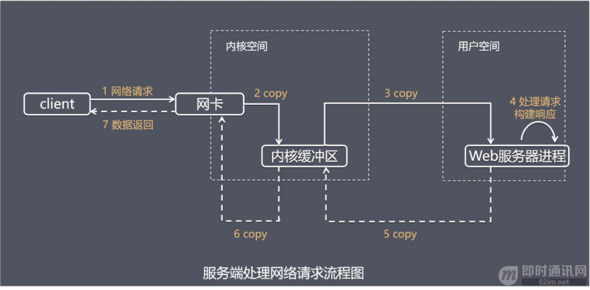

由上图可以看到，主要处理步骤包括： 

- 1）获取请求数据，客户端与服务器建立连接发出请求，服务器接受请求（1-3）；
- 2）构建响应，当服务器接收完请求，并在用户空间处理客户端的请求，直到构建响应完成（4）；
- 3）返回数据，服务器将已构建好的响应再通过内核空间的网络 I/O 发还给客户端（5-7）。

设计服务端并发模型时，主要有如下两个关键点： 

- 1）服务器如何管理连接，获取输入数据；
- 2）服务器如何处理请求。

以上两个关键点最终都与操作系统的 I/O 模型以及线程(进程)模型相关，这也是本文和下篇《高性能网络编程(六)：一文读懂高性能网络编程中的线程模型》将要介绍的内容。下面先详细介绍这I/O模型。

## 2、“I/O 模型”的基本认识

介绍操作系统的 I/O 模型之前，先了解一下几个概念： 

- 1）阻塞调用与非阻塞调用；
- 2）阻塞调用是指调用结果返回之前，当前线程会被挂起，调用线程只有在得到结果之后才会返回；
- 3）非阻塞调用指在不能立刻得到结果之前，该调用不会阻塞当前线程。

两者的最大区别在于被调用方在收到请求到返回结果之前的这段时间内，调用方是否一直在等待。

阻塞是指调用方一直在等待而且别的事情什么都不做；非阻塞是指调用方先去忙别的事情。

同步处理与异步处理：同步处理是指被调用方得到最终结果之后才返回给调用方；异步处理是指被调用方先返回应答，然后再计算调用结果，计算完最终结果后再通知并返回给调用方。

阻塞、非阻塞和同步、异步的区别（阻塞、非阻塞和同步、异步其实针对的对象是不一样的）：

1）阻塞、非阻塞的讨论对象是调用者；

2）同步、异步的讨论对象是被调用者。

> recvfrom 函数：

recvfrom 函数(经 Socket 接收数据)，这里把它视为系统调用。

一个输入操作通常包括两个不同的阶段：

1）等待数据准备好；

2）从内核向进程复制数据。

对于一个套接字上的输入操作，第一步通常涉及等待数据从网络中到达。当所等待分组到达时，它被复制到内核中的某个缓冲区。第二步就是把数据从内核缓冲区复制到应用进程缓冲区。

实际应用程序在系统调用完成上面的 2 步操作时，调用方式的阻塞、非阻塞，操作系统在处理应用程序请求时，处理方式的同步、异步处理的不同，可以分为 5 种 I/O 模型（下面的章节将逐个展开介绍）。（参考《UNIX网络编程卷1》）

## 3、I/O模型1：阻塞式 I/O 模型(blocking I/O）

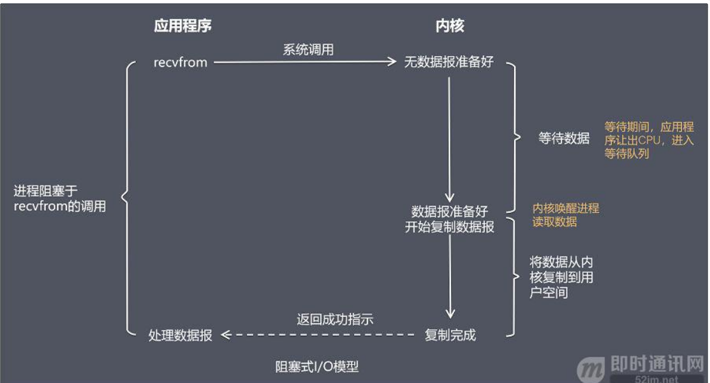

在阻塞式 I/O 模型中，应用程序在从调用 recvfrom 开始到它返回有数据报准备好这段时间是阻塞的，recvfrom 返回成功后，应用进程开始处理数据报。

- 比喻：一个人在钓鱼，当没鱼上钩时，就坐在岸边一直等。
- 优点：程序简单，在阻塞等待数据期间进程/线程挂起，基本不会占用 CPU 资源。
- 缺点：每个连接需要独立的进程/线程单独处理，当并发请求量大时为了维护程序，内存、线程切换开销较大，这种模型在实际生产中很少使用。

## 4、I/O模型2：非阻塞式 I/O 模型(non-blocking I/O）

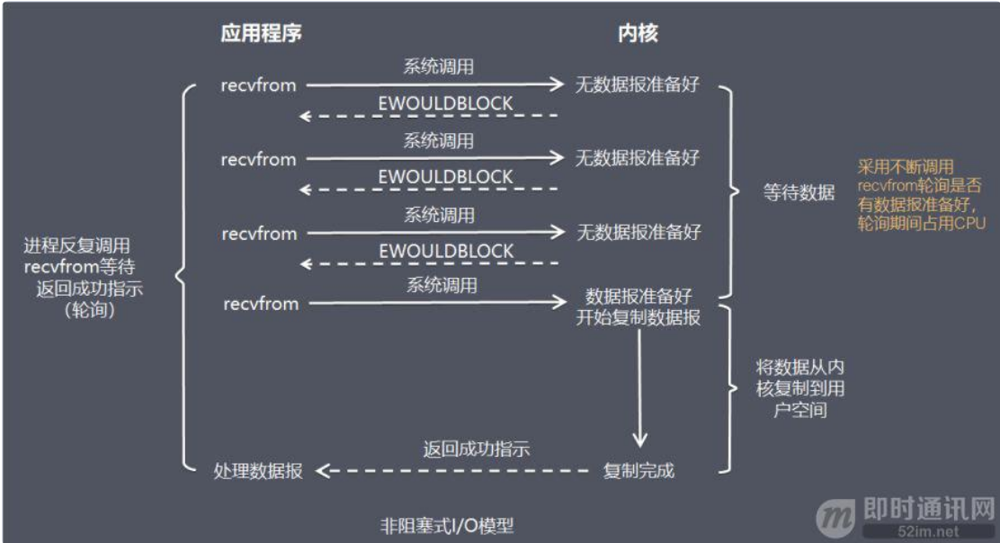

在非阻塞式 I/O 模型中，应用程序把一个套接口设置为非阻塞，就是告诉内核，当所请求的 I/O 操作无法完成时，不要将进程睡眠。

而是返回一个错误，应用程序基于 I/O 操作函数将不断的轮询数据是否已经准备好，如果没有准备好，继续轮询，直到数据准备好为止。

- 比喻：边钓鱼边玩手机，隔会再看看有没有鱼上钩，有的话就迅速拉杆。
- 优点：不会阻塞在内核的等待数据过程，每次发起的 I/O 请求可以立即返回，不用阻塞等待，实时性较好。
- 缺点：轮询将会不断地询问内核，这将占用大量的 CPU 时间，系统资源利用率较低，所以一般 Web 服务器不使用这种 I/O 模型。

## 5、I/O模型3：I/O 复用模型(I/O multiplexing）

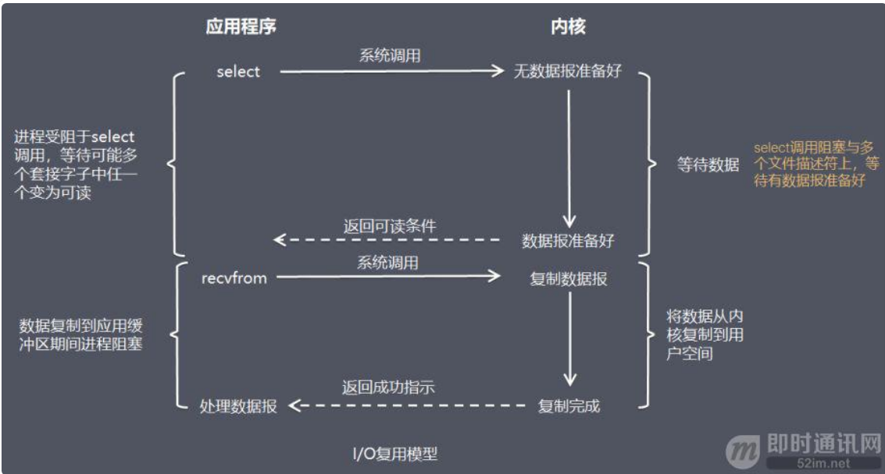

在 I/O 复用模型中，会用到 Select 或 Poll 函数或 Epoll 函数(Linux 2.6 以后的内核开始支持)，这两个函数也会使进程阻塞，但是和阻塞 I/O 有所不同。

这两个函数可以同时阻塞多个 I/O 操作，而且可以同时对多个读操作，多个写操作的 I/O 函数进行检测，直到有数据可读或可写时，才真正调用 I/O 操作函数。

- 比喻：放了一堆鱼竿，在岸边一直守着这堆鱼竿，没鱼上钩就玩手机。
- 优点：可以基于一个阻塞对象，同时在多个描述符上等待就绪，而不是使用多个线程(每个文件描述符一个线程)，这样可以大大节省系统资源。
- 缺点：当连接数较少时效率相比多线程+阻塞 I/O 模型效率较低，可能延迟更大，因为单个连接处理需要 2 次系统调用，占用时间会有增加。

众所周之，Nginx这样的高性能互联网反向代理服务器大获成功的关键就是得益于Epoll。

## 6、I/O模型4：信号驱动式 I/O 模型（signal-driven I/O)

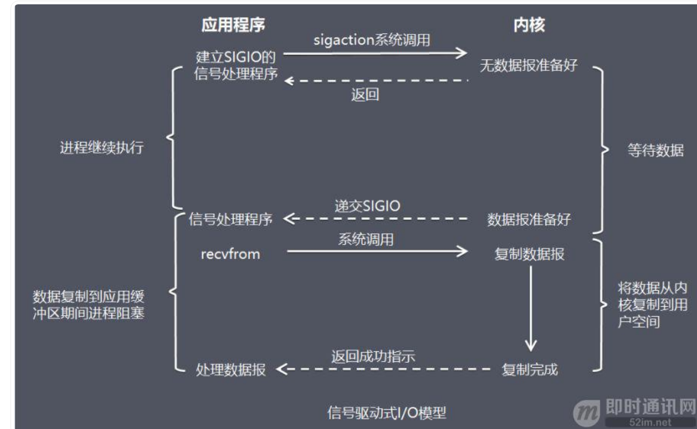

在信号驱动式 I/O 模型中，应用程序使用套接口进行信号驱动 I/O，并安装一个信号处理函数，进程继续运行并不阻塞。

当数据准备好时，进程会收到一个 SIGIO 信号，可以在信号处理函数中调用 I/O 操作函数处理数据。

- 比喻：鱼竿上系了个铃铛，当铃铛响，就知道鱼上钩，然后可以专心玩手机。
- 优点：线程并没有在等待数据时被阻塞，可以提高资源的利用率。
- 缺点：信号 I/O 在大量 IO 操作时可能会因为信号队列溢出导致没法通知。

信号驱动 I/O 尽管对于处理 UDP 套接字来说有用，即这种信号通知意味着到达一个数据报，或者返回一个异步错误。

但是，对于 TCP 而言，信号驱动的 I/O 方式近乎无用，因为导致这种通知的条件为数众多，每一个来进行判别会消耗很大资源，与前几种方式相比优势尽失。

## 7、I/O模型5：异步 I/O 模型（即AIO，全称asynchronous I/O）

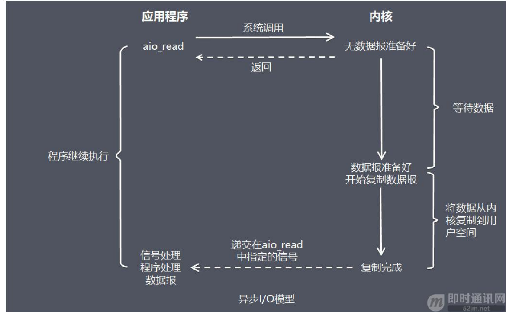

由 POSIX 规范定义，应用程序告知内核启动某个操作，并让内核在整个操作（包括将数据从内核拷贝到应用程序的缓冲区）完成后通知应用程序。

这种模型与信号驱动模型的主要区别在于：信号驱动 I/O 是由内核通知应用程序何时启动一个 I/O 操作，而异步 I/O 模型是由内核通知应用程序 I/O 操作何时完成。

- 优点：异步 I/O 能够充分利用 DMA 特性，让 I/O 操作与计算重叠。
- 缺点：要实现真正的异步 I/O，操作系统需要做大量的工作。目前 Windows 下通过 IOCP 实现了真正的异步 I/O。

而在 Linux 系统下，Linux 2.6才引入，目前 AIO 并不完善，因此在 Linux 下实现高并发网络编程时都是以 IO 复用模型模式为主。

关于AOI的介绍，请见：《Java新一代网络编程模型AIO原理及Linux系统AIO介绍》。

## 8、5 种 I/O 模型总结

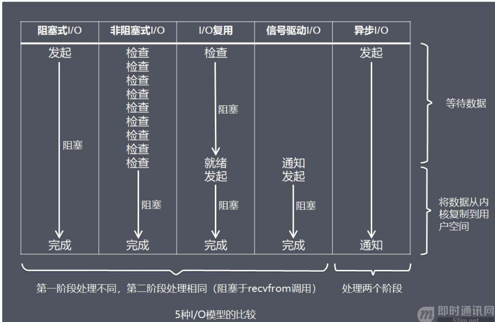

从上图中我们可以看出，越往后，阻塞越少，理论上效率也是最优。

这五种 I/O 模型中，前四种属于同步 I/O，因为其中真正的 I/O 操作(recvfrom)将阻塞进程/线程，只有异步 I/O 模型才与 POSIX 定义的异步 I/O 相匹配。

# 6、高性能网络编程(六)：一文读懂高性能网络编程中的线程模型

## 1、线程模型

上篇《高性能网络编程(五)：一文读懂高性能网络编程中的I/O模型》介绍完服务器如何基于 I/O 模型管理连接，获取输入数据，下面将介绍基于进程/线程模型，服务器如何处理请求。

值得说明的是，具体选择线程还是进程，更多是与平台及编程语言相关。

例如 C 语言使用线程和进程都可以(例如 Nginx 使用进程，Memcached 使用线程)，Java 语言一般使用线程(例如 Netty)，为了描述方便，下面都使用线程来进行描述。

## 2、线程模型1：传统阻塞 I/O 服务模型

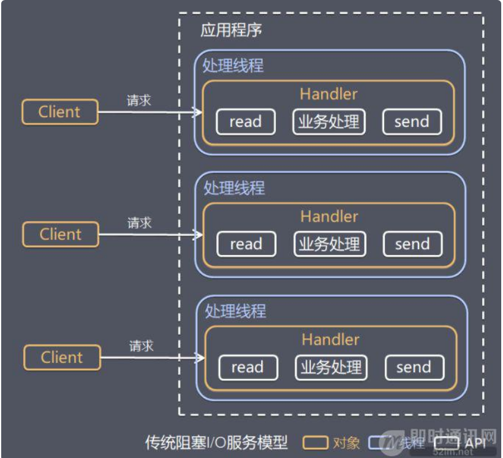

特点：

- 1）采用阻塞式 I/O 模型获取输入数据；
- 2）每个连接都需要独立的线程完成数据输入，业务处理，数据返回的完整操作。

存在问题：

- 1）当并发数较大时，需要创建大量线程来处理连接，系统资源占用较大；
- 2）连接建立后，如果当前线程暂时没有数据可读，则线程就阻塞在 Read 操作上，造成线程资源浪费。

## 3、线程模型2：Reactor 模式

### 1基本介绍

针对传统阻塞 I/O 服务模型的 2 个缺点，比较常见的有如下解决方案： 

1）基于 I/O 复用模型：多个连接共用一个阻塞对象，应用程序只需要在一个阻塞对象上等待，无需阻塞等待所有连接。当某条连接有新的数据可以处理时，操作系统通知应用程序，线程从阻塞状态返回，开始进行业务处理；

2）基于线程池复用线程资源：不必再为每个连接创建线程，将连接完成后的业务处理任务分配给线程进行处理，一个线程可以处理多个连接的业务。

I/O 复用结合线程池，这就是 Reactor 模式基本设计思想，如下图：

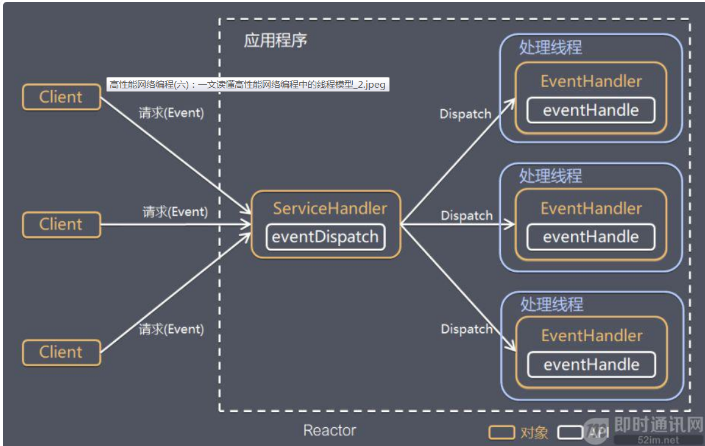

Reactor 模式，是指通过一个或多个输入同时传递给服务处理器的服务请求的事件驱动处理模式。 

服务端程序处理传入多路请求，并将它们同步分派给请求对应的处理线程，Reactor 模式也叫 Dispatcher 模式。

即 I/O 多了复用统一监听事件，收到事件后分发(Dispatch 给某进程)，是编写高性能网络服务器的必备技术之一。

> Reactor 模式中有 2 个关键组成：

1）Reactor：Reactor 在一个单独的线程中运行，负责监听和分发事件，分发给适当的处理程序来对 IO 事件做出反应。 它就像公司的电话接线员，它接听来自客户的电话并将线路转移到适当的联系人；

2）Handlers：处理程序执行 I/O 事件要完成的实际事件，类似于客户想要与之交谈的公司中的实际官员。Reactor 通过调度适当的处理程序来响应 I/O 事件，处理程序执行非阻塞操作。

根据 Reactor 的数量和处理资源池线程的数量不同，有 3 种典型的实现：

- 1）单 Reactor 单线程；
- 2）单 Reactor 多线程；
- 3）主从 Reactor 多线程。

下面详细介绍这 3 种实现方式。

### 2单 Reactor 单线程

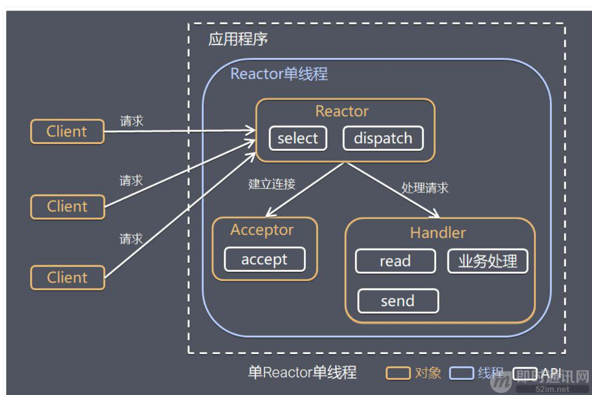

其中，Select 是前面 I/O 复用模型介绍的标准网络编程 API，可以实现应用程序通过一个阻塞对象监听多路连接请求，其他方案示意图类似。

方案说明：

- 1）Reactor 对象通过 Select 监控客户端请求事件，收到事件后通过 Dispatch 进行分发；
- 2）如果是建立连接请求事件，则由 Acceptor 通过 Accept 处理连接请求，然后创建一个 Handler 对象处理连接完成后的后续业务处理；
- 3）如果不是建立连接事件，则 Reactor 会分发调用连接对应的 Handler 来响应；
- 4）Handler 会完成 Read→业务处理→Send 的完整业务流程。

优点：模型简单，没有多线程、进程通信、竞争的问题，全部都在一个线程中完成。

缺点：性能问题，只有一个线程，无法完全发挥多核 CPU 的性能。Handler 在处理某个连接上的业务时，整个进程无法处理其他连接事件，很容易导致性能瓶颈。

可靠性问题，线程意外跑飞，或者进入死循环，会导致整个系统通信模块不可用，不能接收和处理外部消息，造成节点故障。

使用场景：客户端的数量有限，业务处理非常快速，比如 Redis，业务处理的时间复杂度 O(1)。

### 3单 Reactor 多线程

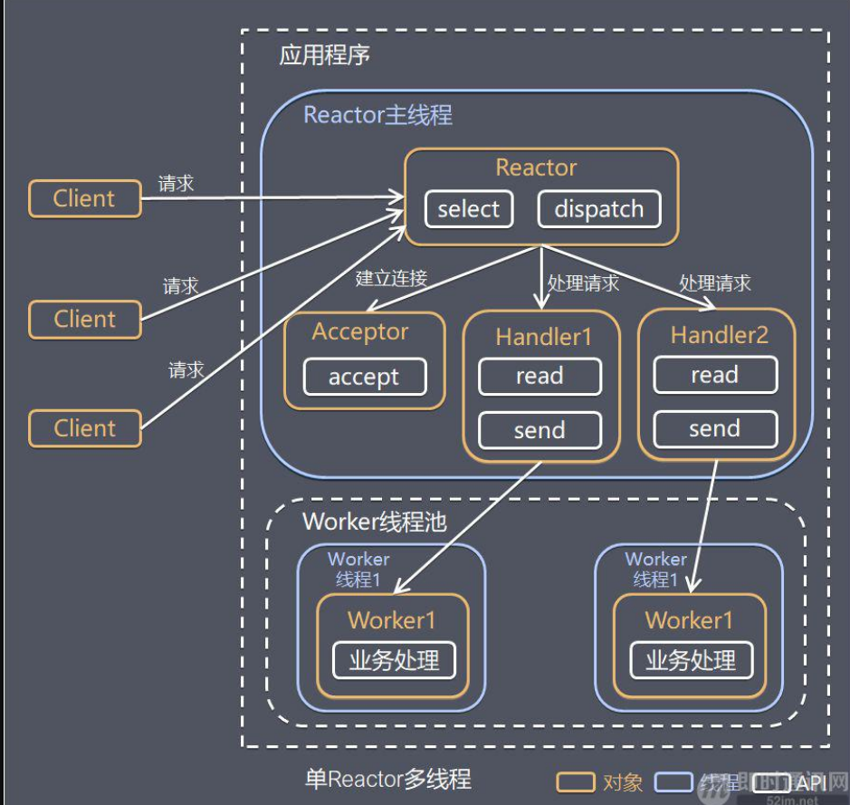

方案说明：

- 1）Reactor 对象通过 Select 监控客户端请求事件，收到事件后通过 Dispatch 进行分发；
- 2）如果是建立连接请求事件，则由 Acceptor 通过 Accept 处理连接请求，然后创建一个 Handler 对象处理连接完成后续的各种事件；
- 3）如果不是建立连接事件，则 Reactor 会分发调用连接对应的 Handler 来响应；
- 4）Handler 只负责响应事件，不做具体业务处理，通过 Read 读取数据后，会分发给后面的 Worker 线程池进行业务处理；
- 5）Worker 线程池会分配独立的线程完成真正的业务处理，如何将响应结果发给 Handler 进行处理；
- 6）Handler 收到响应结果后通过 Send 将响应结果返回给 Client。

优点：可以充分利用多核 CPU 的处理能力。

缺点：多线程数据共享和访问比较复杂；Reactor 承担所有事件的监听和响应，在单线程中运行，高并发场景下容易成为性能瓶颈。

### 4主从 Reactor 多线程

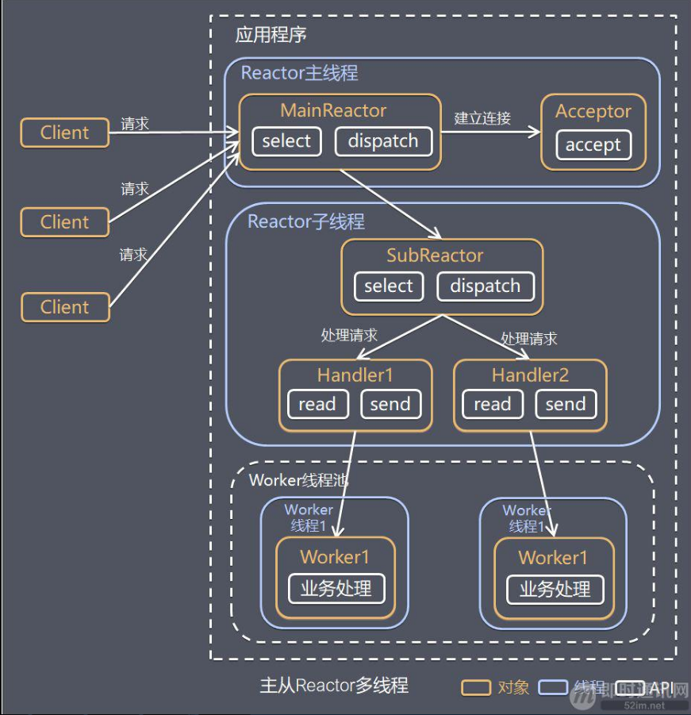

针对单 Reactor 多线程模型中，Reactor 在单线程中运行，高并发场景下容易成为性能瓶颈，可以让 Reactor 在多线程中运行。

方案说明：

- 1）Reactor 主线程 MainReactor 对象通过 Select 监控建立连接事件，收到事件后通过 Acceptor 接收，处理建立连接事件；
- 2）Acceptor 处理建立连接事件后，MainReactor 将连接分配 Reactor 子线程给 SubReactor 进行处理；
- 3）SubReactor 将连接加入连接队列进行监听，并创建一个 Handler 用于处理各种连接事件；
- 4）当有新的事件发生时，SubReactor 会调用连接对应的 Handler 进行响应；
- 5）Handler 通过 Read 读取数据后，会分发给后面的 Worker 线程池进行业务处理；
- 6）Worker 线程池会分配独立的线程完成真正的业务处理，如何将响应结果发给 Handler 进行处理；
- 7）Handler 收到响应结果后通过 Send 将响应结果返回给 Client。

优点：父线程与子线程的数据交互简单职责明确，父线程只需要接收新连接，子线程完成后续的业务处理。

父线程与子线程的数据交互简单，Reactor 主线程只需要把新连接传给子线程，子线程无需返回数据。

这种模型在许多项目中广泛使用，包括 Nginx 主从 Reactor 多进程模型，Memcached 主从多线程，Netty 主从多线程模型的支持。

### 5小结

3 种模式可以用个比喻来理解：（餐厅常常雇佣接待员负责迎接顾客，当顾客入坐后，侍应生专门为这张桌子服务）

- 1）单 Reactor 单线程，接待员和侍应生是同一个人，全程为顾客服务；
- 2）单 Reactor 多线程，1 个接待员，多个侍应生，接待员只负责接待；
- 3）主从 Reactor 多线程，多个接待员，多个侍应生。

Reactor 模式具有如下的优点：

- 1）响应快，不必为单个同步时间所阻塞，虽然 Reactor 本身依然是同步的；
- 2）编程相对简单，可以最大程度的避免复杂的多线程及同步问题，并且避免了多线程/进程的切换开销；
- 3）可扩展性，可以方便的通过增加 Reactor 实例个数来充分利用 CPU 资源；
- 4）可复用性，Reactor 模型本身与具体事件处理逻辑无关，具有很高的复用性。

## 4、线程模型2：Proactor 模型

在 Reactor 模式中，Reactor 等待某个事件或者可应用或者操作的状态发生（比如文件描述符可读写，或者是 Socket 可读写）。

然后把这个事件传给事先注册的 Handler（事件处理函数或者回调函数），由后者来做实际的读写操作。

其中的读写操作都需要应用程序同步操作，所以 Reactor 是非阻塞同步网络模型。

如果把 I/O 操作改为异步，即交给操作系统来完成就能进一步提升性能，这就是异步网络模型 Proactor。

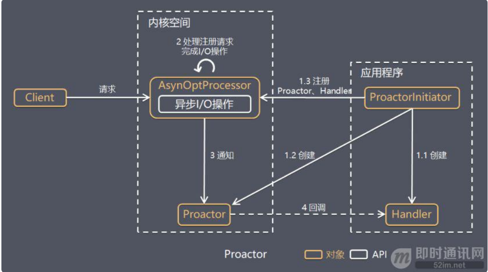

Proactor 是和异步 I/O 相关的，详细方案如下：

- 1）Proactor Initiator 创建 Proactor 和 Handler 对象，并将 Proactor 和 Handler 都通过 AsyOptProcessor（Asynchronous Operation Processor）注册到内核；
- 2）AsyOptProcessor 处理注册请求，并处理 I/O 操作；
- 3）AsyOptProcessor 完成 I/O 操作后通知 Proactor；
- 4）Proactor 根据不同的事件类型回调不同的 Handler 进行业务处理；
- 5）Handler 完成业务处理。

可以看出 Proactor 和 Reactor 的区别：

- 1）Reactor 是在事件发生时就通知事先注册的事件（读写在应用程序线程中处理完成）；

- 2）Proactor 是在事件发生时基于异步 I/O 完成读写操作（由内核完成），待 I/O 操作完成后才回调应用程序的处理器来进行业务处理。

理论上 Proactor 比 Reactor 效率更高，异步 I/O 更加充分发挥 DMA(Direct Memory Access，直接内存存取)的优势。

但是Proactor有如下缺点： 

1）编程复杂性，由于异步操作流程的事件的初始化和事件完成在时间和空间上都是相互分离的，因此开发异步应用程序更加复杂。应用程序还可能因为反向的流控而变得更加难以 Debug；

2）内存使用，缓冲区在读或写操作的时间段内必须保持住，可能造成持续的不确定性，并且每个并发操作都要求有独立的缓存，相比 Reactor 模式，在 Socket 已经准备好读或写前，是不要求开辟缓存的；

3）操作系统支持，Windows 下通过 IOCP 实现了真正的异步 I/O，而在 Linux 系统下，Linux 2.6 才引入，目前异步 I/O 还不完善。

因此在 Linux 下实现高并发网络编程都是以 Reactor 模型为主。

# 参考

- [C10K问题](https://www.jianshu.com/p/ba7fa25d3590)

- [高性能网络编程(一)：单台服务器并发TCP连接数到底可以有多少](http://www.52im.net/thread-561-1-1.html)
- [高性能网络编程(二)：上一个10年，著名的C10K并发连接问题](http://www.52im.net/thread-566-1-1.html)
- [高性能网络编程(三)：下一个10年，是时候考虑C10M并发问题了](http://www.52im.net/thread-568-1-1.html)
- [高性能网络编程(四)：从C10K到C10M高性能网络应用的理论探索](http://www.52im.net/thread-578-1-1.html)
- [高性能网络编程(五)：一文读懂高性能网络编程中的I/O模型](http://www.52im.net/thread-1935-1-1.html)
- [高性能网络编程(六)：一文读懂高性能网络编程中的线程模型](http://www.52im.net/thread-1939-1-1.html)
- 

