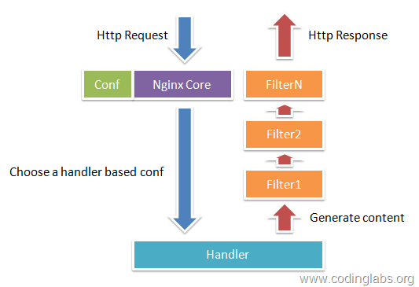
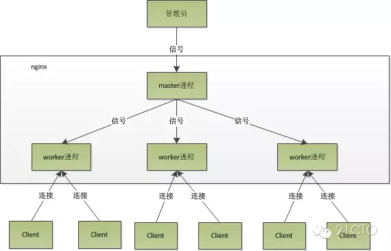
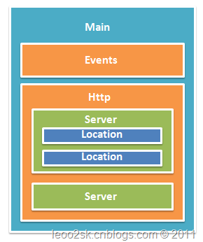
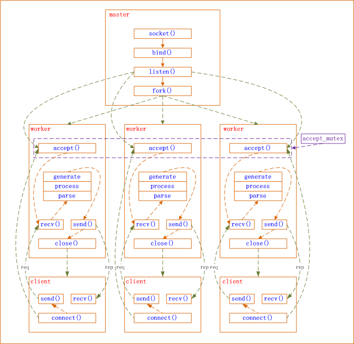

[nginx配置location总结及rewrite规则写法](https://segmentfault.com/a/1190000002797606)
[Nginx Location配置总结](http://blog.sina.com.cn/s/blog_97688f8e0100zws5.html)
[nginx反向代理原理](https://www.xuebuyuan.com/2207303.html)
[使用Nginx实现负载均衡](http://www.cnblogs.com/wufengtinghai/p/5237165.html)
[Nginx 配置从零开始](https://www.open-open.com/lib/view/open1419826381531.html)
[关于一些对location认识的误区](http://www.cnblogs.com/lidabo/p/4169396.html)
[Nginx为什么比Apache Httpd高效：原理篇](http://www.toxingwang.com/linux-unix/linux-basic/1712.html)
[Nginx配置文件详细说明](http://www.cnblogs.com/xiaogangqq123/archive/2011/03/02/1969006.html)


# 一、概念
Nginx 是一个高性能的HTTP和反向代理服务器，也是一个 IMAP/POP3/SMTP 服务器。 Nginx 是由 Igor Sysoev 为俄罗斯访问量第二的 Rambler.ru 站点开发的，
第一个公开版本0.1.0发布于2004年10月4日。其将源代码以类BSD许可证的形式发布，因它的稳定性、丰富的功能集、示例配置文件和低系统资源的消耗而闻名。
2011年6月1日，nginx 1.0.4发布。


# 二、特点
Nginx是一款面向性能设计的HTTP服务器，相较于Apache、lighttpd具有占有内存少，稳定性高等优势。
与旧版本（<=2.2）的Apache不同，nginx不采用每客户机一线程的设计模型，而是充分使用异步逻辑，削减了上下文调度开销，
所以并发服务能力更强。整体采用模块化设计，有丰富的模块库和第三方模块库，配置灵活。
在Linux操作系统下，nginx使用epoll事件模型，得益于此，nginx在Linux操作系统下效率相当高。
同时Nginx在OpenBSD或FreeBSD操作系统上采用类似于epoll的高效事件模型kqueue。

其特点是占有内存少，并发能力强，事实上nginx的并发能力确实在同类型的网页服务器中表现较好，中国大陆使用nginx网站用户有:百度、新浪、网易、腾讯等。

# 三、工作原理
当nginx接收到一个http请求时，通过配置文件nginx.conf找到对应的server。
然后匹配server中的所有location，找到最匹配的。而在location中的命令会启动不同的模块去完成工作，比如rewrite模块、index模块。
因此在nginx中模块可以看作真正的劳动工作者。nginx的模块是被编译到nginx中的，属于静态方式。启动nginx时，模块被自动加载。
不像apache，把模块单独编译成so文件，在配置文件中指定是否加载。所以，单比模块加载方面，nginx也比apache速度上有提升。

## 1.  Nginx的模块与工作原理

Nginx由内核和模块组成，其中，内核的设计非常微小和简洁，完成的工作也非常简单，
仅仅通过查找配置文件将客户端请求映射到一个location block（location是Nginx配置中的一个指令，用于URL匹配），
而在这个location中所配置的每个指令将会启动不同的模块去完成相应的工作。

Nginx的模块从结构上分为核心模块、基础模块和第三方模块：

- 核心模块：HTTP模块、EVENT模块和MAIL模块

- 基础模块：HTTP Access模块、HTTP FastCGI模块、HTTP Proxy模块和HTTP Rewrite模块，

- 第三方模块：HTTP Upstream Request Hash模块、Notice模块和HTTP Access Key模块。

用户根据自己的需要开发的模块都属于第三方模块。正是有了这么多模块的支撑，Nginx的功能才会如此强大。

Nginx的模块从功能上分为如下三类。

Handlers（处理器模块）。此类模块直接处理请求，并进行输出内容和修改headers信息等操作。Handlers处理器模块一般只能有一个。

Filters （过滤器模块）。此类模块主要对其他处理器模块输出的内容进行修改操作，最后由Nginx输出。

Proxies （代理类模块）。此类模块是Nginx的HTTP Upstream之类的模块，这些模块主要与后端一些服务比如FastCGI等进行交互，实现服务代理和负载均衡等功能。

下图展示了Nginx模块常规的HTTP请求和响应的过程。展示了Nginx模块常规的HTTP请求和响应的过程。



Nginx本身做的工作实际很少，当它接到一个HTTP请求时，它仅仅是通过查找配置文件将此次请求映射到一个location block，
而此location中所配置的各个指令则会启动不同的模块去完成工作，因此模块可以看做Nginx真正的劳动工作者。
通常一个location中的指令会涉及一个handler模块和多个filter模块（当然，多个location可以复用同一个模块）。
handler模块负责处理请求，完成响应内容的生成，而filter模块对响应内容进行处理。

Nginx的模块直接被编译进Nginx，因此属于静态编译方式。启动Nginx后，Nginx的模块被自动加载，不像Apache，
首先将模块编译为一个so文件，然后在配置文件中指定是否进行加载。
在解析配置文件时，Nginx的每个模块都有可能去处理某个请求，但是同一个处理请求只能由一个模块来完成。 

## 2.  Nginx的进程模型

在工作方式上，Nginx分为单工作进程和多工作进程两种模式。
在单工作进程模式下，除主进程外，还有一个工作进程，工作进程是单线程的；
在多工作进程模式下，每个工作进程包含多个线程。Nginx默认为单工作进程模式。
Nginx在启动后，会有一个master进程和多个worker进程。

### master进程
主要用来管理worker进程，包含：接收来自外界的信号，向各worker进程发送信号，监控worker进程的运行状态，
当worker进程退出后(异常情况下)，会自动重新启动新的worker进程。
master进程充当整个进程组与用户的交互接口，同时对进程进行监护。它不需要处理网络事件，不负责业务的执行，
只会通过管理worker进程来实现重启服务、平滑升级、更换日志文件、配置文件实时生效等功能。

我们要控制nginx，只需要通过kill向master进程发送信号就行了。比如kill -HUP pid，则是告诉nginx，从容地重启nginx，
我们一般用这个信号来重启nginx，或重新加载配置，因为是从容地重启，因此服务是不中断的。
master进程在接收到HUP信号后是怎么做的呢？

首先master进程在接到信号后，会先重新加载配置文件，然后再启动新的worker进程，并向所有老的worker进程发送信号，
告诉他们可以光荣退休了。新的worker在启动后，就开始接收新的请求，而老的worker在收到来自master的信号后，
就不再接收新的请求，并且在当前进程中的所有未处理完的请求处理完成后，再退出。当然，直接给master进程发送信号，
这是比较老的操作方式，nginx在0.8版本之后，引入了一系列命令行参数，来方便我们管理。比如，./nginx -s reload，
就是来重启nginx，./nginx -s stop，就是来停止nginx的运行。如何做到的呢？
我们还是拿reload来说，我们看到，执行命令时，我们是启动一个新的nginx进程，而新的nginx进程在解析到reload参数后，
就知道我们的目的是控制nginx来重新加载配置文件了，它会向master进程发送信号，然后接下来的动作，
就和我们直接向master进程发送信号一样了。

### worker进程

而基本的网络事件，则是放在worker进程中来处理了。多个worker进程之间是对等的，他们同等竞争来自客户端的请求，
各进程互相之间是独立的。一个请求，只可能在一个worker进程中处理，一个worker进程，不可能处理其它进程的请求。
worker进程的个数是可以设置的，一般我们会设置与机器cpu核数一致，这里面的原因与nginx的进程模型以及事件处理模型是分不开的。
worker进程之间是平等的，每个进程，处理请求的机会也是一样的。当我们提供80端口的http服务时，一个连接请求过来，
每个进程都有可能处理这个连接，怎么做到的呢？

首先，每个worker进程都是从master进程fork过来，在master进程里面，先建立好需要listen的socket（listenfd）之后，
然后再fork出多个worker进程。所有worker进程的listenfd会在新连接到来时变得可读，为保证只有一个进程处理该连接，
所有worker进程在注册listenfd读事件前抢accept_mutex，抢到互斥锁的那个进程注册listenfd读事件，
在读事件里调用accept接受该连接。当一个worker进程在accept这个连接之后，就开始读取请求，解析请求，处理请求，产生数据后，
再返回给客户端，最后才断开连接，这样一个完整的请求就是这样的了。
我们可以看到，一个请求，完全由worker进程来处理，而且只在一个worker进程中处理。worker进程之间是平等的，
每个进程，处理请求的机会也是一样的。
nginx的进程模型，可以由下图来表示：


其中“#”表示此行是注释

# 四、配置

Nginx的配置文件是以block的形式组织的，一个block通常使用大括号“{}”表示。
block分为几个层级，整个配置文件为main层级，这是最大的层级；
在main层级下可以有event、http等层级，而http中又会有server block，server block中可以包含location block。
每个层级可以有自己的指令（Directive），例如worker_processes是一个main层级指令，它指定Nginx服务的Worker进程数量。
有的指令只能在一个层级中配置，如worker_processes只能存在于main中，而有的指令可以存在于多个层级，
在这种情况下，子block会继承父block的配置，同时如果子block配置了与父block不同的指令，则会覆盖掉父block的配置。
指令的格式是“指令名 参数1  参数2 … 参数N;”，注意参数间可用任意数量空格分隔，最后要加分号。
在开发Nginx HTTP扩展模块过程中，需要特别注意的是main、server和location三个层级，
因为扩展模块通常允许指定新的配置指令在这三个层级中。
最后要提到的是配置文件是可以包含的，如上面配置文件中“include mime.types”就包含了mine.types这个配置文件，
此文件指定了各种HTTP Content-type。
一般来说，一个server block表示一个Host，而里面的一个location则代表一个路由映射规则，这两个block可以说是HTTP配置的核心。
下图是Nginx配置文件通常结构图示。


Nginx配置文件分为好多块，常见的从外到内依次是「http」、「server」、「location」等等，
缺省的继承关系是从外到内，也就是说内层块会自动获取外层块的值作为缺省值。

```
例如：php配置

- server {
-     listen 80;
-     server_name foo.com;
-     root /path;
-     location / {
-         index index.html index.htm index.php;
-         if (!-e $request_filename) {
-             rewrite . /index.php last;
-         }
-     }
-     location ~ \.php$ {
-         include fastcgi_params;
-         fastcgi_param SCRIPT_FILENAME /path$fastcgi_script_name;
-         fastcgi_pass 127.0.0.1:9000;
-         fastcgi_index index.php;
-     }
- }

```
# 五、事件模块
对于一个基本的 WEB 服务器来说，事件通常有三种类型，网络事件、信号和定时器。
一个请求的基本过程：建立连接 - 接受连接 - 发送数据，在系统底层就是读写事件。

## 1、Epoll 



模型Epoll出现在 linux2.6以后，Nginx采用 Epoll 这种异步非阻塞的事件处理机制。这种机制的原理就是把一个完整的请求，
划分成多个事件，比如accept（）， recv（），磁盘I/O，send（），每个事件都有不同的模块进行处理。
一个请求由一个worker进程处理，在请求多的时候，无需频繁的切换进程。

	1. master进程先建好需要listen的socket后，然后再fork出多个woker进程，这样每个work进程都可以去accept这个socket
	2. 当一个client连接到来时，所有accept的work进程都会受到通知，但只有一个进程可以accept成功，其它的则会accept失败，Nginx提供了一把共享锁accept_mutex来保证同一时刻只有一个work进程在accept连接，从而解决惊群问题
	3. 当一个worker进程accept这个连接后，就开始读取请求，解析请求，处理请求，产生数据后，再返回给客户端，最后才断开连接，这样一个完成的请求就结束了

Epoll 是基于一个进程处理多个连接、非阻塞IO的策略，Nginx多使用这种策略。

## 2、Select 模型

Select 模型在启动的时候创建多个进程，放在一个进程池里，并且进程池里的进程数会随着请求数目的增加而增加，
对于每一个连接，都是在一个进程内处理完毕。所以Select模型能接收的并发量受到所能开启的进程数影响，进程之间是互相阻塞的，
且频繁的切换进程造成大量开销。
Select 是基于一个线程处理一个请求的非阻塞IO的策略，Apache使用这种策略。


```
nginx配置全解
#定义Nginx运行的用户和用户组
user www www;

#nginx进程数，建议设置为等于CPU总核心数。
worker_processes 8;

#全局错误日志定义类型，[ debug | info | notice | warn | error | crit ]
error_log /var/log/nginx/error.log info;

#进程文件
pid /var/run/nginx.pid;

#一个nginx进程打开的最多文件描述符数目，理论值应该是最多打开文件数（系统的值ulimit -n）与nginx进程数相除，但是nginx分配请求并不均匀，所以建议与ulimit -n的值保持一致。
worker_rlimit_nofile 65535;

#工作模式与连接数上限
events
{
#参考事件模型，use [ kqueue | rtsig | epoll | /dev/poll | select | poll ]; epoll模型是Linux 2.6以上版本内核中的高性能网络I/O模型，如果跑在FreeBSD上面，就用kqueue模型。
use epoll;
#单个进程最大连接数（最大连接数=连接数*进程数）
worker_connections 65535;
}

#设定http服务器
http
{
include mime.types; #文件扩展名与文件类型映射表
default_type application/octet-stream; #默认文件类型
#charset utf-8; #默认编码
server_names_hash_bucket_size 128; #服务器名字的hash表大小
client_header_buffer_size 32k; #上传文件大小限制
large_client_header_buffers 4 64k; #设定请求缓
client_max_body_size 8m; #设定请求缓
sendfile on; #开启高效文件传输模式，sendfile指令指定nginx是否调用sendfile函数来输出文件，对于普通应用设为 on，如果用来进行下载等应用磁盘IO重负载应用，可设置为off，以平衡磁盘与网络I/O处理速度，降低系统的负载。注意：如果图片显示不正常把这个改成off。
autoindex on; #开启目录列表访问，合适下载服务器，默认关闭。
tcp_nopush on; #防止网络阻塞
tcp_nodelay on; #防止网络阻塞
keepalive_timeout 120; #长连接超时时间，单位是秒

#FastCGI相关参数是为了改善网站的性能：减少资源占用，提高访问速度。下面参数看字面意思都能理解。
fastcgi_connect_timeout 300;
fastcgi_send_timeout 300;
fastcgi_read_timeout 300;
fastcgi_buffer_size 64k;
fastcgi_buffers 4 64k;
fastcgi_busy_buffers_size 128k;
fastcgi_temp_file_write_size 128k;

#gzip模块设置
gzip on; #开启gzip压缩输出
gzip_min_length 1k; #最小压缩文件大小
gzip_buffers 4 16k; #压缩缓冲区
gzip_http_version 1.0; #压缩版本（默认1.1，前端如果是squid2.5请使用1.0）
gzip_comp_level 2; #压缩等级
gzip_types text/plain application/x-javascript text/css application/xml;
#压缩类型，默认就已经包含text/html，所以下面就不用再写了，写上去也不会有问题，但是会有一个warn。
gzip_vary on;
#limit_zone crawler $binary_remote_addr 10m; #开启限制IP连接数的时候需要使用

upstream blog.ha97.com {
#upstream的负载均衡，weight是权重，可以根据机器配置定义权重。weigth参数表示权值，权值越高被分配到的几率越大。
server 192.168.80.121:80 weight=3;
server 192.168.80.122:80 weight=2;
server 192.168.80.123:80 weight=3;
}

#虚拟主机的配置
server
{
#监听端口
listen 80;
#域名可以有多个，用空格隔开
server_name www.ha97.com ha97.com;
index index.html index.htm index.php;
root /data/www/ha97;
location ~ .*.(php|php5)?$
{
fastcgi_pass 127.0.0.1:9000;
fastcgi_index index.php;
include fastcgi.conf;
}
#图片缓存时间设置
location ~ .*.(gif|jpg|jpeg|png|bmp|swf)$
{
expires 10d;
}
#JS和CSS缓存时间设置
location ~ .*.(js|css)?$
{
expires 1h;
}
#日志格式设定
log_format access '$remote_addr - $remote_user [$time_local] "$request" '
'$status $body_bytes_sent "$http_referer" '
'"$http_user_agent" $http_x_forwarded_for';
#定义本虚拟主机的访问日志
access_log /var/log/nginx/ha97access.log access;

#对 "/" 启用反向代理
location / {
proxy_pass http://127.0.0.1:88;
proxy_redirect off;
proxy_set_header X-Real-IP $remote_addr;
#后端的Web服务器可以通过X-Forwarded-For获取用户真实IP
proxy_set_header X-Forwarded-For $proxy_add_x_forwarded_for;
#以下是一些反向代理的配置，可选。
proxy_set_header Host $host;
client_max_body_size 10m; #允许客户端请求的最大单文件字节数
client_body_buffer_size 128k; #缓冲区代理缓冲用户端请求的最大字节数，
proxy_connect_timeout 90; #nginx跟后端服务器连接超时时间(代理连接超时)
proxy_send_timeout 90; #后端服务器数据回传时间(代理发送超时)
proxy_read_timeout 90; #连接成功后，后端服务器响应时间(代理接收超时)
proxy_buffer_size 4k; #设置代理服务器（nginx）保存用户头信息的缓冲区大小
proxy_buffers 4 32k; #proxy_buffers缓冲区，网页平均在32k以下的设置
proxy_busy_buffers_size 64k; #高负荷下缓冲大小（proxy_buffers*2）
proxy_temp_file_write_size 64k;
#设定缓存文件夹大小，大于这个值，将从upstream服务器传
}

#设定查看Nginx状态的地址
location /NginxStatus {
stub_status on;
access_log on;
auth_basic "NginxStatus";
auth_basic_user_file conf/htpasswd;
#htpasswd文件的内容可以用apache提供的htpasswd工具来产生。
}

#本地动静分离反向代理配置
#所有jsp的页面均交由tomcat或resin处理
location ~ .(jsp|jspx|do)?$ {
proxy_set_header Host $host;
proxy_set_header X-Real-IP $remote_addr;
proxy_set_header X-Forwarded-For $proxy_add_x_forwarded_for;
proxy_pass http://127.0.0.1:8080;
}
#所有静态文件由nginx直接读取不经过tomcat或resin
location ~ .*.(htm|html|gif|jpg|jpeg|png|bmp|swf|ioc|rar|zip|txt|flv|mid|doc|ppt|pdf|xls|mp3|wma)$
{ expires 15d; }
location ~ .*.(js|css)?$
{ expires 1h; }
}
}

```


