[](https://www.liangzl.com/get-article-detail-37906.html)
[深入浅出Redis-redis底层数据结构（上）](http://www.cnblogs.com/jaycekon/p/6227442.html)
[深入浅出Redis-redis底层数据结构（下）](https://www.cnblogs.com/jaycekon/p/6277653.html)
[](https://mp.weixin.qq.com/s?__biz=MzI4Njg5MDA5NA==&mid=2247484359&idx=1&sn=0994c6246990b7ad42a2d3f294042316&chksm=ebd742c6dca0cbd0a826ace13f4d4eeff282052f4a97b31654ef1b3b32f991374f5c67a45ae9&token=1834317504&lang=zh_CN#rd)


# 前言

在《Redis设计与实现》这样描述：
```
Redis 数据库里面的每个键值对（key-value） 都是由对象（object）组成的：
数据库键总是一个字符串对象（string object）;
数据库的值则可以是字符串对象、列表对象（list）、哈希对象（hash）、集合对象（set）、有序集合（sort set）对象这五种对象中的其中一种。
```
但要值得注意的是：Redis并没有直接使用这些数据结构来实现key-value数据库，而是基于这些数据结构创建了一个对象系统。

简单来说：
Redis使用对象来表示数据库中的键和值。每次我们在Redis数据库中新创建一个键值对时，至少会创建出两个对象。一个是键对象，一个是值对象。

Redis中的每个对象都由一个redisObject结构来表示：
```sql
typedef struct redisObject{

    // 对象的类型
    unsigned type 4:;

    // 对象的编码格式
    unsigned encoding:4;

    // 指向底层实现数据结构的指针
    void * ptr;

    //.....


}robj;
```
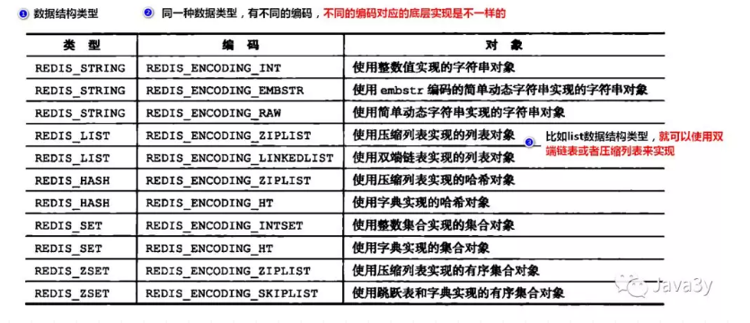

简单来说就是Redis对key-value封装成对象，key是一个对象，value也是一个对象。
每个对象都有type(类型)、encoding(编码)、ptr(指向底层数据结构的指针)来表示。

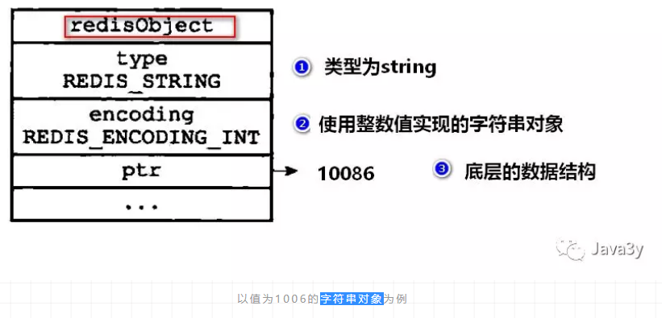

## 1、字符串(stirng)对象
**在上面的图我们知道string类型有三种编码格式：**

- int：整数值，这个整数值可以使用long类型来表示,如果是浮点数，那就用embstr或者raw编码。具体用哪个就看这个数的长度了

- embstr：字符串值，这个字符串值的长度小于32字节

- raw：字符串值，这个字符串值的长度大于32字节

**embstr和raw的区别：**

- raw分配内存和释放内存的次数是两次，embstr是一次

- embstr编码的数据保存在一块连续的内存里面

**编码之间的转换：**

- int类型如果存的不再是一个整数值，则会从int转成raw

- embstr是只读的，在修改的时候回从embstr转成raw

## 2列表(list)对象
在上面的图我们知道list类型有两种编码格式：

ziplist：字符串元素的长度都小于64个字节||总数量少于512个

linkedlist：字符串元素的长度大于64个字节||总数量大于512个

ziplist编码的列表结构：
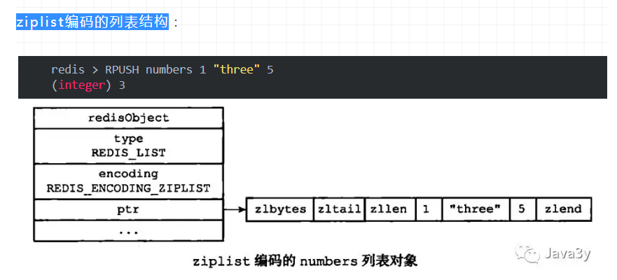

linkedlist编码的列表结构：


编码之间的转换：

原本是ziplist编码的，如果保存的数据长度太大或者元素数量过多，会转换成linkedlist编码的。

## 3哈希(hash)对象
在上面的图我们知道hash类型有两种编码格式：

ziplist：key和value的字符串长度都小于64字节|| 键值对总数量小于512

hashtable：key和value的字符串长度大于64字节||键值对总数量大于512

ziplist编码的哈希结构：
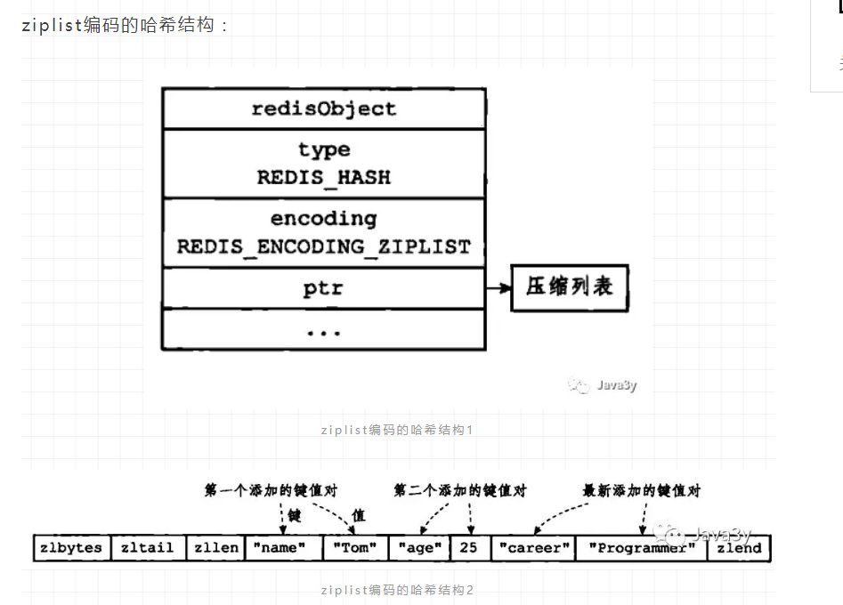

hashtable编码的哈希结构：
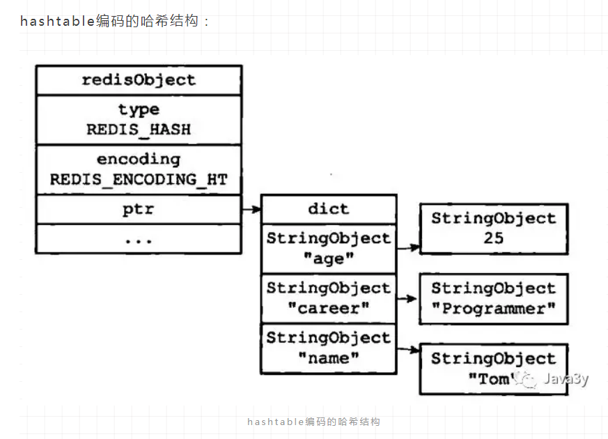

编码之间的转换：
原本是ziplist编码的，如果保存的数据长度太大或者元素数量过多，会转换成hashtable编码的。

## 4集合(set)对象
在上面的图我们知道set类型有两种编码格式：

intset：保存的元素全都是整数||总数量小于512

hashtable：保存的元素不是整数||总数量大于512

intset编码的集合结构：
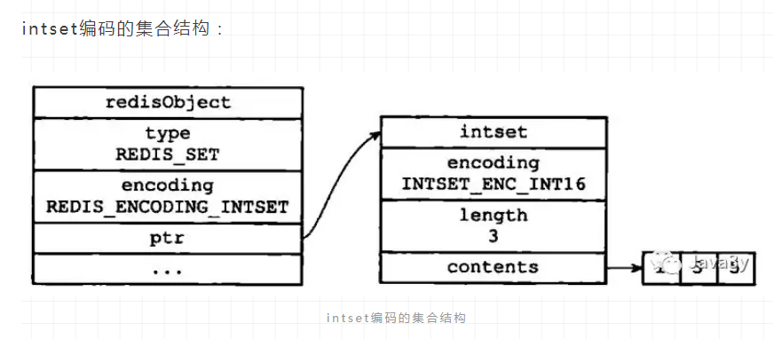

hashtable编码的集合结构：
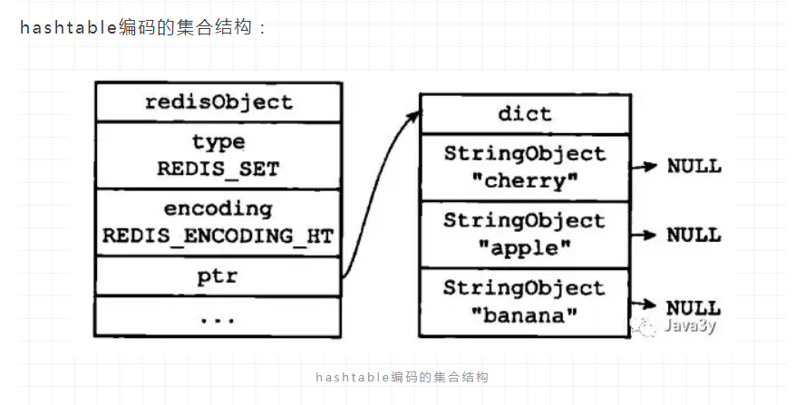

编码之间的转换：

原本是intset编码的，如果保存的数据不是整数值或者元素数量大于512，会转换成hashtable编码的。

## 5有序集合(sortset)对象
在上面的图我们知道set类型有两种编码格式：

ziplist：元素长度小于64||总数量小于128

skiplist：元素长度大于64||总数量大于128

ziplist编码的有序集合结构：
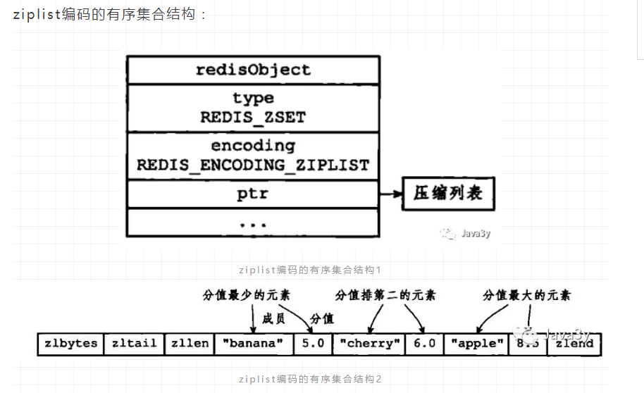

skiplist编码的有序集合结构：
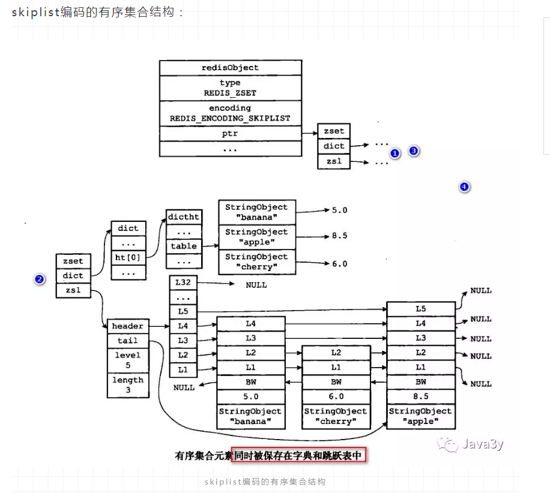

有序集合(sortset)对象同时采用skiplist和哈希表来实现：

skiplist能够达到插入的时间复杂度为O(logn)，根据成员查分值的时间复杂度为O(1)

编码之间的转换：
原本是ziplist编码的，如果保存的数据长度大于64或者元素数量大于128，会转换成skiplist编码的。

## 6 Redis对象一些细节
(1：服务器在执行某些命令的时候，会先检查给定的键的类型能否执行指定的命令。

比如我们的数据结构是sortset，但你使用了list的命令。这是不对的，服务器会检查一下我们的数据结构是什么才会进一步执行命令

(2：Redis的对象系统带有引用计数实现的内存回收机制。对象不再被使用的时候，对象所占用的内存会释放掉

(3：Redis会共享值为0到9999的字符串对象

(4：对象会记录自己的最后一次被访问时间，这个时间可以用于计算对象的空转时间。


string-->简单的key-value

list-->有序列表(底层是双向链表)-->可做简单队列

set-->无序列表(去重)-->提供一系列的交集、并集、差集的命令

hash-->哈希表-->存储结构化数据

sortset-->有序集合映射(member-score)-->排行榜


# Redis的底层数据结构
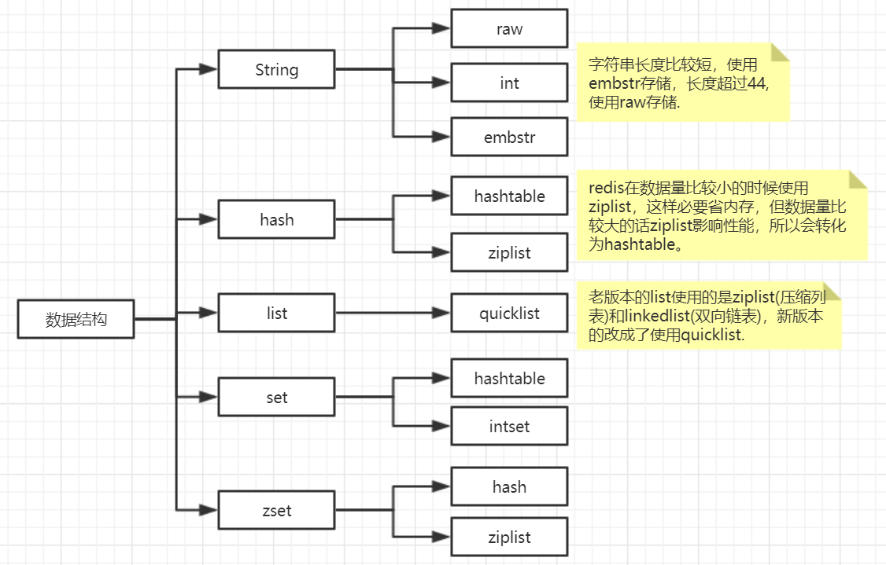
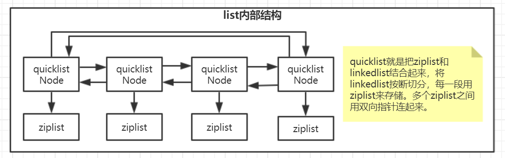
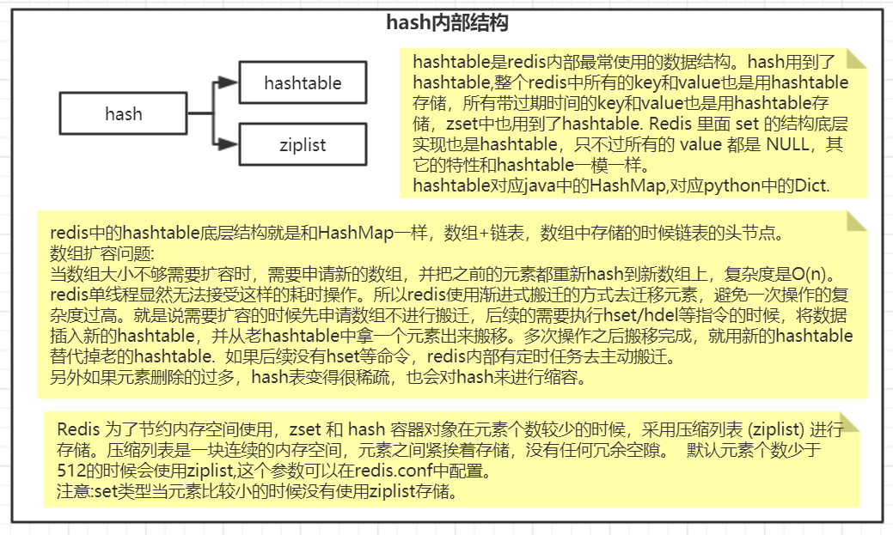
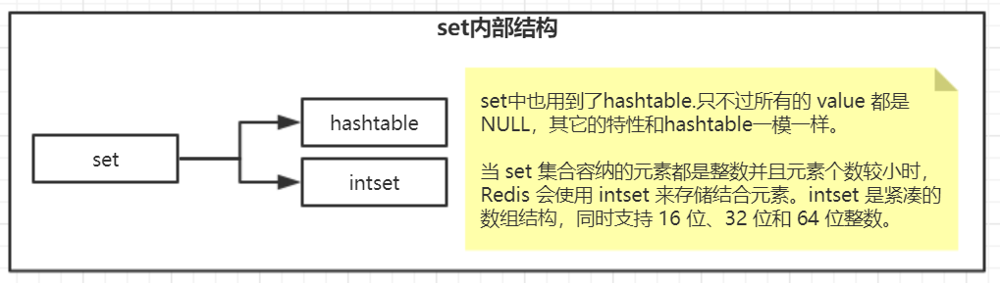
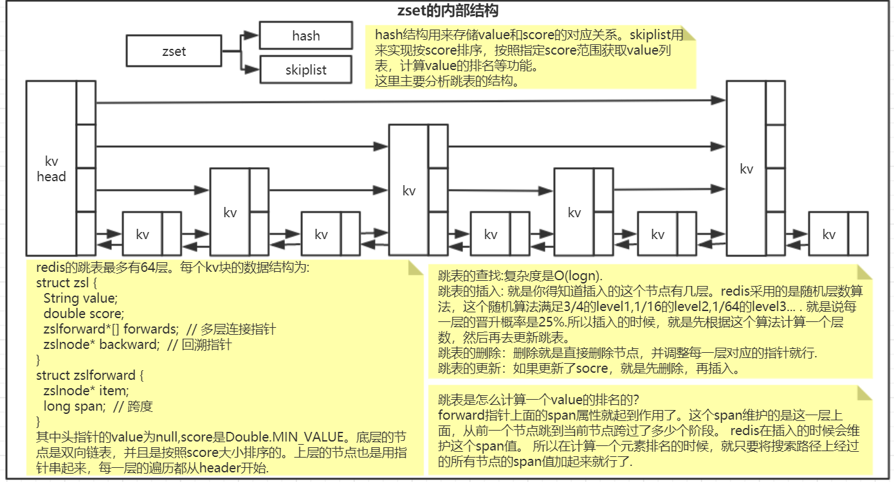


Redis 底层数据结构有一下数据类型：
1、简单动态字符串
2、链表
3、字典
4、跳跃表
5、整数集合
6、压缩列表
7、对象

总结：
1、动态字符串SDS：区别于C语言字符串，具有良好的伸缩性，在获取字符串长度，字符串修改，防止缓存区溢出等性能都比C语言字符串好
2、链表：顺序存储对象信息，有用于缓存链表长度的属性，在插入删除对象功能中有良好性能，避免环的产生
3、字典：key-value 存储方式，通过hash值计算，判断key的存储，当容量过大，会通过rehash重新分配字典大小


# 1、简单动态字符串（simple dynamic string）SDS

## 1.1、概念
Redis 是一个开源的使用ANSI C语言编写的key-value 数据库，我们可能会较为主观的认为 Redis 中的字符串就是采用了C语言中的传统字符串表示，
但其实不然，Redis 没有直接使用C语言传统的字符串表示，而是自己构建了一种名为简单动态字符串（simple dynamic string SDS）的抽象类型，
并将SDS用作Redis 的默认字符串表示：

redis>SET msg "hello world"
OK

设置一个key= msg，value = hello world 的新键值对，他们底层是数据结构将会是：

- 键（key）是一个字符串对象，对象的底层实现是一个保存着字符串“msg” 的SDS；

- 值（value）也是一个字符串对象，对象的底层实现是一个保存着字符串“hello world” 的SDS

从上述例子，我们可以很直观的看到我们在平常使用redis 的时候，创建的字符串到底是一个什么样子的数据类型。
除了用来保存字符串以外，SDS还被用作缓冲区（buffer）AOF模块中的AOF缓冲区。

## 1.2、SDS 的定义
Redis 中定义动态字符串的结构
```sql
/*  
 * 保存字符串对象的结构  
 */  
struct sdshdr {  
      
    // buf 中已占用空间的长度  
    int len;  
  
    // buf 中剩余可用空间的长度  
    int free;  
  
    // 数据空间  
    char buf[];  
};
```


1、len 变量，用于记录buf 中已经使用的空间长度（这里指出Redis 的长度为5）

2、free 变量，用于记录buf 中还空余的空间（初次分配空间，一般没有空余，在对字符串修改的时候，会有剩余空间出现）

3、buf 字符数组，用于记录我们的字符串（记录Redis）

## 1.3、SDS 与 C 字符串的区别
传统的C 字符串 使用长度为N+1 的字符串数组来表示长度为N 的字符串，这样做在获取字符串长度，
字符串扩展等操作的时候效率低下。C 语言使用这种简单的字符串表示方式，并不能满足Redis 对字符串在安全性、
效率以及功能方面的要求

### 1.3.1、获取字符串长度（SDS O（1）/C 字符串 O(n)）

传统的C 字符串 使用长度为N+1 的字符串数组来表示长度为N 的字符串，所以为了获取一个长度为C字符串的长度，必须遍历整个字符串。
和C 字符串不同，SDS 的数据结构中，有专门用于保存字符串长度的变量，我们可以通过获取len 属性的值，直接知道字符串长度。

　　　　
### 1.3.2、杜绝缓冲区溢出

C 字符串 不记录字符串长度，除了获取的时候复杂度高以外，还容易导致缓冲区溢出。

假设程序中有两个在内存中紧邻着的 字符串 s1 和 s2，其中s1 保存了字符串“redis”，二s2 则保存了字符串“MongoDb”：
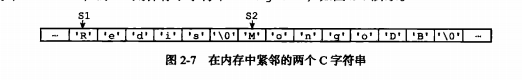
　　　　　　
如果我们现在将s1 的内容修改为redis cluster，但是又忘了重新为s1 分配足够的空间，这时候就会出现以下问题：

　　　　　　
我们可以看到，原本s2 中的内容已经被S1的内容给占领了，s2 现在为 cluster，而不是“Mongodb”。

Redis 中SDS 的空间分配策略完全杜绝了发生缓冲区溢出的可能性：

当我们需要对一个SDS 进行修改的时候，redis 会在执行拼接操作之前，预先检查给定SDS 空间是否足够，
如果不够，会先拓展SDS 的空间，然后再执行拼接操作


### 1.3.3 减少修改字符串时带来的内存重分配次数　　　

C语言字符串在进行字符串的扩充和收缩的时候，都会面临着内存空间的重新分配问题。

1. 字符串拼接会产生字符串的内存空间的扩充，在拼接的过程中，原来的字符串的大小很可能小于拼接后的字符串的大小，
那么这样的话，就会导致一旦忘记申请分配空间，就会导致内存的溢出。

2. 字符串在进行收缩的时候，内存空间会相应的收缩，而如果在进行字符串的切割的时候，没有对内存的空间进行一个重新分配，
那么这部分多出来的空间就成为了内存泄露。

举个例子：我们需要对下面的SDS进行拓展，则需要进行空间的拓展，这时候redis 会将SDS的长度修改为13字节，并且将未使用空间同样修改为1字节 

因为在上一次修改字符串的时候已经拓展了空间，再次进行修改字符串的时候会发现空间足够使用，因此无须进行空间拓展

通过这种预分配策略，SDS将连续增长N次字符串所需的内存重分配次数从必定N次降低为最多N次

 

### 1.3.4 惰性空间释放

我们在观察SDS 的结构的时候可以看到里面的free 属性，是用于记录空余空间的。我们除了在拓展字符串的时候会使用到free 来进行记录空余空间以外，
在对字符串进行收缩的时候，我们也可以使用free 属性来进行记录剩余空间，这样做的好处就是避免下次对字符串进行再次修改的时候，需要对字符串的空间进行拓展。

然而，我们并不是说不能释放SDS 中空余的空间，SDS 提供了相应的API，让我们可以在有需要的时候，自行释放SDS 的空余空间。

通过惰性空间释放，SDS 避免了缩短字符串时所需的内存重分配操作，并未将来可能有的增长操作提供了优化

 
### 1.3.5 二进制安全

C 字符串中的字符必须符合某种编码，并且除了字符串的末尾之外，字符串里面不能包含空字符，否则最先被程序读入的空字符将被误认为是字符串结尾，
这些限制使得C字符串只能保存文本数据，而不能保存想图片，音频，视频，压缩文件这样的二进制数据。

但是在Redis中，不是靠空字符来判断字符串的结束的，而是通过len这个属性。那么，即便是中间出现了空字符对于SDS来说，读取该字符仍然是可以的。
例如：
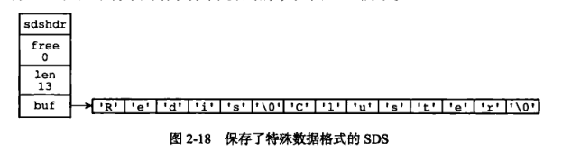
 　　

### 1.3.6 兼容部分C字符串函数

虽然SDS 的API 都是二进制安全的，但他们一样遵循C字符串以空字符串结尾的惯例。

 
## 1.4总结

 C 字符串 |	SDS
| ------ | ------ | 
获取字符串长度的复杂度为O（N) | 获取字符串长度的复杂度为O(1)|
API 是不安全的，可能会造成缓冲区溢出	| API 是安全的，不会造成缓冲区溢出 |
修改字符串长度N次必然需要执行N次内存重分配	| 修改字符串长度N次最多执行N次内存重分配|
只能保存文本数据	| 可以保存二进制数据和文本文数据|
可以使用所有<String.h>库中的函数	| 可以使用一部分<string.h>库中的函数|
 

　

# 2、链表
 
## 2、1 概述
链表提供了高效的节点重排能力，以及顺序性的节点访问方式，并且可以通过增删节点来灵活地调整链表的长度。

链表在Redis 中的应用非常广泛，比如列表键的底层实现之一就是链表。当一个列表键包含了数量较多的元素，
又或者列表中包含的元素都是比较长的字符串时，Redis 就会使用链表作为列表键的底层实现。


## 2、2 链表的数据结构
每个链表节点使用一个 listNode结构表示（adlist.h/listNode）：

```sql
typedef struct listNode{
      struct listNode *prev;
      struct listNode * next;
      void * value;  
}
```
 
多个链表节点组成的双端链表：

　　
我们可以通过直接操作list 来操作链表会更加方便：

```sql
typedef struct list{
    //表头节点
    listNode  * head;
    //表尾节点
    listNode  * tail;
    //链表长度
    unsigned long len;
    //节点值复制函数
    void *(*dup) (void *ptr);
    //节点值释放函数
    void (*free) (void *ptr);
    //节点值对比函数
    int (*match)(void *ptr, void *key);
}
```
list 组成的结构图：


## 2、3 链表的特性
双端：链表节点带有prev 和next 指针，获取某个节点的前置节点和后置节点的时间复杂度都是O（N）
无环：表头节点的 prev 指针和表尾节点的next 都指向NULL，对立案表的访问时以NULL为截止
表头和表尾：因为链表带有head指针和tail 指针，程序获取链表头结点和尾节点的时间复杂度为O(1)
长度计数器：链表中存有记录链表长度的属性 len
多态：链表节点使用 void* 指针来保存节点值，并且可以通过list 结构的dup 、 free、 match三个属性为节点值设置类型特定函数。
 

# 3、字典

## 3、1 概述
字典，又称为符号表（symbol table）、关联数组（associative array）或映射（map），是一种用于保存键值对的抽象数据结构。　

在字典中，一个键（key）可以和一个值（value）进行关联，字典中的每个键都是独一无二的。在C语言中，并没有这种数据结构，但是Redis 中构建了自己的字典实现。

举个简单的例子：

redis > SET msg "hello world"
OK
创建这样的键值对（“msg”，“hello world”）在数据库中就是以字典的形式存储


## 3、2 字典的定义

### 3.2.1 哈希表
Redis 字典所使用的哈希表由 dict.h/dictht 结构定义：
```sql
typedef struct dictht {
   //哈希表数组
   dictEntry **table;
   //哈希表大小
   unsigned long size;

   //哈希表大小掩码，用于计算索引值
   unsigned long sizemask;
   //该哈希表已有节点的数量
   unsigned long used;
}
```
一个空的字典的结构图如下：


我们可以看到，在结构中存有指向dictEntry 数组的指针，而我们用来存储数据的空间既是dictEntry

### 3.2.2 哈希表节点（ dictEntry ）

dictEntry 结构定义：
```sql
typeof struct dictEntry{
   //键
   void *key;
   //值
   union{
      void *val;
      uint64_tu64;
      int64_ts64;
   }
   struct dictEntry *next;

}
```
在数据结构中，我们清楚key 是唯一的，但是我们存入里面的key 并不是直接的字符串，而是一个hash 值，
通过hash 算法，将字符串转换成对应的hash 值，然后在dictEntry 中找到对应的位置。

这时候我们会发现一个问题，如果出现hash 值相同的情况怎么办？Redis 采用了链地址法：

　　　
当k1 和k0 的hash 值相同时，将k1中的next 指向k0 想成一个链表。[头插法]

 

### 3.2.3 字典

```sql
typedef struct dict {
    // 类型特定函数
    dictType *type;
    // 私有数据
    void *privedata;
    // 哈希表
    dictht  ht[2];
    // rehash 索引
    in trehashidx;

}
```

type 属性 和privdata 属性是针对不同类型的键值对，为创建多态字典而设置的。

ht 属性是一个包含两个项（两个哈希表）的数组

普通状态下的字典：
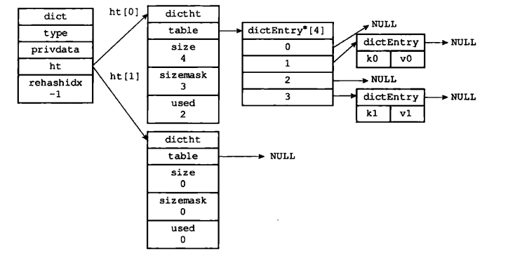


## 3.3 解决哈希冲突
在上述分析哈希节点的时候我们有讲到：在插入一条新的数据时，会进行哈希值的计算，如果出现了hash值相同的情况，
Redis 中采用了连地址法（separate chaining）来解决键冲突。每个哈希表节点都有一个next 指针，
多个哈希表节点可以使用next 构成一个单向链表，被分配到同一个索引上的多个节点可以使用这个单向链表连接起来解决hash值冲突的问题。

举个例子：
现在哈希表中有以下的数据：k0 和k1


我们现在要插入k2，通过hash 算法计算到k2 的hash 值为2，即我们需要将k2 插入到dictEntry[2]中：

　　　 

在插入后我们可以看到，dictEntry指向了k2，k2的next 指向了k1，从而完成了一次插入操作
（这里选择表头插入是因为哈希表节点中没有记录链表尾节点位置）


## 3.4 Rehash
随着对哈希表的不断操作，哈希表保存的键值对会逐渐的发生改变，为了让哈希表的负载因子维持在一个合理的范围之内，
我们需要对哈希表的大小进行相应的扩展或者压缩，这时候，我们可以通过 rehash（重新散列）操作来完成。

### 3.4.1 目前的哈希表状态：

　　　　我们可以看到，哈希表中的每个节点都已经使用到了，这时候我们需要对哈希表进行拓展。
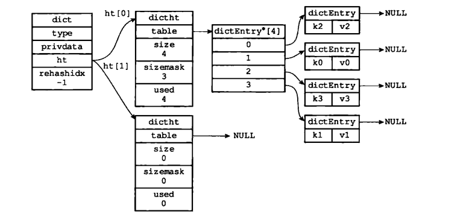

### 3.4.2 为哈希表分配空间

哈希表空间分配规则：
- 如果执行的是拓展操作，那么ht[1] 的大小为第一个大于等于ht[0] 的2的n次幂

- 如果执行的是收缩操作，那么ht[1] 的大小为第一个大于等于ht[0] 的2的n次幂

因此这里我们为ht[1] 分配 空间为8，
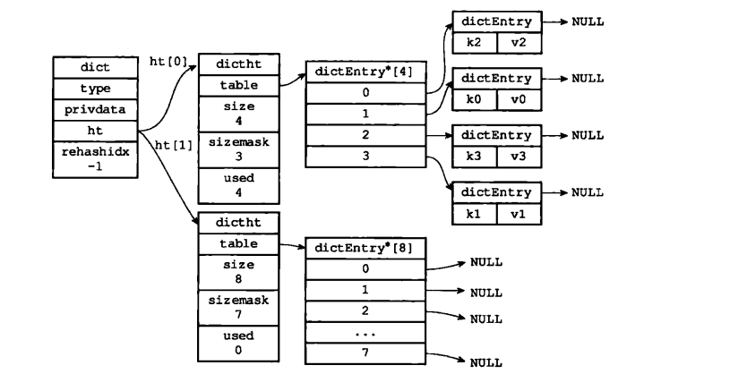
　　
### 3.4.3 数据转移

将ht[0]中的数据转移到ht[1]中，在转移的过程中，需要对哈希表节点的数据重新进行哈希值计算
数据转移后的结果：


### 3.4.4 释放ht[0]

将ht[0]释放，然后将ht[1]设置成ht[0]，最后为ht[1]分配一个空白哈希表：
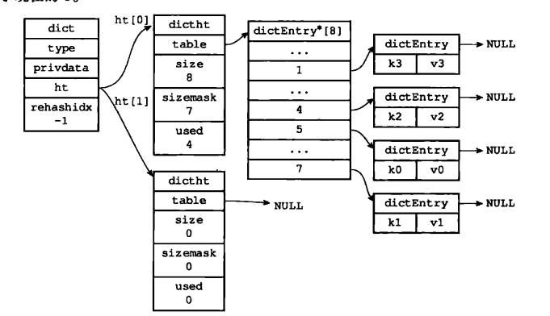
　　
### 3.4.5 渐进式 rehash

上面我们说到，在进行拓展或者压缩的时候，可以直接将所有的键值对rehash 到ht[1]中，这是因为数据量比较小。
在实际开发过程中，这个rehash 操作并不是一次性、集中式完成的，而是分多次、渐进式地完成的。

渐进式rehash 的详细步骤：

- 1、为ht[1] 分配空间，让字典同时持有ht[0]和ht[1]两个哈希表

- 2、在几点钟维持一个索引计数器变量rehashidx，并将它的值设置为0，表示rehash 开始

- 3、在rehash 进行期间，每次对字典执行CRUD操作时，程序除了执行指定的操作以外，还会将ht[0]中的数据rehash 到ht[1]表中，并且将rehashidx加一

- 4、当ht[0]中所有数据转移到ht[1]中时，将rehashidx 设置成-1，表示rehash 结束

采用渐进式rehash 的好处在于它采取分而治之的方式，避免了集中式rehash 带来的庞大计算量。


# 4、跳跃表

## 4.1 概述
跳跃表（skiplist）是一种有序数据结构，它通过在每个节点中维持多个指向其他节点的指针，从而达到快速访问节点的目的。
跳跃表是一种随机化的数据,跳跃表以有序的方式在层次化的链表中保存元素，效率和平衡树媲美 ——查找、删除、添加等操作都可以在对数期望时间下完成，
并且比起平衡树来说，跳跃表的实现要简单直观得多。

Redis 只在两个地方用到了跳跃表，一个是实现有序集合键，另外一个是在集群节点中用作内部数据结构。

## 4.2 跳跃表的定义
我们先来看一下一整个跳跃表的完整结构：


Redis 的跳跃表 主要由两部分组成：zskiplist（链表）和zskiplistNode （节点）

　　　　
### 4.2.1 zskiplistNode（节点） 数据结构：

```
typedef struct zskiplistNode{
　　　//层
     struct zskiplistLevel{
　　　　　//前进指针
        struct zskiplistNode *forward;
　　　　//跨度
        unsigned int span;
    } level[];
　　//后退指针
    struct zskiplistNode *backward;
　　//分值
    double score;
　　//成员对象
    robj *obj;
}
```
- 1、层：level 数组可以包含多个元素，每个元素都包含一个指向其他节点的指针。

- 2、前进指针：用于指向表尾方向的前进指针

- 3、跨度：用于记录两个节点之间的距离

- 4、后退指针：用于从表尾向表头方向访问节点

- 5、分值和成员：跳跃表中的所有节点都按分值从小到大排序。成员对象指向一个字符串，这个字符串对象保存着一个SDS值

 

## 4.2. zskiplist 数据结构：

```sql
typedef struct zskiplist {
     //表头节点和表尾节点
     structz skiplistNode *header,*tail;
     //表中节点数量
     unsigned long length;
     //表中层数最大的节点的层数
     int level;

}zskiplist;
```

　　　　

从结构图中我们可以清晰的看到，header，tail分别指向跳跃表的头结点和尾节点。
level 用于记录最大的层数，length 用于记录我们的节点数量。

## 4.3 总结
- 1、跳跃表是有序集合的底层实现之一
- 2、主要有zskiplist 和zskiplistNode两个结构组成
- 3、每个跳跃表节点的层高都是1至32之间的随机数
- 4、在同一个跳跃表中，多个节点可以包含相同的分值，但每个节点的对象必须是唯一的
- 5、节点按照分值的大小从大到小排序，如果分值相同，则按成员对象大小排序
 

 

 

# 5、整数集合（Intset）
 
## 5.1 概述

《Redis 设计与实现》 中这样定义整数集合：“整数集合是集合建的底层实现之一，当一个集合中只包含整数，
且这个集合中的元素数量不多时，redis就会使用整数集合intset作为集合的底层实现。”

我们可以这样理解整数集合，他其实就是一个特殊的集合，里面存储的数据只能够是整数，并且数据量不能过大。

 
## 5.2 整数集合的实现
　　　　
```sql
typedef struct intset{
    //编码方式
    uint32_t enconding;
   // 集合包含的元素数量
    uint32_t length;
    //保存元素的数组    
    int8_t contents[];

}
```  

我们观察一下一个完成的整数集合结构图：
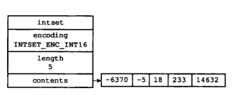
　　
- 1、encoding：用于定义整数集合的编码方式

- 2、length：用于记录整数集合中变量的数量

- 3、contents：用于保存元素的数组，虽然我们在数据结构图中看到，intset将数组定义为int8_t，但实际上数组保存的元素类型取决于encoding

## 5.3 整数集合的升级
　　　　
在上述数据结构图中我们可以看到，intset 在默认情况下会帮我们设定整数集合中的编码方式，但是当我们存入的整数不符合整数集合中的编码格式时，就需要使用到Redis 中的升级策略来解决

Intset 中升级整数集合并添加新元素共分为三步进行：

- 1、根据新元素的类型，扩展整数集合底层数组的空间大小，并为新元素分配空间

- 2、将底层数组现有的所有元素都转换成新的编码格式，重新分配空间

- 3、将新元素加入到底层数组中

比如，我们现在有如下的整数集合：
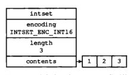

我们现在需要插入一个32位的整数，这显然与整数集合不符合，我们将进行编码格式的转换，并为新元素分配空间：


第二步，将原有数据他们的数据类型转换为与新数据相同的类型：（重新分配空间后的数据）

　　　　
第三部，将新数据添加到数组中：
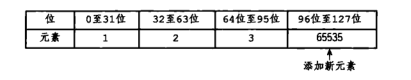
　　

### 5.3.1 整数集合升级的好处
1、提升灵活性

2、节约内存

 

## 6.4 总结
- 1、整数集合是集合建的底层实现之一

- 2、整数集合的底层实现为数组，这个数组以有序，无重复的范式保存集合元素，在有需要时，程序会根据新添加的元素类型改变这个数组的类型

- 3、升级操作为整数集合带来了操作上的灵活性，并且尽可能地节约了内存

- 4、整数集合只支持升级操作，不支持降级操作

# 6、压缩列表
 

## 6.1 概述

压缩列表是列表键和哈希键的底层实现之一。当一个列表键只把汗少量列表项，并且每个列表项要么就是小整数，
要么就是长度比较短的字符串，那么Redis 就会使用压缩列表来做列表键的底层实现。

 压缩列表(ziplist)是list和hash的底层实现之一。如果list的每个都是小整数值，或者是比较短的字符串，压缩列表(ziplist)作为list的底层实现。
 
 压缩列表(ziplist)是Redis为了节约内存而开发的，是由一系列的特殊编码的连续内存块组成的顺序性数据结构。
 
 压缩列表结构图例如下：

　　

## 6.2 压缩列表的构成
　　　　一个压缩列表的组成如下：
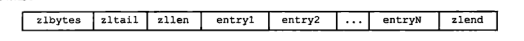
　　

- 1、zlbytes:用于记录整个压缩列表占用的内存字节数

- 2、zltail：记录要列表尾节点距离压缩列表的起始地址有多少字节

- 3、zllen：记录了压缩列表包含的节点数量。

- 4、entryX：要说列表包含的各个节点

- 5、zlend：用于标记压缩列表的末端

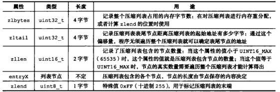
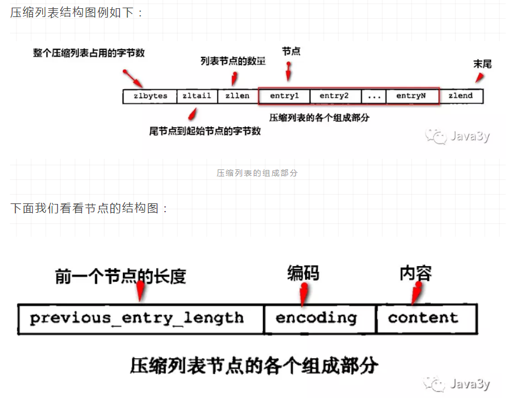

## 6.3 总结

- 1、压缩列表是一种为了节约内存而开发的顺序型数据结构

- 2、压缩列表被用作列表键和哈希键的底层实现之一

- 3、压缩列表可以包含多个节点，每个节点可以保存一个字节数组或者整数值

- 4、添加新节点到压缩列表，可能会引发连锁更新操作。