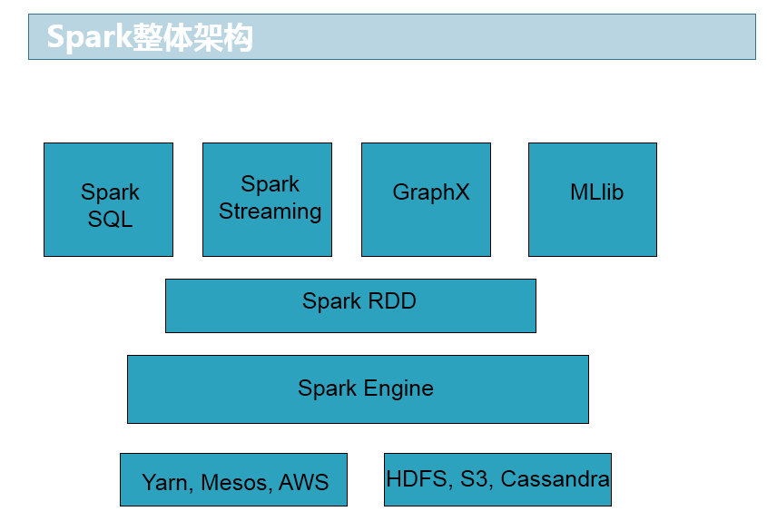
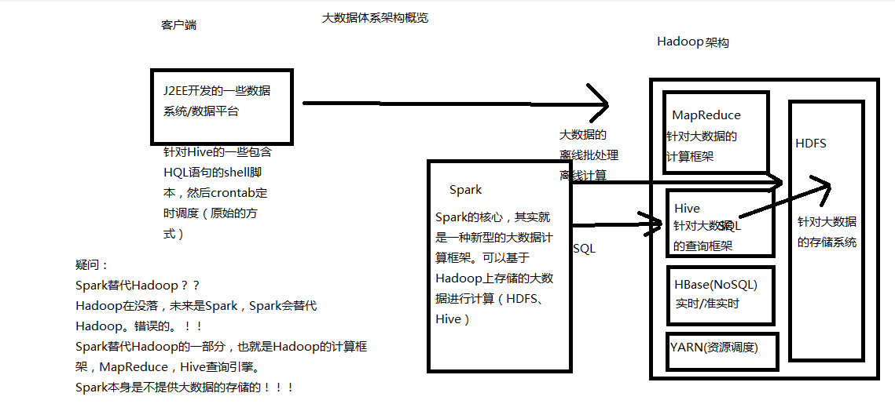
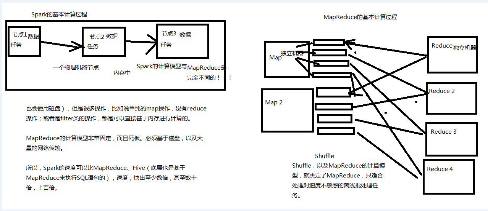
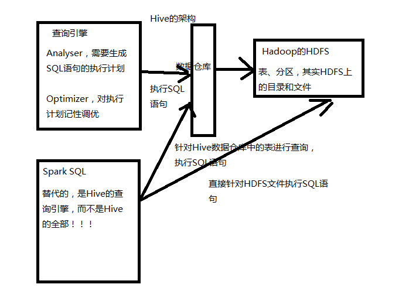
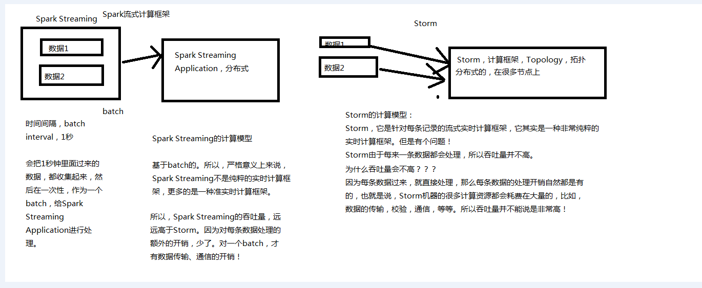

<!-- TOC -->

- [1、Spark是什么？](#1spark是什么)
- [2、Spark的历史沿革](#2spark的历史沿革)
- [3、Spark的特点](#3spark的特点)
- [4、Spark VS MapReduce](#4spark-vs-mapreduce)
- [5、Spark SQL VS Hive](#5spark-sql-vs-hive)
- [6、Spark Streaming VS Storm](#6spark-streaming-vs-storm)
- [7、Spark的个人使用体会](#7spark的个人使用体会)
- [8、Spark目前在国内的现状以及未来的展望](#8spark目前在国内的现状以及未来的展望)

<!-- /TOC -->

> 问题

1、MapReduce的shuffle过程？？？为什么一定有shuffle过程以及一定走磁盘？只有map过程也是的吗？

# 1、Spark是什么？

Spark，是一种通用的大数据计算框架，正如传统大数据技术Hadoop的MapReduce、Hive引擎，以及Storm流式实时计算引擎等。

Spark包含了大数据领域常见的各种计算框架：比如Spark Core用于离线计算，Spark SQL用于交互式查询，Spark Streaming用于实时流式计算，Spark MLlib用于机器学习，Spark GraphX用于图计算。
      
Spark主要用于大数据的计算，而Hadoop以后主要用于大数据的存储（比如HDFS、Hive、HBase等），以及资源调度（Yarn）。

Spark+Hadoop的组合，是未来大数据领域最热门的组合，也是最有前景的组合！

Spark，是一种"One Stack to rule them all"的大数据计算框架，期望使用一个技术堆栈就完美地解决大数据领域的各种计算任务。Apache官方，对Spark的定义就是：通用的大数据快速处理引擎。

Spark使用Spark RDD、Spark SQL、Spark Streaming、MLlib、GraphX成功解决了大数据领域中，离线批处理、交互式查询、实时流计算、机器学习与图计算等最重要的任务和问题。

Spark除了一站式的特点之外，另外一个最重要的特点，就是基于内存进行计算，从而让它的速度可以达到MapReduce、Hive的数倍甚至数十倍！

现在已经有很多大公司正在生产环境下深度地使用Spark作为大数据的计算框架，包括eBay、Yahoo!、BAT、网易、京东、华为、大众点评、优酷土豆、搜狗等等。
Spark同时也获得了多个世界顶级IT厂商的支持，包括IBM、Intel等。

# 2、Spark的历史沿革

- 2009年，Spark诞生于伯克利大学的AMPLab实验室。最出Spark只是一个实验性的项目，代码量非常少，属于轻量级的框架。
- 2010年，伯克利大学正式开源了Spark项目。
- 2013年，Spark成为了Apache基金会下的项目，进入高速发展期。第三方开发者贡献了大量的代码，活跃度非常高。
- 2014年，Spark以飞快的速度称为了Apache的顶级项目。
- 2015年~，Spark在国内IT行业变得愈发火爆，大量的公司开始重点部署或者使用Spark来替代MapReduce、Hive、Storm等传统的大数据计算框架。

# 3、Spark的特点

spark和Hadoop生态的关系，spark的定位就是一个计算框架

- 速度快：Spark基于内存进行计算（当然也有部分计算基于磁盘，比如shuffle）。

- 容易上手开发：Spark的基于RDD的计算模型，比Hadoop的基于Map-Reduce的计算模型要更加易于理解，更加易于上手开发，实现各种复杂功能，比如二次排序、topn等复杂操作时，更加便捷。

- 超强的通用性：Spark提供了Spark RDD、Spark SQL、Spark Streaming、Spark MLlib、Spark GraphX等技术组件，可以一站式地完成大数据领域的离线批处理、交互式查询、流式计算、机器学习、图计算等常见的任务。

- 集成Hadoop：Spark并不是要成为一个大数据领域的“独裁者”，一个人霸占大数据领域所有的“地盘”，而是与Hadoop进行了高度的集成，两者可以完美的配合使用。Hadoop的HDFS、Hive、HBase负责存储，YARN负责资源调度；Spark复杂大数据计算。实际上，Hadoop+Spark的组合，是一种“double win”的组合。

- 极高的活跃度：Spark目前是Apache基金会的顶级项目，全世界有大量的优秀工程师是Spark的committer。并且世界上很多顶级的IT公司都在大规模地使用Spark。

# 4、Spark VS MapReduce

map执行结果会存到本地磁盘，然后reduce节点通过网络拉去，这样两步都耗时，使得延时比较高，适合离线计算而不是实时和交换计算

MapReduce能够完成的各种离线批处理功能，以及常见算法（比如二次排序、topn等），基于Spark RDD的核心编程，都可以实现，并且可以更好地、更容易地实现。而且基于Spark RDD编写的离线批处理程序，运行速度是MapReduce的数倍，速度上有非常明显的优势。

Spark相较于MapReduce速度快的最主要原因就在于，MapReduce的计算模型太死板，必须是map-reduce模式，有时候即使完成一些诸如过滤之类的操作，也必须经过map-reduce过程，这样就必须经过shuffle过程。而MapReduce的shuffle过程是最消耗性能的，因为shuffle中间的过程必须基于磁盘来读写。而Spark的shuffle虽然也要基于磁盘，但是其大量transformation操作，比如单纯的map或者filter等操作，可以直接基于内存进行pipeline操作，速度性能自然大大提升。

但是Spark也有其劣势。由于Spark基于内存进行计算，虽然开发容易，但是真正面对大数据的时候（比如一次操作针对10亿以上级别），在没有进行调优的情况下，可能会出现各种各样的问题，比如OOM内存溢出等等。导致Spark程序可能都无法完全运行起来，就报错挂掉了，而MapReduce即使是运行缓慢，但是至少可以慢慢运行完。

此外，Spark由于是新崛起的技术新秀，因此在大数据领域的完善程度，肯定不如MapReduce，比如基于HBase、Hive作为离线批处理程序的输入输出，Spark就远没有MapReduce来的完善。实现起来非常麻烦。

# 5、Spark SQL VS Hive

Spark SQL实际上并不能完全替代Hive，因为Hive是一种基于HDFS的数据仓库，并且提供了基于SQL模型的，针对存储了大数据的数据仓库，进行分布式交互查询的查询引擎。

严格的来说，Spark SQL能够替代的，是Hive的查询引擎，而不是Hive本身，实际上即使在生产环境下，Spark SQL也是针对Hive数据仓库中的数据进行查询，Spark本身自己是不提供存储的，自然也不可能替代Hive作为数据仓库的这个功能。

Spark SQL的一个优点，相较于Hive查询引擎来说，就是速度快，同样的SQL语句，可能使用Hive的查询引擎，由于其底层基于MapReduce，必须经过shuffle过程走磁盘，因此速度是非常缓慢的。很多复杂的SQL语句，在hive中执行都需要一个小时以上的时间。而Spark SQL由于其底层基于Spark自身的基于内存的特点，因此速度达到了Hive查询引擎的数倍以上。
        
但是Spark SQL由于与Spark一样，是大数据领域的新起的新秀，因此还不够完善，有少量的Hive支持的高级特性，Spark SQL还不支持，导致Spark SQL暂时还不能完全替代Hive的查询引擎。而只能在部分Spark SQL功能特性可以满足需求的场景下，进行使用。
       
而Spark SQL相较于Hive的另外一个优点，就是支持大量不同的数据源，包括hive、json、parquet、jdbc等等。此外，Spark SQL由于身处Spark技术堆栈内，也是基于RDD来工作，因此可以与Spark的其他组件无缝整合使用，配合起来实现许多复杂的功能。比如Spark SQL支持可以直接针对hdfs文件执行sql语句！

# 6、Spark Streaming VS Storm

Spark Streaming与Storm都可以用于进行实时流计算。但是他们两者的区别是非常大的。其中区别之一，就是，Spark Streaming和Storm的计算模型完全不一样，Spark Streaming是基于RDD的，因此需要将一小段时间内的，比如1秒内的数据，收集起来，作为一个RDD，然后再针对这个batch的数据进行处理。而Storm却可以做到每来一条数据，都可以立即进行处理和计算。因此，Spark Streaming实际上严格意义上来说，只能称作准实时的流计算框架；而Storm是真正意义上的实时计算框架。

此外，Storm支持的一项高级特性，是Spark Streaming暂时不具备的，即Storm支持在分布式流式计算程序（Topology）在运行过程中，可以动态地调整并行度，从而动态提高并发处理能力。而Spark Streaming是无法动态调整并行度的。

但是Spark Streaming也有其优点，首先Spark Streaming由于是基于batch进行处理的，因此相较于Storm基于单条数据进行处理，具有数倍甚至数十倍的吞吐量。
此外，Spark Streaming由于也身处于Spark生态圈内，因此Spark Streaming可以与Spark Core、Spark SQL，甚至是Spark MLlib、Spark GraphX进行无缝整合。流式处理完的数据，可以立即进行各种map、reduce转换操作，可以立即使用sql进行查询，甚至可以立即使用machine learning或者图计算算法进行处理。这种一站式的大数据处理功能和优势，是Storm无法匹敌的。

因此，综合上述来看，通常在对实时性要求特别高，而且实时数据量不稳定，比如在白天有高峰期的情况下，可以选择使用Storm。但是如果是对实时性要求一般，允许1秒的准实时处理，而且不要求动态调整并行度的话，选择Spark Streaming是更好的选择。

# 7、Spark的个人使用体会

首先，Spark目前来说，相较于MapReduce来说，可以立即替代的，并且会产生非常理想的效果的场景，就是要求低延时的复杂大数据交互式计算系统。比如某些大数据系统，可以根据用户提交的各种条件，立即定制执行复杂的大数据计算系统，并且要求低延时（一小时以内）即可以出来结果，并通过前端页面展示效果。在这种场景下，对速度比较敏感的情况下，非常适合立即使用Spark替代MapReduce。因为Spark编写的离线批处理程序，如果进行了合适的性能调优之后，速度可能是MapReduce程序的十几倍。从而达到用户期望的效果。

其次，相对于Hive来说，对于某些需要根据用户选择的条件，动态拼接SQL语句，进行某类特定查询统计任务的系统，其实类似于上述的系统。此时也要求低延时，甚至希望达到几分钟之内。此时也可以使用Spark SQL替代Hive查询引擎。因此场景比较固定，SQL语句的语法比较固定，清楚肯定不会使用到Spark SQL所不支持的Hive语法特性。此时使用Hive查询引擎可以需要几十分钟执行一个复杂SQL。而使用Spark SQl，可能只需要使用几分钟。可以达到用户期望的效果

最后，对于Storm来说，如果仅仅要求对数据进行简单的流式计算处理，那么选择storm或者spark streaming都无可厚非。但是如果需要对流式计算的中间结果（RDD），进行复杂的后续处理，则使用Spark更好，因为Spark本身提供了很多原语，比如map、reduce、groupByKey、filter等等。

# 8、Spark目前在国内的现状以及未来的展望

Spark目前在国内正在飞速地发展，并且在很多领域，以及慢慢开始替代传统得一些基于Hadoop的组件。比如BAT、京东、搜狗等知名的互联网企业，都在深度的，大规模地使用Spark。

但是，大家如果去观察一下一些招聘网站对大数据的招聘需求，就会发现，目前来说，由于大部分还是大公司在使用Spark，因此大部分中小型企业，还是主要在使用Hadoop进行大数据处理。在招聘时，还是主要以hadoop工程师为主。Spark以及Storm的招聘还是相对Hadoop来说，会少一些。

但是，大家如果通过本堂课的讲解，能够较为全面地对Spark有一个感性得认识，就能意识到，Spark在大数据领域中，是未来的一个趋势和方向。随着Spark、Spark SQL以及Spark Streaming慢慢成熟，就会慢慢替代掉Hadoop的MapReduce、Hive查询等。大家可以想想，如果两者都能够实现相同的功能，而Spark甚至以后还可以做的更好，速度要快好几倍，甚至好几十倍。那么还有谁会愿意使用MapReduce或Hive查询引擎呢？

实际上，根据我在国内一线互联网公司这几年的工作和观察，以及通过与行业内各个规模公司的朋友交流，认为，未来的主流，一定是hadoop+Spark的这种组合，double win的格局。hadoop的特长，就是hdfs，分布式存储，基于此之上的是Hive作为大数据的数据仓库，HBase作为大数据的实时查询NoSQL数据库，YARN作为通用的资源调度框架；而Spark，则发挥它的特长，将各种各样的大数据计算模型汇聚在一个技术堆栈内，对hadoop上的大数据进行各种计算处理！

因此，大家也可以看到，Spark目前正在变得越来越火爆，招聘的企业正在越来越多，而且目前国内spark人才可以说是稀缺！！！在目前，以及未来，完全供不应求！因此这种趋势，以及这种现状，就决定了，对于我们个人来说，目前进行spark的学习以及研究，完全是未来一个获取快速升值的机会！！！

