<!-- TOC -->

- [第137讲-环境搭建-CentOS 6.4虚拟机安装](#第137讲-环境搭建-centos-64虚拟机安装)
- [第138讲-环境搭建-Hadoop 2.5伪分布式集群搭建](#第138讲-环境搭建-hadoop-25伪分布式集群搭建)
- [第139讲-环境搭建-Spark 1.5伪分布式集群搭建](#第139讲-环境搭建-spark-15伪分布式集群搭建)
- [第140讲-第一次课程升级大纲介绍以及要点说明](#第140讲-第一次课程升级大纲介绍以及要点说明)
- [第141讲-Spark核心编程进阶-Spark集群架构概览](#第141讲-spark核心编程进阶-spark集群架构概览)
- [第142讲-Spark核心编程进阶-Spark集群架构的几点特别说明](#第142讲-spark核心编程进阶-spark集群架构的几点特别说明)
- [第143讲-Spark核心编程进阶-Spark的核心术语讲解](#第143讲-spark核心编程进阶-spark的核心术语讲解)
- [第144讲-Spark核心编程进阶-Spark Standalone集群架构](#第144讲-spark核心编程进阶-spark-standalone集群架构)
- [第145讲-Spark核心编程进阶-单独启动master和worker脚本详解](#第145讲-spark核心编程进阶-单独启动master和worker脚本详解)
- [第146讲-Spark核心编程进阶-实验：单独启动master和worker进程以及启动日志查看](#第146讲-spark核心编程进阶-实验单独启动master和worker进程以及启动日志查看)
- [第147讲-Spark核心编程进阶-worker节点配置以及spark-evn.sh参数详解](#第147讲-spark核心编程进阶-worker节点配置以及spark-evnsh参数详解)
- [第148讲-Spark核心编程进阶-实验：local模式提交spark作业](#第148讲-spark核心编程进阶-实验local模式提交spark作业)
- [第149讲-Spark核心编程进阶-实验：standalone client模式提交spark作业](#第149讲-spark核心编程进阶-实验standalone-client模式提交spark作业)
- [第150讲-Spark核心编程进阶-实验：standalone cluster模式提交spark作业](#第150讲-spark核心编程进阶-实验standalone-cluster模式提交spark作业)
- [第151讲-Spark核心编程进阶-standalone模式下的多作业资源调度](#第151讲-spark核心编程进阶-standalone模式下的多作业资源调度)
- [第152讲-Spark核心编程进阶-standalone模式下的作业监控与日志记录](#第152讲-spark核心编程进阶-standalone模式下的作业监控与日志记录)
- [第153讲-Spark核心编程进阶-实验：运行中作业监控以及手工打印日志](#第153讲-spark核心编程进阶-实验运行中作业监控以及手工打印日志)
- [第154讲-Spark核心编程进阶-yarn-client模式原理讲解](#第154讲-spark核心编程进阶-yarn-client模式原理讲解)
- [第155讲-Spark核心编程进阶-yarn-cluster模式原理讲解](#第155讲-spark核心编程进阶-yarn-cluster模式原理讲解)
- [第156讲-Spark核心编程进阶-实验：yarn-client模式提交spark作业](#第156讲-spark核心编程进阶-实验yarn-client模式提交spark作业)
- [第157讲-Spark核心编程进阶-yarn模式下日志查看详解](#第157讲-spark核心编程进阶-yarn模式下日志查看详解)
- [第158讲-Spark核心编程进阶-yarn模式相关参数详解](#第158讲-spark核心编程进阶-yarn模式相关参数详解)
- [第159讲-Spark核心编程进阶-spark工程打包以及spark-submit详解](#第159讲-spark核心编程进阶-spark工程打包以及spark-submit详解)
- [第160讲-Spark核心编程进阶-spark-submit示例以及基础参数讲解](#第160讲-spark核心编程进阶-spark-submit示例以及基础参数讲解)
- [第161讲-Spark核心编程进阶-实验：spark-submit最简单版本提交spark作业](#第161讲-spark核心编程进阶-实验spark-submit最简单版本提交spark作业)
- [第162讲-Spark核心编程进阶-实验：spark-submit给main类传递参数](#第162讲-spark核心编程进阶-实验spark-submit给main类传递参数)
- [第163讲-Spark核心编程进阶-spark-submit多个示例以及常用参数详解](#第163讲-spark核心编程进阶-spark-submit多个示例以及常用参数详解)
- [第164讲-Spark核心编程进阶-SparkConf、spark-submit以及spark-defaults.conf](#第164讲-spark核心编程进阶-sparkconfspark-submit以及spark-defaultsconf)
- [第165讲-Spark核心编程进阶-spark-submit配置第三方依赖](#第165讲-spark核心编程进阶-spark-submit配置第三方依赖)
- [第166讲-Spark核心编程进阶-spark算子的闭包原理详解](#第166讲-spark核心编程进阶-spark算子的闭包原理详解)
- [第167讲-Spark核心编程进阶-实验：对闭包变量进行累加操作的无效现象](#第167讲-spark核心编程进阶-实验对闭包变量进行累加操作的无效现象)
- [第168讲-Spark核心编程进阶-实验：在算子内打印数据的无法看到现象](#第168讲-spark核心编程进阶-实验在算子内打印数据的无法看到现象)
- [第169讲-Spark核心编程进阶-mapPartitions以及学生成绩查询案例](#第169讲-spark核心编程进阶-mappartitions以及学生成绩查询案例)
- [第170讲-Spark核心编程进阶-mapPartitionsWithIndex以开学分班案例](#第170讲-spark核心编程进阶-mappartitionswithindex以开学分班案例)
- [第171讲-Spark核心编程进阶-sample以及公司年会抽奖案例](#第171讲-spark核心编程进阶-sample以及公司年会抽奖案例)
- [第172讲-Spark核心编程进阶-union以及公司部门合并案例](#第172讲-spark核心编程进阶-union以及公司部门合并案例)
- [第173讲-Spark核心编程进阶-intersection以及公司跨多项目人员查询案例](#第173讲-spark核心编程进阶-intersection以及公司跨多项目人员查询案例)
- [第174讲-Spark核心编程进阶-distinct以及网站uv统计案例](#第174讲-spark核心编程进阶-distinct以及网站uv统计案例)
- [第175讲-Spark核心编程进阶-aggregateByKey以及单词计数案例](#第175讲-spark核心编程进阶-aggregatebykey以及单词计数案例)
- [第176讲-Spark核心编程进阶-cartesian以及服装搭配案例](#第176讲-spark核心编程进阶-cartesian以及服装搭配案例)
- [第177讲-Spark核心编程进阶-coalesce以及公司部门整合案例](#第177讲-spark核心编程进阶-coalesce以及公司部门整合案例)
- [第178讲-Spark核心编程进阶-repartition以及公司新增部门案例](#第178讲-spark核心编程进阶-repartition以及公司新增部门案例)
- [第179讲-Spark核心编程进阶-takeSampled以及公司年会抽奖案例](#第179讲-spark核心编程进阶-takesampled以及公司年会抽奖案例)
- [第180讲-Spark核心编程进阶-shuffle操作原理详解](#第180讲-spark核心编程进阶-shuffle操作原理详解)
- [第181讲-Spark核心编程进阶-shuffle操作过程中进行数据排序](#第181讲-spark核心编程进阶-shuffle操作过程中进行数据排序)
- [第182讲-Spark核心编程进阶-会触发shuffle操作的算子](#第182讲-spark核心编程进阶-会触发shuffle操作的算子)
- [第183讲-Spark核心编程进阶-shuffle操作对性能消耗的原理详解](#第183讲-spark核心编程进阶-shuffle操作对性能消耗的原理详解)
- [第184讲-Spark核心编程进阶-shuffle操作所有相关参数详解以及性能调优](#第184讲-spark核心编程进阶-shuffle操作所有相关参数详解以及性能调优)
- [第185讲-Spark核心编程进阶-综合案例1：移动端app访问流量日志分析](#第185讲-spark核心编程进阶-综合案例1移动端app访问流量日志分析)
- [第186讲-Spark核心编程进阶-综合案例1：日志文件格式分析](#第186讲-spark核心编程进阶-综合案例1日志文件格式分析)
- [第187讲-Spark核心编程进阶-综合案例1：读取日志文件并创建RDD](#第187讲-spark核心编程进阶-综合案例1读取日志文件并创建rdd)
- [第188讲-Spark核心编程进阶-综合案例1：创建自定义的可序列化类](#第188讲-spark核心编程进阶-综合案例1创建自定义的可序列化类)
- [第189讲-Spark核心编程进阶-综合案例1：将RDD映射为key-value格式](#第189讲-spark核心编程进阶-综合案例1将rdd映射为key-value格式)
- [第190讲-Spark核心编程进阶-综合案例1：基于deviceID进行聚合操作](#第190讲-spark核心编程进阶-综合案例1基于deviceid进行聚合操作)
- [第191讲-Spark核心编程进阶-综合案例1：自定义二次排序key类](#第191讲-spark核心编程进阶-综合案例1自定义二次排序key类)
- [第192讲-Spark核心编程进阶-综合案例1：将二次排序key映射为RDD的key](#第192讲-spark核心编程进阶-综合案例1将二次排序key映射为rdd的key)
- [第193讲-Spark核心编程进阶-综合案例1：执行二次排序以及获取top10数据](#第193讲-spark核心编程进阶-综合案例1执行二次排序以及获取top10数据)
- [第194讲-Spark核心编程进阶-综合案例1：程序运行测试以及代码调试](#第194讲-spark核心编程进阶-综合案例1程序运行测试以及代码调试)
- [第195讲-Spark核心编程进阶-部署第二台CentOS机器](#第195讲-spark核心编程进阶-部署第二台centos机器)
- [第196讲-Spark核心编程进阶-部署第二个Hadoop节点](#第196讲-spark核心编程进阶-部署第二个hadoop节点)
- [第197讲-Spark核心编程进阶-将第二个Hadoop节点动态加入集群](#第197讲-spark核心编程进阶-将第二个hadoop节点动态加入集群)
- [第198讲-Spark核心编程进阶-使用yarn-client和yarn-cluster提交spark作业](#第198讲-spark核心编程进阶-使用yarn-client和yarn-cluster提交spark作业)

<!-- /TOC -->


# 第137讲-环境搭建-CentOS 6.4虚拟机安装


# 第138讲-环境搭建-Hadoop 2.5伪分布式集群搭建

# 第139讲-环境搭建-Spark 1.5伪分布式集群搭建

# 第140讲-第一次课程升级大纲介绍以及要点说明

1、更细致: 对原来讲过的一些概念，比如说spark-submit，详细讲解每一个细微的点
2、更完善: 比如说，原来的一些spark核心编程的算子，比较复杂，比如说combineByKey，知识点要讲完善
3、更实战: 比如说，原来咱们对每个知识点，基本上都做到了代码编写，小案例的实践，提供更多的企业级案例
4、更深入: 比如说，源码剖析阶段，spark原理的讲解，更细致更深入更透彻，包括了spark常用的一些算子，比如说reduceByKey底层的原理
5、更新颖: 对于一些spark相关的最新的技术，我认为以后会变得比较流行比较实用的技术，都会讲解，包括zeppelin（spark可视化技术）、tachyon（共享内存技术）

scala进阶编程

伪分布式环境搭建、集群原理、spark-submit、standalone、yarn
Spark Programming 1.5新内容
Spark Programming所有算子
综合案例实战：三个企业级案例实战

透彻细致剖析和讲解spark工作原理
spark资源调优解决方案（企业级、实用、通用）

Spark SQL：Thrift JDBC/ODBC Server、CLI、综合案例实战、select distinct(count)数据倾斜、java实现查询array类型字段的指定元素
Spark Streaming：自定义Receiver、Flume数据源、综合案例实战

spark作业监控
spark作业资源调度
spark HA高可用（两种方式）
spark安全

Zeppeline: spark数据可视化技术
Tachyon: 共享文件系统（内存）技术

spark集群原理概述

spark作业是通过spark集群中的多个独立的进程来并行运行的，每个进程都处理一部分数据，从而做到分布式并行计算，才能对大数据进行处理和计算
作业在多个进程中的运行，是通过SparkContext对象来居中调度的，该对象是在咱们的driver进程中的（包含main方法的程序进程）

SparkContext是支持连接多种集群管理器的（包括Spark Standalone、YARN、Mesos），集群管理器是负责为SparkContext代表的spark application，在集群中分配资源的
这里说的资源是什么？通俗一点，就是分配多个进程，然后每个进程不都有一些cpu core和内存，有了进程、cpu和内存，你的spark作业才能运行啊

这里说的进程具体是什么呢？怎么工作的呢？

SparkContext会要求集群管理器来分配资源，然后集群管理器就会集群节点上，分配一个或多个executor进程，这些进程就会负责运行你自己写的spark作业代码，每个进程处理一部分数据
具体是怎么运行我们的代码的呢？申请到了executor进程之后，SparkContext会发送我们的工程jar包到executor上，这样，executor就有可以执行的代码了
接着SparkContext会将一些task分发到executor上，每个task执行具体的代码，并处理一小片数据
此外要注意的一点是，executor进程，会会负责存储你的spark作业代码计算出来的一些中间数据，或者是最终结果数据


# 第141讲-Spark核心编程进阶-Spark集群架构概览

讲师，尽量是实在一点
尽量咱们就来点儿大白话，别一整，很严肃，很死板，有点儿念ppt那个味道
讲原理，轻松一点，随意一点，不要太紧张

spark集群原理概述

搞spark，首先第一点，就是说搭建好大数据集群，spark伪分布式集群（一个节点），master和worker都在一个节点上
你得用spark提供的api，编写大数据计算处理程序，java/scala/python，都可以
程序是针对一份儿，或者多份儿，hdfs、本地文件（很少）、hive、mysql中大数据，至少是千万级别以上的
去根据你的业务需要和需求，去进行计算和处理，最后得到想要的结果

这就是搞这个spark大数据

spark程序写完了以后，就要提交到spark集群上面去运行，这就是spark作业（一次代码的运行+一份数据的处理+一次结果的产出）

spark作业是通过spark集群中的多个独立的进程来并行运行的，每个进程都处理一部分数据，从而做到分布式并行计算，才能对大数据进行处理和计算
作业在多个进程中的运行，是通过SparkContext对象来居中调度的，该对象是在咱们的driver进程中的（包含main方法的程序进程）

SparkContext是支持连接多种集群管理器的（包括Spark Standalone、YARN、Mesos）
集群管理器是负责为SparkContext代表的spark application，在集群中分配资源的
这里说的资源是什么？通俗一点，就是分配多个进程，然后每个进程不都有一些cpu core和内存，有了进程、cpu和内存，你的spark作业才能运行啊

这里说的进程具体是什么呢？怎么工作的呢？

SparkContext会要求集群管理器来分配资源，然后集群管理器就会集群节点上，分配一个或多个executor进程
这些进程就会负责运行你自己写的spark作业代码，每个进程处理一部分数据
具体是怎么运行我们的代码的呢？申请到了executor进程之后，SparkContext会发送我们的工程jar包到executor上，这样，executor就有可以执行的代码了
接着SparkContext会将一些task分发到executor上，每个task执行具体的代码，并处理一小片数据
此外要注意的一点是，executor进程，会会负责存储你的spark作业代码计算出来的一些中间数据，或者是最终结果数据

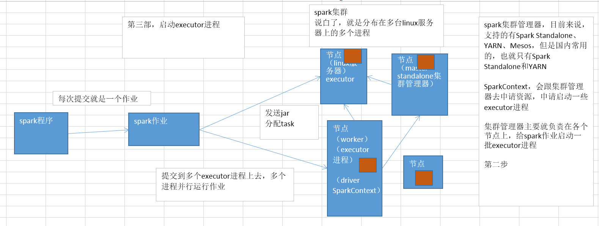

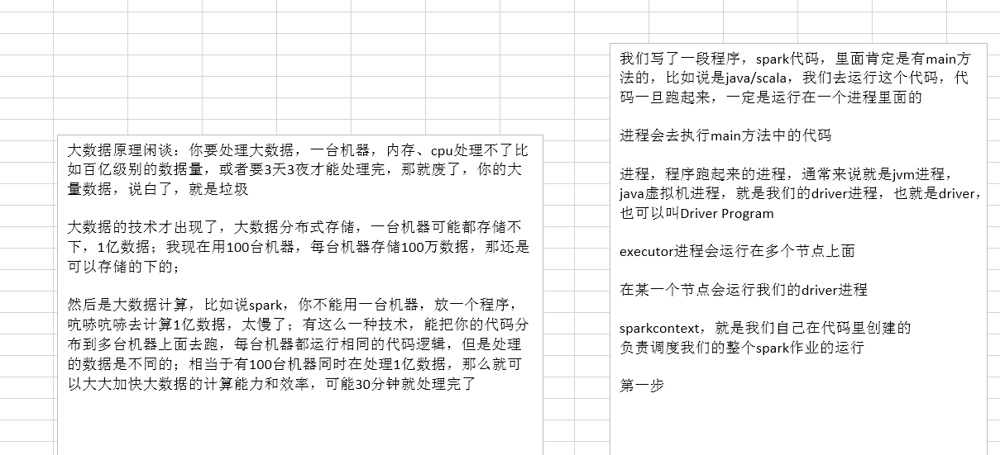

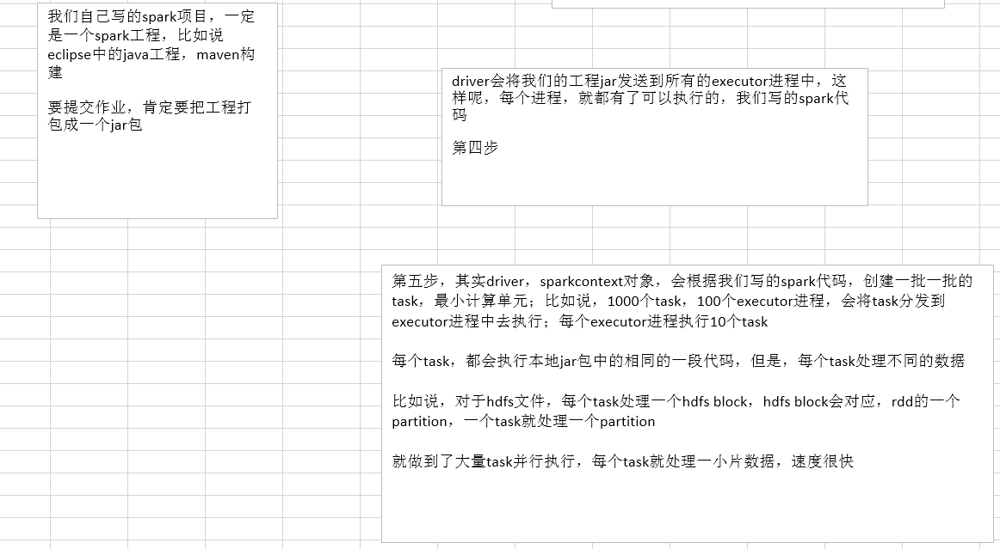


# 第142讲-Spark核心编程进阶-Spark集群架构的几点特别说明

关于spark集群架构的一些说明

1、每个spark application，都有属于自己的executor进程；绝对不可能出现多个spark application共享一个executor进程的
	executor进程，在整个spark application运行的生命周期内，都会一直存在，不会自己消失的
	executor进程，最主要的，就是使用多线程的方式，运行SparkContext分配过来的task，来一批task就执行一批，一批执行完了，再换下一批task执行
2、spark application，跟集群管理器之间，是透明的
	不管你是哪个集群管理器，我就知道，我找你就可以申请到executor进程就好了
	所以说，就算在一个能够容纳其他类型的计算作业的集群管理器中，也可以提交spark作业，比如说YARN、Mesos这种
	大公司里，其实一般都是用YARN作为大数据计算作业管理器的，包括mapreduce、hive、storm和spark，统一在yarn上面运行，统一调度和管理公司的系统资源
3、driver（其实也就是咱们的main类运行的jvm进程），必须时刻监听着属于它这个spark application的executor进程发来的通信和连接
	而且driver除了监听，自己也得负责调度整个spark作业（你自己写的spark代码）的调度和运行，也得大量跟executor进程通信，给他们分派计算任务
	所以driver在网络环境中的位置，还是很重要的，driver尽量离spark集群得近一些
4、上面说了，driver要调度task给executor执行，所以driver最好和spark集群在一片网络内

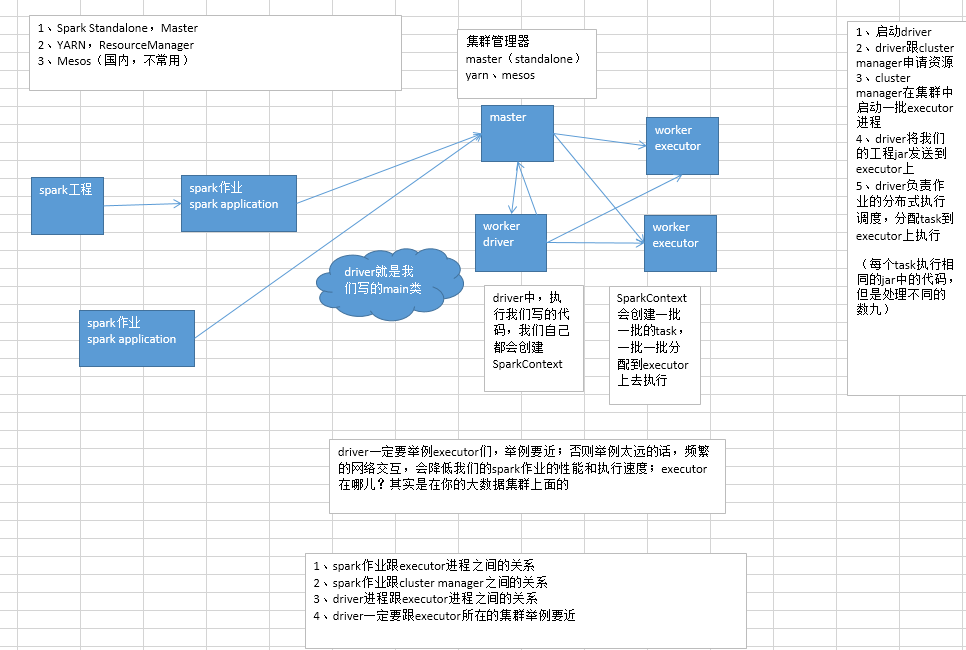


# 第143讲-Spark核心编程进阶-Spark的核心术语讲解

一些重要的spark术语

Application			spark应用程序，说白了，就是用户基于spark api开发的程序，一定是通过一个有main方法的类执行的，比如java开发spark，就是在eclipse中，建立的一个工程
Application Jar		这个就是把写好的spark工程，打包成一个jar包，其中包括了所有的第三方jar依赖包，比如java中，就用maven+assembly插件打包最方便
Driver Program		说白了，就是运行程序中main方法的进程，这就是driver，也叫driver进程
Cluster Manager		集群管理器，就是为每个spark application，在集群中调度和分配资源的组件，比如Spark Standalone、YARN、Mesos等
Deploy Mode			部署模式，无论是基于哪种集群管理器，spark作业部署或者运行模式，都分为两种，client和cluster，client模式下driver运行在提交spark作业的机器上；cluster模式下，运行在spark集群中
Worker Node			集群中的工作节点，能够运行executor进程，运行作业代码的节点
Executor			集群管理器为application分配的进程，运行在worker节点上，负责执行作业的任务，并将数据保存在内存或磁盘中，每个application都有自己的executor
Job					每个spark application，根据你执行了多少次action操作，就会有多少个job
Stage				每个job都会划分为多个stage（阶段），每个stage都会有对应的一批task，分配到executor上去执行
Task				driver发送到executor上执行的计算单元，每个task负责在一个阶段（stage），处理一小片数据，计算出对应的结果


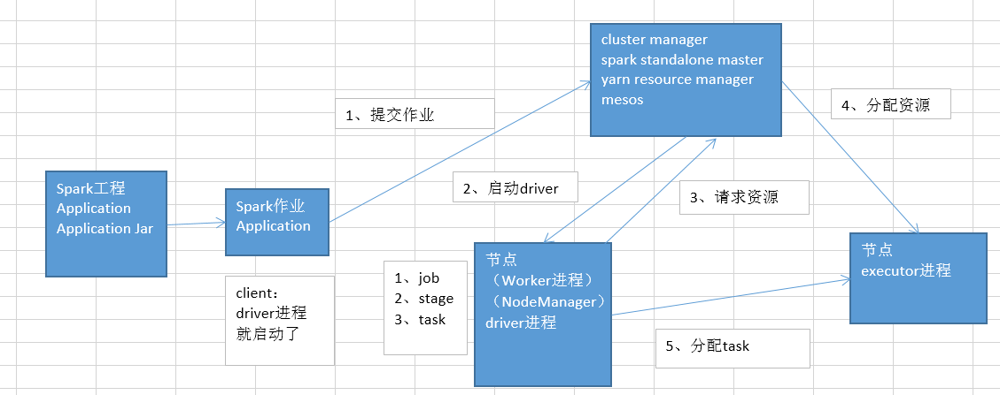

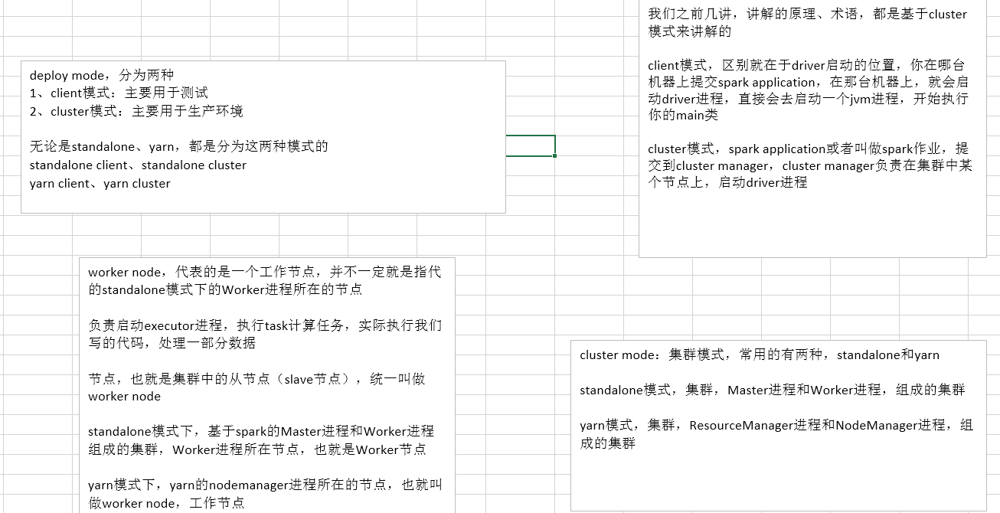

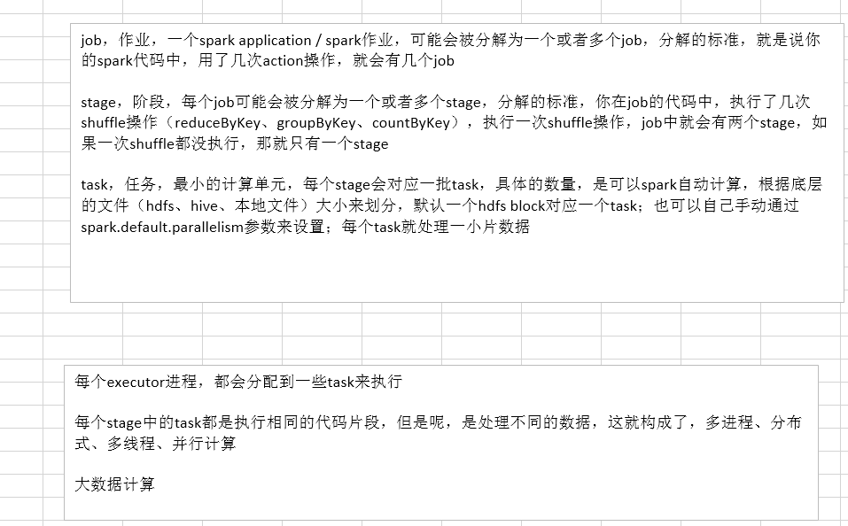


# 第144讲-Spark核心编程进阶-Spark Standalone集群架构

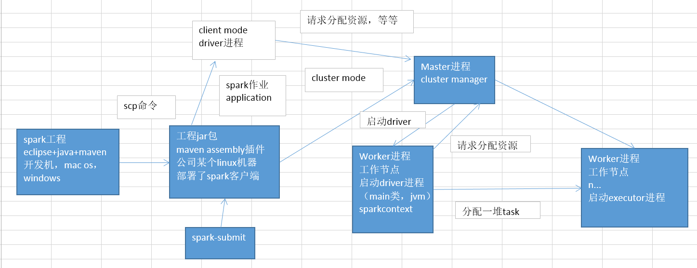

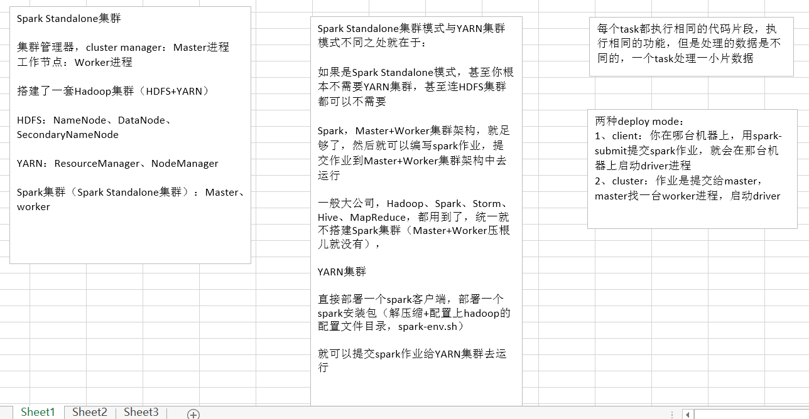

# 第145讲-Spark核心编程进阶-单独启动master和worker脚本详解

standalone模式启动集群命令详解

我们之前搭建那个伪分布式spark standalone集群的时候，以及我们最早搭建分布式集群的时候
在启动集群（master进程和worker进程）的时候，大家回忆一下，我们用的是哪个命令，用的是sbin/start-all.sh脚本
这个脚本一旦执行，就会直接在集群（节点，部署了spark安装包）中，启动master进程和所有worker进程

sbin/start-all.sh脚本，其实是用来便捷地快速启动整个spark standalone集群的
但是我们本讲呢，就是对spark standalone集群的启动脚本，作一个更加详细和全面的介绍和讲解

我们除了会用sbin/start-all.sh脚本，直接启动整个集群
还要会用另外两个脚本，单独启动master和worker进程

先讲理论，后面我们来做实验

直接启动master、worker集群，使用sbin/start-all.sh即可

如果你要单独，分别，启动master和worker进程的话
那么必须得先启动master进程，然后再启动worker进程，因为worker进程启动以后，需要向master进程去注册
反过来先启动worker进程，再启动这个master进程，可能会有问题

为什么我们有的时候也需要单独启动master和worker进程呢
因为我们后面会讲的，在单独启动两个进程的时候，是可以通过命令行参数，为进程配置一些独特的参数
比如说监听的端口号、web ui的端口号、使用的cpu和内存
比如你想单独给某个worker节点配置不同的cpu和内存资源的使用限制，那么就可以使用脚本单独启动这个worker进程的时候，通过命令行参数来设置

手动启动master进程

需要在某个部署了spark安装包的节点上，使用sbin/start-master.sh启动
master启动之后，启动日志就会打印一行spark://HOST:PORT URL出来，这就是master的URL地址
worker进程就会通过这个URL地址来连接到master进程，并且进行注册
另外，除了worker进程要使用这个URL意外，我们自己在编写spark代码时，也可以给SparkContext的setMaster()方法，传入这个URL地址
然后我们的spark作业，就会使用standalone模式连接master，并提交作业
此外，还可以通过http://MASTER_HOST:8080 URL来访问master集群的监控web ui，那个web ui上，也会显示master的URL地址

剧透一下，后面会做单独启动master和worker进程的实验
启动master的时候，要观察什么呢？要观察一下日志中透露出来的这个master URL
在http://HOST:8080端口，观察一下master的URL地址

手动启动worker进程

需要在你希望作为worker node的节点上，在部署了spark安装包的前提下，使用sbin/start-slave.sh <master-spark-URL>在当前节点上启动
如上所述，使用sbin/start-slave.sh时，需要指定master URL
启动worker进程之后，再访问http://MASTER_HOST:8080，在spark集群web ui上，就可以看见新启动的worker节点，包括该节点的cpu和内存资源等信息

一会儿实验，启动worker之后，要在master web ui上，观察一下新启动的worker节点

此外，以下参数是可以在手动启动master和worker的时候指定的

-h HOST, --host HOST			在哪台机器上启动，默认就是本机，这个很少配
-p PORT, --port PORT			在机器上启动后，使用哪个端口对外提供服务，master默认是7077，worker默认是随机的，也很少配
--webui-port PORT				web ui的端口，master默认是8080，worker默认是8081，也很少配
-c CORES, --cores CORES			仅限于worker，总共能让spark作业使用多少个cpu core，默认是当前机器上所有的cpu core
-m MEM, --memory MEM			仅限于worker，总共能让spark作业使用多少内存，是100M或者1G这样的格式，默认是1g
-d DIR, --work-dir DIR			仅限于worker，工作目录，默认是SPARK_HOME/work目录
--properties-file FILE			master和worker加载默认配置文件的地址，默认是conf/spark-defaults.conf，很少配

咱们举个例子，比如说小公司里面，物理集群可能就一套，同一台机器上面，可能要部署Storm的supervisor进程，可能还要同时部署Spark的worker进程
机器，cpu和内存，既要供storm使用，还要供spark使用
这个时候，可能你就需要限制一下worker节点能够使用的cpu和内存的数量

小公司里面，搭建spark集群的机器可能还不太一样，有的机器比如说是有5个g内存，有的机器才1个g内存
那你对于1个g内存的机器，是不是得限制一下内存使用量，比如说500m

实验
1、启动master: 日志和web ui，观察master url
2、启动worker: 观察web ui，是否有新加入的worker节点，以及对应的信息
3、关闭master和worker
4、再次单独启动master和worker，给worker限定，就使用500m内存，跟之前看到的worker信息比对一下内存最大使用量


# 第146讲-Spark核心编程进阶-实验：单独启动master和worker进程以及启动日志查看

standalone模式启动集群命令详解

我们之前搭建那个伪分布式spark standalone集群的时候，以及我们最早搭建分布式集群的时候
在启动集群（master进程和worker进程）的时候，大家回忆一下，我们用的是哪个命令，用的是sbin/start-all.sh脚本
这个脚本一旦执行，就会直接在集群（节点，部署了spark安装包）中，启动master进程和所有worker进程

sbin/start-all.sh脚本，其实是用来便捷地快速启动整个spark standalone集群的
但是我们本讲呢，就是对spark standalone集群的启动脚本，作一个更加详细和全面的介绍和讲解

我们除了会用sbin/start-all.sh脚本，直接启动整个集群
还要会用另外两个脚本，单独启动master和worker进程

先讲理论，后面我们来做实验

直接启动master、worker集群，使用sbin/start-all.sh即可

如果你要单独，分别，启动master和worker进程的话
那么必须得先启动master进程，然后再启动worker进程，因为worker进程启动以后，需要向master进程去注册
反过来先启动worker进程，再启动这个master进程，可能会有问题

为什么我们有的时候也需要单独启动master和worker进程呢
因为我们后面会讲的，在单独启动两个进程的时候，是可以通过命令行参数，为进程配置一些独特的参数
比如说监听的端口号、web ui的端口号、使用的cpu和内存
比如你想单独给某个worker节点配置不同的cpu和内存资源的使用限制，那么就可以使用脚本单独启动这个worker进程的时候，通过命令行参数来设置

手动启动master进程

需要在某个部署了spark安装包的节点上，使用sbin/start-master.sh启动
master启动之后，启动日志就会打印一行spark://HOST:PORT URL出来，这就是master的URL地址
worker进程就会通过这个URL地址来连接到master进程，并且进行注册
另外，除了worker进程要使用这个URL意外，我们自己在编写spark代码时，也可以给SparkContext的setMaster()方法，传入这个URL地址
然后我们的spark作业，就会使用standalone模式连接master，并提交作业
此外，还可以通过http://MASTER_HOST:8080 URL来访问master集群的监控web ui，那个web ui上，也会显示master的URL地址

单独启动master进程以后，你会看到打印出来一行日志文件的名称
通常就是放在logs/spark-root-org.apache.spark.deploy.master.Master-1-sparkupgrade1.out
通过这个日志，就可以查看master的启动日志

剧透一下，后面会做单独启动master和worker进程的实验
启动master的时候，要观察什么呢？要观察一下日志中透露出来的这个master URL
在http://HOST:8080端口，观察一下master的URL地址

手动启动worker进程

需要在你希望作为worker node的节点上，在部署了spark安装包的前提下，使用sbin/start-slave.sh <master-spark-URL>在当前节点上启动
如上所述，使用sbin/start-slave.sh时，需要指定master URL
启动worker进程之后，再访问http://MASTER_HOST:8080，在spark集群web ui上，就可以看见新启动的worker节点，包括该节点的cpu和内存资源等信息

一会儿实验，启动worker之后，要在master web ui上，观察一下新启动的worker节点

此外，以下参数是可以在手动启动master和worker的时候指定的

-h HOST, --host HOST			在哪台机器上启动，默认就是本机，这个很少配
-p PORT, --port PORT			在机器上启动后，使用哪个端口对外提供服务，master默认是7077，worker默认是随机的，也很少配
--webui-port PORT				web ui的端口，master默认是8080，worker默认是8081，也很少配
-c CORES, --cores CORES			仅限于worker，总共能让spark作业使用多少个cpu core，默认是当前机器上所有的cpu core
-m MEM, --memory MEM			仅限于worker，总共能让spark作业使用多少内存，是100M或者1G这样的格式，默认是1g
-d DIR, --work-dir DIR			仅限于worker，工作目录，默认是SPARK_HOME/work目录
--properties-file FILE			master和worker加载默认配置文件的地址，默认是conf/spark-defaults.conf，很少配

咱们举个例子，比如说小公司里面，物理集群可能就一套，同一台机器上面，可能要部署Storm的supervisor进程，可能还要同时部署Spark的worker进程
机器，cpu和内存，既要供storm使用，还要供spark使用
这个时候，可能你就需要限制一下worker节点能够使用的cpu和内存的数量

小公司里面，搭建spark集群的机器可能还不太一样，有的机器比如说是有5个g内存，有的机器才1个g内存
那你对于1个g内存的机器，是不是得限制一下内存使用量，比如说500m

实验
1、启动master: 日志和web ui，观察master url
2、启动worker: 观察web ui，是否有新加入的worker节点，以及对应的信息
3、单独关闭master和worker，顺序得反过来，先关worker，再关master
4、再次单独启动master和worker，给worker限定--memory参数，就使用500m内存，再到web ui，跟之前看到的worker信息比对一下内存最大使用量
5、集体关闭集群，再启动集群，保证后面可以正常使用


# 第147讲-Spark核心编程进阶-worker节点配置以及spark-evn.sh参数详解

standalone部署细节以及相关参数详解

这里主要讲解spark部署过程中的一些细节

配置集群中的worker节点

首先第一点，如果你想将某台机器部署成standalone集群架构中的worker节点（会运行worker daemon进程）
那么你就必须在那台机器上部署咱们的spark安装包

配置conf/slaves文件
在conf/salves文件中，哪些机器是作为worker节点的，可以配置你要在哪些机器上启动worker进程
之前已经演示过分布式的spark standalone集群部署了，需要将master和worker进程所在的节点，都部署好spark安装包

默认情况下，没有conf/slaves这个文件，只有一个conf/slaves.template，而且还是空的
此时，就只是在当前主节点上启动一个master进程和一个worker进程，此时就是master进程和worker进程在一个节点上，也就是伪分布式部署
我们升级课程中就是用的伪分布式部署，但是之前第一个大的阶段，用的是分布式的部署方式，就是说，你得去手动将slaves.template拷贝为一份slaves文件
然后需要手动去编辑conf/slaves文件中的内容

此时，在conf/slaves文件中，你可以编辑要作为worker节点的机器，比如说hostname，或者ip地址，都可以，一个机器是一行
配置以后，所有的节点上，spark部署安装包中，都得去拷贝一份这个conf/slaves文件

这里master机器和worker机器之间的访问时通过linux ssh方式进行的，所以要配置多个机器之间的ssh免密码连接

conf/spark-env.sh

spark-env.sh文件，它的地位，就类似于hadoop中的core-site.xml、hdfs-site.xml等等
应该说是spark中最核心的一份配置文件
这份文件，可以对整个spark的集群部署，各个master和worker进程的相应的行为，进行充分和细节化的配置

SPARK_MASTER_IP					指定master进程所在的机器的ip地址
SPARK_MASTER_PORT				指定master监听的端口号（默认是7077）
SPARK_MASTER_WEBUI_PORT			指定master web ui的端口号（默认是8080）

大家会发现什么，就是这个东东，怎么跟我们上一讲，讲解的单独启动master和worker进程的命令行参数，作用，是一样的
sbin/start-master.sh --port 7078，类似这种方式，貌似可以指定一样的配置属性
我明确告诉大家，这个作用的确是一模一样的

你可以在spark-evn.sh中就去配置好
但是有时呢，可能你会遇到需要临时更改配置，并启动master或worker进程的情况
此时就比较适合，用sbin/start-master.sh这种脚本的命令行参数，来设置这种配置属性
但是通常来说呢，还是推荐在部署的时候，通过spark-env.sh来设定
脚本命令行参数通常用于临时的情况

SPARK_MASTER_OPTS				设置master的额外参数，使用"-Dx=y"设置各个参数
比如说export SPARK_MASTER_OPTS="-Dspark.deploy.defaultCores=1"

参数名											默认值						含义
spark.deploy.retainedApplications				200							在spark web ui上最多显示多少个application的信息
spark.deploy.retainedDrivers					200							在spark web ui上最多显示多少个driver的信息
spark.deploy.spreadOut							true						资源调度策略，spreadOut会尽量将application的executor进程分布在更多worker上，适合基于hdfs文件计算的情况，提升数据本地化概率；非spreadOut会尽量将executor分配到一个worker上，适合计算密集型的作业
spark.deploy.defaultCores						无限大						每个spark作业最多在standalone集群中使用多少个cpu core，默认是无限大，有多少用多少
spark.deploy.timeout							60							单位秒，一个worker多少时间没有响应之后，master认为worker挂掉了

SPARK_LOCAL_DIRS				spark的工作目录，包括了shuffle map输出文件，以及持久化到磁盘的RDD等

SPARK_WORKER_PORT				worker节点的端口号，默认是随机的
SPARK_WORKER_WEBUI_PORT			worker节点的web ui端口号，默认是8081
SPARK_WORKER_CORES				worker节点上，允许spark作业使用的最大cpu数量，默认是机器上所有的cpu core
SPARK_WORKER_MEMORY				worker节点上，允许spark作业使用的最大内存量，格式为1000m，2g等，默认最小是1g内存

就是说，有些master和worker的配置，可以在spark-env.sh中部署时即配置，但是也可以在start-slave.sh脚本启动进程时命令行参数设置
但是命令行参数的优先级比较高，会覆盖掉spark-env.sh中的配置
比如说，上一讲我们的实验，worker的内存默认是1g，但是我们通过--memory 500m，是可以覆盖掉这个属性的

SPARK_WORKER_INSTANCES			当前机器上的worker进程数量，默认是1，可以设置成多个，但是这时一定要设置SPARK_WORKER_CORES，限制每个worker的cpu数量
SPARK_WORKER_DIR				spark作业的工作目录，包括了作业的日志等，默认是spark_home/work
SPARK_WORKER_OPTS				worker的额外参数，使用"-Dx=y"设置各个参数

参数名											默认值						含义
spark.worker.cleanup.enabled					false						是否启动自动清理worker工作目录，默认是false
spark.worker.cleanup.interval					1800						单位秒，自动清理的时间间隔，默认是30分钟
spark.worker.cleanup.appDataTtl					7 * 24 * 3600				默认将一个spark作业的文件在worker工作目录保留多少时间，默认是7天

SPARK_DAEMON_MEMORY				分配给master和worker进程自己本身的内存，默认是1g
SPARK_DAEMON_JAVA_OPTS			设置master和worker自己的jvm参数，使用"-Dx=y"设置各个参数
SPARK_PUBLISC_DNS				master和worker的公共dns域名，默认是没有的

这里提示一下，大家可以观察一下，咱们的内存使用情况
在没有启动spark集群之前，我们的内存使用是1个多g，启动了spark集群之后，就一下子耗费到2个多g
每次又执行一个作业时，可能会耗费到3个多g左右

所以大家就明白了，为什么之前用分布式的集群，每个worker节点才1个g内存，根本是没有办法使用standalone模式和yarn模式运行作业的

上一节课讲解了单独启动spark standalone集群
这一节课，就给大家列出spark所有的启动和关闭shell脚本

sbin/start-all.sh				根据配置，在集群中各个节点上，启动一个master进程和多个worker进程
sbin/stop-all.sh				在集群中停止所有master和worker进程
sbin/start-master.sh			在本地启动一个master进程
sbin/stop-master.sh				关闭master进程
sbin/start-slaves.sh			根据conf/slaves文件中配置的worker节点，启动所有的worker进程
sbin/stop-slaves.sh				关闭所有worker进程
sbin/start-slave.sh				在本地启动一个worker进程


# 第148讲-Spark核心编程进阶-实验：local模式提交spark作业

之前讲解过，spark作业运行集群，有两种部署方式，一种是Spark Standalone集群，还有一种是YARN集群+Spark客户端
所以，我们认为，提交spark作业的两种主要方式，就是Spark Standalone和YARN，这两种方式，分别还分为两种模式，分别是client mode和cluster mode
在体验standalone提交模式之前，咱们呢，先得体验一种Spark中最基本的一种提交模式
也就是，所谓的local模式

local模式的基本原理
local模式下，没有所谓的master+worker这种概念
local模式，相当于，启动一个本地进程，然后在一个进程内，模拟spark集群中作业的运行
一个spark作业，就对应了进程中的一个或多个executor线程
就开始执行，包括作业的调度，task分配

在实际工作当中，local模式，主要用于测试
最常见的就是在我们的开发环境中，比如说eclipse，或者是InteliJ IDEA
直接运行spark程序，此时就可以采用local模式

本次实验，通过在eclipse中使用local来运行，以及在生产机器上（linux机器）上用local模式来运行


# 第149讲-Spark核心编程进阶-实验：standalone client模式提交spark作业

local模式下，我们都不会放到生产机器上面去提交
local模式，其实仅仅用于eclipse中运行spark作业，以及打断点，调试spark作业来用
通常，用local模式执行，我们都会手工生成一份数据，来使用

通常情况下来说，部署在测试机器上去，进行测试运行spark作业的时候
都是使用client模式（standalone client模式，或standalone cluster模式）
client模式下，提交作业以后，driver在本机启动，可以实时看到详细的日志信息，方便你追踪和排查错误

standalone模式下提交spark作业

standalone模式提交，唯一与local区别，就是一定要想办法将master设置成spark://master_ip:port，比如spark://192.168.0.103:7077

三种设置master的方式
1、硬编码: SparkConf.setMaster("spark://IP:PORT")
2、spark-submit: --master spark://IP:PORT
3、spark-shell: --master spark://IP:PORT

通常来说，上面三种写法，使用第二种，是最合适

一般我们都是用spark-submit脚本来提交spark application的，很少用spark-shell，spark-shell仅仅用于实验和测试一些特别简单的spark作业
使用spark-submit脚本来提交时，还可以指定两种deploy mode，spark standalone cluster支持client mode和cluster mode
client mode下，你在哪台机器上用spark-submit脚本提交application，driver就会在那台机器上启动
cluster mode下，driver会通过master进程，随机被分配给某一个worker进程来启动

这里我们就知道了，standalone模式，是要在spark-submit中，用--master指定Master进程的URL
其次，使用standalone client模式或cluster模式，是要在spark-submit中，使用--deploy-mode client/cluster来设置
默认，如果你不设置--deploy-mode，那么就是client模式

使用spark-submit脚本来提交application时，application jar是会自动被分发到所有worker节点上去的
对于你的application依赖的额外jar包，可以通过spark-submit脚本中的--jars标识，来指定，可以使用逗号分隔多个jar
比如说，你写spark-sql的时候，有的时候，在作业中，要往mysql中写数据，此时可能会出现找不到mysql驱动jar包的情况
此时，就需要你手动在spark-submit脚本中，使用--jars，加入一些依赖的jar包

我们提交standalone client模式的作业
1、--master和--deploy-mode，来提交作业
2、观察作业执行日志，可以看到去连接spark://192.168.0.103:7077 URL的master
3、观察一些spark web ui，可以看到completed applications一栏中，有我们刚刚运行的作业，比对一下ui上的applicationId和日志中的applicationId
4、重新再执行一次作业，一执行，立即看一下jps查看进程，看看standalone client模式提交作业的时候，当前机器上会启动哪些进程
	SparkSubmit: 也就是我们的driver进程，在本机上启动（spark-submit所在的机器）
	CoarseGrainedExecutorBackend（内部持有一个Executor对象）: 在你的执行spark作业的worker机器上，肯定会给你的作业分配和启动一个executor进程，具体名字就是那个


# 第150讲-Spark核心编程进阶-实验：standalone cluster模式提交spark作业

standalone cluster模式

通常用于，spark作业部署到生产环境中去使用，是用standalone cluster模式
因为这种模式，会由master在集群中，某个节点上，来启动driver，然后driver会进行频繁的作业调度
此时driver跟集群在一起，那么是性能比较高的

standalone client模式，在spark-submit脚本执行的机器上，会启动driver进程，然后去进行整个作业的调度
通常来说，你的spark-submit脚本能够执行的机器，也就是，作为一个开发人员能够登录的机器，通常不会直接是spark集群部署的机器
因为，随便谁，都登录到spark集群中，某个机器上去，执行一个脚本，这个太扯淡了，没有安全性可言了
所有此时呢，是这样子，用client模式，你的机器，可能与spark集群部署的机器，都不在一个机房，或者距离很远，那么此时通常遥远的频繁的网络通信
会影响你的整个作业的执行性能

此外，standalone cluster模式，还支持监控你的driver进程，并且在driver挂掉的时候，自动重启该进程
要使用这个功能，在spark-submit脚本中，使用--supervise标识即可
这个跟我们的这个作业关系不是太大，主要是用于spark streaming中的HA高可用性，配置driver的高可用

如果想要杀掉反复挂掉的driver进程，使用以下命令即可: bin/spark-class org.apache.spark.deploy.Client kill <master url> <driver ID>  
如果要查看driver id，通过http://<maser url>:8080即可查看到

实验观察
1、日志：命令行只会打印一点点内容，没有什么东西; 主要呢，是在web ui上，可以看到日志
2、web ui: running drivers出现，此时就可以看到在spark集群中执行的driver的信息; completed drivers
3、进程: SparkSubmit一闪而过，仅仅只是将driver注册到master上，由master来启动driver，马上就停止了; 在Worker上，会启动DriverWrapper进程
如果能够申请到足够的cpu资源，其实还会在其他worker上，启动CoarseGrainedExecutorBackend进程
4、可以通过点击running中的application，去查看作业中的每个job、每个stage、每个executor和task的执行信息，4040端口来看的
5、对于正在运行的driver或application，可以在web ui上，点击kill按钮，给杀掉

首先呢，cluster模式下，driver也是要通过worker来启动的，executor也是要通过worker来启动的
首先，我们可以看到，此时driver已经启动起来了，在web ui上是可以看到的，包括driver ID
然后呢，通过web ui就可以看到，driver在唯一的worker上启动了，已经获取到了一个cpu core了
此时，driver去跟master申请资源，启动一个executor进程，但是问题来了，此时我们的worker进程，就只有一个，而且只有一个cpu core
那么，master的资源调度算法中，始终无法找到还有空闲cpu资源的worker，所以作业一直处于等待，waiting的一个状态
所以，我们的作业在当前1个cpu core下，是无法通过cluster模式来运行的

但是至少我们可以看到，cluster模式的确奏效了，因为已经开始使用cluster模式来执行作业了
包括driver的启动，开始申请executor


# 第151讲-Spark核心编程进阶-standalone模式下的多作业资源调度

standalone多作业资源调度问题

目前来说，standalone集群对于同时提交上来的多个作业，仅仅支持FIFO调度策略，也就是先入先出
默认情况下，集群对多个作业同时执行的支持是不好的，没有办法同时执行多个作业
因为先提交上来的每一个作业都会尝试使用集群中所有可用的cpu资源，此时相当于就是只能支持作业串行起来，一个一个运行了

此时，如果我们希望能够支持多作业同时运行，那么就需要调整一下资源参数
我们可以设置spark.cores.max参数，来限制每个作业能够使用的最大的cpu core数量，这样先提交上来的作业不会使用所有的cpu资源
后面提交上来的作业就可以获取到资源，也可以同时并行运行了

比如说，咱们集群一共有20个节点，每个节点是8核，160 cpu core
ok，那么，如果你不限制每个作业获取的最大cpu资源大小，而且在你spark-submit的时候，或者说，你就设置了num-executors，total-cores，160
此时，你的作业是会使用所有的cpu core资源的

所以，如果我们可以通过设置全局的一个参数，让每个作业最多只能获取到一部分cpu core资源
那么，后面提交上来的作业，就也可以获取到一部分资源
standalone集群，才可以支持同时执行多个作业

使用SparkConf或spark-submit中的--conf标识，设置参数即可

比如说: 

SparkConf conf = new SparkConf()
		.set("spark.cores.max", "10")

通常不建议使用SparkConf，硬编码，来设置一些属性，不够灵活
建议使用spark-submit来设置属性

--conf spark.cores.max=10
		
此外，还可以直接通过spark-env.sh配置每个application默认能使用的最大cpu数量来进行限制，默认是无限大，此时就不需要每个application都自己手动设置了
在spark-env.sh中配置spark.deploy.defaultCores即可
比如说: export SPARK_MASTER_OPTS="-Dspark.deploy.defaultCores=10"


# 第152讲-Spark核心编程进阶-standalone模式下的作业监控与日志记录

standalone作业监控和日志记录

standalone模式下的作业的监控，很简单，就是通过我们之前给大家看的spark web ui

spark standalone模式，提供了一个web界面来让我们监控集群，并监控所有的作业的运行
web界面上，提供了master和worker的相关信息，默认的话，我们的web界面是运行在master机器上的8080端口
之前已经讲解过，可以通过配置spark-env.sh文件等方式，来配置web ui的端口

spark web ui

1、哪些作业在跑
2、哪些作业跑完了，花了多少时间，使用了多少资源
3、哪些作业失败了

application web ui

作业监控这一块儿，其实很重要的一点是，作业的web ui
我们之前给大家讲过，application detail ui，其实就是作业的driver所在的机器的4040端口
可以看到job、stage、task的详细运行信息，shuffle read、shuffle write、gc、运行时间、每个task分配的数据量
定位很多性能问题、troubleshooting等等，task数据分布不允许，那么就是数据倾斜
哪个stage运行的时间最慢，通过之前讲解的stage划分算法，去你的代码里定位到，那个stage对应的是哪一块儿代码，你的那段代码为什么会运行太慢
是不是可以用我们之前讲解的一些性能优化的策略，去优化一下性能

但是有个问题，作业运行完了以后，我们就看不到了
此时跟history server有关，我们后面会讲解，全局的去配置整个spark集群的监控和日志
history server

日志记录
1、系统级别的，spark自己的日志记录
2、我们在程序里面，用log4j，或者System.out.println打印出来的日志

spark web ui中可以看到
1、看每个application在每个executor上的日志
2、stdout，可以显示我们用System.out.println打印出来的日志，stderr，可以显示我们用System.err.println打印出来的日志

此外，我们自己在spark作业代码中，打出来的日志，比如用System.out.println()等，是打到每个作业在每个节点的工作目录中去的
默认是SPARK_HOME/work目录下
这个目录下，每个作业都有两个文件，一个是stdout，一个是stderr，分别代表了标准输出流和异常输出流


# 第153讲-Spark核心编程进阶-实验：运行中作业监控以及手工打印日志

# 第154讲-Spark核心编程进阶-yarn-client模式原理讲解

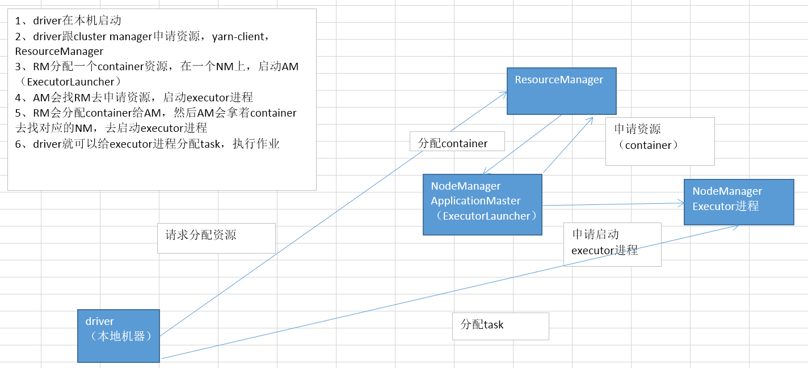

# 第155讲-Spark核心编程进阶-yarn-cluster模式原理讲解

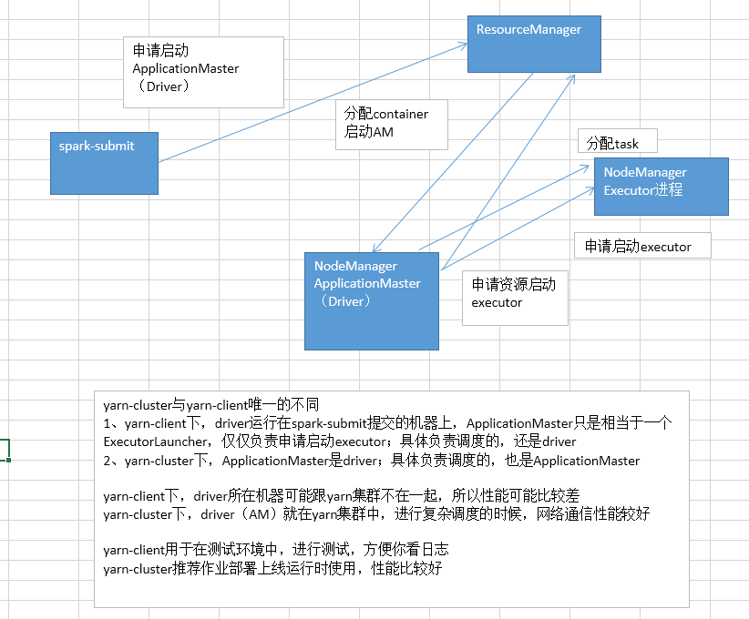

# 第156讲-Spark核心编程进阶-实验：yarn-client模式提交spark作业

yarn模式运行spark作业

yarn运行spark作业的大前提

如果想要让spark作业可以运行在yarn上面，那么首先就必须在spark-env.sh文件中，配置HADOOP_CONF_DIR或者YARN_CONF_DIR属性，值为hadoop的配置文件目录
即HADOOP_HOME/etc/hadoop，其中包含了hadoop和yarn所有的配置文件，比如hdfs-site、yarn-site等
spark需要这些配置来读写hdfs，以及连接到yarn resourcemanager上，这个目录中包含的配置文件都会被分发到yarn集群中去的

在yarn模式下，也有两种运行模式
yarn-client模式下，driver进程会运行在提交作业的机器上，ApplicationMaster仅仅只是负责为作业向yarn申请资源（executor）而已，driver还是会负责作业调度
yarn-cluster模式下，driver进程会运行在yarn集群的某个工作节点上，作为一个ApplicationMaster进程运行

跟spark standalone模式不同，通常不需要使用--master指定master URL
cluster manager，也就是yarn resourcemanager的地址，会自动从hadoop配置目录中的配置文件中后去
因此，设置--master时，指定为yarn-client或yarn-cluster即可，也就代表了上面说的两种deploy mode了

这里提示一下，与standalone模式类似，yarn-client模式通常建议在测试时使用，方便你直接在提交作业的机器上查看日志
但是作业实际部署到生产环境进行运行的时候，还是使用yarn-cluster模式

使用yarn-cluster模式提交时，使用以下语法即可: 
./bin/spark-submit \
--class path.to.your.Class \
--master yarn-cluster \
[options] \
<app jar> \
[app options]

比如如下脚本示例:

$ ./bin/spark-submit --class org.leo.spark.study.WordCount \
    --master yarn-cluster \
    --num-executors 1 \
    --driver-memory 100m \
    --executor-memory 100m \
    --executor-cores 1 \
    --queue hadoop队列 \
    /usr/local/spark-study/spark-study.jar \

--queue，在大公司里面，队列很重要
不同的数据部门，或者是不同的大数据项目，共用同一个yarn集群，运行spark作业
推荐一定要用--queue，指定不同的hadoop队列，做项目或部门之间的队列隔离
	
在yarn-cluster模式下运行时，首先在本地机器会启动一个YARN client进程
YARN client进程会连接到resourcemanager上，然后启动一个spark的ApplicationMaster进程
接着我们自己写的main类，会作为一个ApplicationMaster进程的子线程来运行
提交作业的本地机器上，YARN client进程会周期性地跟ApplicationMaster进程，拉取作业运行的进度，并打印在控制台上
一旦我们的作业完成之后，YARN client进程也就会退出了

使用yarn-client模式提交时，使用以下语法即可: ./bin/spark-shell --master yarn-client

添加其他的jar

在spark-submit脚本中，使用--jars命令即可
    
实验中要观察的几个点
1、日志
	命令行日志: 会详细打印你的所有的日志
	web ui看日志: stdout、stderr
2、web ui，spark://192.168.0.103:8080这种URL了，因为那是standalone集群的监控web ui
	yarn的web ui上，才可以看到，stdout、stderr
	http://192.168.0.103:8088/，URL，YARN web ui，来做作业的监控
	http://driver:4040，通过yarn，进入spark application web ui
3、进程
	driver是什么进程
	ApplicationMaster进程
	executor进程
	
yarn模式下
我们的工程jar，是要拷贝到hdfs上面去的
而且它的replication，副本数量，默认是跟hadoop中的副本数量一样的
hdfs，一个datanode，没有办法做replication，所以也没有退出safemode
	

# 第157讲-Spark核心编程进阶-yarn模式下日志查看详解

yarn模式下调试运行中的spark作业

在yarn模式下，spark作业运行相关的executor和ApplicationMaster都是运行在yarn的container中的
一个作业运行完了以后，yarn有两种方式来处理spark作业打印出的日志

第一种是聚合日志方式（推荐，比较常用）

这种方式的话，顾名思义，就是说，将散落在集群中各个机器上的日志，最后都给聚合起来，让我们可以统一查看
如果打开了日志聚合的选项，即yarn.log-aggregation-enable，container的日志会拷贝到hdfs上去，并从机器中删除

对于这种情况，可以使用yarn logs -applicationId <app ID>命令，来查看日志
yarn logs命令，会打印出application对应的所有container的日志出来，当然，因为日志是在hdfs上的，我们自然也可以通过hdfs的命令行来直接从hdfs中查看日志
日志在hdfs中的目录，可以通过查看yarn.nodemanager.remote-app-log-dir和yarn.nodemanager.remote-app-log-dir-suffix属性来获知

第二种 web ui（如果你有精力的话，可以去配一下）

日志也可以通过spark web ui来查看executor的输出日志
但是此时需要启动History Server，需要让spark history server和mapreduce history server运行着
并且在yarn-site.xml文件中，配置yarn.log.server.url属性
spark history server web ui中的log url，会将你重定向到mapreduce history server上，去查看日志

第三种 分散查看（通常不推荐）

如果没有打开聚合日志选项，那么日志默认就是散落在各个机器上的本次磁盘目录中的，在YARN_APP_LOGS_DIR目录下
根据hadoop版本的不同，通常在/tmp/logs目录下，或者$HADOOP_HOME/logs/userlogs目录下
如果你要查看某个container的日志，那么就得登录到那台机器上去，然后到指定的目录下去，找到那个日志文件，然后才能查看


# 第158讲-Spark核心编程进阶-yarn模式相关参数详解

yarn模式运行spark作业所有属性详解

属性名称											默认值							含义
spark.yarn.am.memory								512m							client模式下，YARN Application Master使用的内存总量
spark.yarn.am.cores									1								client模式下，Application Master使用的cpu数量
spark.driver.cores									1								cluster模式下，driver使用的cpu core数量，driver与Application Master运行在一个进程中，所以也控制了Application Master的cpu数量
spark.yarn.am.waitTime								100s							cluster模式下，Application Master要等待SparkContext初始化的时长; client模式下，application master等待driver来连接它的时长
spark.yarn.submit.file.replication					hdfs副本数						作业写到hdfs上的文件的副本数量，比如工程jar，依赖jar，配置文件等，最小一定是1
spark.yarn.preserve.staging.files					false							如果设置为true，那么在作业运行完之后，会避免工程jar等文件被删除掉
spark.yarn.scheduler.heartbeat.interval-ms			3000							application master向resourcemanager发送心跳的间隔，单位ms
spark.yarn.scheduler.initial-allocation.interval	200ms							application master在有pending住的container分配需求时，立即向resourcemanager发送心跳的间隔
spark.yarn.max.executor.failures					executor数量*2，最小3			整个作业判定为失败之前，executor最大的失败次数
spark.yarn.historyServer.address					无								spark history server的地址
spark.yarn.dist.archives							无								每个executor都要获取并放入工作目录的archive
spark.yarn.dist.files								无								每个executor都要放入的工作目录的文件
spark.executor.instances							2								默认的executor数量
spark.yarn.executor.memoryOverhead					executor内存10%					每个executor的堆外内存大小，用来存放诸如常量字符串等东西
spark.yarn.driver.memoryOverhead					driver内存7%					同上
spark.yarn.am.memoryOverhead						AM内存7%						同上
spark.yarn.am.port									随机							application master端口
spark.yarn.jar										无								spark jar文件的位置
spark.yarn.access.namenodes							无								spark作业能访问的hdfs namenode地址
spark.yarn.containerLauncherMaxThreads				25								application master能用来启动executor container的最大线程数量
spark.yarn.am.extraJavaOptions						无								application master的jvm参数
spark.yarn.am.extraLibraryPath						无								application master的额外库路径
spark.yarn.maxAppAttempts															提交spark作业最大的尝试次数
spark.yarn.submit.waitAppCompletion					true							cluster模式下，client是否等到作业运行完再退出


# 第159讲-Spark核心编程进阶-spark工程打包以及spark-submit详解

spark工程打包与spark-submit的关系

我们在eclipse编写代码，基于spark api开发自己的大数据计算和处理程序
将我们写好的spark工程打包，比如说java开发环境中，就使用maven assembly插件来打包，将第三方依赖包都打进去
jar包，生产环境中，通常是本机ssh远程连接到部署了spark客户端的linux机器上，使用scp命令将本机的jar包拷贝到远程linux机器上
然后在那个linux机器上，用spark-submit脚本，去将我们的spark工程，作为一次作业/application，提交到集群上去执行

课程中，使用WinSCP工具，从本机windows系统，上传到虚拟机中的linux上去

打包Spark工程

要使用spark-submit提交spark应用程序，首先就必须将我们的spark工程（java/scala）打包成一个jar包
如果我们的spark工程，依赖了其他一些第三方的组件，那就必须把所有组件jar包都打包到工程中，这样才能将完整的工程代码和第三方依赖都分发到spark集群中去
所以必须创建一个assembly jar来包含你所有的代码和依赖，sbt和maven都有assembly插件的（咱们课程里的java工程，就使用了maven的assembly插件）
配置依赖的时候（比如maven工程的pom.xml），可以把Spark和Hadoop的依赖配置成provided类型的依赖，也就是说仅仅开发和编译时有效，打包时就不将这两种依赖打到jar包里去了，因为集群管理器都会提供这些依赖
打好一个assembly jar包之后（也就是你的spark应用程序工程），就可以使用spark-submit脚本提交jar包中的spark应用程序了

spark-submit是什么？

在spark安装目录的bin目录中，有一个spark-submit脚本，这个脚本主要就是用来提交我们自己开发的spark应用程序到集群上执行
spark-submit可以通过一个统一的接口，将spark应用程序提交到所有spark支持的集群管理器上（Standalone（Master）、Yarn（ResourceManager）等）
所以我们并不需要为每种集群管理器都做特殊的配置

--master
1、如果不设置，那么就是local模式
2、如果设置spark://打头的URL，那么就是standalone模式，会提交到指定的URL的Master进程上去
3、如果设置yarn-打头的，那么就是yarn模式，会读取hadoop配置文件，然后连接ResourceManager


# 第160讲-Spark核心编程进阶-spark-submit示例以及基础参数讲解

使用spark-submit提交spark应用

将我们的spark工程打包好之后，就可以使用spark-submit脚本提交工程中的spark应用了
spark-submit脚本会设置好spark的classpath环境变量（用于类加载）和相关的依赖，而且还可以支持多种不同的集群管理器和不同的部署模式

以下是一个spark应用提交脚本的示例，以及其基本语法
一般会将执行spark-submit脚本的命令，放置在一个自定义的shell脚本里面，所以说这是比较灵活的一种做法
建议大家还是要熟悉linux操作系统，不需要太熟悉，会基本的操作就可以了

wordcount.sh

/usr/local/spark/bin/spark-submit \
--class org.leo.spark.study.WordCount \
--master spark://192.168.0.101:7077 \
--deploy-mode client \
--conf <key>=<value> \
/usr/local/spark-study/spark-study.jar \
${1}
 
以下是上面的spark-submit

--class: spark应用程序对应的主类，也就是spark应用运行的主入口，通常是一个包含了main方法的java类或scala类，需要包含全限定包名，比如org.leo.spark.study.WordCount
--master: spark集群管理器的master URL，standalone模式下，就是ip地址+端口号，比如spark://192.168.0.101:7077，standalone默认端口号就是7077
--deploy-mode: 部署模式，决定了将driver进程在worker节点上启动，还是在当前本地机器上启动；默认是client模式，就是在当前本地机器上启动driver进程，如果是cluster，那么就会在worker上启动
--conf: 配置所有spark支持的配置属性，使用key=value的格式；如果value中包含了空格，那么需要将key=value包裹的双引号中
application-jar: 打包好的spark工程jar包，在当前机器上的全路径名
application-arguments: 传递给主类的main方法的参数; 在shell中用${1}这种格式获取传递给shell的参数；然后在比如java中，可以通过main方法的args[0]等参数获取


# 第161讲-Spark核心编程进阶-实验：spark-submit最简单版本提交spark作业

# 第162讲-Spark核心编程进阶-实验：spark-submit给main类传递参数

# 第163讲-Spark核心编程进阶-spark-submit多个示例以及常用参数详解

```
# 使用local本地模式，以及8个线程运行
# --class 指定要执行的main类
# --master 指定集群模式，local，本地模式，local[8]，进程中用几个线程来模拟集群的执行
./bin/spark-submit \
  --class org.leo.spark.study.WordCount \
  --master local[8] \
  /usr/local/spark-study.jar \

# 使用standalone client模式运行
# executor-memory，指定每个executor的内存量，这里每个executor内存是2G
# total-executor-cores，指定所有executor的总cpu core数量，这里所有executor的总cpu core数量是100个
./bin/spark-submit \
  --class org.leo.spark.study.WordCount \
  --master spark://192.168.0.101:7077 \
  --executor-memory 2G \
  --total-executor-cores 100 \
  /usr/local/spark-study.jar \

# 使用standalone cluster模式运行
# supervise参数，指定了spark监控driver节点，如果driver挂掉，自动重启driver
./bin/spark-submit \
  --class org.leo.spark.study.WordCount \
  --master spark://192.168.0.101:7077 \
  --deploy-mode cluster \
  --supervise \
  --executor-memory 2G \
  --total-executor-cores 100 \
  /usr/local/spark-study.jar \

# 使用yarn-cluster模式运行
# num-executors，指定总共使用多少个executor运行spark应用
./bin/spark-submit \
  --class org.leo.spark.study.WordCount \
  --master yarn-cluster \  
  --executor-memory 20G \
  --num-executors 50 \
  /usr/local/spark-study.jar \

# 使用standalone client模式，运行一个python应用
./bin/spark-submit \
  --master spark://192.168.0.101:7077 \
  /usr/local/python-spark-wordcount.py \

--class
application jar
--master
--num-executors
--executor-memory
--total-executor-cores
--supervise
--executor-cores 
--driver-memory 

./bin/spark-submit \
  --class org.leo.spark.study.WordCount \
  --master yarn-cluster \
  --num-executors 100 \
  --executor-cores 2 \
  --executor-memory 6G \
  --driver-memory  1G \
  /usr/local/spark-study.jar \

```

# 第164讲-Spark核心编程进阶-SparkConf、spark-submit以及spark-defaults.conf

默认的配置属性

spark-submit脚本会自动加载conf/spark-defaults.conf文件中的配置属性，并传递给我们的spark应用程序
加载默认的配置属性，一大好处就在于，我们不需要在spark-submit脚本中设置所有的属性
比如说，默认属性中有一个spark.master属性，所以我们的spark-submit脚本中，就不一定要显式地设置--master，默认就是local

SparkConf.getOrElse("spark.master", "local")

spark配置的优先级如下: SparkConf、spark-submit、spark-defaults.conf

spark.default.parallelism

SparkConf.set("spark.default.parallelism", "100")
spark-submit: --conf spark.default.parallelism=50
spark-defaults.conf: spark.default.parallelism 10

如果想要了解更多关于配置属性的信息，可以在spark-submit脚本中，使用--verbose，打印详细的调试信息

使用spark-submit设置属性

虽然说SparkConf设置属性的优先级是最高的，但是有的时候咱们可能不希望在代码中硬编码一些配置属性，否则每次修改了参数以后
还得去代码里修改，然后得重新打包应用程序，再部署到生产机器上去，非常得麻烦

对于上述的情况，我们可以在代码中仅仅创建一个空的SparkConf对象，比如: val sc = new SparkContext(new SparkConf())

然后可以在spark-submit脚本中，配置各种属性的值，比如

./bin/spark-submit \
  --name "My app" \
  --master local[4] \
  --conf spark.shuffle.spill=false \
  --conf "spark.executor.extraJavaOptions=-XX:+PrintGCDetails -XX:+PrintGCTimeStamps" \
  myApp.jar

这里的spark.shuffle.spill属性，我们本来如果是在代码中，SparkConf.set("spark.shuffle.spill", "false")来配置的
此时在spark-submit中配置了，不需要更改代码，就可以更改属性，非常得方便，
尤其是对于spark程序的调优，格外方便，因为调优说白了，就是不断地调整各种各样的参数，然后反复跑反复试的过程

spark的属性配置方式

spark-shell和spark-submit两个工具，都支持两种加载配置的方式
一种是基于命令行参数，比如上面的--master，spark-submit可以通过--conf参数，接收所有spark属性
另一种是从conf/spark-defaults.conf文件中加载，其中每一行都包括了一个key和value
比如spark.executor.memory 4g

所有在SparkConf、spark-submit和spark-defaults.conf中配置的属性，在运行的时候，都会被综合使用
直接通过SparkConf设置的属性，优先级是最高的，会覆盖其余两种方式设置的属性
其次是spark-submit脚本中通过--conf设置的属性
最后是spark-defaults.conf中设置的属性

通常来说，如果你要对所有的spark作业都生效的配置，放在spark-defaults.conf文件中，只要将spark-defaults.conf.template拷贝成那个文，然后在其中编辑即可
然后呢，对于某个spark作业比较特殊的配置，推荐放在spark-submit脚本中，用--conf配置，比较灵活
SparkConf配置属性，有什么用呢？也有用，在eclipse中用local模式执行运行的时候，那你就只能在SparkConf中设置属性了

这里还有一种特例，就是说，在新的spark版本中，可能会将一些属性的名称改变，那些旧的属性名称就变成过期的了
此时旧的属性名称还是会被接受的，但是新的属性名称会覆盖掉旧的属性名称，并且优先级是比旧属性名称更高的

举例来说
shuffle reduce read操作的内存缓冲块儿
spark 1.3.0: spark.reducer.maxMbInFlight
spark 1.5.0: spark.reducer.maxSizeInFlight


# 第165讲-Spark核心编程进阶-spark-submit配置第三方依赖

高级依赖管理

使用spark-submit脚本提交spark application时，application jar，还有我们使用--jars命令绑定的其他jar，都会自动被发送到集群上去

spark支持以下几种URL来指定关联的其他jar
file: 是由driver的http文件服务提供支持的，所有的executor都会通过driver的HTTP服务来拉取文件
hdfs:，http:，https:，ftp:，这种文件，就是直接根据URI，从指定的地方去拉取，比如hdfs、或者http链接、或者ftp服务器
local: 这种格式的文件必须在每个worker节点上都要存在，所以不需要通过网络io去拉取文件，这对于特别大的文件或者jar包特别适用，可以提升作业的执行性能

--jars，比如，mysql驱动包，或者是其他的一些包

文件和jar都会被拷贝到每个executor的工作目录中，这就会占用很大一片磁盘空间，因此需要在之后清理掉这些文件
在yarn上运行spark作业时，依赖文件的清理都是自动进行的
适用standalone模式，需要配置spark.worker.cleanup.appDataTtl属性，来开启自动清理依赖文件和jar包

用户还可以通过在spark-submit中，使用--packages，绑定一些maven的依赖包
此外，还可以通过--repositories来绑定过一些额外的仓库
但是说实话，这两种情况还的确不太常见

--files，比如，最典型的就是hive-site.xml配置文件


# 第166讲-Spark核心编程进阶-spark算子的闭包原理详解

Spark中一个非常难以理解的概念，就是在集群中分布式并行运行时操作的算子外部的变量的生命周期

通常来说，这个问题跟在RDD的算子中操作作用域外部的变量有关
所谓RDD算子中，操作作用域外部的变量，指的是，类似下面的语句: val a = 0; rdd.foreach(i -> a += i)
此时，对rdd执行的foreach算子的作用域，其实仅仅是它的内部代码，但是这里却操作了作用域外部的a变量
根据不同的编程语言的语法，这种功能是可以做到的，而这种现象就叫做闭包

闭包简单来说，就是操作的不属于一个作用域范围的变量

如果使用local模式运行spark作业，那么实际只有一个jvm进程在执行这个作业
此时，你所有的RDD算子的代码执行以及它们操作的外部变量，都是在一个进程的内存中，这个进程就是driver进程
此时是没有任何问题的

但是在作业提交到集群执行的模式下（无论是client或cluster模式，作业都是在集群中运行的）
为了分布式并行执行你的作业，spark会将你的RDD算子操作，分散成多个task，放到集群中的多个节点上的executor进程中去执行
每个task执行的是相同的代码，但是却是处理不同的数据

在提交作业的task到集群去执行之前，spark会先在driver端处理闭包
spark中的闭包，特指那些，不在算子的作用域内部，但是在作用域外部却被算子处理和操作了的变量
而算子代码的执行也需要这些变量才能顺利执行
此时，这些闭包变量会被序列化成多个副本，然后每个副本都发送到各个executor进程中，供那个executor进程运行的task执行代码时使用

对于上面说的闭包变量处理机制
对于local模式，没有任何特别的影响，毕竟都在一个jvm进程中，变量发送到executor，也不过就是进程中的一个线程而已
但是对于集群运行模式来说，每个executor进程，都会得到一个闭包变量的副本，这个时候，就会出问题

因此闭包变量发送到executor进程中之后，就变成了一个一个独立的变量副本了，这就是最关键的一点
此时在executor进程中，执行task和算子代码时，访问的闭包变量，也仅仅只是当前executor进程中的一个变量副本而已了
此时虽然在driver进程中，也有一个变量副本，但是却完全跟各个executor进程中的变量副本不是一个东西
此时，各个executor进程对于自己内存中的变量副本进行操作，即使改变了变量副本的值，但是对于driver端的程序，是完全感知不到的
driver端的变量没有被进行任何操作

因此综上所述，在你使用集群模式运行作业的时候，切忌不要在算子内部，对作用域外面的闭包变量进行改变其值的操作
因为那没有任何意义，算子仅仅会在executor进程中，改变变量副本的值
对于driver端的变量没有任何影响，我们也获取不到executor端的变量副本的值

如果希望在集群模式下，对某个driver端的变量，进行分布式并行地全局性的修改
可以使用Spark提供的Accumulator，全局累加器
后面我们会讲解一个Accumulator的高级用法，自定义Accumulator，实现任意机制和算法的全局计算器


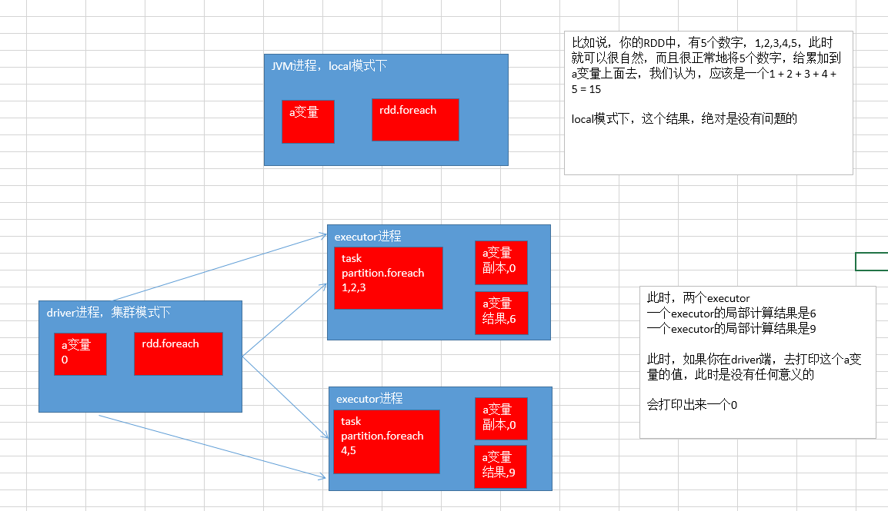

# 第167讲-Spark核心编程进阶-实验：对闭包变量进行累加操作的无效现象

```java


```

# 第168讲-Spark核心编程进阶-实验：在算子内打印数据的无法看到现象


```java


```

# 第169讲-Spark核心编程进阶-mapPartitions以及学生成绩查询案例

```java
package cn.spark.study.core;

import java.util.ArrayList;
import java.util.Arrays;
import java.util.HashMap;
import java.util.Iterator;
import java.util.List;
import java.util.Map;

import org.apache.spark.SparkConf;
import org.apache.spark.api.java.JavaRDD;
import org.apache.spark.api.java.JavaSparkContext;
import org.apache.spark.api.java.function.FlatMapFunction;

public class MapPartitions {
	
	public static void main(String[] args) {
		SparkConf conf = new SparkConf()
				.setAppName("MapPartitions")
				.setMaster("local");  
		JavaSparkContext sc = new JavaSparkContext(conf);
	
		// 准备一下模拟数据
		List<String> studentNames = Arrays.asList("张三", "李四", "王二", "麻子");  
		JavaRDD<String> studentNamesRDD = sc.parallelize(studentNames, 2);
		
		final Map<String, Double> studentScoreMap = new HashMap<String, Double>();
		studentScoreMap.put("张三", 278.5);  
		studentScoreMap.put("李四", 290.0);  
		studentScoreMap.put("王二", 301.0);  
		studentScoreMap.put("麻子", 205.0);  
		
		// mapPartitions
		// 类似map，不同之处在于，map算子，一次就处理一个partition中的一条数据
		// mapPartitions算子，一次处理一个partition中所有的数据
		
		// 推荐的使用场景
		// 如果你的RDD的数据量不是特别大，那么建议采用mapPartitions算子替代map算子，可以加快处理速度
		// 但是如果你的RDD的数据量特别大，比如说10亿，不建议用mapPartitions，可能会内存溢出
		
		JavaRDD<Double> studentScoresRDD = studentNamesRDD.mapPartitions(
				
				new FlatMapFunction<Iterator<String>, Double>() {

					private static final long serialVersionUID = 1L;
		
					@Override
					public Iterable<Double> call(Iterator<String> iterator)
							throws Exception {
						// 因为算子一次处理一个partition的所有数据
						// call函数接收的参数，是iterator类型，代表了partition中所有数据的迭代器
						// 返回的是一个iterable类型，代表了返回多条记录，通常使用List类型
						
						List<Double> studentScoreList = new ArrayList<Double>();
						
						while(iterator.hasNext()) {
							String studentName = iterator.next();
							Double studentScore = studentScoreMap.get(studentName);
							studentScoreList.add(studentScore);
						}
						
						return studentScoreList;
					}
					
				});
		
		for(Double studentScore: studentScoresRDD.collect()) {
			System.out.println(studentScore);  
		}
		
		sc.close();
	}
	
}


```

# 第170讲-Spark核心编程进阶-mapPartitionsWithIndex以开学分班案例

```java
package cn.spark.study.core;

import java.util.ArrayList;
import java.util.Arrays;
import java.util.Iterator;
import java.util.List;

import org.apache.spark.SparkConf;
import org.apache.spark.api.java.JavaRDD;
import org.apache.spark.api.java.JavaSparkContext;
import org.apache.spark.api.java.function.Function2;

public class MapPartitionsWithIndex {

	public static void main(String[] args) {
		SparkConf conf = new SparkConf()
				.setAppName("MapPartitionsWithIndex")
				.setMaster("local");  
		JavaSparkContext sc = new JavaSparkContext(conf);
	
		List<String> studentNames = Arrays.asList("张三", "李四", "王二", "麻子");  
		JavaRDD<String> studentNamesRDD = sc.parallelize(studentNames, 2);
		
		// 这里，parallelize并行集合的时候，指定了numPartitions是2
		// 也就是说，四个同学，会被分成2个班
		// 但是spark自己判定怎么分班
		
		// 如果你要分班的话，就必须拿到班级号
		// mapPartitionsWithIndex这个算子来做，这个算子可以拿到每个partition的index
		// 也就可以作为我们的班级号
		
		JavaRDD<String> studentWithClassRDD = studentNamesRDD.mapPartitionsWithIndex(
				
				new Function2<Integer, Iterator<String>, Iterator<String>>() {

					private static final long serialVersionUID = 1L;

					@Override
					public Iterator<String> call(Integer index, Iterator<String> iterator)
							throws Exception {
						List<String> studentWithClassList = new ArrayList<String>();
						
						while(iterator.hasNext()) {
							String studentName = iterator.next();
							String studentWithClass = studentName + "_" + (index + 1);
							studentWithClassList.add(studentWithClass);
						}
						
						return studentWithClassList.iterator();
					}
					
				}, true);
		
		for(String studentWithClass : studentWithClassRDD.collect()) {
			System.out.println(studentWithClass);  
		}
		
		sc.close();
	}
	
}


```

# 第171讲-Spark核心编程进阶-sample以及公司年会抽奖案例

```java
package cn.spark.study.core.upgrade;

import java.util.Arrays;
import java.util.List;

import org.apache.spark.SparkConf;
import org.apache.spark.api.java.JavaRDD;
import org.apache.spark.api.java.JavaSparkContext;

public class Sample {

	public static void main(String[] args) {
		SparkConf conf = new SparkConf()
				.setAppName("Sample")
				.setMaster("local");
		JavaSparkContext sc = new JavaSparkContext(conf);
	
		List<String> staffList = Arrays.asList("张三", "李四", "王二", "麻子",
				"赵六", "王五", "李大个", "王大妞", "小明", "小倩");  
		JavaRDD<String> staffRDD = sc.parallelize(staffList);
		
		// sample算子
		// 可以使用指定的比例，比如说0.1或者0.9，从RDD中随机抽取10%或者90%的数据
		// 从RDD中随机抽取数据的功能
		// 推荐不要设置第三个参数，feed
		
		JavaRDD<String> luckyStaffRDD = staffRDD.sample(false, 0.1);
		
		for(String staff : luckyStaffRDD.collect()) {
			System.out.println(staff);  
		}
		
		sc.close();
	}
	
}


```

# 第172讲-Spark核心编程进阶-union以及公司部门合并案例

```java
package cn.spark.study.core.upgrade;

import java.util.Arrays;
import java.util.List;

import org.apache.spark.SparkConf;
import org.apache.spark.api.java.JavaRDD;
import org.apache.spark.api.java.JavaSparkContext;

public class Union {
	
	public static void main(String[] args) {
		SparkConf conf = new SparkConf()
				.setAppName("Union") 
				.setMaster("local");  
		JavaSparkContext sc = new JavaSparkContext(conf);
	
		// union算子
		// 将两个RDD的数据，合并为一个RDD
		
		List<String> department1StaffList = Arrays.asList("张三", "李四", "王二", "麻子");  
		JavaRDD<String> department1StaffRDD = sc.parallelize(department1StaffList);
		
		List<String> department2StaffList = Arrays.asList("赵六", "王五", "小明", "小倩");  
		JavaRDD<String> department2StaffRDD = sc.parallelize(department2StaffList);
		
		JavaRDD<String> departmentStaffRDD = department1StaffRDD.union(department2StaffRDD);
		
		for(String staff : departmentStaffRDD.collect()) {
			System.out.println(staff);  
		}
		
		sc.close();
	}
	
}
```

# 第173讲-Spark核心编程进阶-intersection以及公司跨多项目人员查询案例

```java
package cn.spark.study.core.upgrade;

import java.util.Arrays;
import java.util.List;

import org.apache.spark.SparkConf;
import org.apache.spark.api.java.JavaRDD;
import org.apache.spark.api.java.JavaSparkContext;

public class Intersection {
	
	public static void main(String[] args) {
		SparkConf conf = new SparkConf()
				.setAppName("Intersection")
				.setMaster("local");  
		JavaSparkContext sc = new JavaSparkContext(conf);
		
		// intersection算子
		// 获取两个rdd中，相同的数据
		
		// 有的公司内，有些人可能同时在做不同的项目，属于不同的项目组
		// 所以要针对代表两个项目组同事的rdd，取出其交集
		
		List<String> project1MemberList = Arrays.asList("张三", "李四", "王二", "麻子");  
		JavaRDD<String> project1MemberRDD = sc.parallelize(project1MemberList);
		
		List<String> project2MemberList = Arrays.asList("张三", "王五", "小明", "小倩");  
		JavaRDD<String> project2MemberRDD = sc.parallelize(project2MemberList);
		
		JavaRDD<String> projectIntersectionRDD = project1MemberRDD.intersection(project2MemberRDD);

		for(String member : projectIntersectionRDD.collect()) {
			System.out.println(member);  
		}
		
		sc.close();
	}
	
}


```

# 第174讲-Spark核心编程进阶-distinct以及网站uv统计案例


```java
package cn.spark.study.core.upgrade;

import java.util.Arrays;
import java.util.List;

import org.apache.spark.SparkConf;
import org.apache.spark.api.java.JavaRDD;
import org.apache.spark.api.java.JavaSparkContext;
import org.apache.spark.api.java.function.Function;

public class Distinct {

	public static void main(String[] args) {
		SparkConf conf = new SparkConf()
				.setAppName("Distinct")
				.setMaster("local");
		JavaSparkContext sc = new JavaSparkContext(conf);
		
		// distinct算子
		// 对rdd中的数据进行去重
		
		// uv统计案例
		// uv：user view，每天每个用户可能对网站会点击多次
		// 此时，需要对用户进行去重，然后统计出每天有多少个用户访问了网站
		// 而不是所有用户访问了网站多少次（pv）
		
		List<String> accessLogs = Arrays.asList(
				"user1 2016-01-01 23:58:42", 
				"user1 2016-01-01 23:58:43", 
				"user1 2016-01-01 23:58:44", 
				"user2 2016-01-01 12:58:42",
				"user2 2016-01-01 12:58:46", 
				"user3 2016-01-01 12:58:42", 
				"user4 2016-01-01 12:58:42", 
				"user5 2016-01-01 12:58:42", 
				"user6 2016-01-01 12:58:42", 
				"user6 2016-01-01 12:58:45");  
		JavaRDD<String> accessLogsRDD = sc.parallelize(accessLogs);
		
		JavaRDD<String> useridsRDD = accessLogsRDD.map(new Function<String, String>() {

			private static final long serialVersionUID = 1L;

			@Override
			public String call(String accessLog) throws Exception {
				String userid = accessLog.split(" ")[0];
				return userid;
			}
			
		});
		
		JavaRDD<String> distinctUseridsRDD = useridsRDD.distinct();
		int uv = distinctUseridsRDD.collect().size();
		System.out.println("uv: " + uv);  
		
		sc.close();
	}
	
}


```

# 第175讲-Spark核心编程进阶-aggregateByKey以及单词计数案例

```java
package cn.spark.study.core.upgrade;

import java.util.Arrays;
import java.util.List;

import org.apache.spark.SparkConf;
import org.apache.spark.api.java.JavaPairRDD;
import org.apache.spark.api.java.JavaRDD;
import org.apache.spark.api.java.JavaSparkContext;
import org.apache.spark.api.java.function.FlatMapFunction;
import org.apache.spark.api.java.function.Function2;
import org.apache.spark.api.java.function.PairFunction;

import scala.Tuple2;

public class AggregateByKey {
	
	public static void main(String[] args) {
		SparkConf conf = new SparkConf()
				.setAppName("AggregateByKey")
				.setMaster("local");       
		JavaSparkContext sc = new JavaSparkContext(conf);
		
		JavaRDD<String> lines = sc.textFile(
				"C://Users//Administrator//Desktop//hello.txt",
				3); 
		
		JavaRDD<String> words = lines.flatMap(new FlatMapFunction<String, String>() {
			
			private static final long serialVersionUID = 1L;
			
			@Override
			public Iterable<String> call(String line) throws Exception {
				return Arrays.asList(line.split(" "));  
			}
			
		});
		
		JavaPairRDD<String, Integer> pairs = words.mapToPair(
				
				new PairFunction<String, String, Integer>() {

					private static final long serialVersionUID = 1L;
					
					@Override
					public Tuple2<String, Integer> call(String word) throws Exception {
						return new Tuple2<String, Integer>(word, 1);
					}
					
				});
		
		// aggregateByKey，分为三个参数
		// reduceByKey认为是aggregateByKey的简化版
		// aggregateByKey最重要的一点是，多提供了一个函数，Seq Function
		// 就是说自己可以控制如何对每个partition中的数据进行先聚合，类似于mapreduce中的，map-side combine
		// 然后才是对所有partition中的数据进行全局聚合
		
		// 第一个参数是，每个key的初始值
		// 第二个是个函数，Seq Function，如何进行shuffle map-side的本地聚合
		// 第三个是个函数，Combiner Function，如何进行shuffle reduce-side的全局聚合
		
		JavaPairRDD<String, Integer> wordCounts = pairs.aggregateByKey(
				0, 
				
				new Function2<Integer, Integer, Integer>() {

					private static final long serialVersionUID = 1L;

					@Override
					public Integer call(Integer v1, Integer v2)
							throws Exception {
						return v1 + v2;
					}
					
				}, 
				
				new Function2<Integer, Integer, Integer>() {

					private static final long serialVersionUID = 1L;

					@Override
					public Integer call(Integer v1, Integer v2)
							throws Exception {
						return v1 + v2;
					}
					
				});
		
		List<Tuple2<String, Integer>> wordCountList = wordCounts.collect();
		for(Tuple2<String, Integer> wordCount : wordCountList) {
			System.out.println(wordCount);  
		}
		
		sc.close();
	}
	
}


```

# 第176讲-Spark核心编程进阶-cartesian以及服装搭配案例

```java
package cn.spark.study.core.upgrade;

import java.util.Arrays;
import java.util.List;

import org.apache.spark.SparkConf;
import org.apache.spark.api.java.JavaPairRDD;
import org.apache.spark.api.java.JavaRDD;
import org.apache.spark.api.java.JavaSparkContext;

import scala.Tuple2;

public class Cartesian {
	
	public static void main(String[] args) {
		SparkConf conf = new SparkConf()
				.setAppName("Cartesian")
				.setMaster("local");  
		JavaSparkContext sc = new JavaSparkContext(conf);
		
		// cartesian，中文名，笛卡尔乘积
		// 比如说两个RDD，分别有10条数据，用了cartesian算子以后
		// 两个RDD的每一条数据都会和另外一个RDD的每一条数据执行一次join
		// 最终组成了一个笛卡尔乘积
		
		// 小案例
		// 比如说，现在5件衣服，5条裤子，分别属于两个RDD
		// 就是说，需要对每件衣服都和每天裤子做一次join，尝试进行服装搭配
		
		List<String> clothes = Arrays.asList("夹克", "T恤", "皮衣", "风衣");  
		JavaRDD<String> clothesRDD = sc.parallelize(clothes);
		
		List<String> trousers = Arrays.asList("皮裤", "运动裤", "牛仔裤", "休闲裤");  
		JavaRDD<String> trousersRDD = sc.parallelize(trousers);
		
		JavaPairRDD<String, String> pairsRDD = clothesRDD.cartesian(trousersRDD);

		for(Tuple2<String, String> pair : pairsRDD.collect()) {
			System.out.println(pair);  
		}
		
		sc.close();
	}
	
}


```

# 第177讲-Spark核心编程进阶-coalesce以及公司部门整合案例

```java
package cn.spark.study.core.upgrade;

import java.util.ArrayList;
import java.util.Arrays;
import java.util.Iterator;
import java.util.List;

import org.apache.spark.SparkConf;
import org.apache.spark.api.java.JavaRDD;
import org.apache.spark.api.java.JavaSparkContext;
import org.apache.spark.api.java.function.Function2;

public class Coalesce {

	public static void main(String[] args) {
		SparkConf conf = new SparkConf()
				.setAppName("Coalesce")
				.setMaster("local");
		JavaSparkContext sc = new JavaSparkContext(conf);
	
		// coalesce算子，功能是将RDD的partition缩减，减少
		// 将一定量的数据，压缩到更少的partition中去
		
		// 建议的使用场景，配合filter算子使用
		// 使用filter算子过滤掉很多数据以后，比如30%的数据，出现了很多partition中的数据不均匀的情况
		// 此时建议使用coalesce算子，压缩rdd的partition数量
		// 从而让各个partition中的数据都更加的紧凑
		
		// 公司原先有6个部门
		// 但是呢，不巧，碰到了公司裁员，裁员以后呢，有的部门中的人员就没了
		// 不同的部分人员不均匀
		// 此时呢，做一个部门整合的操作，将不同的部门的员工进行压缩
		
		List<String> staffList = Arrays.asList("张三", "李四", "王二", "麻子",
				"赵六", "王五", "李大个", "王大妞", "小明", "小倩");  
		JavaRDD<String> staffRDD = sc.parallelize(staffList, 6); 
		
		JavaRDD<String> staffRDD2 = staffRDD.mapPartitionsWithIndex(
				
				new Function2<Integer, Iterator<String>, Iterator<String>>() {

					private static final long serialVersionUID = 1L;
		
					@Override
					public Iterator<String> call(Integer index, Iterator<String> iterator)
							throws Exception {
						List<String> list = new ArrayList<String>();
						
						while(iterator.hasNext()) {
							String staff = iterator.next();
							list.add("部门[" + (index + 1) + "], " + staff);
						}
						
						return list.iterator();
					}
					
				}, true);
		
		for(String staffInfo : staffRDD2.collect()) {
			System.out.println(staffInfo);  
		}
		
		JavaRDD<String> staffRDD3 = staffRDD2.coalesce(3);
		
		JavaRDD<String> staffRDD4 = staffRDD3.mapPartitionsWithIndex(
				
				new Function2<Integer, Iterator<String>, Iterator<String>>() {

					private static final long serialVersionUID = 1L;
		
					@Override
					public Iterator<String> call(Integer index, Iterator<String> iterator)
							throws Exception {
						List<String> list = new ArrayList<String>();
						
						while(iterator.hasNext()) {
							String staff = iterator.next();
							list.add("部门[" + (index + 1) + "], " + staff);
						}
						
						return list.iterator();
					}
					
				}, true);
		
		for(String staffInfo : staffRDD4.collect()) {
			System.out.println(staffInfo);  
		}
		
		sc.close();
	}
	
}


```

# 第178讲-Spark核心编程进阶-repartition以及公司新增部门案例

```java

package cn.spark.study.core.upgrade;

import java.util.ArrayList;
import java.util.Arrays;
import java.util.Iterator;
import java.util.List;

import org.apache.spark.SparkConf;
import org.apache.spark.api.java.JavaRDD;
import org.apache.spark.api.java.JavaSparkContext;
import org.apache.spark.api.java.function.Function2;

public class Repartition {

	public static void main(String[] args) {
		SparkConf conf = new SparkConf()
				.setAppName("Repartition")
				.setMaster("local");
		JavaSparkContext sc = new JavaSparkContext(conf);
	
		// repartition算子，用于任意将rdd的partition增多，或者减少
		// 与coalesce不同之处在于，coalesce仅仅能将rdd的partition变少
		// 但是repartition可以将rdd的partiton变多
		
		// 建议使用的场景
		// 一个很经典的场景，使用Spark SQL从hive中查询数据时
		// Spark SQL会根据hive对应的hdfs文件的block数量还决定加载出来的数据rdd有多少个partition
		// 这里的partition数量，是我们根本无法设置的
		
		// 有些时候，可能它自动设置的partition数量过于少了，导致我们后面的算子的运行特别慢
		// 此时就可以在Spark SQL加载hive数据到rdd中以后
		// 立即使用repartition算子，将rdd的partition数量变多
		
		// 案例
		// 公司要增加新部门
		// 但是人员还是这么多，所以我们只能使用repartition操作，增加部门
		// 将人员平均分配到更多的部门中去
		
		List<String> staffList = Arrays.asList("张三", "李四", "王二", "麻子",
				"赵六", "王五", "李大个", "王大妞", "小明", "小倩");  
		JavaRDD<String> staffRDD = sc.parallelize(staffList, 3); 
		
		JavaRDD<String> staffRDD2 = staffRDD.mapPartitionsWithIndex(
				
				new Function2<Integer, Iterator<String>, Iterator<String>>() {

					private static final long serialVersionUID = 1L;
		
					@Override
					public Iterator<String> call(Integer index, Iterator<String> iterator)
							throws Exception {
						List<String> list = new ArrayList<String>();
						
						while(iterator.hasNext()) {
							String staff = iterator.next();
							list.add("部门[" + (index + 1) + "], " + staff);
						}
						
						return list.iterator();
					}
					
				}, true);
		
		for(String staffInfo : staffRDD2.collect()) {
			System.out.println(staffInfo);  
		}
		
		JavaRDD<String> staffRDD3 = staffRDD2.repartition(6);
		
		JavaRDD<String> staffRDD4 = staffRDD3.mapPartitionsWithIndex(
				
				new Function2<Integer, Iterator<String>, Iterator<String>>() {

					private static final long serialVersionUID = 1L;
		
					@Override
					public Iterator<String> call(Integer index, Iterator<String> iterator)
							throws Exception {
						List<String> list = new ArrayList<String>();
						
						while(iterator.hasNext()) {
							String staff = iterator.next();
							list.add("部门[" + (index + 1) + "], " + staff);
						}
						
						return list.iterator();
					}
					
				}, true);
		
		for(String staffInfo : staffRDD4.collect()) {
			System.out.println(staffInfo);  
		}
		
		sc.close();
	}
	
}

```

# 第179讲-Spark核心编程进阶-takeSampled以及公司年会抽奖案例

```java

package cn.spark.study.core.upgrade;

import java.util.Arrays;
import java.util.List;

import org.apache.spark.SparkConf;
import org.apache.spark.api.java.JavaRDD;
import org.apache.spark.api.java.JavaSparkContext;

public class TakeSampled {

	public static void main(String[] args) {
		SparkConf conf = new SparkConf()
				.setAppName("Sample")
				.setMaster("local");
		JavaSparkContext sc = new JavaSparkContext(conf);
	
		List<String> staffList = Arrays.asList("张三", "李四", "王二", "麻子",
				"赵六", "王五", "李大个", "王大妞", "小明", "小倩");  
		JavaRDD<String> staffRDD = sc.parallelize(staffList);
		
		// takeSample算子
		// 与sample不同之处，两点
		// 1、action操作，sample是transformation操作
		// 2、不能指定抽取比例，只能是抽取几个
		
		List<String> luckyStaffList = staffRDD.takeSample(false, 3);
		
		for(String luckyStaff : luckyStaffList) {
			System.out.println(luckyStaff);  
		}
		
		sc.close();
	}
	
}

```

# 第180讲-Spark核心编程进阶-shuffle操作原理详解

shuffle操作，是spark中一些特殊的算子操作会触发的一种操作
shuffle操作，会导致大量的数据在不同的机器和节点之间进行传输，因此也是spark中最复杂、最消耗性能的一种操作

我们可以通过reduceByKey操作作为一个例子，来理解shuffle操作

reduceByKey算子会将上一个RDD中的每个key对应的所有value都聚合成一个value，然后生成一个新的RDD
新的RDD的元素类型就是<key,value>对的格式，每个key对应一个聚合起来的value
这里最大的问题就在于，对于上一个RDD来说，并不是一个key对应的所有value都是在一个partition中的，也更不太可能说key的所有value都在一台机器上
所以对于这种情况来说，就必须在整个集群中，将各个节点上，同一个key对应的values，统一传输到一个节点上来聚合处理
这个过程中就会发生大量的网络数据的传输

在进行一个key对应的values的聚合时
首先，上一个stage的每个map task就必须保证将自己处理的当前分区中的数据，相同的key写入一个分区文件中，可能会写多个不同的分区文件
接着下一个stage的reduce task就必须从上一个stage所有task所在的机器上，将各个task写入的多个分区文件中，找到属于自己的那个分区文件
接着将属于自己的分区数据，拉取过来，这样就可以保证每个key对应的所有values都汇聚到一个节点上去处理和聚合
这个过程就称之为shuffle

shuffle是分为shuffle write和shuffle read两个部分的
是在两个不同的stage中进行的


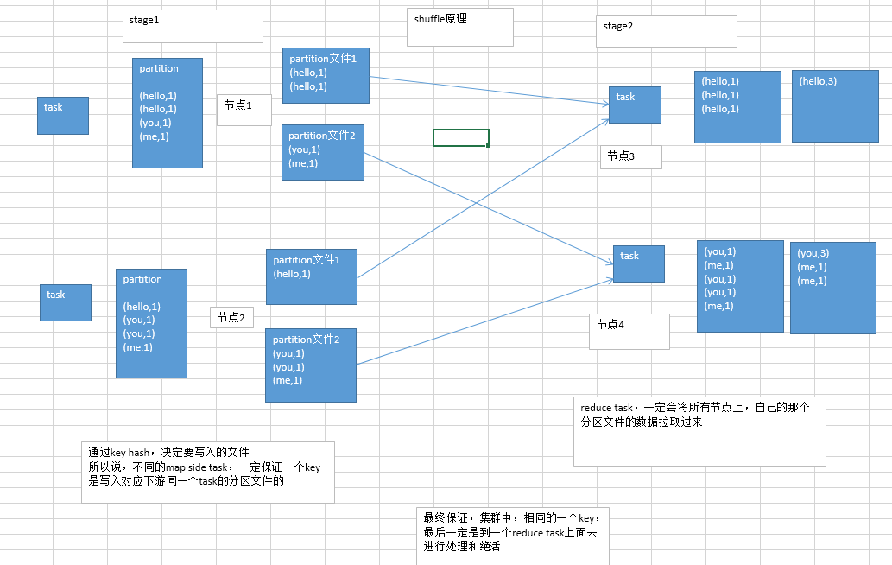

# 第181讲-Spark核心编程进阶-shuffle操作过程中进行数据排序

默认情况下，shuffle操作是不会对每个分区中的数据进行排序的

如果想要对每个分区中的数据进行排序，那么可以使用以下三种方法：
1、使用mapPartitions算子处理每个partition，对每个partition中的数据进行排序
2、使用repartitionAndSortWithinPartitions，对RDD进行重分区，在重分区的过程中同时就进行分区内数据的排序
3、使用sortByKey对数据进行全局排序

上述三种方法中，相对来说，mapPartitions的代价比较小，因为不需要进行额外的shuffle操作
repartitionAndSortWithinPartitions和sortByKey可能会进行额外的shuffle操作的，因此性能并不是很高

val rdd2 = rdd1.reduceByKey(_ + _)
rdd2.mapPartitions(tuples.sort)
rdd2.repartitionAndSortWithinPartitions()，重分区，重分区的过程中，就进行分区内的key的排序，重分区的原理和repartition一样
rdd2.sortByKey，直接对rdd按照key进行全局性的排序


# 第182讲-Spark核心编程进阶-会触发shuffle操作的算子

spark中会导致shuffle操作的有以下几种算子

1、repartition类的操作：比如repartition、repartitionAndSortWithinPartitions、coalesce等
2、byKey类的操作：比如reduceByKey、groupByKey、sortByKey等
3、join类的操作：比如join、cogroup等

重分区: 一般会shuffle，因为需要在整个集群中，对之前所有的分区的数据进行随机，均匀的打乱，然后把数据放入下游新的指定数量的分区内
byKey类的操作：因为你要对一个key，进行聚合操作，那么肯定要保证集群中，所有节点上的，相同的key，一定是到同一个节点上进行处理
join类的操作：两个rdd进行join，就必须将相同join key的数据，shuffle到同一个节点上，然后进行相同key的两个rdd数据的笛卡尔乘积

提醒一下

所以对于上述的操作
首先第一原则，就是，能不用shuffle操作，就尽量不用shuffle操作，尽量使用不shuffle的操作
第二原则，就是，如果使用了shuffle操作，那么肯定要进行shuffle的调优，甚至是解决碰到的数据倾斜的问题


# 第183讲-Spark核心编程进阶-shuffle操作对性能消耗的原理详解

shuffle操作是spark中唯一最最消耗性能的地方
因此也就成了最需要进行性能调优的地方，最需要解决线上报错的地方，也是唯一可能出现数据倾斜的地方
因为shuffle过程中，会产生大量的磁盘IO、数据序列化和反序列化、网络IO

为了实施shuffle操作
spark中才有了stage的概念，在发生shuffle操作的算子中，进行stage的拆分
shuffle操作的前半部分，是上一个stage来进行，也称之为map task，shuffle操作的后半部分，是下一个stage来进行，也称之为reduce task
其中map task负责数据的组织，也就是将同一个key对应的value都写入同一个下游task对应的分区文件中
其中reduce task负责数据的聚合，也就是将上一个stage的task所在节点上，将属于自己的各个分区文件，都拉取过来聚合
这种模型，是参考和模拟了MapReduce的shuffle过程来的

map task会将数据先保存在内存中，如果内存不够时，就溢写到磁盘文件中去
reduce task会读取各个节点上属于自己的分区磁盘文件，到自己节点的内存中，并进行聚合

shuffle操作会消耗大量的内存，因为无论是网络传输数据之前，还是之后，都会使用大量的内存中数据结构来实施聚合操作
比如reduceByKey和aggregateByKey操作，会在map side使用内存中的数据结构进行预先聚合
其他的byKey类的操作，都是在reduce side，使用内存数据结构进行聚合
在聚合过程中，如果内存不够，只能溢写到磁盘文件中去，此时就会发生大量的磁盘IO，降低性能

此外，shuffle过程中，还会产生大量的中间文件，也就是map side写入的大量分区文件
比如Spark 1.3版本，这些中间文件会一致保留着，直到RDD不再被使用，而且被垃圾回收掉了，才会去清理中间文件
这主要是为了，如果要重新计算shuffle后的RDD，那么map side不需要重新做一次磁盘写操作
但是这种情况下，如果我们的应用程序中，一直保持着对RDD的引用，导致很长时间以后才会进行RDD垃圾回收操作
保存中间文件的目录，由spark.local.dir属性指定

内存的消耗、磁盘IO、网络数据传输（IO）


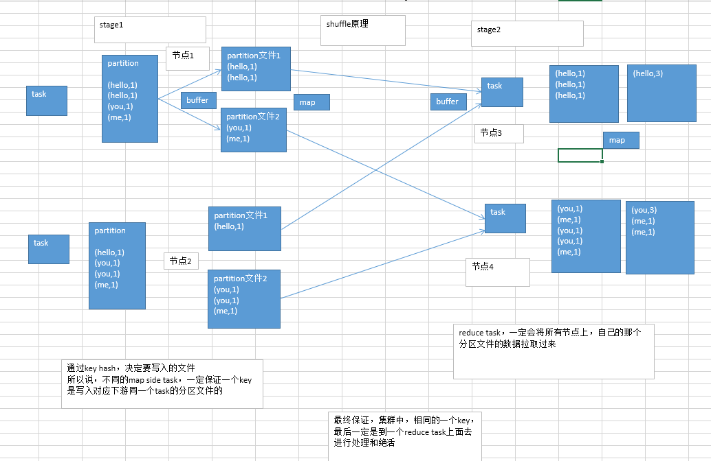

# 第184讲-Spark核心编程进阶-shuffle操作所有相关参数详解以及性能调优

我们可以通过对一系列的参数进行调优，来优化shuffle的性能

spark 1.5.2版本

属性名称										默认值			属性说明
spark.reducer.maxSizeInFlight					48m				reduce task的buffer缓冲，代表了每个reduce task每次能够拉取的map side数据最大大小，如果内存充足，可以考虑加大大小，从而减少网络传输次数，提升性能
spark.shuffle.blockTransferService				netty			shuffle过程中，传输数据的方式，两种选项，netty或nio，spark 1.2开始，默认就是netty，比较简单而且性能较高，spark 1.5开始nio就是过期的了，而且spark 1.6中会去除掉
spark.shuffle.compress							true			是否对map side输出的文件进行压缩，默认是启用压缩的，压缩器是由spark.io.compression.codec属性指定的，默认是snappy压缩器，该压缩器强调的是压缩速度，而不是压缩率
spark.shuffle.consolidateFiles					false			默认为false，如果设置为true，那么就会合并map side输出文件，对于reduce task数量特别的情况下，可以极大减少磁盘IO开销，提升性能
spark.shuffle.file.buffer						32k				map side task的内存buffer大小，写数据到磁盘文件之前，会先保存在缓冲中，如果内存充足，可以适当加大大小，从而减少map side磁盘IO次数，提升性能
spark.shuffle.io.maxRetries						3				网络传输数据过程中，如果出现了网络IO异常，重试拉取数据的次数，默认是3次，对于耗时的shuffle操作，建议加大次数，以避免full gc或者网络不通常导致的数据拉取失败，进而导致task lost，增加shuffle操作的稳定性
spark.shuffle.io.retryWait						5s				每次重试拉取数据的等待间隔，默认是5s，建议加大时长，理由同上，保证shuffle操作的稳定性
spark.shuffle.io.numConnectionsPerPeer			1				机器之间的可以重用的网络连接，主要用于在大型集群中减小网络连接的建立开销，如果一个集群的机器并不多，可以考虑增加这个值
spark.shuffle.io.preferDirectBufs				true			启用堆外内存，可以避免shuffle过程的频繁gc，如果堆外内存非常紧张，则可以考虑关闭这个选项
spark.shuffle.manager							sort			ShuffleManager，Spark 1.5以后，有三种可选的，hash、sort和tungsten-sort，sort-based ShuffleManager会更高效实用内存，并且避免产生大量的map side磁盘文件，从Spark 1.2开始就是默认的选项，tungsten-sort与sort类似，但是内存性能更高
spark.shuffle.memoryFraction					0.2				如果spark.shuffle.spill属性为true，那么该选项生效，代表了executor内存中，用于进行shuffle reduce side聚合的内存比例，默认是20%，如果内存充足，建议调高这个比例，给reduce聚合更多内存，避免内存不足频繁读写磁盘
spark.shuffle.service.enabled					false			启用外部shuffle服务，这个服务会安全地保存shuffle过程中，executor写的磁盘文件，因此executor即使挂掉也不要紧，必须配合spark.dynamicAllocation.enabled属性设置为true，才能生效，而且外部shuffle服务必须进行安装和启动，才能启用这个属性
spark.shuffle.service.port						7337			外部shuffle服务的端口号，具体解释同上
spark.shuffle.sort.bypassMergeThreshold			200				对于sort-based ShuffleManager，如果没有进行map side聚合，而且reduce task数量少于这个值，那么就不会进行排序，如果你使用sort ShuffleManager，而且不需要排序，那么可以考虑将这个值加大，直到比你指定的所有task数量都打，以避免进行额外的sort，从而提升性能
spark.shuffle.spill								true			当reduce side的聚合内存使用量超过了spark.shuffle.memoryFraction指定的比例时，就进行磁盘的溢写操作
spark.shuffle.spill.compress					true			同上，进行磁盘溢写时，是否进行文件压缩，使用spark.io.compression.codec属性指定的压缩器，默认是snappy，速度优先


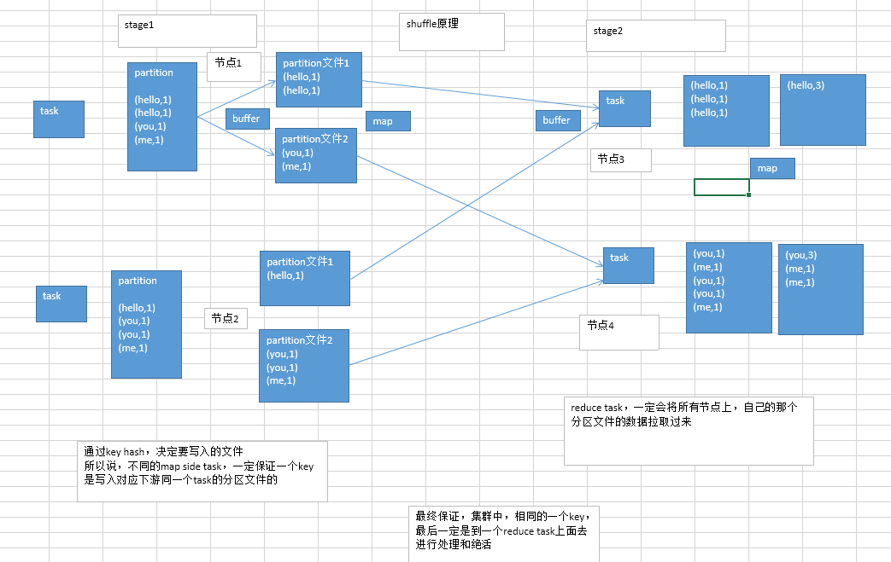

# 第185讲-Spark核心编程进阶-综合案例1：移动端app访问流量日志分析

如果你是在一个互联网公司，然后你的公司现在也在做移动互联网，做了一个手机app
那么你的手机app的用户，每次进行点击，或者是一些搜索操作的时候，都会跟你的远程的后端服务器做一次交互
也就是说，你的手机app，首先会往后端服务器发送一个请求，然后你的后端服务器会给你的手机app返回一个响应，响应的内容可能是图片、或者文字、或者json
此时，就完成了一次你的移动端app和后端服务器之间的交互过程

通常来说，在你的移动端app访问你的后端服务器的时候，你的后端服务器会记录一条日志
这个日志，也就是你的移动端app访问流量的相关日志，但是也可以根据你自己的需要，移动端发送一条日志过来，服务器端的web系统保存日志
我们这里做的就是最基本的，记录你的移动端app和服务器之间的上行数据包和下行数据包，上行流量和下行流量

我们要来计算，就是说，你的每个移动端，唯一的一个标识是你的deviceID
然后呢，每条日志，都会有这一次请求和响应的上行流量和下行流量的记录，这里呢，上行流量指的是手机app向服务器发送的请求数据的流量
下行流量，认为是服务器端给手机app返回的数据（比如说图片、文字、json）的流量

每个设备（deviceID），总上行流量和总下行流量，计算之后，要根据上行流量和下行流量进行排序，需要进行倒序排序
获取流量最大的前10个设备

难点：根据上行流量和下行流量进行排序的时候，不是简单的排序，优先根据上行流量进行排序，如果上行流量相等，那么根据下行流量排序

二次排序


# 第186讲-Spark核心编程进阶-综合案例1：日志文件格式分析

# 第187讲-Spark核心编程进阶-综合案例1：读取日志文件并创建RDD

```java
package cn.spark.study.core.upgrade.applog;

import org.apache.spark.SparkConf;
import org.apache.spark.api.java.JavaRDD;
import org.apache.spark.api.java.JavaSparkContext;

/**
 * 移动端app访问流量日志分析案例
 * @author Administrator
 *
 */
public class AppLogSpark {

	public static void main(String[] args) throws Exception {
		// 创建Spark配置和上下文对象
		SparkConf conf = new SparkConf()
				.setAppName("AppLogSpark")  
				.setMaster("local"); 
		JavaSparkContext sc = new JavaSparkContext(conf);
		
		// 读取日志文件，并创建一个RDD
		// 使用SparkContext的textFile()方法，即可读取本地磁盘文件，或者是HDFS上的文件
		// 创建出来一个初始的RDD，其中包含了日志文件中的所有数据
		JavaRDD<String> accessLogRDD = sc.textFile(
				"C://Users//Administrator//Desktop//access.log");   
		
		// 关闭Spark上下文
		sc.close();
	}
	
}

```


```java
package cn.spark.study.core.upgrade.applog;

import java.io.FileOutputStream;
import java.io.OutputStreamWriter;
import java.io.PrintWriter;
import java.util.ArrayList;
import java.util.Calendar;
import java.util.Date;
import java.util.List;
import java.util.Random;
import java.util.UUID;

public class DataGenerator {
	
	public static void main(String[] args) throws Exception {
		Random random = new Random();
		
		// 生成100个deviceID
		List<String> deviceIDs = new ArrayList<String>();
		for(int i = 0; i < 100; i++) {
			deviceIDs.add(getRandomUUID());
		}
		
		StringBuffer buffer = new StringBuffer("");  
		
		for(int i = 0; i < 1000; i++) {
			// 生成随机时间戳
			Calendar cal = Calendar.getInstance();
			cal.setTime(new Date());    
			cal.add(Calendar.MINUTE, -random.nextInt(600)); 
			long timestamp = cal.getTime().getTime();
		
			// 生成随机deviceID
			String deviceID = deviceIDs.get(random.nextInt(100));  
			
			// 生成随机的上行流量
			long upTraffic = random.nextInt(100000);
			// 生成随机的下行流量
			long downTraffic = random.nextInt(100000);
			
			buffer.append(timestamp).append("\t")  
					.append(deviceID).append("\t")  
					.append(upTraffic).append("\t")
					.append(downTraffic).append("\n");  
		}
		
		PrintWriter pw = null;  
		try {
			pw = new PrintWriter(new OutputStreamWriter(
					new FileOutputStream("C:\\Users\\Administrator\\Desktop\\access.log")));
			pw.write(buffer.toString());  
		} catch (Exception e) {
			e.printStackTrace();
		} finally {
			pw.close();
		}
	}
	
	private static String getRandomUUID() {
		return UUID.randomUUID().toString().replace("-", "");
	}
	
}


```


# 第188讲-Spark核心编程进阶-综合案例1：创建自定义的可序列化类

```java
package cn.spark.study.core.upgrade.applog;

import java.io.Serializable;

/**
 * 访问日志信息类（可序列化）
 * @author Administrator
 *
 */
public class AccessLogInfo implements Serializable {

	private static final long serialVersionUID = 5749943279909593929L;
	
	private long timestamp;		// 时间戳
	private long upTraffic;		// 上行流量
	private long downTraffic;	// 下行流量
	
	public AccessLogInfo() {}
	
	public AccessLogInfo(long timestamp, long upTraffic, long downTraffic) {
		this.timestamp = timestamp;
		this.upTraffic = upTraffic;
		this.downTraffic = downTraffic;
	}
	
	public long getTimestamp() {
		return timestamp;
	}
	public void setTimestamp(long timestamp) {
		this.timestamp = timestamp;
	}
	public long getUpTraffic() {
		return upTraffic;
	}
	public void setUpTraffic(long upTraffic) {
		this.upTraffic = upTraffic;
	}
	public long getDownTraffic() {
		return downTraffic;
	}
	public void setDownTraffic(long downTraffic) {
		this.downTraffic = downTraffic;
	}
	
}


```

# 第189讲-Spark核心编程进阶-综合案例1：将RDD映射为key-value格式

```java
package cn.spark.study.core.upgrade.applog;

import org.apache.spark.SparkConf;
import org.apache.spark.api.java.JavaPairRDD;
import org.apache.spark.api.java.JavaRDD;
import org.apache.spark.api.java.JavaSparkContext;
import org.apache.spark.api.java.function.PairFunction;

import scala.Tuple2;

/**
 * 移动端app访问流量日志分析案例
 * @author Administrator
 *
 */
public class AppLogSpark {

	public static void main(String[] args) throws Exception {
		// 创建Spark配置和上下文对象
		SparkConf conf = new SparkConf()
				.setAppName("AppLogSpark")  
				.setMaster("local"); 
		JavaSparkContext sc = new JavaSparkContext(conf);
		
		// 读取日志文件，并创建一个RDD
		// 使用SparkContext的textFile()方法，即可读取本地磁盘文件，或者是HDFS上的文件
		// 创建出来一个初始的RDD，其中包含了日志文件中的所有数据
		JavaRDD<String> accessLogRDD = sc.textFile(
				"C://Users//Administrator//Desktop//access.log");   
		
		// 将RDD映射为key-value格式，为后面的reduceByKey聚合做准备
		JavaPairRDD<String, AccessLogInfo> accessLogPairRDD = 
				mapAccessLogRDD2Pair(accessLogRDD);
		
		// 关闭Spark上下文
		sc.close();
	}
	
	/**
	 * 将日志RDD映射为key-value的格式
	 * @param accessLogRDD 日志RDD
	 * @return key-value格式RDD
	 */
	private static JavaPairRDD<String, AccessLogInfo> mapAccessLogRDD2Pair(
			JavaRDD<String> accessLogRDD) {
		return accessLogRDD.mapToPair(new PairFunction<String, String, AccessLogInfo>() {

			private static final long serialVersionUID = 1L;

			@Override
			public Tuple2<String, AccessLogInfo> call(String accessLog)
					throws Exception {
				// 根据\t对日志进行切分
				String[] accessLogSplited = accessLog.split("\t");  
				
				// 获取四个字段
				long timestamp = Long.valueOf(accessLogSplited[0]);
				String deviceID = accessLogSplited[1];
				long upTraffic = Long.valueOf(accessLogSplited[2]);
				long downTraffic = Long.valueOf(accessLogSplited[3]);  
				
				// 将时间戳、上行流量、下行流量，封装为自定义的可序列化对象
				AccessLogInfo accessLogInfo = new AccessLogInfo(timestamp,
						upTraffic, downTraffic);
				
				return new Tuple2<String, AccessLogInfo>(deviceID, accessLogInfo);
			}
			
		});
	}
	
}


```

# 第190讲-Spark核心编程进阶-综合案例1：基于deviceID进行聚合操作

```java

package cn.spark.study.core.upgrade.applog;

import org.apache.spark.SparkConf;
import org.apache.spark.api.java.JavaPairRDD;
import org.apache.spark.api.java.JavaRDD;
import org.apache.spark.api.java.JavaSparkContext;
import org.apache.spark.api.java.function.Function2;
import org.apache.spark.api.java.function.PairFunction;

import scala.Tuple2;

/**
 * 移动端app访问流量日志分析案例
 * @author Administrator
 *
 */
public class AppLogSpark {

	public static void main(String[] args) throws Exception {
		// 创建Spark配置和上下文对象
		SparkConf conf = new SparkConf()
				.setAppName("AppLogSpark")  
				.setMaster("local"); 
		JavaSparkContext sc = new JavaSparkContext(conf);
		
		// 读取日志文件，并创建一个RDD
		// 使用SparkContext的textFile()方法，即可读取本地磁盘文件，或者是HDFS上的文件
		// 创建出来一个初始的RDD，其中包含了日志文件中的所有数据
		JavaRDD<String> accessLogRDD = sc.textFile(
				"C://Users//Administrator//Desktop//access.log");   
		
		// 将RDD映射为key-value格式，为后面的reduceByKey聚合做准备
		JavaPairRDD<String, AccessLogInfo> accessLogPairRDD = 
				mapAccessLogRDD2Pair(accessLogRDD);
		
		// 根据deviceID进行聚合操作
		// 获取每个deviceID的总上行流量、总下行流量、最早访问时间戳
		JavaPairRDD<String, AccessLogInfo> aggrAccessLogPairRDD = 
				aggregateByDeviceID(accessLogPairRDD);
		
		// 关闭Spark上下文
		sc.close();
	}
	
	/**
	 * 将日志RDD映射为key-value的格式
	 * @param accessLogRDD 日志RDD
	 * @return key-value格式RDD
	 */
	private static JavaPairRDD<String, AccessLogInfo> mapAccessLogRDD2Pair(
			JavaRDD<String> accessLogRDD) {
		return accessLogRDD.mapToPair(new PairFunction<String, String, AccessLogInfo>() {

			private static final long serialVersionUID = 1L;

			@Override
			public Tuple2<String, AccessLogInfo> call(String accessLog)
					throws Exception {
				// 根据\t对日志进行切分
				String[] accessLogSplited = accessLog.split("\t");  
				
				// 获取四个字段
				long timestamp = Long.valueOf(accessLogSplited[0]);
				String deviceID = accessLogSplited[1];
				long upTraffic = Long.valueOf(accessLogSplited[2]);
				long downTraffic = Long.valueOf(accessLogSplited[3]);  
				
				// 将时间戳、上行流量、下行流量，封装为自定义的可序列化对象
				AccessLogInfo accessLogInfo = new AccessLogInfo(timestamp,
						upTraffic, downTraffic);
				
				return new Tuple2<String, AccessLogInfo>(deviceID, accessLogInfo);
			}
			
		});
	}
	
	/**
	 * 根据deviceID进行聚合操作
	 * 计算出每个deviceID的总上行流量、总下行流量以及最早访问时间
	 * @param accessLogPairRDD 日志key-value格式RDD
	 * @return 按deviceID聚合RDD
	 */
	private static JavaPairRDD<String, AccessLogInfo> aggregateByDeviceID(
			JavaPairRDD<String, AccessLogInfo> accessLogPairRDD) {
		return accessLogPairRDD.reduceByKey(new Function2<AccessLogInfo, AccessLogInfo, AccessLogInfo>() {
			
			private static final long serialVersionUID = 1L;
			
			@Override
			public AccessLogInfo call(AccessLogInfo accessLogInfo1, AccessLogInfo accessLogInfo2)
					throws Exception {
				long timestamp = accessLogInfo1.getTimestamp() < accessLogInfo2.getTimestamp() ? 
						accessLogInfo1.getTimestamp() : accessLogInfo2.getTimestamp();
				long upTraffic = accessLogInfo1.getUpTraffic() + accessLogInfo2.getUpTraffic();
				long downTraffic = accessLogInfo1.getDownTraffic() + accessLogInfo2.getDownTraffic();
				
				AccessLogInfo accessLogInfo = new AccessLogInfo();
				accessLogInfo.setTimestamp(timestamp);
				accessLogInfo.setUpTraffic(upTraffic); 
				accessLogInfo.setDownTraffic(downTraffic);
				
				return accessLogInfo;
			}
			
		});
	}
	
}

```

# 第191讲-Spark核心编程进阶-综合案例1：自定义二次排序key类

```java
package cn.spark.study.core.upgrade.applog;

import java.io.Serializable;

import scala.math.Ordered;

/**
 * 日志的二次排序key
 * @author Administrator
 *
 */
public class AccessLogSortKey implements Ordered<AccessLogSortKey>, Serializable {

	private static final long serialVersionUID = 3702442700882342403L;
	
	private long upTraffic;
	private long downTraffic;
	private long timestamp;
	
	@Override
	public boolean $greater(AccessLogSortKey other) {
		if(upTraffic > other.upTraffic) {
			return true;
		} else if(upTraffic == other.upTraffic && 
				downTraffic > other.downTraffic) {
			return true;
		} else if(upTraffic == other.upTraffic && 
				downTraffic == other.downTraffic &&
				timestamp > other.timestamp) {
			return true;
		}
		return false;
	}

	@Override
	public boolean $greater$eq(AccessLogSortKey other) {
		if($greater(other)) {
			return true;
		} else if(upTraffic == other.upTraffic && 
				downTraffic == other.downTraffic &&
				timestamp == other.timestamp) {
			return true;
		}
		return false;
	}
	
	@Override
	public boolean $less(AccessLogSortKey other) {
		if(upTraffic < other.upTraffic) {
			return true;
		} else if(upTraffic == other.upTraffic && 
				downTraffic < other.downTraffic) {
			return true;
		} else if(upTraffic == other.upTraffic && 
				downTraffic == other.downTraffic &&
				timestamp < other.timestamp) {
			return true;
		}
		return false;
	}

	@Override
	public boolean $less$eq(AccessLogSortKey other) {
		if($less(other)) {
			return true;
		} else if(upTraffic == other.upTraffic && 
				downTraffic == other.downTraffic &&
				timestamp == other.timestamp) {
			return true;
		}
		return false;
	}
	
	@Override
	public int compare(AccessLogSortKey other) {
		if(upTraffic - other.upTraffic != 0) {
			return (int) (upTraffic - other.upTraffic); 
		} else if(downTraffic - other.downTraffic != 0) {
			return (int) (downTraffic - other.downTraffic);
		} else if(timestamp - other.timestamp != 0) {
			return (int) (timestamp - other.timestamp);
		}
		return 0;
	}
	
	@Override
	public int compareTo(AccessLogSortKey other) {
		if(upTraffic - other.upTraffic != 0) {
			return (int) (upTraffic - other.upTraffic); 
		} else if(downTraffic - other.downTraffic != 0) {
			return (int) (downTraffic - other.downTraffic);
		} else if(timestamp - other.timestamp != 0) {
			return (int) (timestamp - other.timestamp);
		}
		return 0;
	}

	public long getUpTraffic() {
		return upTraffic;
	}

	public void setUpTraffic(long upTraffic) {
		this.upTraffic = upTraffic;
	}

	public long getDownTraffic() {
		return downTraffic;
	}

	public void setDownTraffic(long downTraffic) {
		this.downTraffic = downTraffic;
	}

	public long getTimestamp() {
		return timestamp;
	}

	public void setTimestamp(long timestamp) {
		this.timestamp = timestamp;
	}

	@Override
	public int hashCode() {
		final int prime = 31;
		int result = 1;
		result = prime * result + (int) (downTraffic ^ (downTraffic >>> 32));
		result = prime * result + (int) (timestamp ^ (timestamp >>> 32));
		result = prime * result + (int) (upTraffic ^ (upTraffic >>> 32));
		return result;
	}

	@Override
	public boolean equals(Object obj) {
		if (this == obj)
			return true;
		if (obj == null)
			return false;
		if (getClass() != obj.getClass())
			return false;
		AccessLogSortKey other = (AccessLogSortKey) obj;
		if (downTraffic != other.downTraffic)
			return false;
		if (timestamp != other.timestamp)
			return false;
		if (upTraffic != other.upTraffic)
			return false;
		return true;
	}
	
}


```

# 第192讲-Spark核心编程进阶-综合案例1：将二次排序key映射为RDD的key

```java
package cn.spark.study.core.upgrade.applog;

import org.apache.spark.SparkConf;
import org.apache.spark.api.java.JavaPairRDD;
import org.apache.spark.api.java.JavaRDD;
import org.apache.spark.api.java.JavaSparkContext;
import org.apache.spark.api.java.function.Function2;
import org.apache.spark.api.java.function.PairFunction;

import scala.Tuple2;

/**
 * 移动端app访问流量日志分析案例
 * @author Administrator
 *
 */
public class AppLogSpark {

	public static void main(String[] args) throws Exception {
		// 创建Spark配置和上下文对象
		SparkConf conf = new SparkConf()
				.setAppName("AppLogSpark")  
				.setMaster("local"); 
		JavaSparkContext sc = new JavaSparkContext(conf);
		
		// 读取日志文件，并创建一个RDD
		// 使用SparkContext的textFile()方法，即可读取本地磁盘文件，或者是HDFS上的文件
		// 创建出来一个初始的RDD，其中包含了日志文件中的所有数据
		JavaRDD<String> accessLogRDD = sc.textFile(
				"C://Users//Administrator//Desktop//access.log");   
		
		// 将RDD映射为key-value格式，为后面的reduceByKey聚合做准备
		JavaPairRDD<String, AccessLogInfo> accessLogPairRDD = 
				mapAccessLogRDD2Pair(accessLogRDD);
		
		// 根据deviceID进行聚合操作
		// 获取每个deviceID的总上行流量、总下行流量、最早访问时间戳
		JavaPairRDD<String, AccessLogInfo> aggrAccessLogPairRDD = 
				aggregateByDeviceID(accessLogPairRDD);
		
		// 将按deviceID聚合RDD的key映射为二次排序key，value映射为deviceID
		JavaPairRDD<AccessLogSortKey, String> accessLogSortRDD = 
				mapRDDKey2SortKey(aggrAccessLogPairRDD);
		
		// 关闭Spark上下文
		sc.close();
	}
	
	/**
	 * 将日志RDD映射为key-value的格式
	 * @param accessLogRDD 日志RDD
	 * @return key-value格式RDD
	 */
	private static JavaPairRDD<String, AccessLogInfo> mapAccessLogRDD2Pair(
			JavaRDD<String> accessLogRDD) {
		return accessLogRDD.mapToPair(new PairFunction<String, String, AccessLogInfo>() {

			private static final long serialVersionUID = 1L;

			@Override
			public Tuple2<String, AccessLogInfo> call(String accessLog)
					throws Exception {
				// 根据\t对日志进行切分
				String[] accessLogSplited = accessLog.split("\t");  
				
				// 获取四个字段
				long timestamp = Long.valueOf(accessLogSplited[0]);
				String deviceID = accessLogSplited[1];
				long upTraffic = Long.valueOf(accessLogSplited[2]);
				long downTraffic = Long.valueOf(accessLogSplited[3]);  
				
				// 将时间戳、上行流量、下行流量，封装为自定义的可序列化对象
				AccessLogInfo accessLogInfo = new AccessLogInfo(timestamp,
						upTraffic, downTraffic);
				
				return new Tuple2<String, AccessLogInfo>(deviceID, accessLogInfo);
			}
			
		});
	}
	
	/**
	 * 根据deviceID进行聚合操作
	 * 计算出每个deviceID的总上行流量、总下行流量以及最早访问时间
	 * @param accessLogPairRDD 日志key-value格式RDD
	 * @return 按deviceID聚合RDD
	 */
	private static JavaPairRDD<String, AccessLogInfo> aggregateByDeviceID(
			JavaPairRDD<String, AccessLogInfo> accessLogPairRDD) {
		return accessLogPairRDD.reduceByKey(new Function2<AccessLogInfo, AccessLogInfo, AccessLogInfo>() {
			
			private static final long serialVersionUID = 1L;
			
			@Override
			public AccessLogInfo call(AccessLogInfo accessLogInfo1, AccessLogInfo accessLogInfo2)
					throws Exception {
				long timestamp = accessLogInfo1.getTimestamp() < accessLogInfo2.getTimestamp() ? 
						accessLogInfo1.getTimestamp() : accessLogInfo2.getTimestamp();
				long upTraffic = accessLogInfo1.getUpTraffic() + accessLogInfo2.getUpTraffic();
				long downTraffic = accessLogInfo1.getDownTraffic() + accessLogInfo2.getDownTraffic();
				
				AccessLogInfo accessLogInfo = new AccessLogInfo();
				accessLogInfo.setTimestamp(timestamp);
				accessLogInfo.setUpTraffic(upTraffic); 
				accessLogInfo.setDownTraffic(downTraffic);
				
				return accessLogInfo;
			}
			
		});
	}
	
	/**
	 * 将RDD的key映射为二次排序key
	 * @param aggrAccessLogPairRDD 按deviceID聚合RDD
	 * @return 二次排序key RDD
	 */
	private static JavaPairRDD<AccessLogSortKey, String> mapRDDKey2SortKey(
			JavaPairRDD<String, AccessLogInfo> aggrAccessLogPairRDD) {
		return aggrAccessLogPairRDD.mapToPair(
				
				new PairFunction<Tuple2<String,AccessLogInfo>, AccessLogSortKey, String>() {

					private static final long serialVersionUID = 1L;

					@Override
					public Tuple2<AccessLogSortKey, String> call(
							Tuple2<String, AccessLogInfo> tuple) throws Exception {
						// 获取tuple数据
						String deviceID = tuple._1;
						AccessLogInfo accessLogInfo = tuple._2;
						
						// 将日志信息封装为二次排序key 
						AccessLogSortKey accessLogSortKey = new AccessLogSortKey(
								accessLogInfo.getUpTraffic(), 
								accessLogInfo.getDownTraffic(), 
								accessLogInfo.getTimestamp());
						
						// 返回新的Tuple
						return new Tuple2<AccessLogSortKey, String>(accessLogSortKey, deviceID);
					}
					
				});
	}
	
}


```

# 第193讲-Spark核心编程进阶-综合案例1：执行二次排序以及获取top10数据

```java
package cn.spark.study.core.upgrade.applog;

import java.util.List;

import org.apache.spark.SparkConf;
import org.apache.spark.api.java.JavaPairRDD;
import org.apache.spark.api.java.JavaRDD;
import org.apache.spark.api.java.JavaSparkContext;
import org.apache.spark.api.java.function.Function2;
import org.apache.spark.api.java.function.PairFunction;

import scala.Tuple2;

/**
 * 移动端app访问流量日志分析案例
 * @author Administrator
 *
 */
public class AppLogSpark {

	public static void main(String[] args) throws Exception {
		// 创建Spark配置和上下文对象
		SparkConf conf = new SparkConf()
				.setAppName("AppLogSpark")  
				.setMaster("local"); 
		JavaSparkContext sc = new JavaSparkContext(conf);
		
		// 读取日志文件，并创建一个RDD
		// 使用SparkContext的textFile()方法，即可读取本地磁盘文件，或者是HDFS上的文件
		// 创建出来一个初始的RDD，其中包含了日志文件中的所有数据
		JavaRDD<String> accessLogRDD = sc.textFile(
				"C://Users//Administrator//Desktop//access.log");   
		
		// 将RDD映射为key-value格式，为后面的reduceByKey聚合做准备
		JavaPairRDD<String, AccessLogInfo> accessLogPairRDD = 
				mapAccessLogRDD2Pair(accessLogRDD);
		
		// 根据deviceID进行聚合操作
		// 获取每个deviceID的总上行流量、总下行流量、最早访问时间戳
		JavaPairRDD<String, AccessLogInfo> aggrAccessLogPairRDD = 
				aggregateByDeviceID(accessLogPairRDD);
		
		// 将按deviceID聚合RDD的key映射为二次排序key，value映射为deviceID
		JavaPairRDD<AccessLogSortKey, String> accessLogSortRDD = 
				mapRDDKey2SortKey(aggrAccessLogPairRDD);
		
		// 执行二次排序操作，按照上行流量、下行流量以及时间戳进行倒序排序
		JavaPairRDD<AccessLogSortKey ,String> sortedAccessLogRDD =
				accessLogSortRDD.sortByKey(false);
		// 获取top10数据
		List<Tuple2<AccessLogSortKey, String>> top10DataList = 
				sortedAccessLogRDD.take(10);
		for(Tuple2<AccessLogSortKey, String> data : top10DataList) {
			System.out.println(data._2 + ": " + data._1);  
		}
		
		// 关闭Spark上下文
		sc.close();
	}
	
	/**
	 * 将日志RDD映射为key-value的格式
	 * @param accessLogRDD 日志RDD
	 * @return key-value格式RDD
	 */
	private static JavaPairRDD<String, AccessLogInfo> mapAccessLogRDD2Pair(
			JavaRDD<String> accessLogRDD) {
		return accessLogRDD.mapToPair(new PairFunction<String, String, AccessLogInfo>() {

			private static final long serialVersionUID = 1L;

			@Override
			public Tuple2<String, AccessLogInfo> call(String accessLog)
					throws Exception {
				// 根据\t对日志进行切分
				String[] accessLogSplited = accessLog.split("\t");  
				
				// 获取四个字段
				long timestamp = Long.valueOf(accessLogSplited[0]);
				String deviceID = accessLogSplited[1];
				long upTraffic = Long.valueOf(accessLogSplited[2]);
				long downTraffic = Long.valueOf(accessLogSplited[3]);  
				
				// 将时间戳、上行流量、下行流量，封装为自定义的可序列化对象
				AccessLogInfo accessLogInfo = new AccessLogInfo(timestamp,
						upTraffic, downTraffic);
				
				return new Tuple2<String, AccessLogInfo>(deviceID, accessLogInfo);
			}
			
		});
	}
	
	/**
	 * 根据deviceID进行聚合操作
	 * 计算出每个deviceID的总上行流量、总下行流量以及最早访问时间
	 * @param accessLogPairRDD 日志key-value格式RDD
	 * @return 按deviceID聚合RDD
	 */
	private static JavaPairRDD<String, AccessLogInfo> aggregateByDeviceID(
			JavaPairRDD<String, AccessLogInfo> accessLogPairRDD) {
		return accessLogPairRDD.reduceByKey(new Function2<AccessLogInfo, AccessLogInfo, AccessLogInfo>() {
			
			private static final long serialVersionUID = 1L;
			
			@Override
			public AccessLogInfo call(AccessLogInfo accessLogInfo1, AccessLogInfo accessLogInfo2)
					throws Exception {
				long timestamp = accessLogInfo1.getTimestamp() < accessLogInfo2.getTimestamp() ? 
						accessLogInfo1.getTimestamp() : accessLogInfo2.getTimestamp();
				long upTraffic = accessLogInfo1.getUpTraffic() + accessLogInfo2.getUpTraffic();
				long downTraffic = accessLogInfo1.getDownTraffic() + accessLogInfo2.getDownTraffic();
				
				AccessLogInfo accessLogInfo = new AccessLogInfo();
				accessLogInfo.setTimestamp(timestamp);
				accessLogInfo.setUpTraffic(upTraffic); 
				accessLogInfo.setDownTraffic(downTraffic);
				
				return accessLogInfo;
			}
			
		});
	}
	
	/**
	 * 将RDD的key映射为二次排序key
	 * @param aggrAccessLogPairRDD 按deviceID聚合RDD
	 * @return 二次排序key RDD
	 */
	private static JavaPairRDD<AccessLogSortKey, String> mapRDDKey2SortKey(
			JavaPairRDD<String, AccessLogInfo> aggrAccessLogPairRDD) {
		return aggrAccessLogPairRDD.mapToPair(
				
				new PairFunction<Tuple2<String,AccessLogInfo>, AccessLogSortKey, String>() {

					private static final long serialVersionUID = 1L;

					@Override
					public Tuple2<AccessLogSortKey, String> call(
							Tuple2<String, AccessLogInfo> tuple) throws Exception {
						// 获取tuple数据
						String deviceID = tuple._1;
						AccessLogInfo accessLogInfo = tuple._2;
						
						// 将日志信息封装为二次排序key 
						AccessLogSortKey accessLogSortKey = new AccessLogSortKey(
								accessLogInfo.getUpTraffic(), 
								accessLogInfo.getDownTraffic(), 
								accessLogInfo.getTimestamp());
						
						// 返回新的Tuple
						return new Tuple2<AccessLogSortKey, String>(accessLogSortKey, deviceID);
					}
					
				});
	}
	
}


```

# 第194讲-Spark核心编程进阶-综合案例1：程序运行测试以及代码调试

```java


```

# 第195讲-Spark核心编程进阶-部署第二台CentOS机器

安装虚拟机和CentOS操作系统

1、使用课程提供的镜像：CentOS-6.4-i386-minimal.iso。
2、创建虚拟机：打开Virtual Box，点击“新建”按钮；输入虚拟机名称；选择操作系统为Linux，选择版本为Red Hat；分配1024MB内存；后面所有选项全部用默认的设置；注意，在Virtual disk file location and size中，一定要自己选择一个目录来存放虚拟机文件；最后点击“create”按钮，开始创建虚拟机。
3、设置网卡（桥接网卡）：选择创建好的虚拟机，点击“设置”按钮，在网络一栏中，连接方式中，选择“Bridged Adapter”，即桥接网卡。
4、安装CentOS 6.4操作系统：选择创建好的虚拟机，点击“开始”按钮；选择安装介质（即本地的CentOS 6.4镜像文件）；选择第一项开始安装-Skip-欢迎界面Next-选择默认语言-Baisc Storage Devices-Yes, discard any data-主机名:sparkproject1-选择时区-设置初始密码为hadoop-Replace Existing Linux System-Write changes to disk-开始安装。
5、安装完以后，会提醒你要重启一下，就是reboot，reboot就可以了。

配置CentOS网络

vi /etc/sysconfig/network-scripts/ifcfg-eth0
DEVICE=eth0
TYPE=Ethernet
ONBOOT=yes
BOOTPROTO=dhcp

service network restart

ifconfig

1、配置CentOS网络
vi /etc/sysconfig/network-scripts/ifcfg-eth0
DEVICE=eth0
TYPE=Ethernet
ONBOOT=yes
BOOTPROTO=static
IPADDR=IP地址
NETMASK=255.255.255.0
GATEWAY=Windows本机网关
2、重启网卡
service network restart
3、在/etc/hosts文件中配置本地ip到host的映射
4、使用SecureCRT从windows上连接虚拟机

关闭防火墙

service iptables stop
service ip6tables stop

service iptables status
service ip6tables status

chkconfig iptables off
chkconfig ip6tablesoff

vi /etc/selinux/config
SELINUX=disabled

配置yum

1、检查能否连通外网
ping www.baidu.com

2、配置yum
yum clean all
yum makecache
yum install telnet

安装JDk 1.7

1、将jdk-7u60-linux-i586.rpm上传到虚拟机中
2、安装JDK：rpm -ivh jdk-7u65-linux-i586.rpm
3、配置jdk相关的环境变量
vi ~/.bashrc
export JAVA_HOME=/usr/java/latest
export PATH=$PATH:$JAVA_HOME/bin
source ~/.bashrc
4、测试jdk安装是否成功：java -version

配置对自己的ssh免密码连接

生成本机的公钥，过程中不断敲回车即可，ssh-keygen命令默认会将公钥放在/root/.ssh目录下
ssh-keygen -t rsa
将公钥复制为authorized_keys文件，此时使用ssh连接本机就不需要输入密码了
cd /root/.ssh
cp id_rsa.pub authorized_keys

配置互相的ip到hostname的映射

配置互相对对方的ssh免密码连接: ssh-copy-id -i hostname


# 第196讲-Spark核心编程进阶-部署第二个Hadoop节点

部署安装包

1、使用课程提供的hadoop-2.5.0-cdh5.3.6.tar.gz，上传到虚拟机的/usr/local目录下。（http://archive.cloudera.com/cdh5/cdh/5/）
2、将hadoop包进行解压缩：tar -zxvf hadoop-2.5.0-cdh5.3.6.tar.gz
3、对hadoop目录进行重命名：mv hadoop-2.5.0-cdh5.3.6 hadoop
4、配置hadoop相关环境变量
vi ~/.bashrc
export HADOOP_HOME=/usr/local/hadoop
export PATH=$HADOOP_HOME/bin:$HADOOP_HOME/sbin
source ~/.bashrc
5、创建/usr/local/data目录

core-site.xml

<property>
  <name>fs.default.name</name>
  <value>hdfs://sparkupgrade1:9000</value>
</property>

hdfs-site.xml

<property>
  <name>dfs.name.dir</name>
  <value>/usr/local/data/namenode</value>
</property>
<property>
  <name>dfs.data.dir</name>
  <value>/usr/local/data/datanode</value>
</property>
<property>
  <name>dfs.tmp.dir</name>
  <value>/usr/local/data/tmp</value>
</property>
<property>
  <name>dfs.replication</name>
  <value>0</value>
</property>

mapred-site.xml

<property>
  <name>mapreduce.framework.name</name>
  <value>yarn</value>
</property>

yarn-site.xml

<property>
  <name>yarn.resourcemanager.hostname</name>
  <value>sparkupgrade11</value>
</property>
<property>
  <name>yarn.nodemanager.aux-services</name>
  <value>mapreduce_shuffle</value>
</property>

slaves

sparkupgrade1
sparkupgrade2

在/usr/local目录下，创建data目录


# 第197讲-Spark核心编程进阶-将第二个Hadoop节点动态加入集群

在master节点的slaves文件中增加新节点的主机名

在新节点手动启动
hadoop-daemon.sh start datanode
yarn-daemon.sh start nodemanager

在主节点
hdfs dfsadmin -refreshNodes
start-balancer.sh

通过web ui查看新节点是否增加

停止整个hadoop集群
然后将dfs.replication修改为1
再重新启动整个hadoop集群


# 第198讲-Spark核心编程进阶-使用yarn-client和yarn-cluster提交spark作业


