<!-- TOC -->

- [第199讲-Spark内核原理进阶-union算子内部实现原理剖析](#第199讲-spark内核原理进阶-union算子内部实现原理剖析)
- [第200讲-Spark内核原理进阶-groupByKey算子内部实现原理剖析](#第200讲-spark内核原理进阶-groupbykey算子内部实现原理剖析)
- [第201讲-Spark内核原理进阶-reduceByKey算子内部实现原理剖析](#第201讲-spark内核原理进阶-reducebykey算子内部实现原理剖析)
- [第202讲-Spark内核原理进阶-distinct算子内部实现原理剖析](#第202讲-spark内核原理进阶-distinct算子内部实现原理剖析)
- [第203讲-Spark内核原理进阶-cogroup算子内部实现原理剖析](#第203讲-spark内核原理进阶-cogroup算子内部实现原理剖析)
- [第204讲-Spark内核原理进阶-intersection算子内部实现原理剖析](#第204讲-spark内核原理进阶-intersection算子内部实现原理剖析)
- [第205讲-Spark内核原理进阶-join算子内部实现原理剖析](#第205讲-spark内核原理进阶-join算子内部实现原理剖析)
- [第206讲-Spark内核原理进阶-sortByKey算子内部实现原理剖析](#第206讲-spark内核原理进阶-sortbykey算子内部实现原理剖析)
- [第207讲-Spark内核原理进阶-cartesian算子内部实现原理剖析](#第207讲-spark内核原理进阶-cartesian算子内部实现原理剖析)
- [第208讲-Spark内核原理进阶-coalesce算子内部实现原理剖析](#第208讲-spark内核原理进阶-coalesce算子内部实现原理剖析)
- [第209讲-Spark内核原理进阶-repartition算子内部实现原理剖析](#第209讲-spark内核原理进阶-repartition算子内部实现原理剖析)

<!-- /TOC -->

# 第199讲-Spark内核原理进阶-union算子内部实现原理剖析

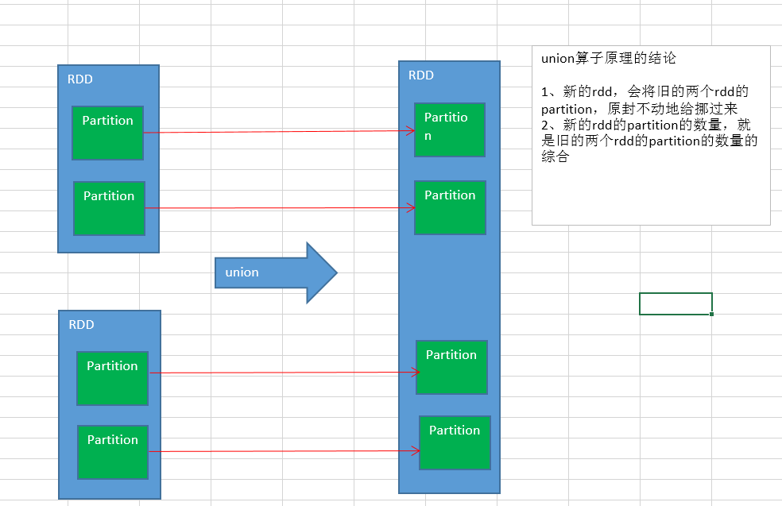

# 第200讲-Spark内核原理进阶-groupByKey算子内部实现原理剖析

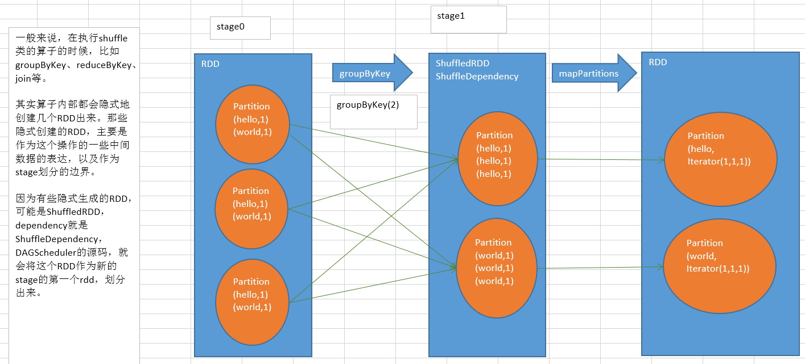

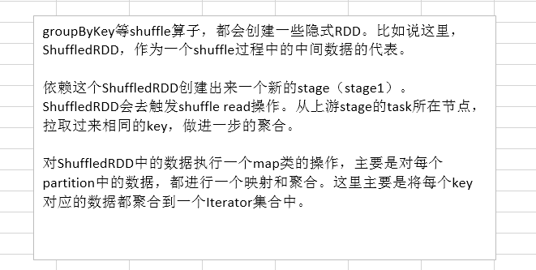

# 第201讲-Spark内核原理进阶-reduceByKey算子内部实现原理剖析

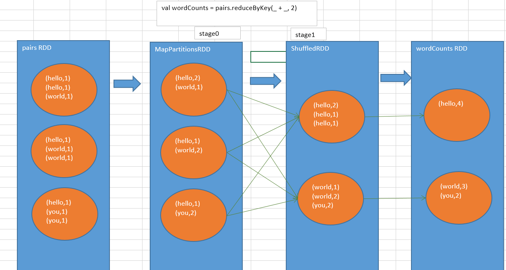

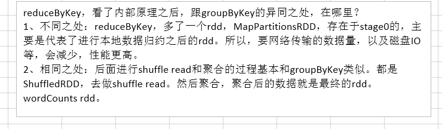

# 第202讲-Spark内核原理进阶-distinct算子内部实现原理剖析

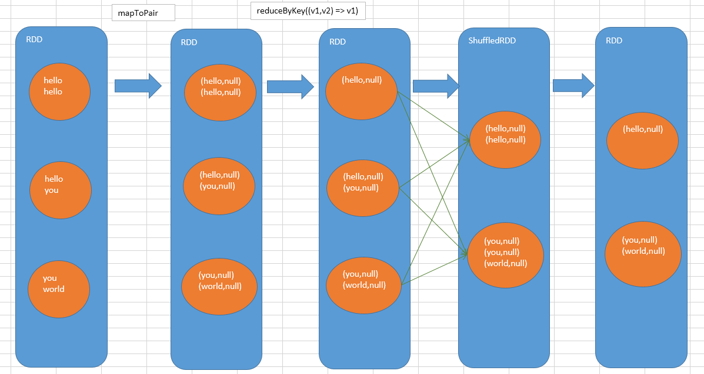

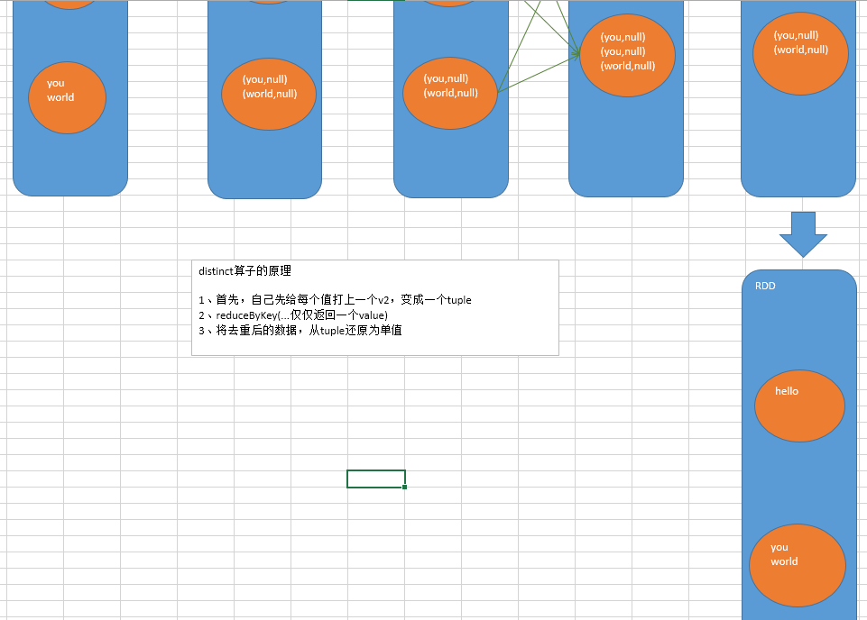

# 第203讲-Spark内核原理进阶-cogroup算子内部实现原理剖析

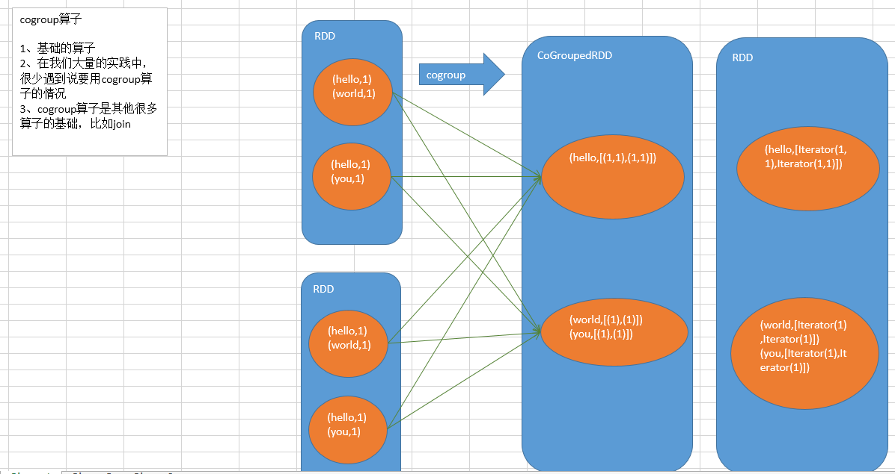

# 第204讲-Spark内核原理进阶-intersection算子内部实现原理剖析

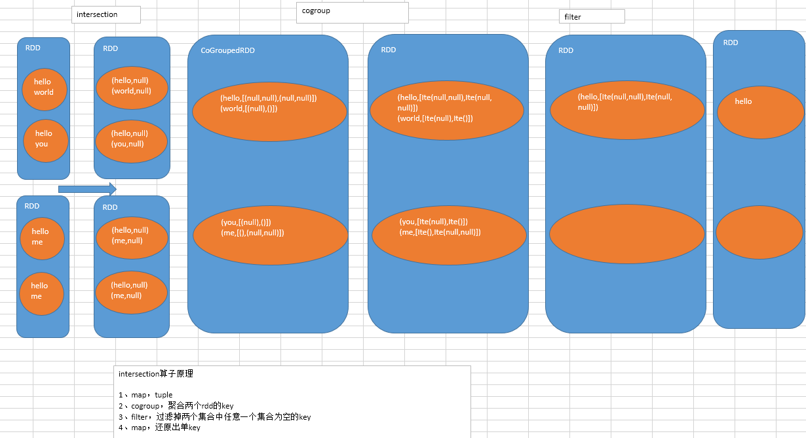

# 第205讲-Spark内核原理进阶-join算子内部实现原理剖析

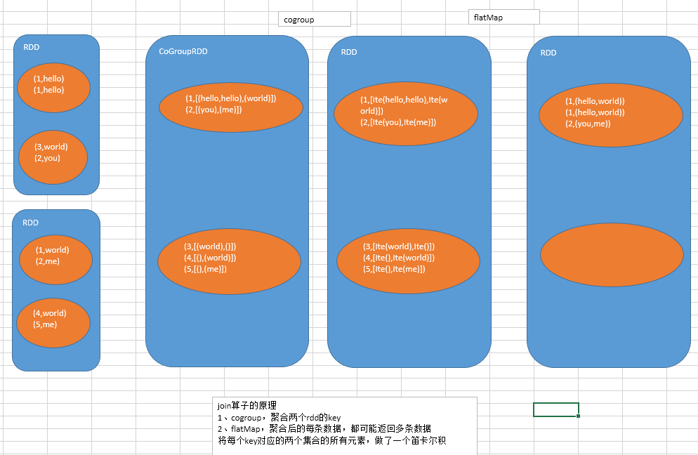

# 第206讲-Spark内核原理进阶-sortByKey算子内部实现原理剖析

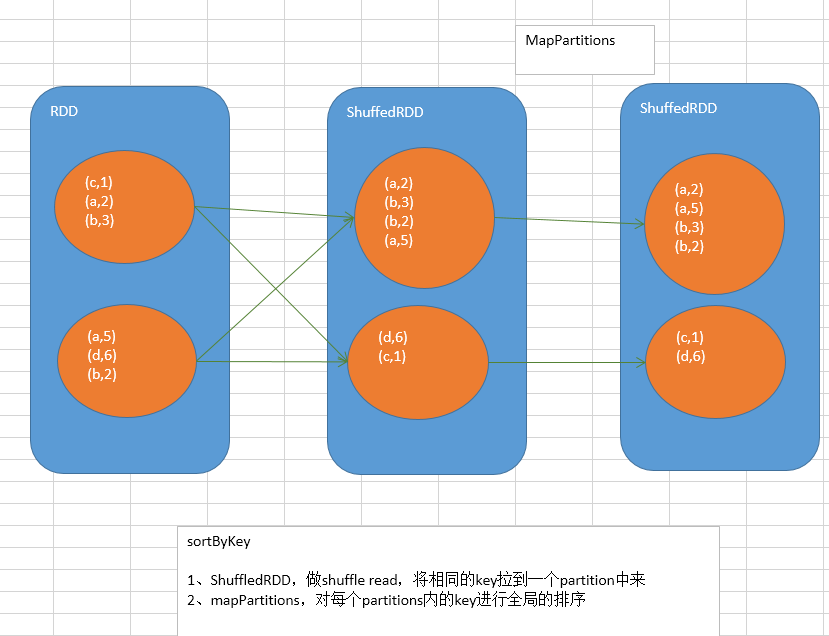

# 第207讲-Spark内核原理进阶-cartesian算子内部实现原理剖析

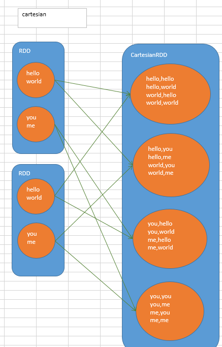

# 第208讲-Spark内核原理进阶-coalesce算子内部实现原理剖析

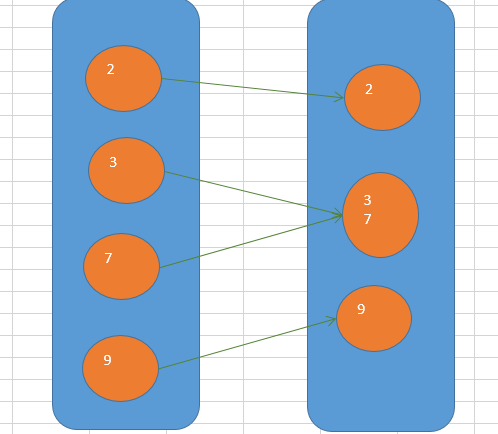

# 第209讲-Spark内核原理进阶-repartition算子内部实现原理剖析

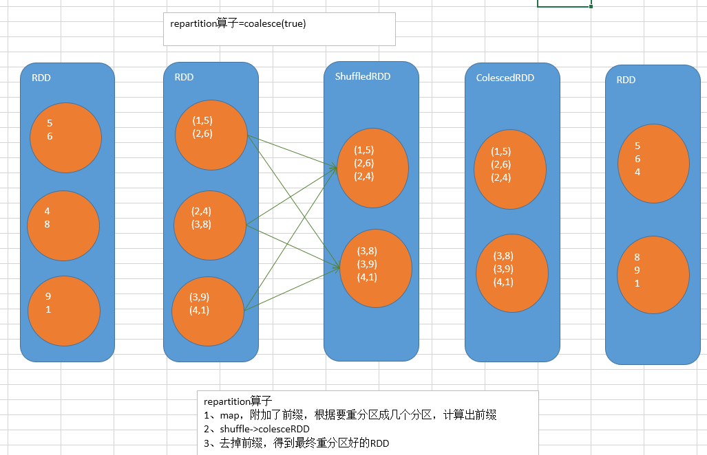