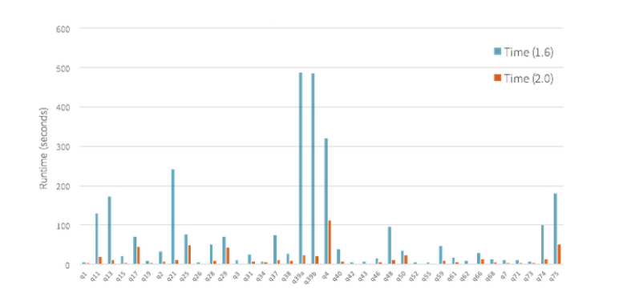
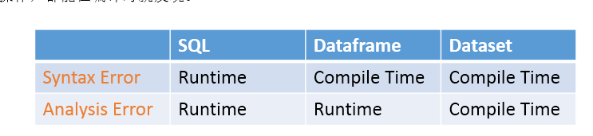

<!-- TOC -->

- [第246讲-Spark 2.0-新特性介绍](#第246讲-spark-20-新特性介绍)
    - [1、Spark Core&Spark SQL API](#1spark-corespark-sql-api)
    - [2、Spark MLlib](#2spark-mllib)
    - [3、Spark Streaming](#3spark-streaming)
    - [4、依赖管理、打包和操作](#4依赖管理打包和操作)
    - [5、移除的功能](#5移除的功能)
    - [6、变化的机制](#6变化的机制)
    - [7、过期的API](#7过期的api)
- [第247讲-Spark 2.0-新特性介绍-易用性：标准化SQL支持以及更合理的API](#第247讲-spark-20-新特性介绍-易用性标准化sql支持以及更合理的api)
    - [1、标准化SQL支持以及更合理的API](#1标准化sql支持以及更合理的api)
    - [2、统一Dataframe和Dataset API](#2统一dataframe和dataset-api)
    - [3、SparkSession](#3sparksession)
    - [4、新版本Accumulator API](#4新版本accumulator-api)
    - [5、基于Dataframe/Dataset的Spark MLlib](#5基于dataframedataset的spark-mllib)
    - [6、SparkR中的分布式机器学习算法以及UDF函数](#6sparkr中的分布式机器学习算法以及udf函数)
- [第248讲-Spark 2.0-新特性介绍-高性能：让Spark作为编译器来运行](#第248讲-spark-20-新特性介绍-高性能让spark作为编译器来运行)
- [第249讲-Spark 2.0-新特性介绍-智能化：Structured Streaming介绍](#第249讲-spark-20-新特性介绍-智能化structured-streaming介绍)
- [第250讲-Spark 2.0-新特性介绍-Spark 1.x的Volcano Iterator Model技术缺陷分析](#第250讲-spark-20-新特性介绍-spark-1x的volcano-iterator-model技术缺陷分析)
- [第251讲-Spark 2.0-新特性介绍-whole-stage code generation技术和vectorization技术](#第251讲-spark-20-新特性介绍-whole-stage-code-generation技术和vectorization技术)
    - [1、whole-stage code generation](#1whole-stage-code-generation)
    - [2、Vectorization](#2vectorization)
- [第252讲-Spark 2.0-Spark 2.x与1.x对比以及分析、学习建议以及使用建议](#第252讲-spark-20-spark-2x与1x对比以及分析学习建议以及使用建议)
    - [1、Spark 2.x与1.x对比](#1spark-2x与1x对比)
    - [2、Spark 2.x各组件分析Spark Core（RDD）](#2spark-2x各组件分析spark-corerdd)
    - [3、Spark 2.x各组件分析Spark SQL（ANSI-SQL+Subquery）](#3spark-2x各组件分析spark-sqlansi-sqlsubquery)
    - [4、Spark 2.x各组件分析Spark SQL（Dataframe/Dataset）](#4spark-2x各组件分析spark-sqldataframedataset)
    - [5、Spark 2.x各组件分析Spark Streaming&Structured Streaming](#5spark-2x各组件分析spark-streamingstructured-streaming)
    - [6、Spark 2.x各组件分析Spark MLlib&GraphX](#6spark-2x各组件分析spark-mllibgraphx)
    - [7、Spark 2.x学习建议](#7spark-2x学习建议)
- [第253讲-Spark 2.0-课程环境搭建：虚拟机、CentOS、Hadoop、Spark等](#第253讲-spark-20-课程环境搭建虚拟机centoshadoopspark等)
- [第254讲-Spark 2.0-开发环境搭建：Eclipse+Maven+Scala+Spark](#第254讲-spark-20-开发环境搭建eclipsemavenscalaspark)
- [第255讲-Spark 2.0-SparkSession、Dataframe、Dataset开发入门](#第255讲-spark-20-sparksessiondataframedataset开发入门)
    - [1、Spark SQL介绍](#1spark-sql介绍)
    - [2、Spark SQL之Dataframe/Dataset介绍](#2spark-sql之dataframedataset介绍)
    - [3、SparkSession：新的入口](#3sparksession新的入口)
    - [4、Dataframe：untyped操作](#4dataframeuntyped操作)
    - [5、SparkSession：运行SQL查询](#5sparksession运行sql查询)
    - [6、Dataset：typed操作](#6datasettyped操作)
    - [7、Hive操作](#7hive操作)
    - [8、Hive 1.2.1安装](#8hive-121安装)
- [第256讲-Spark 2.0-Dataset开发详解-初步体验untypd操作案例：计算部门平均年龄与薪资](#第256讲-spark-20-dataset开发详解-初步体验untypd操作案例计算部门平均年龄与薪资)
- [第257讲-Spark 2.0-Dataset开发详解-action操作：collect、count、foreach、reduce等](#第257讲-spark-20-dataset开发详解-action操作collectcountforeachreduce等)
- [第258讲-Spark 2.0-Dataset开发详解-基础操作：持久化、临时视图、ds与df互转换、写数据等](#第258讲-spark-20-dataset开发详解-基础操作持久化临时视图ds与df互转换写数据等)
- [第259讲-Spark 2.0-Dataset开发详解-typed操作：coalesce、repartition](#第259讲-spark-20-dataset开发详解-typed操作coalescerepartition)
- [第260讲-Spark 2.0-Dataset开发详解-typed操作：distinct、dropDuplicates](#第260讲-spark-20-dataset开发详解-typed操作distinctdropduplicates)
- [第261讲-Spark 2.0-Dataset开发详解-typed操作：except、filter、intersect](#第261讲-spark-20-dataset开发详解-typed操作exceptfilterintersect)
- [第262讲-Spark 2.0-Dataset开发详解-typed操作：map、flatMap、mapPartitions](#第262讲-spark-20-dataset开发详解-typed操作mapflatmapmappartitions)
- [第263讲-Spark 2.0-Dataset开发详解-typed操作：joinWith](#第263讲-spark-20-dataset开发详解-typed操作joinwith)
- [第264讲-Spark 2.0-Dataset开发详解-typed操作：sort](#第264讲-spark-20-dataset开发详解-typed操作sort)
- [第265讲-Spark 2.0-Dataset开发详解-typed操作：randomSplit、sample](#第265讲-spark-20-dataset开发详解-typed操作randomsplitsample)
- [第266讲-Spark 2.0-Dataset开发详解-untyped操作：select、where、groupBy、agg、col、join](#第266讲-spark-20-dataset开发详解-untyped操作selectwheregroupbyaggcoljoin)
- [第267讲-Spark 2.0-Dataset开发详解-聚合函数：avg、sum、max、min、count、countDistinct](#第267讲-spark-20-dataset开发详解-聚合函数avgsummaxmincountcountdistinct)
- [第268讲-Spark 2.0-Dataset开发详解-聚合函数：collect_list、collect_set](#第268讲-spark-20-dataset开发详解-聚合函数collect_listcollect_set)
- [第269讲-Spark 2.0-Dataset开发详解-其他常用函数](#第269讲-spark-20-dataset开发详解-其他常用函数)
- [第270讲-Spark 2.0-Structured Streaming：深入浅出的介绍](#第270讲-spark-20-structured-streaming深入浅出的介绍)
    - [1、流式计算的现状](#1流式计算的现状)
    - [2、持续计算应用](#2持续计算应用)
    - [3、Structured Streaming](#3structured-streaming)
    - [4、Structured Streaming的未来](#4structured-streaming的未来)
- [第271讲-Spark 2.0-Structured Streaming：wordcount入门案例](#第271讲-spark-20-structured-streamingwordcount入门案例)
- [第272讲-Spark 2.0-Structured Streaming：编程模型](#第272讲-spark-20-structured-streaming编程模型)
    - [1、Structured Streaming基础编程模型](#1structured-streaming基础编程模型)
    - [2、Structured Streaming event-time和late-data process](#2structured-streaming-event-time和late-data-process)
    - [3、Structured Streaming 容错语义](#3structured-streaming-容错语义)
- [第273讲-Spark 2.0-Structured Streaming：创建流式的dataset和dataframe](#第273讲-spark-20-structured-streaming创建流式的dataset和dataframe)
- [第274讲-Spark 2.0-Structured Streaming：对流式的dataset和dataframe执行计算操作](#第274讲-spark-20-structured-streaming对流式的dataset和dataframe执行计算操作)
    - [1、基础操作：选择、映射、聚合](#1基础操作选择映射聚合)
    - [2、滑动窗口：基于event-time](#2滑动窗口基于event-time)
    - [3、滑动窗口：基于event-time](#3滑动窗口基于event-time)
    - [4、join操作](#4join操作)
    - [5、不支持的操作](#5不支持的操作)
- [第275讲-Spark 2.0-Structured Streaming：output mode、sink以及foreach sink详解](#第275讲-spark-20-structured-streamingoutput-modesink以及foreach-sink详解)
    - [1、output操作](#1output操作)
    - [2、output mode](#2output-mode)
    - [3、output sink](#3output-sink)
    - [4、output sink](#4output-sink)
    - [5、foreach sink详解](#5foreach-sink详解)
- [第276讲-Spark 2.0-Structured Streaming：管理streaming query](#第276讲-spark-20-structured-streaming管理streaming-query)
- [第277讲-Spark 2.0-Structured Streaming：基于checkpoint的容错机制](#第277讲-spark-20-structured-streaming基于checkpoint的容错机制)

<!-- /TOC -->


# 第246讲-Spark 2.0-新特性介绍

## 1、Spark Core&Spark SQL API

* dataframe与dataset统一，dataframe只是dataset[Row]的类型别名
* SparkSession：统一SQLContext和HiveContext，新的上下文入口
* 为SparkSession开发的一种新的流式调用的configuration api
* accumulator功能增强：便捷api、web ui支持、性能更高
* dataset的增强聚合api
* 支持sql 2003标准
* 支持ansi-sql和hive ql的sql parser
* 支持ddl命令
* 支持子查询：in/not in、exists/not exists
* 支持csv文件
* 支持缓存和程序运行的堆外内存管理
* 支持hive风格的bucket表
* 支持近似概要统计，包括近似分位数、布隆过滤器、最小略图
* 通过whole-stage code generation技术将spark sql和dataset的性能提升2~10倍
* 通过vectorization技术提升parquet文件的扫描吞吐量
* 提升orc文件的读写性能
* 提升catalyst查询优化器的性能
* 通过native实现方式提升窗口函数的性能
* 对某些数据源进行自动文件合并


## 2、Spark MLlib
* spark mllib未来将主要基于dataset api来实现，基于rdd的api转为维护阶段
* 基于dataframe的api，支持持久化保存和加载模型和pipeline
* 基于dataframe的api，支持更多算法，包括二分kmeans、高斯混合、maxabsscaler等
* spark R支持mllib算法，包括线性回归、朴素贝叶斯、kmeans、多元回归等
* pyspark支持更多mllib算法，包括LDA、高斯混合、泛化线性回顾等
* 基于dataframe的api，向量和矩阵使用性能更高的序列化机制


## 3、Spark Streaming
* 发布测试版的structured streaming
	* 基于spark sql和catalyst引擎构建
	* 支持使用dataframe风格的api进行流式计算操作
	* catalyst引擎能够对执行计划进行优化
* 基于dstream的api支持kafka 0.10版本


## 4、依赖管理、打包和操作
* 不再需要在生产环境部署时打包fat jar，可以使用provided风格
* 完全移除了对akka的依赖
* mesos粗粒度模式下，支持启动多个executor
* 支持kryo 3.0版本
* 使用scala 2.11替代了scala 2.10


## 5、移除的功能
* bagel模块
* 对hadoop 2.1以及之前版本的支持
* 闭包序列化配置的支持
* HTTPBroadcast支持
* 基于TTL模式的元数据清理支持
* 半私有的org.apache.spark.Logging的使用支持
* SparkContext.metricsSystem API
* 与tachyon的面向block的整合支持
* spark 1.x中标识为过期的所有api
* python dataframe中返回rdd的方法
* 使用很少的streaming数据源支持：twitter、akka、MQTT、ZeroMQ
* hash-based shuffle manager
* standalone master的历史数据支持功能
* dataframe不再是一个类，而是dataset[Row]的类型别名


## 6、变化的机制
* 要求基于scala 2.11版本进行开发，而不是scala 2.10版本
* SQL中的浮点类型，使用decimal类型来表示，而不是double类型
* kryo版本升级到了3.0
* java的flatMap和mapPartitions方法，从iterable类型转变为iterator类型
* java的countByKey返回<K,Long>类型，而不是<K,Object>类型
* 写parquet文件时，summary文件默认不会写了，需要开启参数来启用
* spark mllib中，基于dataframe的api完全依赖于自己，不再依赖mllib包


## 7、过期的API
* mesos的细粒度模式
* java 7支持标识为过期，可能2.x未来版本会移除支持
* python 2.6的支持


# 第247讲-Spark 2.0-新特性介绍-易用性：标准化SQL支持以及更合理的API

## 1、标准化SQL支持以及更合理的API
Spark最引以为豪的几个特点就是简单、直观、表达性好。Spark 2.0为了继续加强这几个特点，做了两件事情：1、提供标准化的SQL支持；2、统一了Dataframe和Dataset两套API。

在标准化SQL支持方面，引入了新的ANSI-SQL解析器，提供标准化SQL的解析功能，而且还提供了子查询的支持。Spark现在可以运行完整的99个TPC-DS查询，这就要求Spark包含大多数SQL 2003标准的特性。这么做的好处在于，SQL一直是大数据应用领域的一个最广泛接受的标准，比如说Hadoop，做大数据的企业90%的时间都在用Hive，写SQL做各种大数据的统计和分析。因此Spark SQL提升对SQL的支持，可以大幅度减少用户将应用从其他技术（比如Oracle、Hive等）迁移过来的成本。

## 2、统一Dataframe和Dataset API
从Spark 2.0开始，Dataframe就只是Dataset[Row]的一个别名，不再是一个单独的类了。无论是typed方法（map、filter、groupByKey等）还是untyped方法（select、groupBy等），都通过Dataset来提供。而且Dataset API将成为Spark的新一代流式计算框架——structured streaming的底层计算引擎。但是由于Python和R这两个语言都不具备compile-time type-safety的特性，所以就没有引入Dataset API，所以这两种语言中的主要编程接口还是Dataframe。


## 3、SparkSession
SparkSession是新的Spark上下文以及入口，用于合并SQLContext和HiveContext，并替代它们。因为以前提供了SQLContext和HiveContext两种上下文入口，因此用户有时会有些迷惑，到底该使用哪个接口。现在好了，只需要使用一个统一的SparkSession即可。但是为了向后兼容性，SQLContext和HiveContext还是保留下来了。


## 4、新版本Accumulator API
Spark 2.0提供了新版本的Accumulator，提供了各种方便的方法，比如说直接通过一个方法的调用，就可以创建各种primitive data type（原始数据类型，int、long、double）的Accumulator。并且在spark web ui上也支持查看spark application的accumulator，性能也得到了提升。老的Accumulator API还保留着，主要是为了向后兼容性。


## 5、基于Dataframe/Dataset的Spark MLlib
Spark 2.0中，spark.ml包下的机器学习API，主要是基于Dataframe/Dataset来实现的，未来将会成为主要发展的API接口。原先老的基于RDD的spark.mllib包的机器学习API还会保留着，为了向后兼容性，但是未来主要会基于spark.ml包下的接口来进行开发。而且用户使用基于Dataframe/Dataset的新API，还能够对算法模型和pipeline进行持久化保存以及加载。


## 6、SparkR中的分布式机器学习算法以及UDF函数
Spark 2.0中，为SparkR提供了分布式的机器学习算法，包括经典的Generalized Linear Model，朴素贝叶斯，Survival Regression，K-means等。此外SparkR还支持用户自定义的函数，即UDF。


# 第248讲-Spark 2.0-新特性介绍-高性能：让Spark作为编译器来运行

在一个2015年的spark调查中显示，91%的spark用户是因为spark的高性能才选择使用它的。所以spark的性能优化也就是社区的一个重要的努力方向了。spark 1.x相较于hadoop mapreduce来说，速度已经快了数倍了，但是spark 2.x中，还能不能相较于spark 1.x来说，速度再提升10倍呢？

带着这个疑问，我们可以重新思考一下spark的物理执行机制。对于一个现代的大数据处理引擎来说，CPU的大部分时间都浪费在了一些无用的工作上，比如说virtual function call，或者从CPU缓冲区中读写数据。现代的编译器为了减少cpu浪费在上述工作的时间，付出了大量的努力。


Spark 2.0的一个重大的特点就是搭载了最新的第二代tungsten引擎。第二代tungsten引擎吸取了现代编译器以及并行数据库的一些重要的思想，并且应用在了spark的运行机制中。其中一个核心的思想，就是在运行时动态地生成代码，在这些自动动态生成的代码中，可以将所有的操作都打包到一个函数中，这样就可以避免多次virtual function call，而且还可以通过cpu register来读写中间数据，而不是通过cpu cache来读写数据。上述技术整体被称作“whole-stage code generation”，中文也可以叫“全流程代码生成”。


之前有人做过测试，用单个cpu core来处理一行数据，对比了spark 1.6和spark 2.0的性能。spark 2.0搭载的是whole-stage code generation技术，spark 1.6搭载的是第一代tungsten引擎的expression code generation技术。测试结果显示，spark 2.0的性能相较于spark 1.6得到了一个数量级的提升。


除了刚才那个简单的测试以外，还有人使用完整的99个SQL基准测试来测试过spark 1.6和spark 2.0的性能。测试结果同样显示，spark 2.0的性能比spark 1.6来说，提升了一个数量级。




spark 2.0中，除了whole-stage code generation技术以外，还使用了其他一些新技术来提升性能。比如说对Spark SQL的catalyst查询优化器做了一些性能优化，来提升对一些常见查询的优化效率，比如null值处理等。再比如说，通过vectarization技术将parquet文件扫描的吞吐量提升了3倍以上。


# 第249讲-Spark 2.0-新特性介绍-智能化：Structured Streaming介绍


Spark Streaming应该说是将离线计算操作和流式计算操作统一起来的大数据计算框架之一。从Spark 0.7开始引入的Spark Streaming，为开发人员提供了很多有用的特性：一次且仅一次的语义支持、容错性、强一致性保证、高吞吐量。

但是实际上在真正工业界的流式计算项目中，并不仅仅只是需要一个流式计算引擎。这些项目实际上需要深度地使用批处理计算以及流式处理技术，与外部存储系统进行整合，还有应对业务逻辑变更的能力。因此，企业实际上不仅仅只是需要一个流式计算引擎，他们需要的是一个全栈式的技术，让他们能够开发end-to-end的持续计算应用（continuous application）。

Spark 2.0为了解决上述流式计算的痛点和需求，开发了新的模块——Structured Streaming。


Structured Streaming提供了与批处理计算类似的API。要开发一个流式计算应用，开发人员只要使用Dataframe/Dataset API编写与批处理计算一样的代码即可，Structured Streaming会自动将这些类似批处理的计算代码增量式地应用到持续不断进入的新数据上。这样，开发人员就不需要花太多时间考虑状态管理、容错、与离线计算的同步等问题。Structured Streaming可以保证，针对相同的数据，始终与离线计算产出完全一样的计算结果。

Structured Streaming还提供了与存储系统的事务整合。它会进行自动的容错管理以及数据一致性的管理，如果开发人员要写一个应用程序来更新数据库，进而提供一些实时数据服务，与静态数据进行join，或者是在多个存储系统之间移动数据，那么Structured Streaming可以让这些事情更加简单。

Structured Streaming与Spark其余的组件都能够进行完美的整合。比如可以通过Spark SQL对实时数据进行统计分析，与静态数据进行join，还有其他的使用dataframe/dataset的组件，这样就可以让开发人员构建完整的流式计算引用，而不仅仅只是一个流式计算引擎而已。在未来，Spark会将Structured Streaming与Spark MLlib的整合做的更好。


Spark 2.0搭载了一个beta版本的Structured Streaming，目前是作为Dataframe/Dataset的一个小的附加组件。主要是让Spark用户可以先尝试使用一下Structured Streaming，比如做一些实验和测试。Structured Streaming的一些关键特性，比如基于时间的处理，延迟数据的处理，交互式的查询，以及与非流式的数据源和存储进行整合，可能会基于未来的版本来实现。


# 第250讲-Spark 2.0-新特性介绍-Spark 1.x的Volcano Iterator Model技术缺陷分析

深入剖析Spark 2.x的第二代tungsten引擎原理之前，先看一下当前的Spark的工作原理。我们可以通过一个SQL来举例，这个SQL扫描了单个表，然后对属性等于指定值的记录进行汇总计数。SQL语句如下：select count(*) from store_sales where ss_item_sk=1000。

要执行这个查询，Spark 1.x会使用一种最流行、最经典的查询求值策略，该策略主要基于
Volcano Iterator Model。在这种模型中，一个查询会包含多个operator，每个operator都会实现
一个接口，提供一个next()方法，该方法返回operator tree中的下一个operator。


举例来说，上面那个查询中的filter operator的代码大致如下所示：


让每一个operator都实现一个iterator接口，可以让查询引擎优雅的组装任意operator在一起。而不需要查询引擎去考虑每个operator具体的一些处理逻辑，比如数据类型等。

Vocano Iterator Model也因此成为了数据库SQL执行引擎领域内内的20年中最流行的一种标准。而且Spark 
SQL最初的SQL执行引擎也是基于这个思想来实现的。


我们可以清晰地看到，手写的代码的性能比Volcano Iterator Model高了一整个数量级，而这其中的原因包含以下几点：

1、避免了virtual function dispatch：在Volcano Iterator Model中，至少需要调用一次next()函数来获取下一个operator。这些函数调用在操作系统层面，会被编译为virtual function dispatch。而手写代码中，没有任何的函数调用逻辑。虽然说，现代的编译器已经对虚函数调用进行了大量的优化，但是该操作还是会执行多个CPU指令，并且执行速度较慢，尤其是当需要成百上千次地执行虚函数调用时。

2、通过CPU Register存取中间数据，而不是内存缓冲：在Volcano Iterator Model中，每次一个operator将数据交给下一个operator，都需要将数据写入内存缓冲中。然而在手写代码中，JVM JIT编译器会将这些数据写入CPU Register。CPU从内存缓冲种读写数据的性能比直接从CPU Register中读写数据，要低了一个数量级。

3、Loop Unrolling和SIMD：现代的编译器和CPU在编译和执行简单的for循环时，性能非常地高。编译器通常可以自动对for循环进行unrolling，并且还会生成SIMD指令以在每次CPU指令执行时处理多条数据。CPU也包含一些特性，比如pipelining，prefetching，指令reordering，可以让for循环的执行性能更高。然而这些优化特性都无法在复杂的函数调用场景中施展，比如Volcano Iterator Model。

loop unrolling解释（小白的方式）
for(int i = 0; i < 10; i++) { System.out.println(i) }
System.out.println(1)
System.out.println(2)
System.out.println(3)
......

手写代码的好处就在于，它是专门为实现这个功能而编写的，代码简单，因此可以吸收上述所有优点，包括避免虚函数调用，将中间数据保存在CPU寄存器中，而且还可以被底层硬件进行for循环的自动优化。


# 第251讲-Spark 2.0-新特性介绍-whole-stage code generation技术和vectorization技术


## 1、whole-stage code generation
之前讲解了手工编写的代码的性能，为什么比Volcano Iterator Model要好。所以如果要对Spark进行性能优化，一个思路就是在运行时动态生成代码，以避免使用Volcano模型，转而使用性能更高的代码方式。要实现上述目的，就引出了Spark第二代Tungsten引擎的新技术，whole-stage code generation。通过该技术，SQL语句编译后的operator-treee中，每个operator执行时就不是自己来执行逻辑了，而是通过whole-stage code generation技术，动态生成代码，生成的代码中会尽量将所有的操作打包到一个函数中，然后再执行动态生成的代码。


就以上一讲的SQL语句来作为示例，Spark会自动生成以下代码。如果只是一个简单的查询，那么Spark会尽可能就生成一个stage，并且将所有操作打包到一起。但是如果是复杂的操作，就可能会生成多个stage。


Spark提供了explain()方法来查看一个SQL的执行计划，而且这里面是可以看到通过whole-stage code generation生成的代码的执行计划的。如果看到一个步骤前面有个*符号，那么就代表这个步骤是通过该技术自动生成的。在这个例子中，Range、Filter和Aggregation都是自动生成的，Exchange不是自动生成的，因为这是一个网络传输数据的过程。


很多用户会疑惑，从Spark 1.1版本开始，就一直听说有code generation类的feature引入，这跟spark 2.0中的这个技术有什么不同呢。实际上在spark 1.x版本中，code generation技术仅仅被使用在了expression evoluation方面（比如a + 1），即表达式求值，还有极其少数几个算子上（比如filter等）。而spark 2.0中的whole-stage code generation技术是应用在整个spark运行流程上的。


## 2、Vectorization

对于很多查询操作，whole-stage code generation技术都可以很好地优化其性能。但是有一些特殊的操作，却无法很好的使用该技术，比如说比较复杂一些操作，如parquet文件扫描、csv文件解析等，或者是跟其他第三方技术进行整合。

如果要在上述场景提升性能，spark引入了另外一种技术，称作“vectorization”，即向量化。向量化的意思就是避免每次仅仅处理一条数据，相反，将多条数据通过面向列的方式来组织成一个一个的batch，然后对一个batch中的数据来迭代处理。每次next()函数调用都返回一个batch的数据，这样可以减少virtual function dispatch的开销。同时通过循环的方式来处理，也可以使用编译器和CPU的loop unrolling等优化特性。


这种向量化的技术，可以使用到之前说的3个点中的2个点。即，减少virtual function dispatch，以及进行loop unrolling优化。但是还是需要通过内存缓冲来读写中间数据的。所以，仅仅当实在无法使用whole-stage code generation时，才会使用vectorization技术。有人做了一个parquet文件读取的实验，采用普通方式以及向量化方式，性能也能够达到一个数量级的提升：


> 总结

上述的whole-stage code generation技术，能否保证将spark 2.x的性能比spark 1.x来说提升10倍以上呢？这是无法完全保证的。虽然说目前的spark架构已经搭载了目前世界上最先进的性能优化技术，但是并不是所有的操作都可以大幅度提升性能的。简单来说，CPU密集型的操作，可以通过这些新技术得到性能的大幅度提升，但是很多IO密集型的操作，比如shuffle过程的读写磁盘，是无法通过该技术提升性能的。在未来，spark会花费更多的精力在优化IO密集型的操作的性能上。


# 第252讲-Spark 2.0-Spark 2.x与1.x对比以及分析、学习建议以及使用建议

## 1、Spark 2.x与1.x对比

Spark 1.x：Spark Core（RDD）、Spark SQL（SQL+Dataframe+Dataset）、Spark Streaming、Spark MLlib、Spark Graphx

Spark 2.x：Spark Core（RDD）、Spark SQL（ANSI-SQL+Subquery+Dataframe/Dataset）、Spark Streaming、Structured Streaming、Spark MLlib（Dataframe/Dataset）、Spark Graphx、Second Generation Tungsten Engine（Whole-stage code generation+Vectorization）


这里首先给大家理清楚一个前提：Spark 1.x到Spark 2.x，完全是一脉相承的关系，即，Spark 2.x基本上是基于Spark 1.x进行了更多的功能和模块的扩展，以及底层性能的改良。绝对不是说，Spark 2.x彻底淘汰和替代了Spark 1.x中的组件。而且实际上，对于Spark 1.x中90%以上的东西，Spark 2.x几乎都完全保留了支持和延续，并没有做任何改变。这是大家必须要了解的一件事情。

下面我们就对Spark 2.x中的每个组件都进行分析，告诉大家这些组件的基本原理，以及其适用和不适用的场景。避免大家对Spark 1.x和Spark 2.x有错误的认知。


## 2、Spark 2.x各组件分析Spark Core（RDD）

从Spark诞生之日开始，RDD就是Spark最主要的编程接口，重要程度类似于Hadoop中的MapReduce。RDD，简单来说，就是一个不可变的分布式数据集，被分为多个partition从而在一个集群上分布式地存储。我们可以使用RDD提供的各种transformation和action算子，对RDD执行分布式的计算操作。

可能很多人会问，Spark 2.0开始，包括Structured Streaming、Spark MLlib、Spark SQL底层都开始基于Dataframe/Dataset来作为基础计算引擎，那么Spark Core/RDD是不是就要被淘汰了？

回答是：错误！

Spark官方社区对于这个问题也是这个态度，Spark Core绝对不会被淘汰掉。因为Spark Core/RDD作为一种low-level的API有它的较为底层的应用场景，虽然后续这种场景会越来越少，Dataframe/Dataset API会逐渐替代原先Spark Core的一些场景，但是不可否认的是，这种场景还是存在的。此外，Dataframe/Dataset实际上底层也是基于Spark Core/RDD构建的。所以说，Spark Core/RDD是Spark生态中，不可替代的基础API和引擎，其他所有的组件几乎都是构建在它之上。未来它不会被淘汰，只是应用场景会减少而已

Spark 2.x中，在离线批处理计算中，编程API，除了RDD以外，还增强了Dataframe/Dataset API。那么，我们到底什么时候应该使用Spark Core/RDD来进行编程呢？实际上，RDD和Dataset最大的不同在于，RDD是底层的API和内核，Dataset实际上基于底层的引擎构建的high-level的计算引擎。

1、如果我们需要对数据集进行非常底层的掌控和操作，比如说，手动管理RDD的分区，或者根据RDD的运行逻辑来结合各种参数和编程来进行较为底层的调优。因为实际上Dataframe/Dataset底层会基于whole-stage code generation技术自动生成很多代码，那么就意味着，当我们在进行线上报错的troubleshooting以及性能调优时，对Spark的掌控能力就会降低。而使用Spark Core/RDD，因为其运行完全遵循其源码，因此我们完全可以在透彻阅读Spark Core源码的基础之上，对其进行troubleshooting和底层调优。（最重要的一点）

2、我们要处理的数据是非结构化的，比如说多媒体数据，或者是普通文本数据。

3、我们想要使用过程式编程风格来处理数据，而不想使用domain-specific language的编程风格来处理数据。

4、我们不关心数据的schema，即元数据。

5、我们不需要Dataframe/Dataset底层基于的第二代tungsten引擎提供的whole-stage code generation等性能优化技术。

## 3、Spark 2.x各组件分析Spark SQL（ANSI-SQL+Subquery）

Spark 2.x中的Spark SQL，提供了标准化SQL的支持，以及子查询的支持，大幅度提升了Spark在SQL领域的应用场景。而且本身在大数据领域中，SQL就是一个最广泛使用的用户入口，据不完全统计以及讲师的行业经验，做大数据的公司里，90%的应用场景都是基于SQL的。最典型的例子就是Hadoop，几乎用Hadoop的公司，90%都是基于Hive进行各种大数据的统计和分析。剩下10%是实时计算、机器学习、图计算。之所以有这种现象，主要就是因为SQL简单、易学、易用、直观。无论是研发人员，还是产品经理，还是运营人员，还是其他的人，都能在几天之内入门和学会SQL的使用，然后就可以基于大数据SQL引擎（比如Hive）基于企业积累的海量数据，根据自己的需求进行各种统计和分析。

此外，据Spark官方社区所说，Spark 2.x一方面对SQL的支持做了大幅度的增强，另一方面，也通过优化了底层的计算引擎（第二代tungsten引擎，whole-stage code generation等），提升了SQL的执行性能以及稳定性。

所以在Spark 2.x中，一方面，开始鼓励大家多使用Spark SQL的SQL支持，采用Spark SQL来编写SQL进行最常见的大数据统计分析。比如可以尝试将Hive中的运行的一些SQL语句慢慢迁移到Spark SQL上来。另外一方面，也提醒大家，一般一个新的大版本，都是不太稳定的，因此Spark SQL虽然在功能、性能和稳定性上做了很多的增强，但是难免还是会有很多的坑。因此建议大家在做Hive/RDBMS（比如Oracle）到Spark SQL的迁移时，要小心谨慎，一点点迁移，同时做好踩坑的准备。

## 4、Spark 2.x各组件分析Spark SQL（Dataframe/Dataset）

就像RDD一样，Dataframe也代表一个不可变的分布式数据集。与RDD不同的一点是，Dataframe引入了schema的概念，支持以复杂的类型作为元素类型，同时指定schema，比如Row。因此Dataframe更像是传统关系型数据库中的表的概念。为了提升开发人员对大数据的处理能力，Dataframe除了提供schema的引入，还基于Schema提供了很多RDD所不具备的high-level API，以及一些domain-specific language（特定领域编程语言）。但是在Spark 2.0中，Dataframe和Dataset合并了，Dataframe已经不是一个单独的概念了，目前仅仅只是Dataset[Row]的一个类型别名而已，你可以理解为Dataframe就是Dataset。


从Spark 2.0开始，Dataset有两种表现形式：typed API和untyped API。我们可以认为，Dataframe就是Dataset[Row]的别名，Row就是一个untyped类型的对象，因为Row是类似于数据库中的一行，我们只知道里面有哪些列，但是有些列即使不存在，我们也可以这对这些不存在的列进行操作。因此其被定义为untyped，就是弱类型。

而Dataset[T]本身，是一种typed类型的API，其中的Object通常都是我们自己自定义的typed类型的对象，因为对象是我们自己定义的，所以包括字段命名以及字段类型都是强类型的。目前Scala支持Dataset和Dataframe两种类型，Java仅仅支持Dataset类型，Python和R因为不具备compile-time type-safety特性，因此仅仅支持Dataframe。

Dataset API有哪些优点呢？

1、静态类型以及运行时的类型安全性

SQL语言具有最不严格的限制，而Dataset具有最严格的限制。SQL语言在只有在运行时才能发现一些错误，比如类型错误，但是由于Dataframe/Dataset目前都是要求类型指定的（静态类型），因此在编译时就可以发现类型错误，并提供运行时的类型安全。比如说，如果我们调用了一个不属于Dataframe的API，编译时就会报错。但是如果你使用了一个不存在的列，那么也只能到运行时才能发现了。而最严格的就是Dataset了，因为Dataset是完全基于typed API来设计的，类型都是严格而且强类型的，因此如果你使用了错误的类型，或者对不存在的列进行了操作，都能在编译时就发现。


2、将半结构化的数据转换为typed自定义类型

举例来说，如果我们现在有一份包含了学校中所有学生的信息，是以JSON字符串格式定义的，比如：{“name”: “leo”, “age”, 19, “classNo”: 1}。我们可以自己定义一个类型，比如case class Student(name: String, age: Integer, classNo: Integer)。接着我们就可以加载指定的json文件，并将其转换为typed类型的Dataset[Student]，比如val ds = spark.read.json("students.json").as[Student]。

在这里，Spark会执行三个操作：
1、Spark首先会读取json文件，并且自动推断其schema，然后根据schema创建一个Dataframe。
2、在这里，会创建一个Dataframe=Dataset[Row]，使用Row来存放你的数据，因为此时还不知道具体确切的类型。
3、接着将Dataframe转换为Dataset[Student]，因为此时已经知道具体的类型是Student了。

这样，我们就可以将半结构化的数据，转换为自定义的typed结构化强类型数据集。并基于此，得到之前说的编译时和运行时的类型安全保障。

3、API的易用性

Dataframe/Dataset引入了很多的high-level API，并提供了domain-specific language风格的编程接口。这样的话，大部分的计算操作，都可以通过Dataset的high-level API来完成。通过typed类型的Dataset，我们可以轻松地执行agg、select、sum、avg、map、filter、groupBy等操作。使用domain-specific language也能够轻松地实现很多计算操作，比如类似RDD算子风格的map()、filter()等。

4、性能

除了上述的优点，Dataframe/Dataset在性能上也有很大的提升。首先，Dataframe/Dataset是构建在Spark SQL引擎之上的，它会根据你执行的操作，使用Spark SQL引擎的Catalyst来生成优化后的逻辑执行计划和物理执行计划，可以大幅度节省内存或磁盘的空间占用的开销（相对于RDD来说，Dataframe/Dataset的空间开销仅为1/3~1/4），也能提升计算的性能。其次，Spark 2.x还引入第二代Tungsten引擎，底层还会使用whole-stage code generation、vectorization等技术来优化性能。

什么时候应该使用Dataframe/Dataset，而不是RDD呢？

1、如果需要更加丰富的计算语义，high-level的抽象语义，以及domain-specific API。
2、如果计算逻辑需要high-level的expression、filter、map、aggregation、average、sum、SQL、列式存储、lambda表达式等语义，来处理半结构化，或结构化的数据。
3、如果需要高度的编译时以及运行时的类型安全保障。
4、如果想要通过Spark SQL的Catalyst和Spark 2.x的第二代Tungsten引擎来提升性能。
5、如果想要通过统一的API来进行离线、流式、机器学习等计算操作。
6、如果是R或Python的用户，那么只能使用Dataframe。

最后，实际上，Spark官方社区对RDD和Dataframe/Dataset的建议时，按照各自的特点，根据的需求场景，来灵活的选择最合适的引擎。甚至说，在一个Spark应用中，也可以将两者结合起来一起使用。


## 5、Spark 2.x各组件分析Spark Streaming&Structured Streaming

Spark Streaming是老牌的Spark流式计算引擎，底层基于RDD计算引擎。除了类似RDD风格的计算API以外，也提供了更多的流式计算语义，比如window、updateStateByKey、transform等。同时对于流式计算中重要的数据一致性、容错性等也有一定的支持。

但是Spark 2.x中也推出了全新的基于Dataframe/Dataset的Structured Streaming流式计算引擎。相较于Spark Streaming来说，其最大的不同之处在于，采用了全新的逻辑模型，提出了real-time incremental table的概念，更加统一了流式计算和离线计算的概念，减轻了用户开发的负担。同时还提供了（可能在未来提供）高度封装的特性，比如双流的全量join、与离线数据进行join的语义支持、内置的自动化容错机制、内置的自动化的一次且仅一次的强一致性语义、time-based processing、延迟数据达到的自动处理、与第三方外部存储进行整合的sink概念，等等高级特性。大幅度降低了流式计算应用的开发成本。

这里要提的一句是，首先，目前暂时建议使用Spark Streaming，因为Spark Streaming基于RDD，而且经过过个版本的考验，已经趋向于稳定。对于Structured Streaming来说，一定要强调，在Spark 2.0版本刚推出的时候，千万别在生产环境使用，因为目前官方定义为beta版，就是测试版，里面可能有很多的bug和问题，而且上述的各种功能还不完全，很多功能还没有。因此Structured Streaming的设计理念虽然非常好，但是个人建议在后续的版本中再考虑使用。目前可以保持关注和学习，并做一些实验即可。


## 6、Spark 2.x各组件分析Spark MLlib&GraphX
Spark MLlib未来将主要基于Dataframe/Dataset API来开发。而且还会提供更多的机器学习算法。因此可以主要考虑使用其spark.ml包下的API即可。

Spark GraphX，目前发展较为缓慢，如果有图计算相关的应用，可以考虑使用。


## 7、Spark 2.x学习建议

纵观之前讲的内容，Spark 2.0本次，其实主要就是提升了底层的性能，搭载了第二代Tungsten引擎；同时大幅度调整和增强了ANSI-SQL支持和Dataframe/Dataset API，并将该API作为Spark未来重点发展的发现；此外，为了提供更好的流式计算解决方案，发布了一个测试版的Structured Streaming模块。

而且之前也讲解了Spark 1.x和Spark 2.x中的每一个模块。大家可以明确看到：

第一，Spark 1.x没有任何一个组件是被淘汰的；

第二，Spark这次重点改造的是Tungsten Engine、Dataframe/Dataset以及Structured Streaming，对于之前Spark 1.x课程中讲解的Spark Core、Spark SQL以及Spark Streaming，包括Spark Core的性能调优和源码剖析，集群运维管理，几乎没有做太多的调整；

第三，Spark Core、Spark SQL、Spark Streaming、Dataframe/Dataset、Structured Streaming、Spark MLlib和GraphX，每个组件目前都有其特点和用途，任何一个不是积累和过时的技术；

第五，Spark 2.0的新东西中，ANSI-SQL和Dataframe/Dataset API是可以重点尝试使用的，但是Structured Streaming还停留在实验阶段，完全不能应用到生产项目中。因此目前流式计算主要还是使用Spark Streaming。个人预计，至少要在2017年春节过后，Structured Streaming才有可能进入稳定状态，可以尝试使用。

首先，对于课程之前讲解的Spark 1.x的所有知识，目前以及之后可预见的时间范围内，都是一直有价值的，都是需要学习的。无论是Spark Core（RDD）编程，作为整个Spark生态的基石（包括Dataframe/Dataset），以及掌握Spark底层的知识；还是Spark SQL的开发，或者是Spark Streaming的开发；还有它们的性能调优、Spark Core源码剖析；以及管理运维，这些知识都没有过时，都是价值的，大家都必须认真、仔细的学习，绝对不能轻浮冒进，直接就简单学学Dataframe/Dataset，Structured Streaming，就以为自己掌握了Spark 2.x了，那是绝对错误的！

本次课程升级，主要分为三个阶段，第一个阶段就是Spark 2.x的新特性介绍，主要包括了新特性概览、发展方向、核心原理以及与1.x的对比分析、学习建议以及使用建议；第二个阶段就是Dataset的开发详解；第三个阶段就是Structured Streaming开发详解。因此在透彻掌握Spark 1.x的基础之上，再来学习Spark 2.x效果更佳。其中最重要的，是要掌握Spark第二代Tungsten引擎的性能提升原理、Spark ANSI-SQL和子查询的支持、Dataset的开发以及使用、Structured Streaming的开发以及使用。

在透彻学习了Spark 1.x和Spark 2.x的知识体系之后，对于Spark的使用，建议如下

1、建议开始大量尝试使用Spark SQL的标准化SQL支持以及子查询支持的特性，大部分的大数据统计分析应用，采用Spark SQL来实现。

2、其次，对于一些无法通过SQL来实现的复杂逻辑，比如一些算法的实施，或者一些跟DB、缓存打交道的大数据计算应用，建议采用Dataframe/Dataset API来实施。

3、接着，对于一些深刻理解课程中讲解的Spark Core/RDD，以及内核源码的高阶同学，如果遇到了因为Spark SQL和Dataframe/Dataset导致的线上的莫名其妙的报错，始终无法解决，或者是觉得有些性能，通过第二代Tungsten引擎也无法很好的调优，需要自己手工通过RDD控制底层的分区以及各种参数来进行调优，那么建议使用Spark Core/RDD来重写SQL类应用。

4、对于流式计算应用，建议目前还是使用Spark Streaming，因为其稳定；Structured Streaming目前是beta版本，很不稳定，因此目前建议仅仅是学习和实验即可。个人预计和建议，估计至少要到2017年春节后，Structured Streaming才可能具备部署生产环境的能力。

5、对于机器学习应用，建议使用spark.ml包下的机器学习API，因为其基于Dataframe/Dataset API实现，性能更好，而且未来是社区重点发展方向


# 第253讲-Spark 2.0-课程环境搭建：虚拟机、CentOS、Hadoop、Spark等

Hadoop2.4+spark2.0+hive0.13

# 第254讲-Spark 2.0-开发环境搭建：Eclipse+Maven+Scala+Spark


# 第255讲-Spark 2.0-SparkSession、Dataframe、Dataset开发入门

## 1、Spark SQL介绍
Spark SQL是Spark的一个模块，主要用于处理结构化的数据。与基础的Spark RDD API不同的是，Spark SQL的接口会向提供更多的信息，包括数据结构以及要执行的计算操作等。在Spark SQL内部，会使用这些信息执行一些额外的优化。使用Spark SQL有两种方式，包括SQL语句以及Dataset API。但是在计算的时候，无论你是用哪种接口去进行计算，它们使用的底层执行引擎是完全一模一样的。这种底层执行机制的统一，就意味着我们可以在不同的方式之间任意来回切换，只要我们可以灵活地运用不同的方式来最自然地表达我们要执行的计算操作就可以了。

Spark SQL的一个主要的功能就是执行SQL查询语句。Spark 2.0开始，最大的一个改变，就是支持了SQL 2003标准语法，还有就是支持子查询。Spark SQL也可以用来从Hive中查询数据。当我们使用某种编程语言开发的Spark作业来执行SQL时，返回的结果是Dataframe/Dataset类型的。当然，我们也可以通过Spark SQL的shell命令行工具，或者是JDBC/ODBC接口来访问。


## 2、Spark SQL之Dataframe/Dataset介绍
Dataset是一个分布式的数据集。Dataset是Spark 1.6开始新引入的一个接口，它结合了RDD API的很多优点（包括强类型，支持lambda表达式等），以及Spark SQL的优点（优化后的执行引擎）。Dataset可以通过JVM对象来构造，然后通过transformation类算子（map，flatMap，filter等）来进行操作。Scala和Java的API中支持Dataset，但是Python不支持Dataset API。不过因为Python语言本身的天然动态特性，Dataset API的不少feature本身就已经具备了（比如可以通过row.columnName来直接获取某一行的某个字段）。R语言的情况跟Python也很类似。

Dataframe就是按列组织的Dataset。在逻辑概念上，可以大概认为Dataframe等同于关系型数据库中的表，或者是Python/R语言中的data frame，但是在底层做了大量的优化。Dataframe可以通过很多方式来构造：比如结构化的数据文件，Hive表，数据库，已有的RDD。Scala，Java，Python，R等语言都支持Dataframe。在Scala API中，Dataframe就是Dataset[Row]的类型别名。在Java中，需要使用Dataset<Row>来代表一个Dataframe。


## 3、SparkSession：新的入口
从Spark 2.0开始，一个最大的改变就是，Spark SQL的统一入口就是SparkSession，SQLContext和HiveContext未来会被淘汰。可以通过SparkSession.builder()来创建一个SparkSession，如下代码所示。SparkSession内置就支持Hive，包括使用HiveQL语句查询Hive中的数据，使用Hive的UDF函数，以及从Hive表中读取数据等。

val spark = SparkSession
  .builder()
  .appName("Spark SQL Example")
  .master("local") 
  .config("spark.sql.warehouse.dir", "C:\\Users\\Administrator\\Desktop\\spark-warehouse")  
  .getOrCreate()

import spark.implicits._


## 4、Dataframe：untyped操作
有了SparkSession之后，就可以通过已有的RDD，Hive表，或者其他数据源来创建Dataframe，比如说通过json文件来创建。Dataframe提供了一种domain-specific language来进行结构化数据的操作，这种操作也被称之为untyped操作，与之相反的是基于强类型的typed操作。

val df = spark.read.json("people.json")
df.show()
df.printSchema()
df.select("name").show()
df.select($"name", $"age" + 1).show()
df.filter($"age" > 21).show()
df.groupBy("age").count().show()


## 5、SparkSession：运行SQL查询
SparkSession的sql()函数允许我们执行SQL语句，得到的结果是一个Dataframe。

df.createOrReplaceTempView("people")
val sqlDF = spark.sql("SELECT * FROM people")
sqlDF.show()


## 6、Dataset：typed操作
Dataset与RDD比较类似，但是非常重要的一点不同是，RDD的序列化机制是基于Java序列化机制或者是Kryo的，而Dataset的序列化机制基于一种特殊的Encoder，来将对象进行高效序列化，以进行高性能处理或者是通过网络进行传输。Dataset除了Encoder，也同时支持Java序列化机制，但是encoder的特点在于动态的代码生成，同时提供一种特殊的数据格式，来让spark不将对象进行反序列化，即可直接基于二进制数据执行一些常见的操作，比如filter、sort、hash等。

case class Person(name: String, age: Long)
val caseClassDS = Seq(Person("Andy", 32)).toDS()
caseClassDS.show()

val primitiveDS = Seq(1, 2, 3).toDS()
primitiveDS.map(_ + 1).collect()

val path = "people.json"
val peopleDS = spark.read.json(path).as[Person]
peopleDS.show()


## 7、Hive操作
在Spark 2.0中，是支持读写hive中存储的数据的。但是，因为hive有较多的依赖，所以默认情况下，这些依赖没有包含在spark的发布包中。如果hive依赖可以在classpath路径中，那么spark会自动加载这些依赖。这些hive依赖必须在所有的worker node上都放一份，因为worker node上运行的作业都需要使用hive依赖的序列化与反序列化包来访问hive中的数据。

只要将hive-site.xml、hdfs-site.xml和core-site.xml都放入spark/conf目录下即可。

如果要操作Hive，那么构建SparkSession的时候，就必须启用Hive支持，包括连接到hive的元数据库，支持使用hive序列化与反序列化包，以及支持hive udf函数。如果我们没有安装hive，也是可以启用hive支持的。如果我们没有放置hive-site.xml到spark/conf目录下，SparkSession就会自动在当前目录创建元数据库，同时创建一个spark.sql.warehouse.dir参数设置的目录，该参数的值默认是当前目录下的spark-warehouse目录。在spark 2.0中，hive.metastore.warehouse.dir属性已经过时了，现在使用 spark.sql.warehouse.dir属性来指定hive元数据库的位置。


```java
case class Record(key: Int, value: String)
val warehouseLocation = "file:${system:user.dir}/spark-warehouse"

val spark = SparkSession
  .builder()
  .appName("Spark Hive Example")
  .config("spark.sql.warehouse.dir", warehouseLocation)
  .enableHiveSupport()
  .getOrCreate()

import spark.implicits._
import spark.sql


sql("CREATE TABLE IF NOT EXISTS src (key INT, value STRING)")
sql("LOAD DATA LOCAL INPATH 'kv1.txt' INTO TABLE src")
sql("SELECT * FROM src").show()
sql("SELECT COUNT(*) FROM src").show()

val sqlDF = sql("SELECT key, value FROM src WHERE key < 10 ORDER BY key")
val stringsDS = sqlDF.map {
  case Row(key: Int, value: String) => s"Key: $key, Value: $value"
}
stringsDS.show()

val recordsDF = spark.createDataFrame((1 to 100).map(i => Record(i, s"val_$i")))
recordsDF.createOrReplaceTempView("records")
sql("SELECT * FROM records r JOIN src s ON r.key = s.key").show()
```


## 8、Hive 1.2.1安装

spark 2.0，默认是跟hive 1.2.1进行整合的，所以之前我们安装的是hive 0.13.1是不Ok的，实际跑的时候会出现hive 0.13支持的一些操作，spark 2.0会用自己内置的hive 1.2.1 lib去操作和访问我们的hive 0.13（包括metastore service），出现版本不一致的问题

- 1、将/usr/local/hive删除
- 2、将apache-hive-1.2.1-bin.tar.gz使用WinSCP上传到spark1的/usr/local目录下。
- 3、解压缩hive安装包：tar -zxvf apache-hive-1.2.1-bin.tar.gz。
- 4、重命名hive目录：mv apache-hive-1.2.1-bin hive
- 5、cp /usr/share/java/mysql-connector-java-5.1.17.jar /usr/local/hive/lib


```xml
mv hive-default.xml.template hive-site.xml
vi hive-site.xml
<property>
  <name>javax.jdo.option.ConnectionURL</name>
  <value>jdbc:mysql://spark2upgrade01:3306/hive_metadata?createDatabaseIfNotExist=true</value>
</property>
<property>
  <name>javax.jdo.option.ConnectionDriverName</name>
  <value>com.mysql.jdbc.Driver</value>
</property>
<property>
  <name>javax.jdo.option.ConnectionUserName</name>
  <value>hive</value>
</property>
<property>
  <name>javax.jdo.option.ConnectionPassword</name>
  <value>hive</value>
</property>
<property>
  <name>hive.metastore.uris</name>
  <value>thrift://spark2upgrade01:9083</value>
</property>

```


```
把hive-site.xml中所有${system:java.io.tmpdir}全部替换为/usr/local/hive/iotmp
把hive-site.xml中所有${system:user.name}全部替换为root

rm -rf /usr/local/hadoop/share/hadoop/yarn/lib/jline-0.9.94.jar
cp /usr/local/hive/lib/jline-2.12.jar /usr/local/hadoop/share/hadoop/yarn/lib

mv hive-env.sh.template hive-env.sh
vi /usr/local/hive/bin/hive-config.sh
export JAVA_HOME=/usr/java/latest
export HIVE_HOME=/usr/local/hive
export HADOOP_HOME=/usr/local/hadoop

```

1、将hive-site.xml放置到spark的conf目录下
2、启动hive metastore service
hive --service metastore &


1、创建一份文件，students.txt，每行是一个学生的信息
2、CREATE TABLE students(name string, age int, score double)
3、LOAD DATA LOCAL INPATH '/usr/local/test_data/students.txt' INTO TABLE students
4、spark-shell --master spark://spark2upgrade01:7077 --driver-memory 500m --executor-memory 500m
5、在spark-shell中，运行针对hive的sql语句
spark.sql(“select * from students”).show();
spark.sql(“select name from students where score>=90;”).show();
spark.sql(“select name from students where age<=15;”).show();
6、观察是否有正确的结果
7、在spark web ui中检查是否有运行的作业记录


# 第256讲-Spark 2.0-Dataset开发详解-初步体验untypd操作案例：计算部门平均年龄与薪资

```java
package cn.ibeifeng.spark

import org.apache.spark.sql.SparkSession

/**
 * 计算部门的平均薪资和年龄
 * 
 * 需求：
 * 		1、只统计年龄在20岁以上的员工
 * 		2、根据部门名称和员工性别为粒度来进行统计
 * 		3、统计出每个部门分性别的平均薪资和年龄
 * 
 */
object DepartmentAvgSalaryAndAgeStat {
  
  def main(args: Array[String]) {
    // 创建SparkSession
    val spark = SparkSession
        .builder()
        .appName("DepartmentAvgSalaryAndAgeStat") 
        .master("local") 
        .config("spark.sql.warehouse.dir", "C:\\Users\\Administrator\\Desktop\\spark-warehouse")
        .getOrCreate()
    
    // 导入spark的隐式转换
    import spark.implicits._
    // 导入spark sql的functions
    import org.apache.spark.sql.functions._
    
    // 首先将两份数据文件加载进来，形成两个dataframe（讲的是untyped类型的操作入门）
    val employee = spark.read.json("C:\\Users\\Administrator\\Desktop\\employee.json")
    val department = spark.read.json("C:\\Users\\Administrator\\Desktop\\department.json")
    
    // 进行计算操作
    
    
    employee
        // 先对employee进行过滤，只统计20岁以上的员工
        .filter("age > 20")
        // 需要跟department数据进行join，然后才能根据部门名称和员工性别进行聚合
        // 注意：untyped join，两个表的字段的连接条件，需要使用三个等号
        .join(department, $"depId" === $"id")  
        // 根据部门名称和员工性别进行分组
        .groupBy(department("name"), employee("gender"))  
        // 最后执行聚合函数
        .agg(avg(employee("salary")), avg(employee("age")))
        // 执行action操作，将结果显示出来
        .show()  
        
    // 基础的知识带一下
        
    // dataframe == dataset[Row]
    // dataframe的类型是Row，所以是untyped类型，弱类型
    // dataset的类型通常是我们自定义的case class，所以是typed类型，强类型
    
    // dataset开发，与rdd开发有很多的共同点
    // 比如说，dataset api也分成transformation和action，transformation是lazy特性的
    // action会触发实际的计算和操作
        
    // dataset也是有持久化的概念的
  }
  
}

```


# 第257讲-Spark 2.0-Dataset开发详解-action操作：collect、count、foreach、reduce等
```java
package cn.ibeifeng.spark

import org.apache.spark.sql.SparkSession

/**
 * action操作详解
 * 
 * collect、count、first、foreach、reduce、show、take
 * 
 */
object ActionOperation {
  
  def main(args: Array[String]) {
    val spark = SparkSession
        .builder()
        .appName("ActionOperation") 
        .master("local") 
        .config("spark.sql.warehouse.dir", "C:\\Users\\Administrator\\Desktop\\spark-warehouse")
        .getOrCreate()
    
    import spark.implicits._
    
    val employee = spark.read.json("C:\\Users\\Administrator\\Desktop\\employee.json")
    
    // collect：将分布式存储在集群上的分布式数据集（比如dataset），中的所有数据都获取到driver端来
    employee.collect().foreach { println(_) }  
    // count：对dataset中的记录数进行统计个数的操作
    println(employee.count())
    // first：获取数据集中的第一条数据
    println(employee.first())  
    // foreach：遍历数据集中的每一条数据，对数据进行操作，这个跟collect不同，collect是将数据获取到driver端进行操作
    // foreach是将计算操作推到集群上去分布式执行
    // foreach(println(_))这种，真正在集群中执行的时候，是没用的，因为输出的结果是在分布式的集群中的，我们是看不到的
    employee.foreach { println(_) }  
    // reduce：对数据集中的所有数据进行归约的操作，多条变成一条
    // 用reduce来实现数据集的个数的统计
    println(employee.map(employee => 1).reduce(_ + _))
    // show，默认将dataset数据打印前20条
    employee.show()
    // take，从数据集中获取指定条数
    employee.take(3).foreach { println(_) } 
  }
  
}
```


# 第258讲-Spark 2.0-Dataset开发详解-基础操作：持久化、临时视图、ds与df互转换、写数据等

```java
package cn.ibeifeng.spark

import org.apache.spark.sql.SparkSession

/**
 * 基础操作
 * 
 * 持久化：cache、persist
 * 创建临时视图：createTempView、createOrReplaceTempView
 * 获取执行计划：explain
 * 查看schema：printSchema
 * 写数据到外部存储：write
 * dataset与dataframe互相转换：as、toDF
 * 
 */
object BasicOperation {
  
  case class Employee(name: String, age: Long, depId: Long, gender: String, salary: Long)
  
  def main(args: Array[String]) {
    val spark = SparkSession
        .builder()
        .appName("BasicOperation") 
        .master("local") 
        .config("spark.sql.warehouse.dir", "C:\\Users\\Administrator\\Desktop\\spark-warehouse")
        .getOrCreate()
    
    import spark.implicits._
    
    val employee = spark.read.json("C:\\Users\\Administrator\\Desktop\\employee.json")
    
    // 持久化，在rdd部分仔细讲解过，我们这里就不展开讲了
    // 持久化，如果要对一个dataset重复计算两次的话，那么建议先对这个dataset进行持久化再进行操作，避免重复计算
//    employee.cache()
//    println(employee.count())
//    println(employee.count())

    // 创建临时视图，主要是为了，可以直接对数据执行sql语句
//    employee.createOrReplaceTempView("employee") 
//    spark.sql("select * from employee where age > 30").show()  
    
    // 获取spark sql的执行计划
    // dataframe/dataset，比如执行了一个sql语句获取的dataframe，实际上内部包含一个logical plan，逻辑执行计划
    // 设计执行的时候，首先会通过底层的catalyst optimizer，生成物理执行计划，比如说会做一些优化，比如push filter
    // 还会通过whole-stage code generation技术去自动化生成代码，提升执行性能
//    spark.sql("select * from employee where age > 30").explain()  
    
//    employee.printSchema()
    
    // 以前给大家演示过，写hdfs是肯定没有问题的
//    val employeeWithAgeGreaterThen30DF = spark.sql("select * from employee where age > 30")
//    employeeWithAgeGreaterThen30DF.write.json("C:\\Users\\Administrator\\Desktop\\employeeWithAgeGreaterThen30DF.json")
    
    val employeeDS = employee.as[Employee]  
    employeeDS.show()
    employeeDS.printSchema()
    
    val employeeDF = employeeDS.toDF()
  }
  
}
```

# 第259讲-Spark 2.0-Dataset开发详解-typed操作：coalesce、repartition
```java
package cn.ibeifeng.spark

import org.apache.spark.sql.SparkSession

/**
 * typed操作
 */
object TypedOperation {
  
  case class Employee(name: String, age: Long, depId: Long, gender: String, salary: Long)
  
  def main(args: Array[String]) {
    val spark = SparkSession
        .builder()
        .appName("TypedOperation") 
        .master("local") 
        .config("spark.sql.warehouse.dir", "C:\\Users\\Administrator\\Desktop\\spark-warehouse")
        .getOrCreate()
    
    import spark.implicits._
    
    val employee = spark.read.json("C:\\Users\\Administrator\\Desktop\\employee.json")
    
    val employeeDS = employee.as[Employee]  
    
    println(employeeDS.rdd.partitions.size)
    
    // coalesce和repartition操作
    // 都是用来重新定义分区的
    // 区别在于：coalesce，只能用于减少分区数量，而且可以选择不发生shuffle
    // repartiton，可以增加分区，也可以减少分区，必须会发生shuffle，相当于是进行了一次重分区操作
    
    val employeeDSRepartitioned = employeeDS.repartition(7);
    
    // 看一下它的分区情况
    println(employeeDSRepartitioned.rdd.partitions.size)
    
    val employeeDSCoalesced = employeeDSRepartitioned.coalesce(3);
    
    println(employeeDSCoalesced.rdd.partitions.size)
    
    employeeDSCoalesced.show()
  }
  
}
```


# 第260讲-Spark 2.0-Dataset开发详解-typed操作：distinct、dropDuplicates

```java
package cn.ibeifeng.spark

import org.apache.spark.sql.SparkSession

/**
 * typed操作
 */
object TypedOperation {
  
  case class Employee(name: String, age: Long, depId: Long, gender: String, salary: Long)
  
  def main(args: Array[String]) {
    val spark = SparkSession
        .builder()
        .appName("TypedOperation") 
        .master("local") 
        .config("spark.sql.warehouse.dir", "C:\\Users\\Administrator\\Desktop\\spark-warehouse")
        .getOrCreate()
    
    import spark.implicits._
    
    val employee = spark.read.json("C:\\Users\\Administrator\\Desktop\\employee.json")
    
    val employeeDS = employee.as[Employee]  
    
//    println(employeeDS.rdd.partitions.size)
//    
//    // coalesce和repartition操作
//    // 都是用来重新定义分区的
//    // 区别在于：coalesce，只能用于减少分区数量，而且可以选择不发生shuffle
//    // repartiton，可以增加分区，也可以减少分区，必须会发生shuffle，相当于是进行了一次重分区操作
//    
//    val employeeDSRepartitioned = employeeDS.repartition(7);
//    
//    // 看一下它的分区情况
//    println(employeeDSRepartitioned.rdd.partitions.size)
//    
//    val employeeDSCoalesced = employeeDSRepartitioned.coalesce(3);
//    
//    println(employeeDSCoalesced.rdd.partitions.size)
//    
//    employeeDSCoalesced.show()
    
    // distinct和dropDuplicates
    // 都是用来进行去重的，区别在哪儿呢？
    // distinct，是根据每一条数据，进行完整内容的比对和去重
    // dropDuplicates，可以根据指定的字段进行去重
    
    val distinctEmployeeDS = employeeDS.distinct();
    distinctEmployeeDS.show()
    val dropDuplicatesEmployeeDS = employeeDS.dropDuplicates(Seq("name"))  
    dropDuplicatesEmployeeDS.show()  
  }
  
}
```

# 第261讲-Spark 2.0-Dataset开发详解-typed操作：except、filter、intersect
```java
package cn.ibeifeng.spark

import org.apache.spark.sql.SparkSession

/**
 * typed操作
 */
object TypedOperation {
  
  case class Employee(name: String, age: Long, depId: Long, gender: String, salary: Long)
  
  def main(args: Array[String]) {
    val spark = SparkSession
        .builder()
        .appName("TypedOperation") 
        .master("local") 
        .config("spark.sql.warehouse.dir", "C:\\Users\\Administrator\\Desktop\\spark-warehouse")
        .getOrCreate()
    
    import spark.implicits._
    
    val employee = spark.read.json("C:\\Users\\Administrator\\Desktop\\employee.json")
    val employee2 = spark.read.json("C:\\Users\\Administrator\\Desktop\\employee2.json")
    
    val employeeDS = employee.as[Employee]  
    val employeeDS2 = employee2.as[Employee]  
    
//    println(employeeDS.rdd.partitions.size)
//    
//    // coalesce和repartition操作
//    // 都是用来重新定义分区的
//    // 区别在于：coalesce，只能用于减少分区数量，而且可以选择不发生shuffle
//    // repartiton，可以增加分区，也可以减少分区，必须会发生shuffle，相当于是进行了一次重分区操作
//    
//    val employeeDSRepartitioned = employeeDS.repartition(7);
//    
//    // 看一下它的分区情况
//    println(employeeDSRepartitioned.rdd.partitions.size)
//    
//    val employeeDSCoalesced = employeeDSRepartitioned.coalesce(3);
//    
//    println(employeeDSCoalesced.rdd.partitions.size)
//    
//    employeeDSCoalesced.show()
    
    // distinct和dropDuplicates
    // 都是用来进行去重的，区别在哪儿呢？
    // distinct，是根据每一条数据，进行完整内容的比对和去重
    // dropDuplicates，可以根据指定的字段进行去重
    
//    val distinctEmployeeDS = employeeDS.distinct();
//    distinctEmployeeDS.show()
//    val dropDuplicatesEmployeeDS = employeeDS.dropDuplicates(Seq("name"))  
//    dropDuplicatesEmployeeDS.show()  
    
    // except：获取在当前dataset中有，但是在另外一个dataset中没有的元素
    // filter：根据我们自己的逻辑，如果返回true，那么就保留该元素，否则就过滤掉该元素
    // intersect：获取两个数据集的交集
    
//    employeeDS.except(employeeDS2).show()  
//    employeeDS.filter { employee => employee.age > 30 }.show() 
//    employeeDS.intersect(employeeDS2).show()  
  }
  
}
```


# 第262讲-Spark 2.0-Dataset开发详解-typed操作：map、flatMap、mapPartitions
```java
package cn.ibeifeng.spark

import org.apache.spark.sql.SparkSession

/**
 * typed操作
 */
object TypedOperation {
  
  case class Employee(name: String, age: Long, depId: Long, gender: String, salary: Long)
  case class Department(id: Long, name: String)
  
  def main(args: Array[String]) {
    val spark = SparkSession
        .builder()
        .appName("TypedOperation") 
        .master("local") 
        .config("spark.sql.warehouse.dir", "C:\\Users\\Administrator\\Desktop\\spark-warehouse")
        .getOrCreate()
    
    import spark.implicits._
    
    val employee = spark.read.json("C:\\Users\\Administrator\\Desktop\\employee.json")
    val employee2 = spark.read.json("C:\\Users\\Administrator\\Desktop\\employee2.json")
    val department = spark.read.json("C:\\Users\\Administrator\\Desktop\\department.json")
    
    val employeeDS = employee.as[Employee]  
    val employeeDS2 = employee2.as[Employee]  
    val departmentDS = department.as[Department]
    
//    println(employeeDS.rdd.partitions.size)
//    
//    // coalesce和repartition操作
//    // 都是用来重新定义分区的
//    // 区别在于：coalesce，只能用于减少分区数量，而且可以选择不发生shuffle
//    // repartiton，可以增加分区，也可以减少分区，必须会发生shuffle，相当于是进行了一次重分区操作
//    
//    val employeeDSRepartitioned = employeeDS.repartition(7);
//    
//    // 看一下它的分区情况
//    println(employeeDSRepartitioned.rdd.partitions.size)
//    
//    val employeeDSCoalesced = employeeDSRepartitioned.coalesce(3);
//    
//    println(employeeDSCoalesced.rdd.partitions.size)
//    
//    employeeDSCoalesced.show()
    
    // distinct和dropDuplicates
    // 都是用来进行去重的，区别在哪儿呢？
    // distinct，是根据每一条数据，进行完整内容的比对和去重
    // dropDuplicates，可以根据指定的字段进行去重
    
//    val distinctEmployeeDS = employeeDS.distinct();
//    distinctEmployeeDS.show()
//    val dropDuplicatesEmployeeDS = employeeDS.dropDuplicates(Seq("name"))  
//    dropDuplicatesEmployeeDS.show()  
    
    // except：获取在当前dataset中有，但是在另外一个dataset中没有的元素
    // filter：根据我们自己的逻辑，如果返回true，那么就保留该元素，否则就过滤掉该元素
    // intersect：获取两个数据集的交集
    
//    employeeDS.except(employeeDS2).show()  
//    employeeDS.filter { employee => employee.age > 30 }.show() 
//    employeeDS.intersect(employeeDS2).show()  
    
    // map：将数据集中的每条数据都做一个映射，返回一条新数据
    // flatMap：数据集中的每条数据都可以返回多条数据
    // mapPartitions：一次性对一个partition中的数据进行处理
    
    employeeDS.map { employee => (employee.name, employee.salary + 1000) }.show()  
    departmentDS.flatMap { 
      department => Seq(Department(department.id + 1, department.name + "_1"), Department(department.id + 2, department.name + "_2"))
    }.show()
    employeeDS.mapPartitions { employees => {
        val result = scala.collection.mutable.ArrayBuffer[(String, Long)]() 
        while(employees.hasNext) {  
          var emp = employees.next()  
          result += ((emp.name, emp.salary + 1000))
        }
        result.iterator
      }
    }.show()   
  }
  
}
```


# 第263讲-Spark 2.0-Dataset开发详解-typed操作：joinWith
```java
package cn.ibeifeng.spark

import org.apache.spark.sql.SparkSession

/**
 * typed操作
 */
object TypedOperation {
  
  case class Employee(name: String, age: Long, depId: Long, gender: String, salary: Long)
  case class Department(id: Long, name: String)
  
  def main(args: Array[String]) {
    val spark = SparkSession
        .builder()
        .appName("TypedOperation") 
        .master("local") 
        .config("spark.sql.warehouse.dir", "C:\\Users\\Administrator\\Desktop\\spark-warehouse")
        .getOrCreate()
    
    import spark.implicits._
    
    val employee = spark.read.json("C:\\Users\\Administrator\\Desktop\\employee.json")
    val employee2 = spark.read.json("C:\\Users\\Administrator\\Desktop\\employee2.json")
    val department = spark.read.json("C:\\Users\\Administrator\\Desktop\\department.json")
    
    val employeeDS = employee.as[Employee]  
    val employeeDS2 = employee2.as[Employee]  
    val departmentDS = department.as[Department]
    
//    println(employeeDS.rdd.partitions.size)
//    
//    // coalesce和repartition操作
//    // 都是用来重新定义分区的
//    // 区别在于：coalesce，只能用于减少分区数量，而且可以选择不发生shuffle
//    // repartiton，可以增加分区，也可以减少分区，必须会发生shuffle，相当于是进行了一次重分区操作
//    
//    val employeeDSRepartitioned = employeeDS.repartition(7);
//    
//    // 看一下它的分区情况
//    println(employeeDSRepartitioned.rdd.partitions.size)
//    
//    val employeeDSCoalesced = employeeDSRepartitioned.coalesce(3);
//    
//    println(employeeDSCoalesced.rdd.partitions.size)
//    
//    employeeDSCoalesced.show()
    
    // distinct和dropDuplicates
    // 都是用来进行去重的，区别在哪儿呢？
    // distinct，是根据每一条数据，进行完整内容的比对和去重
    // dropDuplicates，可以根据指定的字段进行去重
    
//    val distinctEmployeeDS = employeeDS.distinct();
//    distinctEmployeeDS.show()
//    val dropDuplicatesEmployeeDS = employeeDS.dropDuplicates(Seq("name"))  
//    dropDuplicatesEmployeeDS.show()  
    
    // except：获取在当前dataset中有，但是在另外一个dataset中没有的元素
    // filter：根据我们自己的逻辑，如果返回true，那么就保留该元素，否则就过滤掉该元素
    // intersect：获取两个数据集的交集
    
//    employeeDS.except(employeeDS2).show()  
//    employeeDS.filter { employee => employee.age > 30 }.show() 
//    employeeDS.intersect(employeeDS2).show()  
    
    // map：将数据集中的每条数据都做一个映射，返回一条新数据
    // flatMap：数据集中的每条数据都可以返回多条数据
    // mapPartitions：一次性对一个partition中的数据进行处理
    
//    employeeDS.map { employee => (employee.name, employee.salary + 1000) }.show()  
//    departmentDS.flatMap { 
//      department => Seq(Department(department.id + 1, department.name + "_1"), Department(department.id + 2, department.name + "_2"))
//    }.show()
//    employeeDS.mapPartitions { employees => {
//        val result = scala.collection.mutable.ArrayBuffer[(String, Long)]() 
//        while(employees.hasNext) {  
//          var emp = employees.next()  
//          result += ((emp.name, emp.salary + 1000))
//        }
//        result.iterator
//      }
//    }.show()   
    
    employeeDS.joinWith(departmentDS, $"depId" === $"id").show()    
  }
  
}
```


# 第264讲-Spark 2.0-Dataset开发详解-typed操作：sort

```java
package cn.ibeifeng.spark

import org.apache.spark.sql.SparkSession

/**
 * typed操作
 */
object TypedOperation {
  
  case class Employee(name: String, age: Long, depId: Long, gender: String, salary: Long)
  case class Department(id: Long, name: String)
  
  def main(args: Array[String]) {
    val spark = SparkSession
        .builder()
        .appName("TypedOperation") 
        .master("local") 
        .config("spark.sql.warehouse.dir", "C:\\Users\\Administrator\\Desktop\\spark-warehouse")
        .getOrCreate()
    
    import spark.implicits._
    
    val employee = spark.read.json("C:\\Users\\Administrator\\Desktop\\employee.json")
    val employee2 = spark.read.json("C:\\Users\\Administrator\\Desktop\\employee2.json")
    val department = spark.read.json("C:\\Users\\Administrator\\Desktop\\department.json")
    
    val employeeDS = employee.as[Employee]  
    val employeeDS2 = employee2.as[Employee]  
    val departmentDS = department.as[Department]
    
//    println(employeeDS.rdd.partitions.size)
//    
//    // coalesce和repartition操作
//    // 都是用来重新定义分区的
//    // 区别在于：coalesce，只能用于减少分区数量，而且可以选择不发生shuffle
//    // repartiton，可以增加分区，也可以减少分区，必须会发生shuffle，相当于是进行了一次重分区操作
//    
//    val employeeDSRepartitioned = employeeDS.repartition(7);
//    
//    // 看一下它的分区情况
//    println(employeeDSRepartitioned.rdd.partitions.size)
//    
//    val employeeDSCoalesced = employeeDSRepartitioned.coalesce(3);
//    
//    println(employeeDSCoalesced.rdd.partitions.size)
//    
//    employeeDSCoalesced.show()
    
    // distinct和dropDuplicates
    // 都是用来进行去重的，区别在哪儿呢？
    // distinct，是根据每一条数据，进行完整内容的比对和去重
    // dropDuplicates，可以根据指定的字段进行去重
    
//    val distinctEmployeeDS = employeeDS.distinct();
//    distinctEmployeeDS.show()
//    val dropDuplicatesEmployeeDS = employeeDS.dropDuplicates(Seq("name"))  
//    dropDuplicatesEmployeeDS.show()  
    
    // except：获取在当前dataset中有，但是在另外一个dataset中没有的元素
    // filter：根据我们自己的逻辑，如果返回true，那么就保留该元素，否则就过滤掉该元素
    // intersect：获取两个数据集的交集
    
//    employeeDS.except(employeeDS2).show()  
//    employeeDS.filter { employee => employee.age > 30 }.show() 
//    employeeDS.intersect(employeeDS2).show()  
    
    // map：将数据集中的每条数据都做一个映射，返回一条新数据
    // flatMap：数据集中的每条数据都可以返回多条数据
    // mapPartitions：一次性对一个partition中的数据进行处理
    
//    employeeDS.map { employee => (employee.name, employee.salary + 1000) }.show()  
//    departmentDS.flatMap { 
//      department => Seq(Department(department.id + 1, department.name + "_1"), Department(department.id + 2, department.name + "_2"))
//    }.show()
//    employeeDS.mapPartitions { employees => {
//        val result = scala.collection.mutable.ArrayBuffer[(String, Long)]() 
//        while(employees.hasNext) {  
//          var emp = employees.next()  
//          result += ((emp.name, emp.salary + 1000))
//        }
//        result.iterator
//      }
//    }.show()   
    
//    employeeDS.joinWith(departmentDS, $"depId" === $"id").show() 
    
    employeeDS.sort($"salary".desc).show()    
  }
  
}
```

# 第265讲-Spark 2.0-Dataset开发详解-typed操作：randomSplit、sample
```java
package cn.ibeifeng.spark

import org.apache.spark.sql.SparkSession

/**
 * typed操作
 */
object TypedOperation {
  
  case class Employee(name: String, age: Long, depId: Long, gender: String, salary: Long)
  case class Department(id: Long, name: String)
  
  def main(args: Array[String]) {
    val spark = SparkSession
        .builder()
        .appName("TypedOperation") 
        .master("local") 
        .config("spark.sql.warehouse.dir", "C:\\Users\\Administrator\\Desktop\\spark-warehouse")
        .getOrCreate()
    
    import spark.implicits._
    
    val employee = spark.read.json("C:\\Users\\Administrator\\Desktop\\employee.json")
    val employee2 = spark.read.json("C:\\Users\\Administrator\\Desktop\\employee2.json")
    val department = spark.read.json("C:\\Users\\Administrator\\Desktop\\department.json")
    
    val employeeDS = employee.as[Employee]  
    val employeeDS2 = employee2.as[Employee]  
    val departmentDS = department.as[Department]
    
//    println(employeeDS.rdd.partitions.size)
//    
//    // coalesce和repartition操作
//    // 都是用来重新定义分区的
//    // 区别在于：coalesce，只能用于减少分区数量，而且可以选择不发生shuffle
//    // repartiton，可以增加分区，也可以减少分区，必须会发生shuffle，相当于是进行了一次重分区操作
//    
//    val employeeDSRepartitioned = employeeDS.repartition(7);
//    
//    // 看一下它的分区情况
//    println(employeeDSRepartitioned.rdd.partitions.size)
//    
//    val employeeDSCoalesced = employeeDSRepartitioned.coalesce(3);
//    
//    println(employeeDSCoalesced.rdd.partitions.size)
//    
//    employeeDSCoalesced.show()
    
    // distinct和dropDuplicates
    // 都是用来进行去重的，区别在哪儿呢？
    // distinct，是根据每一条数据，进行完整内容的比对和去重
    // dropDuplicates，可以根据指定的字段进行去重
    
//    val distinctEmployeeDS = employeeDS.distinct();
//    distinctEmployeeDS.show()
//    val dropDuplicatesEmployeeDS = employeeDS.dropDuplicates(Seq("name"))  
//    dropDuplicatesEmployeeDS.show()  
    
    // except：获取在当前dataset中有，但是在另外一个dataset中没有的元素
    // filter：根据我们自己的逻辑，如果返回true，那么就保留该元素，否则就过滤掉该元素
    // intersect：获取两个数据集的交集
    
//    employeeDS.except(employeeDS2).show()  
//    employeeDS.filter { employee => employee.age > 30 }.show() 
//    employeeDS.intersect(employeeDS2).show()  
    
    // map：将数据集中的每条数据都做一个映射，返回一条新数据
    // flatMap：数据集中的每条数据都可以返回多条数据
    // mapPartitions：一次性对一个partition中的数据进行处理
    
//    employeeDS.map { employee => (employee.name, employee.salary + 1000) }.show()  
//    departmentDS.flatMap { 
//      department => Seq(Department(department.id + 1, department.name + "_1"), Department(department.id + 2, department.name + "_2"))
//    }.show()
//    employeeDS.mapPartitions { employees => {
//        val result = scala.collection.mutable.ArrayBuffer[(String, Long)]() 
//        while(employees.hasNext) {  
//          var emp = employees.next()  
//          result += ((emp.name, emp.salary + 1000))
//        }
//        result.iterator
//      }
//    }.show()   
    
//    employeeDS.joinWith(departmentDS, $"depId" === $"id").show() 
    
//    employeeDS.sort($"salary".desc).show()  
    
    val employeeDSArr = employeeDS.randomSplit(Array(3, 10, 20))  
    employeeDSArr.foreach { ds => ds.show() }  
    
    employeeDS.sample(false, 0.3).show()  
  }
  
}
```


# 第266讲-Spark 2.0-Dataset开发详解-untyped操作：select、where、groupBy、agg、col、join
```java
package cn.ibeifeng.spark

import org.apache.spark.sql.SparkSession

/**
 * typed操作
 */
object TypedOperation {
  
  case class Employee(name: String, age: Long, depId: Long, gender: String, salary: Long)
  case class Department(id: Long, name: String)
  
  def main(args: Array[String]) {
    val spark = SparkSession
        .builder()
        .appName("TypedOperation") 
        .master("local") 
        .config("spark.sql.warehouse.dir", "C:\\Users\\Administrator\\Desktop\\spark-warehouse")
        .getOrCreate()
    
    import spark.implicits._
    
    val employee = spark.read.json("C:\\Users\\Administrator\\Desktop\\employee.json")
    val employee2 = spark.read.json("C:\\Users\\Administrator\\Desktop\\employee2.json")
    val department = spark.read.json("C:\\Users\\Administrator\\Desktop\\department.json")
    
    val employeeDS = employee.as[Employee]  
    val employeeDS2 = employee2.as[Employee]  
    val departmentDS = department.as[Department]
    
//    println(employeeDS.rdd.partitions.size)
//    
//    // coalesce和repartition操作
//    // 都是用来重新定义分区的
//    // 区别在于：coalesce，只能用于减少分区数量，而且可以选择不发生shuffle
//    // repartiton，可以增加分区，也可以减少分区，必须会发生shuffle，相当于是进行了一次重分区操作
//    
//    val employeeDSRepartitioned = employeeDS.repartition(7);
//    
//    // 看一下它的分区情况
//    println(employeeDSRepartitioned.rdd.partitions.size)
//    
//    val employeeDSCoalesced = employeeDSRepartitioned.coalesce(3);
//    
//    println(employeeDSCoalesced.rdd.partitions.size)
//    
//    employeeDSCoalesced.show()
    
    // distinct和dropDuplicates
    // 都是用来进行去重的，区别在哪儿呢？
    // distinct，是根据每一条数据，进行完整内容的比对和去重
    // dropDuplicates，可以根据指定的字段进行去重
    
//    val distinctEmployeeDS = employeeDS.distinct();
//    distinctEmployeeDS.show()
//    val dropDuplicatesEmployeeDS = employeeDS.dropDuplicates(Seq("name"))  
//    dropDuplicatesEmployeeDS.show()  
    
    // except：获取在当前dataset中有，但是在另外一个dataset中没有的元素
    // filter：根据我们自己的逻辑，如果返回true，那么就保留该元素，否则就过滤掉该元素
    // intersect：获取两个数据集的交集
    
//    employeeDS.except(employeeDS2).show()  
//    employeeDS.filter { employee => employee.age > 30 }.show() 
//    employeeDS.intersect(employeeDS2).show()  
    
    // map：将数据集中的每条数据都做一个映射，返回一条新数据
    // flatMap：数据集中的每条数据都可以返回多条数据
    // mapPartitions：一次性对一个partition中的数据进行处理
    
//    employeeDS.map { employee => (employee.name, employee.salary + 1000) }.show()  
//    departmentDS.flatMap { 
//      department => Seq(Department(department.id + 1, department.name + "_1"), Department(department.id + 2, department.name + "_2"))
//    }.show()
//    employeeDS.mapPartitions { employees => {
//        val result = scala.collection.mutable.ArrayBuffer[(String, Long)]() 
//        while(employees.hasNext) {  
//          var emp = employees.next()  
//          result += ((emp.name, emp.salary + 1000))
//        }
//        result.iterator
//      }
//    }.show()   
    
//    employeeDS.joinWith(departmentDS, $"depId" === $"id").show() 
    
//    employeeDS.sort($"salary".desc).show()  
    
    val employeeDSArr = employeeDS.randomSplit(Array(3, 10, 20))  
    employeeDSArr.foreach { ds => ds.show() }  
    
    employeeDS.sample(false, 0.3).show()  
  }
  
}
```


# 第267讲-Spark 2.0-Dataset开发详解-聚合函数：avg、sum、max、min、count、countDistinct
```java
package cn.ibeifeng.spark

import org.apache.spark.sql.SparkSession

object AggregateFunction {
  
  def main(args: Array[String]) {
    val spark = SparkSession
        .builder()
        .appName("AggregateFunction") 
        .master("local") 
        .config("spark.sql.warehouse.dir", "C:\\Users\\Administrator\\Desktop\\spark-warehouse")
        .getOrCreate()
    
    import spark.implicits._
    import org.apache.spark.sql.functions._
    
    val employee = spark.read.json("C:\\Users\\Administrator\\Desktop\\employee.json")
    val department = spark.read.json("C:\\Users\\Administrator\\Desktop\\department.json")
    
    employee
        .join(department, $"depId" === $"id")  
        .groupBy(department("name"))
        .agg(avg(employee("salary")), sum(employee("salary")), max(employee("salary")), min(employee("salary")), count(employee("name")), countDistinct(employee("name")))
        .show()
  }
  
}
```

# 第268讲-Spark 2.0-Dataset开发详解-聚合函数：collect_list、collect_set

```java
package cn.ibeifeng.spark

import org.apache.spark.sql.SparkSession

object AggregateFunction {
  
  def main(args: Array[String]) {
    val spark = SparkSession
        .builder()
        .appName("AggregateFunction") 
        .master("local") 
        .config("spark.sql.warehouse.dir", "C:\\Users\\Administrator\\Desktop\\spark-warehouse")
        .getOrCreate()
    
    import spark.implicits._
    import org.apache.spark.sql.functions._
    
    val employee = spark.read.json("C:\\Users\\Administrator\\Desktop\\employee.json")
    val department = spark.read.json("C:\\Users\\Administrator\\Desktop\\department.json")
    
    // collect_list，就是将一个分组内，指定字段的值都收集到一起，不去重
    // collect_set，同上，但是唯一的区别是，会去重
    
//    employee
//        .join(department, $"depId" === $"id")  
//        .groupBy(department("name"))
//        .agg(avg(employee("salary")), sum(employee("salary")), max(employee("salary")), min(employee("salary")), count(employee("name")), countDistinct(employee("name"))) 
//        .show()
     
     // collect_list和collect_set，都用于将同一个分组内的指定字段的值串起来，变成一个数组
     // 常用于行转列
     // 比如说
     // depId=1, employee=leo
     // depId=1, employee=jack
     // depId=1, employees=[leo, jack]
     
     employee
         .groupBy(employee("depId"))
         .agg(collect_set(employee("name")), collect_list(employee("name"))) 
         .collect()
         .foreach(println(_))  
  }
  
}
```
# 第269讲-Spark 2.0-Dataset开发详解-其他常用函数
```java

package cn.ibeifeng.spark

import org.apache.spark.sql.SparkSession

object OtherFunction {
  
  def main(args: Array[String]) {
    val spark = SparkSession
        .builder()
        .appName("OtherFunction") 
        .master("local") 
        .config("spark.sql.warehouse.dir", "C:\\Users\\Administrator\\Desktop\\spark-warehouse")
        .getOrCreate()
    
    import spark.implicits._
    import org.apache.spark.sql.functions._
    
    val employee = spark.read.json("C:\\Users\\Administrator\\Desktop\\employee.json")
    val department = spark.read.json("C:\\Users\\Administrator\\Desktop\\department.json")
    
    // 日期函数：current_date、current_timestamp
    // 数学函数：round
    // 随机函数：rand
    // 字符串函数：concat、concat_ws
    // 自定义udf和udaf函数
    
    // http://spark.apache.org/docs/latest/api/scala/index.html#org.apache.spark.sql.functions$
    
    employee
        .select(employee("name"), current_date(), current_timestamp(), rand(), round(employee("salary"), 2), concat(employee("gender"), employee("age")), concat_ws("|", employee("gender"), employee("age")))  
        .show()  
  }
  
}
```

# 第270讲-Spark 2.0-Structured Streaming：深入浅出的介绍

## 1、流式计算的现状

大多数的流式计算引擎（比如storm、spark streaming等）都仅仅关注流数据的计算方面：比如使用一个map函数对一个流中每条数据都进行转换，或者是用reduce函数对一批数据进行聚合。但是，实际上在大部分的流式计算应用中，远远不只是需要一个流式计算引擎那么简单。相反的，流式计算仅仅在流式应用中占据一个部分而已。因此现在出现了一个新的名词，叫做持续计算/应用，continuous application。比如以下一些持续应用的例子：

1、更新需要以服务形式实时提供出去的数据：例如，我们可能需要更新一份数据，然后其他用户会通过web应用来实时查询这些数据。这种情况下，一个技术难题就是实时计算应用如何与实时数据服务进行交互，比如说，当实时计算应用在更新数据的时候，如果用户通过实时数据服务来进行查询，此时该如何处理？因此为了处理这种场景下的技术难题，就必须以一个完整的持续计算应用的方式来构建整个系统，而不是站在实时计算的角度，仅仅考虑实时更新数据。
2、实时ETL（Extract、Transform和Load）：实时计算领域一个常见的应用就是，将一个存储系统中的数据转换后迁移至另外一个存储系统。例如说，将JSON格式的日志数据迁移到Hive表中。这种场景下的技术难题就在于，如何与两边的存储系统进行交互，从而保证数据不会丢失，同时也不会发生重复。这种协调逻辑是非常复杂的。
3、为一个已经存在的批量计算作业开发一个对应的实时计算作业：这个场景的技术难题在于，大多数的流式计算引擎都无法保证说，它们计算出的结果是与离线计算结果相匹配的。例如说，有些企业会通过实时计算应用来构建实时更新的dashboard，然后通过批量计算应用来构建每天的数据报表，此时很多用户就会发现并且抱怨，离线报表与实时dashboard的指标是不一致的。
4、在线机器学习：这类持续计算应用，通常都包含了大型的静态数据集以及批处理作业，还有实时数据流以及实时预测服务等各个组件。

以上这些例子就表明了在一个大型的流式计算应用中，流式计算本身其实只是占据了一个部分而已，其他部分还包括了数据服务、存储以及批处理作业。但是目前的现状是，几乎所有的流式计算引擎都仅仅是关注自己的那一小部分而已，仅仅是做流式计算处理。这就使得开发人员需要去处理复杂的流式计算应用与外部存储系统之间的交互，比如说管理事务，同时保证他们的流式计算结果与离线批处理计算结果保持一致。这就是目前流式计算领域急需要解决的难题与现状。


## 2、持续计算应用
持续计算应用可以定义为，对数据进行实时处理的整套应用系统。spark社区希望能够让开发人员仅仅使用一套api，就可以完整持续计算应用中各个部分涉及的任务和操作，而这各个部分的任务和操作目前都是通过分离的单个系统来完成的，比如说实时数据查询服务，以及与批处理作业的交互等。举例来说，未来对于解决这些问题的一些设想如下：

1、更新那些需要被实时提供服务的数据：开发人员可以开发一个spark应用，来同时完成更新实时数据，以及提供实时数据查询服务，可能是通过jdbc相关接口来实现。也可以通过内置的api来实现事务性的、批量的数据更新，对一些诸如mysql、redis等存储系统。
2、实时ETL：开发人员仅仅需要如同批处理作业一样，开发一样的数据转换操作，然后spark就可以自动完成针对存储系统的操作，并且保证数据的一次且仅一次的强一致性语义。
3、为一个批处理作业开发一个实时版本：spark可以保证实时处理作业与批处理作业的结果一定是一致的。
4、在线机器学习：机器学习的api将会同时支持实时训练、定期批量训练、以及实时预测服务。


## 3、Structured Streaming
Spark 2.0中，引入的structured streaming，就是为了实现上述所说的continuous application，也就是持续计算的。首先，structured streaming是一种比spark更高阶的api，主要是基于spark的批处理中的高阶api，比如dataset/dataframe。此外，structured streaming也提供很多其他流式计算应用所无法提供的功能：

1、保证与批处理作业的强一致性：开发人员可以通过dataset/dataframe api以开发批处理作业的方式来开发流式处理作业，进而structured streaming可以以增量的方式来运行这些计算操作。在任何时刻，流式处理作业的计算结果，都与处理同一份batch数据的批处理作业的计算结果，是完全一致的。而大多数的流式计算引擎，比如storm、kafka stream、flink等，是无法提供这种保证的。
2、与存储系统进行事务性的整合：structured streaming在设计时就考虑到了，要能够基于存储系统保证数据被处理一次且仅一次，同时能够以事务的方式来操作存储系统，这样的话，对外提供服务的实时数据才能在任何时刻都保持一致性。目前spark 2.0版本的structured streaming，仅仅支持hdfs这一种外部存储，在未来的版本中，会加入更多的外部存储的支持。事务性的更新是流式计算开发人员的一大痛点，其他的流式计算引擎都需要我们手动来实现，而structured streaming希望在内核中自动来实现。
3、与spark的其他部分进行无缝整合：structured steaming在未来将支持基于spark sql和jdbc来对streaming state进行实时查询，同时提供与mllib进行整合。spark 2.0仅仅开始做这些整合的工作，在未来的版本中会逐渐完善这些整合。

除了这些独一无二的特性以外，structured streaming还会提供其他feature来简化流式应用的开发，例如对event time的支持，从而可以自动处理延迟到达的数据，以及对滑动窗口和会话的更多的支持。目前structured streaming还停留在beta阶段，因此官方声明，仅供用户学习、实验和测试。


## 4、Structured Streaming的未来
spark官方对structured streaming未来的计划是非常有野心的：希望spark的所有组件（core、sql、dataset、mllib等）都能够通过structured steaming，以增量的方式来运行，进而支持更丰富的实时计算操作。structured streaming会设计为让其计算结果与批处理计算结果是强一致的。大数据用户的一个非常大的痛点，就是需要一个完全统一的编程接口。例如说，之前用户进行大数据开发时，需要整合使用多种计算引擎，比如mapreduce来进行etl，hive来执行sql查询，giraph来进行图计算，storm来进行实时计算，等等。而spark则可以完全统一这些操作。此外，structured streaming也希望能够完全涵盖一个持续计算应用中的方方面面。


# 第271讲-Spark 2.0-Structured Streaming：wordcount入门案例


structured streaming是一种可伸缩的、容错的、基于Spark SQL引擎的流式计算引擎。你可以使用，与针对静态数据的批处理计算操作一样的方式来编写流式计算操作。随着数据不断地到达，Spark SQL引擎会以一种增量的方式来执行这些操作，并且持续更新结算结果。可以使用java、scala等编程语言，以及dataset/dataframe api来编写计算操作，执行数据流的聚合、基于event的滑动窗口、流式数据与离线数据的join等操作。所有这些操作都与Spark SQL使用一套引擎来执行。此外，structured streaming会通过checkpoint和预写日志等机制来实现一次且仅一次的语义。简单来说，对于开发人员来说，根本不用去考虑是流式计算，还是批处理，只要使用同样的方式来编写计算操作即可，structured streaming在底层会自动去实现快速、可伸缩、容错、一次且仅一次语义。

spark 2.0仅仅是提供beta版本的structured streaming，所有的相关api都是实验性质的。


> WordCount入门案例

```
val spark = SparkSession
  .builder
  .appName("StructuredNetworkWordCount")
  .getOrCreate()
  
import spark.implicits._

val lines = spark.readStream
  .format("socket")
  .option("host", "localhost")
  .option("port", 9999)
  .load()

val words = lines.as[String].flatMap(_.split(" "))

val wordCounts = words.groupBy("value").count()

val query = wordCounts.writeStream
  .outputMode("complete")
  .format("console")
  .start()

query.awaitTermination()


yum install -y nc
nc -lk 9999


```


```java
package cn.ibeifeng.spark

import org.apache.spark.sql.SparkSession

object StructuredNetworkWordCount {
  
  def main(args: Array[String]) {
    val spark = SparkSession
        .builder()
        .appName("StructuredNetworkWordCount")  
        .getOrCreate()
        
    import spark.implicits._
    
    val lines = spark.readStream
        .format("socket")
        .option("host", "localhost")  
        .option("port", "9999")  
        .load()
    val words = lines.as[String].flatMap(_.split(" "))  
    val wordCounts = words.groupBy("value").count() 
    
    val query = wordCounts.writeStream
        .outputMode("complete") 
        .format("console")
        .start()
        
    query.awaitTermination()  
  }
  
}

```


# 第272讲-Spark 2.0-Structured Streaming：编程模型


## 1、Structured Streaming基础编程模型

structured streaming的核心理念，就是将数据流抽象成一张表，而源源不断过来的数据是持续地添加到这个表中的。这就产生了一种全新的流式计算模型，与离线计算模型是很类似的。你可以使用与在一个静态表中执行离线查询相同的方式来编写流式查询。spark会采用一种增量执行的方式来对表中源源不断的数据进行查询。我们可以将输入数据流想象成是一张input table。数据流中每条新到达的数据，都可以想象成是一条添加到表中的新数据。画图讲解。

针对输入数据执行的查询，会产生一张result table。每个trigger interval，比如说1秒钟，添加到input table中的新数据行，都会被增量地执行我们定义的查询操作，产生的结果会更新到结果表中。当结果表被更新的时候，我们可能会希望将结果表中变化的行写入一个外部存储中。画图讲解。


我们可以定义每次结果表中的数据更新时，以何种方式，将哪些数据写入外部存储。我们有多种模式的output：
- complete mode，被更新后的整个结果表中的数据，都会被写入外部存储。具体如何写入，是根据不同的外部存储自身来决定的。
- append mode，只有最近一次trigger之后，新增加到result table中的数据，会被写入外部存储。只有当我们确定，result table中已有的数据是肯定不会被改变时，才应该使用append mode。
- update mode，只有最近一次trigger之后，result table中被更新的数据，包括增加的和修改的，会被写入外部存储中。spark 2.0中还不支持这种mode。这种mode和complete mode不同，没有改变的数据是不会写入外部存储的。

我们可以以上一讲的wordcount例子作为背景来理解，lines dataframe是一个input table，而wordcounts dataframe就是一个result table。当应用启动后，spark会周期性地check socket输入源中是否有新数据到达。如果有新数据到达，那么spark会将之前的计算结果与新到达的数据整合起来，以增量的方式来运行我们定义的计算操作，进而计算出最新的单词计数结果。


这种模型跟其他很多流式计算引擎都不同。大多数流式计算引擎都需要开发人员自己来维护新数据与历史数据的整合并进行聚合操作。然后我们就需要自己去考虑和实现容错机制、数据一致性的语义等。然而在structured streaming的这种模式下，spark会负责将新到达的数据与历史数据进行整合，并完成正确的计算操作，同时更新result table，不需要我们去考虑这些事情。画图讲解。


## 2、Structured Streaming event-time和late-data process

event-time指的是嵌入在数据自身内部的一个时间。在很多流式计算应用中，我们可能都需要根据event-time来进行处理。例如，可能我们需要获取某个设备每分钟产生的事件的数量，那么我们就需要使用事件产生时的时间，而不是spark接受到这条数据的时间。设备产生的每个事件都是input table中的一行数据，而event-time就是这行数据的一个字段。这就可以支持我们进行基于时间窗口的聚合操作（例如每分钟的事件数量），只要针对input table中的event-time字段进行分组和聚合即可。每个时间窗口就是一个分组，而每一行都可以落入不同行的分组内。因此，类似这样的基于时间窗口的分组聚合操作，既可以被定义在一份静态数据上，也可以被定义在一个实时数据流上。

此外，这种模型也天然支持延迟到达的数据，late-data。spark会负责更新result table，因此它有决定的控制权来针对延迟到达的数据进行聚合结果的重新计算。虽然目前在spark 2.0中还没有实现这个feature，但是未来会基于event-time watermark（水印）来实现这个late-data processing的feature。


## 3、Structured Streaming 容错语义

structured streaming的核心设计理念和目标之一，就是支持一次且仅一次的语义。为了实现这个目标，structured streaming设计将source、sink和execution engine来追踪计算处理的进度，这样就可以在任何一个步骤出现失败时自动重试。每个streaming source都被设计成支持offset，进而可以让spark来追踪读取的位置。spark基于checkpoint和wal来持久化保存每个trigger interval内处理的offset的范围。sink被设计成可以支持在多次计算处理时保持幂等性，就是说，用同样的一批数据，无论多少次去更新sink，都会保持一致和相同的状态。这样的话，综合利用基于offset的source，基于checkpoint和wal的execution engine，以及基于幂等性的sink，可以支持完整的一次且仅一次的语义。


# 第273讲-Spark 2.0-Structured Streaming：创建流式的dataset和dataframe

流式dataframe可以通过DataStreamReader接口来创建，DataStreamReader对象是通过SparkSession的readStream()方法返回的。与创建静态dataframe的read()方法类似，我们可以指定数据源的一些配置信息，比如data format、schema、option等。spark 2.0中初步提供了一些内置的source支持。

- file source：以数据流的方式读取一个目录中的文件。支持text、csv、json、parquet等文件类型。文件必须是被移动到目录中的，比如用mv命令。
- socket source：从socket连接中读取文本内容。driver是负责监听请求的server socket。socket source只能被用来进行测试。

```java
val socketDF = spark
    .readStream
    .format("socket")
    .option("host", "localhost")
    .option("port", 9999)
    .load()

socketDF.isStreaming    
socketDF.printSchema 

val userSchema = new StructType().add("name", "string").add("age", "integer")
val csvDF = spark
    .readStream
    .option("sep", ";")
    .schema(userSchema)      
    .csv("/path/to/directory")    


```

上面的例子都是产生untyped类型的dataframe，这就意味着在编译时是无法检查其schema的，只有在计算被提交并运行时才会进行检查。一些操作，比如map、flatMap等，需要在编译时就知道具体的类型。为了使用一些typed类型的操作，我们可以将dataframe转换为typed类型的dataset，比如df.as[String]。


# 第274讲-Spark 2.0-Structured Streaming：对流式的dataset和dataframe执行计算操作

## 1、基础操作：选择、映射、聚合

```java
我们可以对流式dataset/dataframe执行所有类型的操作，包括untyped操作，SQL类操作，typed操作。

case class DeviceData(device: String, type: String, signal: Double, time: DateTime)

val df: DataFrame = ... // streaming DataFrame with IOT device data with schema { device: string, type: string, signal: double, time: string }
val ds: Dataset[DeviceData] = df.as[DeviceData]    // streaming Dataset with IOT device data

// Select the devices which have signal more than 10
df.select("device").where("signal > 10")      // using untyped APIs   
ds.filter(_.signal > 10).map(_.device)         // using typed APIs

// Running count of the number of updates for each device type
df.groupBy("type").count()                          // using untyped API

// Running average signal for each device type
Import org.apache.spark.sql.expressions.scalalang.typed._
ds.groupByKey(_.type).agg(typed.avg(_.signal))    // using typed API

```
## 2、滑动窗口：基于event-time

```java
import spark.implicits._

val words = ... // streaming DataFrame of schema { timestamp: Timestamp, word: String }

// Group the data by window and word and compute the count of each group
val windowedCounts = words.groupBy(
  window($"timestamp", "10 minutes", "5 minutes"),
  $"word"
).count()

```

## 3、滑动窗口：基于event-time


## 4、join操作

```java
structured streaming，支持将一个流式dataset与一个静态dataset进行join。

val staticDf = spark.read. ...
val streamingDf = spark.readStream. ... 

streamingDf.join(staticDf, “type”)          // inner equi-join with a static DF
streamingDf.join(staticDf, “type”, “right_join”)  // right outer join with a static DF


```
## 5、不支持的操作
- streaming dataframe的chain aggregation
- limit and take
- distinct
- sort：仅在聚合过后，同时使用complete output mode时可用
- streaming dataframe和static dataframe的outer join
 - full outer join是不支持的
 - streaming dataframe在左侧时，left outer join是不支持的
 - streaming dataframe在右侧时，right outer join是不支持的
- 两个streaming dataframe的join是不支持的
- count() -> groupBy().count()
- foreach() -> df.writeStream.foreach()
- show() -> console output sink


# 第275讲-Spark 2.0-Structured Streaming：output mode、sink以及foreach sink详解

## 1、output操作
定义好了各种计算操作之后，就需要启动这个应用。此时就需要使用DataStreamWriter，通过spark.writeStream()方法返回。此时需要指定以下一些信息：
- output sink的一些细节：数据格式、位置等。
- output mode：以哪种方式将result table的数据写入sink。
- query name：指定查询的标识。
- trigger interval：如果不指定，那么默认就会尽可能快速地处理数据，只要之前的数据处理完，就会立即处理下一条数据。如果上一个数据还没处理完，而这一个trigger也错过了，那么会一起放入下一个trigger再处理。
- checkpoint地址：对于某些sink，可以做到一次且仅一次的语义，此时需要指定一个目录，进而可以将一些元信息写入其中。一般会是类似hdfs上的容错目录。

## 2、output mode
目前仅仅支持两种output mode
append mode：仅适用于不包含聚合操作的查询。
complete mode：仅适用于包含聚合操作的查询。


## 3、output sink
目前有一些内置支持的sink
file sink：在spark 2.0中，仅仅支持parquet文件，以及append模式
foreach sink
console sink：仅供调试
memory sink：仅供调试


## 4、output sink
```java
val noAggDF = deviceDataDf.select("device").where("signal > 10")   

noAggDF
   .writeStream
   .format("console")
   .start()

noAggDF
   .writeStream
   .parquet("path/to/destination/directory")
   .start()
   
val aggDF = df.groupBy(“device”).count()

aggDF
   .writeStream
   .outputMode("complete")
   .format("console")
   .start()


aggDF
   .writeStream
   .queryName("aggregates")    // this query name will be the table name
   .outputMode("complete")
   .format("memory")
   .start()

spark.sql("select * from aggregates").show()   // interactively query in-memory table


```

## 5、foreach sink详解
使用foreach sink时，我们需要自定义ForeachWriter，并且自定义处理每条数据的业务逻辑。每次trigger发生后，根据output mode需要写入sink的数据，就会传递给ForeachWriter来进行处理。使用如下方式来定义ForeachWriter：

```java
datasetOfString.write.foreach(new ForeachWriter[String] {
  def open(partitionId: Long, version: Long): Boolean = {
    // open connection
  }
  def process(record: String) = {
    // write string to connection
  }
  def close(errorOrNull: Throwable): Unit = {
    // close the connection
  }
})
```

需要有如下一些注意点：
- ForeachWriter必须支持序列化，因为该对象会被序列化后发送到executor上去执行。
- open、process和close这三个方法都会给executor调用。
- ForeachWriter所有的初始化方法，必须创建数据库连接，开启一个事务，打开一个IO流等等，都必须在open方法中完成。必须注意，如果在ForeachWriter的构造函数中进行初始化，那么这些操作都是在driver上发生的。
- open中有两个参数，version和partition，可以唯一标识一批需要处理的数据。每次发生一次trigger，version就会自增长一次。partition是要处理的结果数据的分区号。因为output操作是分布式执行的，会分布在多个executor上并行执行。
- open可以使用version和partition来决定，是否要处理这一批数据。此时可以选择返回true或false。如果返回false，那么process不会被调用。举个例子来说，有些partition的数据可能已经被持久化了，而另外一些partiton的处理操作由于失败被重试，此时之前已经被持久化的数据可以不再次进行持久化，避免重复计算。
- close方法中，需要处理一些异常，以及一些资源的释放。


# 第276讲-Spark 2.0-Structured Streaming：管理streaming query

```java
val query = df.writeStream.format("console").start()   // get the query object
query.id          // get the unique identifier of the running query
query.name        // get the name of the auto-generated or user-specified name
query.explain()   // print detailed explanations of the query
query.stop()      // stop the query 
query.awaitTermination()   // block until query is terminated, with stop() or with error
query.exception()    // the exception if the query has been terminated with error
query.sourceStatus()  // progress information about data has been read from the input sources
query.sinkStatus()   // progress information about data written to the output sink


val spark: SparkSession = ...
spark.streams.active    // get the list of currently active streaming queries
spark.streams.get(id)   // get a query object by its unique id
spark.streams.awaitAnyTermination()   // block until any one of them terminates


```

# 第277讲-Spark 2.0-Structured Streaming：基于checkpoint的容错机制

如果实时计算作业遇到了某个错误挂掉了，那么我们可以配置容错机制让它自动重启，同时继续之前的进度运行下去。这是通过checkpoint和wal机制完成的。可以给query配置一个checkpoint location，接着query会将所有的元信息（比如每个trigger消费的offset范围、至今为止的聚合结果数据），写入checkpoint目录。

```java
aggDF
   .writeStream
   .outputMode("complete")
   .option(“checkpointLocation”, “path/to/HDFS/dir”)
   .format("memory")
   .start()
```
