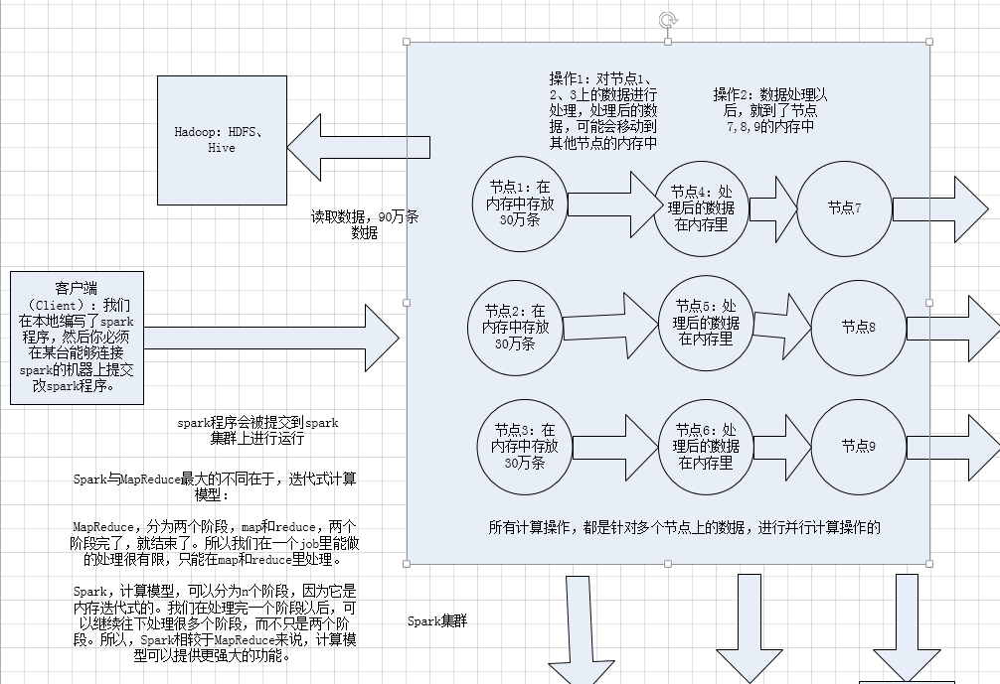
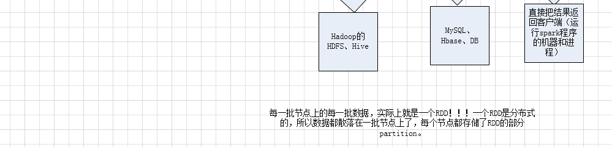
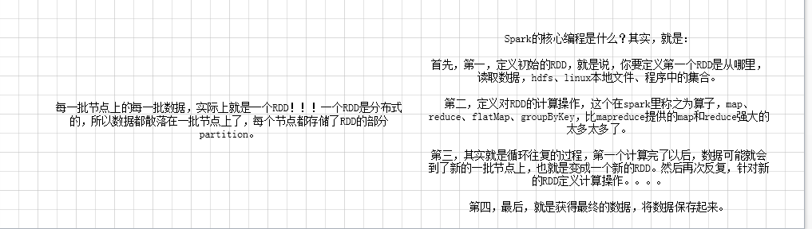
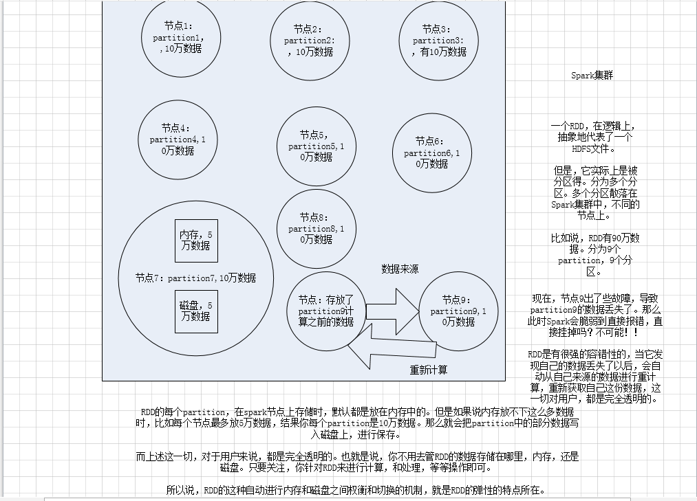

Spark基本工作原理与RDD
<!-- TOC -->

- [1、Spark的基本工作原理](#1spark的基本工作原理)
- [2、RDD以及其特点](#2rdd以及其特点)
- [3、什么是Spark开发？](#3什么是spark开发)

<!-- /TOC -->

# 1、Spark的基本工作原理

1、分布式

2、主要基于内存（少数情况基于磁盘）

3、迭代式计算

# 2、RDD以及其特点

- 1、RDD是Spark提供的核心抽象，全称为Resillient Distributed Dataset，即弹性分布式数据集。

- 2、RDD在抽象上来说是一种元素集合，包含了数据。它是被分区的，分为多个分区，每个分区分布在集群中的不同节点上，从而让RDD中的数据可以被并行操作。（分布式数据集）

- 3、RDD通常通过Hadoop上的文件，即HDFS文件或者Hive表，来进行创建；有时也可以通过应用程序中的集合来创建。

- 4、RDD最重要的特性就是，提供了容错性，可以自动从节点失败中恢复过来。即如果某个节点上的RDD partition，因为节点故障，导致数据丢了，那么RDD会自动通过自己的数据来源重新计算该partition。这一切对使用者是透明的。

- 5、RDD的数据默认情况下存放在内存中的，但是在内存资源不足时，Spark会自动将RDD数据写入磁盘。（弹性）

# 3、什么是Spark开发？

- 1、核心开发：离线批处理 / 延迟性的交互式数据处理

- 2、SQL查询：底层都是RDD和计算操作

- 3、实时计算：底层都是RDD和计算操作

