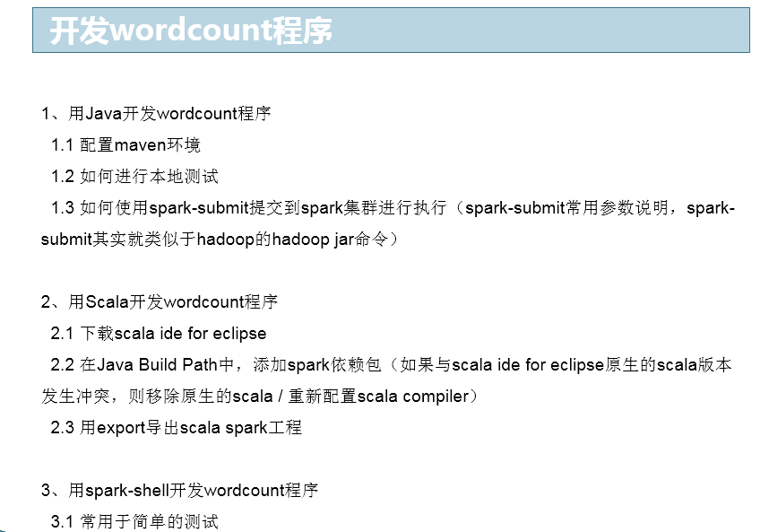
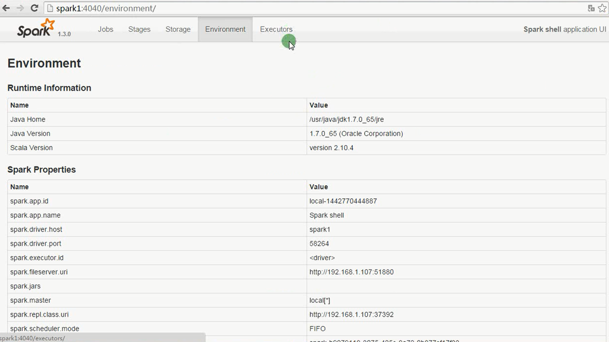
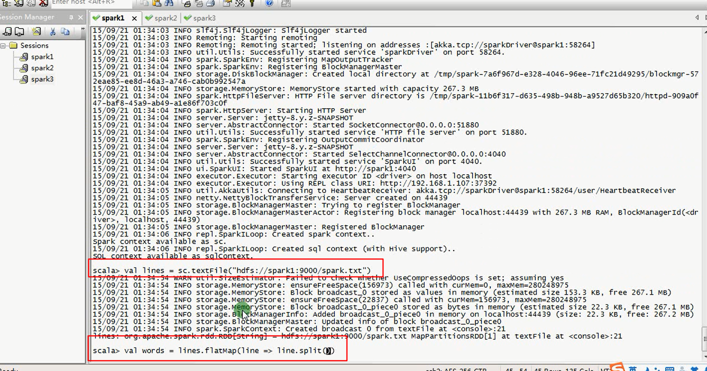
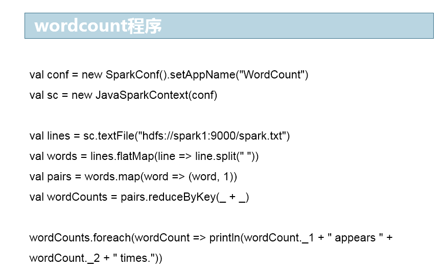
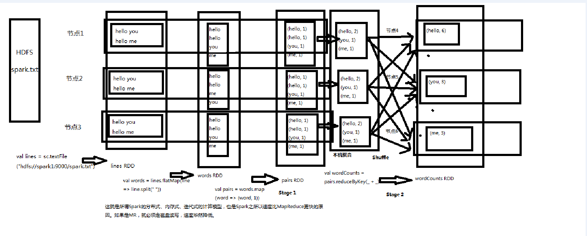

<!-- TOC -->

- [第29讲-Spark核心编程：使用Java、Scala和spark-shell开发wordcount程序](#第29讲-spark核心编程使用javascala和spark-shell开发wordcount程序)
    - [1、Scala编写Wordcount](#1scala编写wordcount)
    - [2、java编写的local模式[一般在上线前，需要在本地构造数据先验证程序的正确与否]](#2java编写的local模式一般在上线前需要在本地构造数据先验证程序的正确与否)
    - [3、java编写的cluster模式](#3java编写的cluster模式)
    - [4、spark-submit脚本](#4spark-submit脚本)
    - [5、spark-shell](#5spark-shell)
- [第30讲-Spark核心编程：wordcount程序原理深度剖析](#第30讲-spark核心编程wordcount程序原理深度剖析)

<!-- /TOC -->


# 第29讲-Spark核心编程：使用Java、Scala和spark-shell开发wordcount程序



> 测试文本

```
the cow jumped over the moon
an apple a day keeps the doctor away
four score and seven years ago
snow white and the seven dwarfs
i am at two with nature
```


## 1、Scala编写Wordcount

提交到集群的写法，提交脚本同下面的java的

```
import org.apache.spark.SparkConf
import org.apache.spark.SparkContext

/**
 * @author Administrator
 */
object WordCount {
  
  def main(args: Array[String]) {
    val conf = new SparkConf()
        .setAppName("WordCount");
    val sc = new SparkContext(conf)
  
    val lines = sc.textFile("hdfs://spark1:9000/spark.txt", 1); 
    val words = lines.flatMap { line => line.split(" ") }   
    val pairs = words.map { word => (word, 1) }   
    val wordCounts = pairs.reduceByKey { _ + _ }
    
    wordCounts.foreach(wordCount => println(wordCount._1 + " appeared " + wordCount._2 + " times."))  
  }
  
}
```

## 2、java编写的local模式[一般在上线前，需要在本地构造数据先验证程序的正确与否]


```java
package ls.spark.zhonghuashishan;

import java.util.Arrays;
import java.util.Iterator;

import org.apache.spark.SparkConf;
import org.apache.spark.api.java.JavaPairRDD;
import org.apache.spark.api.java.JavaRDD;
import org.apache.spark.api.java.JavaSparkContext;
import org.apache.spark.api.java.function.FlatMapFunction;
import org.apache.spark.api.java.function.Function2;
import org.apache.spark.api.java.function.PairFunction;
import org.apache.spark.api.java.function.VoidFunction;

import scala.Tuple2;

/**
 * 使用java开发本地测试的wordcount程序
 * @author Administrator
 *
 */
public class WordCountLocal {

	public static void main(String[] args) {
		// 编写Spark应用程序
		// 本地执行，是可以执行在eclipse中的main方法中，执行的

		// 第一步：创建SparkConf对象，设置Spark应用的配置信息
		// 使用setMaster()可以设置Spark应用程序要连接的Spark集群的master节点的url
		// 但是如果设置为local则代表，在本地运行
		SparkConf conf = new SparkConf()
				.setAppName("WordCountLocal")
				.setMaster("local");

		// 第二步：创建JavaSparkContext对象
		// 在Spark中，SparkContext是Spark所有功能的一个入口，你无论是用java、scala，甚至是python编写
			// 都必须要有一个SparkContext，它的主要作用，包括初始化Spark应用程序所需的一些核心组件，包括
			// 调度器（DAGSchedule、TaskScheduler），还会去到Spark Master节点上进行注册，等等
		// 一句话，SparkContext，是Spark应用中，可以说是最最重要的一个对象
		// 但是呢，在Spark中，编写不同类型的Spark应用程序，使用的SparkContext是不同的，如果使用scala，
			// 使用的就是原生的SparkContext对象
			// 但是如果使用Java，那么就是JavaSparkContext对象
			// 如果是开发Spark SQL程序，那么就是SQLContext、HiveContext
			// 如果是开发Spark Streaming程序，那么就是它独有的SparkContext
			// 以此类推
		JavaSparkContext sc = new JavaSparkContext(conf);

		// 第三步：要针对输入源（hdfs文件、本地文件，等等），创建一个初始的RDD
		// 输入源中的数据会打散，分配到RDD的每个partition中，从而形成一个初始的分布式的数据集
		// 我们这里呢，因为是本地测试，所以呢，就是针对本地文件
		// SparkContext中，用于根据文件类型的输入源创建RDD的方法，叫做textFile()方法
		// 在Java中，创建的普通RDD，都叫做JavaRDD
		// 在这里呢，RDD中，有元素这种概念，如果是hdfs或者本地文件呢，创建的RDD，每一个元素就相当于
		// 是文件里的一行
		//JavaRDD<String> lines = sc.textFile("C://Users//Administrator//Desktop//spark.txt");
		
		JavaRDD<String> lines = sc.textFile("spark.txt");//当前工程的根目录

		// 第四步：对初始RDD进行transformation操作，也就是一些计算操作
		// 通常操作会通过创建function，并配合RDD的map、flatMap等算子来执行
		// function，通常，如果比较简单，则创建指定Function的匿名内部类
		// 但是如果function比较复杂，则会单独创建一个类，作为实现这个function接口的类

		// 先将每一行拆分成单个的单词
		// FlatMapFunction，有两个泛型参数，分别代表了输入和输出类型
		// 我们这里呢，输入肯定是String，因为是一行一行的文本，输出，其实也是String，因为是每一行的文本
		// 这里先简要介绍flatMap算子的作用，其实就是，将RDD的一个元素，给拆分成一个或多个元素
		JavaRDD<String> words = lines.flatMap(new FlatMapFunction<String, String>() {

			private static final long serialVersionUID = 1L;

			@Override
			public Iterator<String> call(String line) throws Exception {
				return Arrays.asList(line.split(" ")).iterator();
			}

		});

		// 接着，需要将每一个单词，映射为(单词, 1)的这种格式
			// 因为只有这样，后面才能根据单词作为key，来进行每个单词的出现次数的累加
		// mapToPair，其实就是将每个元素，映射为一个(v1,v2)这样的Tuple2类型的元素
			// 如果大家还记得scala里面讲的tuple，那么没错，这里的tuple2就是scala类型，包含了两个值
		// mapToPair这个算子，要求的是与PairFunction配合使用，第一个泛型参数代表了输入类型
			// 第二个和第三个泛型参数，代表的输出的Tuple2的第一个值和第二个值的类型
		// JavaPairRDD的两个泛型参数，分别代表了tuple元素的第一个值和第二个值的类型
		JavaPairRDD<String, Integer> pairs = words.mapToPair(

				new PairFunction<String, String, Integer>() {

					private static final long serialVersionUID = 1L;

					@Override
					public Tuple2<String, Integer> call(String word) throws Exception {
						return new Tuple2<String, Integer>(word, 1);
					}

				});

		// 接着，需要以单词作为key，统计每个单词出现的次数
		// 这里要使用reduceByKey这个算子，对每个key对应的value，都进行reduce操作
		// 比如JavaPairRDD中有几个元素，分别为(hello, 1) (hello, 1) (hello, 1) (world, 1)
		// reduce操作，相当于是把第一个值和第二个值进行计算，然后再将结果与第三个值进行计算
		// 比如这里的hello，那么就相当于是，首先是1 + 1 = 2，然后再将2 + 1 = 3
		// 最后返回的JavaPairRDD中的元素，也是tuple，但是第一个值就是每个key，第二个值就是key的value
		// reduce之后的结果，相当于就是每个单词出现的次数
		JavaPairRDD<String, Integer> wordCounts = pairs.reduceByKey(

				new Function2<Integer, Integer, Integer>() {

					private static final long serialVersionUID = 1L;

					@Override
					public Integer call(Integer v1, Integer v2) throws Exception {
						return v1 + v2;
					}

				});

		// 到这里为止，我们通过几个Spark算子操作，已经统计出了单词的次数
		// 但是，之前我们使用的flatMap、mapToPair、reduceByKey这种操作，都叫做transformation操作
		// 一个Spark应用中，光是有transformation操作，是不行的，是不会执行的，必须要有一种叫做action
		// 接着，最后，可以使用一种叫做action操作的，比如说，foreach，来触发程序的执行
		wordCounts.foreach(new VoidFunction<Tuple2<String,Integer>>() {

			private static final long serialVersionUID = 1L;

			@Override
			public void call(Tuple2<String, Integer> wordCount) throws Exception {
				System.out.println(wordCount._1 + " appeared " + wordCount._2 + " times.");
			}

		});

		sc.close();
	}

}

```

输出

```
score appeared 1 times.
white appeared 1 times.
ago appeared 1 times.
two appeared 1 times.
nature appeared 1 times.
away appeared 1 times.
seven appeared 2 times.
a appeared 1 times.
am appeared 1 times.
i appeared 1 times.
with appeared 1 times.
day appeared 1 times.
keeps appeared 1 times.
at appeared 1 times.
apple appeared 1 times.
cow appeared 1 times.
over appeared 1 times.
an appeared 1 times.
doctor appeared 1 times.
moon appeared 1 times.
jumped appeared 1 times.
and appeared 2 times.
snow appeared 1 times.
years appeared 1 times.
dwarfs appeared 1 times.
four appeared 1 times.
the appeared 4 times.


```


> 下面为对输出按照单词的个数排序输出，从出现次数多的到小的


```java
package ls.spark;

import java.util.Arrays;
import java.util.Iterator;


import org.apache.spark.SparkConf;
import org.apache.spark.api.java.JavaPairRDD;
import org.apache.spark.api.java.JavaRDD;
import org.apache.spark.api.java.JavaSparkContext;
import org.apache.spark.api.java.function.FlatMapFunction;
import org.apache.spark.api.java.function.Function2;
import org.apache.spark.api.java.function.PairFunction;
import org.apache.spark.api.java.function.VoidFunction;

import scala.Tuple2;

public class WordCount {

	public static void main(String[] args) {
		SparkConf conf = new SparkConf().setAppName("WordCount").setMaster("local");
		JavaSparkContext sc = new JavaSparkContext(conf);

		JavaRDD<String> lines = sc.textFile("spark.txt");
		JavaRDD<String> words = lines.flatMap(new FlatMapFunction<String, String>(){

			private static final long serialVersionUID = 1L;

			@Override
			public Iterator<String> call(String line) throws Exception {
				String[] words = line.split(" ");
				return Arrays.asList(words).iterator();

			}

		});
		JavaPairRDD<String, Integer> pairs = words.mapToPair(new PairFunction<String, String, Integer>() {

			private static final long serialVersionUID = 1L;

			@Override
			public Tuple2<String, Integer> call(String word) throws Exception {
				return new Tuple2<String, Integer>(word, 1);
			}

		});
		JavaPairRDD<String, Integer> wcs = pairs.reduceByKey(new Function2<Integer, Integer, Integer>(){
			private static final long serialVersionUID = 1L;

			@Override
			public Integer call(Integer v1, Integer v2) throws Exception {
				return v1 + v2;
			}
		});
		JavaPairRDD<Integer, String> tempwcs = wcs.mapToPair(new PairFunction<Tuple2<String, Integer>, Integer, String>(){
			private static final long serialVersionUID = 1L;

			@Override
			public Tuple2<Integer, String> call(Tuple2<String, Integer> tuple)
					throws Exception {
				return new Tuple2<Integer, String>(tuple._2(),tuple._1());
			}

		});
		JavaPairRDD<Integer, String> sortedwcs = tempwcs.sortByKey(false);
		JavaPairRDD<String, Integer> resultwcs = sortedwcs.mapToPair(new PairFunction<Tuple2<Integer, String>, String, Integer>(){
			private static final long serialVersionUID = 1L;

			@Override
			public Tuple2<String, Integer> call(Tuple2<Integer, String> tuple)
					throws Exception {
				return new Tuple2<String, Integer>(tuple._2(),tuple._1());
			}

		});
		resultwcs.foreach(new VoidFunction<Tuple2<String, Integer>>(){
			private static final long serialVersionUID = 1L;

			@Override
			public void call(Tuple2<String, Integer> wc) throws Exception {
				System.out.println(wc._1() + "   " + wc._2());
			}
		});

		sc.close();
	}
}


```

输出

```
the   4
seven   2
and   2
score   1
white   1
ago   1
two   1
nature   1
away   1
a   1
am   1
i   1
with   1
day   1
keeps   1
at   1
apple   1
cow   1
over   1
an   1
doctor   1
moon   1
jumped   1
snow   1
years   1
dwarfs   1
four   1

```


pom文件,关注打包时的配置

```xml
<project xmlns="http://maven.apache.org/POM/4.0.0" xmlns:xsi="http://www.w3.org/2001/XMLSchema-instance"
  xsi:schemaLocation="http://maven.apache.org/POM/4.0.0 http://maven.apache.org/xsd/maven-4.0.0.xsd">
  <modelVersion>4.0.0</modelVersion>

  <groupId>cn.spark</groupId>
  <artifactId>SparkTest</artifactId>
  <version>0.0.1-SNAPSHOT</version>
  <packaging>jar</packaging>

  <name>SparkTest</name>
  <url>http://maven.apache.org</url>

  <properties>
    <project.build.sourceEncoding>UTF-8</project.build.sourceEncoding>
  </properties>

  <dependencies>
    <dependency>
      <groupId>junit</groupId>
      <artifactId>junit</artifactId>
      <version>3.8.1</version>
      <scope>test</scope>
    </dependency>
    <dependency>
	  <groupId>org.apache.spark</groupId>
	  <artifactId>spark-core_2.10</artifactId>
	  <version>1.3.0</version>
	</dependency>
	<dependency>
	  <groupId>org.apache.spark</groupId>
	  <artifactId>spark-sql_2.10</artifactId>
	  <version>1.3.0</version>
	  </dependency>
	<dependency>
	  <groupId>org.apache.spark</groupId>
	  <artifactId>spark-hive_2.10</artifactId>
	  <version>1.3.0</version>
	</dependency>
	<dependency>
	  <groupId>org.apache.spark</groupId>
	  <artifactId>spark-streaming_2.10</artifactId>
	  <version>1.3.0</version>
	</dependency>
	<dependency>
	  <groupId>org.apache.hadoop</groupId>
	  <artifactId>hadoop-client</artifactId>
	  <version>2.4.1</version>
	</dependency>
	<dependency>
	  <groupId>org.apache.spark</groupId>
	  <artifactId>spark-streaming-kafka_2.10</artifactId>
	  <version>1.3.0</version>
	</dependency>
  </dependencies>
  
  <build>
    <sourceDirectory>src/main/java</sourceDirectory>
    <testSourceDirectory>src/main/test</testSourceDirectory>

    <plugins>
      <plugin>
        <artifactId>maven-assembly-plugin</artifactId>
        <configuration>
          <descriptorRefs>
            <descriptorRef>jar-with-dependencies</descriptorRef>
          </descriptorRefs>
          <archive>
            <manifest>
              <mainClass></mainClass>
            </manifest>
          </archive>
        </configuration>
        <executions>
          <execution>
            <id>make-assembly</id>
            <phase>package</phase>
            <goals>
              <goal>single</goal>
            </goals>
          </execution>
        </executions>
      </plugin>

      <plugin>
        <groupId>org.codehaus.mojo</groupId>
        <artifactId>exec-maven-plugin</artifactId>
        <version>1.2.1</version>
        <executions>
          <execution>
            <goals>
              <goal>exec</goal>
            </goals>
          </execution>
        </executions>
        <configuration>
          <executable>java</executable>
          <includeProjectDependencies>true</includeProjectDependencies>
          <includePluginDependencies>false</includePluginDependencies>
          <classpathScope>compile</classpathScope>
          <mainClass>cn.spark.sparktest.App</mainClass>
        </configuration>
      </plugin>

      <plugin>
        <groupId>org.apache.maven.plugins</groupId>
        <artifactId>maven-compiler-plugin</artifactId>
        <configuration>
          <source>1.6</source>
          <target>1.6</target>
        </configuration>
      </plugin>

    </plugins>
  </build>
</project>

```


## 3、java编写的cluster模式

```java
package ls.spark.zhonghuashishan;

import java.util.Arrays;
import java.util.Iterator;

import org.apache.spark.SparkConf;
import org.apache.spark.api.java.JavaPairRDD;
import org.apache.spark.api.java.JavaRDD;
import org.apache.spark.api.java.JavaSparkContext;
import org.apache.spark.api.java.function.FlatMapFunction;
import org.apache.spark.api.java.function.Function2;
import org.apache.spark.api.java.function.PairFunction;
import org.apache.spark.api.java.function.VoidFunction;

import scala.Tuple2;

/**
 * 将java开发的wordcount程序部署到spark集群上运行
 * @author Administrator
 *
 */
public class WordCountCluster {

	public static void main(String[] args) {
		// 如果要在spark集群上运行，需要修改的，只有两个地方
		// 第一，将SparkConf的setMaster()方法给删掉，默认它自己会去连接
		// 第二，我们针对的不是本地文件了，修改为hadoop hdfs上的真正的存储大数据的文件

		// 实际执行步骤：
		// 1、将spark.txt文件上传到hdfs上去
		// 2、使用我们最早在pom.xml里配置的maven插件，对spark工程进行打包
		// 3、将打包后的spark工程jar包，上传到机器上执行
		// 4、编写spark-submit脚本
		// 5、执行spark-submit脚本，提交spark应用到集群执行

		SparkConf conf = new SparkConf()
				.setAppName("WordCountCluster");

		JavaSparkContext sc = new JavaSparkContext(conf);

		JavaRDD<String> lines = sc.textFile("hdfs://spark1:9000/spark.txt");

		JavaRDD<String> words = lines.flatMap(new FlatMapFunction<String, String>() {

			private static final long serialVersionUID = 1L;

			@Override
			public Iterator<String> call(String line) throws Exception {
				return Arrays.asList(line.split(" ")).iterator();
			}

		});

		JavaPairRDD<String, Integer> pairs = words.mapToPair(

				new PairFunction<String, String, Integer>() {

					private static final long serialVersionUID = 1L;

					@Override
					public Tuple2<String, Integer> call(String word) throws Exception {
						return new Tuple2<String, Integer>(word, 1);
					}

				});

		JavaPairRDD<String, Integer> wordCounts = pairs.reduceByKey(

				new Function2<Integer, Integer, Integer>() {

					private static final long serialVersionUID = 1L;

					@Override
					public Integer call(Integer v1, Integer v2) throws Exception {
						return v1 + v2;
					}

				});

		wordCounts.foreach(new VoidFunction<Tuple2<String,Integer>>() {

			private static final long serialVersionUID = 1L;

			@Override
			public void call(Tuple2<String, Integer> wordCount) throws Exception {
				System.out.println(wordCount._1 + " appeared " + wordCount._2 + " times.");
			}

		});

		sc.close();
	}

}


```

## 4、spark-submit脚本

提交上面3集群模式代码的jar包，执行spark-submit脚本，提交spark应用到集群执行


Wordcount.sh 脚本内容

```
/usr/local/spark/bin/spark-submit \
--class cn.spark.sparktest.core.WordCountCluster \
--num-executors 3 \
--driver-memory 100m \
--executor-memory 100m \
--executor-cores 3 \
/usr/local/SparkTest-0.0.1-SNAPSHOT-jar-with-dependencies.jar \

```


## 5、spark-shell

直接在spark节点执行spark-shell进入命令行交互模式，一般用于测试







# 第30讲-Spark核心编程：wordcount程序原理深度剖析






每个节点处理一个RDD中的一个partition

以Wordcount为例，会先在本地聚合，然后再按住key进行shuffle跨界的计算。


shuffle也就是把相同的key汇聚在一个节点进行reduce进行聚合。

这里假如数据分布不均匀会造成shuffle过程中大量的数据在一个节点进行reduce，导致数据计算很慢。