<!-- TOC -->

- [第41讲-Spark内核源码深度剖析：Spark内核架构深度剖析](#第41讲-spark内核源码深度剖析spark内核架构深度剖析)
    - [Spark内核架构](#spark内核架构)
- [第42讲-Spark内核源码深度剖析：宽依赖与窄依赖深度剖析](#第42讲-spark内核源码深度剖析宽依赖与窄依赖深度剖析)
- [第43讲-Spark内核源码深度剖析：基于Yarn的两种提交模式深度剖析](#第43讲-spark内核源码深度剖析基于yarn的两种提交模式深度剖析)
- [第44讲-Spark内核源码深度剖析：SparkContext原理剖析与源码分析](#第44讲-spark内核源码深度剖析sparkcontext原理剖析与源码分析)
- [第45讲-Spark内核源码深度剖析：Master主备切换机制原理剖析与源码分析](#第45讲-spark内核源码深度剖析master主备切换机制原理剖析与源码分析)
- [第46讲-Spark内核源码深度剖析：Master注册机制原理剖析与源码分析](#第46讲-spark内核源码深度剖析master注册机制原理剖析与源码分析)
- [第47讲-Spark内核源码深度剖析：Master状态改变处理机制原理剖析与源码分析](#第47讲-spark内核源码深度剖析master状态改变处理机制原理剖析与源码分析)
- [第48讲-Spark内核源码深度剖析：Master资源调度算法原理剖析与源码分析](#第48讲-spark内核源码深度剖析master资源调度算法原理剖析与源码分析)
- [第49讲-Spark内核源码深度剖析：Worker原理剖析与源码分析](#第49讲-spark内核源码深度剖析worker原理剖析与源码分析)
- [第50讲-Spark内核源码深度剖析：job触发流程原理剖析与源码分析](#第50讲-spark内核源码深度剖析job触发流程原理剖析与源码分析)
- [第51讲-Spark内核源码深度剖析：DAGScheduler原理剖析与源码分析](#第51讲-spark内核源码深度剖析dagscheduler原理剖析与源码分析)
- [第52讲-Spark内核源码深度剖析：TaskScheduler原理剖析与源码分析](#第52讲-spark内核源码深度剖析taskscheduler原理剖析与源码分析)
- [第53讲-Spark内核源码深度剖析：Executor原理剖析与源码分析](#第53讲-spark内核源码深度剖析executor原理剖析与源码分析)
- [第54讲-Spark内核源码深度剖析：Task原理剖析与源码分析](#第54讲-spark内核源码深度剖析task原理剖析与源码分析)
- [第55讲-Spark内核源码深度剖析：Shuffle原理剖析与源码分析](#第55讲-spark内核源码深度剖析shuffle原理剖析与源码分析)
    - [1、Shuffle原理剖析与源码分析](#1shuffle原理剖析与源码分析)
    - [2、Spark Shuffle操作的两个特点](#2spark-shuffle操作的两个特点)
- [第56讲-Spark内核源码深度剖析：BlockManager原理剖析与源码分析](#第56讲-spark内核源码深度剖析blockmanager原理剖析与源码分析)
- [第57讲-Spark内核源码深度剖析：CacheManager原理剖析与源码分析](#第57讲-spark内核源码深度剖析cachemanager原理剖析与源码分析)
- [第58讲-Spark内核源码深度剖析：Checkpoint原理剖析](#第58讲-spark内核源码深度剖析checkpoint原理剖析)
    - [1、Checkpoint是什么？](#1checkpoint是什么)
    - [2、Checkpoint的功能](#2checkpoint的功能)
    - [3、Checkpoint原理剖析](#3checkpoint原理剖析)

<!-- /TOC -->

# 第41讲-Spark内核源码深度剖析：Spark内核架构深度剖析

- 1、已经达到可以熟练进行Spark编程的程度。
- 2、Spark内核源码的研究，是Spark学习的承上启下阶段。
- 3、内核源码研究透彻之后，才可以通往Spark高手 / Spark精通的道路。
- 4、才可以继续进行Spark性能优化的学习。
- 5、才可以在实际工作中，在Spark应用报错出现故障时，读懂log，通过log分析问题的原因，甚至根据log直接到源码中寻找答案，最后解决线上故障。

## Spark内核架构

- 1、Application
- 2、spark-submit
- 3、Driver
- 4、SparkContext
- 5、Master
- 6、Worker
- 7、Executor
- 8、Job
- 9、DAGScheduler
- 10、TaskScheduler
- 11、ShuffleMapTask and ResultTask


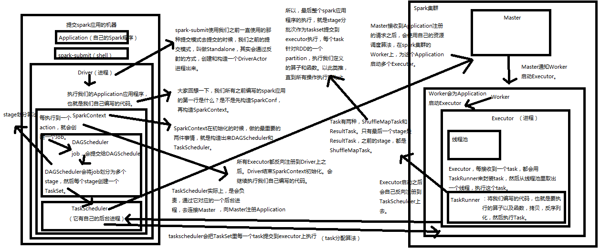


# 第42讲-Spark内核源码深度剖析：宽依赖与窄依赖深度剖析

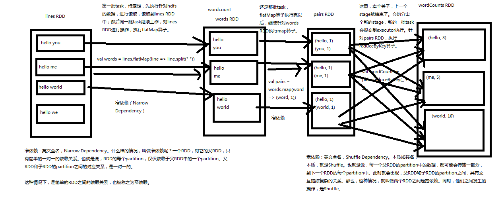


# 第43讲-Spark内核源码深度剖析：基于Yarn的两种提交模式深度剖析

> Spark的三种提交模式

- 1、Spark内核架构，其实就是第一种模式，standalone模式，基于Spark自己的Master-Worker集群。

- 2、第二种，是基于YARN的yarn-cluster模式。

- 3、第三种，是基于YARN的yarn-client模式。

- 4、如果，你要切换到第二种和第三种模式，很简单，将我们之前用于提交spark应用程序的spark-submit脚本，加上--master参数，设置为yarn-cluster，或yarn-client，即可。如果你没设置，那么，就是standalone模式。


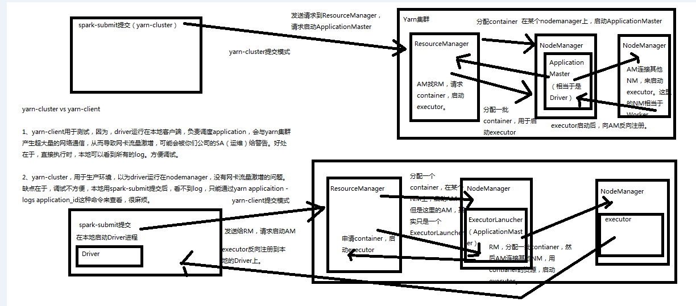


# 第44讲-Spark内核源码深度剖析：SparkContext原理剖析与源码分析

- 1、TaskScheduler
- 2、DAGScheduler
- 3、SparkUI

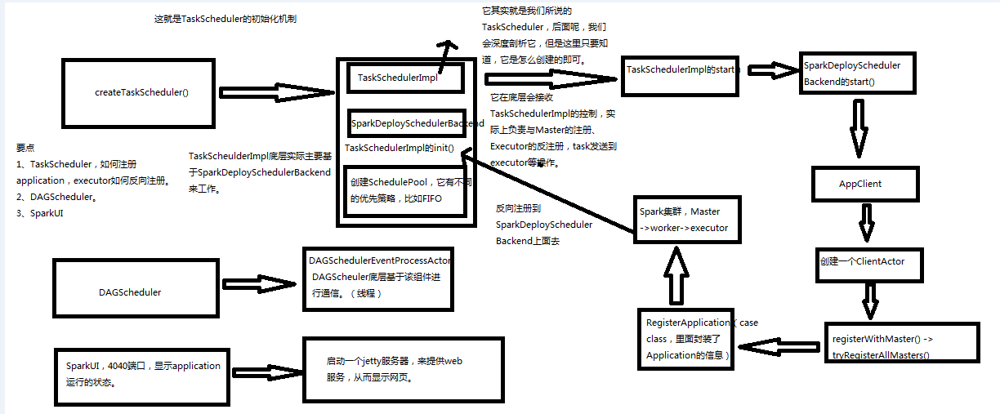


# 第45讲-Spark内核源码深度剖析：Master主备切换机制原理剖析与源码分析

- 1、主备切换机制原理剖析与源码分析
- 2、注册机制原理剖析与源码分析
- 3、状态改变处理机制源码分析
- 4、资源调度机制源码分析（schedule()，两种资源调度算法）

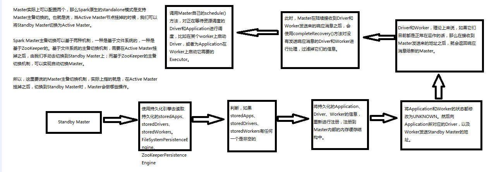


# 第46讲-Spark内核源码深度剖析：Master注册机制原理剖析与源码分析

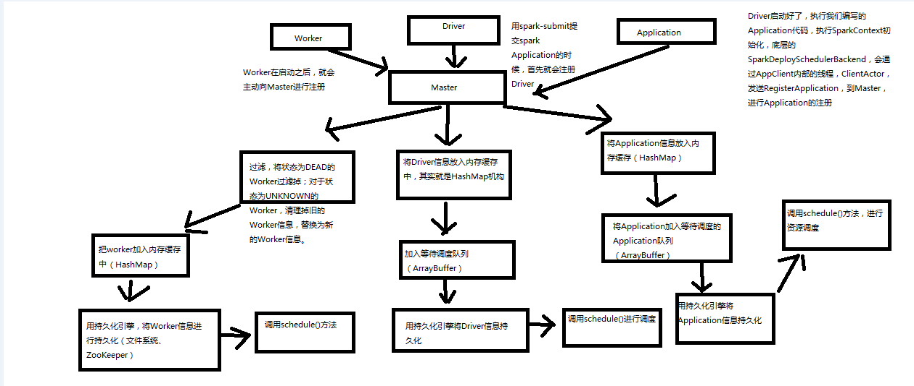


# 第47讲-Spark内核源码深度剖析：Master状态改变处理机制原理剖析与源码分析

无

# 第48讲-Spark内核源码深度剖析：Master资源调度算法原理剖析与源码分析

无

# 第49讲-Spark内核源码深度剖析：Worker原理剖析与源码分析

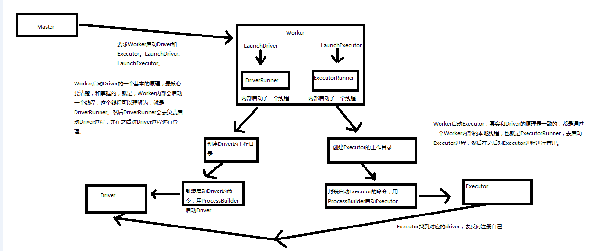


# 第50讲-Spark内核源码深度剖析：job触发流程原理剖析与源码分析

> wordcount

```
val lines = sc.textFile()
val words = lines.flatMap(line => line.split(" "))
val pairs = words.map(word => (word, 1))

// 其实RDD里是没有reduceByKey的，因此对RDD调用reduceByKey()方法的时候，会触发scala的隐式转换；此时就会在作用域内，寻找隐式转换，会在RDD中找到rddToPairRDDFunctions()隐式转换，然后将RDD转换为PairRDDFunctions。
// 接着会调用PairRDDFunctions中的reduceByKey()方法
val counts = pairs.reduceByKey(_ + _)

counts.foreach(count => println(count._1 + ": " + count._2))

```


# 第51讲-Spark内核源码深度剖析：DAGScheduler原理剖析与源码分析

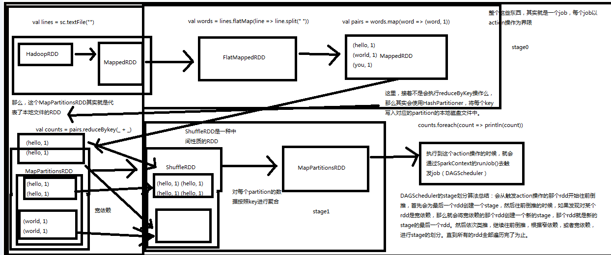

# 第52讲-Spark内核源码深度剖析：TaskScheduler原理剖析与源码分析

# 第53讲-Spark内核源码深度剖析：Executor原理剖析与源码分析

- 1、CoarseGrainedExecutorBackend
- 2、Executor注册机制
- 3、启动task机制

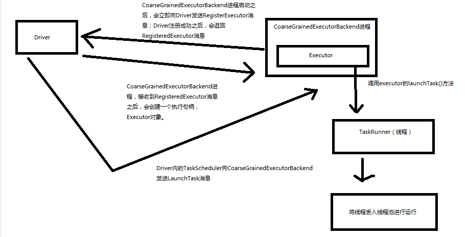

# 第54讲-Spark内核源码深度剖析：Task原理剖析与源码分析

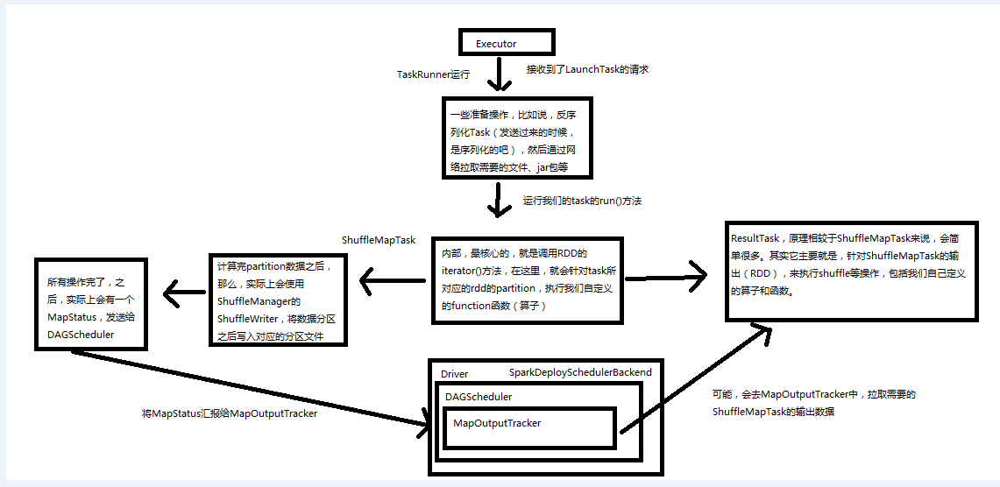

# 第55讲-Spark内核源码深度剖析：Shuffle原理剖析与源码分析

## 1、Shuffle原理剖析与源码分析

- 1、在Spark中，什么情况下，会发生shuffle？reduceByKey、groupByKey、sortByKey、countByKey、join、cogroup等操作。
- 2、默认的Shuffle操作的原理剖析
- 3、优化后的Shuffle操作的原理剖析
- 4、Shuffle相关源码分析


## 2、Spark Shuffle操作的两个特点

> 第一个特点，

在Spark早期版本中，那个bucket缓存是非常非常重要的，因为需要将一个ShuffleMapTask所有的数据都写入内存缓存之后，才会刷新到磁盘。但是这就有一个问题，如果map side数据过多，那么很容易造成内存溢出。所以spark在新版本中，优化了，默认那个内存缓存是100kb，然后呢，写入一点数据达到了刷新到磁盘的阈值之后，就会将数据一点一点地刷新到磁盘。

这种操作的优点，是不容易发生内存溢出。缺点在于，如果内存缓存过小的话，那么可能发生过多的磁盘写io操作。所以，这里的内存缓存大小，是可以根据实际的业务情况进行优化的。

> 第二个特点，
    
与MapReduce完全不一样的是，MapReduce它必须将所有的数据都写入本地磁盘文件以后，才能启动reduce操作，来拉取数据。为什么？因为mapreduce要实现默认的根据key的排序！所以要排序，肯定得写完所有数据，才能排序，然后reduce来拉取。
    
但是Spark不需要，spark默认情况下，是不会对数据进行排序的。因此ShuffleMapTask每写入一点数据，ResultTask就可以拉取一点数据，然后在本地执行我们定义的聚合函数和算子，进行计算。
    
spark这种机制的好处在于，速度比mapreduce快多了。但是也有一个问题，mapreduce提供的reduce，是可以处理每个key对应的value上的，很方便。但是spark中，由于这种实时拉取的机制，因此提供不了，直接处理key对应的values的算子，只能通过groupByKey，先shuffle，有一个MapPartitionsRDD，然后用map算子，来处理每个key对应的values。就没有mapreduce的计算模型那么方便。

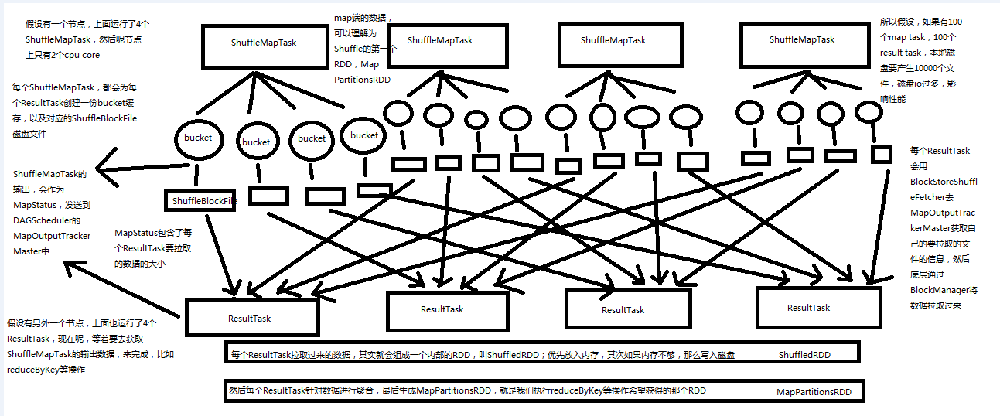

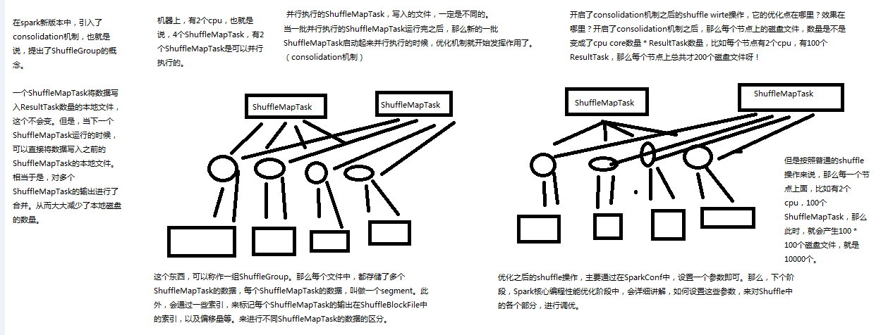


# 第56讲-Spark内核源码深度剖析：BlockManager原理剖析与源码分析

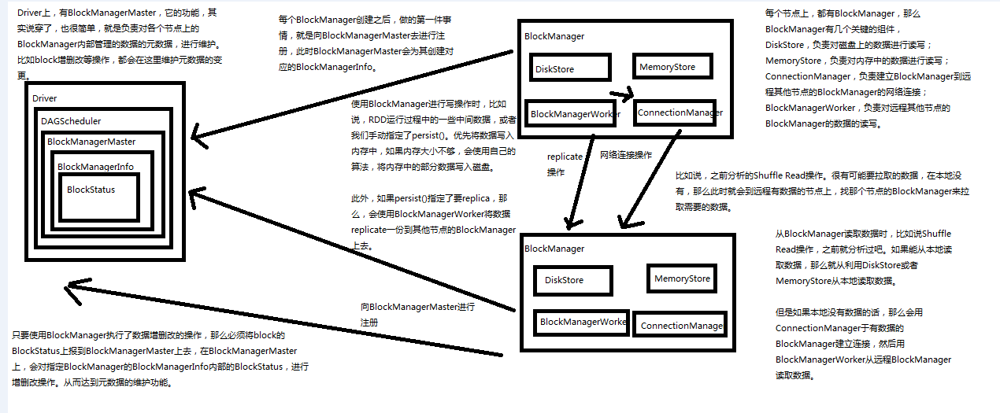

# 第57讲-Spark内核源码深度剖析：CacheManager原理剖析与源码分析

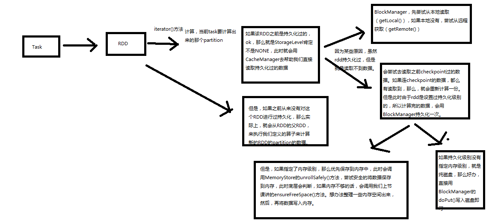

# 第58讲-Spark内核源码深度剖析：Checkpoint原理剖析

## 1、Checkpoint是什么？

Checkpoint，是Spark提供的一个比较高级的功能。有的时候啊，比如说，我们的Spark应用程序，特别的复杂，然后呢，从初始的RDD开始，到最后整个应用程序完成，有非常多的步骤，比如超过20个transformation操作。而且呢，整个应用运行的时间也特别长，比如通常要运行1~5个小时。

在上述情况下，就比较适合使用checkpoint功能。因为，对于特别复杂的Spark应用，有很高的风险，会出现某个要反复使用的RDD，因为节点的故障，虽然之前持久化过，但是还是导致数据丢失了。那么也就是说，出现失败的时候，没有容错机制，所以当后面的transformation操作，又要使用到该RDD时，就会发现数据丢失了（CacheManager），此时如果没有进行容错处理的话，那么可能就又要重新计算一次数据。

简而言之，针对上述情况，整个Spark应用程序的容错性很差。


## 2、Checkpoint的功能

所以，针对上述的复杂Spark应用的问题（没有容错机制的问题）。就可以使用checkponit功能。

checkpoint功能是什么意思？checkpoint就是说，对于一个复杂的RDD chain，我们如果担心中间某些关键的，在后面会反复几次使用的RDD，可能会因为节点的故障，导致持久化数据的丢失，那么就可以针对该RDD格外启动checkpoint机制，实现容错和高可用。

checkpoint，就是说，首先呢，要调用SparkContext的setCheckpointDir()方法，设置一个容错的文件系统的目录，比如说HDFS；然后，对RDD调用调用checkpoint()方法。之后，在RDD所处的job运行结束之后，会启动一个单独的job，来将checkpoint过的RDD的数据写入之前设置的文件系统，进行高可用、容错的类持久化操作。

那么此时，即使在后面使用RDD时，它的持久化的数据，不小心丢失了，但是还是可以从它的checkpoint文件中直接读取其数据，而不需要重新计算。（CacheManager）


## 3、Checkpoint原理剖析

- 1、如何进行checkpoint？
    SparkContext.setCheckpointDir()
    RDD.checkpoint()

- 2、Checkpoint原理剖析

- 3、Checkpoint与持久化的不同：lineage的改变

- 4、RDD.iterator()：读取checkpoint数据

- 5、给要checkpoint的RDD，先进行persist(StorageLevel.DISK_ONLY)


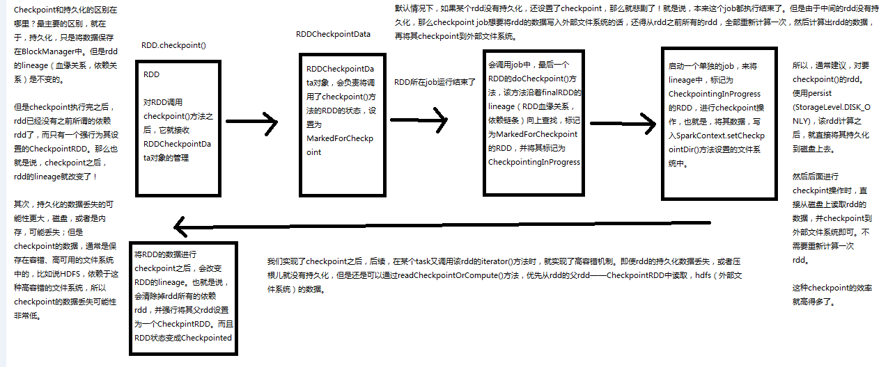

