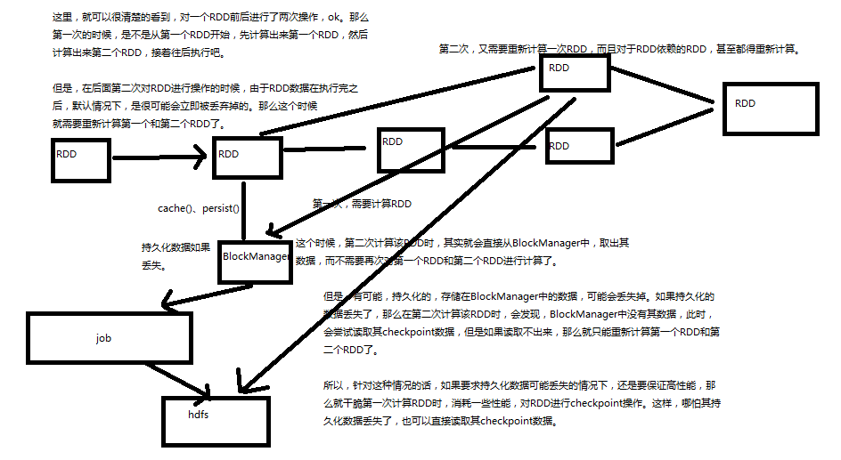
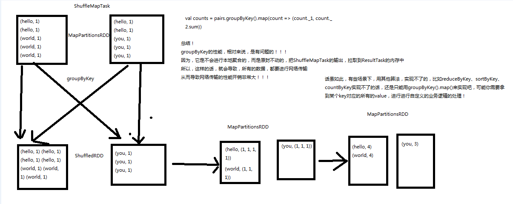
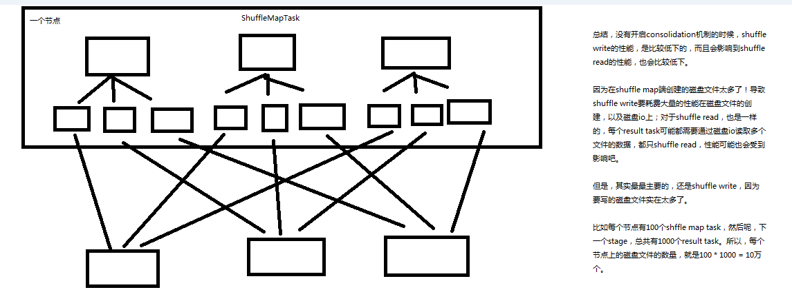

<!-- TOC -->

- [第59讲-Spark性能优化：性能优化概览](#第59讲-spark性能优化性能优化概览)
    - [1、Spark性能优化概览](#1spark性能优化概览)
    - [2、Spark性能优化技术](#2spark性能优化技术)
    - [3、Spark性能优化的重要性](#3spark性能优化的重要性)
- [第60讲-Spark性能优化：诊断内存的消耗](#第60讲-spark性能优化诊断内存的消耗)
    - [1、内存都花费在哪里了？](#1内存都花费在哪里了)
    - [2、如何判断你的程序消耗了多少内存？](#2如何判断你的程序消耗了多少内存)
- [第61讲-Spark性能优化：高性能序列化类库](#第61讲-spark性能优化高性能序列化类库)
    - [1、数据序列化概述](#1数据序列化概述)
    - [2、Spark提供的两种序列化机制](#2spark提供的两种序列化机制)
    - [3、如何使用Kryo序列化机制](#3如何使用kryo序列化机制)
    - [4、优化Kryo类库的使用](#4优化kryo类库的使用)
    - [5、在什么场景下使用Kryo序列化类库？](#5在什么场景下使用kryo序列化类库)
- [第62讲-Spark性能优化：优化数据结构](#第62讲-spark性能优化优化数据结构)
    - [1、如何优化数据结构](#1如何优化数据结构)
- [第63讲-Spark性能优化：对多次使用的RDD进行持久化或Checkpoint](#第63讲-spark性能优化对多次使用的rdd进行持久化或checkpoint)
- [第64讲-Spark性能优化：使用序列化的持久化级别](#第64讲-spark性能优化使用序列化的持久化级别)
- [第65讲-Spark性能优化：Java虚拟机垃圾回收调优](#第65讲-spark性能优化java虚拟机垃圾回收调优)
    - [1、Java虚拟机垃圾回收调优的背景](#1java虚拟机垃圾回收调优的背景)
    - [2、监测垃圾回收](#2监测垃圾回收)
    - [3、优化executor内存比例](#3优化executor内存比例)
    - [4、高级垃圾回收调优](#4高级垃圾回收调优)
- [第66讲-Spark性能优化：提高并行度](#第66讲-spark性能优化提高并行度)
- [第67讲-Spark性能优化：广播共享数据](#第67讲-spark性能优化广播共享数据)
- [第68讲-Spark性能优化：数据本地化](#第68讲-spark性能优化数据本地化)
    - [1、数据本地化背景](#1数据本地化背景)
    - [2、数据本地化优化](#2数据本地化优化)
- [第69讲-Spark性能优化：reduceByKey和groupByKey](#第69讲-spark性能优化reducebykey和groupbykey)
- [第70讲-Spark性能优化：shuffle性能优化](#第70讲-spark性能优化shuffle性能优化)

<!-- /TOC -->

# 第59讲-Spark性能优化：性能优化概览

## 1、Spark性能优化概览

由于Spark的计算本质是基于内存的，所以Spark性能程序的性能可能因为集群中的任何因素出现瓶颈：CPU、网络带宽、或者是内存。如果内存能够容纳得下所有的数据，那么网络传输和通信就会导致性能出现瓶颈。但是如果内存比较紧张，不足以放下所有的数据（比如在针对10亿以上的数据量进行计算时），还是需要对内存的使用进行性能优化的，比如说使用一些手段来减少内存的消耗。

Spark性能优化，其实主要就是在于对内存的使用进行调优。因为通常情况下来说，如果你的Spark应用程序计算的数据量比较小，并且你的内存足够使用，那么只要运维可以保障网络通常，一般是不会有大的性能问题的。但是Spark应用程序的性能问题往往出现在针对大数据量（比如10亿级别）进行计算时出现，因此通常来说，Spark性能优化，主要是对内存进行性能优化。当然，除了内存调优之外，还有很多手段可以优化Spark应用程序的性能。

## 2、Spark性能优化技术

Spark的性能优化，主要手段包括：
- 1、使用高性能序列化类库
- 2、优化数据结构
- 3、对多次使用的RDD进行持久化 / Checkpoint
- 4、使用序列化的持久化级别
- 5、Java虚拟机垃圾回收调优
- 6、提高并行度
- 7、广播共享数据
- 8、数据本地化
- 9、reduceByKey和groupByKey的合理使用
- 10、Shuffle调优（核心中的核心，重中之重）

## 3、Spark性能优化的重要性

实际上Spark到目前为止，在大数据业界的影响力和覆盖度，还远没有达到Hadoop的水平，——虽然说，我们之前一再强调，Spark Core、Spark SQL、Spark Streaming，可以替代MapReduce、Hive查询引擎、Storm。但是事实就是，Spark还没有达到已经替代了它们的地步。

根据我在研究Spark，并且在一线使用Spark，与大量行业内的大数据相关从业人员沟通的情况来看。Spark最大的优点，其实也是它目前最大的问题——基于内存的计算模型。Spark由于使用了基于内存的计算模型，因此导致了其稳定性，远远不如Hadoop。虽然我也很喜欢和热爱Spark，但是这就是事实，Spark的速度的确达到了hadoop的几倍、几十倍、甚至上百倍（极端情况）。但是基于内存的模型，导致它经常出现各种OOM（内存溢出）、内部异常等问题。

说一个亲身经历的例子，曾经用Spark改写几个复杂的MapReduce程序，虽然MapReduce很慢，但是它很稳定，至少慢慢跑，是可以跑出来数据的。但是用Spark Core很快就改写完了程序，问题是，在整整半个月之内，Spark程序根本跑不起来，因为数据量太大，10亿+。导致它出现了各种各样的问题，包括OOM、文件丢失、task lost、内部异常等等各种问题。最后耗费了大量时间，最一个spark程序进行了大量的性能调优，才最终让它可以跑起来。

的确，用了Spark，比MapReduce的速度快了十倍，但是付出的代价是惨痛的，花了整整一个月的时间做这个事情。

因此，当我在公司推广Spark的使用时，很多人都不无担心地说，听说Spark还不够稳定，经常出现问题，比如OOM等，它的稳定性，导致业界的人们不太敢轻易尝试它，在复杂的大数据系统，要求极高稳定性的线程系统中使用。——当然，如果你就是开发一个针对公司内部的，稳定性要求不高的系统，当然不用担心这个问题。

所以，我认为，Spark的基于内存的本质，就导致了上述的问题，导致了它目前还无法完全提到Hadoop中的某些技术。

但是，纵然Spark有各种问题，其优点就是缺点，缺点也是优点——它实在是很快。优秀的Spark应用程序，性能完全可以达到MapReduce、Hive查询引擎的数倍、甚至数十倍。因此，纵使有各种担忧，Spark还是吸引着大量的人们以及公司去探索，和尝试攻克它，使用它，让它为我们所用，用它开放更棒的大数据系统。

因此，正是基于上述背景，Spark工程师的要求是非常高的。比如我们这里，我们正在用Spark开发大型复杂的线上大数据系统，所以针对Spark的招聘，我们是要求Spark工程师必须精通Spark内核源码，能够对程序进行性能优化。——打个广告，实际上，我认为如果能精通本系列课程，那么成为一个行业内优秀的Spark工程师，是一定没有问题的。

所以，Spark虽然有它的问题所在，但是它的优势还是让它以极快的速度，极强的劲头在行业内快速发展。行业内各个公司，也大量缺乏着优秀的Spark工程师。而如果是想转型进行Spark开发的朋友，基于上述种种背景，就应该明白了，Spark性能优化，对于你找工作，对于你在实际工作中解决问题的重要性了！

要成为优秀的Spark工程师，顺利实现转型，那么就必须能够彻底精通Spark内核源码，能够基于对Spark内核原理的深度理解，对线上复杂的Spark大数据系统 / 程序出现的报错和故障，进行排查和解决；能够对运行较慢的Spark应用程序，进行精准的性能问题排查，并且对症下游，针对各种性能问题，使用对应的技术手段，进行解决。

只有这样，我认为，你才能够顺利实现转型，出去成功面试Spark工程师，甚至是高级Spark工程师的岗位。才能在实际工作中，真正让Spark发挥出其巨大的威力。而不仅仅是处于对新技术的喜爱，对Spark进行浅尝辄止的学习——那是没有任何用的。

不精通Spark内核源码，不精通Spark性能优化，也许你能找到Spark大数据的工作，但是通常情况下，也只能进入比较缺人的小公司。要进入大公司，找到更好的职业机会，那么就一起在精通了之前的Spark内核源码深度剖析阶段之后，来进入Spark性能优化阶段的学习吧。

# 第60讲-Spark性能优化：诊断内存的消耗

## 1、内存都花费在哪里了？

- 1、每个Java对象，都有一个对象头，会占用16个字节，主要是包括了一些对象的元信息，比如指向它的类的指针。如果一个对象本身很小，比如就包括了一个int类型的field，那么它的对象头实际上比对象自己还要大。

- 2、Java的String对象，会比它内部的原始数据，要多出40个字节。因为它内部使用char数组来保存内部的字符序列的，并且还得保存诸如数组长度之类的信息。而且因为String使用的是UTF-16编码，所以每个字符会占用2个字节。比如，包含10个字符的String，会占用60个字节。

- 3、Java中的集合类型，比如HashMap和LinkedList，内部使用的是链表数据结构，所以对链表中的每一个数据，都使用了Entry对象来包装。Entry对象不光有对象头，还有指向下一个Entry的指针，通常占用8个字节。

- 4、元素类型为原始数据类型（比如int）的集合，内部通常会使用原始数据类型的包装类型，比如Integer，来存储元素。

## 2、如何判断你的程序消耗了多少内存？

这里有一个非常简单的办法来判断，你的spark程序消耗了多少内存。

- 1、首先，自己设置RDD的并行度，有两种方式：要不然，在parallelize()、textFile()等方法中，传入第二个参数，设置RDD的task / partition的数量；要不然，用SparkConf.set()方法，设置一个参数，spark.default.parallelism，可以统一设置这个application所有RDD的partition数量。

- 2、其次，在程序中将RDD cache到内存中，调用RDD.cache()方法即可。

- 3、最后，观察Driver的log，你会发现类似于：“INFO BlockManagerMasterActor: Added rdd_0_1 in memory on mbk.local:50311 (size: 717.5 KB, free: 332.3 MB)”的日志信息。这就显示了每个partition占用了多少内存。

- 4、将这个内存信息乘以partition数量，即可得出RDD的内存占用量。

# 第61讲-Spark性能优化：高性能序列化类库

## 1、数据序列化概述

在任何分布式系统中，序列化都是扮演着一个重要的角色的。如果使用的序列化技术，在执行序列化操作的时候很慢，或者是序列化后的数据还是很大，那么会让分布式应用程序的性能下降很多。所以，进行Spark性能优化的第一步，就是进行序列化的性能优化。

Spark自身默认就会在一些地方对数据进行序列化，比如Shuffle。还有就是，如果我们的算子函数使用到了外部的数据（比如Java内置类型，或者自定义类型），那么也需要让其可序列化。

而Spark自身对于序列化的便捷性和性能进行了一个取舍和权衡。默认，Spark倾向于序列化的便捷性，使用了Java自身提供的序列化机制——基于ObjectInputStream和ObjectOutputStream的序列化机制。因为这种方式是Java原生提供的，很方便使用。

但是问题是，Java序列化机制的性能并不高。序列化的速度相对较慢，而且序列化以后的数据，还是相对来说比较大，还是比较占用内存空间。因此，如果你的Spark应用程序对内存很敏感，那么，实际上默认的Java序列化机制并不是最好的选择。

## 2、Spark提供的两种序列化机制

Spark实际上提供了两种序列化机制，它只是默认使用了第一种：

- 1、Java序列化机制

默认情况下，Spark使用Java自身的ObjectInputStream和ObjectOutputStream机制进行对象的序列化。只要你的类实现了Serializable接口，那么都是可以序列化的。而且Java序列化机制是提供了自定义序列化支持的，只要你实现Externalizable接口即可实现自己的更高性能的序列化算法。Java序列化机制的速度比较慢，而且序列化后的数据占用的内存空间比较大。

- 2、Kryo序列化机制

Spark也支持使用Kryo类库来进行序列化。Kryo序列化机制比Java序列化机制更快，而且序列化后的数据占用的空间更小，通常比Java序列化的数据占用的空间要小10倍。Kryo序列化机制之所以不是默认序列化机制的原因是，有些类型虽然实现了Seriralizable接口，但是它也不一定能够进行序列化；此外，如果你要得到最佳的性能，Kryo还要求你在Spark应用程序中，对所有你需要序列化的类型都进行注册。

## 3、如何使用Kryo序列化机制

如果要使用Kryo序列化机制，首先要用SparkConf设置一个参数，使用new SparkConf().set("spark.serializer", "org.apache.spark.serializer.KryoSerializer")即可，即将Spark的序列化器设置为KryoSerializer。这样，Spark在内部的一些操作，比如Shuffle，进行序列化时，就会使用Kryo类库进行高性能、快速、更低内存占用量的序列化了。

使用Kryo时，它要求是需要序列化的类，是要预先进行注册的，以获得最佳性能——如果不注册的话，那么Kryo必须时刻保存类型的全限定名，反而占用不少内存。Spark默认是对Scala中常用的类型自动注册了Kryo的，都在AllScalaRegistry类中。

但是，比如自己的算子中，使用了外部的自定义类型的对象，那么还是需要将其进行注册。

（实际上，下面的写法是错误的，因为counter不是共享的，所以累加的功能是无法实现的）
val counter = new Counter();
val numbers = sc.parallelize(Array(1, 2, 3, 4, 5))
numbers.foreach(num => counter.add(num));

如果要注册自定义的类型，那么就使用如下的代码，即可：

Scala版本：
val conf = new SparkConf().setMaster(...).setAppName(...)
conf.registerKryoClasses(Array(classOf[Counter] ))
val sc = new SparkContext(conf)

Java版本：
SparkConf conf = new SparkConf().setMaster(...).setAppName(...)
conf.registerKryoClasses(Counter.class)
JavaSparkContext sc = new JavaSparkContext(conf)

## 4、优化Kryo类库的使用

1、优化缓存大小
如果注册的要序列化的自定义的类型，本身特别大，比如包含了超过100个field。那么就会导致要序列化的对象过大。此时就需要对Kryo本身进行优化。因为Kryo内部的缓存可能不够存放那么大的class对象。此时就需要调用SparkConf.set()方法，设置spark.kryoserializer.buffer.mb参数的值，将其调大。

默认情况下它的值是2，就是说最大能缓存2M的对象，然后进行序列化。可以在必要时将其调大。比如设置为10。

2、预先注册自定义类型
虽然不注册自定义类型，Kryo类库也能正常工作，但是那样的话，对于它要序列化的每个对象，都会保存一份它的全限定类名。此时反而会耗费大量内存。因此通常都建议预先注册号要序列化的自定义的类。

## 5、在什么场景下使用Kryo序列化类库？

首先，这里讨论的都是Spark的一些普通的场景，一些特殊的场景，比如RDD的持久化，在后面会讲解。这里先不说。

那么，这里针对的Kryo序列化类库的使用场景，就是算子函数使用到了外部的大数据的情况。比如说吧，我们在外部定义了一个封装了应用所有配置的对象，比如自定义了一个MyConfiguration对象，里面包含了100m的数据。然后，在算子函数里面，使用到了这个外部的大对象。

此时呢，如果默认情况下，让Spark用java序列化机制来序列化这种外部的大对象，那么就会导致，序列化速度缓慢，并且序列化以后的数据还是比较大，比较占用内存空间。

因此，在这种情况下，比较适合，切换到Kryo序列化类库，来对外部的大对象进行序列化操作。一是，序列化速度会变快；二是，会减少序列化后的数据占用的内存空间。

# 第62讲-Spark性能优化：优化数据结构

要减少内存的消耗，除了使用高效的序列化类库以外，还有一个很重要的事情，就是优化数据结构。从而避免Java语法特性中所导致的额外内存的开销，比如基于指针的Java数据结构，以及包装类型。

有一个关键的问题，就是优化什么数据结构？其实主要就是优化你的算子函数，内部使用到的局部数据，或者是算子函数外部的数据。都可以进行数据结构的优化。优化之后，都会减少其对内存的消耗和占用。

## 1、如何优化数据结构

1、优先使用数组以及字符串，而不是集合类。也就是说，优先用array，而不是ArrayList、LinkedList、HashMap等集合。

比如，有个List<Integer> list = new ArrayList<Integer>()，将其替换为int[] arr = new int[]。这样的话，array既比List少了额外信息的存储开销，还能使用原始数据类型（int）来存储数据，比List中用Integer这种包装类型存储数据，要节省内存的多。

还比如，通常企业级应用中的做法是，对于HashMap、List这种数据，统一用String拼接成特殊格式的字符串，比如Map<Integer, Person> persons = new HashMap<Integer, Person>()。可以优化为，特殊的字符串格式：id:name,address|id:name,address...。

2、避免使用多层嵌套的对象结构。比如说，public class Teacher { private List<Student> students = new ArrayList<Student>() }。就是非常不好的例子。因为Teacher类的内部又嵌套了大量的小Student对象。

比如说，对于上述例子，也完全可以使用特殊的字符串来进行数据的存储。比如，用json字符串来存储数据，就是一个很好的选择。

{"teacherId": 1, "teacherName": "leo", students:[{"studentId": 1, "studentName": "tom"},{"studentId":2, "studentName":"marry"}]}

3、对于有些能够避免的场景，尽量使用int替代String。因为String虽然比ArrayList、HashMap等数据结构高效多了，占用内存量少多了，但是之前分析过，还是有额外信息的消耗。比如之前用String表示id，那么现在完全可以用数字类型的int，来进行替代。

这里提醒，在spark应用中，id就不要用常用的uuid了，因为无法转成int，就用自增的int类型的id即可。（sdfsdfdf-234242342-sdfsfsfdfd）

# 第63讲-Spark性能优化：对多次使用的RDD进行持久化或Checkpoint

如果程序中，对某一个RDD，基于它进行了多次transformation或者action操作。那么就非常有必要对其进行持久化操作，以避免对一个RDD反复进行计算。

此外，如果要保证在RDD的持久化数据可能丢失的情况下，还要保证高性能，那么可以对RDD进行Checkpoint操作。

# 第64讲-Spark性能优化：使用序列化的持久化级别

除了对多次使用的RDD进行持久化操作之外，还可以进一步优化其性能。因为很有可能，RDD的数据是持久化到内存，或者磁盘中的。那么，此时，如果内存大小不是特别充足，完全可以使用序列化的持久化级别，比如MEMORY_ONLY_SER、MEMORY_AND_DISK_SER等。使用RDD.persist(StorageLevel.MEMORY_ONLY_SER)这样的语法即可。

这样的话，将数据序列化之后，再持久化，可以大大减小对内存的消耗。此外，数据量小了之后，如果要写入磁盘，那么磁盘io性能消耗也比较小。

对RDD持久化序列化后，RDD的每个partition的数据，都是序列化为一个巨大的字节数组。这样，对于内存的消耗就小的多了。但是唯一的缺点就是，获取RDD数据时，需要对其进行反序列化，会增大其性能开销。

因此，对于序列化的持久化级别，还可以进一步优化，也就是说，使用Kryo序列化类库，这样，可以获得更快的序列化速度，并且占用更小的内存空间。但是要记住，如果RDD的元素（RDD<T>的泛型类型），是自定义类型的话，在Kryo中提前注册自定义类型。

# 第65讲-Spark性能优化：Java虚拟机垃圾回收调优

## 1、Java虚拟机垃圾回收调优的背景

如果在持久化RDD的时候，持久化了大量的数据，那么Java虚拟机的垃圾回收就可能成为一个性能瓶颈。因为Java虚拟机会定期进行垃圾回收，此时就会追踪所有的java对象，并且在垃圾回收时，找到那些已经不在使用的对象，然后清理旧的对象，来给新的对象腾出内存空间。

垃圾回收的性能开销，是跟内存中的对象的数量，成正比的。所以，对于垃圾回收的性能问题，首先要做的就是，使用更高效的数据结构，比如array和string；其次就是在持久化rdd时，使用序列化的持久化级别，而且用Kryo序列化类库，这样，每个partition就只是一个对象——一个字节数组。

## 2、监测垃圾回收

我们可以对垃圾回收进行监测，包括多久进行一次垃圾回收，以及每次垃圾回收耗费的时间。只要在spark-submit脚本中，增加一个配置即可，--conf "spark.executor.extraJavaOptions=-verbose:gc -XX:+PrintGCDetails -XX:+PrintGCTimeStamps"。

但是要记住，这里虽然会打印出Java虚拟机的垃圾回收的相关信息，但是是输出到了worker上的日志中，而不是driver的日志中。

但是这种方式也只是一种，其实也完全可以通过SparkUI（4040端口）来观察每个stage的垃圾回收的情况。

## 3、优化executor内存比例

对于垃圾回收来说，最重要的就是调节RDD缓存占用的内存空间，与算子执行时创建的对象占用的内存空间的比例。默认情况下，Spark使用每个executor 60%的内存空间来缓存RDD，那么在task执行期间创建的对象，只有40%的内存空间来存放。

在这种情况下，很有可能因为你的内存空间的不足，task创建的对象过大，那么一旦发现40%的内存空间不够用了，就会触发Java虚拟机的垃圾回收操作。因此在极端情况下，垃圾回收操作可能会被频繁触发。

在上述情况下，如果发现垃圾回收频繁发生。那么就需要对那个比例进行调优，使用new SparkConf().set("spark.storage.memoryFraction", "0.5")即可，可以将RDD缓存占用空间的比例降低，从而给更多的空间让task创建的对象进行使用。

因此，对于RDD持久化，完全可以使用Kryo序列化，加上降低其executor内存占比的方式，来减少其内存消耗。给task提供更多的内存，从而避免task的执行频繁触发垃圾回收。

## 4、高级垃圾回收调优

Java堆空间被划分成了两块空间，一个是年轻代，一个是老年代。年轻代放的是短时间存活的对象，老年代放的是长时间存活的对象。年轻代又被划分了三块空间，Eden、Survivor1、Survivor2。

首先，Eden区域和Survivor1区域用于存放对象，Survivor2区域备用。创建的对象，首先放入Eden区域和Survivor1区域，如果Eden区域满了，那么就会触发一次Minor GC，进行年轻代的垃圾回收。Eden和Survivor1区域中存活的对象，会被移动到Survivor2区域中。然后Survivor1和Survivor2的角色调换，Survivor1变成了备用。

如果一个对象，在年轻代中，撑过了多次垃圾回收，都没有被回收掉，那么会被认为是长时间存活的，此时就会被移入老年代。此外，如果在将Eden和Survivor1中的存活对象，尝试放入Survivor2中时，发现Survivor2放满了，那么会直接放入老年代。此时就出现了，短时间存活的对象，进入老年代的问题。

如果老年代的空间满了，那么就会触发Full GC，进行老年代的垃圾回收操作。

Spark中，垃圾回收调优的目标就是，只有真正长时间存活的对象，才能进入老年代，短时间存活的对象，只能呆在年轻代。不能因为某个Survivor区域空间不够，在Minor GC时，就进入了老年代。从而造成短时间存活的对象，长期呆在老年代中占据了空间，而且Full GC时要回收大量的短时间存活的对象，导致Full GC速度缓慢。

如果发现，在task执行期间，大量full gc发生了，那么说明，年轻代的Eden区域，给的空间不够大。此时可以执行一些操作来优化垃圾回收行为：
1、包括降低spark.storage.memoryFraction的比例，给年轻代更多的空间，来存放短时间存活的对象；
2、给Eden区域分配更大的空间，使用-Xmn即可，通常建议给Eden区域，预计大小的4/3；
3、如果使用的是HDFS文件，那么很好估计Eden区域大小，如果每个executor有4个task，然后每个hdfs压缩块解压缩后大小是3倍，此外每个hdfs块的大小是64M，那么Eden区域的预计大小就是：4 * 3 * 64MB，然后呢，再通过-Xmn参数，将Eden区域大小设置为4 * 3 * 64 * 4/3。

其实啊，根据经验来看，对于垃圾回收的调优，尽量就是说，调节executor内存的比例就可以了。因为jvm的调优是非常复杂和敏感的。除非是，真的到了万不得已的地方，然后呢，自己本身又对jvm相关的技术很了解，那么此时进行eden区域的调节，调优，是可以的。

一些高级的参数
-XX:SurvivorRatio=4：如果值为4，那么就是两个Survivor跟Eden的比例是2:4，也就是说每个Survivor占据的年轻代的比例是1/6，所以，你其实也可以尝试调大Survivor区域的大小。
-XX:NewRatio=4：调节新生代和老年代的比例

# 第66讲-Spark性能优化：提高并行度

实际上Spark集群的资源并不一定会被充分利用到，所以要尽量设置合理的并行度，来充分地利用集群的资源。才能充分提高Spark应用程序的性能。

Spark会自动设置以文件作为输入源的RDD的并行度，依据其大小，比如HDFS，就会给每一个block创建一个partition，也依据这个设置并行度。对于reduceByKey等会发生shuffle的操作，就使用并行度最大的父RDD的并行度即可。

可以手动使用textFile()、parallelize()等方法的第二个参数来设置并行度；也可以使用spark.default.parallelism参数，来设置统一的并行度。Spark官方的推荐是，给集群中的每个cpu core设置2~3个task。

比如说，spark-submit设置了executor数量是10个，每个executor要求分配2个core，那么application总共会有20个core。此时可以设置new SparkConf().set("spark.default.parallelism", "60")来设置合理的并行度，从而充分利用资源

# 第67讲-Spark性能优化：广播共享数据

如果你的算子函数中，使用到了特别大的数据，那么，这个时候，推荐将该数据进行广播。这样的话，就不至于将一个大数据拷贝到每一个task上去。而是给每个节点拷贝一份，然后节点上的task共享该数据。

这样的话，就可以减少大数据在节点上的内存消耗。并且可以减少数据到节点的网络传输消耗。

# 第68讲-Spark性能优化：数据本地化

## 1、数据本地化背景

数据本地化对于Spark Job性能有着巨大的影响。如果数据以及要计算它的代码是在一起的，那么性能当然会非常高。但是，如果数据和计算它的代码是分开的，那么其中之一必须到另外一方的机器上。通常来说，移动代码到其他节点，会比移动数据到代码所在的节点上去，速度要快得多，因为代码比较小。Spark也正是基于这个数据本地化的原则来构建task调度算法的。

数据本地化，指的是，数据离计算它的代码有多近。基于数据距离代码的距离，有几种数据本地化级别：
1、PROCESS_LOCAL：数据和计算它的代码在同一个JVM进程中。
2、NODE_LOCAL：数据和计算它的代码在一个节点上，但是不在一个进程中，比如在不同的executor进程中，或者是数据在HDFS文件的block中。
3、NO_PREF：数据从哪里过来，性能都是一样的。
4、RACK_LOCAL：数据和计算它的代码在一个机架上。
5、ANY：数据可能在任意地方，比如其他网络环境内，或者其他机架上。

## 2、数据本地化优化
Spark倾向于使用最好的本地化级别来调度task，但是这是不可能的。如果没有任何未处理的数据在空闲的executor上，那么Spark就会放低本地化级别。这时有两个选择：第一，等待，直到executor上的cpu释放出来，那么就分配task过去；第二，立即在任意一个executor上启动一个task。

Spark默认会等待一会儿，来期望task要处理的数据所在的节点上的executor空闲出一个cpu，从而将task分配过去。只要超过了时间，那么Spark就会将task分配到其他任意一个空闲的executor上。

可以设置参数，spark.locality系列参数，来调节Spark等待task可以进行数据本地化的时间。spark.locality.wait（3000毫秒）、spark.locality.wait.node、spark.locality.wait.process、spark.locality.wait.rack。

# 第69讲-Spark性能优化：reduceByKey和groupByKey

val counts = pairs.reduceByKey(_ + _)

val counts = pairs.groupByKey().map(wordCounts => (wordCounts._1, wordCounts._2.sum))

如果能用reduceByKey，那就用reduceByKey，因为它会在map端，先进行本地combine，可以大大减少要传输到reduce端的数据量，减小网络传输的开销。

只有在reduceByKey处理不了时，才用groupByKey().map()来替代。

# 第70讲-Spark性能优化：shuffle性能优化

new SparkConf().set("spark.shuffle.consolidateFiles", "true")

spark.shuffle.consolidateFiles：是否开启shuffle block file的合并，默认为false

spark.reducer.maxSizeInFlight：reduce task的拉取缓存，默认48m

spark.shuffle.file.buffer：map task的写磁盘缓存，默认32k

spark.shuffle.io.maxRetries：拉取失败的最大重试次数，默认3次

spark.shuffle.io.retryWait：拉取失败的重试间隔，默认5s

spark.shuffle.memoryFraction：用于reduce端聚合的内存比例，默认0.2，超过比例就会溢出到磁盘上

